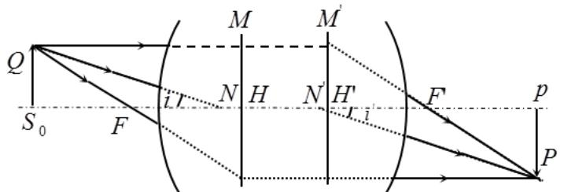
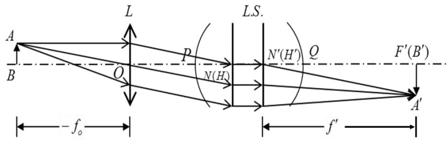
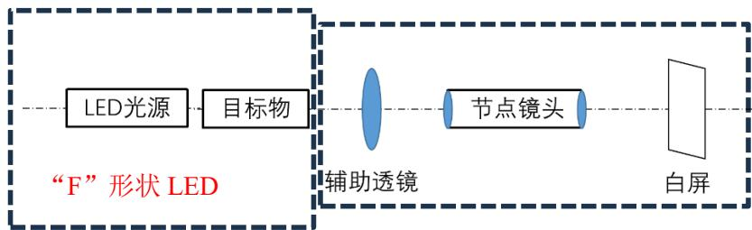
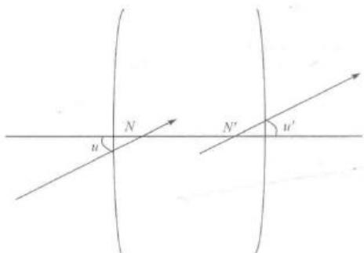
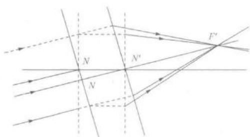

# 实验 1 光学系统基点的测量

对于共轴理想的光学系统，无论其结构简单还是复杂，物像之间的共轭关系完全由几对特殊的点和面组成，这些点和面就是共轴理想光学系统的基点和基面。每个厚透镜及共轴球面透镜组都有三对基点和三对基面，即主点H、H′和对应主面；节点N、N′和对应节面；焦点F、F′与对应焦面。

# 【实验目的】

1、了解透镜组基点的一般特性；

2、掌握测定光具组基点的方法。

# 【实验原理】

# 1、主面和主点

若将物体垂直于系统的光轴，放置在物方主点 $H$ 处，则必成一个与物体同样大小的正立的像于像方主点 $H ^ { \prime }$ 处，即主点是横向放大率 $\beta { = } { + } 1$ 的一对共轭点。过主点垂直于光轴的平面MH和M′H′，分别称为物方主面和像方主面，如图 2-2-1所示。

图 2-2-1 透镜组光路示意图

# 2、节点和节面

节点是角放大率 $\gamma { = } { + } 1$ 的一对共轭点。入射光线（或其延长线）通过物方节点 $N$ 时，出射光线（或其延长线）必通过像方节点 $N ^ { \prime }$ ＇，并于 $N$ 的入射光线平行（如图 2-2-1）。过节点垂直于主光轴的平面分别称为物方和像方节面。当共轴球面系统处于同一媒质时，两主点分别与两节点重合。

# 3、焦点和焦面

平行于系统主轴的平行光束，经系统折射后与主轴的交点 $F ^ { \prime }$ ，称为像方焦点；过 $F ^ { \prime }$ 垂直于主轴的平面称为像方焦面。像方主点 $H ^ { \prime }$ 到像方焦点 $F ^ { \prime }$ 的距离，称为系统的像方焦距 $f _ { i }$ ,此外，还有对应的物方焦点 $F$ 及焦面和焦距f。

综上所述，薄透镜的两主点和节点与透镜的光心重合，而共轴球面系统两主点和节点的位置，将随各组合透镜或折射面的焦距和系统的空间特性而异。实际使用透镜组时，多数场合透镜组两边都是空气，物方和像方媒质的折射率相等，此时节点和主点重合。

本实验以两个薄透镜组合为例，主要讨论如何测定透镜组的节点（主点）。设 $L$ 为已知焦距为 $f _ { 0 }$ 的凸透镜，L.S.为代测透镜组，其主点（节点）为 $H , ~ H ^ { \prime } ~ ( N , ~ N ^ { \prime } )$ ），像焦点为$F ^ { \prime }$ 。当物AB（高度已知）放在 $L$ 的前焦点处时，它经过 $L$ 以及 $L . S .$ 将成像 $A ^ { ' } B ^ { ' }$ 于 $L . S .$ .的后焦面上。如图2-2-2所示。

图 2-2-2 测量基点示意图

因为△AOB∽△A′ N′B′，即 $\mathrm { A B } / { - f _ { 0 } { = } \mathrm { A B } ^ { \prime } } \mathrm { \Delta }$ ?? ′

所以 $\begin{array} { r } { f ^ { \prime } = - f _ { 0 } \frac { \mathrm { A } ^ { \prime } B ^ { \prime } } { \mathrm { A B } } } \end{array}$ （2-2-1）

因此我们可以通过测量A′B′的大小，从而得到 $f ^ { \prime }$ 的数值。因为是平行光入射到透镜组上，所以像A′B′的位置就是 F′的位置。F′的位置既然确定，而 $N F { = } f ^ { ' }$ ，因此 $N ^ { ' }$ 的位置也就确定了。把L.S.的入射方向和出射方向互相置换，即可测定 $F$ 和 $N$ 的位置。本实验节点和主点重合，所以 $H$ 和 $H$ 的位置也得到确定。

# 【实验内容】

# 1、搭建系统基点测试光路

（1）如图2-2-3搭建透镜系统基点测量光路，自左向右依次为“F”形状LED 光源，辅助透镜（ $\phi { = } 5 0 \mathrm { m m }$ ， $f { = } 7 5 \mathrm { m m } ,$ ），节点镜头（镜片间距 $6 0 \mathrm { - } 1 1 0 \mathrm { m m }$ ，固定镜片 $\scriptstyle \phi = 4 0 \mathrm { m m }$ ， $f { = } 2 0 0$ mm，可动镜片 $\scriptstyle \phi = 4 0 { \mathrm { m m } }$ ， $f { = } 3 5 0 ~ \mathrm { m m } .$ ），白屏。

图 2-2-3 透镜系统基点测量光路示意图

（2）“F”形状 LED 光源。

（3）安装辅助透镜，在目标物后安装待测透镜，并调整透镜位置让“F”光斑入射到辅助透镜中心，并调整辅助透镜距离目标物为 $7 5 \mathrm { m m }$ （即目标物在辅助透镜的前焦面上）。

（6）安装节点镜头与白屏，前后调节白屏，直到在白屏上看到清晰倒“F”像。

# 2、结果记录及数据处理

（1）使用白屏上的尺子测量像高 $h _ { 2 }$ ，同时测量目标板上“F”物的参考尺寸 $h _ { 1 }$ ，辅助透镜焦距 $7 5 \mathrm { m m }$ ，将数据填入表 2-2-1。根据式（2-2-1），可计算像方焦距 $f$ 。

（2）以两个镜片相距 $6 0 \mathrm { m m }$ 为例，计算出像方焦距以后，成像清晰位置即为像方焦点，从像方焦点逆光量取一个像方焦距即为像方主点 $H$ ′位置（主点与节点重合，所以此位置也是像方节点位置）。

（3）将节点镜头旋转 $1 8 0 ^ { \circ }$ ，重复第（1）（2）步，即可获得物方焦点、主点和节点位置。

表 2-2-1 节点镜头物焦距记录表

<table><tr><td>两镜片距离L</td><td>物尺寸h1</td><td>像尺寸h2</td><td>辅助透镜-f0</td><td>像（物）方焦距f'</td><td>备注</td></tr><tr><td>70mm</td><td></td><td></td><td>75mm或150mm</td><td></td><td>0°</td></tr><tr><td>70mm</td><td></td><td></td><td>75mm或150mm</td><td></td><td>180°</td></tr><tr><td>90mm</td><td></td><td></td><td>75mm或150mm</td><td></td><td>0°</td></tr><tr><td>90mm</td><td></td><td></td><td>75mm或150mm</td><td></td><td>180°</td></tr><tr><td>110mm</td><td></td><td></td><td>75mm或150mm</td><td></td><td>0°</td></tr><tr><td>110mm</td><td></td><td></td><td>75mm或150mm</td><td></td><td>180°</td></tr></table>

# 【注意事项】

1、光学元件表面，尤其是通光面不得用汗手或者油手触摸。

# 【思考题】

1、系统的焦点、节点（主点）的位置和焦距的理论值与实际值相比较，其误差产生原因是什么？

# 理论值计算方法：

$$
\left\{ \begin{array}{l} f = \frac {f _ {1} f _ {2}}{d - f _ {1} ^ {\prime} + f _ {2}} \\ f ^ {\prime} = - \frac {f _ {1} ^ {\prime} f _ {2} ^ {\prime}}{d - f _ {1} ^ {\prime} + f _ {2}} \end{array} \right. \tag {1.2.1}
$$

$f _ { 1 } , f _ { 1 } ^ { \prime }$ $f _ { 2 } ^ { ' }$ $H _ { 1 } ^ { ' }$ $H _ { 2 }$ $d$ $f _ { 2 } ^ { \prime } = - f _ { 2 }$ $f ^ { \prime } = - f$ 

$N ^ { \prime }$ $N ^ { \prime }$ $N ^ { \prime }$ $N ^ { \prime } F ^ { \prime }$ $N ^ { \prime } F ^ { \prime }$ 

$N ^ { \prime }$ $N ^ { \prime } F ^ { \prime }$ 