# 实验 4 刀口阴影法测量光学系统像差综合实验

刀口阴影法可灵敏地判别会聚球面波前的完善程度。物镜存在的几何像差使得不同区域的光线成到像空间不同位置上。刀口在像面附近切割成像光束，即可看到具有特定形状的阴影图；另一方面，物镜的几何像差对应着出瞳处的一定波像差，并由此可求得刀口图方程及其相应的阴影图。反之，由阴影图也可检测典型几何像差。刀口阴影法所需设备简单，检测法方便、直观，故非常有实用价值。

# 【实验目的】

1、巩固光学系统像差理论。  
2、掌握刀口法测量光学透镜的像差原理和方法。

# 【实验原理】

对于理想成像系统，成像光束经过系统后的波面是理想球面(如图2-5-1所示) ，所有光线都会聚于球心O。此时用不透明的锋利刀口以垂直于图面的方向切割该成像光束，当刀口正好位于光束会聚点 O 点处(位置N2) 时，则全视场仍然是均匀的，但整体变暗一些 (阴影图 M2)。如果刀口位于光束交点之前(位置 $\mathrm { N } _ { 1 } )$ ，则视场中与刀口相对系统轴线方向相同的一侧视场出现阴影，相反的方向仍为亮视场(阴影图 $\mathbf { M } _ { 1 } )$ 。当刀口位于光束交点之后(位置 N3) ，则视场中与刀口相对系统轴线方向相反的一侧视场出现阴影，相同的方向仍为亮视场(阴影图M3)。（焦前刀影同方向，焦后刀影对面来，焦点阴影一齐暗）

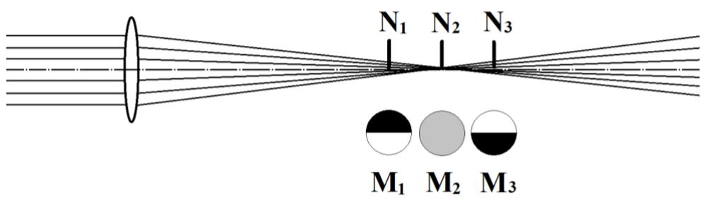

text_image

N₁ N₂ N₃
M₁ M₂ M₃

图 2-5-1 理想光学系统的刀口阴影示意图

实际光学系统由于存在球差，成像光束经过系统后不再会聚于轴上同一点。此时，如果用刀口切割成像光束， 根据系统球差的不同情况，视场中会出现不同的图案形状。图 2-5-2 是 4 种典型的球差以及其相应的阴影图。图 2-5-2(a)和(b)为球差校正不足和球差校正过度的情况，相当于单片正透镜和单片负透镜球差情况。

利用刀口阴影法对系统轴向球差进行测量时，我们需要判断出与视场图案中亮暗环带分界(呈均匀分布的半暗圆环) 位置相对应的刀口位置，一般系统球差的表示以近轴光束的焦点作为球差原点。

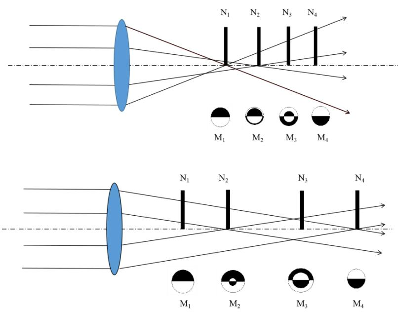

text_image

N₁ N₂ N₃ N₄
M₁ M₂ M₃ M₄
N₁ N₂ N₃ N₄
M₁ M₂ M₃ M₄

图 2-5-2 光学系统存在球差时的刀口阴影示意图

# 【实验内容】

# 1、球差的测量（环带光测试法）

（1）图2-5-3(a)是测量透镜球差的光路示意图。自左向右依次为LED光源(690nm)、平行光管、环带光阑、被测透镜（直径 40mm，f=200mm）、刀口、CMOS 相机。其中环带光阑为环形镂空目标板，直径分别为 10mm、20mm 和 30mm，本实验中可选择 10mm 和 20mm两种。调整相机位置，在刀口没有遮挡的情况下可以看到圆形光圈，如图 2-5-3(b)所示。

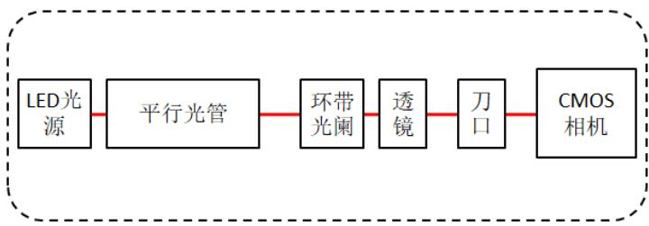

flowchart

(a)

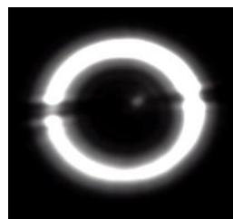

natural_image

Circular object with a bright ring and a small protrusion, resembling a lens or aperture (no text or symbols)

(b)   
图 2-5-3 球差测量光路示意图（环带光阑法）（a）和经过刀口的环形光圈（b）

（2）选用最小环带光阑，如果刀口在焦前或焦后横向遮挡光斑过程中出现的光斑形状如图2-5-4所示。如果移动刀口到会聚点，刀口恰好切到焦点可以看到环形光圈会同时变暗，读取平移台丝杆读数 $\mathrm { X } _ { 1 }$ ，记在表2-5-1；更换中号环带光阑，环带光聚焦位置发生变化，重新前后调整刀口位置，观察横向遮挡光斑的图样，直到观察到环带光同时变暗，记下此时平移台丝杆读数 $X _ { 2 }$ ，记在表 2-5-1。

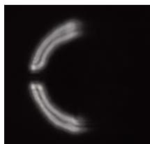

natural_image

Abstract curved light streaks on black background, no text or symbols present

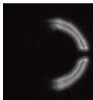

natural_image

Abstract curved light pattern on black background (no text or symbols)

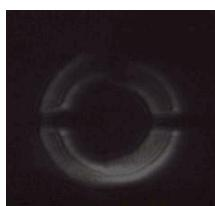

natural_image

Circular object with concentric rings and a central horizontal bar, resembling a ring or lens (no text or symbols visible)

图 2-5-4 刀口在焦前、焦后以及焦点处横向遮挡光斑过程中的图样

表 2-5-1 红色光源轴向球差

<table><tr><td></td><td> $X_1$ (mm)</td><td> $X_2$ (mm)</td><td>轴向球差 $\Delta X=X_2-X_1$ </td></tr><tr><td>1</td><td></td><td></td><td></td></tr><tr><td>2</td><td></td><td></td><td></td></tr><tr><td>3</td><td></td><td></td><td></td></tr></table>

# 2、球差的测量（整体阴影观察法）

（1）图2-5-5是阴影法测量球差光路示意图，自左向右依次包括LED光源(690nm)、平行光管、被测透镜（直径 40mm，f=100mm）、刀口和白屏。

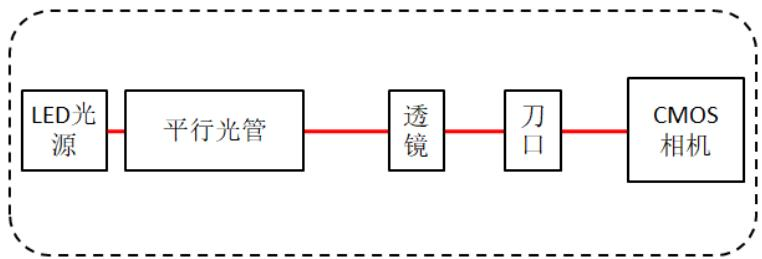

flowchart

图 2-5-5 刀口法观测球差光路示意图

（2）由于存在球差，通过待测透镜不同位置光束的聚焦点不在同一位置，形成弥散光斑，调整刀口到会聚点附近，横向移动刀口，可观察到如图2-5-6(a)、（b）阴影图。

# 3、像散的测量

（1）图 2-5-7 是测量透镜像散的光路示意图。自左向右依次为 LED 光源（690nm）、平行光管、环带光阑、被测透镜（直径40mm，f=200mm）、刀口和CMOS 相机。本系统中选择10mm直径的环带光阑目标板。  
（2）选择10mm直径的环带光阑，将透镜微转一个角度固定，在导轨方向改变刀口的前后位置，如刀口处于子午聚焦面与弧矢聚焦面中间时，刀口横向遮挡即可看到图 2-5-8中的某一幅，调整刀口位置使得阴影与水平面垂直，如图 2-5-8（第一幅）所示，记录平移台示数为 $\mathrm { X } _ { 1 }$ ；再次移动平移台可以看到阴影逐渐变化，直至与水平面重合，如图 2-5-8（最后一幅）所示，记录平移台示数为 $\mathrm { X } _ { 2 } ,$ ，记录在表2-5-3中。

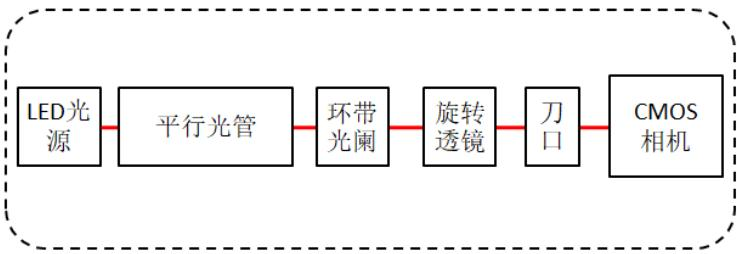

flowchart

图 2-5-7 测量透镜像散光路示意图

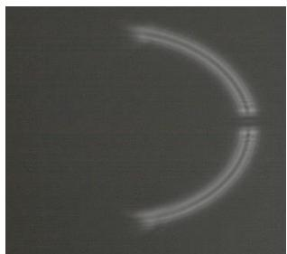

natural_image

Circular light streak on dark background, no text or symbols visible

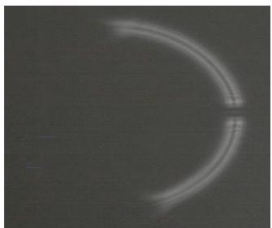

natural_image

Circular light streak on dark background, no text or symbols visible

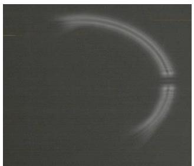

natural_image

Circular light streak on a dark background, resembling a crescent or ring (no text or symbols)

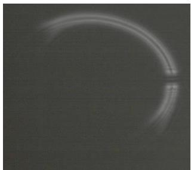

natural_image

Circular light streak on a dark background, resembling a crescent or ring (no text or symbols)

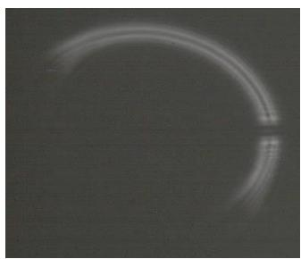

natural_image

Circular light streak on a dark background, resembling a ring or arc (no text or symbols)

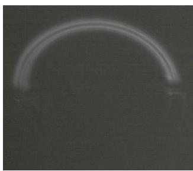

natural_image

A curved, translucent arc against a dark background, resembling a lens or arc, with no visible text or symbols.

图 2-5-8 刀口法测量像散效果图

表 2-5-3 像散数据记录

<table><tr><td>旋转角度\平移距离</td><td> $X_1$ (mm)</td><td> $X_2$ (mm)</td><td>透镜像散 $\Delta X=X_2-X_1$ </td></tr><tr><td>1(10°)</td><td></td><td></td><td></td></tr><tr><td>2(20°)</td><td></td><td></td><td></td></tr><tr><td>3(30°)</td><td></td><td></td><td></td></tr></table>

# 【注意事项】

1、调节螺旋丝杆时，注意不要超出其调节范围。

# 【思考题】

1、对测量数据进行分析，引起测量误差的因素有哪些？

# 【参考文献】

1、姚启钧 著 华东师范大学光学教材编写组改编，光学教程，高等教育出版社，第三版，2002  
2、郁道银、谈恒英，《工程光学》，机械工业出版社，2011