# 实验 5 星点法测量透镜像差综合实验

在应用光学领域中，光学系统成像质量的评价是一个重要问题。根据几何光学的观点，光学系统的理想状况是“点点成像”（点物成点像），即物空间一点发出的光能量在像空间也集中在一点上。但实际上像差的存在导致点物成弥散斑。评价一个光学系统像质优劣的依据是物空间一点发出的光能量在像空间的分布情况。在传统像质评价中，人们先后提出了许多像质评价的方法，其中用得最广泛的有分辨率法、星点法和阴影法（刀口法）。

# 5.1 星点法测量透镜色差

透镜所用的光学材料对于不同波长光的折射率是不同的，因此不同色光经透镜后有不同的传播光路，称之为色差。波长愈短、折射率愈大；波长愈长、折射率愈小。同一薄透镜对不同单色光的焦距也不同。色差可分为位置色差和倍率色差两种。按色光的波长由短到长，它们的像点离开透镜由近到远地排列在光轴上，这就是位置色差。倍率色差是一种因不同色光成像的高度（也即倍率）不同而造成的像大小的差异,它是以两种色光（此即F 光和C光）的主光线在高斯像面上的交点高度之差来度量，以符号Y'FC 表示。如图 1所示。

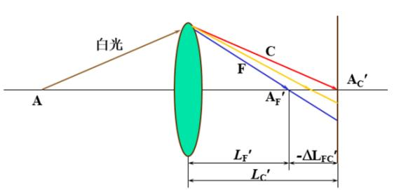

text_image

白光
A
C
F
A_F'
A_C'
L_F'
L_C'
-ΔL_FC'

（a）

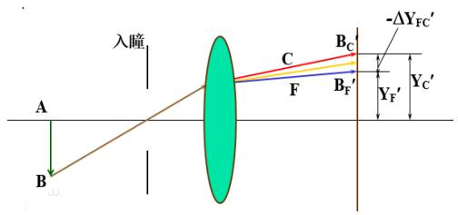

text_image

入瞳
A
B
C
F
Bc
Bf'
-ΔYFC'
Yf'
Yc'

图 1 色差示意图 （a）位置色差；（b）倍率色差

# 【实验目的】

1．理解色差的产生原理。  
2．学会用平行光管测量透镜的色差。  
3．掌握星点法测量成像系统单色像差的原理及方法

# 【实验仪器】

LED 光源、平行光管、环带光阑、被测透镜（直径 40mm，f 200mm）、CMOS 相机

# 【实验原理】

# 1、 星点法简介

光学系统对相干照明物体或自发光物体成像时，可将物光强分布看成是无数个具有不同强度的独立发光点的集合。每一发光点经过光学系统后，由于衍射和像差以及其它工艺疵病的影响，在像面处得到的星点像光强分布是一个弥散光斑，即点扩散函数。在等晕区内，每个光斑都具有完全相似的分布规律，像面光强分布是所有星点像光强的叠加结果。因此，星点像光强分布规律决定了光学系统成像的清晰程度，也在一定程度上反映了光学系统对任意物分布的成像质量。上述观点是进行星点检验的基本依据。

星点检验法是通过考察一个点光源经光学系统后在像面及像面前后不同截面上所成衍射像，根据星点像的形状及光强分布来定性评价光学系统成像质量好坏的一种方法。在光学仪器的生产过程中，早期曾利用圆孔衍射现象来检测透镜的质量，这种方法称为星点法。所谓星点就是一个个的小圆孔，通常工艺上采用带有许多小孔的半镀银板作为星点板。检验时把星点板放在显微镜的载物台上，这时光通过每个星点就产生一个小圆孔衍射图样。如果在显微镜下看到明亮的星点像，而且在中央亮点（艾里斑）周围的圆环条纹明暗相间、均匀对称，则这个物镜的质量就是合格的；如果质量有问题，则在显微镜中观察到的星点图将会畸变。

光学系统的像差或缺陷均会引起星点像产生变形或改变其光能分布。待检系统的缺陷不同，星点像的变化情况也不同。故通过将实际星点衍射像与理想星点衍射像进行比较，可反映出待检系统的缺陷并由此评价像质。

# 【实验内容】

# 1、光路的设计与调试

（1）参考图2搭建观测透镜色差的光路。自左向右依次为 LED 光源、平行光管、环带光阑、被测透镜（直径40mm，f200mm）、CMOS相机。其中，环带光阑为环形镂空目标板（如图3 示），本系统中有 10mm、20mm和30mm三种直径可供选择。

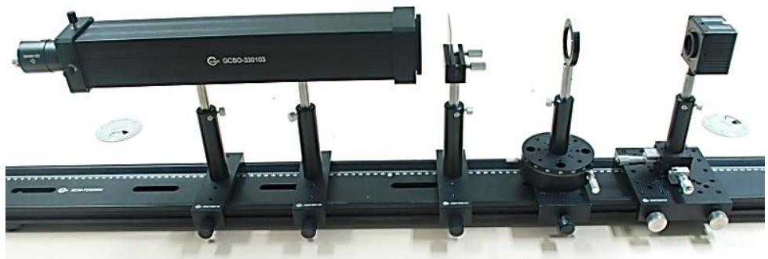

natural_image

Mechanical optical system with black components and mounting brackets (no visible text or symbols)

图 2 色差测量光路图

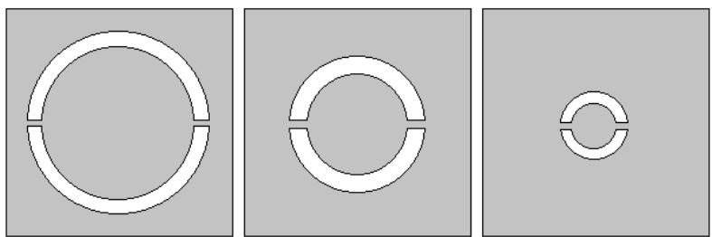

natural_image

Three abstract geometric diagrams showing circular ring structures with segmented inner segments, no text or symbols present.

图 3 带光阑示意图

（2）将蓝光LED (451nm)光源安装到平行光管上，适当调整针孔位置使其出射平行光。  
（3）安装被测透镜，调整透镜中心基本与平行光管的出光中心同高。  
（4）安装CMOS 相机，调整相机高度和距离，可以看到经过透镜的光束将会聚到相机靶面上，然后将相机固定在导轨上。  
（5）在平行光管和待测透镜中间安装环带光阑（推荐使用最小尺寸，测量色差时整个过

程应使用同一环带光阑），适当调整环带光阑高度使光阑中心与平行光管出光中心等高。

# 2、实验数据记录

(1) 适当调整蓝光 LED (451nm)光源强度，同时调整粗调 CMOS 相机位置，使得 CMOS相机上出现光斑如图 4a 所示圆环光斑，继续调整 CMOS 相机直到观测到一个会聚的亮点，如图 4b 所示，并记下此位置平移台上螺旋测微仪的读数 X1填到表 1；同时 CMOS 停止采集获得聚焦位置的像素坐标（a, b），如图5所示，并将数据填入表2。

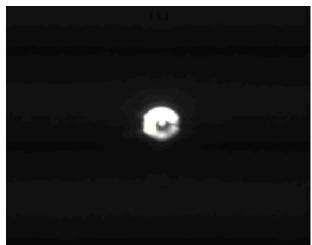

natural_image

Dark image with a faint, bright circular light source against a dark background (no text or symbols)

a

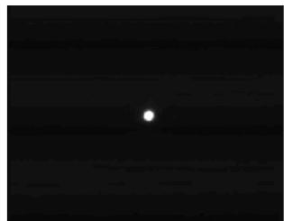

natural_image

Night sky with a single bright point against a dark background (no text or symbols)

b   
图 4 蓝光LED 聚焦点实物图

（2）关闭蓝光LED并取下，更换红色LED (690nm)，适当调整光源强度，可在相机上观察到视场图案如图 5c所示，相机靶面上呈现一个弥散斑。CMOS停止采集，用鼠标分别点击弥散斑上下边缘位置可以获得像素坐标（a，c）并填入表2；再次点击“实时采集”，调节平移台，使CMOS 相机向远离被测镜头方向移动，又可观测到一个会聚的亮点，如图6d所示，记下此时平移台上千分尺的读数为X2记录在表 1。

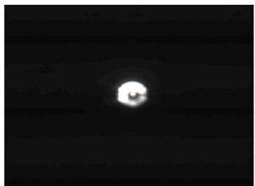

natural_image

Dark image with a faint, bright circular light source against a dark background (no text or symbols)

C

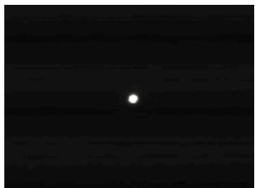

natural_image

A bright white dot centered on a dark, horizontal black background with no visible text or symbols.

d   
图 5 红光 LED 聚焦点实物图

# 3、实验数据处理

表1 位置色差表格

<table><tr><td></td><td> $X_1$ (mm)</td><td> $X_2$ (mm)</td><td>位置色差 $\Delta X=X_2-X_1$ </td></tr><tr><td>1</td><td></td><td></td><td></td></tr><tr><td>2</td><td></td><td></td><td></td></tr><tr><td>3</td><td></td><td></td><td></td></tr></table>

表2 倍率色差表格

<table><tr><td></td><td>b</td><td>c</td><td>c-b</td><td>倍率色差2.9×(c-b)</td></tr><tr><td>1</td><td></td><td></td><td></td><td></td></tr><tr><td>2</td><td></td><td></td><td></td><td></td></tr><tr><td>3</td><td></td><td></td><td></td><td></td></tr></table>

注：倍率色差=2.9(c-b) m，其中 CMOS 单个像素大小为 2.9m。

# 5.2 星点法观测单色像差

一般来讲，在实际光学系统中一定宽度的光束对一定大小的物体成像时往往存在成像的不完善，即对“点点成像”的偏离。在光源波长一致的情况下单色像差主要有五种：球差、彗差、像散、场曲和畸变。

# 【实验目的】

1、了解平行光管的结构及工作原理。  
2、了解单色像差的产生原理。  
3、掌握星点法测量成像系统单色像差的原理及方法。

# 【实验仪器】

LED光源、平行光管、环带光阑、被测透镜（直径40mm，f200mm）、CMOS 相机。

# 【实验原理】

# 1、平行光管结构介绍

根据几何光学原理，无限远处的物体经过透镜后将成像在焦平面上；反之，从透镜焦平面上发出的光线经透镜后将成为一束平行光。如果将一个物体放在透镜的焦平面上，那么它将成像在无限远处。

图1 为平行光管的示意图。它由物镜及置于物镜焦平面上的针孔和LED 光源组成。由于针孔置于物镜的焦平面上，因此当光源通过针孔并经过透镜后，会成为一束平行光。

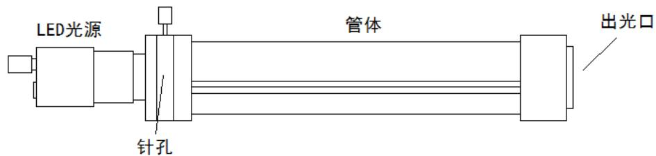

text_image

LED光源
针孔
管体
出光口

图 1 平行光管示意图

# 2、星点法介绍（略）

# 【实验内容】

# 1、球差的测量

# （1-1）光路的搭建与调试

（1）参考图2搭建测量透镜球差光路。自左向右依次为LED光源、平行光管、环带光阑、被测透镜（直径40mm，f200mm）、CMOS相机。其中环带光阑为环形镂空目标板，本系统中有10mm、20mm和 30mm三种直径可供选择，如图 3 示。  
（2）将红色 LED (690nm)光源安装到平行光管上，适当调整针孔位置使其出射平行光。  
（3）安装被测透镜，调整透镜中心基本与平行光管的出光中心同高。  
（4）安装 CMOS 相机，调整相机高度和距离，可以看到经过透镜的光束将会聚到相机靶面上，然后将相机固定在导轨上。  
（5）在平行光管和待测透镜中间安装环带光阑，适当调整环带光阑高度使光阑中心与平行

光管出光中心等高。

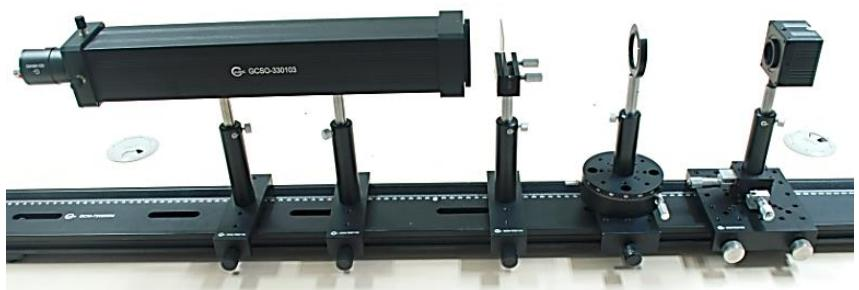

natural_image

Mechanical optical setup with a black rectangular beam mounted on a rail, accompanied by multiple lenses and mounting components (no visible text or symbols)

图 2 球差测量光路图

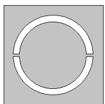

natural_image

Simple geometric shape: a white ring with two curved segments on a gray background (no text or symbols)

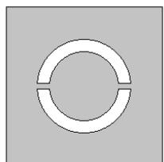

natural_image

Simple geometric shape: a double concentric circle with a horizontal line through it, on a gray background (no text or symbols)

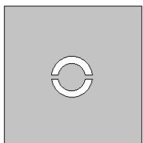

natural_image

Simple geometric diagram with a circular ring and two horizontal segments, no text or symbols present.

图 3 环带光阑示意图

# (2-2) 实验数据记录

（1）选用最小环带光阑，移动CMOS相机找到会聚点，如图4，读取平移台丝杆读数 $\mathrm { X } _ { 1 }$ ，记在表1；并获得聚焦位置像素坐标（a，b），并将数据填入表2。

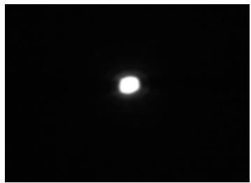

natural_image

A bright white circular light source centered on a black background, resembling a celestial body or light source against a dark background.

图 4 最小环带光阑的聚焦点

（2）更换大号环带光阑，相机靶面上呈现弥散光环，如图 ${ 5 \mathrm { a } } ,$ ，弥散斑与汇聚点的半径差即是透镜垂轴球差。点击弥散斑上下边缘位置可以获得像素坐标（a, c）并填入表 2；再次点击“实时采集”，调节平移台，使 CMOS 相机向靠近被测镜头方向移动，移动相机再次寻找会聚点，如图5b，读取平移台读数X ，记在表1；

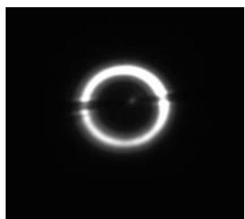

natural_image

Circular bright ring against a black background, resembling a celestial body or light source (no text or symbols)

a

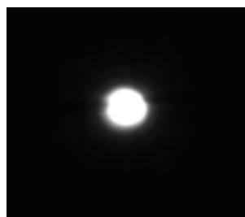

natural_image

A bright white circular light source centered on a black background, resembling a celestial body or light source against a dark background.

b   
图 5 大号光阑产生的弥散斑

# （2-3）实验数据处理

表1 红色光源轴向球差

<table><tr><td></td><td> $X_1$ (mm)</td><td> $X_2$ (mm)</td><td>轴向球差 $\Delta X=X_2-X_1$ </td></tr><tr><td>1</td><td></td><td></td><td></td></tr><tr><td>2</td><td></td><td></td><td></td></tr><tr><td>3</td><td></td><td></td><td></td></tr></table>

注：透镜对红色光源的轴向球差 $\Delta X { = } X _ { 2 } { \cdot } X _ { 1 }$ 。

表2 红色光源垂轴球差

<table><tr><td></td><td>b</td><td>c</td><td>c-b</td><td>垂轴球差2.9×(c-b)</td></tr><tr><td>1</td><td></td><td></td><td></td><td></td></tr><tr><td>2</td><td></td><td></td><td></td><td></td></tr><tr><td>3</td><td></td><td></td><td></td><td></td></tr></table>

注：垂轴球差=2.9（c-b）m，CMOS 单个像素大小为 2.9m。

# 2、 慧差的观察

# （2-1）光路的搭建与调试

（1）参考图6搭建观察慧差光路。自左向右依次为LED光源、平行光管、被测透镜（直径 40mm，f 200mm）、CMOS 相机。

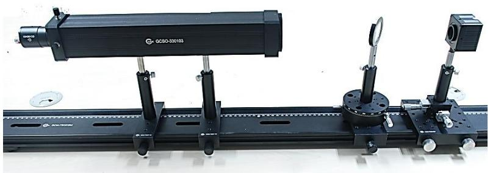

natural_image

Mechanical optical system with a black beam mounted on a rail, featuring a GCSO-330103 sensor and a magnified inset (no visible text or symbols)

图 6 星点法观测轴外像差实物图

（2）将红色LED(690nm)光源安装到平行光管上，适当调整针孔位置使其出射平行光。  
（3）分别安装被测透镜和CMOS 相机。

# （2-2）慧差的观测

（1）按图6沿光轴方向前后移动 CMOS 相机，找到通过透镜后，星点像中心光最强的位置。  
（2）轻微调节使透镜与光轴成一定夹角，转动透镜，观测 CMOS 相机中星点像的变化即慧差，效果图可参考图7所示。

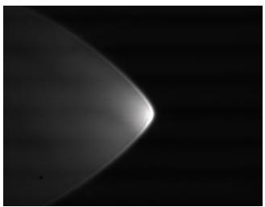

natural_image

Close-up of a bright, curved object against a dark background, resembling a comet or galaxy (no text or symbols visible)

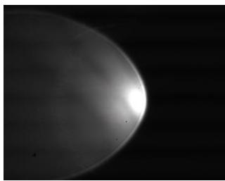

natural_image

Close-up grayscale image of a celestial body with a bright halo against a dark background (no text or symbols)

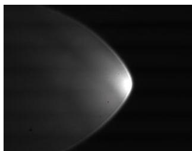

natural_image

Close-up grayscale image of a curved, elongated celestial body against a dark background (no text or symbols visible)

图 7 慧差观测图

# 3、像散的测量

# （3-1）光路的搭建与调试

（1）参考图8搭建测量透镜像散实验光路。自左向右依次为LED光源、平行光管、环带光阑、被测透镜（直径40mm，f200mm）、CMOS 相机。其中，环带光阑为环形镂空目标板，本系统中选择 10mm直径光阑。

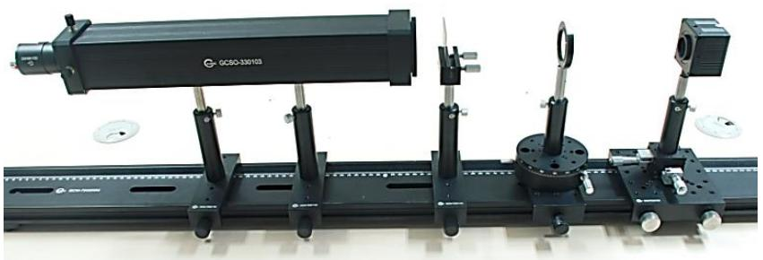

natural_image

Mechanical optical setup with a black beam mounted on a rail, featuring multiple lenses and a camera (no visible text or symbols)

图 8 透镜像散的光路图

（2） 将红色 LED(690nm)光源安装到平行光管上，适当调整针孔位置使其出射平行光。  
（3）分别安装被测透镜、CMOS相机和环带光阑。

# （3-2）实验数据记录

（1）在平行光管和被测透镜支架之间加入最小环带光阑，将透镜微转一个角度固定，在轴向改变平移台可以调整 COMS相机的前后位置，找到子午聚焦面如图 9a，平移台的示数X1，记录在表3。

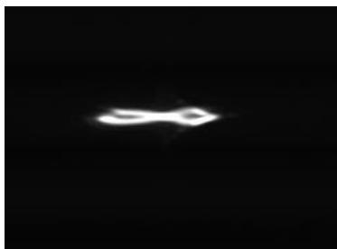

natural_image

Abstract white shape on black background with no text or symbols

（a）弧失方向聚焦图

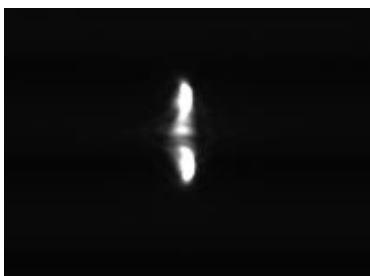

natural_image

Abstract white glow on black background, resembling a vertical beam or light source (no text or symbols)

（b）子午方向聚焦图  
图 9 像散聚焦图

（2）再次改变平移台位置可以看到COMS相机有弧矢聚焦变为子午聚焦，如图 9b所示，记录平移台的示数X2，填入表3。

# （3-3）数据处理与表格

表3 像散数据记录

<table><tr><td>平移距离旋转角度</td><td> $X_1$ (mm)</td><td> $X_2$ (mm)</td><td>透镜像散 $\Delta X=X_2-X_1$ </td></tr><tr><td>1</td><td></td><td></td><td></td></tr><tr><td>2</td><td></td><td></td><td></td></tr><tr><td>3</td><td></td><td></td><td></td></tr></table>

参考文献：

1、朱瑶，光学系统的星点检验方法，《红外》（月刊），9:31-37，2004

2、郁道银、谈恒英，《工程光学》，机械工业出版社，2011  
3、姚启钧 著 华东师范大学光学教材编写组改编，光学教程，高等教育出版社，第三版，2002。