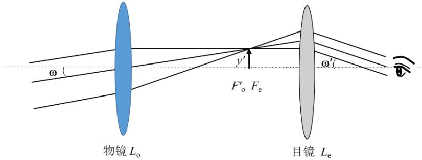
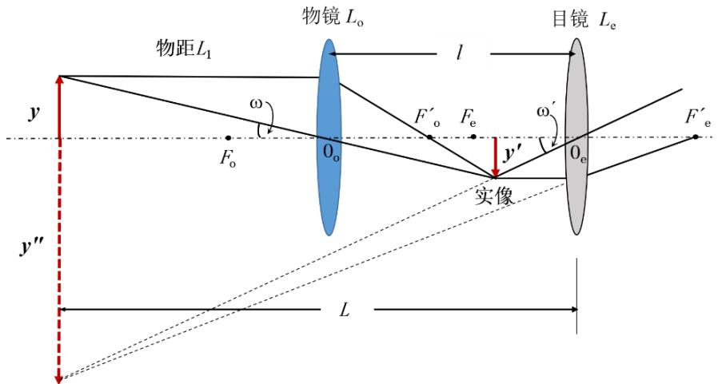
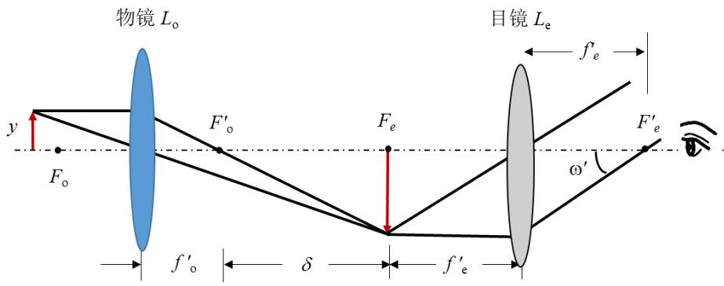
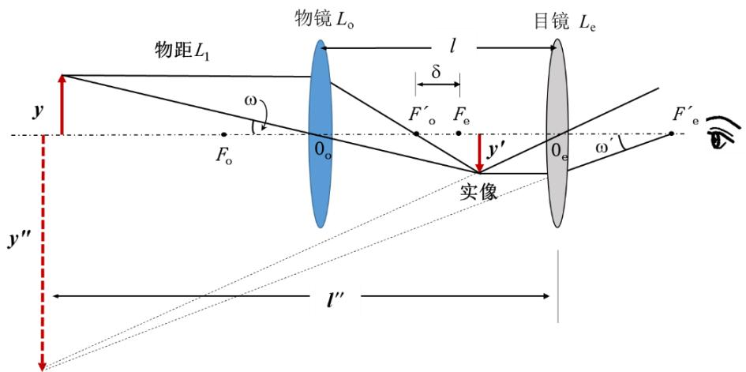
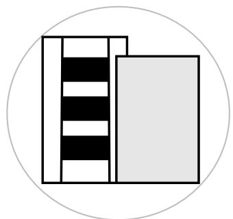
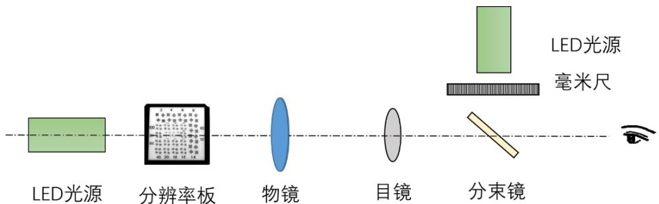
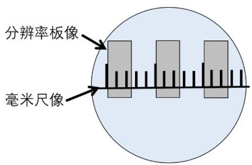

# 实验 2 望远镜与显微镜的设计与性能检测

望远镜是帮助人眼对远处的物体进行观察、瞄准与测量的一种助视光学仪器。观察者以对望远镜像空间的观察代替对物空间的观察，而所观察的像实际上并不比原物大，只是相当于把远处的物体移近，增大视角，以利观察。望远镜由物镜和目镜组成。物镜是用反射式的称为反射式望远物镜，用透射式称为折射式望远物镜。天文望远镜都是反射系统，使用有光焦的折叠反射镜来达到成像目的，如哈勃太空望远系统。目镜是会聚透镜的称为开普勒望远镜，目镜是发散透镜的称为伽利略望远镜。

显微镜主要是用来帮助人眼观察近处的微小物体。一般目镜的放大率不超过20。通过本实验使学生了解显微镜的结构和工作原理，通过自行搭建显微镜，测量相关参数。

# 【实验目的】

1、掌握望远镜的构造和工作原理。  
2、了解测定望远镜的视角放大率和视场角的方法。  
3、掌握显微镜的构造和工作原理。  
4、了解显微镜放大倍数的测量原理和方法。

# 【实验仪器】

1、 目镜（直径=20mm，f=30mm），物镜（直径=40mm，f=150mm），标尺  
2、分束镜，目镜（直径=20mm，f=30mm），物镜（直径=50mm，f=75mm），分辨率板，LED光源（含匀光器）

# 【实验原理】

# （一）望远镜

望远镜是如何把远处的景物移到我们眼前来的呢？这靠的是组成望远镜的两块透镜。望远镜的前端是一块直径大、焦距长的凸透镜，称为物镜；后端是一块直径小、焦距短的透镜，称为目镜。物镜把来自远处景物的光线会聚成倒立缩小的实像，相当于把远处景物移近到成像的地方。而这景物的倒像又恰好落在目镜的前焦点处，这样对着目镜看，就好像拿放大镜看东西，可以看到一个放大了许多倍的虚像。这样远处的景物通过望远镜看，就仿佛近在眼前。

# 1、望远镜分类

常见望远镜可分为伽利略望远镜和开普勒望远镜。伽利略发明的望远镜在人类认识自然的历史中占有重要地位。它由一个凹透镜（目镜）和一个凸透镜（物镜）构成。其优点是镜筒短、结构简单，能直接成正像，但视场小，无法在镜筒内放分划板。因此自从开普勒望远镜发明后，此种结构已不被专业级的望远镜采用，而多被玩具级的望远镜采用。

开普勒望远镜是由两个凸透镜构成，如图2-3-1所示。由于两者之间有一个实像，可方便的安装分划板，并且各种性能优良，所以目前军用望远镜，小型天文望远镜等专业级的望远镜都采用此种结构。但这种结构成像是倒立的，所以要在中间增加正像系统。

为能观察到远处的物体，物镜用较长焦距的凸透镜，目镜用较短焦距的凸透镜。远处射来光线（视为平行光），经过物镜后会聚在后焦点附近，成一倒立、缩小的实像。目镜的前焦点和物镜的后焦点重合，所以物镜的像作为目镜的物体，从目镜可看到远处物体的倒立实像，由于增大了视角，故提高了分辨能力。

text_image

物镜 L₀
F'₀ Fₑ
y′
目镜 Lₑ
ω
ω′

图 2-3-1 开普勒望远镜光路示意图

# 2、望远镜的视角放大率

当观测无限远处的物体时，物镜的焦平面和目镜的焦平面重合，物体通过物镜成像在它的后焦面上，同时也处于目镜的前焦面上，因而通过目镜观察时成像于无限远，光学仪器所成的像对人眼的张角为，物体直接对人眼的张角为，则视角放大率：

$$
\Gamma = \frac {\tan \omega^ {\prime}}{\tan \omega} \tag {2-3-1}
$$

由几何光路可知：

$$
\tan \omega = \frac {y ^ {\prime}}{f _ {o} ^ {\prime}}, \quad \tan \omega^ {\prime} = \frac {y ^ {\prime}}{f _ {e} ^ {\prime}} \tag {2-3-2}
$$

因此，望远镜的视角放大率：

$$
\Gamma_ {\mathrm{T}} = \frac {f _ {o} ^ {\prime}}{f _ {e} ^ {\prime}} \tag {2-3-3}
$$

由此可见，望远镜的视角放大率 等于物镜和目镜焦距之比。若要提高望远镜的放大率，可增大物镜的焦距或减小目镜的焦距。

# 3、物像共面时的视角放大率（实验室研究这种情况）

当望远镜的被观测物位于有限远时，望远镜的视角放大率可以通过移动目镜把像推远到与物y在一个平面上来测量，如图 2-3-2。

text_image

物镜 L₀
物距L₁
l
ω
F′₀ Fₑ
y
0₀
y′
0ₑ
F′ₑ
y″
L
实像

图 2-3-2 测望远镜物像共面时的视角放大率的示意图

此时： tan ω'= $\tan \omega ^ { \prime } { = } \frac { y ^ { \prime \prime } } { L } \ , \quad \tan \omega { = } \frac { y } { L _ { 1 } }$

于是可以得到望远镜物像共面时的视角放大率：

$$
\Gamma_ {T} = \frac {\tan \omega^ {\prime}}{\tan \omega} = \frac {y ^ {\prime \prime}}{L} \cdot \frac {L _ {1}}{y} = \frac {L _ {1}}{L} \frac {f _ {o} ^ {\prime} (L + f _ {e} ^ {\prime})}{f _ {e} ^ {\prime} (L _ {1} - f _ {o} ^ {\prime})} \tag {2-3-4}
$$

可见，当物距 $L _ { 1 }$ 大于 20倍物镜焦距 $f _ { \mathrm { o } } ^ { \prime }$ 时，它和无穷远时的视角放大率差别很小。

# （二）显微镜

# 1、显微镜简介

望远镜用于观察远处的大物体，而显微镜用于观察近处的小物体。显微镜的光学系统是由焦距较短的物镜 $L _ { \mathrm { o } }$ 和 $L _ { \mathrm { e } }$ 组成，且均为会聚透镜。位于物镜物方焦点附近的微小物体经物镜放大后，先成一放大实像，此实像再经目镜成像于无穷远处，这两次放大都使得视场角增大。为了适于观察近处的物体，显微镜的焦距都很短。

text_image

物镜 L₀
目镜 Lₑ
F′ₑ
F′ₒ
Fₑ
F′ₒ
y
Fₒ
δ
f′ₑ
ω′

图 2-3-3 显微镜基本光学系统

# 2、显微镜的视角放大率

显微镜的视角放大率定义为像对人眼的张角的正切和物在明视距离 D=250mm 处时直接对人眼张角的正切之比。于是由三角关系得：

$$
\Gamma_ {M} = \frac {y ^ {\prime} / f _ {e} ^ {\prime}}{y / D} = \frac {D y ^ {\prime}}{f _ {e} ^ {\prime} y} = \frac {D \delta}{f _ {e} ^ {\prime} f _ {0} ^ {\prime}} = \beta_ {0} \Gamma_ {e} \tag {2-3-4}
$$

其中， $\beta _ { o } = y ^ { \prime } / y = \delta / f _ { o } ^ { \prime }$ 为物镜的线放大率， $\varGamma _ { \mathrm { e } } = D / f _ { e } ^ { \prime }$ 为目镜的视角放大率。从上式可看出，显微镜的物镜和目镜焦距越短，光学间隔越大，显微镜的放大倍数越大。

当显微镜成虚像于距目镜为 l"的位置上，而人眼在目镜后焦点处观察时，显微镜的视角放大率为：

$$
\Gamma_ {M} = \frac {y ^ {\prime \prime} / \left(l ^ {\prime \prime} + f _ {e} ^ {\prime}\right)}{y / D} = \frac {y ^ {\prime \prime} / \left(l ^ {\prime \prime} + f _ {e} ^ {\prime}\right)}{y ^ {\prime} / D} \frac {y ^ {\prime}}{y} = \frac {D y ^ {\prime}}{f _ {e} ^ {\prime} y} = \beta_ {o} \Gamma_ {e} \tag {2-3-5}
$$

中间像并不在目镜的物方焦平面上， $\beta _ { 0 } = y ^ { \prime } / y \neq \delta / f _ { 0 } ^ { \prime }$ 。这时视角放大率的测量可通过一个与主光轴成 $4 5 ^ { \circ }$ 的半透半反镜把标尺成虚像至显微镜的像平面，直接比较测量像长 $y ' ^ { \prime \prime }$ ，即可得出视角放大率：

$$
\Gamma_ {M} = y ^ {\prime \prime} / y \tag {2-3-6}
$$

text_image

物距L₁
物镜 L₀
l
δ
F′₀ Fₑ
y
ω
O₀
y′
0ₑ
ω′
F′ₑ
y″
l″
实像

图 2-3-4 显微镜成像于有限远时的光路图

# 【实验内容】

# （一）望远镜

（1）搭建开普勒望远镜系统，依次为目镜（直径=20mm，f=30mm）、物镜（直径=40mm，f=150mm）、标尺。目标物标尺与物镜间的距离一般大于 2倍物镜焦距。  
（2）观察中，用一只眼睛通过望远镜的目镜看标尺的像，移动目镜，最终通过目镜看到标尺被放大的清晰像；同时用另一只眼睛直接观察标尺。两只眼睛适应性练习观察，最终从目镜中能看到望远镜放大标尺像和直接看到的标尺重合，且两者之间基本没有视差。  
（3）视场中标尺和像如图 2-3-4所示，图中左边是标尺，右边是像。

natural_image

Simple diagram of stacked rectangular blocks inside a circle (no text or symbols)

图 2-3-4 标尺（左）及放大像（右）示意图

（4）测出与标尺像（右边）上n格所对应的标尺（左边）上的m格（图 2-3-4中 $m { = } 6 ,$ ，其中3个黑格，3个白格），并将m值填入表2-3-1中，则放大率实验值为 $\begin{array} { r } { \ d _ { \mathrm { I } } \Gamma _ { \mathrm { e } } = \frac { m } { n } , } \end{array}$ ，多次测量取平均值，视角放大率实验值 ${ \cal T } _ { \mathrm { e } } = ( { \cal T } _ { 1 } + { \cal T } _ { 2 } + { \cal T } _ { 3 } ) / 3$ 。测量放大率与计算得到的视角放大率$f _ { o } ^ { \prime } / f _ { e } ^ { \prime }$ 作比较。

表2-3-1 望远镜实验结果记录表

<table><tr><td>测量序号</td><td>1</td><td>2</td><td>3</td></tr><tr><td>物格数m</td><td></td><td></td><td></td></tr><tr><td>像格数n</td><td></td><td></td><td></td></tr><tr><td> $\Gamma_{\mathrm {e}}$ </td><td></td><td></td><td></td></tr></table>

（5）测定物距 $L _ { 1 }$ （标尺与物镜的距离）以及目镜与标尺的距离 L，根据望远镜物像共面时的放大率公式计算望远镜放大率的理论值T。

（6）比较实验值与计算值，计算相对偏差。

$$
\mathrm{E} = \frac {\Gamma_ {\text {实验}} - \Gamma}{\Gamma} \times 100 \%
$$

# （二）显微镜

（1）搭建如图2-3-5显微镜系统，导轨上依次放置分束镜，目镜（直径=20，f=30mm），物镜（直径=50，f=75mm），分辨率板，LED光源（含匀光器），导轨外由远及近分别为LED 光源（含匀光器）和毫米尺。（注意：分束镜按 45反射角放置；分辨率板与物镜之间的距离介于物镜的一倍焦距和二倍焦距之间；在距离分束镜明视距离处放置毫米尺，然后用照明光源照亮）

text_image

LED光源
分辨率板
物镜
目镜
分束镜
LED光源
毫米尺

图 2-3-5 测显微镜视放大率实际光路图（人眼紧贴分束镜观察）

（2）调整观察位置，在视野中可以同时观察到分辨率板的“条纹”和毫米尺的刻度像（毫米尺在分束镜明视距离 250mm处），如图 2-3-6所示。

text_image

分辨率板像
毫米尺像

图 2-3-6 视野中分辨率板像和毫米尺像

参考如下数据完成计算过程，如物镜与目镜之间距离为 324mm，目标板与物镜之间距离为105mm，在视场中可清楚看到 4号（2号黑条纹实际宽度 d为 0.5mm，4号黑条纹实际宽度为0.25mm）的清晰像。

（3）如图2-3-6中，上下左右移动眼睛，寻找到清晰完整的条纹，通过刻度尺测定条纹像宽度 $d ^ { \prime }$ 。根据读出的宽度 $d ^ { \prime } .$ 与实际宽度d，即可算出显微镜放大倍数的实验值 Γ，完成表2-3-2。

表2-3-2 显微镜实验结果记录表

<table><tr><td>测量序号(4号)</td><td>1</td><td>2</td><td>3</td></tr><tr><td>条纹宽度d/mm</td><td>0.25</td><td>0.25</td><td>0.25</td></tr><tr><td>条纹像宽d&#x27;/mm</td><td></td><td></td><td></td></tr><tr><td> $\Gamma_{\text{实验}} = d'/d$ </td><td></td><td></td><td></td></tr></table>

（4）显微镜的视角放大率是物镜放大率与目镜放大率的乘积，其中物镜放大率$\beta _ { o } = y \prime y = q _ { o } / l _ { 1 }$ ，目镜放大率 $\Gamma _ { e } = D / f _ { e } ^ { ' }$ 。是目标物到物镜之间的距离， $q _ { 0 }$ 是物镜到所成像的距离，其中 $l _ { 1 }$ 可以测量出， $q _ { 0 }$ 可以根据成像公式计算出，所以可以求出 $\beta _ { \circ }$ 。目镜放大率中 D 为明视距离 250mm， $f _ { e } ^ { \prime }$ 为目镜焦距，可求出目镜放大率，最终可以计算理论放大倍数。

（5）比较实验值与计算值，计算相对偏差。

# 【思考题】

1、开普勒望远镜和显微镜均是由两个凸透镜组成，提高望远镜的放大率可通过增大物镜的焦距或减小目镜的焦距实现；但是提高显微镜的放大率却是选用焦距较短的物镜和目镜实现，请说明原因。

2、利用工程光学知识，试推导公式（2-3-4），（2-3-5）。

# 【参考文献】

1、姚启钧 著 华东师范大学光学教材编写组改编，光学教程，高等教育出版社，第三版，2002。

2、郁道银、谈恒英，《工程光学》，机械工业出版社，2011