# 实验 3 薄透镜焦距三种测量方法

# 【实验目的】

1. 学会调节光学系统共轴。  
2. 掌握薄透镜焦距的常用测定方法。  
3. 研究透镜成像的规律。

# 测量方法一：自准直法测薄透镜焦距实验

自准直法是光学实验中常用的方法。在光学信息处理中，多使用平行光束，而自准直法可作为检测平行光的手段之一。同时在工程应用中，自准直法还可简单快速地测量透镜焦距。

# 【实验仪器】

“F”形状LED光源、待测透镜（直径 $5 0 \mathrm { m m }$ ，焦距 $2 0 0 \mathrm { m m }$ ）、反射镜。

# 【实验原理】

如图1所示，若物体 AB正好处在透镜L的前焦面处，那么物体上各点发出的光经过透镜后，变成不同方向的平行光，经透镜后方的反射镜 M 把平行光反射回来，反射光经过透镜后，成一倒立的与原物大小相同的实像 $A ^ { \prime } B ^ { \prime }$ ，像 $A ^ { \prime } B ^ { \prime }$ 位于原物平面处。即成像于该透镜的前焦面上。此时物与透镜之间的距离就是透镜的焦距 $f$ ，它的大小可用刻度尺直接测量出来。

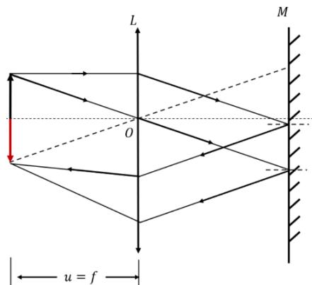  
图 1 自准直法测会聚透镜焦距原理图

# 【实验内容】

# 1、光路搭建与调试

参照图2 搭建自准直测量透镜焦距光路，自左向右依次为“F”形状LED光源，待测透镜（直径 $5 0 \mathrm { m m }$ ，焦距 $2 0 0 \mathrm { m m }$ ），反射镜。

（1）安装“F”形状 LED光源在导轨上。  
（2）安装待测透镜。调整透镜位置让“F形”光斑入射到待测透镜中心。  
（3）安装反射镜。在紧挨待测透镜后安装反射镜，调整反射镜高度使待测透镜出射光斑打在反射镜中心，并调整反射镜的反射角度，让反射的光斑与目标物的光斑在同一高度。  
（4）同时移动反射镜和待测透镜，直至在目标板上获得镂空图案的倒立实像始终最清晰且与物等大（形成长方形外轮廓）。

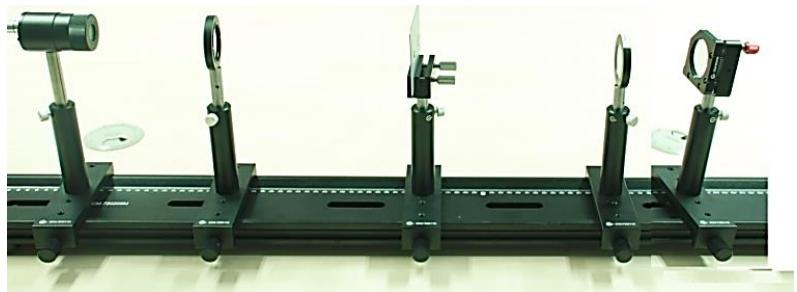  
图 2 自准直光路实验图

# 2、结果记录及数据处理

（1）用尺子分别测量出目标板和被测透镜的位置 a1、 $a _ { 2 }$ ，分别填入表 1，并利用 $f { = } a _ { 1 } { - } a _ { 2 }$ 计算透镜焦距。  
（2）重复3次实验，计算焦距，取平均值。

表1自准直测量透镜焦距记录表  

<table><tr><td>测量次数</td><td>目标板位置a1</td><td>被测透镜位置a2</td><td>透镜焦距f</td></tr><tr><td>1</td><td></td><td></td><td></td></tr><tr><td>2</td><td></td><td></td><td></td></tr><tr><td>3</td><td></td><td></td><td></td></tr><tr><td colspan="3">焦距平均值</td><td></td></tr></table>

# 测量方法二：二成像法测薄透镜焦距实验

二次成像法测量焦距是通过两次成像，测量出相关数据，通过成像公式计算出透镜焦距。

# 【实验仪器】

“F”形状 LED 光源、待测透镜（直径 $5 0 \mathrm { m m }$ ，焦距 $2 0 0 \mathrm { m m }$ ）、白屏。

# 【实验原理】

由透镜两次成像求焦距方法如下：

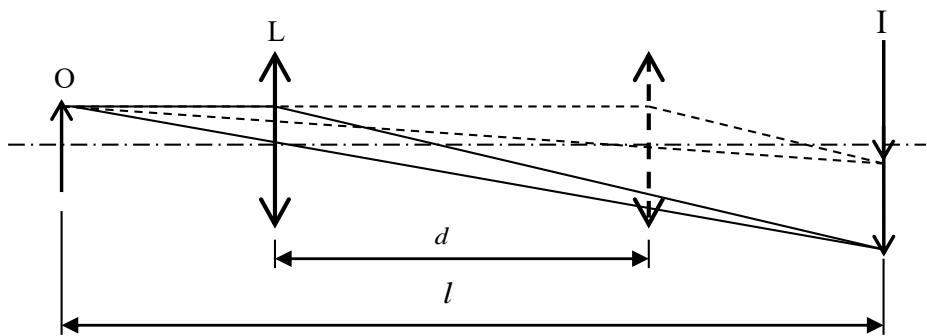  
图 1 透镜两次成像原理图

当物体与白屏的距离 $l { > } 4 f$ 时，保持其相对位置不变，则会聚透镜置于物体与白屏之间，可以找到两个位置，在白屏上均能看到清晰像。如图 1所示，透镜两位置之间的距离绝对值为 $d$ ，运用物像的共扼对称性质，容易证明

$$
f ^ {\prime} = \frac {l ^ {2} - d ^ {2}}{4 l} \tag {1}
$$

上式表明：只要测出 $d$ 和l，就可以算出 $f ^ { \prime }$ ′。由于通过透镜两次成像而求得的 $f ^ { \prime }$ ′,这种方法称为二次成像法或贝塞尔法。这种方法无需考虑透镜厚度，因此用这种方法测出的焦距一般较为准确。

# 【实验内容】

# 1、光路搭建与调试

如图2搭建二次成像测量透镜焦距光路，自左向右依次为“F”形状LED 光源，待测透镜（直径 $5 0 \mathrm { m m }$ ，焦距 $1 5 0 \mathrm { m m }$ ），白屏。

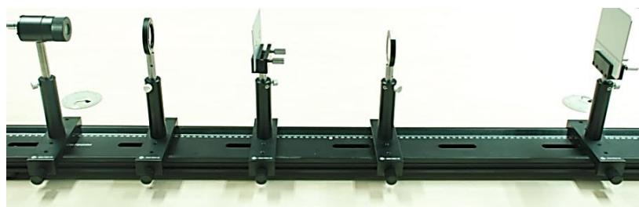  
图 2 二次成像测量透镜焦距光路图

（1）安装“F”形状 LED光源在导轨上。

（2）安装待测透镜。在目标物后安装待测透镜，并调整透镜位置让“F 形”光斑入射到待测透镜中心。  
（5）安装白屏。调整白屏与目标物之间的距离不小于 $6 0 0 \mathrm { m m }$ （目标板与分划板之间的距离 $l > 4 f ^ { \prime }$ ）。

# 2、结果记录及数据处理

（1）待测透镜从目标板位置向白屏方向移动，可以观察到两次清晰成像的位置，分别记录待测透镜的位置 $a _ { 1 }$ 、 $a _ { 2 }$ ，透镜两次距离 $d = a _ { 2 } - a _ { 1 }$ 。同时测量目标板到白屏的距离l，分别填入表 2，并利用 f ' = $f ^ { \prime } { = } \frac { l ^ { 2 } - d ^ { 2 } } { 4 l }$ ，计算透镜焦距。

（2）重复3次实验，计算焦距，取平均值。

表 2 二次成像测量透镜焦距记录表  

<table><tr><td>测量次数</td><td>第一次清晰成像位置a1</td><td>第二次清晰成像位置a2</td><td>目标到白屏距离l</td><td>透镜焦距</td></tr><tr><td>1</td><td></td><td></td><td></td><td></td></tr><tr><td>2</td><td></td><td></td><td></td><td></td></tr><tr><td>3</td><td></td><td></td><td></td><td></td></tr></table>

# 测量方法三： 焦距仪测量薄透镜焦距实验

平行光管是一种长焦距、大口径，并具有良好像质的仪器。它与前置镜或测量显微镜组合使用，既可用于观察、瞄准无穷远目标，又可作光学部件，光学系统的光学常数测定以及成像质量的评定和检测。

# 【实验目的】

1、了解平行光管的结构及工作原理。  
2、掌握平行光管的光路调节方法。  
3、学会用平行光管测量薄透镜的焦距。

# 【实验仪器】

LED 光源、平行光管（安装目标板）、被测透镜（ $\Phi 4 0$ ， $\mathrm { f } 2 0 0 \mathrm { m m }$ ）、CMOS 相机

# 【实验原理】

根据几何光学原理，无限远处的物体经过透镜后将成像在焦平面上；反之，从透镜焦平面上发出的光线经透镜后将成为一束平行光。如果将一个物体放在透镜的焦平面上，那么它将成像在无限远处。

图1 （a）为平行光管的结构原理图。它由物镜及置于物镜焦平面上的分划板，光源以及为使分划板被均匀照亮而设置的毛玻璃组成。由于分划板置于物镜的焦平面上，因此，当光源照亮分划板后，分划板上每一点发出的光经过透镜后都成为一束平行光。又由于分划板上有根据需要而刻成的分划线或图案（如图1（b）所示），这些刻线或图案将成像在无限远处。这样，对观察者而言，分划板相当于一个无限远距离的目标。

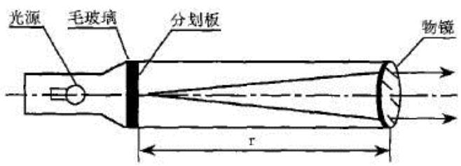  
（a）

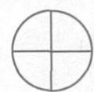

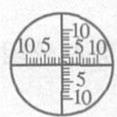  
b

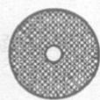  
  
（b）  
图 1 平行光管的结构原理图（a）和分划板的几种形式（b）

用平行光管法测量凸透镜焦距的光路图如图 2 所示。由光路图 2 中看出 $\varphi = \frac { y } { f _ { o } ^ { \prime } }$

$$
\tan \varphi_ {1} ^ {\prime} = \frac {y ^ {\prime}}{f _ {x} ^ {\prime}}
$$

平行光管射出的是平行光，且通过透镜光心的光线不改变方向，因此

$$
\varphi = \varphi^ {\prime} = \varphi_ {1} = \varphi_ {1} ^ {\prime}
$$

$$
\frac {y}{f _ {o} ^ {\prime}} = \frac {y ^ {\prime}}{f _ {x} ^ {\prime}}
$$

$$
f _ {x} = \frac {y ^ {\prime}}{y} f _ {o} ^ {\prime} \tag {1}
$$

其中 $f _ { o } ^ { \prime }$ 为平行光管物镜焦距， $y$ 为玻罗板上选择的线对长度， $y ^ { \prime }$ 为用摄像机读出的目标板上线对像的距离。用这种方法测量凸透镜焦距比较简单，关键是要保证各光学元件要等高共轴，平行光管出射平行光。

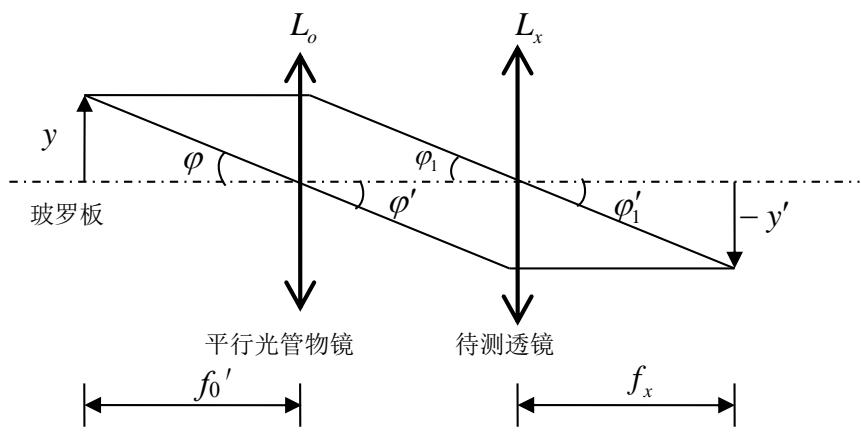  
图 2 平行光管法测量凸透镜焦距光路图

# 【实验内容】

# 1、光路搭建与调试

参考图3搭建焦距测量实验光路。自左向右依次为LED光源、平行光管（安装目标板）、被测透镜（ $\Phi 4 0$ ， $f 2 0 0 \mathrm { m m }$ ）、CMOS相机。

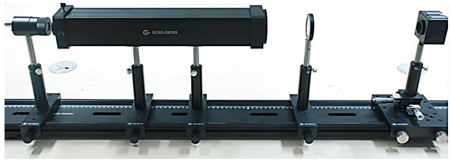  
图 3 焦距测量光路图

（1）安装平行光管。调整平行光管高度并固定，如果平行光管没有使用分划板需要在平行光管前安装分划板。

（2）安装 LED 光源。将匀光器安装在 LED 前面，然后将 LED 摆放到如图 3 所示位置。  
（3）安装待测透镜。实验中选择 $\Phi 4 0$ ， $f 2 0 0 \mathrm { m m }$ 的待测透镜，待测透镜高度使透镜中心与平行光管透镜中心重合。  
（4）安装 CMOS 相机。调整相机高度与待测透镜相同，然后调整相机前后位置，相机与透镜间距约 $1 5 0 \mathrm { m m }$ ，此时可以在相机上看到分划板像。

# 2、实验数据记录

（1）适当调整相机曝光时间和光源强度，并前后移动相机，保证采集像最清楚，如图 4所示，如果图像采集出现光斑分布不均匀或者偏离中心较大，可以适当调整 LED 照明光源的前后。  
（2）点击相机“停止采集”，并将图像存储到本地。

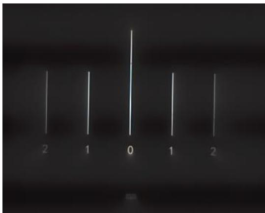  
图 4 分划板像

# 3、软件操作及数据处理

（1）运行“实验软件\应用光学实验软件\焦距测量实验软件\焦距测量实验软件.EXE”，如图5所示。

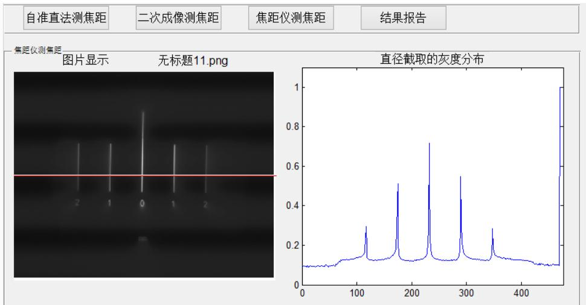  
图 5 焦距测量软件截图（单位像素 $2 . 9  { \mu \mathrm { ~ m ~ } }$ ）

（2）选择“焦距仪测焦距”，点击“读取图片”读取相应数据图，填写“圆实际大小/物高”为$4 \mathrm { m m }$ （最小线间距 $1 \mathrm { m m }$ ，最大线间距 $4 \mathrm { m m }$ ）。  
（3）如图5获取最左和最右峰为 P1和P2。

（4）将读取的P1，P2的横坐标填入相应位置，点击计算直径即可获得像的大小，填写平行光管的焦距 $f 4 0 0 \mathrm { m m }$ ，即可计算待测透镜焦距。

（5）3次测量求取平均值，完成表 1。

表 1 焦距仪测量薄透镜焦距的实验记录表  

<table><tr><td>测量次数</td><td>1</td><td>2</td><td>3</td><td>平均值（mm）</td></tr><tr><td>透镜1（200mm）</td><td></td><td></td><td></td><td></td></tr><tr><td>透镜2（换 150mm）</td><td></td><td></td><td></td><td></td></tr></table>

# 【思考题】

1、画出测薄透镜焦距的三种方法的光路图  
2、 比较自准直法、二次成像法以及平行光管测量薄透镜焦距的优势与不足？

# 参考文献：

1、郁道银、谈恒英，《工程光学》，机械工业出版社，2011  
2、姚启钧 著 华东师范大学光学教材编写组改编，光学教程，高等教育出版社，第三版，2002。