# 实验二 光栅参数测量实验

# 实验原理—— 衍射光栅

光栅概述：衍射光栅是一种应用非常广泛、非常重要的光学元件，通常讲的衍射光栅都是基于夫朗和费多缝衍射效应进行工作的。

由大量等宽、等间距、平行排列的狭缝 ( 或反射面 ) 构成。

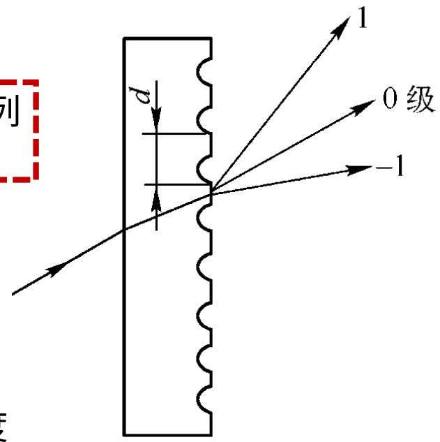

(a)透射光栅

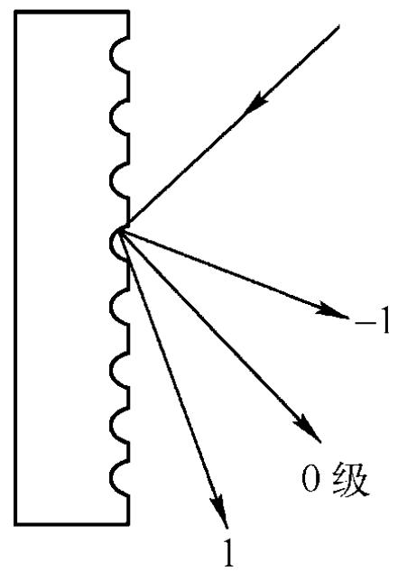

(b)反射光栅

光栅常数 $d = a + b$ 

$a$ 是透光（或反光）部分的宽度$b$ 是不透光 ( 或不反光 ) 部分的宽

广义上可以把光栅定义为： 凡是能使入射光的振幅或相位，或者两者同时产生周期性空间调制的光学元件。

# 实验原理

# 衍射光栅的分类

1 、振幅型和相位型 （按调制方式）

2 、透射型和反射型 （按工作方式）

3 、平面光栅和凹面光栅（按光栅工作表面的形状）

4 、二维平面光栅和三维体积光栅（按调制空间）

5 、机刻光栅、复制光栅、全息光栅（按光栅制作方式）

# 光栅的应用

(1) 光栅最重要的应用是作为分光元件，即把复色光分成单色光。

(2) 它还可以用于长度和角度的精密、自动化测量，以及作为调制元件等。

$$
\mathrm {d} \sin \theta = \mathrm {m} \lambda \quad \text {光 栅 方 程}
$$

# 光栅的分光性能

# 光栅方程

正入射： d msin ,   m  0, 1, 2, 3,      

斜入射： d i m (sin sin )    

光栅面

入射光线与出射光线在光栅面法线异侧

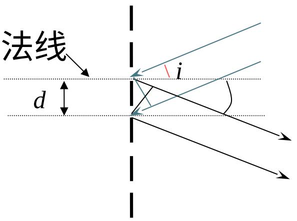

$$
d (\sin \theta - \sin i) = m \lambda
$$

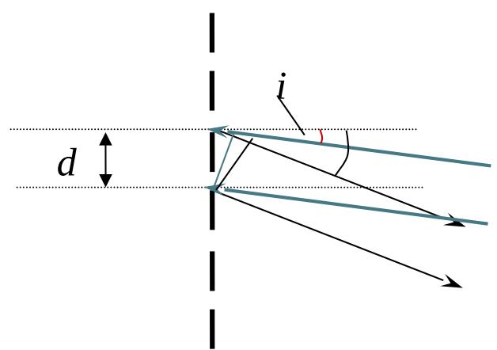

$$
d (\sin \theta + \sin i) = m \lambda
$$

入射光线与出射光线在光栅面法线 同侧

衍射场 P 点处光强度

为：

$$
I = E (\theta) E ^ {*} (\theta) = I _ {0} \left(\frac {\sin \alpha}{\alpha}\right) ^ {2} \cdot \left[ \frac {\sin (N \delta / 2)}{\sin (\delta / 2)} \right] ^ {2}
$$

$I _ { 0 } = A _ { 0 } ^ { 2 }$ 为单缝在 $\mathrm { { \bf P } } _ { 0 }$ 点产生的光强：单缝中央主极大光强。

# 多缝衍射图样

1. 衍射因子和干涉因子

单缝衍射因子 2)sin ( 多光束干涉因子α

强度单元因子

$$
\sin^ {N} \delta
$$

$$
(\frac {2}{\cdot \delta}) ^ {2}
$$

$$
\sin \frac {3}{2}
$$

强度结构因子

多缝衍射是衍射和干涉两种效应共同作用的结果。

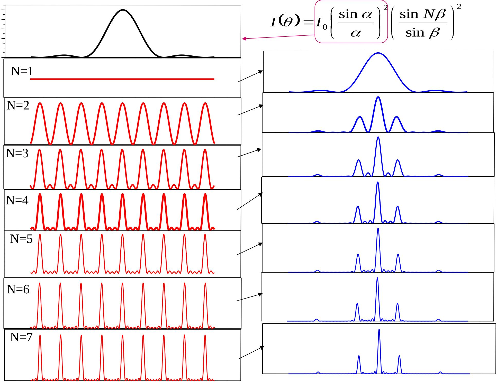

# 2 、 极大和极小

多缝衍射图样中的亮纹和暗纹位置可通过分析多光束干涉因子和单缝衍射因子的极大值和极小值条件得到。

从多光束干涉因子可知 $( \frac { \sin \frac { N } { 2 } \delta } { \sin \frac { \delta } { 2 } } ) ^ { 2 }$ 

当 sin 2 2 d   m 0, 1, 2,m   

即 d m sin    m    0, 1, 2, 时

它有极大值 $\mathbf { N } ^ { 2 }$ ，称为主极大， m 是主极大的级次。

当 $N \frac { \delta } { 2 }$ 等于 $\pi$ 的整数倍而 不是 的整数倍时 2

即 2 $= ( m + \frac { m ^ { \prime } } { N } ) \pi \quad m = 0 , \pm 1 , \pm 2 , \cdots ; \quad m " = 1 , 2 , \cdot$ 1N 

即 d $\sin \theta = ( m + \frac { m ^ { \prime } } { N } ) \lambda$ $\theta = ( m + \frac { m ^ { \prime } } { N } ) \lambda \quad m = 0 , \pm 1 , \pm 2 , \cdots ; \quad m " = 1 , 2 , \cdots$ 1 N   时

干涉因子为零，有极小值为零。

在两个相邻主极大之间有 N-1 个零值，相邻两个零值之间（ $( \Delta m ^ { \prime } { = } 1 )$ ）的角距离 $\Delta \theta$ 为

$$
\Delta \theta = \frac {\lambda}{N d \cos \theta}
$$

主极大与其相邻的一个零值之间的角距离，即主极大的半角宽度也可用上式表示。

上式表明缝数 N 越大，主极大的宽度越小，因而多缝衍射条纹随着缝数的增加而变得越来越狭窄。

# 3. 强度分布曲线和缺级

各级主极大的强度为

$$
I = N ^ {2} I _ {0} (\frac {\sin \alpha}{\alpha}) ^ {2}
$$

表明它们的强度随衍射因子变化，是单缝衍射在各级主极大位置上产生的强度的 $\mathbf { N } ^ { 2 }$ 倍，零级主极大的强度在各级主极大中最大，等于 N I0

表明缝数N越大，观察屏上主极大亮纹越亮

缺级：若干涉因子的某级主极大值刚好与衍射因子的某级极小值重合，这些级次对应的主极大就消失了。

缺极时衍射角同时满足：

单缝衍射极小条件 a sin n n 1,2,

缝间光束干涉极大条件

$$
d \sin \theta = m \lambda \quad m = 0, \pm 1, \pm 2, \dots
$$

d缺级的条件为： m na

m 就是所缺的级次

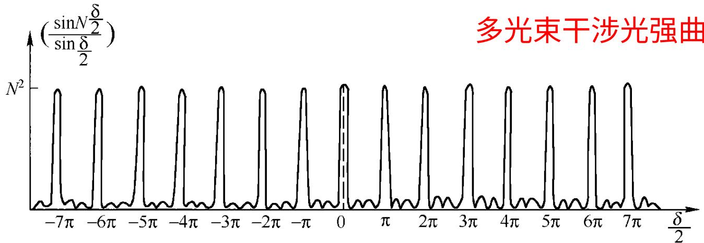

(a)

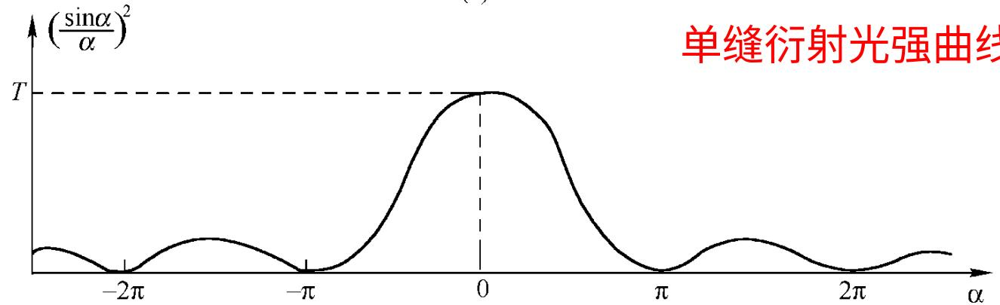

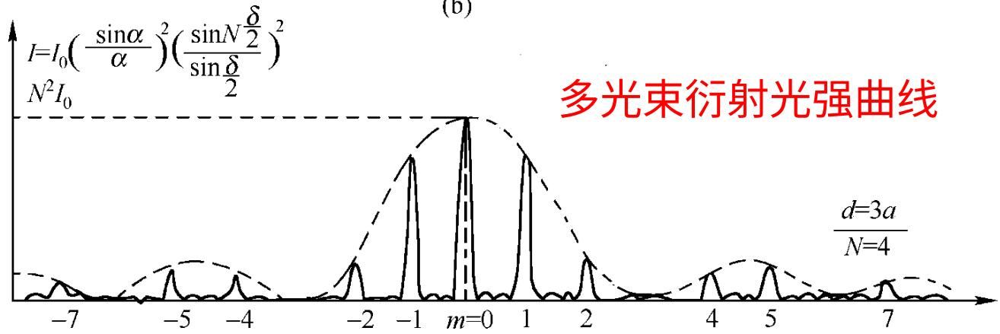

（c）

4. 双缝衍射和双缝干涉

$$
I = I _ {0} \left(\frac {\sin \alpha}{\alpha}\right) ^ {2} \cdot \left[ \frac {\sin (N \delta / 2)}{\sin (\delta / 2)} \right] ^ {2}
$$

$$
\alpha = \pi a \frac {\sin \theta}{\lambda}
$$

双缝衍射

$$
N = 2
$$

$$
I = 4 I _ {0} \left(\frac {\sin \alpha}{\alpha}\right) ^ {2} \cdot \cos^ {2} \frac {\delta}{2}
$$

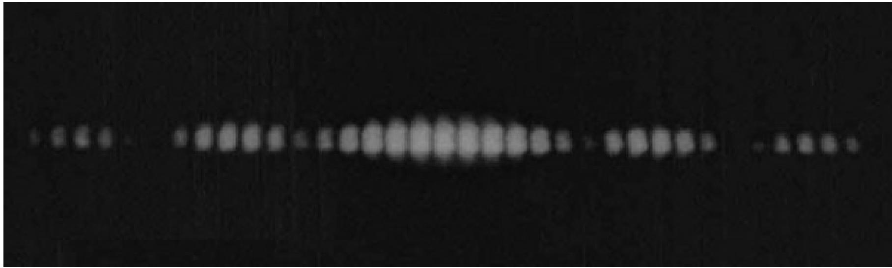

4. 双缝衍射和双缝干涉

$$
I = I _ {0} \left(\frac {\sin \alpha}{\alpha}\right) ^ {2} \cdot \left[ \frac {\sin (N \delta / 2)}{\sin (\delta / 2)} \right] ^ {2}
$$

$$
\alpha = \pi a \frac {\sin \theta}{\lambda}
$$

双缝衍射

$$
N = 2
$$

$$
I = 4 I _ {0} \left(\frac {\sin \alpha}{\alpha}\right) ^ {2} \cdot \cos^ {2} \frac {\delta}{2}
$$

双缝干涉

$$
a \ll d
$$

多缝衍射图样 多光束干涉图样：

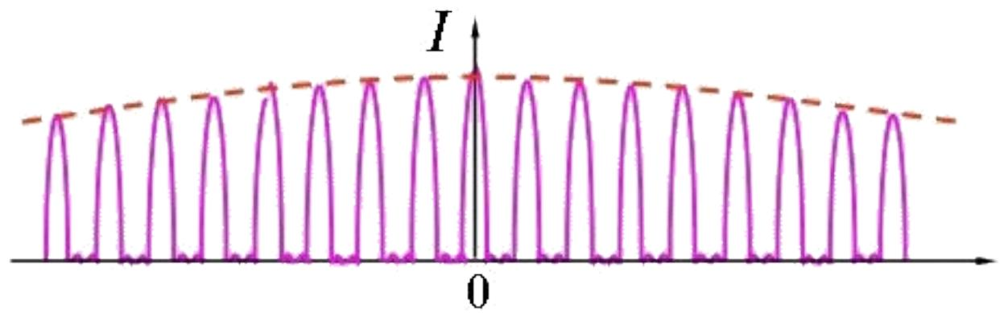

$$
I = 4 I _ {0} \cos^ {2} \frac {\delta}{2}
$$

sine 

# 实验内容 1

根据实验原理图搭建光路，并完成光栅常数的测量

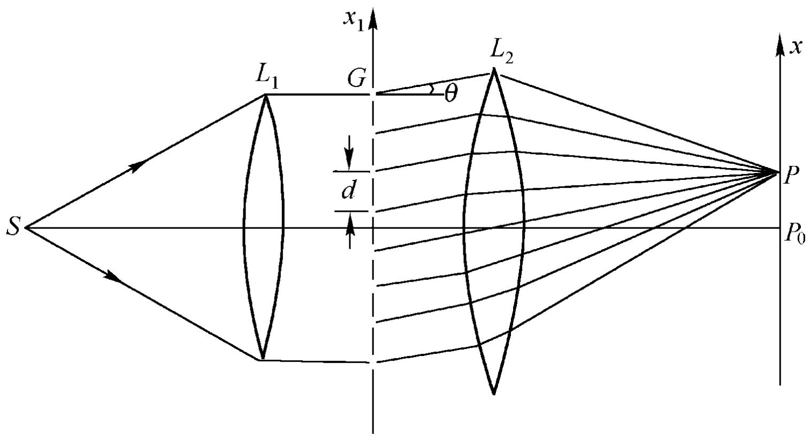

在激光器后放置衰减片、 空间滤波器、准直镜、可调光阑、 透射光栅、聚焦透镜和白屏。使扩束准直后的均匀激光束照射在光栅上，

调节白屏与聚焦透镜 $\boldsymbol { \cdot }$ 的距离至合 适 位 置 分 别 测 量±1 、 ±2 、 ±3 、 ±4 、 ±5 级衍射图像之间的距离，根据几何关系分别计算光栅常数 d ，并计算各自的相对误差；

光路实物图及衍射效果图需要拍照记录；

改变白屏与聚焦透镜的距离，记录并对比光栅衍射图案的特点；

调节可调光阑通光孔的大小改变照射到光栅上的面积，记录并对比光栅衍射图案的特点；

（选做）调节光栅与入射光的角度（可将光栅安装在转台上），记录并对比光栅衍射图案的特点。

# 实验内容 2

根据实验原理图搭建光路，并完成光栅常数的测量

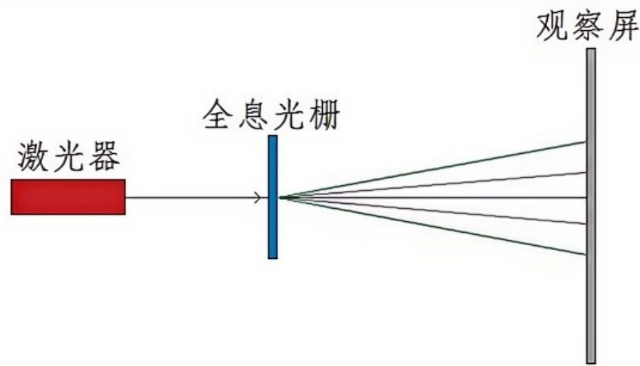

要求：

光路搭建好后需拍照，并附在实验报告中；

实验数据记录表格自拟，写清姓名学号，组别，实验时间；

含误差分析

在激光器后放置衰减片，使激光束直接照射在光栅上，用卷尺量取光栅到白屏的距离，通过白屏上的刻度可读出＋ 1 和— 1 级衍射光与零级光斑的距离，利用反三角函数公式即可计算出光栅的衍射角 θ ，代入公式 dsinθ$= k \lambda$ 计算光栅常数 $d$ ；其中$k$ 为衍射级次， $\lambda$ 为激光波长 532nm 。

# 实验内容 3

光栅线数为 100 L/mm ，在实验内容 1 或 2 基础上分别对比衍射级次为 ±1 、 ±2 、 ±3 、 ±4 、 ±5 所测得的激光波长，算出各级次的相对误差并进行比较。

要求：

自拟测试数据的记录表格。

# 实验要求

# 一定要记录清楚原始读取的数据 !

# 光栅常数的测量结果

经过多次测量和数据处理，计算得到透射光栅的光栅常数为 ( d )nm ，与标称值接近。测量结果的误差范围在 ( \pm )nm 以内，表明实验方法具有较高的准确性。

01 

# 衍射条纹的分布规律

实验观察到的衍射条纹清晰、分布均匀，符合光栅衍射的理论规律。不同级数条纹之间的间距随着衍射级数的增加而逐渐增大，与光栅方程的预测一致。

02 

# 实验数据的统计分析

对多次测量的数据进行统计分析，计算数据的平均值、标准差等统计量，评估数据的离散程度。

绘制数据的直方图，展示数据的分布情况，进一步验证实验结果的可靠性。

03 

# 结果讨论与分析

# 实验误差来源分析

• 分析实验中可能存在的误差来源，如测量角度的误差、光栅位置的偏差、激光光源的稳定性等。

• 针对每个误差来源，讨论其对测量结果的影响程度，并提出相应的减小误差的方法。

# 实验方法的改进方向

探讨实验方法的改进方向，如采用更高精度的测量仪器、优化实验装置的结构、增加测量次数等。

分析不同改进方法的可行性和预期效果，为后续实验提供参考。

# 实验结果的应用与拓展

讨论实验结果在光学测量、光谱分析等领域的应用前景。

提出基于透射光栅的光栅常数测量方法的拓展应用方向，如多波长光栅常数测量、光栅性能优化等。

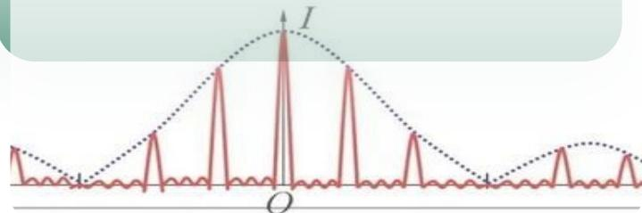

# 思考

光栅方程 dsinθ ＝

kλ 的前提条件是

什么？在本实验中

如何检查是否满足

此条件？

01 

2. 在实验中，若入

射光不严格垂直于

光栅平面，会对实

验结果产生什么影

响？

02 

在实验内容 1 中，

两个透镜 L1 和 L2

分别起到什么作用？

03 