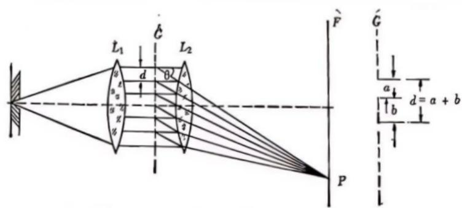
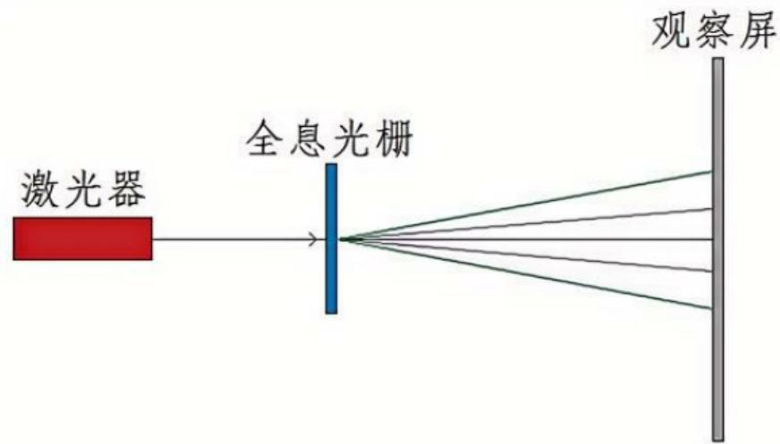
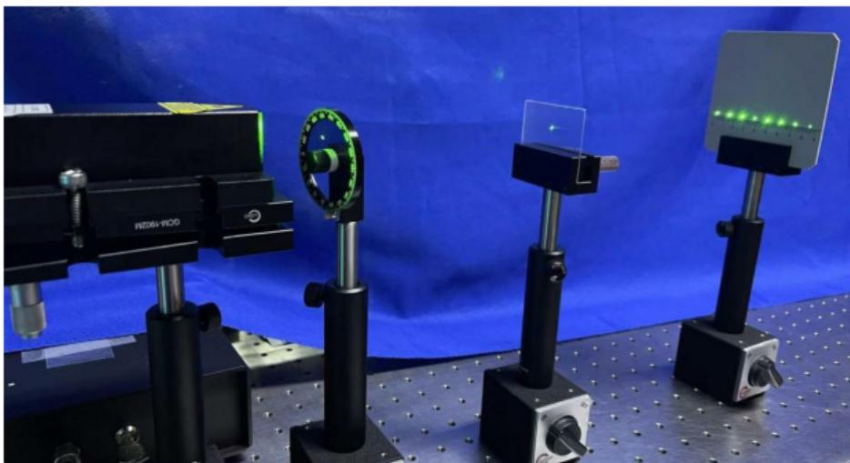
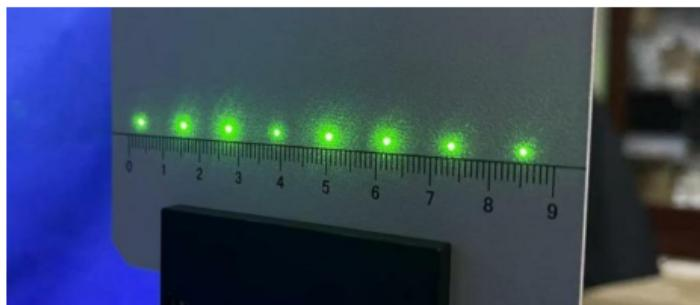
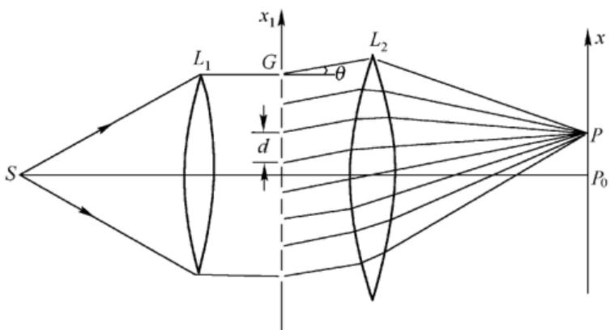

# 实验七（2023级） 光栅参数测量实验

# 一、引言

光栅是一种常用的光学色散元件，它是能够在一定的空间范围内，具有空间周期性分布，并能按一定规律对电磁波进行振幅调制或（和）位相调制的物体或装置。

两束相干平行光成一定角度时，在两束光相交区域将形成干涉条纹。用全息干板将干涉条纹拍摄下来便是全息光栅。全息光栅的制作的原理简单，操作方便，所用光路很灵活，利用迈克耳逊干涉仪、马赫-曾德干涉仪、菲涅耳双面镜、Sagnac干涉仪等能形成两束相干平行光的光路都可制作全息光栅。全息光栅不但可以代替一般光栅用于教学实验，而且可以根据某些实验的特殊要求，例如光学微分、图像相减等，来制作各种空间频率的全息光栅，全息正交光栅、全息复合光栅等。

# 二、实验目的

1. 了解全息光栅的基本原理；

2. 测量并计算光栅常数；

3. 观察衍射光栅条纹的特点。

# 三、基本原理

# （一）光栅的基本特性

由于光栅在结构上具有空间周期性，好似一块由大量等宽、等间距并相互平行的细狭缝（或刻痕）组成的衍射屏，因此，光栅的基本原理和多缝衍射原理相似。

在图1中， $S$ 为一缝光源，它处于透镜 $L_{1}$ 的焦平面上，如果 $L_{1}$ 的主轴正好通过狭缝的中心线并相互平行，则缝光源通过 $L_{1}$ 后输出平行光。 $G$ 为光栅，它具有 $N$ 条宽度为 $a$ 的透射缝，相邻狭缝间的不透光部分的宽度为 $b$ 。自 $L_{1}$ 出射的平行光垂直地照射到光栅 $G$ 上，透镜 $L_{2}$ 将与光栅法线方向成 $\theta$ 角的衍射光，会聚于 $L_{2}$ 焦平面 $F$ 的 $P$ 处。在 $P$ 处产生亮条纹的条件是：

$$
d \sin \theta = k \lambda \tag {1}
$$

图1光栅的基本原理图

这就是我们通常所说的光栅方程。式中， $\theta$ 为衍射角， $\lambda$ 是所用光源的波长， $k$ 是光谱的级次 $(k = 0, \pm 1, \pm 2, \dots)$ ， $d = a + b$ ，是光栅常数。衍射角 $\theta = 0$ 时，级次 $k = 0$ ，任何波长都满足在该处为极大的条件，所以， $\theta = 0$ 处出现中央亮条纹。对于 $k$ 的其他数值，符号“ $\pm$ ”表示两组光谱，由中央亮条纹向左右对称地分布。当已知所用光源的波长 $\lambda$ ，测出与某一级次 $k$ 值对应的 $\theta$ 角后，就可由（1）式求出光栅常数 $d$ 。同样，已知 $d$ ，测出 $k$ 级的衍射角 $\theta$ 后，亦可求得相应的波长 $\lambda = d\sin \theta / k$ 。

若自 $\mathrm{L}_1$ 出射的平行光不与光栅表面垂直时，光栅方程式应写成：

$$
d (\sin \theta - \operatorname {s i n i}) = k \lambda (k = 0, \pm 1, \pm 2, \dots \dots) \tag {2}
$$

式中 $i$ 为入射光与光栅法线的夹角。所以在利用（1）式时，一定要保证平行光垂直入射，否则必须利用（2）式。

除了光栅常数外，分辨本领、角色散率和衍射效率也是描述光栅特性的三个重要参数。分辨本领 $R$ 的定义为：

$$
R = \frac {\lambda}{\Delta \lambda} \tag {3}
$$

其中， $\lambda$ 为谱线的平均波长， $\Delta \lambda$ 为刚好可分辨的两条谱线的波长差。由瑞利判据可以证明：

$$
R = k N = k \frac {l}{d} \tag {4}
$$

式中， $k$ 为级次，N为光栅上受到光波照明的透缝总数， $l$ 为受光面的宽度， $d$ 为光栅常数。

由（4）式可知：光栅在使用面积(宽度一定的)一定的情况下，使用面积内的刻线数目越多，分辨率越高；对有一定光栅常数的光栅，有效的使用面积越大，刻线数目越多谱线越细锐，分辨率越高；高级数比低级数的光谱有较高的分辨本领。由于通常所用光栅的光谱级数不高，所以光栅的分辨本领主要取决于有效的使用面积内的刻线数目 $N$ 

光栅的角色散率 $D$ 的定义为

$$
D = \frac {\Delta \theta}{\Delta \lambda} \tag {5}
$$

$\Delta \theta$ 为刚能分辨的两条谱线的衍射角之差，也就是说，角色散率等于单位波长间隔内两个刚可分辨的单色谱线间的角间距。对（1）式两边取微分，便可得到

$$
D = \frac {k}{d \cos \theta} \tag {6}
$$

此式表明，除了波长（表现在衍射角 $\theta$ 的大小上）的影响外，级次越高， $d$ 越小（即单位宽度的光栅上透光缝的条数越多），角色散率 $D$ 越大。

# 四、实验内容

（1）在激光器后放置衰减片，使激光束垂直直接照射在光栅上，用卷尺量取光栅到白屏的距离，通过白屏上的刻度可读出 $+1$ 和一1级衍射光与零级光斑的距离，利用反三角函数公式即可计算出光栅的衍射角 $\theta$ ，代入公式 $d\sin \theta = k\lambda$ 计算光栅常数 $d$ ；其中 $k$ 为衍射级次， $\lambda$ 为激光波长 $532\mathrm{nm}$ 。光路示意图如图2所示，光路实物图如图3所示，衍射效果如图4所示。

图2光栅参数测量示意图

图3光栅参数测量实物图

图4光栅衍射效果图

(2）在激光器后放置衰减片、空间滤波器、准直镜、可调光阑、透射光栅、聚焦透镜和白屏。使扩束准直后的均匀激光束照射在光栅上，光路示意图如图5所示。

① 测量衍射角并计算光栅常数d；

② 光路实物图及衍射效果图需要拍照记录；

③ 调节可调光阑通光孔的大小改变照射到光栅上的面积，记录并对比光栅衍射图案的特点；

(4) (选做) 调节光栅与入射光的角度（可将光栅安装在转台上），记录并对比光栅衍射图案的特点。

图5光栅参数测量示意图

实验要求及注意事项：

① 光路搭建好后需拍照，并附在实验报告中；

② 实验数据记录表格自拟，写清姓名学号，组别，桌号，实验时间；

$③$ 做好误差分析。

# 五、思考题

1. 光栅方程 $d\sin \theta = k\lambda$ 的前提条件是什么？在本实验中如何检查是否满足此条件？

2. 在实验中，若入射光不严格垂直于光栅平面，会对实验结果产生什么影响？

3. 在这个实验中，两个透镜 $L_{1}$ 和 $L_{2}$ 分别起到什么作用？

# 数据及现象记录单

# 实验七 光栅参数测量实验

桌号：组别：姓名、学号： 实验日期及时间：

(1) 

(2) 