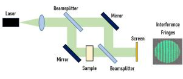
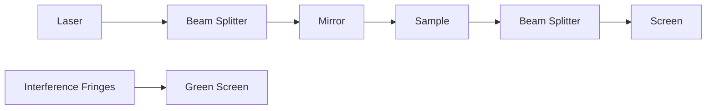
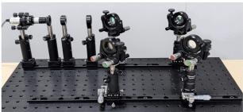
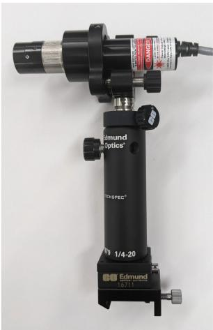
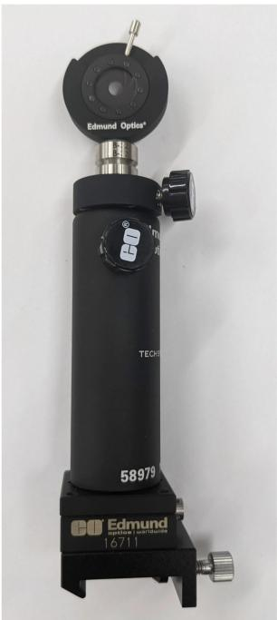
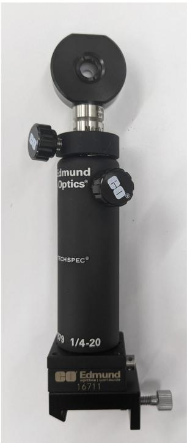

什么是马赫-曾德尔干涉仪（Mach-Zehnder Interferometer）？

马赫-曾德尔干涉仪（Mach-Zehnder Interferometer）是一种简单的干涉测量仪器，测量两束准直的光束之间的相位偏差。这种相位偏差可用于确定小位移、透射式光学器件的透射波前误差、透明材料的折射率、风洞中的空气流动等等。

马赫-普德尔干涉仪（Mach-Zehnder Interferometer）由一个相干光源（如：激光）、两个分光镜和两个反射镜组成（图7和图2）。首先，利用第一个分光镜将光源分成两路。这两束光各自具有相同的光路长度，即行进的距离乘以它们经过的介质的折射率。每个光束从一个反射镜上反射出来，并由第二个分光镜重新组合。如果两束光的光路长度之差小于光源的相干长度，就会产生干涉条纹。由于光源的相干长度可能极短，因此精密的部件和对准是至关重要的。样品可以通过放在其中一个光束路径上进行测量。由此产生的光路长度差可以通过观察干涉条纹的变化来测量。

flowchart

图1: 马赫-曾德尔干涉仪（Mach-Zehnder Interferometer）的典型光学原理图

natural_image

Mechanical assembly with multiple articulated arms mounted on a perforated base (no visible text or symbols)

图2:采用爱特蒙特光学（Edmund Optics®）公司的现成部件组装的台式马赫-曾德尔干涉仪

采用EdmundOptics®公司的现成部件组装系统类似图2所示的系统可以按照以下指南进行组装。\

子组件

每个光学子组件都可以添加到桌面面包板上，并通过光学导轨轻松沿光轴滑动。放置在光轨载体上的小型线性运动平台使其很容易在光轴方向或正交方向进行微调。

光学底座

<table><tr><td>产品编码 #</td><td>产品描述</td><td>数量</td></tr><tr><td>#54641</td><td>600毫米 x 300毫米,面包板</td><td>1</td></tr><tr><td>#54929</td><td>紧凑型光学导轨,500毫米长度</td><td>2</td></tr><tr><td colspan="2"></td><td>购买套件</td></tr><tr><td colspan="3">光源</td></tr><tr><td>产品编码 #</td><td>产品描述</td><td>数量</td></tr><tr><td>#06548</td><td>相干(Coherent®) StingRoyTM 激光二极管模块 1231490 | 520nm, 5mW</td><td>1</td></tr><tr><td>#86878</td><td>Coherent® 1263030 | Laser Controller with CDRH Key Lock + Power Supply</td><td>1</td></tr><tr><td>#18291</td><td>E 系列 19.1mm 内径适配器</td><td>1</td></tr><tr><td>#15866</td><td>E 系列运动型安装座,25.0/25.4mm 光字直径</td><td>1</td></tr><tr><td>#72774</td><td>63.5mm Length, M6 and M6, Steel Post</td><td>1</td></tr><tr><td>#58973</td><td>接杆固定架,M6 螺纹,长度 76.2mm</td><td>1</td></tr><tr><td>#58992</td><td>接杆载管</td><td>1</td></tr><tr><td>#16714</td><td>燕尾台,30毫米方形尺寸,公制</td><td>1</td></tr><tr><td>#11164</td><td>紧凑型载重架,长30mm x 宽35mm</td><td>1</td></tr></table>

购买套件

<table><tr><td colspan="4">光源</td></tr><tr><td>产品编码 #</td><td>产品描述</td><td>数量</td><td></td></tr><tr><td>#66548</td><td>相干 (Coherent®) StingRayTM 激光二极管模块 1231490 | 520nm, 5mW</td><td>1</td><td></td></tr><tr><td>#66878</td><td>Coherent® 1263030 | Laser Controller with CDRH Key Lock + Power Supply</td><td>1</td><td></td></tr><tr><td>#18291</td><td>E 系列 19.1mm 内径适配器</td><td>1</td><td></td></tr><tr><td>#15866</td><td>E 系列运动型安装座, 25.0/25.4mm 元学直径</td><td>1</td><td></td></tr><tr><td>#72774</td><td>63.5mm Length, M6 and M6, Steel Post</td><td>1</td><td></td></tr><tr><td>#558973</td><td>接杆固定架, m6 螺纹, 长度 76.2mm</td><td>1</td><td></td></tr><tr><td>#558992</td><td>接杆载管</td><td>1</td><td></td></tr><tr><td>#16714</td><td>燕尾台, 30毫米方形尺寸, 公制</td><td>1</td><td></td></tr><tr><td>#11164</td><td>紧凑型载重架,长30mm×宽35mm</td><td>1</td><td></td></tr></table>

购买套件

natural_image

Close-up of a black industrial device with attached pipe fitting and control panel (no visible text or symbols)

图3: 光源子组件

可变光阑

<table><tr><td>产品编码 #</td><td>产品描述</td><td>数量</td></tr><tr><td>#53914</td><td>封装的可变光阀,30.8mm 外径</td><td>2</td></tr><tr><td>#72784</td><td>2.5&quot; Length, 8-32 and 1 $\frac{1}{2}$ -20, Steel Post</td><td>2</td></tr><tr><td>#56973</td><td>接杆固定架,长度 76.2mm,M6 螺纹</td><td>2</td></tr><tr><td>#56992</td><td>接杆套管</td><td>2</td></tr><tr><td>#16714</td><td>燕尾形平台,30毫米方形尺寸,公制</td><td>2</td></tr><tr><td>#11164</td><td>紧凑型载重架,长30mm×宽35mm</td><td>2</td></tr></table>

购买套件  

natural_image

Exterior view of a black industrial pressure vessel with labeled components and branding (Edmund Optics®), no readable text beyond branding.

图4: 可变光阑子组件

平凹透镜安装座

<table><tr><td>产品编码 #</td><td>产品描述</td><td>数量</td></tr><tr><td>#64552</td><td>透镜安装座,兼容 6.0mm 真径的光学元件</td><td>1</td></tr><tr><td>#48690</td><td>平凹透镜,6mm直径 ×15 焦距,VIS 0°镀膜</td><td>1</td></tr><tr><td>#72774</td><td>63.5mm Length,M6 and M6 Steel Post</td><td>1</td></tr><tr><td>#58973</td><td>接杆固定架,长度 76.2mm,M6 螺纹</td><td>1</td></tr><tr><td>#58992</td><td>接杆套管</td><td>1</td></tr><tr><td>#16714</td><td>燕尾形平台,30毫米方形尺寸,公刻</td><td>1</td></tr><tr><td>#11164</td><td>紧凑型鞋墨架,长30mm x 宽35mm</td><td>1</td></tr></table>

购买套件  

natural_image

Exterior view of a black industrial cylindrical device with attached mechanical components (no visible text or symbols)

