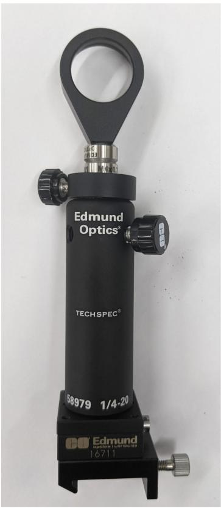
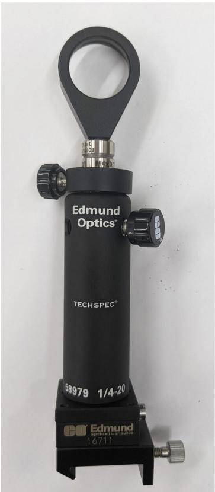
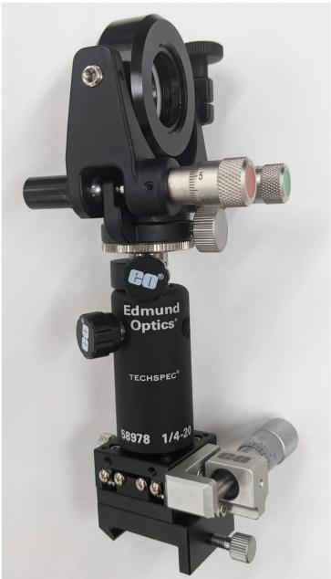

<table><tr><td colspan="3">平凸透镜安装座</td></tr><tr><td>产品编码 #</td><td>产品描述</td><td>数量</td></tr><tr><td>#13787</td><td>25.0/25.4mm 光学直径,SM1 薄型镜架,M4</td><td>1</td></tr><tr><td>#62573</td><td>平凸透镜,25.4毫米直径 x 76.2毫米焦距,VIS 0&quot;镀膜</td><td>1</td></tr><tr><td>#72764</td><td>63.5mm Length, M4 and M6, Steel Post</td><td>1</td></tr><tr><td>#58973</td><td>接杆固定架,长度76.2mm,M6螺纹</td><td>1</td></tr><tr><td>#58992</td><td>接杆套管</td><td>1</td></tr><tr><td>#16714</td><td>燕尾形平台,30毫米方形尺寸,公制</td><td>1</td></tr><tr><td>#11164</td><td>紧凑型载重架,长30mm x 宽35mm</td><td>1</td></tr></table>

购买套件

natural_image

Exterior view of a black Technus spectrometer device (no signage or text beyond branding)

图6: 平凸透镜安装座子组件

<table><tr><td colspan="3">投影透镜安装座</td></tr><tr><td>产品编码 #</td><td>产品描述</td><td>数量</td></tr><tr><td>#13787</td><td>25.0/25.4mm 光学直径,SM1 薄型镜架,M4</td><td>1</td></tr><tr><td>#47917</td><td>双凹透镜,25mm 直径 x -25mm 焦距,VIS 0&quot;镀膜</td><td>1</td></tr><tr><td>#58953</td><td>不锈钢接杆,长度63.5mm,M4螺钉</td><td>1</td></tr><tr><td>#58973</td><td>接杆固定架,长度63.5mm,M4螺钉</td><td>1</td></tr><tr><td>#58992</td><td>接杆套管</td><td>1</td></tr><tr><td>#16714</td><td>燕尾形平台,30毫米方形尺寸,公制</td><td>1</td></tr><tr><td>#11164</td><td>紧凑型载重架,长30mm x 宽35mm</td><td>1</td></tr></table>

购买套件

text_image

Edmund Optics®
TECHSPEC®
68979 1/4-20
Edmund
Technological Instrument
16711

图7: 投影透镜安装子组件

<table><tr><td colspan="3">带反射镜的万向调整架(2套)</td></tr><tr><td>产品编码 #</td><td>产品描述</td><td>数量</td></tr><tr><td>#54999</td><td>精密万向调整架,25.0/25.4mm 光学直径</td><td>2</td></tr><tr><td>#64015</td><td>λ/10 波长反射镜,25mm 直径,增强性铝膜</td><td>2</td></tr><tr><td>#72773</td><td>50.8mm Length, M6 and M6, Steel Post</td><td>2</td></tr><tr><td>#58972</td><td>接杆固定架,长度 50.8mm,M6螺纹</td><td>2</td></tr><tr><td>#58992</td><td>接杆套管</td><td>2</td></tr><tr><td>#66393</td><td>公制千分尺,30毫米,侧面驱动,标准顶部,0.5英寸行程</td><td>2</td></tr><tr><td>#11164</td><td>紧凑型载重架,长30mm x 宽35mm</td><td>2</td></tr></table>

购买套件

natural_image

Close-up of a black optical instrument with adjustment knobs and a labeled base (no readable text beyond branding)

图8: 带反射镜的万向调整架子组件

<table><tr><td colspan="3">带分光镜的万向调整架(2套)</td></tr><tr><td>产品编码 #</td><td>产品描述</td><td>数量</td></tr><tr><td>#54999</td><td>精密万向调整架,25.0/25.4mm 光学直径</td><td>2</td></tr><tr><td>#34413</td><td>VIS 楔形分光平片,25毫米直径 50R/50T</td><td>2</td></tr><tr><td>#72773</td><td>50.8mm Length, M6 and M6, Steel Post</td><td>2</td></tr><tr><td>#58972</td><td>接杆固定架,长度 50.8mm,M6螺纹</td><td>2</td></tr><tr><td>#58992</td><td>接杆套管</td><td>2</td></tr><tr><td>#66393</td><td>公制千分尺,30毫米,侧面驱动,标准顶部,0.5英寸行程</td><td>2</td></tr><tr><td>#11164</td><td>紧凑型载重架,长30mm x 宽35mm</td><td>2</td></tr></table>