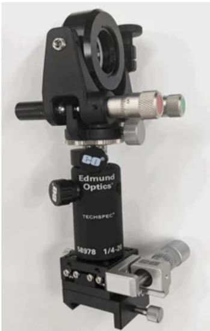
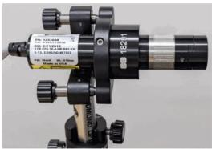
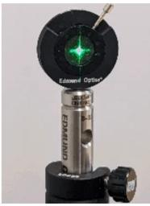
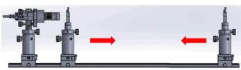
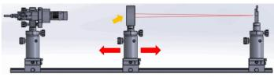
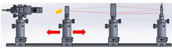
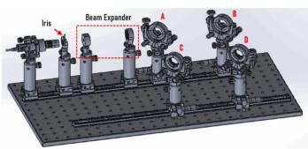
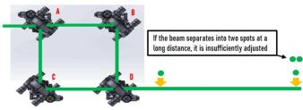
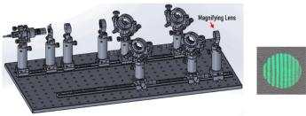

natural_image

Close-up of a mechanical optical instrument with labeled components (no readable text or symbols beyond branding)

图9: 带分光镜的万向调整架子组件

完整的零件清单 

<table><tr><td>产品编码 #</td><td>产品描述</td><td>数量</td></tr><tr><td>#54641</td><td>600毫米 x 300毫米,面包板</td><td>1</td></tr><tr><td>#54929</td><td>紧凑型光学导轨,500毫米长度</td><td>2</td></tr><tr><td>#11164</td><td>紧凑型载重架,长30mm x 宽35mm</td><td>10</td></tr><tr><td>#16714</td><td>燕尾形平台,30毫米方形尺寸,公制</td><td>6</td></tr><tr><td>#66393</td><td>公制千分尺,30毫米,侧面驱动,标准顶部,0.5英寸行程</td><td>4</td></tr><tr><td>#58972</td><td>接杆固定架,长度50.8mm,M6螺纹</td><td>4</td></tr><tr><td>#58973</td><td>接杆固定架,长度76.2mm,M6 螺纹</td><td>6</td></tr><tr><td>#58992</td><td>接杆套管</td><td>10</td></tr><tr><td>#72774</td><td>63.5mm Length,M6 and M6, Steel Post</td><td>1</td></tr><tr><td>#72764</td><td>63.5mm Length,M4 and M6, Steel Post</td><td>1</td></tr><tr><td>#72773</td><td>50.8mm Length,M6 and M6, Steel Post</td><td>2</td></tr><tr><td>#72784</td><td>2.5&quot; Length,8-32 and 1x-20,Steel Post</td><td>2</td></tr><tr><td>#86848</td><td>相干(Coherent®)StingRayTM 激光二极管模块 1231490 | 520nm,5mW</td><td>1</td></tr><tr><td>#86878</td><td>Coherent® 1263030 | Laser Controller with CDRH Key Lock + Power Supply</td><td>1</td></tr><tr><td>#15866</td><td>E 系列运动型安装座,25.0/25.4mm 光学直径</td><td>1</td></tr><tr><td>#18291</td><td>E 系列 19.1mm 内径适配器</td><td>1</td></tr><tr><td>#53914</td><td>封装的可变光阑,30.8mm 外径</td><td>2</td></tr><tr><td>#64552</td><td>透镜安装座,兼容 6.0mm 直径的光学元件</td><td>1</td></tr><tr><td>#48690</td><td>平凹透镜,6mm直径 x-15 焦距,VIS 0°镀膜</td><td>1</td></tr><tr><td>#13787</td><td>25.0/25.4mm 光学直径,SM1 厚型镀架,M4</td><td>2</td></tr><tr><td>#62573</td><td>平凸透镜,25.4毫米直径 x 76.2毫米焦距,VIS 0°镀膜</td><td>1</td></tr><tr><td>#47917</td><td>25mm Dia. x -25mm FL,VIS 0°镀膜,双凹透镜</td><td>双凹透镜,25mm 直径 x-25mm焦距,VIS 0°镀膜</td></tr><tr><td>#54999</td><td>精密万向调整架,25.0/25.4mm 光学直径</td><td>4</td></tr><tr><td>#64015</td><td>A/10 波长反射镜,25mm 直径,增强性铝膜</td><td>2</td></tr><tr><td>#34413</td><td>VIS 模形分光平片,25毫米直径 50R/50T</td><td>2</td></tr></table>

购买套件

马赫-曾德尔干涉仪（Mach-Zehnder Interferometer）的对准

激光器、光圈和透镜必须对准同一光轴。理想情况下，这些组件即使在光轨上平移，其光轴也不应该改变。安装在光学导轨载体上的平台可以实现垂直于导轨方向的水平运动。

1.安装激光模块

\- 使用适配器（#18291）将激光模块（直径Φ19.1mm）固定在 #15866 上。

\- 这使得调整激光角度变得很容易

○调整支架的角度，使激光束与光轨平行。

natural_image

Close-up of a mechanical optical instrument with adjustable lens and tripod base (no visible text or symbols)

natural_image

Close-up of a precision optical instrument with green laser source and black base (no visible text or symbols)

图10:

安装激光模块

2. 对准激光器的光轴

\- 使用光圈子组件来保持系统所有组件的光轴中心不变。

\- 将激光照射到虹膜的中心。

将光圈沿光学导轨滑下，同时对运动学支架进行调整，使激光在整个范围内保持在光圈中心。

natural_image

Mechanical assembly diagram showing two cylindrical components with directional arrows indicating motion (no text or symbols)

图11: 对准激光器的光轴

3. 对准平凸透镜的光轴

在左右滑动透镜单元的同时，调整长焦距平凸透镜的光轴。

◦ 用接杆来调整透镜的高度，用燕尾台来调整垂直方向的光轴。

natural_image

Three mechanical assembly diagrams showing alignment or force application with red arrows indicating direction (no text or symbols)

图12: 将平凸透镜的光轴与长焦距对齐

4. 对准平凹透镜的光轴

在光路中放置一个短焦距的平凹透镜。

在左右滑动透镜单元的同时调整光轴。

○用接杆来调整透镜的高度，用燕尾台来调整垂直方向的光轴。

natural_image

Mechanical assembly diagram showing four stages of a device with arrows indicating motion direction (no text or symbols)

图13: 将平凹透镜的光轴与短焦距对齐

5.定位透镜以形成扩束镜

两个透镜应以其焦距之和分开。在这种情况下，间隔应该是76.2毫米-25毫米=51.2毫米。

要了解更多关于配对透镜将光束直径扩大到所需尺寸的信息，请访问我们的另一篇应用说明《如何利用现代光学器件设计标准》

选择反射率较低的镀膜透镜对避免杂散光有重要意义。

text_image

Iris
Beam Expander
A
B
C

图14: 将两个透镜子组件放置在光圈前面，形成扩束镜

6. 对准反射镜和分光镜

- 两条光路的长度必须相等（或几乎相等），而且最后的光束必须重叠才能获得条纹。  
在位置A处放置分光镜将激光分成两路，在位置D处放置另一分光镜将光束重新合束。  
○ 调整距离，使A-B-D和A-C-D的光路长度相同。   
必须注意防止反射镜/分光镜安装座边缘遮挡光束。  
○透过D的光束必须与在D处反射的光束相重合。

text_image

If the beam separates into two spots at a
long distance, it is insufficiently adjusted

图15: 对准反射镜和分光镜

7.检查干涉条纹的情况

\- 在D之后添加一个放大镜可以使其更容易识别边缘。

\- 平台在光轨上的位置和其他组件的对准可能需要微调，以获得条纹

natural_image

Diagram of a scientific instrument setup with multiple lenses and a magnifying lens, no text or symbols present.

图16:由现成的元件建造的马赫-曾德尔干涉仪（Mach-Zehnder Interferometer）的最终装置

更多资源

- 如何利用现货光学件设计扩束镜  
- 利用现货光学件进行设计的5大技巧  
- 激光光学元件的计量  
- 使用库存组件构建定制光学隔离器  
- 光学笼式系统的应用：迈克尔逊干涉仪（Michelson Interferometer）