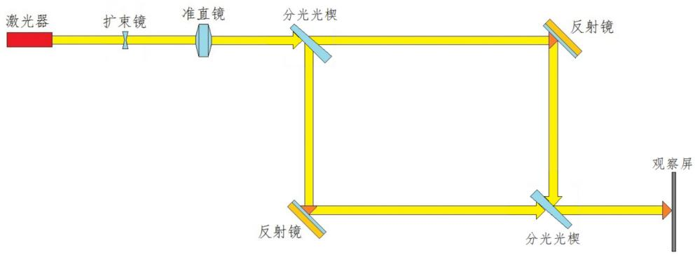
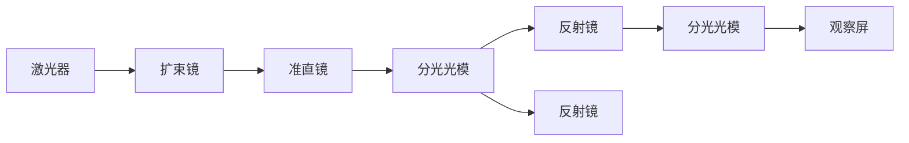
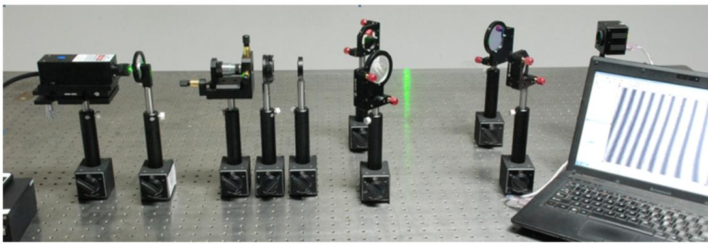
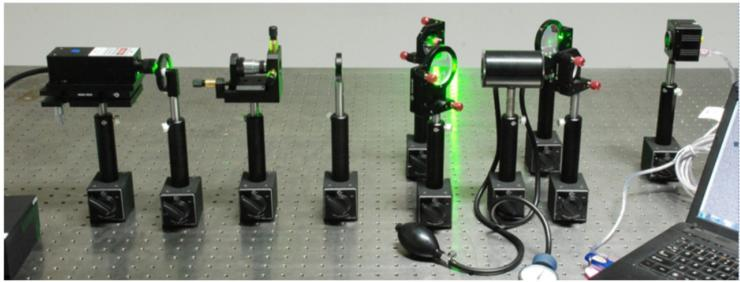

# 马赫-曾德干涉实验

1 实验讲义 2 3 4 5 如何搭建马...

# 马赫-曾德干涉实验

# 一、引言

现代光学的许多实验都是以马赫-曾德干涉仪的光路为基础的，其是最典型的干涉仪之一。通过马赫-曾德干涉仪的各个元部件的调节，搭建和使用，可以训练学生调节光路的技巧，进一步了解干涉的原理。

# 二、实验目的

1、熟悉所用仪器及光路的调节，观察两束平行光的干涉现象。

2、观察光学平台的稳定度。  
3、测量空气的折射率。

# 三、实验原理

马赫-曾德干涉仪（Mach-Zehnder Inter-Ferometer）是用分振幅法产生双光束以实现干涉的仪器，其光路示意图如图1所示。

flowchart

图1 马赫-曾德干涉仪光路示意图

它是由两块分光光楔（半反半透镜）和两块全反射镜组成，四个反射面接近互相平行，中心光路构成一个平行四边形。从激光器出射的光束经过扩束镜及准直镜，形成一束宽度合适的平行光束。这束平行光射入分光光楔之后分为两束。一束由分光光楔反射后达反射镜，经过其再次反射并透过另一个分光光楔，这是第一束光；另一束透过分光光楔，经反射镜及分光光楔两次反射后射出，这是第二束光。在最后一块分光光楔前方两束光的重叠区域放上观察屏。若两束光严格平行，则在屏幕不出现干涉条纹；若两束光在水平方向有一个交角，那么在屏幕的竖直方向出现干涉条纹，而且两束光交角越大，干涉条纹越密。

马赫-曾德干涉仪的特点是两光束分得很开，因此用途比较广，比如在空气动力学中可用它来研究气流折射率的变化，用马赫-曾德干涉仪制作各种全息光栅效果也很好。

# 四、实验内容

1、调节马赫-曾德干涉

基本分为四步：第一步调光束高度及水平（与平台平行）；第二步调平行光；第三步搭光路、量光程；第四步调两光斑的重合。图2是光路实物图。

natural_image

Experimental setup with multiple black optical or mechanical instruments on a perforated table, connected to a laptop displaying a waveform display (no visible text or symbols)

图2光路实物图

（1）调整激光器水平，借助可变光阑（开孔约2mm），光阑在激光器的近处和远处，分别调节光阑高低和激光夹持器的水平俯仰旋钮，反复2次即可将激光器调平，最终使出射激光束与光学平台台面平行；调好之后将可调衰减器安装到光路中。  
（2）调整空间滤波器，此时光斑通过光阑，在激光器和光阑中间插入空间滤波器（不加针孔，激光器与光阑的距离需预留可调衰减器的空间），通过调整位置使物镜出射的光斑打在光阑中间（仔细观察会发现在扩束的光斑中间有一“小亮点”，如果能将“小亮点”调整到扩束光斑中心通过光阑小孔，调试效果较好），然后安装针孔（标配10um，15um和25um，一般选择25um），调整空间滤波器的三维旋钮最终使物镜的聚焦光斑与小孔重合，达到滤波效果（调整过程中可以观察到圆孔衍射环，调整完成后衍射环消失）。  
（3）调整准直镜，在空间滤波器后面安装准直镜，调整准直镜高低使出射光束入射到光阑中间，前后移动准直镜（准直镜焦距 $100\mathrm{mm}$ ，一般选择空间滤波器针孔位置到准直镜的距离为 $100\mathrm{mm}$ ）观察光斑大小，远处近处光斑大小不变即可认为调整完成；

（4）在准直镜的后方分别放入各光学件：两个分光光楔、两个反射镜，并如图1所示，把它们摆成一个平行四边形（可在其中一路光中放置气室，图2中有体现）。然后测量光程，使两束光光程基本一样，并进一步检查各光束是否与工作台面平行。（反射光束都需要使用光阑检查光斑高度，如有偏差需调整反射镜俯仰旋钮）

（5）调节两光斑的重合。调节任何一块反射镜，使两束光在最后一块合束光楔的出射面上重合，再调节这块合束光楔使两束光在屏幕上重合，将CMOS相机摆放在光束重合位置。

# 2、实验步骤

（1）将CMOS相机与电脑相连，首先安装“实验软件\CMOS相机采集程序\USB\_Setup32cn\_V12.6.21.2.exe（如果电脑系统win64，运行对应64位安装包即可）”，运行电脑桌面“DaHeng USBDevice”，双击“This PC”目录下的“HV1351UM”，随后点击“视图”下方的“实时显示”功能键，此时CMOS相机开始工作，之后将采集区域分辨率调至 $1280 \times 1024$ ，适当调整相机的曝光时间和可调衰减器可以在电脑屏幕看到干涉条纹。（如果已经安装CMOS相机驱动，可以忽略安装过程）  
（2）微调最后一块合束光楔改变光束的夹角即可以间接改变条纹的宽度和方向，轻拍光学平台，或在台旁的地上跳动，观察干涉条纹的变化及恢复情况。观察光学平台的稳定性。  
（3）如图3所示，在透射或反射任意一路中置入气室并充气，观察空气密度的改变对干涉条纹的影响。利用气室充气，然后缓缓放气，可以看到条纹缓慢变化，记录条纹移动的条数和当前气压即可计算当前空气折射率。（完成表格）

natural_image

Experimental optical setup with multiple black lenses and green laser indicators on a perforated metal surface, connected to a laptop (no visible text or symbols)

图3 计算空气折射率

<table><tr><td>气压值(mmHg)</td><td></td><td></td><td></td><td></td><td></td><td></td><td></td><td></td><td></td></tr><tr><td>条纹移动条数(个)</td><td></td><td></td><td></td><td></td><td></td><td></td><td></td><td></td><td></td></tr></table>

之后通过如下公式，计算空气的折射率

$$
n = 1 + \frac {\lambda}{L} \frac {\Delta K}{\Delta p} p
$$

其中， $\lambda$ 为激光波长632.8nm， $\Delta K$ 为移动的条纹数目，p为一标准大气压， $\Delta p$ 为气室充气前与重启后的压强差，L为气室的长度。将上述数据带入下列公式中，即可算出空气的折射率n。

空气折射率的理论值如下，可供参考。

$$
n = 1 + \frac {2 . 8 7 9 3 p}{1 + 0 . 0 0 3 6 7 1 t} \times 1 0 ^ {- 9}
$$