# 第二章 波动光学引论

光是一种电磁波

2、 定态光波 复振幅描述

3、 波前函数

4、 球面波向平面波的转化

波前相因子分析法

# 1、光是电磁波

# 麦克斯韦 (1831-1879)

麦克斯韦是继法拉第之后，集电磁学大成的伟大科学家。他依据库仑、高斯、欧姆、安培、毕奥、萨伐尔、法拉第等前人的一系列发现和实验成果，建立了第一个完整的电磁理论体系，不仅科学地预言了电磁波的存在，而且揭示了光、电、磁现象的本质的统一性，完成了物理学的又一次大综合。这一理论自然科学的成果，奠定了现代的电力工业、电子工业和无线电工业的基础。

麦克斯韦1831年6月出生于英国爱丁堡，他的父亲原是律师，但他的主要兴趣是在制作各种机械和研究科学问题，他这种对科学的强烈爱好，对麦克斯韦一生有深刻的影响。麦克斯韦10岁进入爱丁堡中学， 14岁在中学时期就发表了第一篇科学论文《论卵形曲线的机械画法》，反映了他在几何和代数方面的丰富知识。16岁进入爱丁堡大学学习物理，三年后，他转学到剑桥大学三一学院。在剑桥学习时，打下了扎实的数学基础，为他尔后把数学分析和实验研究紧密结合创造了条件。他阅读了W.汤姆生的科学著作，他十分赞同法拉第提出的新观点，并且精心研究法拉第的《电学的实验研究》一书。

他以法拉第的力线概念为指导，透过这些似乎杂乱无章的实验记录，看出了它们之间实际上贯穿着一些简单的规律。于是，他发表了第一篇电磁学论文《论法拉第的力线》。在这篇论文中，法拉第的力线概念获得了精确的数学表述，并且由此导出了库仑定律和高斯定律。这篇文章还只是限于把法拉第的思想翻译成数学语言，还没有引导到新的结果。

1862年他发表了第二篇论文《论物理力线》，不但进一步发展了法拉第的思想，扩充到磁场变化产生电场，而且得到了新的结果：电场变化产生磁场，由此预言了电磁波的存在，并证明了这种波的速度等于光速，揭示了光的电磁本质。这篇文章包括了麦克斯韦研究电磁理论达到的主要结果。

1864年他的第三篇论文《电磁场的动力学理论》，从几个基本实验事实出发，运用场论的观点，以演绎法建立了系统的电磁理论。1873年出版的《电学和磁学论》一书是集电磁学大成的划时代著作，全面地总结了19世纪中叶以前对电磁现象的研究成果，建立了完整的电磁理论体系。这是一部可以同牛顿的《自然哲学的数学原理》、达尔文的《物种起源》和赖尔的《地质学原理》相媲美的里程碑式的著作。

麦克斯韦在总结前人工作的基础上，引入位移电流的概念，建立了一组微分方程。这方程组确定电荷、电流（运动的电荷）、电场、磁场之间的普遍联系，是电磁学的基本方程。

$$
\left\{ \begin{array}{c} {\iint_ {S} \vec {D} \cdot d \vec {S} = \iiint_ {V} \rho d V = Q} \\ {\oint_ {C} \vec {E} \cdot d \vec {l} = - \frac {\partial}{\partial t} \int_ {A} \vec {B} \cdot d \vec {S}} \\ {\iint_ {S} \vec {B} \cdot d \vec {S} = 0} \\ {\oint_ {C} \vec {H} \cdot d \vec {l} = \int_ {A} \vec {j} \cdot d \vec {S} + \frac {\partial}{\partial t} \int_ {A} \vec {D} \cdot d \vec {S}} \end{array} \right.
$$

麦克斯韦方程组表明，空间某处只要有变化的磁场就能激发出涡旋电场，而变化的电场又能激发涡旋磁场。交变的电场和磁场互相激发就形成了连续不断的电磁振荡即电磁波。

麦克斯韦方程还说明，电磁波的速度只随介质的电和磁的性质而变化，由此式可证明电微波在以太（即真空）中传播的速度，等于光在真空中传播的速度。

这不是偶然的巧合，而是由于光和电磁波在本质上是相同的。光是一定波长的电磁波，这就是麦克斯韦创立的光的电磁学说。

# 光波是特定波段的电磁波

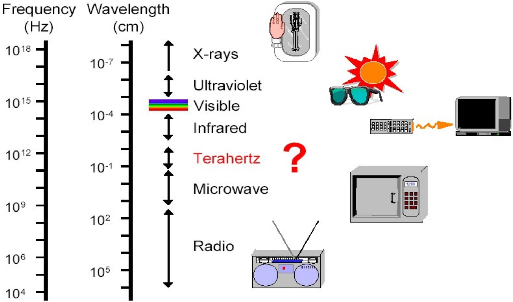

可见光波长约为380---760nm，光频为81014--- 41014Hz

# 电磁波主要性质

(1) 电磁场的运动是波动，遵从麦克斯韦电磁场方程组。

$$
\left\{ \begin{array}{l l} \nabla \cdot \vec {E} = 0 \\ \nabla \times \vec {E} = - \mu \mu_ {0} \frac {\partial \vec {H}}{\partial t} \xrightarrow [ ]{\nabla \times (\dots)} \\ \nabla \cdot \vec {H} = 0 & (2. 1) \\ \nabla \times \vec {H} = \varepsilon \varepsilon_ {0} \frac {\partial \vec {E}}{\partial t} & \xrightarrow [ ]{\nabla \times (\dots)} \end{array} \right.
$$

$$
\left\{ \begin{array}{l} \nabla \times (\nabla \times \vec {E}) = - \mu \mu_ {0} \frac {\partial}{\partial t} \nabla \times \vec {H} \\ \nabla \times (\nabla \times \vec {H}) = \varepsilon \varepsilon_ {0} \frac {\partial}{\partial t} \nabla \times \vec {E} \end{array} \right.
$$

自由空间的麦克斯韦方程，为介质的相对介电常数，为相对磁导率，E为电场强度矢量，H为磁场强度矢量。

$$
\nabla \cdot \vec {A} = \left\{\frac {\partial}{\partial x}, \frac {\partial}{\partial y}, \frac {\partial}{\partial z} \right\} \bullet \left\{A _ {x}, A _ {y}, A _ {z} \right\} = \frac {\partial A _ {x}}{\partial x} + \frac {\partial A _ {y}}{\partial y} + \frac {\partial A _ {z}}{\partial z}
$$

$$
\nabla = \left(\frac {\partial}{\partial x} \vec {i} + \frac {\partial}{\partial y} \vec {j} + \frac {\partial}{\partial z} \vec {k}\right)
$$

$$
\nabla \times \vec {A} = \left| \begin{array}{c c c} \vec {i} & \vec {j} & \vec {k} \\ \frac {\partial}{\partial x} & \frac {\partial}{\partial y} & \frac {\partial}{\partial z} \\ A _ {x} & A _ {y} & A _ {z} \end{array} \right| = (\frac {\partial A _ {z}}{\partial y} - \frac {\partial A _ {y}}{\partial z}) \vec {i} - (\frac {\partial A _ {z}}{\partial x} - \frac {\partial A _ {x}}{\partial z}) \vec {j} + (\frac {\partial A _ {y}}{\partial x} - \frac {\partial A _ {x}}{\partial y}) \vec {k}
$$

# 光波是电磁波

$$
\xrightarrow {\nabla \times (\nabla \times \vec {A}) = \nabla (\nabla \cdot \vec {A}) - \nabla^ {2} \vec {A}} \left\{ \begin{array}{l} \nabla \left(\nabla \cdot \vec {E}\right) - \nabla^ {2} \vec {E} = - \mu \mu_ {0} \frac {\partial}{\partial t} \nabla \times \vec {H} \\ \nabla \left(\nabla \cdot \vec {H}\right) - \nabla^ {2} \vec {H} = \varepsilon \varepsilon_ {0} \frac {\partial}{\partial t} \nabla \times \vec {E} \end{array} \right.
$$

麦克斯韦方程组

$$
\left\{ \begin{array}{l} \nabla^ {2} \vec {E} - \varepsilon \varepsilon_ {0} \mu \mu_ {0} \frac {\partial^ {2} \vec {E}}{\partial t ^ {2}} = 0 \\ \nabla^ {2} \vec {H} - \varepsilon \varepsilon_ {0} \mu \mu_ {0} \frac {\partial^ {2} \vec {H}}{\partial t ^ {2}} = 0 \end{array} \right. \tag {2.2}
$$

$$
\nabla^ {2} = \nabla \cdot \nabla = (\frac {\partial^ {2}}{\partial x ^ {2}} + \frac {\partial^ {2}}{\partial y ^ {2}} + \frac {\partial^ {2}}{\partial z ^ {2}})
$$

2.2是标准的波动方程，表明了自由空间交变的电场和磁场的运动和变化具有波动形式，形成电磁波，其传播速度为：

$$
\varepsilon_ {r} \varepsilon_ {0} \mu \mu_ {0} = \left(\frac {1}{\nu}\right) ^ {2} \rightarrow \nu = \frac {1}{\sqrt {\varepsilon \varepsilon_ {0} \mu \mu_ {0}}}
$$

真空中电磁波的速度：

$$
c = \frac {1}{\sqrt {\varepsilon_ {0} \mu_ {0}}}
$$

 $\begin{array} { r } { 8 . 8 5 \times 1 0 ^ { - 1 2 } C ^ { 2 } / N \cdot m ^ { 2 } , \mu _ { 0 } = 4 \pi \times 1 0 ^ { - 7 } N / A } \end{array}$ 2，得到真空电磁波速度为：$c \approx 3 { \times } 1 0 ^ { 8 } m / s .$ 和光速相同，再次证明光波就是电磁波。

根据折射率的定义：

$$
n = \frac {c}{\nu} = \sqrt {\varepsilon \mu}
$$

迄今关于折射率的深层微观机理和性质的研究均从上式从发。

问题： $n = \frac { c } { \nu } = \sqrt { \varepsilon \mu }$ 一定大于0？？

有没有 $n = \frac { c } { \nu } = - \sqrt { \varepsilon \mu }$ 的情况？？

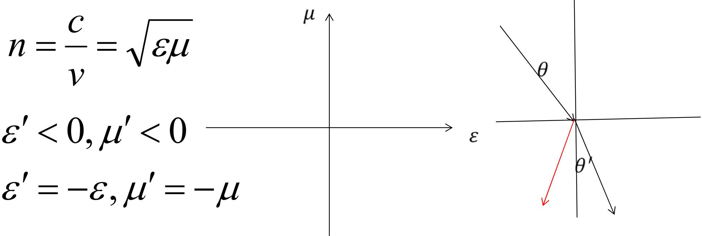

$$
\begin{array}{l} n ^ {\prime} = \sqrt {\varepsilon^ {\prime} \mu^ {\prime}} = \sqrt {- \varepsilon \bullet - \mu} \\ = \vec {i} \cdot \vec {i} \cdot \sqrt {\varepsilon \cdot \mu} = - \sqrt {\varepsilon \cdot \mu} = - n \\ \end{array}
$$

$$
n \sin \theta = n ^ {\prime} \sin \theta^ {\prime} = - n \sin \theta^ {\prime} = n \sin (- \theta^ {\prime})
$$

比如2003年美国《科学》十大新闻：多个研究小组证实，特定介质能使光和其他电磁波以负折射率偏转。这种所谓“左手”性物质有可能用于制造性能更好的透镜。

这种材料是由铜质方形裂环振荡器和一条细铜线嵌在玻璃纤维的底板上形成的。铜质方形裂环振荡器和铜线分别嵌在底板的两面（如上图所示）。将用这种材料制成的棱镜与用聚四氟乙烯（Teflon）制成的棱镜对比后发现，经两者折射的波偏离主轴的方向相反。由此证明了这种材料具有负折射率的性质。

（3）平面电磁波是自由空间电磁波的一基元成分。平面电磁波函数：

$$
\vec {E} (\boldsymbol {r}, t) = \vec {E} _ {0} \cos (\omega t - \vec {k} \cdot \vec {r} + \varphi_ {E})
$$

$$
\vec {H} (\boldsymbol {r}, t) = \vec {H} _ {0} \cos (\omega t - \vec {k} \cdot \vec {r} + \varphi_ {H})
$$

满足波动方程2.2

$$
\left\{ \begin{array}{l} \nabla^ {2} \vec {E} - \varepsilon \varepsilon_ {0} \mu \mu_ {0} \frac {\partial^ {2} \vec {E}}{\partial t ^ {2}} = 0 \\ \nabla^ {2} \vec {H} - \varepsilon \varepsilon_ {0} \mu \mu_ {0} \frac {\partial^ {2} \vec {H}}{\partial t ^ {2}} = 0 \end{array} \right.
$$

k称为波矢，其方向与等相面的正交，即为波面的法线方向，其大小为：

$$
k ^ {2} = \varepsilon \varepsilon_ {0} \mu \mu_ {0} \omega^ {2} \Rightarrow k = \sqrt {\varepsilon \varepsilon_ {0} \mu \mu_ {0}} \cdot \omega
$$

$$
k = \frac {n \omega}{c} \quad \Longrightarrow \quad k = \frac {2 \pi}{\lambda}
$$

# （4）光波是横波。

将平面电磁波函数代入E=0和H=0.

$$
\begin{array}{l} \nabla \cdot \vec {E} (\boldsymbol {r}, t) = \nabla \cdot \left(\vec {E} _ {0} \cos (\omega t - \vec {k} \cdot \vec {r} + \varphi_ {E})\right) \\ = \left(E _ {0 x} \cdot k _ {x} + E _ {0 y} \cdot k _ {y} + E _ {0 z} \cdot k _ {z}\right) \sin (\omega t - \vec {k} \cdot \vec {r} + \varphi_ {E}) \\ = (\vec {E} _ {0} \cdot \vec {k}) \sin (\omega t - \vec {k} \cdot \vec {r} + \varphi_ {E}) = 0 \\ \end{array}
$$

$$
\therefore \vec {E} _ {0} \cdot \vec {k} = 0
$$

$$
\begin{array}{l} \nabla \cdot \vec {H} (r, t) = \nabla \cdot \left(\vec {H} _ {0} \cos (\omega t - \vec {k} \cdot \vec {r} + \varphi_ {H})\right) \\ = \left(H _ {0 x} \cdot k _ {x} + H _ {0 y} \cdot k _ {y} + H _ {0 z} \cdot k _ {z}\right) \sin (\omega t - \vec {k} \cdot \vec {r} + \varphi_ {H}) \\ = (\vec {H} _ {0} \cdot \vec {k}) \sin (\omega t - \vec {k} \cdot \vec {r} + \varphi_ {H}) = 0 \\ \end{array}
$$

$$
\therefore \vec {H} _ {0} \cdot \vec {k} = 0
$$

Ek和Hk，即电磁场振荡方向与波矢方向正交，在与波矢正交的横平面中振荡，即自由空间中光波为横波。

# （5）电场和磁场之间正交和同步。

将平面波函数代入：  tH E      

得： $\mu \mu _ { 0 } \vec { H } = \frac { 1 } { \omega } \vec { k } \times \vec { E }$ 

可知： H E  ， $\varphi _ { H } = \varphi _ { E } , \qquad \sqrt { \mu \mu _ { 0 } } H _ { 0 } = \sqrt { \varepsilon \varepsilon _ { 0 } } E _ { 0 }$ 

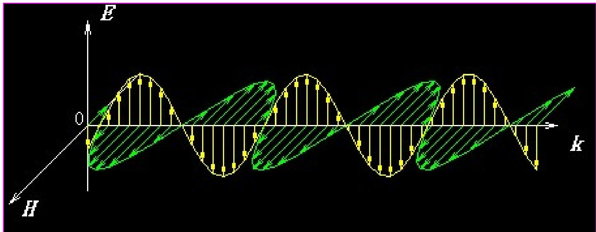

# （6）电磁波能流密度—坡印亭矢量

$$
\vec {S} = \vec {E} \times \vec {H}
$$

W m S k  / / / 其单位 为 2 ，

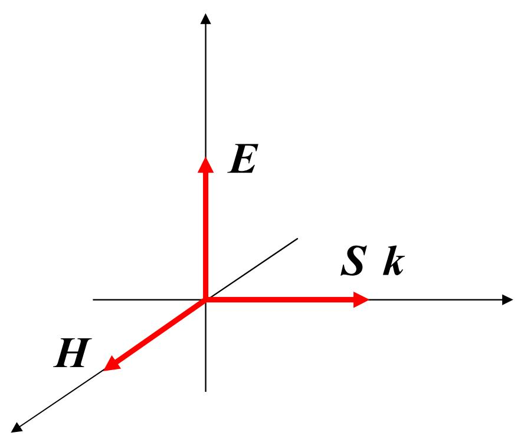

# 光强—平均电磁能流密度

$$
\begin{array}{l} I = \overline {{S}} = \frac {1}{T} \int_ {0} ^ {T} \left| \vec {E} \times \vec {H} \right| d t = \frac {1}{T} \int_ {0} ^ {T} \left| \vec {E} \right\lVert \vec {H} | d t \\ = \frac {1}{2} E _ {0} H _ {0} = \frac {1}{2} \sqrt {\frac {\varepsilon \varepsilon_ {0}}{\mu \mu_ {0}}} E _ {0} ^ {2} \\ \end{array}
$$

在可见光波段，介质分子的磁化机构几乎冻结，

所以：  1，n  

于是光强表示为： $I = \frac { 1 } { 2 } \sqrt { \frac { \varepsilon _ { 0 } } { \mu _ { 0 } } } n { E _ { 0 } } ^ { 2 } \propto n { E _ { 0 } } ^ { 2 }$ 20 2 0 0  nE  nE02

或写成： $I = n E _ { 0 } ^ { \ 2 }$ 

# （7）光的偏振特性

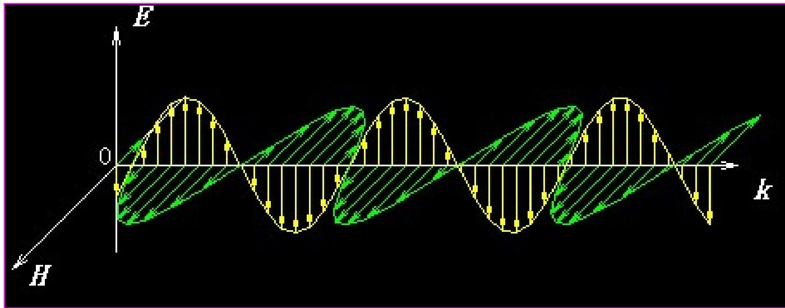

E和k组成的平面成为偏振面。

# 2、定态光波的复振幅描述

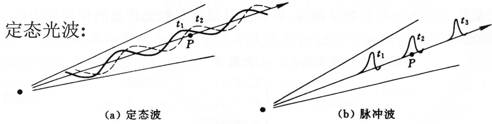

图2.5波动图像

（1）空间各点的扰动是同频率的简谐振荡（频率与振源相同）；

（2）波场中各点扰动的振幅不随时间变化，在空间形成一个稳定的振幅分布 严格的定态光波要求波列无限长。

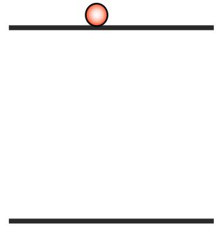

$$
\vec {E} (r, t) = \vec {E} _ {0} \cos (\omega t - \vec {k} \cdot \vec {r} + \varphi_ {E})
$$

$$
\vec {H} (r, t) = \vec {H} _ {0} \cos (\omega t - \vec {k} \cdot \vec {r} + \varphi_ {H})
$$

一次发光时间量级 $\tau \approx 1 0 ^ { - 8 } s$ ，而可见光的周期 $T \sim 1 0 ^ { - 1 4 } s = 1 0 f s .$ ，一个波列包含个周期，可看成定态波 。6~ 10 T ${ \frac { T } { \tau } } \sim 1 0 ^ { 6 }$ 

# 脉冲光波

超短脉冲激光ps，fs，as激光，在生物、化学、物理等领域有广泛的应用。

# ♣ 定态光波的标量表示

在自由空间（1）   E P t ,  0 H 0 0 E 0  $\vec { H } \perp \vec { E } , \varphi _ { H } = \varphi _ { E } ,$ H E H E ，  ， EP, t  H P t ,  

分量

标量

（2） 

$$
\left\{ \begin{array}{l} E _ {x} (P, t) \\ E _ {y} (P, t) \\ E _ {z} (P, t) \end{array} \right\} \quad \text {I I I} \quad U (P, t)
$$

波动方程 0 02   E    $\nabla ^ { 2 } \vec { E } - \varepsilon \varepsilon _ { 0 } \mu \mu _ { 0 } \frac { \partial ^ { 2 } \vec { E } } { \partial t ^ { 2 } } = 0$ 

$\vec { E } ( P , t ) = \left\{ E _ { x } , E _ { y } , E _ { z } \right\}$ 各个分量都遵从相同的波动函数。

$$
\frac {\partial^ {2} E _ {i}}{\partial x ^ {2}} + \frac {\partial^ {2} E _ {i}}{\partial y ^ {2}} + \frac {\partial^ {2} E _ {i}}{\partial z ^ {2}} - \varepsilon \varepsilon_ {0} \mu \mu_ {0} \frac {\partial^ {2} E _ {i}}{\partial t ^ {2}} = 0 \Rightarrow \nabla^ {2} E _ {i} - \varepsilon \varepsilon_ {0} \mu \mu_ {0} \frac {\partial^ {2} E _ {i}}{\partial t ^ {2}} = 0
$$

$$
i = x, y, z
$$

把矢量方程转化为标量方程：

$$
\nabla^ {2} U - \varepsilon \varepsilon_ {0} \mu \mu_ {0} \frac {\partial^ {2} U}{\partial t ^ {2}} = 0
$$

简谐波为定态波的基元成分，其标量形式：

$$
U (P, t) = A (P) \cos (\omega t - \varphi (P))
$$

振幅稳定，频率单一

# 波函数的复数表示

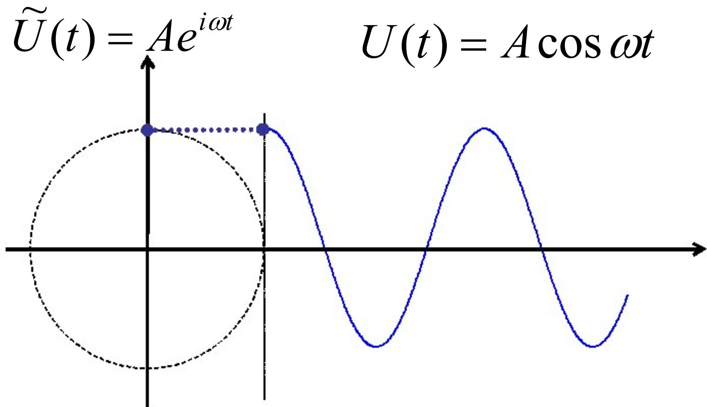

数学上复数的实部和虚部分别对应cos函数和sin函数：

$$
\widetilde {U} = A e ^ {i \alpha} = A \left(\cos \alpha + i \sin \alpha\right)
$$

$$
\cos \alpha = \frac {e ^ {i \alpha} + e ^ {- i \alpha}}{2}, \qquad \sin \alpha = \frac {e ^ {i \alpha} - e ^ {- i \alpha}}{2 i}
$$

简谐波函数和复数对应。

$$
\begin{array}{l} U (P, t) = A (P) \cos (\omega t - \varphi (P)) \\ \Downarrow \\ \end{array}
$$

$$
\widetilde {U} (P, t) = A (P) e ^ {\pm i (\omega t - \varphi (P))} \Rightarrow \widetilde {U} (P, t) = A (P) e ^ {\left(- i (\omega t - \varphi (P)) \right.}
$$

复数的模对应振幅，复数的复角对应相位，我们取－号，$\varphi ( P )$ 正号表示相位落后。

平面简谐波

$$
U (\vec {r}, t) = A \cos (\omega t - \vec {k} \cdot \vec {r} - \phi_ {0})
$$

$$
\tilde {U} (\vec {r}, t) = A e ^ {i \vec {k} \cdot \vec {r}} e ^ {- i \omega t} = A e ^ {i (k _ {x} x + k _ {y} y + k _ {z} z)} e ^ {- i \omega t}; \quad (\text {设} \phi_ {0} = 0)
$$

球面简谐波

$$
U (\vec {r}, t) = \frac {A}{r} \cos (\omega t - \vec {k} \cdot \vec {r} - \phi_ {0})
$$

$$
\tilde {U} (\vec {r}, t) = \frac {A}{r} e ^ {i \vec {k} \cdot \vec {r}} e ^ {- i \omega t} = \frac {A}{\sqrt {x ^ {2} + y ^ {2} + z ^ {2}}} e ^ {\pm i k \sqrt {x ^ {2} + y ^ {2} + z ^ {2}}} e ^ {- i \omega t}; (\mathrm {设} \phi_ {0} = 0)
$$

柱面简谐波

$$
U (\vec {r}, t) = \frac {A}{\sqrt {r}} \cos (\omega t - \vec {k} \cdot \vec {r} - \phi_ {0})
$$

$$
\tilde {U} (\vec {r}, t) = \frac {A}{\sqrt {r}} e ^ {i \vec {k} \cdot \vec {r}} e ^ {- i \omega t} = \frac {A}{\sqrt [ 4 ]{x ^ {2} + y ^ {2}}} e ^ {\pm i k \sqrt {x ^ {2} + y ^ {2}}} e ^ {- i \omega t}; \qquad (\text {设} \phi_ {0} = 0)
$$

定态波，时间频率单一，我们关心振幅的空间复振幅概念：分布A(P)和相位空间分布(P)，引进复振幅概念

$$
\tilde {U} (P) = A (P) e ^ {i \varphi (P)}
$$

# 三种典型光波的复振幅：

平面简谐波

$$
\tilde {U} (P) = A e ^ {i \vec {k} \cdot \vec {r}} = A e ^ {i (k _ {x} x + k _ {y} y + k _ {z} z)}
$$

球面简谐波

$$
\tilde {U} (P) = \frac {A}{r} e ^ {i \vec {k} \cdot \vec {r}} = \frac {A}{\sqrt {x ^ {2} + y ^ {2} + z ^ {2}}} e ^ {\pm i k \sqrt {x ^ {2} + y ^ {2} + z ^ {2}}}
$$

柱面简谐波

$$
\tilde {U} (P) = \frac {A}{\sqrt {r}} e ^ {i \vec {k} \cdot \vec {r}} = \frac {A}{\sqrt [ 4 ]{x ^ {2} + y ^ {2}}} e ^ {\pm i k \sqrt {x ^ {2} + y ^ {2}}}
$$

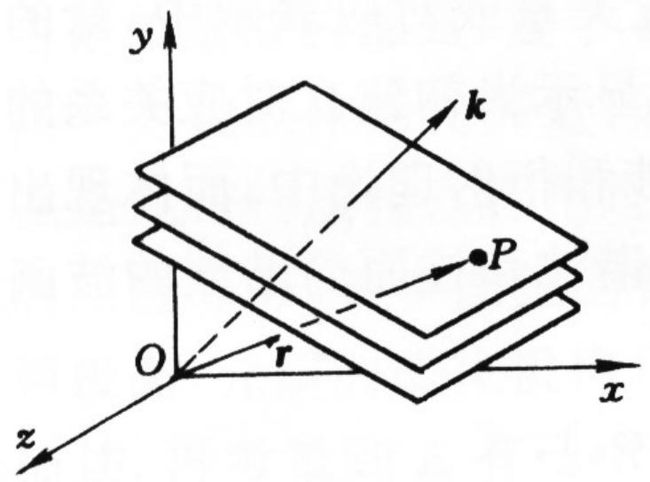

图2.6平面波特征矢量—波矢k

$$
\widetilde {U} (\vec {r}) = A e ^ {i \vec {k} \cdot \vec {r}} = A e ^ {i (k _ {x} \cdot x + k _ {y} \cdot y + k _ {z} \cdot z)} = A e ^ {i k (\cos \alpha \cdot x + \cos \beta \cdot y + \cos \gamma \cdot z)}
$$

平面波复振幅的特点：1、振幅为常数

2、线性相因子

线 $\left. \begin{array} { l } { { \tt \tt { \tt { \tt { \tt { \tt { E } } } } } } \mathop { { \tt { \tt { \tt { 1 } } } } } \mathop { { \tt { \tt { \tt { \tt { E } } } } } } \mathop { { \tt { \tt { \box { \tt { 1 } } } } } } \mathop { { \tt { \tt { \tt { E } } } } } } \\ { { \bar { \tt { \tt { \tt { \tt { \tt { \tt { \tt { \tt { \tt { \alpha } } } } } } } } } } } , k _ { y } , k _ { z } ) \mathop { { \tt { \tt { \box { \tt { \tt { \tt { \tt { \tt { \tt { \alpha } } } } } } } } } } } \mathop { { \tt { \tt { \tt { \tt { \tt { \tt { \tt { \tt { \tt { \alpha } } } } } } } } } } } ( \cos \alpha , \cos \beta , \cos \gamma ) } \end{array} \right\}$ 传播方向$( k _ { x } , k _ { y } , k _ { z } )$ 

$$
\sqrt {k _ {x} ^ {2} + k _ {y} ^ {2} + k _ {z} ^ {2}} = k = \frac {2 \pi}{\lambda}
$$

# 球面波复振幅及其特点

（1）发散球面波（源在坐标原点）

$$
\tilde {U} (P) = \frac {A}{r} e ^ {i \vec {k} \cdot \vec {r}}
$$

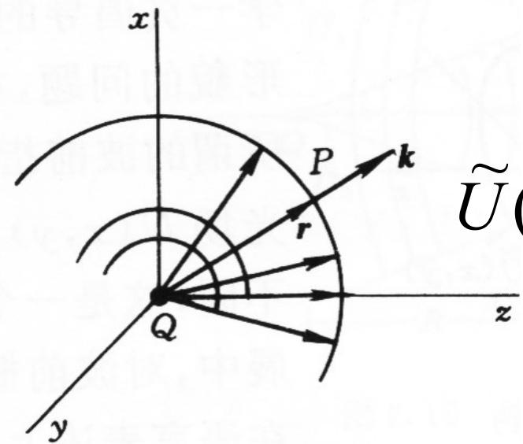

$$
\underset {z} {\widetilde {U}} (P) = \frac {A}{r} e ^ {i k r} = \frac {A}{\sqrt {x ^ {2} + y ^ {2} + z ^ {2}}} e ^ {i k \sqrt {x ^ {2} + y ^ {2} + z ^ {2}}}
$$

（a）发散球面波

（2）会聚球面波（汇聚中心在坐标原点）

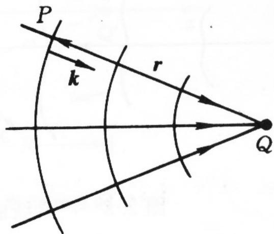

（b）会聚球面波

$$
\widetilde {U} (P) = \frac {A}{r} e ^ {- i k r} = \frac {A}{\sqrt {x ^ {2} + y ^ {2} + z ^ {2}}} e ^ {- i k \sqrt {x ^ {2} + y ^ {2} + z ^ {2}}}
$$

# （3）轴外点源

$Q ( \mathrm { x } _ { 0 } , \mathrm { y } _ { 0 } , \mathrm { z } _ { 0 } )$ 为点源，场点P(x,y,z)

$$
\widetilde {U} (P) = \frac {A}{r} e ^ {\pm i k r}, \qquad r = \sqrt {(x - x _ {0}) ^ {2} + (y - y _ {0}) ^ {2} + (z - z _ {0}) ^ {2}}
$$

+ 发散，- 会聚，聚散中心 $\left( \mathbf { \boldsymbol { x } } _ { 0 } , \mathbf { \boldsymbol { y } } _ { 0 } , \mathbf { \boldsymbol { z } } _ { 0 } \right)$ 

# 光强和复振幅的关系

光强空间分布： $I ( P ) = \widetilde U ( P ) \cdot \widetilde U ^ { * } ( P ) = A ^ { 2 } ( P )$ 

这里 $\widetilde { U } ^ { \mp } \overline { { ( P ) } }$ 是 $\widehat { \overline { { U ( P ) } } } \sharp _ { \cdot } ^ { \sharp }$ 复共轭

$$
\widetilde {U} (P) = A (P) e ^ {i \varphi (P)}
$$

$$
\widetilde {U} ^ {*} (P) = A (P) e ^ {- i \varphi (P)}
$$

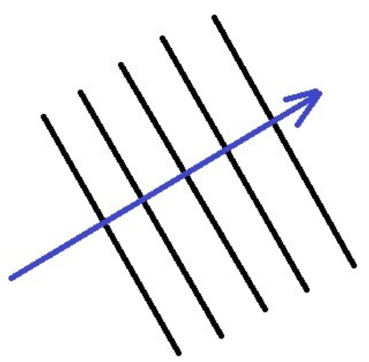

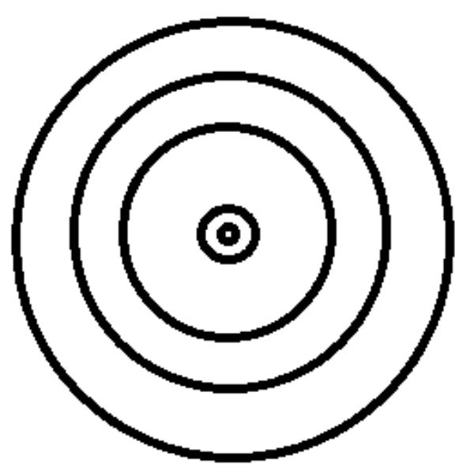

# 波前函数

波前和波前光学

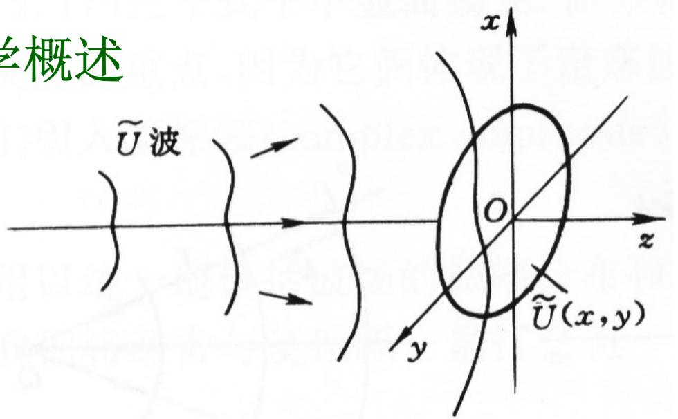

图2.8广义波前 $U ( x , y )$

“波前”一词指波场中任一曲面，更多地指一个平面，如记录介质、感光底片、接收屏幕等所在的平面的复振幅分布U(x,y)。

# 波前分析是本课的主脉络， 包括：

1. 波前的描述和识别

2. 波前的叠加和干涉

3. 波前的变换和分析

4. 波前的记录和再现

# ♠ 平面和球面波前函数以及其共轭波前

（1）一列平面波 $\mathbf { U _ { 1 } }$ ： $k _ { 1 x } = k \sin \theta , ~ k _ { 1 y } = 0 , ~ k _ { 1 z } = k \cos \theta$ 

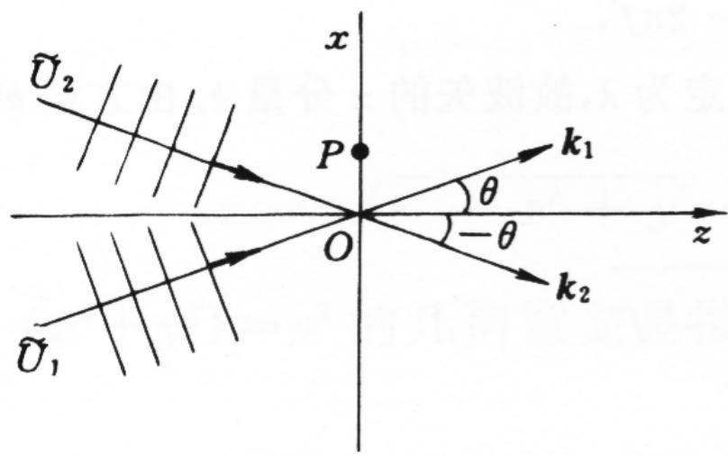

图2.9平面波及其共轭波前

$$
\widetilde {U} (\vec {r}) = A e ^ {i \vec {k} \cdot \vec {r}} = A e ^ {i (k _ {x} \cdot x + k _ {y} \cdot y + k _ {z} \cdot z)} = A e ^ {i k (\sin \theta \cdot x + \cos \theta \cdot z)}
$$

在 $z { = } 0$ 的平面上的波前函数：

$$
\widetilde {U} _ {1} (x, y) = A e ^ {i k \sin \theta \cdot x}
$$

其共轭波前：

$$
\widetilde {U} _ {2} (x, y) = \widetilde {U} ^ {*} _ {1} (x, y) = A e ^ {- i k \sin \theta \cdot x} = A e ^ {i k \sin - \theta \cdot x}
$$

（2）一球面波, 点光源 Q(0,0,-R) $x _ { 0 } = y _ { 0 } = 0 , ~ z _ { 0 } = - R$ 

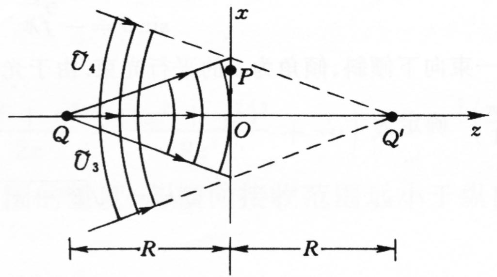

图2.10球面波及其共轭波前

$$
\widetilde {U} (P) = \frac {A}{r} e ^ {i k r}, \qquad r = \sqrt {(x - x _ {0}) ^ {2} + (y - y _ {0}) ^ {2} + (z - z _ {0}) ^ {2}}
$$

$Z { = } 0$ 平面的波前函数：

$$
\widetilde {U} _ {3} (x, y) = \frac {A}{r} e ^ {i k r}, \qquad r = \sqrt {(x - x _ {0}) ^ {2} + (y - y _ {0}) ^ {2} + R ^ {2}}
$$

其共轭波前：

$$
\widetilde {U} _ {4} (x, y) = \widetilde {U} _ {3} ^ {*} (x, y) = \frac {A}{r} e ^ {- i k r}, \qquad r = \sqrt {(x - x _ {0}) ^ {2} + (y - y _ {0}) ^ {2} + R ^ {2}}
$$

# 波的类型和特性  波前函数

例题：已知一列波长为的波，在(x,y)接收面上的波前函数为：

$$
\widetilde {U} (x, y) = A e ^ {\left(- i 2 \pi f x\right)}
$$

其中常数f的单位为mm-1 ,试分析与该波前函数联系的波的类型和特性？

线形因子平面波

$$
\widetilde {U} (x, y) = A e ^ {- i 2 \pi f x} = A e ^ {- i \frac {2 \pi}{\lambda} f \lambda \cdot x} = A e ^ {- i k (f \lambda) \cdot x} \quad \text {与} \mathrm {y} \text {无 关 ， 因 此} \mathrm {k} _ {\mathrm {y}} = 0
$$

$$
\widetilde {U} (x, y) = A e ^ {i k \sin \theta \cdot x}
$$

所以：

$$
\sin \theta = - f \lambda \qquad {\text {或}} \qquad k _ {x} = - 2 \pi f
$$

$$
k _ {z} = \sqrt {k ^ {2} - k _ {x} ^ {2}} = 2 \pi \sqrt {\frac {1}{\lambda^ {2}} - f ^ {2}}
$$

# 4、 球面波向平面波的转化

# 球面波和平面波的理论地位

平面简谐波或球面简谐波可以看成为复杂波场的基元成分，所有复杂波场都可以分解成一系列球面波或平面波的叠加。

在一定条件下

球面波 平面波

1、厘清平面波的特征：振幅是常数，相因子为线性相因子

2、寻找将球面波的波前函数，转化为平面波的波前函数的近似条件

$\textcircled { \scriptsize { 1 } }$ 傍轴条件或振幅条件---- ${ z _ { 0 } } ^ { 2 } > > \rho ^ { 2 }$ 

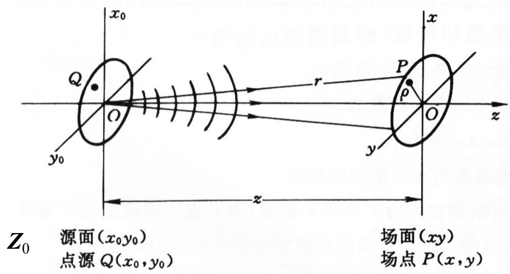

图2.11考察球面波向平面波的转化

点源O(0,0),球面波到（x,y）面的波前函数：

$$
\widetilde {U} (x, y) = \frac {A}{r} e ^ {i k r},
$$

其中

$$
r = \sqrt {x ^ {2} + y ^ {2} + z _ {0} ^ {2}} = z _ {0} \sqrt {1 + \frac {x ^ {2} + y ^ {2}}{z _ {0} ^ {2}}} = z _ {0} \left(1 + \frac {x ^ {2} + y ^ {2}}{2 z _ {0} ^ {2}} - \frac {\left(x ^ {2} + y ^ {2}\right) ^ {2}}{8 z _ {0} ^ {4}} + \dots\right)
$$

$\rho ^ { 2 } = ( x ^ { 2 } + y ^ { 2 } )$ 横向接收范围的尺度。

在 ${ z _ { 0 } } ^ { 2 } > > \rho ^ { 2 }$ 下，波前函数中的振幅可以近似为：

$$
\frac {A}{r} \approx \frac {A}{z _ {0}}
$$

但是相因子中的二次项不能轻易舍弃，保留到二次项：

$$
\widetilde {U} (x, y) \approx \frac {A}{z _ {0}} e ^ {i k \frac {x ^ {2} + y ^ {2}}{2 z _ {0}}} \cdot e ^ {i k z _ {0}}
$$

特点：常数振幅，非线性因子。

傍轴条件：

$$
z _ {0} ^ {2} \gg \rho^ {2}
$$

$$
\begin{array}{l} r = \sqrt {x ^ {2} + y ^ {2} + z _ {0} ^ {2}} \\ = z _ {0} \sqrt {1 + \frac {x ^ {2} + y ^ {2}}{z _ {0} ^ {2}}} \\ = z _ {0} \left(1 + \frac {x ^ {2} + y ^ {2}}{2 z _ {0} ^ {2}} + \dots\right) \\ \end{array}
$$

因为，相因子对扰动的影响具有“周期性”：

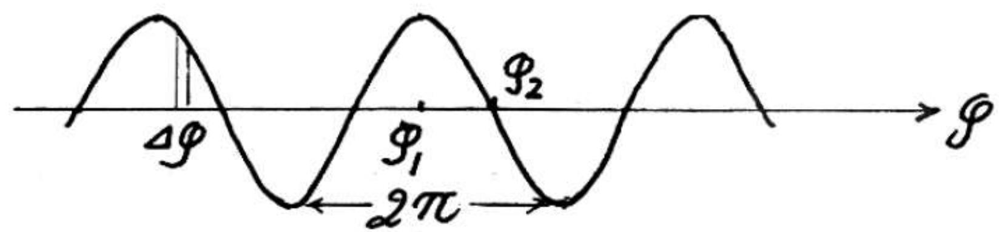

图2.14

譬如

$$
k z = 1 0 0 \pi , k \frac {x ^ {2} + y ^ {2}}{2 z} = 0. 5 \pi
$$

U态与 $U _ { 2 }$ 态,是明显不同的，

故相因子中可忽略的量只可以是

$$
k \frac {x ^ {2} + y ^ {2}}{2 z} \ll \pi !
$$

◑ 远场条件或相位条件---- ${ } - z _ { 0 } \lambda > > \rho ^ { 2 }$ 

相因子对物理状态的影响具有周期性，周期为 $2 \pi$ 。相因子中可以忽略的小量应该是远远小于。

$$
\tilde {U} (x, y) = \frac {A}{r} e ^ {i k r}
$$

$$
k r = k \sqrt {x ^ {2} + y ^ {2} + z _ {0} ^ {2}} = \left(k z _ {0} + k \frac {x ^ {2} + y ^ {2}}{2 z _ {0}} - k \frac {\left(x ^ {2} + y ^ {2}\right) ^ {2}}{8 z _ {0} ^ {3}} + \dots\right)
$$

可以忽略二次项的条件：

$$
\begin{array}{r} k \frac {x ^ {2} + y ^ {2}}{2 z _ {0}} = k \frac {\rho^ {2}}{2 z _ {0}} = \frac {2 \pi}{\lambda} \frac {\rho^ {2}}{2 z _ {0}} \ll \pi \\ \boxed {z _ {0} \lambda > > \rho^ {2} \text {这 是 远 场 条 件}} \end{array}
$$

相因子可以近似为：

$$
e ^ {i k r} \approx e ^ {i k z _ {0}}
$$

振幅系数须保留二次项：

$$
\widetilde {U} (x, y) = \frac {A}{r} e ^ {i k z _ {0}} \approx \frac {A}{z _ {0} + \frac {x ^ {2} + y ^ {2}}{2 z _ {0}}} e ^ {i k z _ {0}}
$$

同时满足傍轴条件和远场条件：

$$
U (x, y) = \frac {A}{z _ {0}} e ^ {i k z _ {0}}
$$

为正入射平面波，这时，球面波转变成了平面波。

◑ 比较傍轴和远场条件

例题1、设波长~500nm,横向距离~1mm，约定 $^ { 6 6 } > > ^ { 9 9 }$ 为50倍，推算傍轴条件下的纵向距离Zp和远场条件的Zf.

$$
Z _ {p} \approx \sqrt {5 0} \rho = \sqrt {5 0} \times 1 m m \approx 7 m m
$$

$$
Z _ {f} \approx 5 0 \frac {\rho^ {2}}{\lambda} = 5 0 \rho \left(\frac {\rho}{\lambda}\right) = 5 0 \times 1 m m \times \left(2 \times 1 0 ^ {3}\right) = 1 0 0 m
$$

$Z _ { f } > Z _ { p } ,$ ，因为 $\rho / \lambda$ 带来高倍率。

例题2、设波长~1m,横向距离~10cm，约定 $^ { 6 6 } > > ^ { 9 9 }$ 为50倍，推算傍轴条件下的纵向距离 $\mathbf { Z _ { p } }$ 和远场条件的Zf.

$$
Z _ {p} \approx \sqrt {5 0} \rho = \sqrt {5 0} \times 1 c m \approx 7 0 c m
$$

$$
Z _ {f} \approx 5 0 \frac {\rho^ {2}}{\lambda} = 5 0 \rho \left(\frac {\rho}{\lambda}\right) = 5 0 \times 1 0 c m \times (0. 1) = 5 0 c m
$$

$Z _ { f } < Z _ { p } ,$ ，因为 $\rho / \lambda$ 小于1。

# 结论：

1. 比较傍轴条件和远场条件谁对纵向距离要求更远，取决于/。

$$
\rho / \lambda \mathrm {大}, Z _ {f} > Z _ {p}, \qquad \rho / \lambda \mathrm {小}, Z _ {f} <   Z _ {p},
$$

2. 在可见光波段，通常 $\rho / \lambda > > 1$ ，故Zf>>Zp

$$
z _ {0} \lambda \gg \rho^ {2}
$$

# 5 波前相因子分析法

# 波的类型和特性 波前函数

波场的主要特征体现在波前函数的相因子中。如果能将一个复杂的波场中复振幅的相因子与平面波或球面波的相因子作一比较，使之联系起来，则复杂波场即可分解为一系列平面波或球面波成分，从而使我们比较容易从概念上去掌握它。所谓“相因子判断法”，简言之，即根据波前函数的相因子来判断波场的性质，分析波场的主要特征。为了使用相因子判断法，我们先要熟悉平面波和几种典型情况下球面波在波前上的相因子。如果进一步讨论光场的转化，要搞清楚各种各种光学元器件的转化规律。

波的类型和特性  波前相因子

# (1) 平面波

平面波的波前函数具有线性相因子，

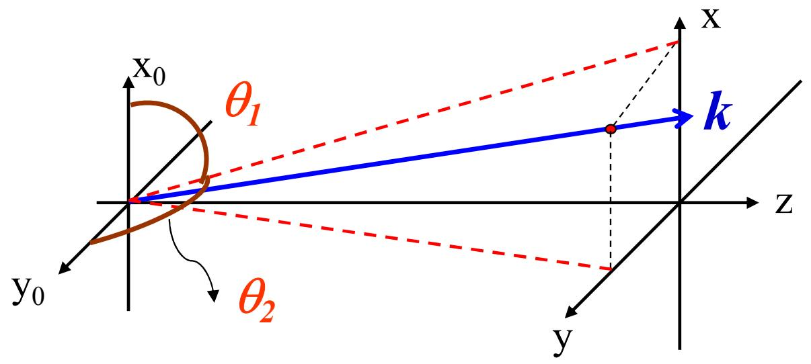

 和 $\theta _ { 2 }$ 是波矢k的两个方向余弦角的余角。

$$
k _ {x} = k \cos \theta_ {1}, \quad k _ {y} = k \cos \theta_ {2}
$$

在 ${ \boldsymbol { z } } { = } 0$ 平面的波前函数和相因子：

$$
\widetilde {U} (x, y) = A e ^ {i k (\cos \theta_ {1} \cdot x + \cos \theta_ {2} \cdot y)} \propto e ^ {i k (\cos \theta_ {1} \cdot x + \cos \theta_ {2} \cdot y)}
$$

线性相因子系数（cos  1，cos2）与平面波的传播方向一一对应。

# （2）球面波

# I、发散球面波

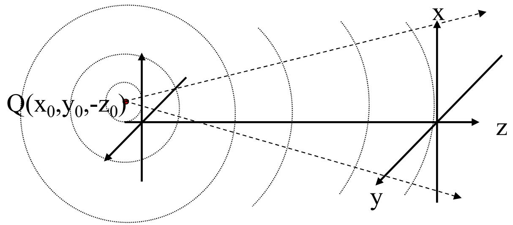

$$
\widetilde {U} (x, y) = \frac {A}{r} e ^ {i k r}, \qquad r = \sqrt {(x - x _ {0}) ^ {2} + (y - y _ {0}) ^ {2} + z _ {0} ^ {2}}
$$

在傍轴条件下：

$$
\tilde {U} (x, y) \approx \frac {A}{z _ {0}} e ^ {i k \frac {(x - x _ {0}) ^ {2} + (y - y _ {0}) ^ {2}}{2 z _ {0}}} \cdot e ^ {i k z _ {0}} \propto e ^ {i k z _ {0}} \propto e ^ {i k \frac {x ^ {2} + y ^ {2}}{2 z _ {0}}} \cdot e ^ {i k \frac {x _ {0} ^ {2} + y _ {0} ^ {2}}{2 z _ {0}}} \cdot e ^ {- i k \frac {x x _ {0} + y y _ {0}}{z _ {0}}}
$$

$$
\propto e ^ {i k \frac {x ^ {2} + y ^ {2}}{2 z _ {0}}} \cdot e ^ {- i k \frac {x x _ {0} + y y _ {0}}{z _ {0}}}
$$

发散中心为 （x0,y0,-z0）

# II、汇聚球面波

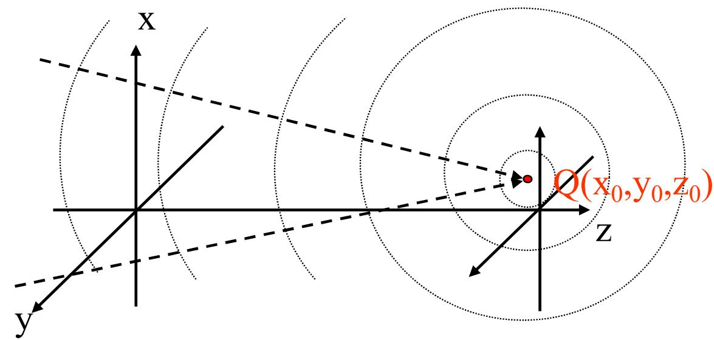

$$
\widetilde {U} (x, y) = \frac {A}{r} e ^ {- i k r}, \qquad r = \sqrt {(x - x _ {0}) ^ {2} + (y - y _ {0}) ^ {2} + z _ {0} ^ {2}}
$$

在傍轴条件下：

$$
\begin{array}{l} \tilde {U} (x, y) \approx \frac {A}{z _ {0}} e ^ {- i k \frac {(x - x _ {0}) ^ {2} + (y - y _ {0}) ^ {2}}{2 z _ {0}}} \cdot e ^ {- i k z _ {0}} \propto e ^ {- i k \frac {x ^ {2} + y ^ {2}}{2 z _ {0}}} \cdot e ^ {- i k \frac {x _ {0} ^ {2} + y _ {0} ^ {2}}{2 z _ {0}}} \cdot e ^ {\frac {i k \frac {x X _ {0} + y Y _ {0}}{z _ {0}}}{z _ {0}}} \\ \propto e ^ {- i k \frac {x ^ {2} + y ^ {2}}{2 z _ {0}}} \cdot e ^ {\frac {X X _ {0} + Y Y _ {0}}{z _ {0}}} \\ \end{array}
$$

汇聚中心为 Q（x0,y0,z0）

总结：

表V-1 平面波和球面波在波前上的相因子

<table><tr><td>波的类型</td><td>特征</td><td>相因子</td><td>图解</td></tr><tr><td>(1)平面波</td><td>传播方向 (θ1, θ2)
当θ1=θ2=0时</td><td>exp[ik(sinθ1x+sinθ2y)]</td><td></td></tr><tr><td>(2)发散球面波</td><td>中心在轴上
坐标 (0,0,-z)</td><td>exp[ik(x2+y2)/2z]</td><td></td></tr><tr><td>(3)会聚球面波</td><td>中心在轴上
坐标 (0,0,z)</td><td>exp[-ikx2+y2/2z]</td><td></td></tr></table>

续表

<table><tr><td>波的类型</td><td>特征</td><td>相因子</td><td>图解</td></tr><tr><td rowspan="2">(4)发散球面波</td><td rowspan="2">中心在轴外坐标 (x0,y0,-z)</td><td rowspan="2">exp[ik(x2+y2/2z-xx0+yy0)]</td><td>(x0,y0)</td></tr><tr><td>O</td></tr><tr><td>(5)会聚球面波</td><td>中心在轴外坐标 (x0,y0,z)</td><td>exp[-ik(x2+y2/2z-xx0+yy0)]</td><td>(x,y)(x0,y0)</td></tr></table>

例题：在(x, y)平面上波前函数的相因子为  i k   x y 2 2 4 D k为波矢, 分析波场e的类型和特征？

二次相因子 傍轴球面波

无一次相因子  中心在z轴上

相因子中的负号  汇聚球面波

进一步确定中心位置，把相因子函数改写成标准形式：

$$
e ^ {- i k \left(4 \frac {x ^ {2} + y ^ {2}}{D}\right)} = e ^ {- i k \left(\frac {x ^ {2} + y ^ {2}}{2 \left(\frac {D}{8}\right)}\right)}
$$

于是判断汇聚中心的位置为(0, 0, D/8)