# 光在各向同性介质

# 表面的反射与折射

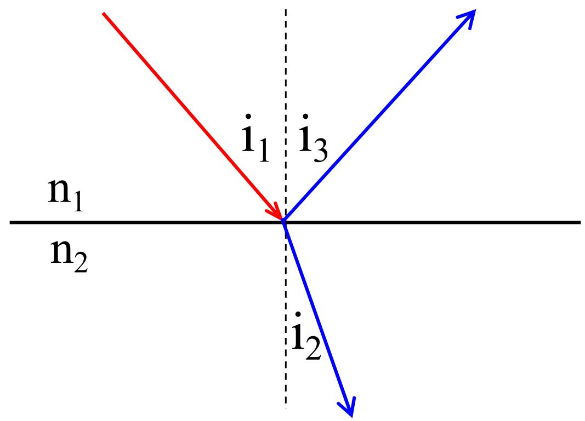

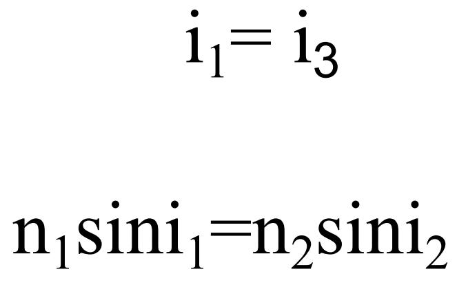

法国物理学家菲涅耳（A.Fresnel，1788～1827）在1823年得出了菲涅耳公式。解决了反（折）射光的能流分配、相位和偏振态怎样随入射角和两侧介质的折射率改变的问题。

# 菲涅耳公式

# *电磁场边值关系

电磁场边值关系由麦克斯韦积分方程给出，其反映了电磁场在两种介质分界面处的突变的规律。

$$
\left\{ \begin{array}{l} \oint_ {L} \vec {E} \cdot d \vec {l} = - \frac {d}{d t} \iint_ {S} \vec {B} \cdot d \vec {S} \\ \oint_ {L} \vec {H} \cdot d \vec {l} = I _ {f} + \frac {d}{d t} \iint_ {S} \vec {D} \cdot d \vec {S} \\ \iint_ {S} \vec {D} \cdot d \vec {S} = Q _ {f} \\ \iint_ {S} \vec {B} \cdot d \vec {S} = 0 \end{array} \right.
$$

$$
\left\{ \begin{array}{l l} \overrightarrow {n} \times (\overrightarrow {E} _ {2} - \overrightarrow {E} _ {1}) = 0 \\ \overrightarrow {n} \times (\overrightarrow {H} _ {2} - \overrightarrow {H} _ {1}) = \alpha \\ \overrightarrow {n} \cdot (\overrightarrow {D} _ {2} - \overrightarrow {D} _ {1}) = \sigma \\ \overrightarrow {n} \cdot (\overrightarrow {B} _ {2} - \overrightarrow {B} _ {1}) = 0 \end{array} \right.
$$

$$
\left\{ \begin{array}{l} \oint_ {L} \vec {E} \cdot d \vec {l} = - \frac {d}{d t} \iint_ {S} \vec {B} \cdot d \vec {S} \\ \oint_ {L} \vec {H} \cdot d \vec {l} = I _ {f} + \frac {d}{d t} \iint_ {S} \vec {D} \cdot d \vec {S} \\ \iint_ {S} \vec {D} \cdot d \vec {S} = Q _ {f} \\ \iint_ {S} \vec {B} \cdot d \vec {S} = 0 \end{array} \right.
$$

1. 绝缘介质，无表面自由电荷和传导电流。

2. 各向同性介质。

3. 光学线性介质（弱光强），满足 $\scriptstyle D = \varepsilon _ { \boldsymbol { \theta } } \varepsilon E$ 

4. 在光频段，高频率条件下，介质的磁化机制几乎冻结，故磁导率1，于是介质光学折射率 $n = \sqrt { \varepsilon \mu } \approx \sqrt { \varepsilon }$ 

# 在绝缘介质界面，无自由电荷和传导电流

$$
\left\{ \begin{array}{l l} \varepsilon_ {1} E _ {1 n} = \varepsilon_ {2} E _ {2 n} & \text {电 位 移 矢 量 法 线 分 量 连 续} \\ E _ {1 t} = E _ {2 t} & \text {电 场 强 度 矢 量 切 线 分 量 连 续} \\ \mu_ {1} H _ {1 n} = \mu_ {2} H _ {2 n} & \text {磁 感 应 强 度 矢 量 法 线 分 量 连 续} \\ H _ {1 t} = H _ {2 t} & \text {磁 场 强 度 切 线 分 量 连 续} \end{array} \right.
$$

这种场分量的连续性反映了电磁场的突变，比如电位移矢量法线分量的连续给出了电场强度矢量法线分量在两种介质分界面处的突变，即不连续。

光是电磁波，在界面处的入射光、反射光和折射光的复振幅矢量满足边值关系。由边值关系可以推导出这三个复振幅矢量的关系，即菲涅耳公式。

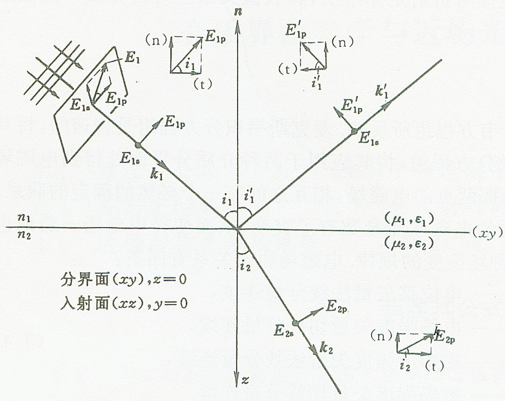

图3.1光在介质界面反射折射的基本物理图像

# *特征振动方向和局部坐标架

图显示了界面反射和折射时的电场矢量和光传播方向的空间取向，它是正确理解菲涅耳公式的一个基本图象。p和s为特征振动方向。

p k 可以构成一个局部的坐标架，我们约定： S

 1 1 1, , p s k    构成一个局部正交坐标架，且 $\left( \vec { p } _ { 1 } \times \vec { s } _ { 1 } \right) / / \vec { k } _ { 1 }$  1 1 1'  ,  '  ,  ' p s k    构成一个局部正交坐标架，且 $\left( \vec { p } _ { 1 } ^ { \prime } { \times } \vec { s } _ { 1 } ^ { \prime } \right) / / \vec { k } _ { 1 } ^ { \prime }$  2 2 2, , p s k    构成一个局部正交坐标架，且 $\left( { \bar { p } } _ { 2 } \times { \bar { s } } _ { 2 } \right) / / { \bar { k } } _ { 2 }$ 

入射线偏振单色平面波，

复振幅矢量

$$
\begin{array}{l} \mathbf {E} _ {1} (\mathbf {r}, t) = \mathbf {E} _ {1 0} e ^ {i \left(\mathbf {k} _ {1} \cdot \mathbf {r} - \omega t + \varphi_ {1 0}\right)} \\ = \widetilde {\mathbf {E}} _ {1 0} e ^ {i \mathbf {k} _ {1} \cdot \mathbf {r}} e ^ {- i \omega t}, \quad \widetilde {\mathbf {E}} _ {1 0} = \widetilde {\mathbf {E}} _ {1 0} \cdot e ^ {i \varphi_ {1 0}}, \\ \end{array}
$$

反射线偏振单色平面波，

$$
\widetilde {\mathbf {E}} _ {1} ^ {\prime} (\mathbf {r}, t) = \widetilde {\mathbf {E}} _ {1 0} ^ {\prime} e ^ {i \mathbf {k} _ {1} ^ {\prime} \cdot \mathbf {r}} e ^ {- i \omega t}, \quad \widetilde {\mathbf {E}} _ {1 0} ^ {\prime} = \widetilde {\mathbf {E}} _ {1 0} ^ {\prime} e ^ {i \varphi_ {1 0} ^ {\prime}},
$$

折射线偏振单色平面波，

$$
\widetilde {\mathbf {E}} _ {2} (\mathbf {r}, t) = \mathbf {E} _ {2 0} e ^ {i \mathbf {k} _ {2} \cdot \mathbf {r}} e ^ {- i \omega t}, \widetilde {\mathbf {E}} _ {2 0} = \widetilde {\mathbf {E}} _ {2 0} e ^ {i \varphi_ {2 0}},
$$

$$
\left\{ \begin{array}{l} E _ {1 x} + E ^ {\prime} _ {1 x} = E _ {2 x} \\ E _ {1 y} + E ^ {\prime} _ {1 y} = E _ {2 y} \\ \varepsilon_ {1} (E _ {1 z} + E ^ {\prime} _ {1 z}) = \varepsilon_ {2} E _ {2 z} \end{array} \right.
$$

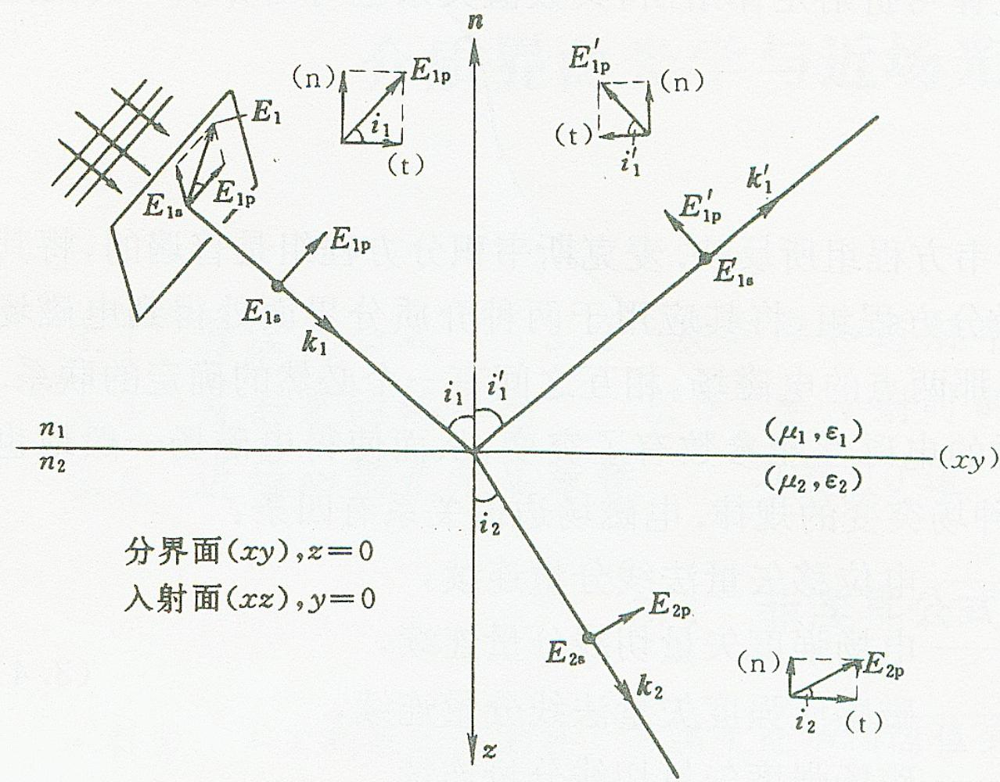

图3.1光在介质界面反射折射的基本物理图像

$$
\left\{ \begin{array}{l} E _ {1 x} = E _ {1 p} \cos i _ {1}, E _ {1 z} = E _ {1 p} \sin i _ {1}, E _ {1 y} = E _ {1 s} \\ E _ {2 x} = E _ {2 p} \cos i _ {2}, E _ {2 z} = E _ {2 p} \sin i _ {2}, E _ {2 y} = E _ {2 s} \\ E ^ {\prime} _ {1 x} = - E ^ {\prime} _ {1 p} \cos i _ {1}, E ^ {\prime} _ {1 z} = E ^ {\prime} _ {1 p} \sin i _ {1}, E ^ {\prime} _ {1 y} = E ^ {\prime} _ {1 s} \end{array} \right.
$$

# *菲涅耳公式

$$
\frac {E _ {\mathrm {1 s}} ^ {\prime}}{E _ {\mathrm {1 s}}} = \frac {n _ {1} \cos i _ {1} - n _ {2} \cos i _ {2}}{n _ {1} \cos i _ {1} + n _ {2} \cos i _ {2}} = - \frac {\sin (i _ {1} - i _ {2})}{\sin (i _ {1} + i _ {2})}
$$

$$
\frac {E _ {\mathrm {1 p}} ^ {\prime}}{E _ {\mathrm {1 p}}} = \frac {n _ {2} \cos i _ {1} - n _ {1} \cos i _ {2}}{n _ {2} \cos i _ {1} + n _ {1} \cos i _ {2}} = \frac {\tan (i _ {1} - i _ {2})}{\tan (i _ {1} + i _ {2})}
$$

$$
\frac {E _ {\mathrm {2 s}}}{E _ {\mathrm {1 s}}} = \frac {2 n _ {1} \cos i _ {1}}{n _ {1} \cos i _ {1} + n _ {2} \cos i _ {2}} = \frac {2 \cos i _ {1} \sin i _ {2}}{\sin (i _ {1} + i _ {2})}
$$

$$
\frac {E _ {\mathrm {2 p}}}{E _ {\mathrm {1 p}}} = \frac {2 n _ {1} \cos i _ {1}}{n _ {2} \cos i _ {1} + n _ {1} \cos i _ {2}} = \frac {2 \cos i _ {1} \sin i _ {2}}{\sin (i _ {1} + i _ {2}) \cos (i _ {1} - i _ {2})}
$$

为什么选择p和s为特征振动方向？ ？

p振动和s振动之间互不交混，彼此独立，各有各的传播特性。

例题1：利用电磁场的边值关系证明s偏振光的反射和折射光均为s偏振。

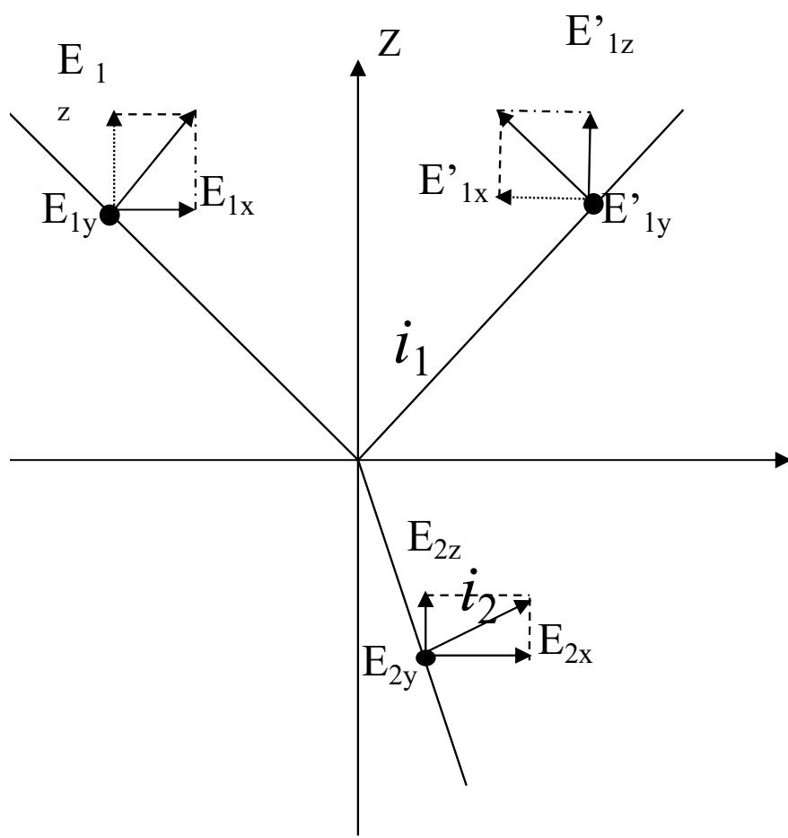

$$
\left\{ \begin{array}{l} E _ {1 x} + E ^ {\prime} _ {1 x} = E _ {2 x} \\ E _ {1 y} + E ^ {\prime} _ {1 y} = E _ {2 y} \\ \varepsilon_ {1} (E _ {1 z} + E ^ {\prime} _ {1 z}) = \varepsilon_ {2} E _ {2 z} \end{array} \right.
$$

x其中：

$$
\left\{ \begin{array}{l} E _ {1 x} = E _ {1 p} \cos i _ {1}, E _ {1 z} = E _ {1 p} \sin i _ {1}, E _ {1 y} = E _ {1 s} \\ E _ {2 x} = E _ {2 p} \cos i _ {2}, E _ {2 z} = E _ {2 p} \sin i _ {1}, E _ {2 y} = E _ {2 s} \\ E ^ {\prime} _ {1 x} = - E ^ {\prime} _ {1 p} \cos i _ {1}, E ^ {\prime} _ {1 z} = E ^ {\prime} _ {1 p} \sin i _ {1}, E ^ {\prime} _ {1 y} = E ^ {\prime} _ {1 s} \end{array} \right.
$$

求解得： $\left\{ \begin{array} { c } { E _ { \scriptscriptstyle { 1 p } } ^ { \prime } = E _ { \scriptscriptstyle { 1 p } } \frac { \varepsilon _ { \scriptscriptstyle { 2 } } \tan i _ { \scriptscriptstyle { 2 } } - \varepsilon _ { \scriptscriptstyle { 1 } } \tan i } { \varepsilon _ { \scriptscriptstyle { 2 } } \tan i _ { \scriptscriptstyle { 2 } } + \varepsilon _ { \scriptscriptstyle { 1 } } \tan i _ { \scriptscriptstyle { 1 } } } } \\ { E _ { \scriptscriptstyle { 2 p } } = E _ { \scriptscriptstyle { 1 p } } \frac { 2 \varepsilon _ { \scriptscriptstyle { 1 } } \sin i _ { \scriptscriptstyle { 1 } } \mathrm { c } } { \varepsilon _ { \scriptscriptstyle { 1 } } \cos i _ { \scriptscriptstyle { 2 } } \sin i _ { \scriptscriptstyle { 1 } } + \varepsilon _ { \scriptscriptstyle { 2 } } } } \end{array} \right.$ 1 cos sinos  i ii

因为入射光为s偏振，所以 $E _ { I p } { = } \mathbf { 0 }$ ，得 $E _ { \mathrm { { 1 p } } } ^ { \boldsymbol { \mathsf { 9 } } } \mathrm { { _ { 1 p } } } \mathrm { { = } } E _ { 2 \mathrm { { p } } } { = } \mathbf { { 0 } } _ { \mathrm { { : } } }$ ，即反射光和折射光仅为s偏振。

同理可以证明p偏振入射光的反射折射光只能是p偏振。请同学们自己推导 (H) 

本节讲解菲涅耳公式的应用，包含如下内容：

◐复振幅反射率和透射率， ◐光强 反射率和透射率，

◐光功率反射率和透射率， ◐布儒斯特角，

◐玻片组透射光的偏振度， ◐斯托克斯倒逆关系

由菲涅耳公式推导出复振幅反射率和透射率，它们包含了实振幅比值和相位差值 ：

$$
\left\{ \begin{array}{l} \widetilde {r _ {p}} \equiv \frac {\widetilde {E ^ {\prime}} _ {1 p}}{\widetilde {E} _ {1 p}} = \frac {n _ {2} \cos i _ {1} - n _ {1} \cos i _ {2}}{n _ {2} \cos i _ {1} + n _ {1} \cos i _ {2}} \\ \widetilde {r _ {s}} \equiv \frac {\widetilde {E ^ {\prime}} _ {1 s}}{\widetilde {E} _ {1 s}} = \frac {n _ {1} \cos i _ {1} - n _ {2} \cos i _ {2}}{n _ {1} \cos i _ {1} + n _ {2} \cos i _ {2}} \end{array} \right.
$$

$$
\left\{ \begin{array}{l} \widetilde {t} _ {p} \equiv \frac {\widetilde {E} _ {2 p}}{\widetilde {E} _ {1 p}} = \frac {2 n _ {1} \cos i _ {1}}{n _ {2} \cos i _ {1} + n _ {1} \cos i _ {2}} \\ \widetilde {t} _ {s} \equiv \frac {\widetilde {E} _ {2 s}}{\widetilde {E} _ {1 s}} = \frac {2 n _ {1} \cos i _ {1}}{n _ {1} \cos i _ {1} + n _ {2} \cos i _ {2}} \end{array} \right.
$$

(1) 外反射 $( n _ { 1 } < n _ { 2 } )$ ）即光从光疏介质射入光密介质；

$$
\left\{ \begin{array}{l} \widetilde {r _ {p}} \equiv \frac {\widetilde {E} _ {1 p} ^ {\prime}}{\widetilde {E} _ {1 p}} = \frac {n _ {2} \cos i _ {1} - n _ {1} \cos i _ {2}}{n _ {2} \cos i _ {1} + n _ {1} \cos i _ {2}} \\ \widetilde {r _ {s}} \equiv \frac {\widetilde {E} _ {1 s} ^ {\prime}}{\widetilde {E} _ {1 s}} = \frac {n _ {1} \cos i _ {1} - n _ {2} \cos i _ {2}}{n _ {1} \cos i _ {1} + n _ {2} \cos i _ {2}} \end{array} \right.
$$

$$
\left\{ \begin{array}{l} \widetilde {t} _ {p} \equiv \frac {\widetilde {E} _ {2 p}}{\widetilde {E} _ {1 p}} = \frac {2 n _ {1} \cos i _ {1}}{n _ {2} \cos i _ {1} + n _ {1} \cos i _ {2}} \\ \widetilde {t} _ {s} \equiv \frac {\widetilde {E} _ {2 s}}{\widetilde {E} _ {1 s}} = \frac {2 n _ {1} \cos i _ {1}}{n _ {1} \cos i _ {1} + n _ {2} \cos i _ {2}} \end{array} \right.
$$

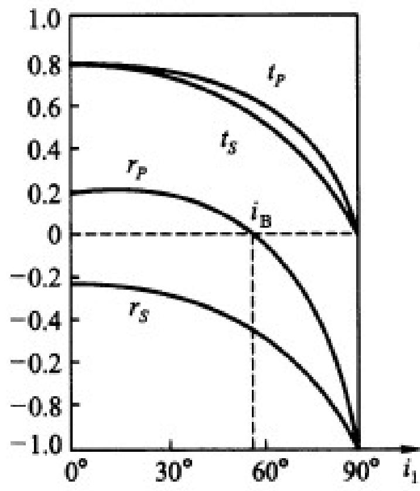

图3-2外反射时振幅

比随入射角的变化

$$
\begin{array}{l} n _ {1} = 1. 0 \\ n _ {2} = 1. 5 \\ \end{array}
$$

$$
n _ {1} = 1. 0, n _ {2} = 1. 5 \qquad - a = a (\cos \pi + i \sin \pi) = a e ^ {i \pi}
$$

$$
\begin{array}{l} \mathbf {E} _ {1} (\mathbf {r}, t) = \mathbf {E} _ {1 0} e ^ {i \left(\mathbf {k} _ {1} \cdot \mathbf {r} - \omega t + \varphi_ {1 0}\right)} \\ = \widetilde {\mathbf {E}} _ {1 0} e ^ {i \mathbf {k} _ {1} \cdot \mathbf {r}} e ^ {- i \omega t}, \quad \widetilde {\mathbf {E}} _ {1 0} = \widetilde {\mathbf {E}} _ {1 0} \cdot e ^ {i \varphi_ {I 0}} \\ \end{array}
$$

$$
\widetilde {\mathbf {E}} _ {1} ^ {\prime} (\mathbf {r}, t) = \widetilde {\mathbf {E}} _ {1 0} ^ {\prime} e ^ {i \mathbf {k} _ {1} ^ {\prime} \cdot \mathbf {r}} e ^ {- i \omega t}, \quad \widetilde {\mathbf {E}} _ {1 0} ^ {\prime} = \widetilde {\mathbf {E}} _ {1 0} ^ {\prime} e ^ {i \varphi_ {1 0} ^ {\prime}}
$$

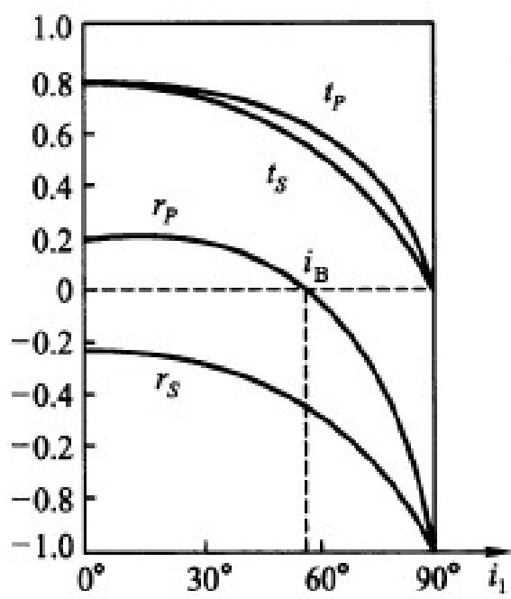

图3-2外反射时振幅比随人射角的变化

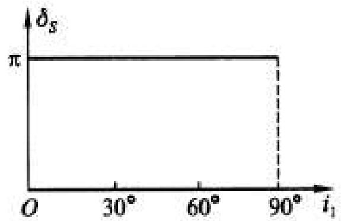

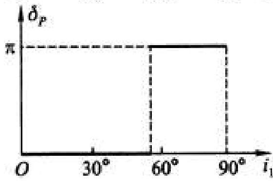

图3-3外反射时的相移

$$
\widetilde {r} _ {p} \equiv \frac {\widetilde {E} _ {1 p} ^ {\prime}}{\widetilde {E} _ {1 p}} = \frac {n _ {2} \cos i _ {1} - n _ {1} \cos i _ {2}}{n _ {2} \cos i _ {1} + n _ {1} \cos i _ {2}}
$$

$$
n _ {2} \cos i _ {B} = n _ {1} \cos i _ {2}
$$

$$
n _ {1} \sin i _ {B} = n _ {2} \sin i _ {2}
$$

$$
\tan i _ {B} = \frac {n _ {2}}{n _ {1}}
$$

布儒斯特角

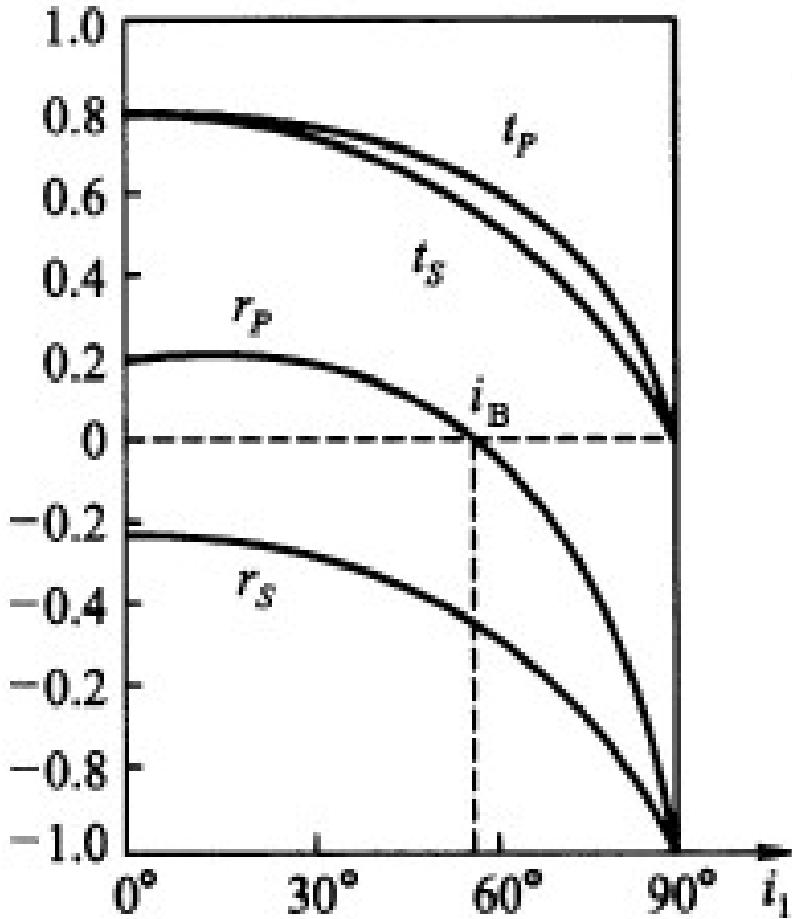

图 $3 - 2$ 外反射时振幅比随入射角的变化

(2) 内反射 $( n _ { 1 } > n _ { 2 } )$ ）即光从光密介质射入光疏介质；

全反射临界角 $i _ { c } = \arcsin \frac { n _ { 2 } } { n _ { 1 } } > \arctan \frac { n _ { 2 } } { n _ { 1 } } = i _ { B }$ nn

$$
\left\{ \begin{array}{l} \widetilde {r _ {p}} \equiv \frac {\widetilde {E ^ {\prime}} _ {1 p}}{\widetilde {E} _ {1 p}} = \frac {n _ {2} \cos i _ {1} - n _ {1} \cos i _ {2}}{n _ {2} \cos i _ {1} + n _ {1} \cos i _ {2}} \\ \widetilde {r _ {s}} \equiv \frac {\widetilde {E ^ {\prime}} _ {1 s}}{\widetilde {E} _ {1 s}} = \frac {n _ {1} \cos i _ {1} - n _ {2} \cos i _ {2}}{n _ {1} \cos i _ {1} + n _ {2} \cos i _ {2}} \end{array} \right.
$$

$$
\left\{ \begin{array}{l} \widetilde {t} _ {p} \equiv \frac {\widetilde {E} _ {2 p}}{\widetilde {E} _ {1 p}} = \frac {2 n _ {1} \cos i _ {1}}{n _ {2} \cos i _ {1} + n _ {1} \cos i _ {2}} \\ \widetilde {t} _ {s} \equiv \frac {\widetilde {E} _ {2 s}}{\widetilde {E} _ {1 s}} = \frac {2 n _ {1} \cos i _ {1}}{n _ {1} \cos i _ {1} + n _ {2} \cos i _ {2}} \end{array} \right.
$$

$$
n _ {1} = 1. 5
$$

$$
n _ {2} = 1. 0
$$

$$
\begin{array}{l} i _ {B} \\ = 3 3 ^ {\circ} 4 1 \\ i _ {C} \\ = 4 1 ^ {\circ} 4 9 \\ \end{array}
$$

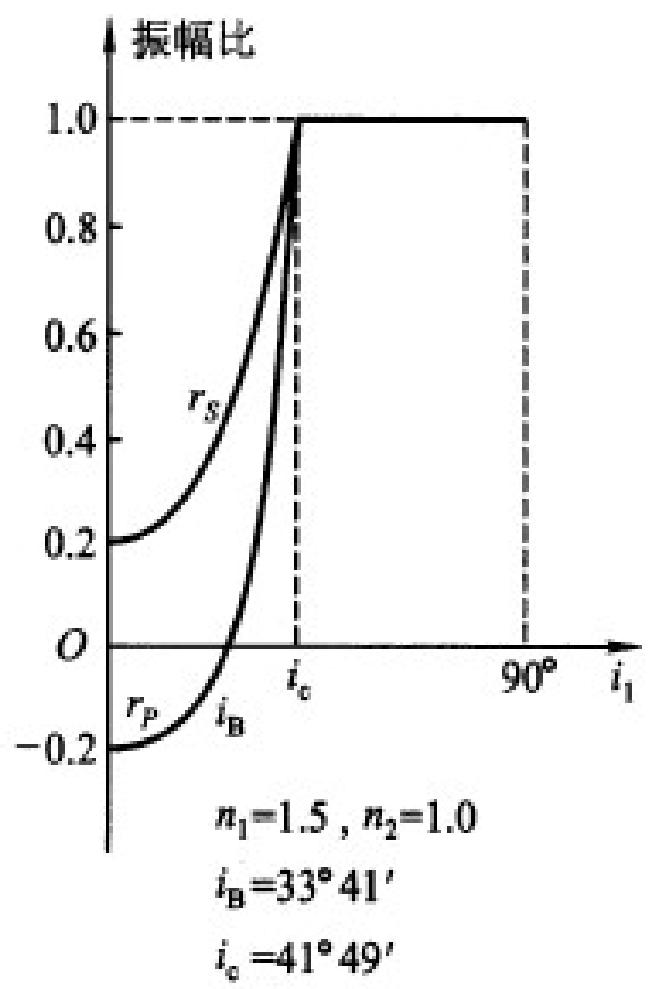

图3-4内反射时振幅比随入射角的变化

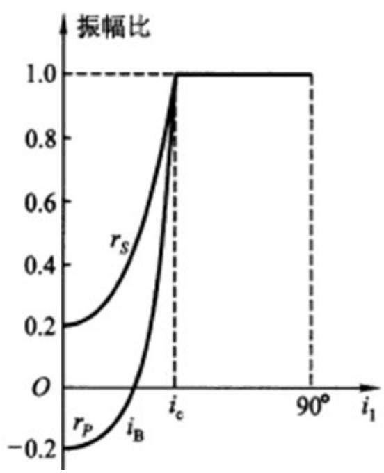

$$
\begin{array}{l} \delta_ {s} = 2 \arctan {\frac {n _ {2} \sqrt {(n _ {1} / n _ {2}) ^ {2} \sin^ {2} i _ {1} - 1}}{n _ {1} \cos i _ {1}}} \\ \delta_ {p} = 2 \arctan \frac {n _ {1} \sqrt {\left(n _ {1} / n _ {2}\right) ^ {2} \sin^ {2} i _ {1} - 1}}{n _ {2} \cos i _ {1}} \\ \end{array}
$$

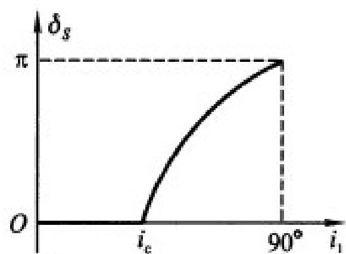

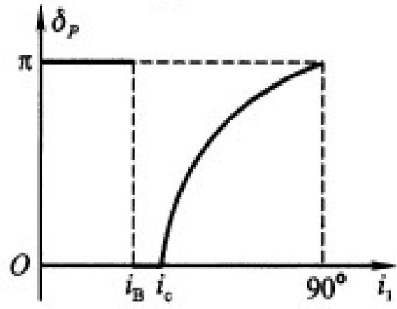

图3 5内反射时的相移

当入射角 $i _ { 1 } = 4 8 . 5 ^ { \circ }$ 或 时，反射波的P分量比S分量的 54.5相位超前

例题2 导出接近正入射时的复振幅反射率和透射率$\begin{array} { r } { \Updownarrow { \cdot } \dot { \mathbf { 1 } } _ { 1 } { \approx } \dot { \mathbf { 1 } } _ { 2 } } \end{array}$ ,代入复振幅反射率和透射率公式，得

$$
\left\{ \begin{array}{l} \widetilde {r _ {p}} = \frac {n _ {2} \cos i _ {1} - n _ {1} \cos i _ {2}}{n _ {2} \cos i _ {1} + n _ {1} \cos i _ {2}} = \frac {n _ {2} - n _ {1}}{n _ {2} + n _ {1}} \\ \widetilde {r _ {s}} = \frac {n _ {1} \cos i _ {1} - n _ {2} \cos i _ {2}}{n _ {1} \cos i _ {1} + n _ {2} \cos i _ {2}} = \frac {n _ {1} - n _ {2}}{n _ {1} + n _ {2}} \end{array} \right.
$$

$$
\begin{array}{r l} {n _ {1} <   n _ {2}} & {\left\{\tilde {r} _ {p} = \frac {n _ {2} \cos i _ {1} - n _ {1} \cos i _ {2}}{n _ {2} \cos i _ {1} + n _ {1} \cos i _ {2}} = \frac {n _ {2} - n _ {1}}{n _ {2} + n _ {1}} \succ 0 \right.} \\ & {\left. \tilde {r} _ {s} = \frac {n _ {1} \cos i _ {1} - n _ {2} \cos i _ {2}}{n _ {1} \cos i _ {1} + n _ {2} \cos i _ {2}} = \frac {n _ {1} - n _ {2}}{n _ {1} + n _ {2}} \succ 0 \right.} \end{array}
$$

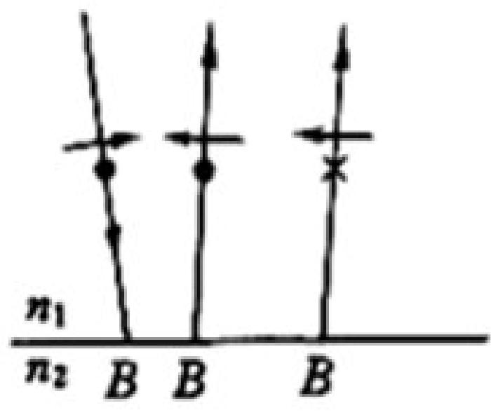

（a）n＜n

$$
n _ {1} > n _ {2}
$$

$$
\left\{ \begin{array}{l} \tilde {r} _ {p} = \frac {n _ {2} \cos i _ {1} - n _ {1} \cos i _ {2}}{n _ {2} \cos i _ {1} + n _ {1} \cos i _ {2}} = \frac {n _ {2} - n _ {1}}{n _ {2} + n _ {1}} \prec 0 \\ \tilde {r} _ {s} = \frac {n _ {1} \cos i _ {1} - n _ {2} \cos i _ {2}}{n _ {1} \cos i _ {1} + n _ {2} \cos i _ {2}} = \frac {n _ {1} - n _ {2}}{n _ {1} + n _ {2}} \succ 0 \end{array} \right.
$$

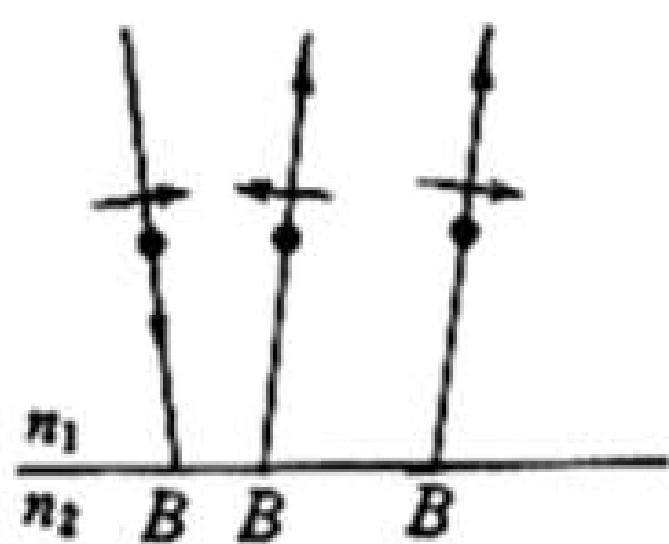

（b）n>n

# 正入射时的复振幅反射率

$$
\left\{ \begin{array}{l} \widetilde {r _ {p}} = \frac {n _ {2} \cos i _ {1} - n _ {1} \cos i _ {2}}{n _ {2} \cos i _ {1} + n _ {1} \cos i _ {2}} = \frac {n _ {2} - n _ {1}}{n _ {2} + n _ {1}} \\ \widetilde {r _ {s}} = \frac {n _ {1} \cos i _ {1} - n _ {2} \cos i _ {2}}{n _ {1} \cos i _ {1} + n _ {2} \cos i _ {2}} = \frac {n _ {1} - n _ {2}}{n _ {1} + n _ {2}} \end{array} \right.
$$

•问题（1）正入射时，入射面已失去意义，p和s光的区别不存在，但其复振幅反射率符号相反，是否矛盾？

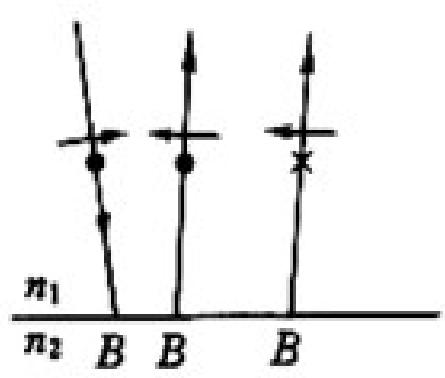

（a）n＜n

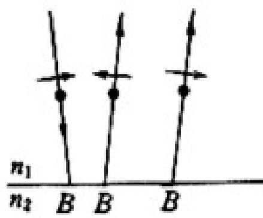

（b）n>n

对P光，若 $\mathbf { r _ { p } > 0 }$ , 正入射时表示反射光振动方向与入射方向相反，即反射光位相变化180度

对S光，若 $\mathbf { r _ { s } } { < } \mathbf { 0 } ,$ , 正入射时表示反射光振动方向与入射方向相反，即反射光位相变化180度

所以，结果是统一的。

$$
\left\{ \begin{array}{l} \widetilde {t _ {p}} = \frac {2 n _ {1} \cos i _ {1}}{n _ {2} \cos i _ {1} + n _ {1} \cos i _ {2}} = \frac {2 n _ {1}}{n _ {2} + n _ {1}} \\ \widetilde {t _ {s}} = \frac {2 n _ {1} \cos i _ {1}}{n _ {1} \cos i _ {1} + n _ {2} \cos i _ {2}} = = \frac {2 n _ {1}}{n _ {1} + n _ {2}} \end{array} \right.
$$

问题（2）：当 $\mathbf { n } _ { 1 } { \ > } \mathbf { n } _ { 2 }$ 时， $\mathfrak { t } _ { \mathfrak { p } } { = } \mathfrak { t } _ { \mathrm { s } } { > } 1$ ,是否违背光能流守恒？关于这个问题我们引进光强反射率和透射率，及光功率反射率和透射率

# ◑光强反射率和透射率

光强 $I { = } n E _ { 0 } { ^ 2 }$ ， 光强反射率和透射率：

$$
R _ {p} \equiv \frac {I _ {1 p} ^ {\prime}}{I _ {1 p}} = r _ {p} ^ {2},
$$

$$
R _ {s} \equiv \frac {I _ {1 s} ^ {\prime}}{I _ {1 s}} = r _ {s} ^ {2}
$$

$$
T _ {p} \equiv \frac {I _ {2 p}}{I _ {1 p}} = \frac {n _ {2}}{n _ {1}} t _ {p} ^ {2},
$$

$$
T _ {s} \equiv \frac {I _ {2 s}}{I _ {1 s}} = \frac {n _ {2}}{n _ {1}} t _ {s} ^ {2}
$$

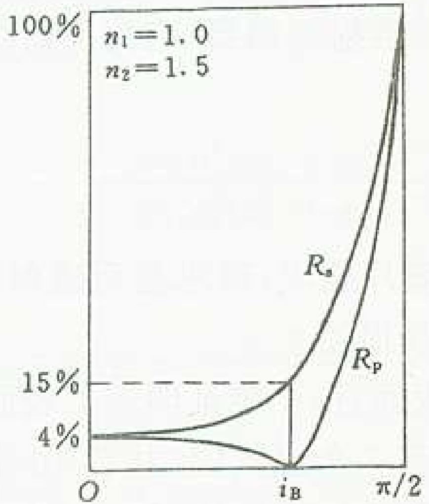

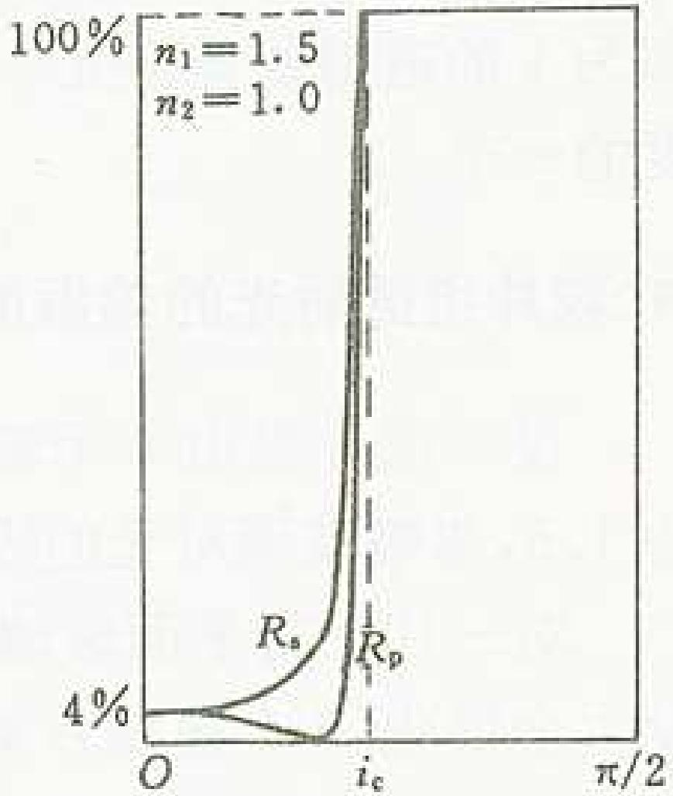

（b）

于是，

$$
\left\{ \begin{array}{l} R _ {P} \equiv \frac {I _ {1 P}}{I _ {1 P}} = \left| \widetilde {r} _ {P} \right| ^ {2}, \quad (4 \%) \\ R _ {S} \equiv \frac {I _ {1 S}}{I _ {1 S}} = \left| \widetilde {r} _ {S} \right| ^ {2}, \quad (4 \%) \\ T _ {P} \equiv \frac {I _ {2 P}}{I _ {1 P}} = \frac {n _ {2}}{n _ {1}} \left| \widetilde {t} _ {P} \right| ^ {2}, \quad (96 \%) \\ T _ {S} \equiv \frac {I _ {2 S}}{I _ {1 S}} = \frac {n _ {2}}{n _ {1}} \left| \widetilde {t} _ {S} \right| ^ {2}, \quad (96 \%) \end{array} \right.
$$

对于正入射

$$
R _ {p} + T _ {p} = 1, R _ {s} + T _ {s} = 1
$$

# 斜入射

）一道例题,提出一个问题

设 $i _ { I } = 6 0 ^ { \circ }$ ,𝑛1 = 1.0, $n _ { 2 } = 1 . 5$ 

$( R _ { \mathrm { p } } , \mathrm { T _ { p } } ^ { } ) , \quad ( R _ { S } \mathbf { \Omega } _ { \times } T _ { S } ^ { } ) \ : \ ?$ 

由 $s i n i _ { I } = s i n 6 0 ^ { \circ } = \sqrt { 3 } / 2$ 

$$
\begin{array}{l} \cos i _ {2} = \sqrt {1 - \sin^ {2} i _ {2}} = \sqrt {1 - (\frac {n _ {I}}{n _ {2}} \sin i _ {I}) ^ {2}} \\ = \sqrt {6} / 3 \approx 0. 8 2 \\ \end{array}
$$

得

$$
\left\{ \begin{array}{l} R _ {\mathrm {p}} = \left| \tilde {r} _ {p} \right| ^ {2} = \left(\frac {1 . 5 \times 0 . 5 - 1 . 0 \times 0 . 8 2}{1 . 5 \times 0 . 5 + 1 . 0 \times 0 . 8 2}\right) ^ {2} \approx 0. 0 0 2, \\ T _ {\mathrm {p}} = \frac {n _ {2}}{n _ {1}} \left| \tilde {t} _ {p} \right| ^ {2} \approx 1. 5 \times \left(\frac {2 \times 1 . 0 \times 0 . 5}{0 . 7 5 + 0 . 8 2}\right) ^ {2} \approx 0. 6 0 9; \end{array} \right.
$$

$$
\left\{ \begin{array}{l} R _ {s} = \left| \tilde {r} _ {s} \right| ^ {2} \approx 0. 1 7 8, \\ T _ {s} = \frac {n _ {2}}{n _ {I}} \left| \tilde {t} _ {s} \right| ^ {2} \approx 0. 5 0 1. \end{array} \right.
$$

可见

$$
\left\{ \begin{array}{l} \left(R _ {p} + T _ {p}\right) \neq 1, \\ \left(R _ {s} + T _ {s}\right) \neq 1, \end{array} \right.
$$

即

$$
\left\{ \begin{array}{l} I _ {1 p} ^ {\prime} + I _ {2 p} \neq I _ {1 p}, \\ I _ {1 s} ^ {\prime} + I _ {2 s} \neq I _ {1 s}, \end{array} \right.
$$

一般 反射光强 + 透射光强 $\neq$ 入射光强！

这违背“能量守恒律”吗？

·光功率反射率与透射率，

注意 光强I 光功率密度(W/cm2)；

考虑到透透光束的正截面积 不等于人射光束、反射光束的正截面积,

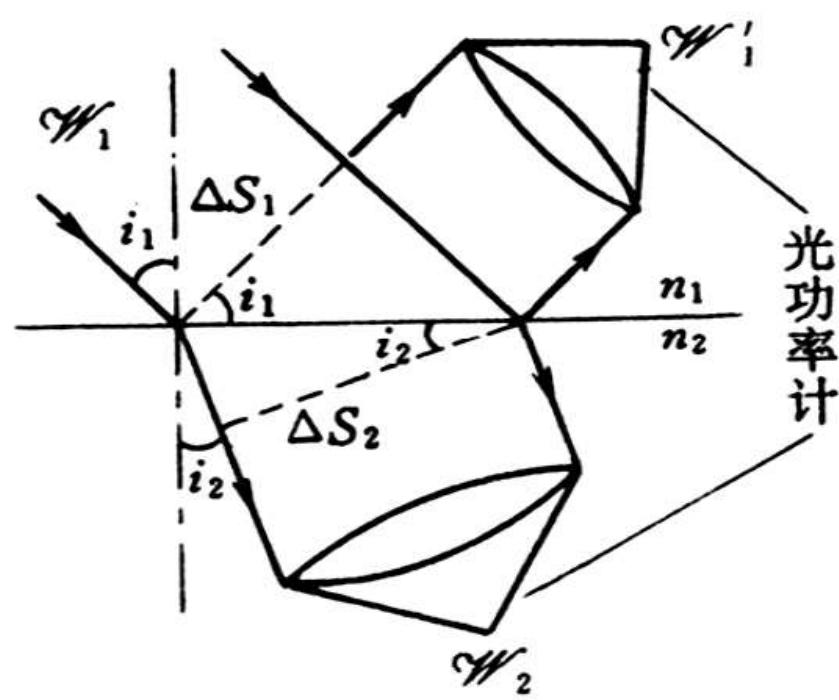

3.7考察光功率的分配

$$
W _ {1} = I _ {1} \Delta S _ {1}, W _ {1} ^ {\prime} = I _ {1} ^ {\prime} \Delta S _ {1}, W _ {2} = I _ {2} \Delta S _ {2}
$$

光功率：

$$
W _ {1 s} = I _ {1 s} \Delta S _ {1}, W ^ {\prime} _ {1 s} = I ^ {\prime} _ {1 s} \Delta S _ {1}, W _ {2 s} = I _ {2 s} \Delta S _ {2}
$$

$$
W _ {1 p} = I _ {1 p} \Delta S _ {1}, W ^ {\prime} _ {1 p} = I ^ {\prime} _ {1 p} \Delta S _ {1}, W _ {2 p} = I _ {2 p} \Delta S _ {2}
$$

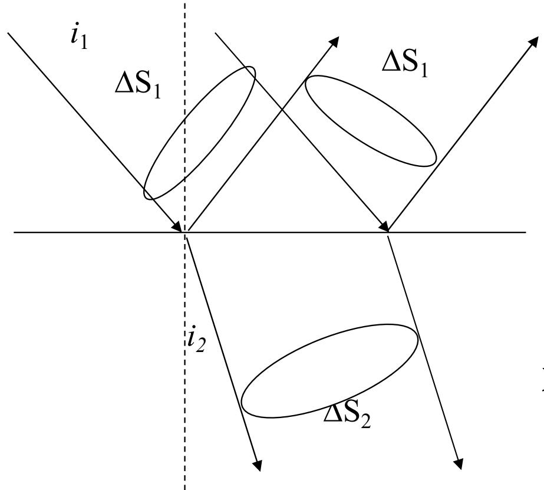

$$
\mathfrak {R} _ {p} \equiv \frac {W _ {1 p} ^ {\prime}}{W _ {1 p}} = R _ {p}, \quad \mathfrak {R} _ {s} \equiv \frac {W _ {1 s} ^ {\prime}}{W _ {1 s}} = R _ {s}
$$

$$
\mathfrak {I} _ {p} \equiv \frac {W _ {2 p}}{W _ {1 p}} = \frac {\cos i _ {2}}{\cos i _ {1}} T _ {p}, \mathfrak {I} _ {s} \equiv \frac {W _ {2 s}}{W _ {1 s}} = \frac {\cos i _ {2}}{\cos i _ {1}} T _ {s}
$$

光功率守恒：

$$
\mathfrak {R} _ {s} + \mathfrak {I} _ {s} = 1, \mathfrak {R} _ {p} + \mathfrak {I} _ {p} = 1
$$

# 反射率 $\&$ 透射率一览表

定义表

<table><tr><td>定义\分别</td><td>复振幅</td><td>光强</td><td>光功率</td></tr><tr><td rowspan="2">反 射 率</td><td>\(\widetilde{r_p}=\frac{\widetilde{E}_{1p}&#x27;}{\widetilde{E}_{1p}}=r_pe^{i\delta&#x27;p}\)</td><td>\(R_p=\frac{I_{1p}&#x27;}{I_{1p}}\)</td><td>\(\mathcal{R}_p=\frac{\mathcal{W}_{1p}&#x27;}{\mathcal{W}_{1p}}\)</td></tr><tr><td>\(\widetilde{r_s}=\frac{\widetilde{E}_{1s}&#x27;}{\widetilde{E}_{1s}}=r_se^{i\delta&#x27;s}\)</td><td>\(R_s=\frac{I_{1s}&#x27;}{I_{1s}}\)</td><td>\(\mathcal{R}_s=\frac{\mathcal{W}_{1s}&#x27;}{\mathcal{W}_{1s}}\)</td></tr><tr><td rowspan="2">透 射 率</td><td>\(\tilde{t}_p=\frac{\tilde{E}_{2p}}{\tilde{E}_{1p}}=t_pe^{i\delta p}\)</td><td>\(T_p=\frac{I_{2p}}{I_{1p}}\)</td><td>\(\mathcal{J}_p=\frac{\mathcal{W}_{2p}}{\mathcal{W}_{1p}}\)</td></tr><tr><td>\(\tilde{t}_s=\frac{\tilde{E}_{2s}}{\tilde{E}_{1s}}=t_se^{i\delta_s}\)</td><td>\(T_s=\frac{I_{2s}}{I_{1s}}\)</td><td>\(\mathcal{J}_s=\frac{\mathcal{W}_{2s}}{\mathcal{W}_{1s}}\)</td></tr></table>

关系表(要计及折射率之差异与光束正截面之差异)

<table><tr><td>反射率之间</td><td>Rp = Rp = r2p, Rs = Rs = r2s</td></tr><tr><td>透射率之间</td><td>Jp.s = cosi21cosi1Tp.s, Tp.s = n21n1tp.s</td></tr><tr><td>反射率与透射率之关系</td><td>光功率守恒{W&#x27;1p + W&#x27;2p = W1pW&#x27;1s + W&#x27;2s = Wls有 Rp.s + Jp.s = 1或Rp.s + cosi21cosi1Tp.s = 1, r2p.s + n2cosi21n1cosi1tp.s = 1</td></tr></table>

振幅透射率、光强透射率 $\mathrm { t . T } > 1$ 是可能的！

根据以上讲的光强反射率和入射角的关系公式可以得出光强反射率曲线：

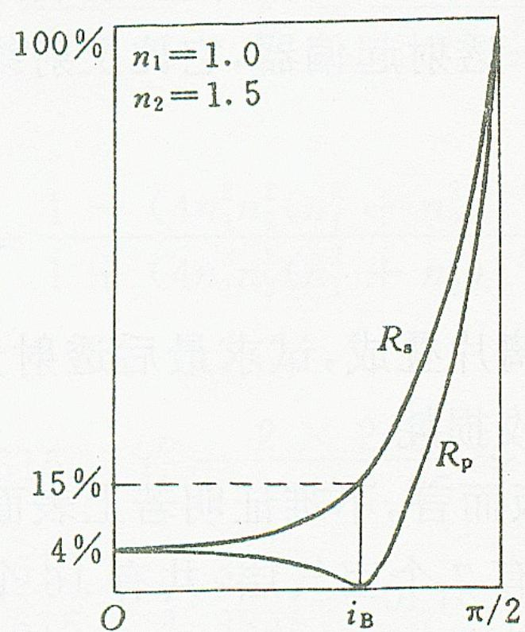

（a)

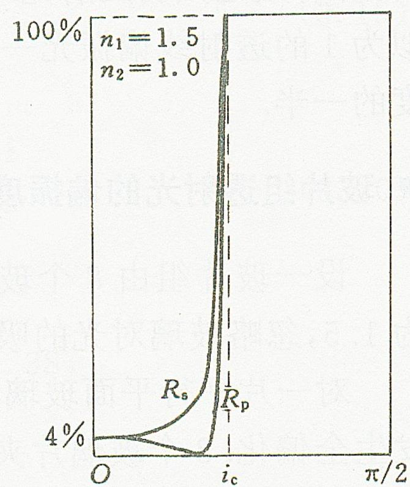

（b）

$$
R _ {p} = \left(\frac {n _ {2} \cos i _ {1} - n _ {1} \cos i _ {2}}{n _ {2} \cos i _ {1} + n _ {1} \cos i _ {2}}\right) ^ {2} = 0
$$

$$
n _ {2} \cos i _ {B} = n _ {1} \cos i _ {2}
$$

$$
+
$$

$$
n _ {1} \sin i _ {B} = n _ {2} \sin i _ {2}
$$

$$
\tan i _ {B} = \frac {n _ {2}}{n _ {1}}
$$

# ◐玻片组透射光的偏振度

利用p光和s光的光强反射率不同的特性，使用玻片组可以或得比较高偏振度的偏振光，下图为一例：

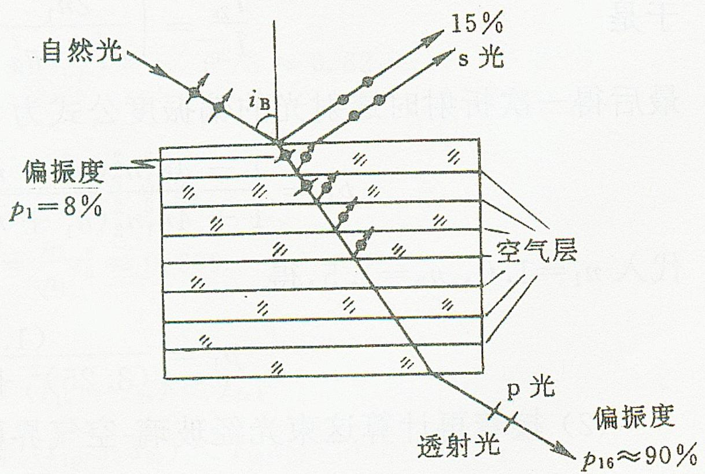

图3.5一玻片组成为透射起偏器

注：偏振度的定义： $p = \frac { I _ { M } - I _ { m } } { I _ { M } + I _ { m } }$ 

斯托克斯倒逆光路方法巧妙地解决了 ${ \pmb n } _ { 1 } / n _ { 2 }$ 界面复振幅反射折射率 $( \widetilde { \textbf { \textit { r } } } , \widetilde { t } \widetilde { \textbf { \textit { ) } } }$ ）和 ${ \pmb n } _ { 2 } / n _ { 1 }$ 界面复振幅反射折射率（ $\widetilde { r } ^ { \prime } , \widetilde { t } ^ { \prime } \ )$ 的关系。

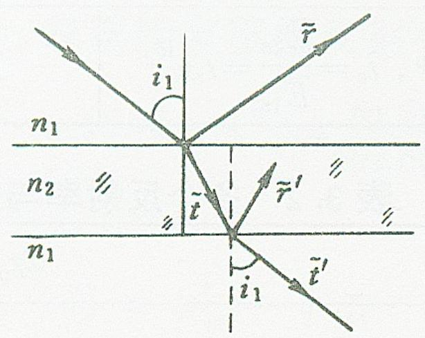

（a）

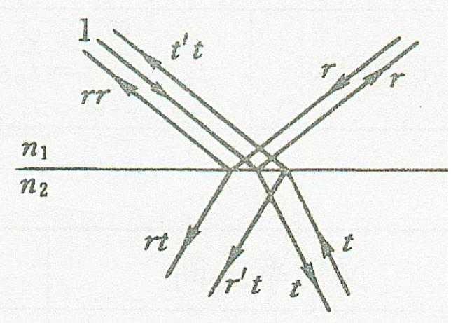

（b）

图3.7导出斯托克斯倒逆关系

图中显示反射光行波和折射光行波均被抵消，当然另外两列光行波$( l , \ r r , \ t t ^ { 9 } )$ 和(rt，r’t)也不复存在，即

$$
\left\{ \begin{array}{l} r t + r ^ {\prime} t = 0 \\ 1 - (t t ^ {\prime} + r ^ {2}) = 0 \end{array} \right. \Longrightarrow \left\{ \begin{array}{l} r = - r ^ {\prime} \\ t t ^ {\prime} + r ^ {2} = 1 \end{array} \right.
$$

㊀反射光的相移变化曲线

㊁ 例题--菲涅耳棱镜产生圆偏振光

㊂ 反射光的相位突变问题

㊃维纳实验

$$
\widetilde {r _ {p}} = r _ {p} e ^ {i \delta_ {p} ^ {\prime}} = \frac {n _ {2} \cos i _ {1} - n _ {1} \cos i _ {2}}{n _ {2} \cos i _ {1} + n _ {1} \cos i _ {2}}, \widetilde {r _ {s}} = r _ {s} e ^ {i \delta_ {s} ^ {\prime}} = \frac {n _ {1} \cos i _ {1} - n _ {2} \cos i _ {2}}{n _ {1} \cos i _ {1} + n _ {2} \cos i _ {2}}
$$

相移因子 $( \delta _ { \textit { p } } ^ { \prime } , \delta _ { \textit { s } } ^ { \prime } )$ 的原始含义为：

$$
\delta_ {p} ^ {\prime} = \varphi_ {1 p} ^ {\prime} - \varphi_ {1 p}, \quad \delta_ {s} ^ {\prime} = \varphi_ {1 s} ^ {\prime} - \varphi_ {1 s}
$$

1. 当 ${ \delta \bf { \bar { \Lambda } } } = \bf { 0 }$ ，复振幅反射率为正实数，表明反射光振动态与局部坐标架 $( \pmb { p } ^ { \prime } , \pmb { s } ^ { \prime } )$ 方向一致，但是并不意味着反射光和入射光振动态必定同相位。

2. 当 $\delta \mathrm { = } \pi$ ，复振幅反射率为负实数，表明反射光振动态与局部坐标架 $( \pmb { p } ^ { \prime } , \pmb { s } ^ { \prime } )$ 方向相反，也不意味着反射光和入射光振动态必定反相位。

3. 当 $\delta { \neq } \mathbf { 0 }$ ，，复振幅反射率为复数，表明反射光振动态介于局部坐标架 $( \pmb { p } ^ { \prime } , \pmb { s } ^ { \prime } )$ 之间 ，入射光为线偏振，反射光则为椭圆偏振。

反射光的相移变化曲线：

(1) ${ \pmb n } _ { 1 } { < } n _ { 2 }$ ，光疏介质到光密介质，相移变化比较简单，=0或者，如图：

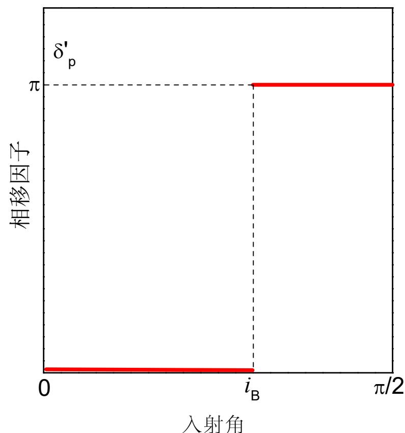

（1）n1n2

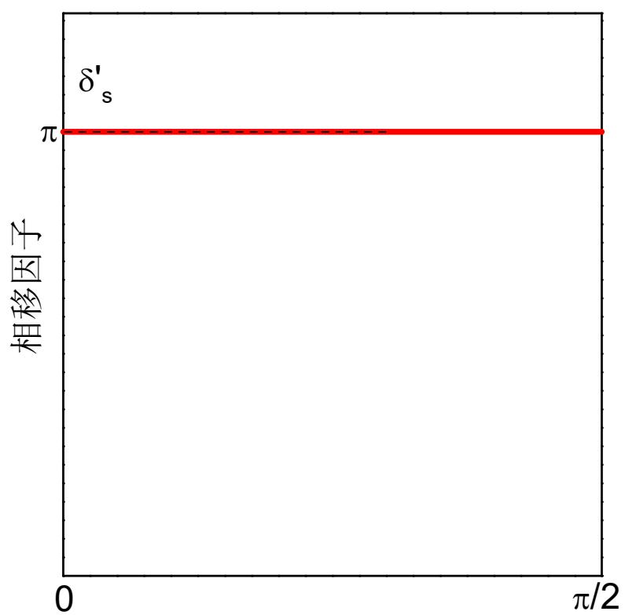

入射角

（2） $\pmb { n } _ { 1 } \mathrm { > } \pmb { n } _ { 2 } .$ ，即光密到光疏，情况比较复杂，当入射角大于全反射临界角，相移因子由0连续变致，见下图：

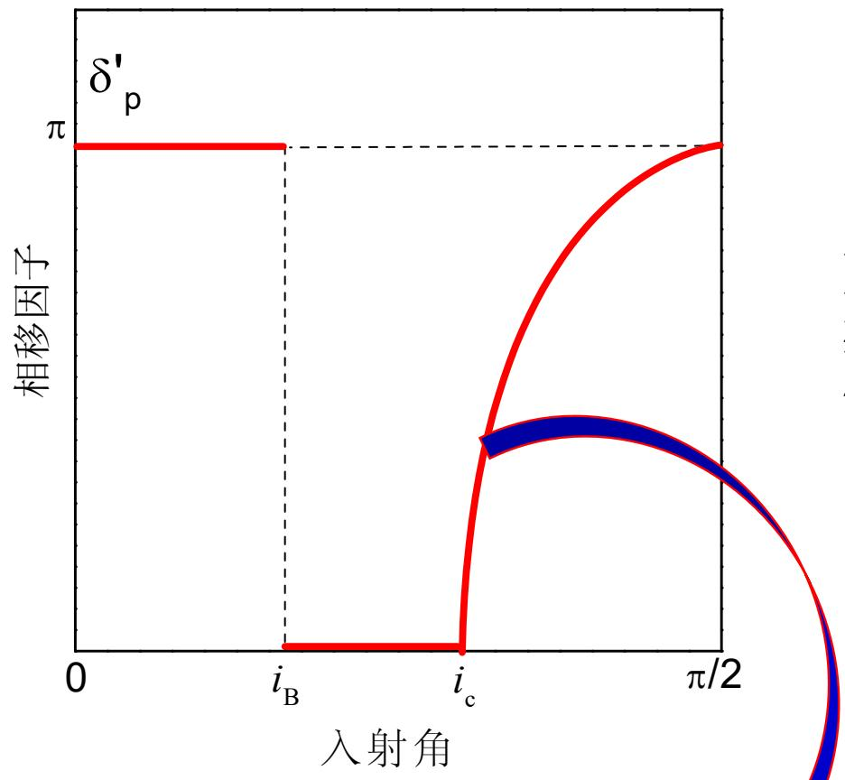

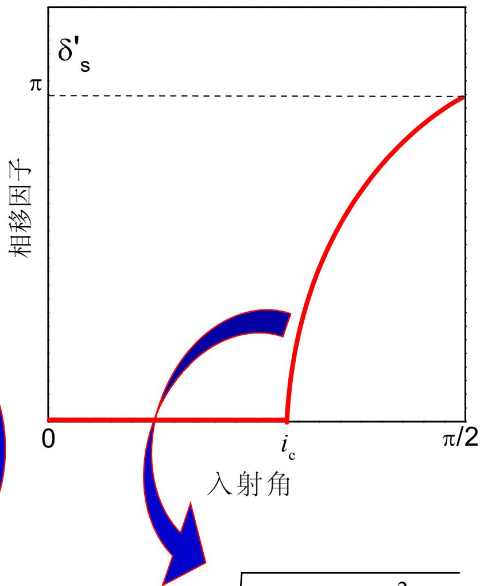

$$
\tan {\frac {\delta_ {p} ^ {\prime}}{2}} = \frac {n _ {1}}{n _ {2}} \frac {\sqrt {\left(\frac {n _ {1}}{n _ {2}} \sin i _ {1}\right) ^ {2} - 1}}{\cos i _ {1}}
$$

$$
\tan \frac {\delta_ {s} ^ {\prime}}{2} = \frac {n _ {2}}{n _ {1}} \frac {\sqrt {\left(\frac {n _ {1}}{n _ {2}} \sin i _ {1}\right) ^ {2} - 1}}{\cos i _ {1}}
$$

（2） n1n2 

以上相移因子和入射角关系公式的推导：

当入射角 $i _ { 1 } { > } i _ { \mathrm { c } }$ 时，按照折射定律在形式上得：sin sin 1112  i  n i2n

所以： cos 1 sin 1 sin 2 1 2 1 2 2 2                   i 1

$$
\left\{ \begin{array}{l} \widetilde {r _ {p}} \equiv \frac {\widetilde {E} _ {1 p} ^ {\prime}}{\widetilde {E} _ {1 p}} = \frac {n _ {2} \cos i _ {1} - n _ {1} \cos i _ {2}}{n _ {2} \cos i _ {1} + n _ {1} \cos i _ {2}} \\ \widetilde {r _ {s}} \equiv \frac {\widetilde {E} _ {1 s} ^ {\prime}}{\widetilde {E} _ {1 s}} = \frac {n _ {1} \cos i _ {1} - n _ {2} \cos i _ {2}}{n _ {1} \cos i _ {1} + n _ {2} \cos i _ {2}} \end{array} \right.
$$

$$
= i \sqrt {\left(\frac {n _ {1}}{n _ {2}} \sin i _ {1}\right) ^ {2} - 1}
$$

2令：  cos 1 2 1  a n i ， $i b _ { 1 } = n _ { 1 }$ c os  2 1   i i n s1   n i n 1     i 12  n

$$
a _ {2} = n _ {1} \cos i _ {1}, i b _ {2} = n _ {2} \cos i _ {2} = i n _ {2} \cdot \sqrt {\left(\frac {n _ {1}}{n _ {2}} \sin i _ {1}\right) ^ {2} - 1}
$$

于是： a i b r    ~  1 1 $= \frac { a _ { 1 } + i b _ { 1 } } { a _ { 1 } - i b _ { 1 } } = 1 \cdot e ^ { i \delta _ { p } } , \widetilde { r } _ { s } = \frac { a _ { 2 } + i b _ { 2 } } { a _ { 2 } - i b _ { 2 } } = 1 \cdot \epsilon$ e 1 p i ' ， s i ' e

相移因子求得：

$$
\delta_ {p} ^ {\prime} = 2 \arctan \frac {b _ {1}}{a _ {1}}, \quad \delta_ {s} ^ {\prime} = 2 \arctan \frac {b _ {2}}{a _ {2}}
$$

注意：在基元波函数复数形式表示里，我们约定了相位的正负号；实际相位超前取负号，落后取正号，这个约定源于我们选用了 i te 故实际相位差 $( \varphi ^ { \epsilon } - \varphi )$ 应该为正值，为正值。

㊁例题--菲涅耳棱镜产生圆偏振光

设玻璃折射率 ${ \pmb n } _ { 1 } \mathrm { = } 1 . 5 1$ ，空气的折射率 $\bf { n } 2 { = } 1 . 0$ ，以入射角 $\scriptstyle { i _ { 1 } = 5 1 ^ { \mathbf { o } } 2 \mathbf { 0 } ^ { \prime } }$ 入射 一线偏振光，且偏振方向与入射面成45º夹角，相位 $\varphi _ { 1 \mathrm { p } } - \varphi _ { 1 \mathrm { s } } { = } \mathbf { 0 } ;$ ，即在入射光局部坐标架(p1,s1)看来入射光是两个等相位和正交振动的合成，分析反射光的偏振态？

首先判断入射角是否大于全反射临界角：

$$
i _ {c} = \arcsin \frac {n _ {2}}{n _ {1}} \approx 4 1 ^ {\circ} 4 7 ^ {\prime} <   i _ {1} = 5 1 ^ {\circ} 2 0 ^ {\prime}
$$

入射角大于临界角，所以使用下面的公式计算相移量：

$$
\tan {\frac {\delta_ {p} ^ {\prime}}{2}} = \frac {n _ {1}}{n _ {2}} \frac {\sqrt {\left(\frac {n _ {1}}{n _ {2}} \sin i _ {1}\right) ^ {2} - 1}}{\cos i _ {1}}
$$

$$
\tan {\frac {\delta_ {s} ^ {\prime}}{2}} = \frac {n _ {2}}{n _ {1}} \frac {\sqrt {\left(\frac {n _ {1}}{n _ {2}} \sin i _ {1}\right) ^ {2} - 1}}{\cos i _ {1}}
$$

结果得： $\delta ^ { \prime } { } _ { p } \approx 1 1 1 ^ { \circ } 1 8 ^ { \prime } ,$ ， $\delta _ { \ s } ^ { \prime } \approx 6 6 ^ { \circ } 5 ^ { \prime }$ 

所以： ${ \varphi ^ { \prime } } _ { p } - { \varphi ^ { \prime } } _ { s } = \left( \varphi _ { p } + \delta ^ { \prime } { _ p } \right) - \left( \varphi _ { s } + \delta ^ { \prime } { _ s } \right) \approx 4 5$ 13' 

结论： 因为入射角大于临界角，所以实振幅反射率 $r _ { s }$ 和 $r _ { p }$ 等于1，故反射光为内正切于正方形边框的左旋斜椭圆偏振光。

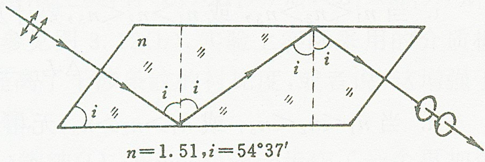

图3.9菲涅耳棱镜内全反射两次以获得圆偏振光

适当调整入射角，使得=45º，在菲涅耳棱镜里发生两次全反射，s和p光的相位差为2 $\Delta { \bf { \bar { \theta } } } = 9 0 ^ { \bf { \theta } }$ ，所以出射光为左旋圆偏振光。

以上讲解的知识已经解决了这个问题，这里给出一个总结的结论；这些结论对于确定入射光和反射光的干涉场非常有用。

半波损失：在反射点入射光和反射光的线偏振态恰巧相反，也就是说相位相差，称之为半波损失。这意味着入射情况为正入射和掠射。

# 结论：

1. 正入射时。 $\mathbf { n _ { 1 } } { < } \mathbf { n _ { 2 } } ,$ 界面反射有相位突变，有半波损失；$\mathbf { n _ { 1 } } \mathrm { > n } _ { 2 } .$ ,界面反射没有相位突变，即没有半波损失。

2. 掠射时。无论 $\mathbf { n _ { 1 } } \mathrm { > n } _ { 2 }$ 还是 $\mathbf { n _ { 1 } } \mathrm { < n } _ { 2 } ,$ ，界面反射均有半波损失。

3. 斜入射时；如下图，我们关心的薄膜上下界面反射的两光束1和2之间的相位差

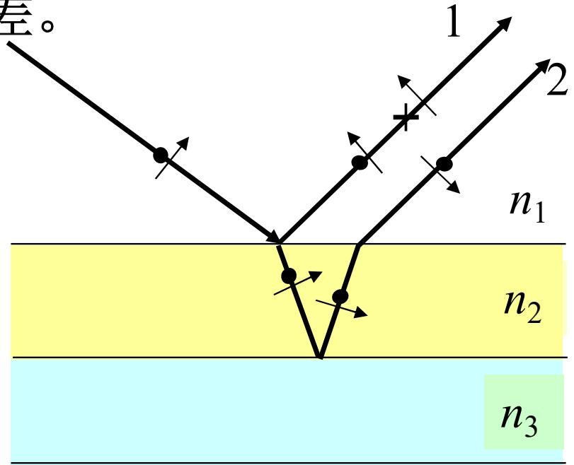

结论（限于入射角小于布儒斯特角）

i. 当 $\mathbf { n } _ { 1 } { > } \mathbf { n } _ { 2 } { < } \mathbf { n } _ { 3 }$ 或 $\mathbf { n _ { 1 } } { < } \mathbf { n _ { 2 } } { > } \mathbf { n _ { 3 } }$ ，要计相位突变，即实际光程差为：

$$
\Delta L _ {1 2} = \Delta L _ {0} \pm \frac {\lambda}{2}
$$

ii. 当n1>n2>n3或n1<n2<n3，没有相位突变，实际光程差为：

$$
\Delta L _ {1 2} = \Delta L _ {0}
$$

对于入射角大于布儒斯特角的情况，请同学课下分析。

例题：

射电星体

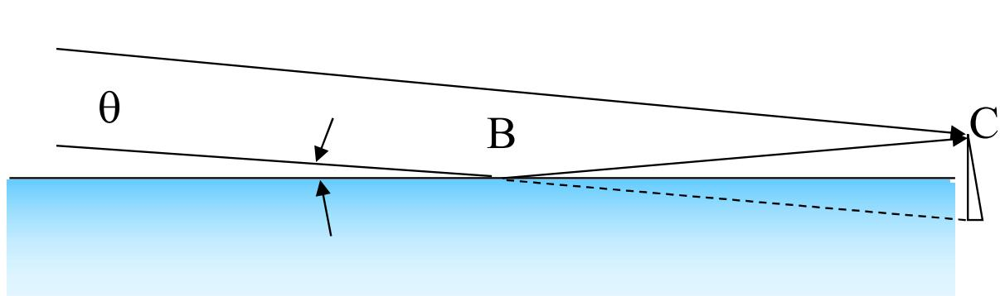

如图一微波检测器安装在高出湖面h=0.5米处，一颗射电星体发射波长为 $\lambda { = } 2 1$ 厘米的微波,星体自水平面徐徐升起，微波检测器依次出现信号极大和极小，问当出现第一个极大时，星体相对于水平面的仰角？

因为是掠射，所以要考虑相位突变，故实际光程差为：

$$
\Delta L = \Delta L 0 + \frac {\lambda}{2} = 2 h \sin \theta + \frac {\lambda}{2}
$$

当出现第一个极大时， L  ，于是：

$$
2 h \sin \theta = {\frac {\lambda}{2}},     \text {得} \theta = \arcsin \left({\frac {\lambda}{4 h}}\right) \approx 6 ^ {\circ}
$$

# 第四节 反射光的偏振态

自然光在两种各向同性介质分界面上反射、折射时，反射光和折射光都是部分偏振光。反射光中垂直振动 $( \mathbf { S } )$ 多于平行振动(P)，折射光中平行振动(P)多于垂直振动 $( \mathbf { S } )$ 。

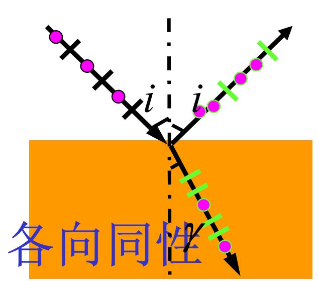

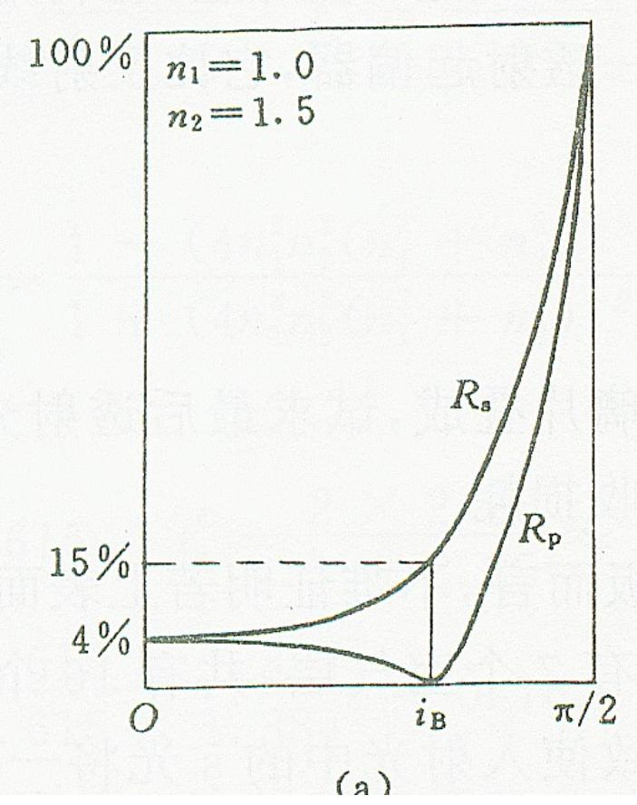

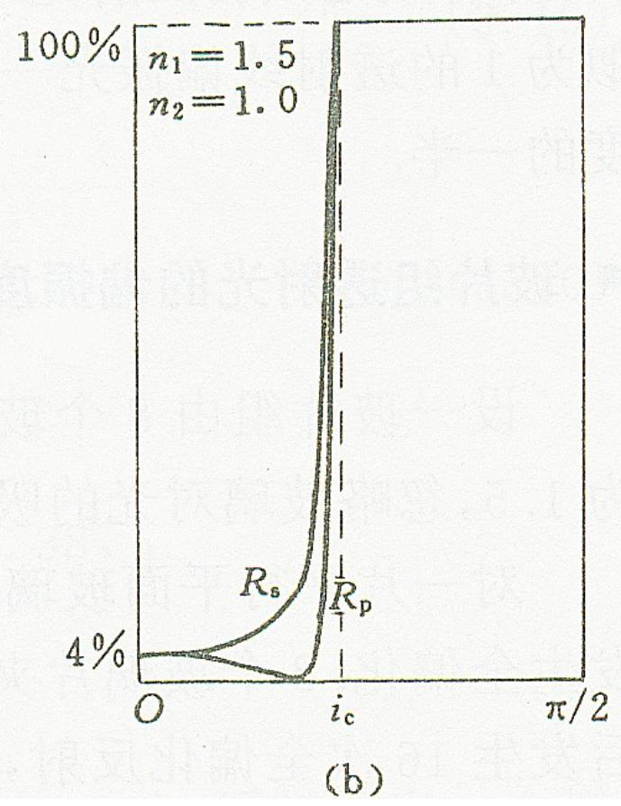

当入射角满足关系式： 2 tan  n iB 1n

时，反射光为振动垂直于入射面的线偏振光，该式称为布儒斯特定律， 为起偏振角或布儒斯特角。此时折射光偏振化的强度最强，但它不是完全偏振光。

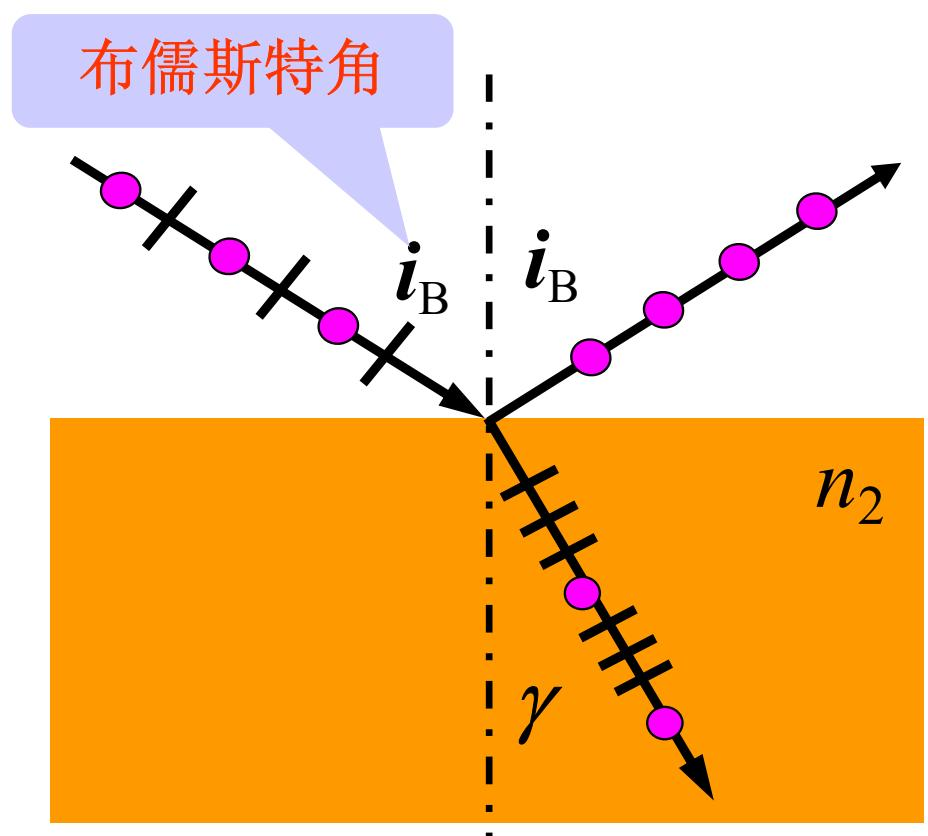

问题：当光线以起偏振角入射时，反射光和折射光的传播方向互相垂直，即： $i _ { \mathrm { B } } + \gamma = 9 0 ^ { \mathrm { o } }$ 。

反射光的偏振态和入射光的偏振态、入射角和介质的折射率有关。

举一特例----自然光入射（光疏到光密）

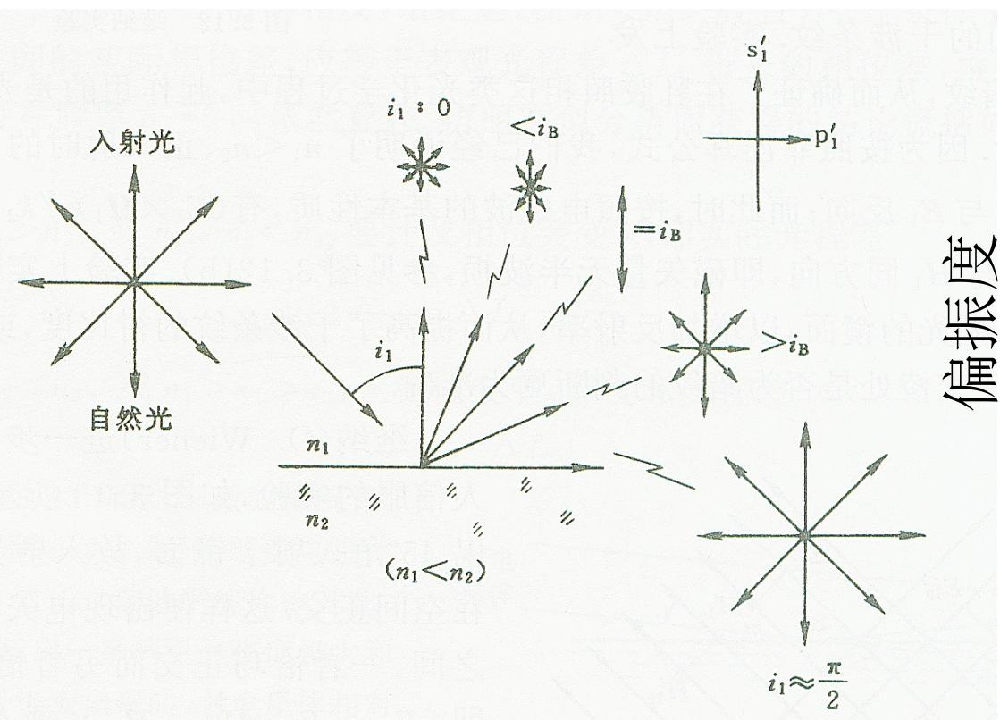

图3.14自然光入射时反射光偏振态变化图像

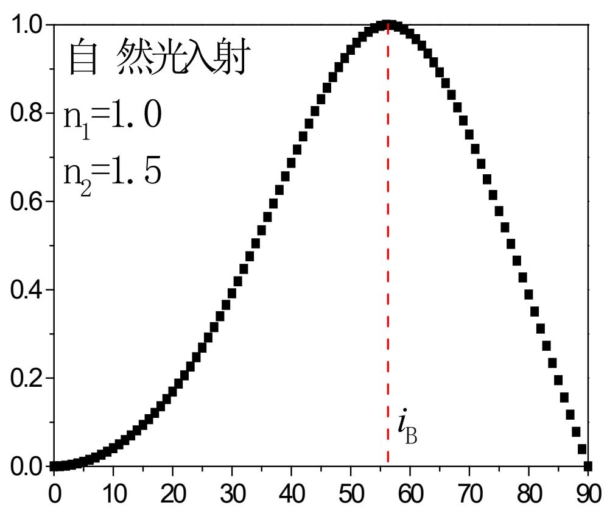

入射角(度)

玻片组透射光的偏振度

利用p光和s光的光强反射率、折射率不同的特性，使用玻片组可以或得比较高偏振度的偏振光。

(1) $i { = } i _ { \mathrm { B } }$ 时,反射光为线偏振光,而折射光仍然是部分偏振光,但偏振化程度最高

(2) 反射光的光强较弱，折射光的光强较强

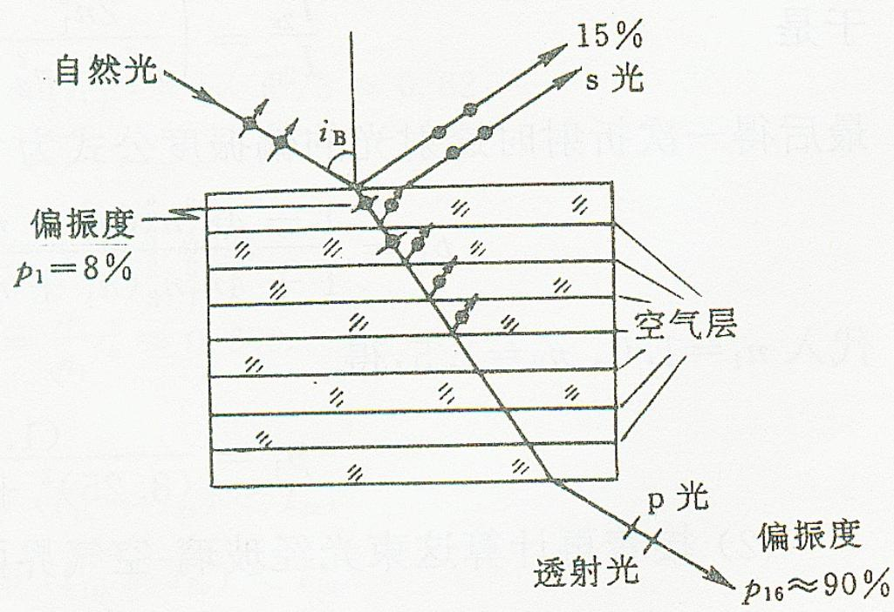

图3.5一玻片组成为透射起偏器

(3) 让自然光通过玻璃片堆,可使折射光的偏振化程度增加.玻璃片足够多时,可使折射光为完全偏振光.

外腔式激光管加装布儒斯特窗.

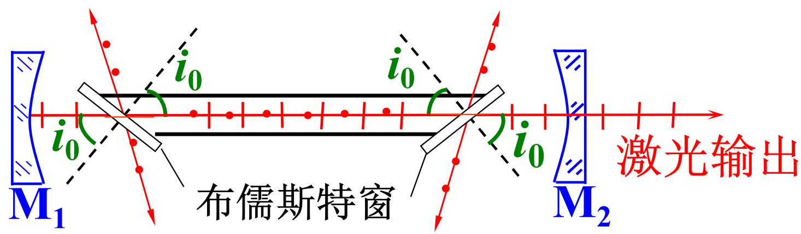

光与物质的相互作用，本质上是光与电子的相互作用。运动的电子既有电荷亦有磁矩，光是电磁波。在光与电子的相互作用中，是电场起主要作用，还是磁场起主要作用，还是电场和磁场起等同的作用？-----维纳实验回答了这个问题。

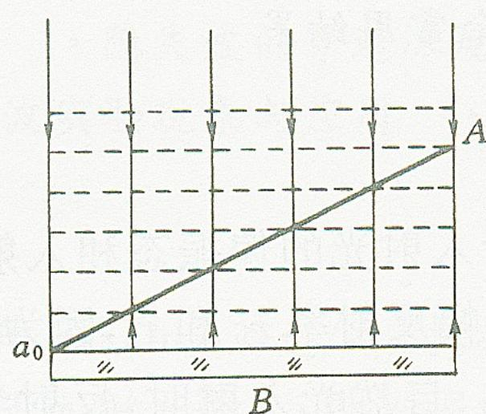

A一乳胶面，B-镜面，虚线表示暗场（面）

（a）

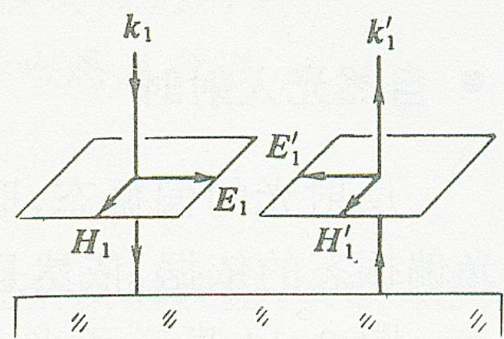

（b）

图3.12维纳实验

光疏到光密，正入射的反射光的电场矢量有半波损失，而磁场矢量没有。在a0点观察到的是暗纹，确定和乳胶相互作用过程中起作用的是光波的电矢量。

维纳进一步作了更令人信服的实验：

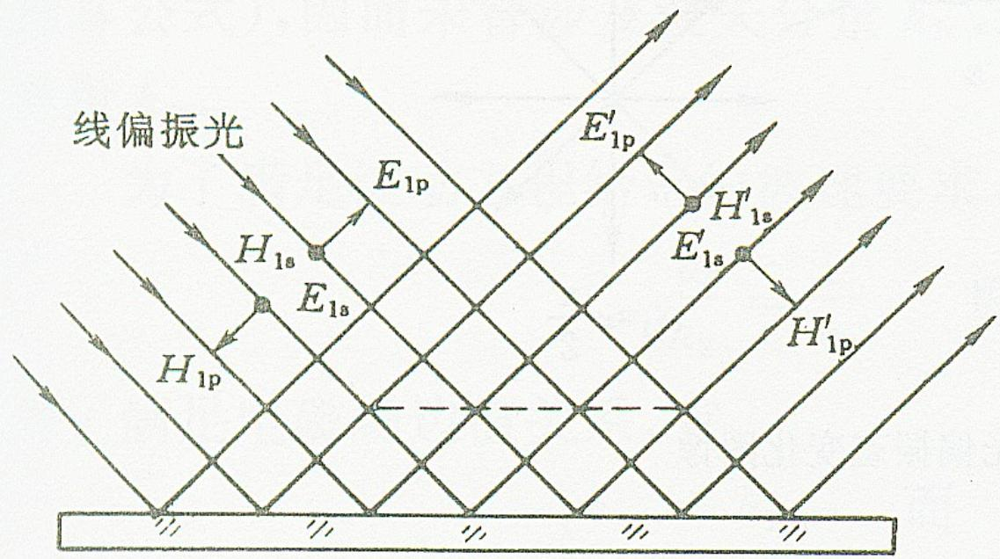

图3.13进一步的维纳实验

对于s光， E1s E 1s H1p H 1p// ' ，  ' $E _ { 1 s } / / E _ { 1 s } ^ { \prime } , \ H _ { 1 p } \perp H _ { 1 p } ^ { \prime }$ 记录到明暗条纹E1p E 1p H1s H 1s 对于p光，  ' ， // ' 记录到均匀黑度证明乳胶感光是电场所致，而磁场没有起作用。

原子物理学从理论上可以估算出，光波中作用于电子电荷上电场力远远大于作用于电子磁矩的磁场力。

# 全反射时的透射场 隐失波

问题提出

 导出隐失波函数

 隐失波的穿透深度

隐失波的特点

隐失波场的能流分析

隐失波实验现象与应用。

# 问题：

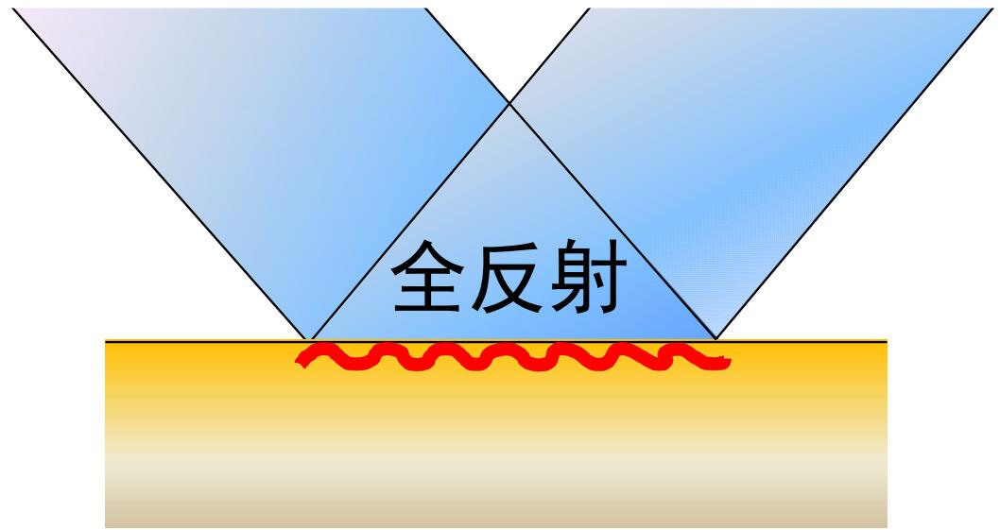

当入射角大于临界角，出现全反射现象，实验观测和理论计算均证认，此时反射光强等于入射光强，即光强全反射确实成立。

这是否意味着，此时透射光场为零?

如果透射光场为零，显然不能满足光波场(电磁场)的边值关系。

全反射时的透射区中究竟如何？

折射光波 $\tilde { E } _ { 2 } ( \vec { r } , t ) = \tilde { E } _ { 2 0 } e ^ { i \vec { k } _ { 2 } \cdot \vec { r } } e ^ { - i \omega t } \quad ( \mathrm { i } \ o { \Sigma } ) \phi _ { 0 } =$ 0   ）

$$
= \tilde {E} _ {2 0} e ^ {i (k _ {2 x} x + k _ {2 y} y + k _ {2 z} z)} e ^ {- i \omega t}
$$

$$
\sqrt {k _ {2 x} ^ {2} + k _ {2 y} ^ {2} + k _ {2 z} ^ {2}} = k _ {2} = \frac {2 \pi}{\lambda} = n _ {2} k _ {0}
$$

界面折射公式：

$$
n _ {1} \sin i _ {1} = n _ {2} \sin i _ {2}
$$

$$
\begin{array}{l} \Rightarrow n _ {1} k _ {0} \sin i _ {1} = n _ {2} k _ {0} \sin i _ {2} \\ \Rightarrow k _ {2 x} = k _ {2} \sin i _ {2} = n _ {1} k _ {0} \sin i _ {1} \\ \end{array}
$$

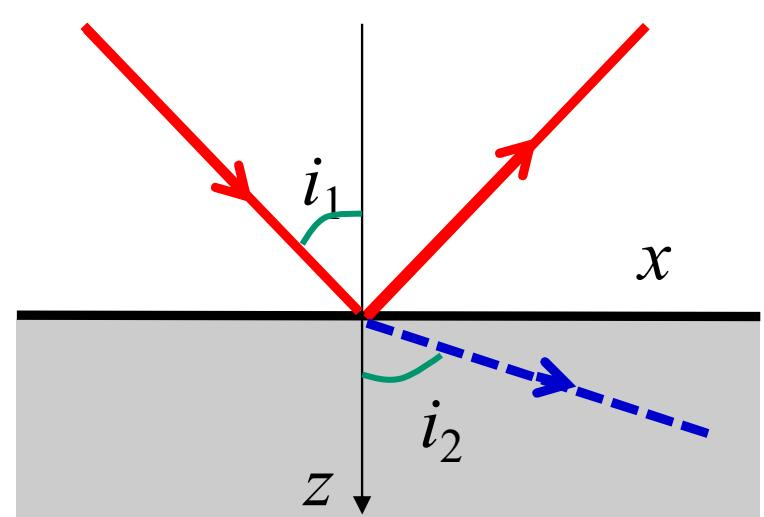

$k _ { 2 y } = 0$ （折射光和反射光同在入射面内）

$$
k _ {2 z} = \sqrt {k _ {2} ^ {2} - \left(k _ {2 x} ^ {2} + k _ {2 y} ^ {2}\right)} = k _ {0} \sqrt {n _ {2} ^ {2} - \left(n _ {1} \sin i _ {1}\right) ^ {2}}
$$

$$
\tilde {E} _ {2} (\vec {r}, t) = \tilde {E} _ {2 0} e ^ {i \vec {k} _ {2} \cdot \vec {r}} e ^ {- i \omega t} = \tilde {E} _ {2 0} e ^ {i (k _ {2 x} x + k _ {2 y} y + k _ {2 z} z)} e ^ {- i \omega t}
$$

$$
k _ {2 z} = \sqrt {k _ {2} ^ {2} - \left(k _ {2 x} ^ {2} + k _ {2 y} ^ {2}\right)} = k _ {0} \sqrt {n _ {2} ^ {2} - \left(n _ {1} \sin i _ {1}\right) ^ {2}}
$$

1 1 2当n sin i  n 时，入射角小于临界角，k2z为实数，

也就是介质2中有一列折射行波。

1 1 2当 n sin i  n  时，k2z为虚数，

$$
k _ {2 z} = i k _ {0} \sqrt {\left(n _ {1} \sin i _ {1}\right) ^ {2} - n _ {2} ^ {2}} = i k _ {2 z} ^ {\prime}
$$

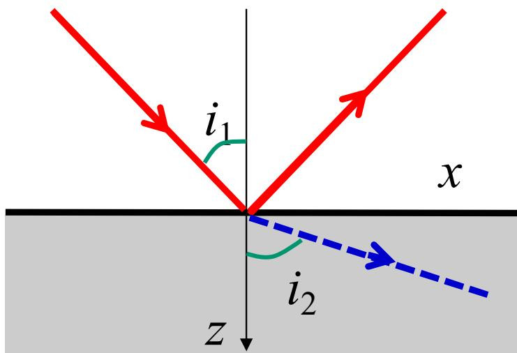

透射场的波函数为： $\tilde { E } _ { 2 } ( \vec { r } , t ) = \tilde { E } _ { 2 0 } e \qquad e ^ { i ( k _ { 2 x } x - \omega t ) }$ ' 2 zk   2 ( )  x z i k x t  e 隐失波，evanescent wave衰逝波，瞬逝波

隐失波的特点：

# 穿透深度

$$
\widetilde {E} _ {2} (\vec {r}, t) = \widetilde {E} _ {2 0} e ^ {- k _ {2 z} ^ {\prime} z} e ^ {i (k _ {2 x} x - \omega t)}
$$

隐失波的穿透深度：

使振幅衰减为原来的l/e的深度

$$
d = \frac {1}{k _ {2 z} ^ {\prime}} = \frac {\lambda_ {0}}{2 \pi \sqrt {\left(n _ {1} \sin i _ {1}\right) ^ {2} - n _ {2} ^ {2}}}
$$

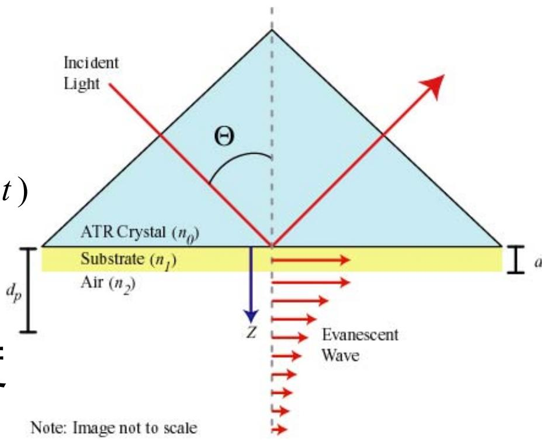

数值举例： $n _ { 1 } = 1 . 5 , i _ { 1 } = 4 5 ^ { \circ } \mathbb { H } \mathbb { H } , d \approx \lambda _ { 0 } / 2$ 

$$
n _ {2} = 1. 0, i _ {1} = 6 0 ^ {\circ} \text {时}, d \approx \lambda_ {0} / 5
$$

$$
i _ {c} = 4 2 ^ {\circ} \quad i _ {1} \approx 9 0 ^ {\circ} \text {时}, \quad d \approx \lambda_ {0} / 7
$$

隐失波的穿透深度为波长量级。

$$
\widetilde {E} _ {2} (\vec {r}, t) = \widetilde {E} _ {2 0} e ^ {- k _ {2 z} ^ {\prime} z} e ^ {i (k _ {2 x} x - \omega t)}
$$

$$
k _ {2 \mathrm {x}} = n _ {1} k _ {0} \sin i _ {1} = n _ {2} k _ {0} \sin i _ {2}
$$

(2)波动性

仅沿界面x方向为行波，而沿纵z方向无波动性。

隐失波的等幅面与等相面并不一致，两者恰巧正交。

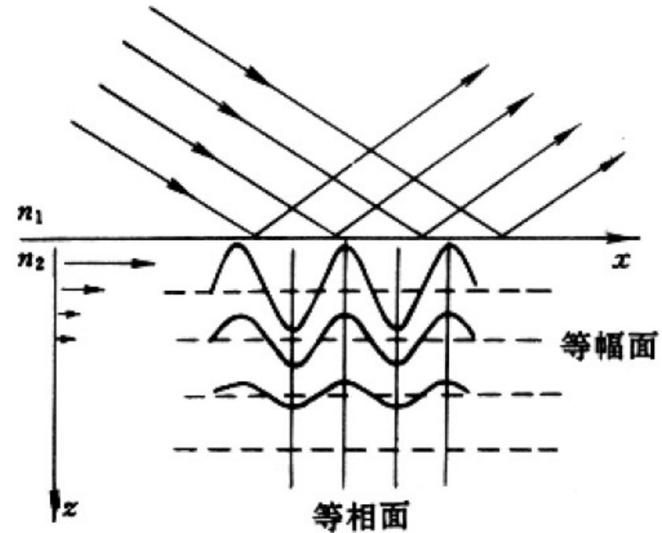

凡是等相面与等幅面不重合一致的波，

通称为非均匀波(inhomogeneous wave).

x 方向行波的传播速度：

$$
\nu_ {2 x} = \frac {\omega}{k _ {2 x}} = \frac {\omega}{k _ {1} \sin i _ {1}} = \frac {\nu_ {1}}{\sin i _ {1}}, \lambda_ {2 x} = \frac {2 \pi}{k _ {2 x}} = \frac {\lambda_ {1}}{\sin i _ {1}}
$$

介质2中存在的隐失波，其速度和波长竟决定于介质1中的行波速度和波长，且与入射角有关。

# （3） 隐失波的能流分析

均匀介质空间中麦克斯韦方程组 tH E       $\nabla \times \vec { E } = - \mu \mu _ { \scriptscriptstyle 0 } \frac { \partial \vec { H } } { \partial t }$ 

得： $\mu \mu _ { \scriptscriptstyle 0 } \vec { H } = \frac { 1 } { \omega } \vec { k } \times \vec { E }$ 

$$
H _ {2 x} = \frac {1}{\mu \mu_ {0} \omega} \left(k _ {2 y} E _ {2 z} - k _ {2 z} E _ {2 y}\right) = - \frac {i}{\mu \mu_ {0} \omega} k _ {2 z} ^ {\prime} E _ {2 y}, \left(k _ {2 y} = 0\right)
$$

$$
\begin{array}{l} H _ {2 y} = \frac {1}{\mu \mu_ {0} \omega} (k _ {2 z} E _ {2 x} - k _ {2 x} E _ {2 z}); \left(\because \frac {\widetilde {E} _ {2 0 x}}{\widetilde {E} _ {2 0 z}} = - i \frac {k _ {2 z} ^ {\prime}}{k _ {2 x}}\right) \\ = - \frac {i}{\mu \mu_ {0} \omega} \frac {\left(k _ {2 x} ^ {2} + k _ {2 z} ^ {2}\right)}{k _ {2 z} ^ {\prime}} E _ {2 x} = - \frac {i}{\mu \mu_ {0} \omega} \frac {k ^ {2}}{k _ {2 z} ^ {\prime}} E _ {2 x} \\ \end{array}
$$

$$
H _ {2 z} = \frac {1}{\mu \mu_ {0} \omega} \left(k _ {2 x} E _ {2 y} - k _ {2 y} E _ {2 x}\right) = \frac {1}{\mu \mu_ {0} \omega} k _ {2 x} E _ {2 y}
$$

$$
H _ {2 x} = - \frac {i}{\mu \mu_ {0} \omega} k _ {2 z} ^ {\prime} E _ {2 y},
$$

$$
E _ {2 x}, H _ {2 y}
$$

$$
H _ {2 y} = - \frac {i}{\mu \mu_ {0} \omega} \frac {k ^ {2}}{k _ {2 z} ^ {\prime}} E _ {2 x}
$$

$E _ { 2 y } , H _ { 2 x }$ 相位分别差

$$
H _ {2 z} = \frac {1}{\mu \mu_ {0} \omega} k _ {2 x} E _ {2 y}
$$

$$
\vec {S} = \vec {E} \times \vec {H}
$$

$$
S _ {2 z} = E _ {2 x} H _ {2 y} - E _ {2 y} H _ {2 x}
$$

以简谐波函数为例，求S2z对时间的平均：

$$
\begin{array}{l} \left\langle S _ {2 z} \right\rangle = \left\langle E _ {2 x} H _ {2 y} \right\rangle - \left\langle E _ {2 y} H _ {2 x} \right\rangle \\ = \frac {1}{\mu \mu_ {0} \omega} \left(k _ {2 z} ^ {\prime} E _ {2 0 y} ^ {2} - \frac {k ^ {2}}{k _ {2 z} ^ {\prime}} E _ {2 0 x} ^ {2}\right) \frac {1}{T} \int_ {0} ^ {T} \cos (\omega t) \cos \left(\omega t + \frac {\pi}{2}\right) \\ = 0 \\ \end{array}
$$

隐失波不具有辐射场的性质，是一种局域性的波场。

# 隐失波实验现象与应用

# 光学隧道效应

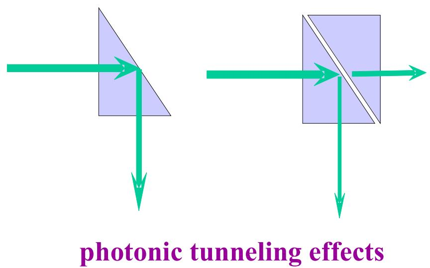

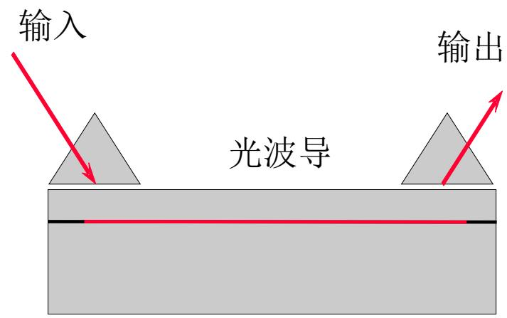

光波导的耦合

通过隐失波场的耦合可改变行波的能流分配。