# 第四章 光的干涉

# 第四章 光的干涉

1、 概述

2、光波的叠加和干涉

3、 分波前干涉—杨氏干涉

4、 其他分波前干涉装置

5、 空间相干性

6、分振幅干涉

(1) 两平行光干涉; (2) 薄膜干涉（等倾和等厚干涉）

7、迈克耳孙干涉仪和马赫-曾得尔干涉仪

8、时间相干性

9、多光束干涉

# 三角函数复习：

$$
\sin (\alpha \pm \beta) = \sin \alpha \cos \beta \pm \cos \alpha \sin \beta
$$

$$
\cos (\alpha \pm \beta) = \cos \alpha \cos \beta \mp \sin \alpha \sin \beta
$$

$$
\sin \alpha + \sin \beta = 2 \sin \frac {\alpha + \beta}{2} \cos \frac {\alpha - \beta}{2}
$$

$$
\sin \alpha - \sin \beta = 2 \sin \frac {\alpha - \beta}{2} \cos \frac {\alpha + \beta}{2}
$$

$$
\cos \alpha + \cos \beta = 2 \cos \frac {\alpha + \beta}{2} \cos \frac {\alpha - \beta}{2}
$$

$$
\cos \alpha - \cos \beta = - 2 \sin \frac {\alpha + \beta}{2} \sin \frac {\alpha - \beta}{2}
$$

$$
\sin \alpha \sin \beta = - \frac {1}{2} \left[ \cos (\alpha + \beta) - \cos (\alpha - \beta) \right]
$$

$$
\sin \alpha \cos \beta = \frac {1}{2} \left[ \sin (\alpha + \beta) + \sin (\alpha - \beta) \right]
$$

$$
\cos \alpha \cos \beta = \frac {1}{2} \left[ \cos (\alpha + \beta) + \cos (\alpha - \beta) \right]
$$

# 光波的干涉

1800年，T.杨提出了反对微粒说的几条论据，首次提出干涉这一术语，并分析了水波和声波叠加后产生的干涉现象。杨于1801年最先用双缝演示了光的干涉现象（见杨氏实验），提出波长概念，并成功地测量了光波波长。他还用干涉原理解释了白光照射下薄膜呈现的颜色。

以干涉原理为基础的干涉计量术为人们提供了精密测量和检验的手段（见干涉仪）

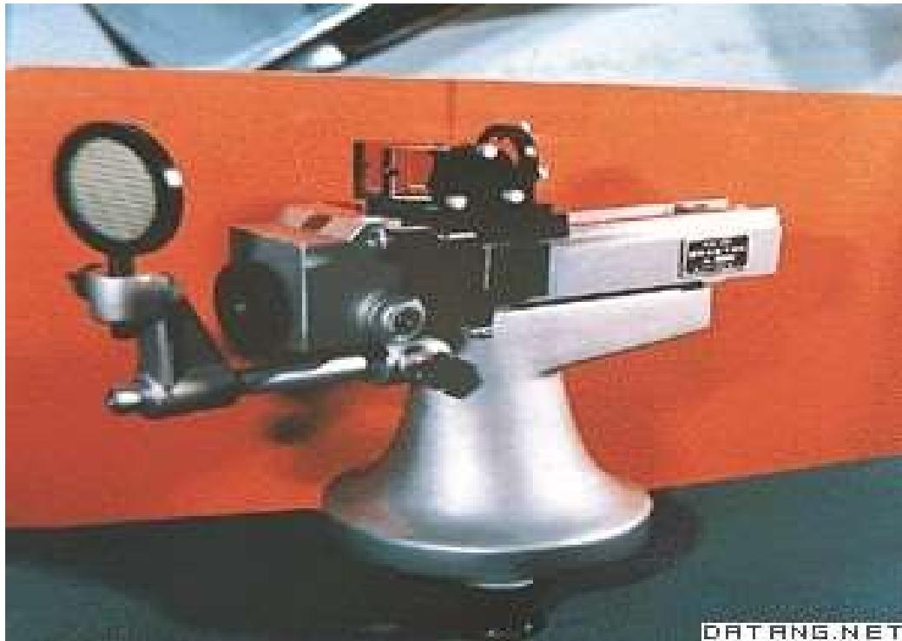

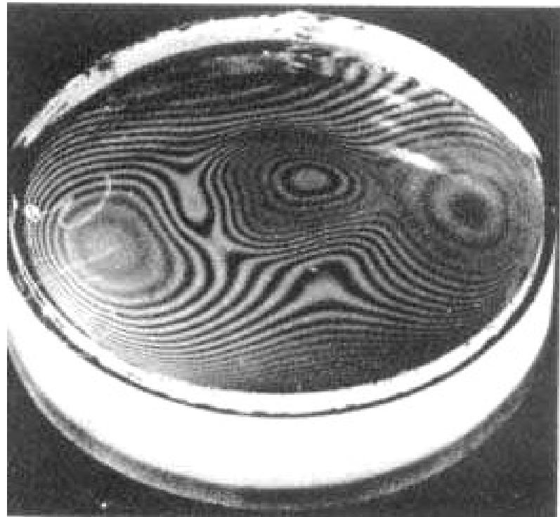

# 4.2、光波的叠加和干涉

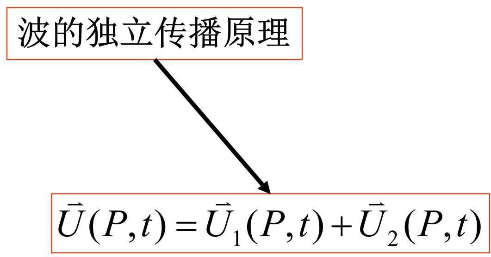

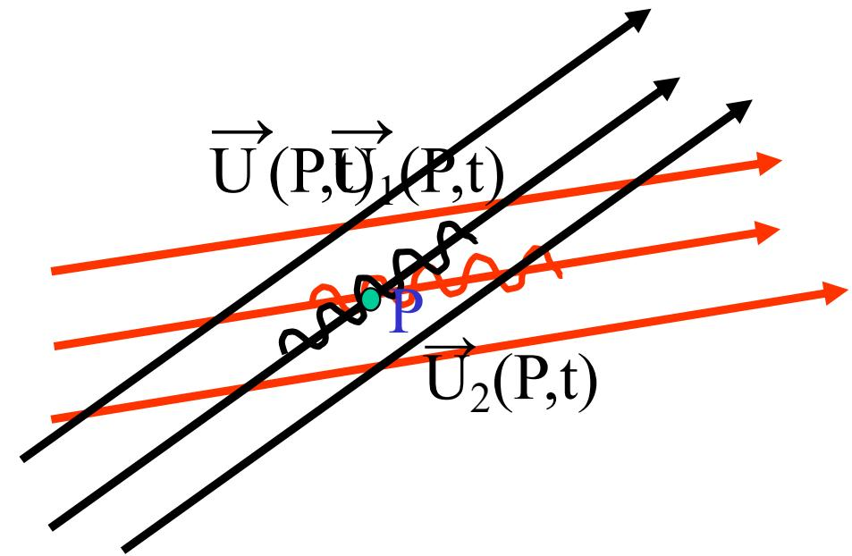

波的叠加原理

在通常介质和通常光强下，波的叠加原理总是成立的。

$$
\vec {U} (P, t) \neq \vec {U} _ {1} (P, t) + \vec {U} _ {2} (P, t)????
$$

在高光强、非线性光学介质中叠加原理不再成立，比如光限幅—可以用于激光防护。

光强 平均电磁能流度值

$$
I = \frac {1}{\Delta t} \int_ {0} ^ {\Delta t} \left| U (t) \right| ^ {2} d t = \left\langle \left| U (t) \right| ^ {2} \right\rangle
$$

t T为测量时间，对于简谐波，可取为周期 。

U1和 $\mathrm { { U } } _ { 2 }$ 单独存在的时候在P点的光强： $. I _ { 1 } ( P ) = \left. \left| U _ { 1 } \right| ^ { 2 } \right. \qquad I _ { 2 } ( P ) = \left. \left| U _ { 2 } \right| ^ { 2 } \right.$ $I _ { 1 } ( P ) = \left. \left| U _ { 1 } \right| ^ { 2 } \right.$ $I _ { 2 } ( P ) = \left. \left| U _ { 2 } \right| ^ { 2 } \right.$ $\mathrm { U } _ { 1 }$ 和 $\mathrm { { U } } _ { 2 }$ 同时存在的时候在P点的光强为多少？？？

$$
I (P) = \left\langle \left| \vec {U} _ {1} + \vec {U} _ {2} \right| ^ {2} \right\rangle = \left\langle \left| \vec {U} _ {1} \right| ^ {2} \right\rangle + \left\langle \left| \vec {U} _ {2} \right| ^ {2} \right\rangle + 2 \left\langle \vec {U} _ {1} \cdot \vec {U} _ {2} \right\rangle
$$

$$
I (P) = I _ {1} (P) + I _ {2} (P) + \Delta I (P)
$$

# 波叠加的相干条件

（1）非相干叠加： $\left. \vec { U } _ { 1 } \cdot \vec { U } _ { 2 } \right. \equiv 0$ 

$$
I (P) = I _ {1} (P) + I _ {2} (P)
$$

（2）相干叠加 $\left. \vec { U } _ { 1 } \cdot \vec { U } _ { 2 } \right. \ne 0$ 

$$
I (P) = I _ {1} (P) + I _ {2} (P) + \Delta I (P)
$$

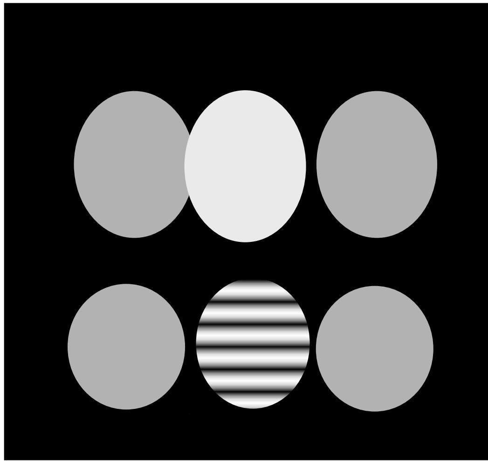

交叠区出现明暗相间的条纹，I(P)是空间函数，使得光强在空间有一定的分布， I(P)成为干涉项。

关心的问题：相干叠加条件？干涉项？

# 干涉的两个条件及稳定干涉的条件：

（1）两列波的扰动方向一致，或有方向一致的平行分量。如果正交，必然是非相干叠加。

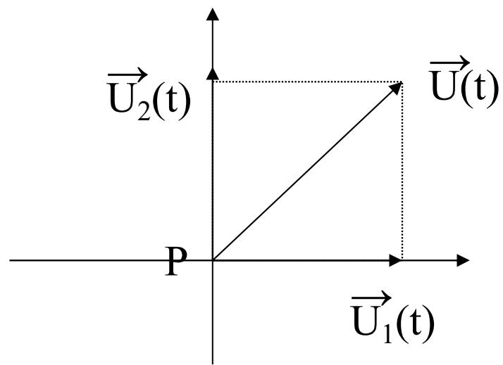

$$
\begin{array}{l} \vec {U} _ {1} \perp \vec {U} _ {2}, \\ U ^ {2} (t) = U _ {1} ^ {2} (t) + U _ {2} ^ {2} (t) \\ \end{array}
$$

取时间平均： $\big \langle U ^ { 2 } ( t ) \big \rangle = \big \langle U ^ { 2 } ( t ) \big \rangle + \big \langle U ^ { 2 } ( t ) \big \rangle ,$ ，

所以： $I ( P ) = I _ { 1 } ( P ) + I _ { 2 } ( P )$ 非相干叠加  

# 光强

$$
U (P, t) = A \cos (\omega t - \phi (P))
$$

简谐波：

$$
\begin{array}{l} I = \left\langle \left| U (t) \right| ^ {2} \right\rangle = \frac {1}{T} \int_ {0} ^ {T} U ^ {2} (P, t) d t = \frac {1}{T} \int_ {0} ^ {T} \left(A \cos (\omega t - \phi (P))\right) ^ {2} d t \\ = \frac {1}{2} A ^ {2} \\ \end{array}
$$

（2）频率相同是相干的另一条件。两列波若频率不同，必然为非相干叠加。

$$
U _ {1} (P, t) = A _ {1} \cos \big (\omega_ {1} t - \varphi_ {1} (P) \big), U _ {2} (P, t) = A _ {2} \cos \big (\omega_ {2} t - \varphi_ {2} (P) \big)
$$

叠加原理： $U ( P , t ) = U _ { 1 } ( P , t ) + U _ { 2 } ( P , t )$ 

光强：I $\left( P \right) = \left. U ^ { 2 } \right. = \left. ( U _ { 1 } + U _ { 2 } ) ^ { 2 } \right. = \left. U _ { 1 } ^ { 2 } + { U _ { 2 } } ^ { 2 } \right.$ 2  1 2 U U 

$$
= \left\langle U _ {1} ^ {2} \right\rangle + \left\langle U _ {2} ^ {2} \right\rangle + 2 \left\langle U _ {1} U _ {2} \right\rangle
$$

( ) ( ) ( ) 1 2I P I P I P     是否为零决定了是否是相干叠加

$$
\begin{array}{l} \Delta I (P) = 2 \left\langle U _ {1} U _ {2} \right\rangle = \left\langle 2 A _ {1} A _ {2} \cos (\omega_ {1} t - \varphi_ {1} (P)) \cos (\omega_ {2} t - \varphi_ {2} (P)) \right\rangle \\ = A _ {1} A _ {2} \left\langle \cos \left(\left(\omega_ {1} + \omega_ {2}\right) t - \left(\varphi_ {1} + \varphi_ {2}\right)\right) \right\rangle + A _ {1} A _ {2} \left\langle \cos \left(\left(\omega_ {1} - \omega_ {2}\right) t - \left(\varphi_ {1} - \varphi_ {2}\right)\right) \right\rangle \\ \end{array}
$$

√ 0 

如果， $\omega _ { 1 } \neq \omega _ { 2 } ,$ ，为零，

此时 $I ( { \bf P } ) = I _ { 1 } ( { \cal P } ) + I _ { 2 } ( { \cal P } ) ,$ ，为非相干叠加。

如果， $\omega _ { 1 } = \omega _ { 2 } ,$ ，可不为零，

$$
\Delta I (P) = A _ {1} A _ {2} \left\langle \cos (\varphi_ {1} - \varphi_ {2}) \right\rangle = 2 \sqrt {I _ {1} I _ {2}} \left\langle \cos \delta (P) \right\rangle
$$

$$
I (P) = I _ {1} (P) + I _ {2} (P) + 2 \sqrt {I _ {1} I _ {2}} \left\langle \cos \delta (P) \right\rangle
$$

$\left. \cos ( \delta ( P ) ) \right.$ 决定了干涉条纹的空间分布。

# （3）稳定干涉的条件：稳定的相位差。

$$
I (P) = I _ {1} (P) + I _ {2} (P) + 2 \sqrt {I _ {1} I _ {2}} \left\langle \cos \delta (P) \right\rangle
$$

$$
I (P) = I _ {1} (P) + I _ {2} (P) + 2 \sqrt {I _ {1} I _ {2}} \cos \delta (P)
$$

$$
\begin{array}{l} \end{array}
$$

# 三个条件的针对性：

第一个条件，针对于矢量波，光波矢量波，且是横波。

第二个条件， 针对于任何波。

第三个条件，稳定干涉。对于宏观波源发出的波，稳定不是问题。对于光波要认真考虑。

相位差分析

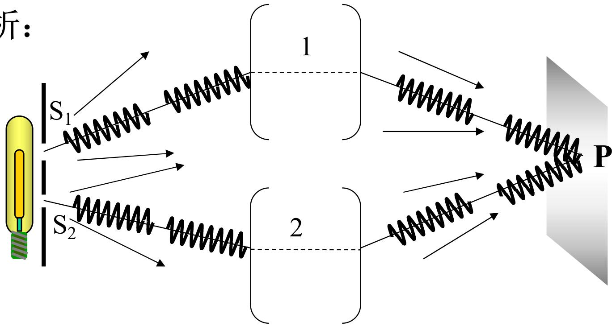

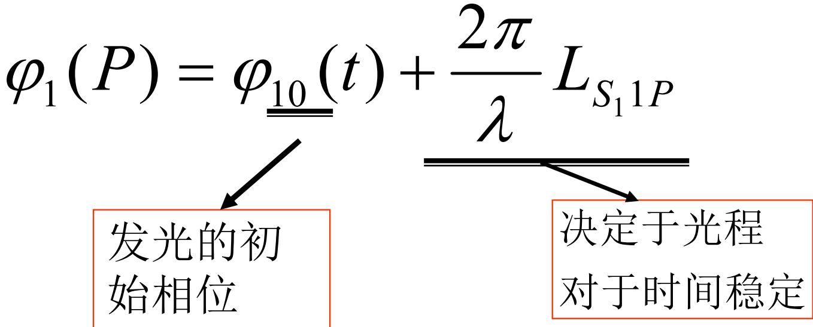

$$
\varphi_ {2} (P) = \varphi_ {2 0} (t) + \frac {2 \pi}{\lambda} L _ {S _ {2} 2 P}
$$

相位差：

$$
\begin{array}{l} \delta (P) = \varphi_ {1} (P) - \varphi_ {2} (P) \\ = \frac {2 \pi}{\lambda} \left[ L _ {S _ {1} 1 P} - L _ {S _ {2} 2 P} \right] + \underline {{\left[ \varphi_ {1 0} (t) - \varphi_ {2 0} (t) \right]}} \\ \end{array}
$$

稳定取决于此

# 光源----能发射光波的物体

# 光源的最基本发光单元是分子、原子等

能级跃迁辐射

波列

$$
\nu = \left(E _ {2} - E _ {1}\right) / h
$$

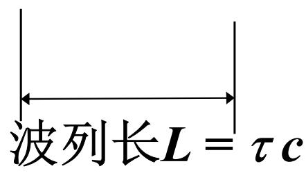

普通光源：

自发辐射

• 发光的间隙性

• 发光的随机性

光源

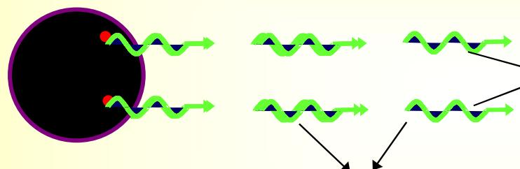

独立(不同原子发的光)

独立(同一原子先后发的光)

两个独立的普通光源不可能成为一对相干光源

钠光

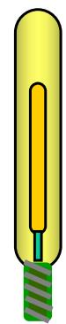

两束光不相干！

原因：发光是随机的，间歇性的。两列光波相位差不可能恒定。

$$
\vec {U} (P, t) = \vec {U} _ {1} (P, t) + \vec {U} _ {2} (P, t)
$$

$$
I (P) = \left\langle \left| \vec {U} _ {1} + \vec {U} _ {2} \right| ^ {2} \right\rangle = \left\langle \left| \vec {U} _ {1} \right| ^ {2} \right\rangle + \left\langle \left| \vec {U} _ {2} \right| ^ {2} \right\rangle + 2 \left\langle \vec {U} _ {1} \cdot \vec {U} _ {2} \right\rangle
$$

$$
I (P) = I _ {1} (P) + I _ {2} (P) + 2 \sqrt {I _ {1} I _ {2}} \left\langle \cos \delta (P) \right\rangle
$$

$\left. \cos ( \delta ( P ) ) \right.$ 决定了干涉条纹的空间分布。

$$
\begin{array}{l} \delta (P) = \varphi_ {1} (P) - \varphi_ {2} (P) \\ = \frac {2 \pi}{\lambda} \left[ L _ {S _ {1} 1 P} - L _ {S _ {2} 2 P} \right] + \left[ \varphi_ {1 0} (t) - \varphi_ {2 0} (t) \right] \\ \end{array}
$$

# 怎样利用普通光源获得相干光？

利用普通光源获得相干光的方法的基本原理是：把由光源上同一点同一次发的光设法分成两部分，然后再使这两部分叠加起来。由于这两部分光实际上都来自同一发光原子的同一次发光，它们满足相干条件而成为相干光。分开之后所走的路程不同，导致光波的相位不同，根据其差别分别产生干涉加强或者减弱。

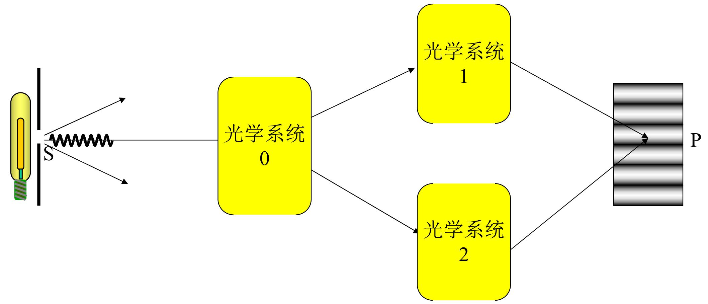

$$
\begin{array}{l} \delta (P) = \varphi_ {1} (P) - \varphi_ {2} (P) \\ = - \frac {2 \pi}{\lambda} \left[ L _ {S 0 1 P} - L _ {S 0 2 P} \right] + \left[ \varphi_ {1 0} (t) - \varphi_ {2 0} (t) \right] \\ = - \frac {2 \pi}{\lambda} \left[ L _ {S 0 1 P} - L _ {S 0 2 P} \right] \\ \end{array}
$$

与初始相位无关，对时间稳定。

$$
I (P) = I _ {1} (P) + I _ {2} (P) + 2 \sqrt {I _ {1} I _ {2}} \frac {\left\langle \cos \delta (P) \right\rangle}{\cos \delta (P)}
$$

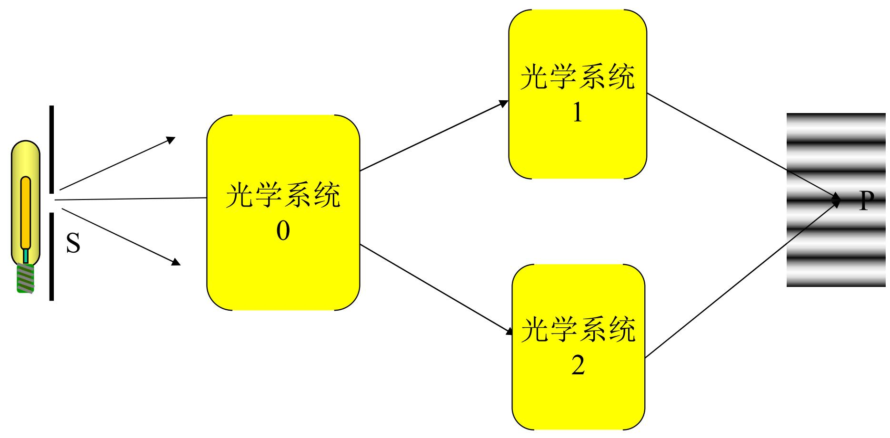

由普通光源获得相干光的途径（方法）有两类：

# 分波前干涉

从同一波面上的不同部分产生次级波相干

分波面法,如：杨氏双孔干涉

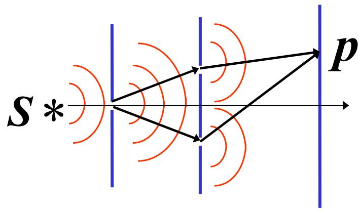

# 分振幅干涉

利用光的反射和折射将同一光束分割成振幅较小的两束相干光

分振幅法， 如：薄膜干涉

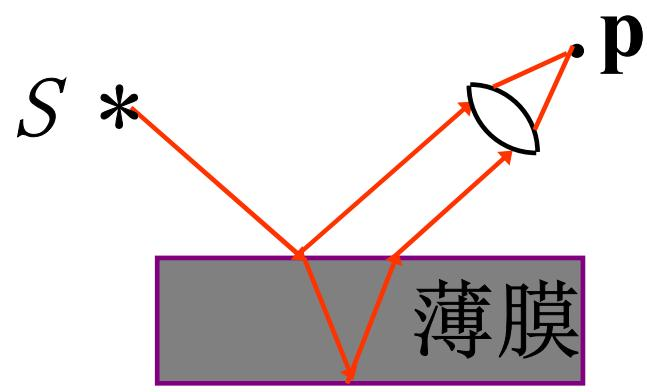

干涉场的衬比度：

双光束干涉强度公式：

$$
I (P) = I _ {1} (P) + I _ {2} (P) + 2 \sqrt {I _ {1} I _ {2}} \cos \delta (P)
$$

$$
I _ {M} = I _ {1} + I _ {2} + 2 \sqrt {I _ {1} I _ {2}}, \quad \delta = 2 k \pi
$$

$$
I _ {m} = I _ {1} + I _ {2} - 2 \sqrt {I _ {1} I _ {2}}, \quad \delta = (2 k + 1) \pi
$$

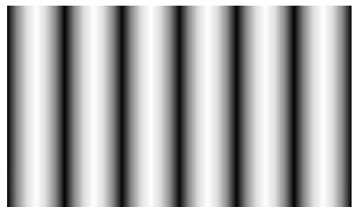

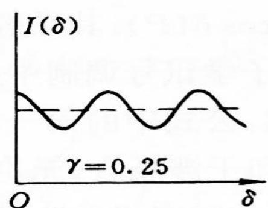

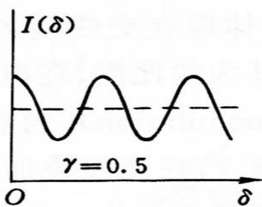

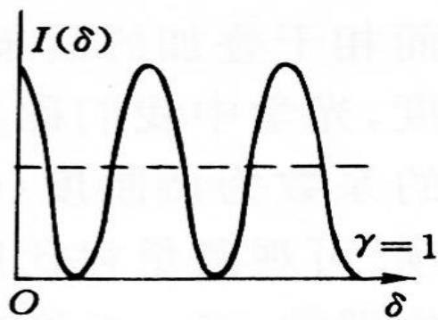

图2.14干涉场强度起伏程度由衬比度描述

# 引进衬比度：

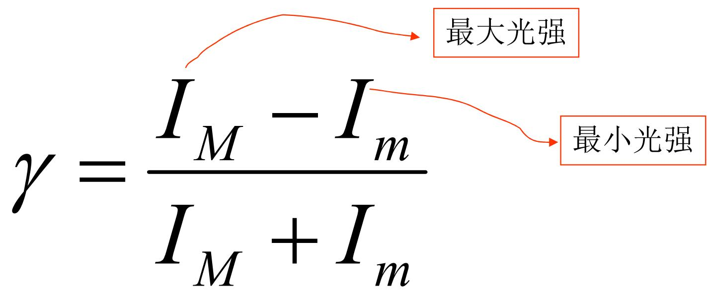

# 双光束干涉的衬比度和振幅比的关系：

双光束干涉强度公式：

$$
I (P) = I _ {1} (P) + I _ {2} (P) + 2 \sqrt {I _ {1} I _ {2}} \cos \delta (P)
$$

$$
I _ {M} = I _ {1} + I _ {2} + 2 \sqrt {I _ {1} I _ {2}}, \quad \delta = 2 k \pi
$$

$$
I _ {m} = I _ {1} + I _ {2} - 2 \sqrt {I _ {1} I _ {2}}, \quad \delta = (2 k + 1) \pi
$$

$$
\gamma = \frac {I _ {M} - I _ {m}}{I _ {M} + I _ {m}}
$$

$$
I = I _ {0} \left(1 + \gamma \cos \delta (P)\right),
$$

$$
I _ {0} = I _ {1} + I _ {2}
$$

$$
\gamma = \frac {2 \sqrt {I _ {1} I _ {2}}}{I _ {1} + I _ {2}} \xrightarrow {\boxed {I \propto A ^ {2}}}
$$

$$
\gamma = \frac {2 \frac {A _ {1}}{A _ {2}}}{1 + \left(\frac {A _ {1}}{A _ {2}}\right) ^ {2}}
$$

$$
\text {或} \quad \gamma = \frac {2 \frac {A _ {2}}{A _ {1}}}{1 + \left(\frac {A _ {2}}{A _ {1}}\right) ^ {2}}
$$

计算：

$$
\begin{array}{l} \frac {A _ {1}}{A _ {2}} = 1 \rightarrow \gamma = 1; \quad \frac {A _ {1}}{A _ {2}} = 3 \rightarrow \gamma = 0. 6; \quad \frac {A _ {1}}{A _ {2}} = 1 0 \rightarrow \gamma = 0. 2 \\ 0 \leq \gamma \leq 1 \\ \end{array}
$$

在满足相干叠加的条件基础上，为获得较高的衬比度，补充两点：

1、参与相干叠加的两光束，振幅尽量相等

2、参与相干叠加的两光束的传播方向的夹角不要太大。

衬比度和两光束夹角的关系：

讨论两自然偏振光光束的干涉

同频和稳定的相位差。

$$
I _ {1} = I _ {2} = I
$$

偏振分析：s和p光。

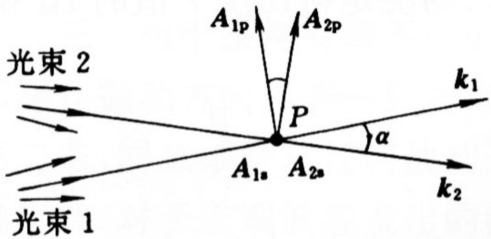

图2.15考察自然光干涉的衬比度

$$
I _ {1 s} = I _ {2 s} = I _ {1 p} = I _ {2 p} = \frac {1}{2} I
$$

对于s光：

$$
I _ {s} (P) = I _ {1 s} (P) + I _ {2 s} (P) + 2 \sqrt {I _ {1 s} I _ {2 s}} \cos \delta (P)
$$

$$
I _ {M s} = 2 I, \qquad I _ {m s} = 0
$$

对 p光：

$$
U _ {p} ^ {2} = U _ {1 p} ^ {2} + U _ {2 p} ^ {2} + 2 U _ {1 p} U _ {2 p} \cos \alpha
$$

$$
\begin{array}{c} \left\langle U _ {p} ^ {2} \right\rangle = \left\langle U _ {1 p} ^ {2} \right\rangle + \left\langle U _ {2 p} ^ {2} \right\rangle + \left\langle 2 U _ {1 p} U _ {2 p} \cos \alpha \right\rangle \\ \overline {{\mathsf {T}}} \quad \overline {{\mathsf {T}}} \quad \overline {{\mathsf {T}}} \quad \overline {{\mathsf {T}}} \end{array}
$$

$$
I _ {p} = I _ {1 p} + I _ {2 p} + 2 \sqrt {I _ {1 p} I _ {2 p}} \cos \alpha \cdot \cos \delta (P)
$$

$$
I _ {M p} = I (1 + \cos \alpha) \qquad , \qquad I _ {m p} = I (1 - \cos \alpha)
$$

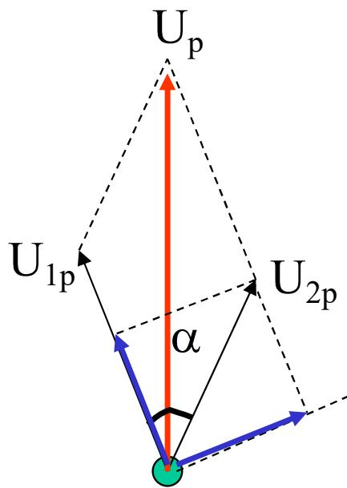

$$
I _ {M} = I _ {M s} + I _ {M p} = I (3 + \cos \alpha)
$$

$$
I _ {m} = I _ {m s} + I _ {m p} = I (1 - \cos \alpha)
$$

$$
\gamma = \frac {I _ {M} - I _ {m}}{I _ {M} + I _ {m}} = \frac {1 + \cos \alpha}{2}
$$

10 , 0.99; 20 , 0.97;       当 当

30 , 0.93; 60 , 0.75;       当 当

在傍轴情况下，<20o 时， 与1接近，可以把自然光干涉看成标量干涉。

干涉场光强分布：

双光束干涉 $I ( P ) = I _ { 1 } ( P ) + I _ { 2 } ( P ) + 2 \sqrt { I _ { 1 } I _ { 2 } } \cos \delta ($ ) P

&(P)? 多光束？

光波的叠加原理，观察屏上的波前函数为：

$$
\widetilde {U} (x, y) = \widetilde {U} _ {1} (x, y) + \widetilde {U} _ {2} (x, y) + \dots
$$

观察屏上光强分布：

$$
\begin{array}{l} I (x, y) = \widetilde {U} (x, y) \cdot \widetilde {U} ^ {*} (x, y) \\ = \left(\widetilde {U} _ {1} (x, y) + \widetilde {U} _ {2} (x, y) + \bullet \bullet \bullet\right) \cdot \left(\widetilde {U} _ {1} (x, y) + \widetilde {U} _ {2} (x, y) + \bullet \bullet \bullet\right) ^ {*} \\ \end{array}
$$

几种常用几种波前函数：

$$
\widetilde {U} (x, y) = A e ^ {i \left(k _ {x} \cdot x + k _ {y} \cdot y\right)}
$$

$$
\widetilde {U} (x, y) \approx \frac {A}{z _ {0}} e ^ {i k \frac {x ^ {2} + y ^ {2}}{2 z _ {0}}} \cdot e ^ {- i k \frac {x x _ {0} + y y _ {0}}{z _ {0}}}
$$

$$
\widetilde {U} ^ {*} (x, y) \approx \frac {A}{z _ {0}} e ^ {- i k \frac {x ^ {2} + y ^ {2}}{2 z _ {0}}} \cdot e ^ {i k \frac {x x _ {0} + y y _ {0}}{z _ {0}}}
$$

例题：平行光干涉

$$
\begin{array}{l} \tilde {U} (\vec {r}) = A e ^ {i \vec {k} \cdot \vec {r}} \\ = A e ^ {i (k _ {x} \cdot x + k _ {y} \cdot y + k _ {z} \cdot z)} \\ = A e ^ {i (k _ {x} \cdot x + k _ {z} \cdot z)} \\ = A e ^ {i (k \sin \theta \cdot x + k \cos \theta \cdot z)} \\ \end{array}
$$

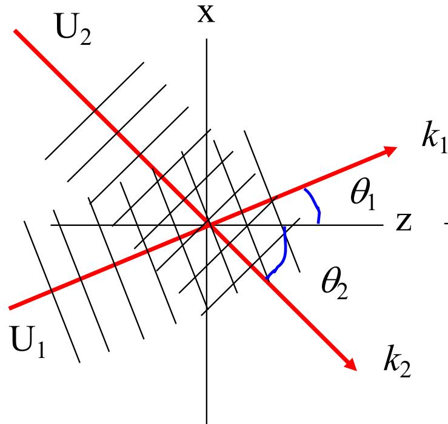

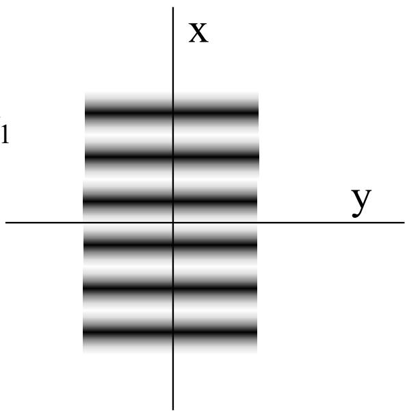

$$
\widetilde {U} _ {1} (x, y) = A _ {1} e ^ {i (k \sin \theta_ {1} \cdot x - \phi_ {1 0})}
$$

$$
\widetilde {U} _ {2} (x, y) = A _ {2} e ^ {i (- k \sin \theta_ {2} \cdot x - \phi_ {2 0})}
$$

$$
\begin{array}{l} I (x, y) = (\widetilde {U} _ {1} + \widetilde {U} _ {2}) \cdot (\widetilde {U} _ {1} + \widetilde {U} _ {2}) ^ {*} \\ = \widetilde {U} _ {1} \cdot \widetilde {U} _ {1} ^ {*} + \widetilde {U} _ {2} \cdot \widetilde {U} _ {2} ^ {*} + \widetilde {U} _ {1} \cdot \widetilde {U} _ {2} ^ {*} + \widetilde {U} _ {2} \cdot \widetilde {U} _ {1} ^ {*} \\ = \underline {{\underline {{A _ {1}} ^ {2} + A _ {2} ^ {2}} + 2 A _ {1} A _ {2}}} \cos \left[ k (\sin \theta_ {1} + \sin \theta_ {2}) x - \left(\phi_ {1 0} - \phi_ {2 0}\right) \right] \\ = I _ {1} + I _ {2} + 2 \sqrt {I _ {1} I _ {2}} \cos \delta (x, y) \\ \end{array}
$$

条纹间距：

$$
\Delta \delta = 2 \pi , \qquad \text {即} \qquad k (\sin \theta_ {1} + \sin \theta_ {2}) \Delta x = 2 \pi
$$

) 2 (   k 得到条纹间距公式 ： $( k = \frac { 2 \pi } { \lambda } ) { : }$ 

$$
\Delta x = \frac {\lambda}{\sin \theta_ {1} + \sin \theta_ {2}}
$$

$$
f = \frac {\sin \theta_ {1} + \sin \theta_ {2}}{\lambda}
$$

干涉场强度空间分布可以用空间频率改写成：

$$
I = I _ {0} \left(1 + \gamma \cos (2 \pi f x + \phi_ {0})\right), \qquad I _ {0} = I _ {1} + I _ {2}
$$

# * 两种典型的光路获得空间高频和低频：

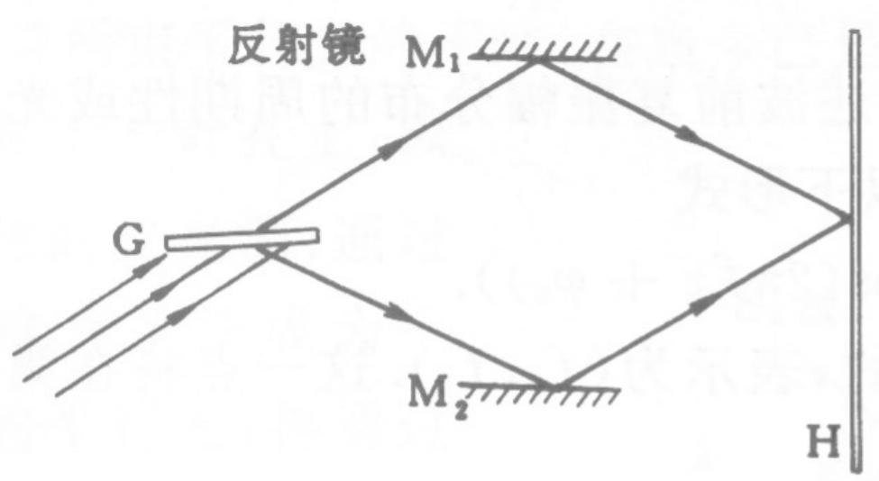

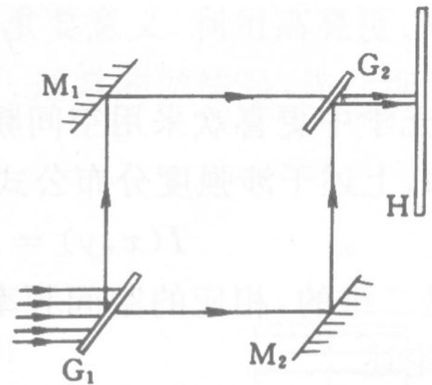

例题1 一束斜向上45度的光和一束斜向下30度的光，在xoy面上干涉，求条纹间隔和空间频率。

间距：

$$
\Delta x = \frac {\lambda}{\sin \theta_ {1} + \sin \theta_ {2}} = \frac {6 3 3 n m}{\sin \frac {\pi}{6} + \sin \frac {\pi}{4}} \approx 0. 5 3 \mu m
$$

空间频率：

$$
f = \frac {1}{\Delta x} = \frac {1}{0 . 5 3 \mu m} \approx 1 8 9 6 m m ^ {- 1}
$$

例题2、想获得低频f=20mm-1，求两平行光的夹角，设光波长为633nm.

$$
f = \frac {\sin \theta_ {1} + \sin \theta_ {2}}{\lambda} \approx \frac {\theta_ {1} + \theta_ {2}}{\lambda} = \frac {\Delta \theta}{\lambda}
$$

于是：

$$
\Delta \theta \approx f \lambda = 2 0 \times 6 3 3 \frac {n m}{m m} \approx 0. 0 1 3 r a d \approx 4 5 ^ {\prime}
$$

大夹角高空间频率，小夹角低空间频率

# 作业：

1. 求干涉的衬比度随两相干光束夹角的变化：两束光为p偏振，光强 $I _ { 1 } { = } m I _ { 2 }$ 

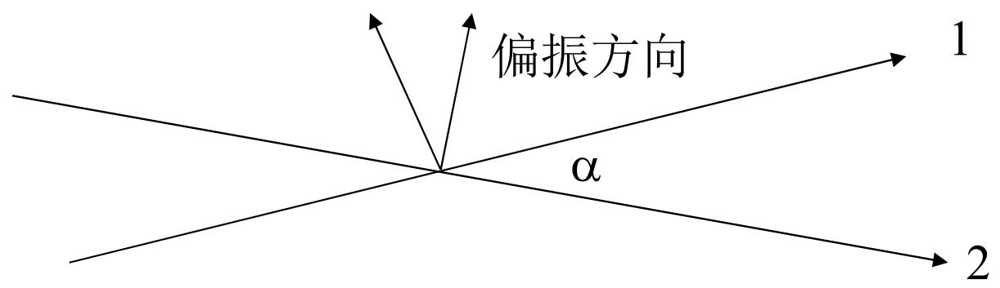

2.三束等光强、偏振方向相同、相干平行光，如下图所示，求屏幕H上的光强分布。

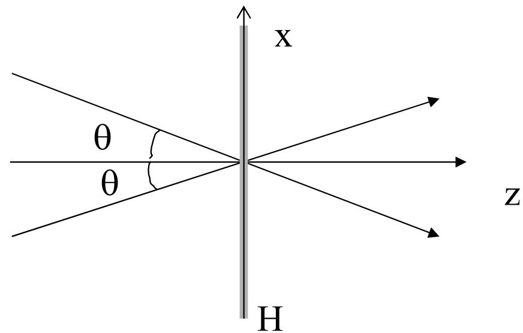

编写一个小程序，画出平面内x方向光强随位置的变化。

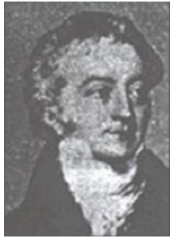

# 4.3 分波前干涉—杨氏干涉实验

英国物理学家、考古学家、医生。光的波动说的奠基人之一。1773年6月13日生于米尔费顿，曾在伦敦大学、爱丁堡大学和格丁根大学学习，伦敦皇家学会会员，巴黎科学院院士。1829年5月10日在伦敦逝世。

杨自幼天资过人，14岁就通晓拉丁、希腊、法、意、阿拉伯等多种语言。开始时学习医学，后来酷爱物理学，特别是光学和声学，一生在物理、化学、生物、医学、天文、哲学、语言、考古等广泛的领域做了大量的工作，但在科学史上他以作为物理学家而最著名。杨在行医时就开始研究感官的知觉作用，1793年写了第一篇关于视觉的论文，发现了眼睛中晶状体的聚焦作用,1801年发现眼睛散光的原因，由此进入光学的研究领域。他怀疑光的微粒说的正确性，进行了著名的杨氏双孔及双缝干涉实验，首次引入干涉概念论证了光的波动说，又利用波动说解释了牛顿环的成因及薄膜的彩色。他第一个测定了7种颜色光的波长。1817年，他得知A.J.菲涅尔和D.F.J.阿拉果关于偏振光的干涉实验后，提出光是横波。杨对人眼感知颜色问题做了研究，提出了三原色理论。他首先使用运动物体的“能量”一词来代替“活力”，描述材料弹性的杨氏模量也是以他的姓氏命名的，他在考古学方面亦有贡献，曾破译了古埃及石碑上的文字。

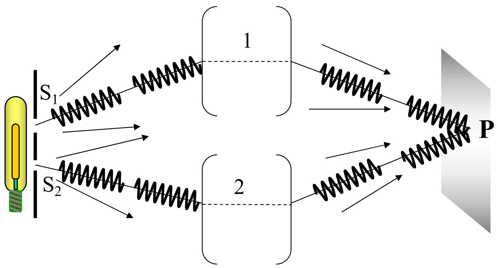

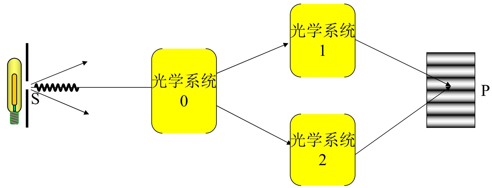

# 怎样利用普通光源获得相干光？

利用普通光源获得相干光的方法的基本原理是：把由光源上同一点同一次发的光设法分成两部分，然后再使这两部分叠加起来。由于这两部分光实际上都来自同一发光原子的同一次发光，它们满足相干条件而成为相干光。分开之后所走的路程不同，导致光波的相位不同，根据其差别分别产生干涉加强或者减弱。

干涉条纹形状：

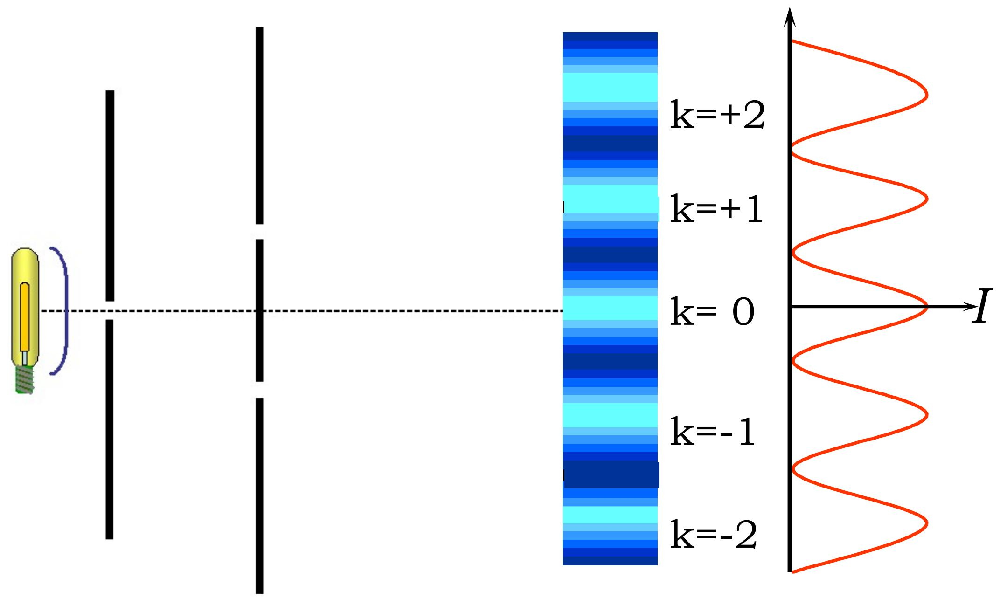

# 1、 实验装置

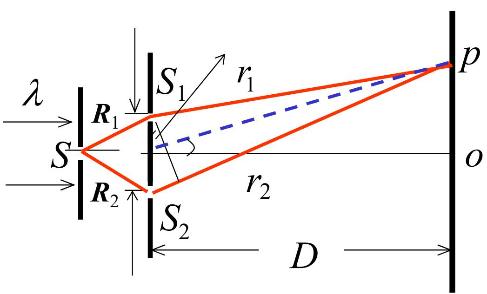

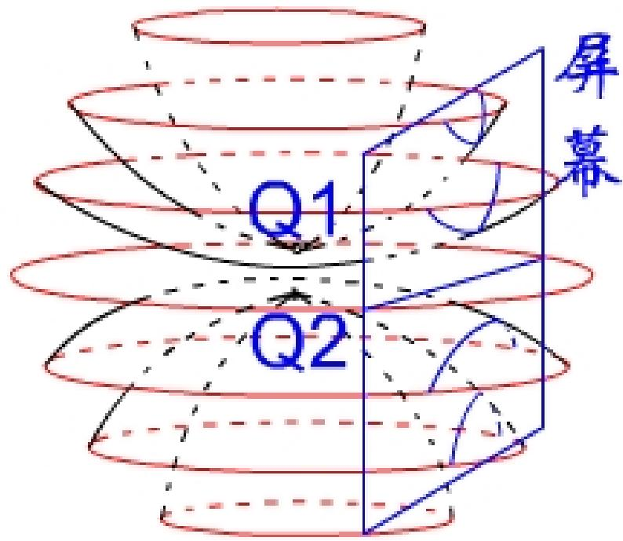

两球面波的干涉场

$$
I (P) = I _ {1} (P) + I _ {2} (P) + 2 \sqrt {I _ {1} I _ {2}} \cos \delta (P)
$$

$$
\delta = \frac {2 \pi}{\lambda} \bigl [ (R _ {2} + r _ {2}) - (R _ {1} + r _ {1}) \bigr ]
$$

对称装置， $\pmb { R } _ { 1 } \overline { { - } } \pmb { R } _ { 2 }$ 

r  r 相同的点，干涉情况相同。数学证明 r2  r1  常数 的点的轨迹是 $r _ { 2 } - r _ { 1 }$ $r _ { 2 } - r _ { 1 } =$ 以两点光源为焦点的回旋双曲面。

$$
\delta (P) = ?
$$

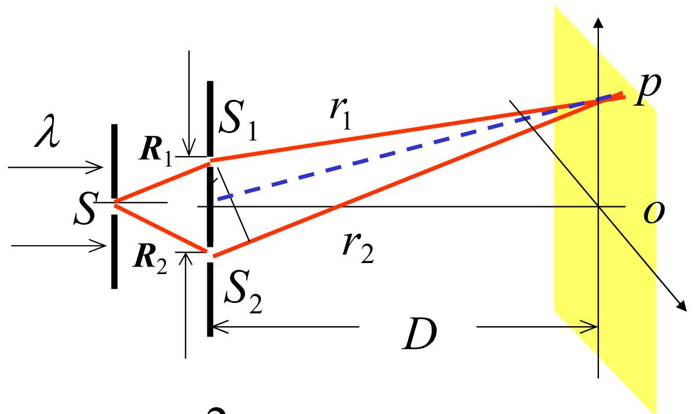

$= \frac { 2 \pi } { \lambda } \big [ ( R _ { 2 } + r _ { 2 } ) - ( R _ { 1 } + r _ { 1 } ) \big ] = \frac { \angle \pi } { \lambda } \big [ r _ { 2 } -$ 

对称装置， $\pmb { R } _ { 1 } \overline { { - } } \pmb { R } _ { 2 }$ 

$$
r _ {1} = \sqrt {D ^ {2} + (x - \frac {1}{2} d) ^ {2} + y ^ {2}}
$$

$$
r _ {2} = \sqrt {D ^ {2} + (x + \frac {1}{2} d) ^ {2} + y ^ {2}}
$$

$$
d, x, y \ll D
$$

$$
r _ {2} - r _ {1} \approx \frac {d}{D} x
$$

$$
\delta = \frac {2 \pi}{\lambda} \frac {d}{D} x
$$

# 条纹间隙：

当 $\delta = \frac { 2 \pi d } { \lambda D } x = 2 k \pi ,$ ，振动相长，为亮条纹，亮条纹的位置： $x = \frac { D } { d } k \lambda$ 

当 $\delta = \frac { 2 \pi d } { \lambda D } \boldsymbol { x } = ( 2 k + 1 ) \pi ,$ ，振动相消，为暗条纹，暗条纹的位置： $x = \frac { D } { d } ( k + \frac { 1 } { 2 } ) \lambda$ 条纹间距 $\Delta x$ 为两条相邻亮条纹或暗条纹之间的距离，

$$
\Delta x = \frac {D}{d} \lambda
$$

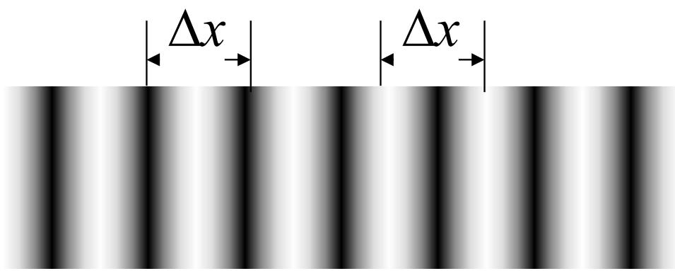

如果 $I _ { I } { = } I _ { 2 } { = } I _ { 0 }$ 

$$
I = 2 I _ {0} (1 + \cos \delta) = 4 I _ {0} \cos^ {2} (\frac {\delta}{2}) = 4 I _ {0} \cos^ {2} (\frac {\pi d}{\lambda D} x)
$$

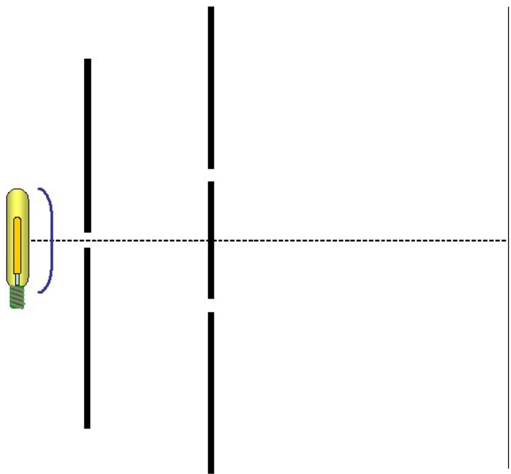

前面处理干涉问题的主要手段是求解光程差，下面我们用波前函数处理干涉，更简单明了.

回顾第二章学习内容：

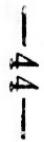

续表

<table><tr><td>波的类型</td><td>特征</td><td>相因子</td><td>图解</td></tr><tr><td>(4)发散球面波</td><td>中心在轴外坐标 (x0,y0,-z)</td><td>exp[ik(x2+y2/2z-xx0+yy0)]</td><td>(x0,y0)</td></tr></table>

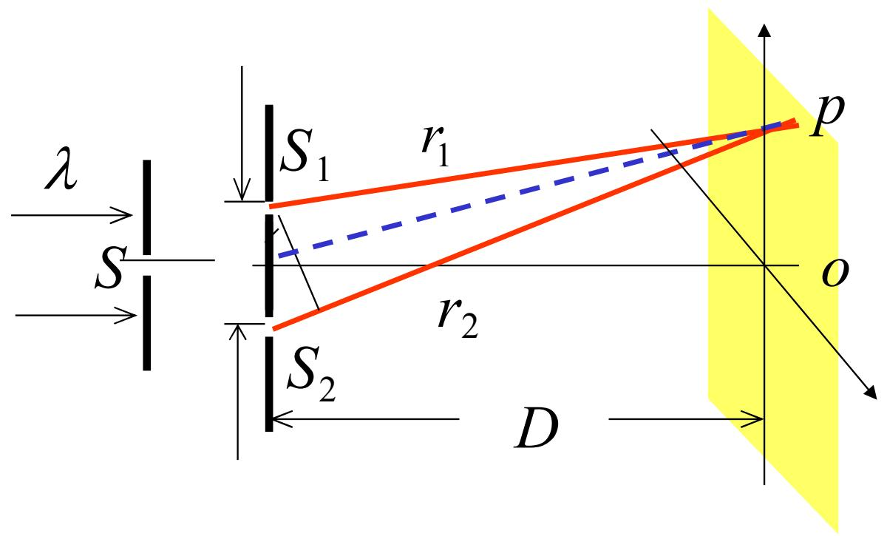

$$
\widetilde {U} _ {1 \text {或} 2} (x, y) = \frac {A _ {1 \text {或} 2}}{D} e ^ {i k \frac {x ^ {2} + y ^ {2}}{2 z _ {0}}} \cdot e ^ {- i k \frac {x x _ {0} + y y _ {0}}{z _ {0}}} = A e ^ {i k \frac {x ^ {2} + y ^ {2}}{2 z _ {0}}} \cdot e ^ {- i k \frac {x x _ {0} + y y _ {0}}{z _ {0}}}
$$

$$
\widetilde {U} _ {1}, \quad x _ {0} = \frac {d}{2}, y _ {0} = 0, z _ {0} = D \qquad \widetilde {U} _ {2}, \quad x _ {0} = - \frac {d}{2}, y _ {0} = 0, z _ {0} = D
$$

$$
\tilde {U} = \tilde {U} _ {1} + \tilde {U} _ {2}
$$

$$
\begin{array}{l} I (x, y) = (\widetilde {U} _ {1} + \widetilde {U} _ {2}) \cdot (\widetilde {U} _ {1} + \widetilde {U} _ {2}) ^ {*} \\ = \widetilde {U} _ {1} \cdot \widetilde {U} _ {1} ^ {*} + \widetilde {U} _ {2} \cdot \widetilde {U} _ {2} ^ {*} + \widetilde {U} _ {1} \cdot \widetilde {U} _ {2} ^ {*} + \widetilde {U} _ {2} \cdot \widetilde {U} _ {1} ^ {*} \\ = 2 A ^ {2} + 2 A ^ {2} \cos \left[ k \frac {d}{D} x \right] \\ = 2 I _ {0} \left[ 1 + \cos \left(\frac {2 \pi d}{\lambda D} x\right) \right] \\ \end{array}
$$

条纹间隙：

当 自 $\frac { 2 \pi d } { \lambda D } x = 2 k \pi , I ( x , y )$ $I ( x , y )$ 极大，为亮条纹，亮条 纹的位置： $x = \frac { D } { d } k \lambda$ 

当 $\delta = \frac { 2 \pi d } { \lambda D } x = ( 2 k + 1 ) \pi , I ( x , y )$ $I ( x , y )$ 极小，为暗条纹，暗条 纹的位置： $x = \frac { D } { d } ( k + \frac { 1 } { 2 } ) \lambda$ 条纹间距 $\Delta x$ 为两条相邻亮条纹或暗 条纹之间的距离，

$$
\Delta x = \frac {D}{d} \lambda
$$

例题：在杨氏干涉装置中，双孔间距 $\mathbf { d } { = } \mathbf { 0 } . 2 3 3 \mathbf { m } \mathbf { m }$ ，屏幕到小孔的距离 $\scriptstyle \mathbf { D } = \mathbf { 1 0 0 c m } ,$ ，用单色光照明，测得条纹间距 $\Delta \mathbf { x } { = } 2 . 5 3 \mathbf { m } \mathbf { m } .$ ,求单色光波长。

$$
\begin{array}{l} \Delta x = \frac {D}{d} \lambda \\ \quad \downarrow \\ \lambda = \frac {d}{D} \Delta x = \frac {0 . 0 2 3 3}{1 0 0} \times 0. 2 5 3 c m = 5. 8 9 \times 1 0 ^ {- 5} c m = 5 8 9 n m \end{array}
$$

# 杨氏干涉实验意义：

1. 利用分波前法实现普通光源照明下的光波干涉，各种分波前干涉装置均可归结成杨氏双孔干涉模式。

2. 证实了惠更斯原理中提出的次波的存在，并证明了波前上各次波源的相干性，为光波衍射理论形成了思想基础。

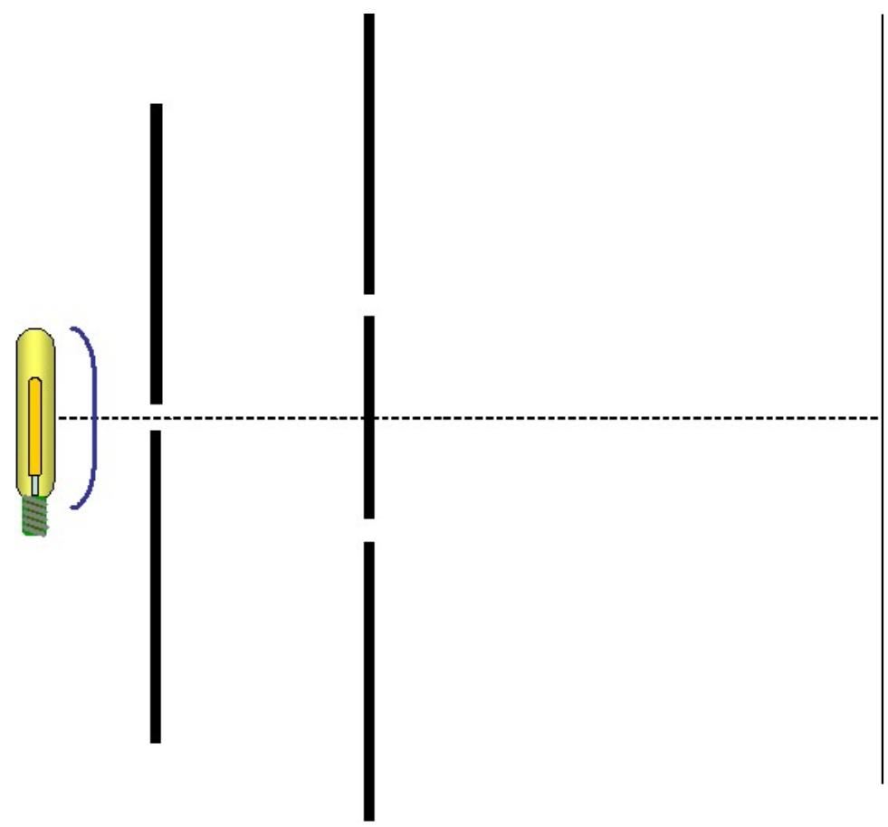

3、以杨氏双孔干涉模型为基础展开对光场的空间相干性，光学全息术等等问题的讨论。

# $\textcircled{1}$ 关于杨氏干涉的进一步说明：

1、非单一波长照明—如白光照明

$\Delta x = \frac { D } { d } \lambda$ d 波长越长，条纹间距越大，但是零级亮纹的位置相同。

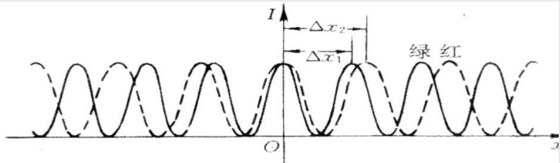

图2-5不同色光形成的干涉条纹

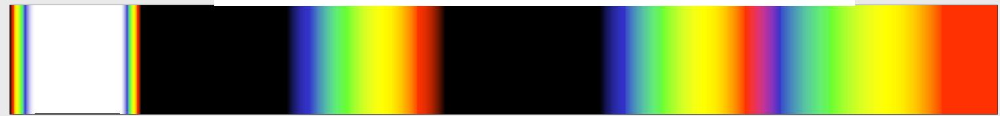

例题：蓝绿光为杨氏干涉实验的光源，波长范围 $\Delta \lambda { = } 1 0 0 \mathrm { n m }$ ，中心波长 $\lambda { = } 4 9 0 \mathrm { n m }$ ，估算第几级开始条纹变得无法辨认？

长波长： $\lambda + \frac 1 2 \Delta \lambda$ 1

短波长： $\lambda - \frac 1 2 \Delta \lambda$ 

当长波长的k级亮条纹和短波长的 $\mathrm { k } { + } 1$ 级亮条纹重合，条纹无法辨认，所以：

$$
\begin{array}{r l r} {k \Delta x _ {\text {长}}} & & {= (k + 1) \Delta x _ {\text {短}}} \\ {\Downarrow} & & {\Downarrow} \end{array}
$$

$$
k \frac {D}{d} (\lambda + \frac {1}{2} \Delta \lambda) = (k + 1) \frac {D}{d} (\lambda - \frac {1}{2} \Delta \lambda)
$$

于是： $k \Delta \lambda = \lambda - \frac { \Delta \lambda } { 2 }$ 

代入数值： $k = \frac { 4 4 0 } { 1 0 0 } = 4 . 4$ 

也就是说从第四级开始条纹变得不可分辨。

(2)讨论S孔或线光源不在对称轴上，而是横向移动一点对干涉条纹的影响。

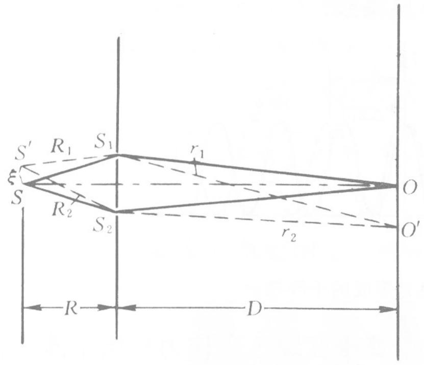

$$
r _ {1} = \sqrt {D ^ {2} + (x - \frac {1}{2} d) ^ {2}}
$$

$$
r _ {2} = \sqrt {D ^ {2} + (x + \frac {1}{2} d) ^ {2}}
$$

$$
R _ {1} = \sqrt {R ^ {2} + (\xi - \frac {1}{2} d) ^ {2}}
$$

$$
R _ {2} = \sqrt {R ^ {2} + (\xi + \frac {1}{2} d) ^ {2}}
$$

$$
\delta = \frac {2 \pi}{\lambda} \left[ (R _ {2} + r _ {2}) - (R _ {1} + r _ {1}) \right] \xrightarrow {\xi , d , x <   <   D , R} \delta \approx \frac {2 \pi}{\lambda} \left(\frac {d}{R} \xi + \frac {d}{D} x\right)
$$

# 分析：

1、零级亮纹的位置：

$$
\delta = 0 \longrightarrow \frac {d}{R} \xi + \frac {d}{D} x _ {0} = 0 \longrightarrow x _ {0} = - \frac {D}{R} \xi
$$

零级亮条纹沿的反方向移动了 D 

2、条纹间距；

$$
\frac {d}{R} \xi + \frac {d}{D} x _ {k} = k \lambda - \rightarrow x _ {k} = \frac {D}{d} k \lambda - \frac {D}{R} \xi
$$

dD x x x   k 1  k  $\Delta x = x _ { k + 1 } - x _ { k } = \frac { D } { d } \lambda$ 条纹间距不变。

3、干涉强度分布 (设 $I _ { 1 } { = } I _ { 2 } { = } I _ { 0 } )$ 

2 (1 cos ) 4 cos2I I I   对称时的强度分布： $I = 2 I _ { 0 } ( 1 + \cos \delta ) = 4 I _ { 0 } \cos ^ { 2 } ( \frac { \delta } { 2 } ) = 4 I _ { 0 } \mathrm { ~ c ~ }$ ) 4 cos ( 2 0I  D d ) x

不对称时的强度分布： $I = 4 I _ { 0 } \cos ^ { 2 } \left( \frac { \pi d } { \lambda D } ( x + \frac { D } { R } \xi ) \right)$ 

（3）光源宽度对干涉条纹的影响：

光源宽度为b，非相干，均匀。总的干涉场为各个点源的干涉场的非相干叠加。

$$
d I _ {1} (\xi) = d I _ {2} (\xi) = \frac {I _ {0}}{b} d \xi
$$

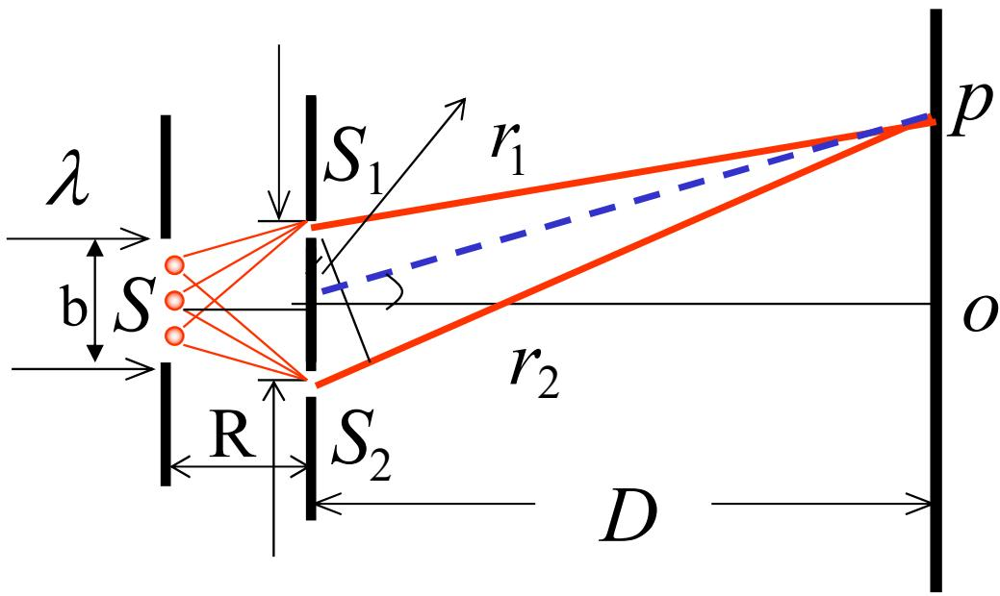

$$
d I (x) = 4 \frac {I _ {0}}{b} d \xi \cos^ {2} \left(\frac {\pi d}{\lambda D} \left(x + \frac {D}{R} \xi\right)\right)
$$

$$
\begin{array}{l} I (x) = \int_ {- \frac {b}{2}} ^ {\frac {b}{2}} d I (x) = 4 \frac {I _ {0}}{b} \int_ {- \frac {b}{2}} ^ {\frac {b}{2}} \cos^ {2} \left(\frac {\pi d}{\lambda D} \left(x + \frac {D}{R} \xi\right)\right) d \xi \\ = 2 I _ {0} \left(1 + \frac {\lambda R}{\pi d b} \sin (\frac {\pi d b}{\lambda R}) \cos (\frac {2 \pi d}{\lambda D} x)\right) \geqslant I (x) = 2 I _ {0} \left(1 + \frac {1}{u} \sin u \cdot \cos (\frac {2 \pi d}{\lambda D} x)\right) \\ \end{array}
$$

衬比度：

$$
I _ {M} = 2 I _ {0} \left(1 + \left| \frac {1}{u} \sin u \right|\right) \qquad I _ {m} = 2 I _ {0} \left(1 - \left| \frac {1}{u} \sin u \right|\right)
$$

$$
\gamma = \frac {I _ {M} - I _ {m}}{I _ {M} + I _ {m}} = \left| \frac {\sin u}{u} \right| \qquad u = \frac {\pi d b}{\lambda R}
$$

光源极限宽度：

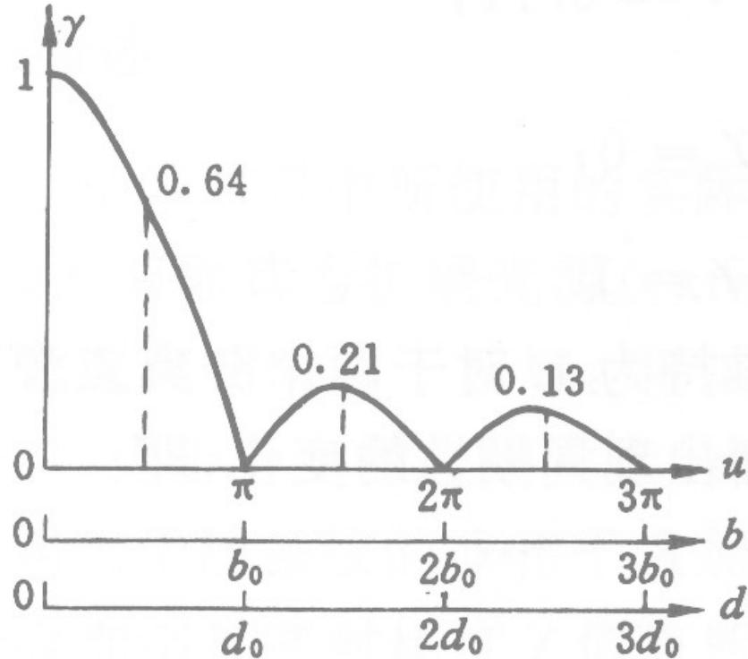

第一次衬比度降为零的光源宽度为光源的极限宽度。

$$
\frac {\pi d}{\lambda R} b _ {0} = \pi \Rightarrow b _ {0} = \lambda R \frac {1}{d}
$$

同理分析，如果b确定，能够干涉的S1和S2的距离也有个极限值。

$$
\frac {\pi b}{\lambda R} d _ {0} = \pi \Rightarrow d _ {0} = \lambda R \frac {1}{b}
$$

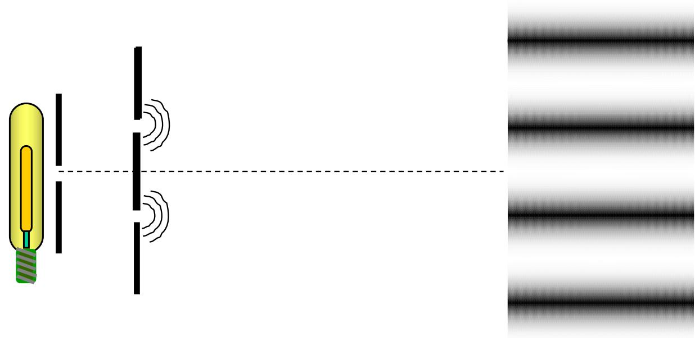

$$
\frac {\pi d}{\lambda R} b _ {0} = \pi \Rightarrow b _ {0} = \lambda R \frac {1}{d}
$$

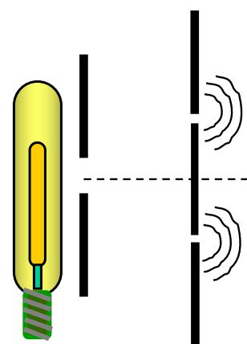

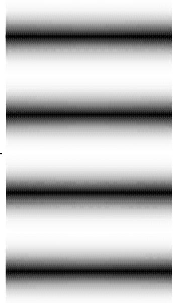

$$
\frac {\pi b}{\lambda R} d _ {0} = \pi \Rightarrow d _ {0} = \lambda R \frac {1}{b}
$$

对于光源极限宽度的直观解释：

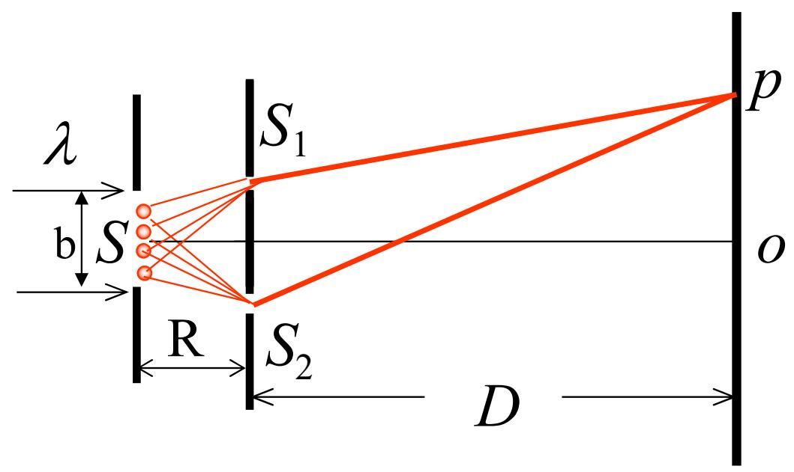

$$
I = 4 I _ {0} \cos^ {2} \left(\frac {\pi d}{\lambda D} \left(x - \frac {D}{R} \xi\right)\right)
$$

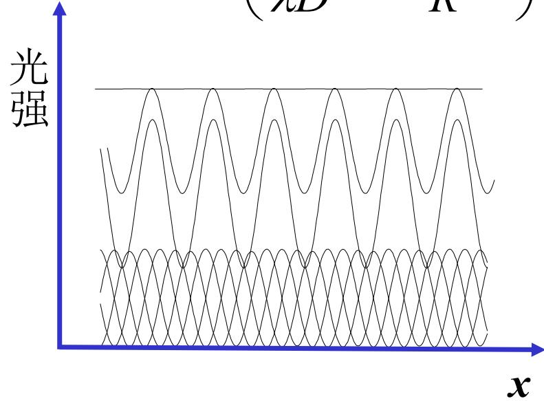

$$
b \leq \lambda R \frac {1}{d}
$$

例题1：设R=40cm，d=1mm， $ \lambda { = } 6 0 0 \mathrm { n m }$ ，求光源的极限宽度？

$$
b _ {0} = \lambda R \frac {1}{d} = \frac {4 0 0 \times 0 . 6 \times 1 0 ^ {- 3}}{1} m m = 0. 2 4 m m
$$

光源宽度b限定为1.2mm，求双孔极限间距 ${ \mathrm { d } _ { 0 } } ^ { \mathrm { ~ \tiny ~ { ~ 1 ~ } ~ } }$ ？

$$
d _ {0} = \lambda R \frac {1}{b} = \frac {4 0 0 \times 0 . 6 \times 1 0 ^ {- 3}}{1 . 2} m m = 0. 2 0 m m
$$

例题2：一杨氏干涉装置以太阳为光源，当双缝的距离增大到59m时，干涉条纹消失。光的有效波长为550nm，太阳到地球的距离 $\mathrm { R = 1 } . 5 { \times } 1 0 ^ { 8 } \mathrm { k m }$ 。求太阳对地球的视角和太阳的直径？

太阳直径： $b _ { 0 } = \lambda R \frac { 1 } { d } = \frac { 1 . 5 \times 1 0 ^ { 8 } k m \times 5 5 0 n m } { 5 9 \mu m } = 1 . .$ km4 10 6 

太阳对地球的视角： $\varphi = \frac { b _ { 0 } } { R } = 0 . 0 0 9 3 r a d$ rad b  0.0093 0  

思考题1：S1和S2狭缝的尺度对衬比度的影响：

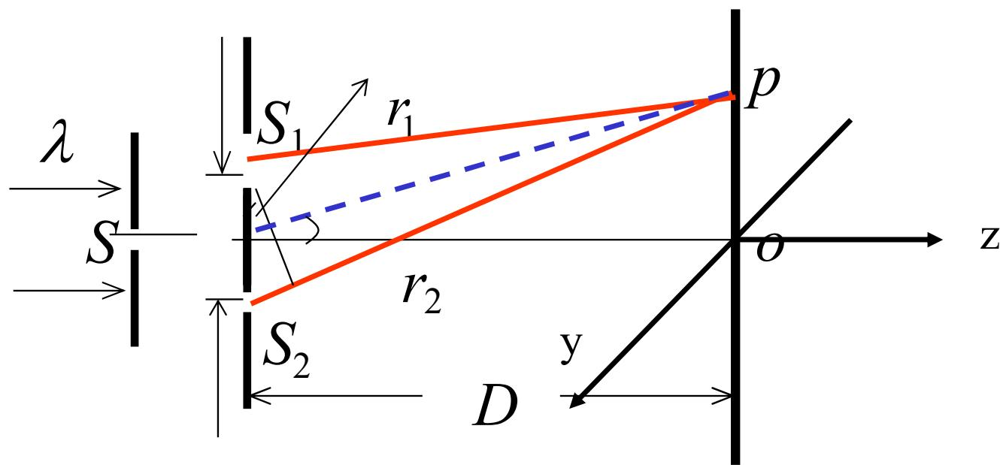

提示：

$$
I (x) = \int d I (x)
$$

$$
U (x) = \int d U (x) \quad I (x) = U (x) U (x) ^ {*}
$$

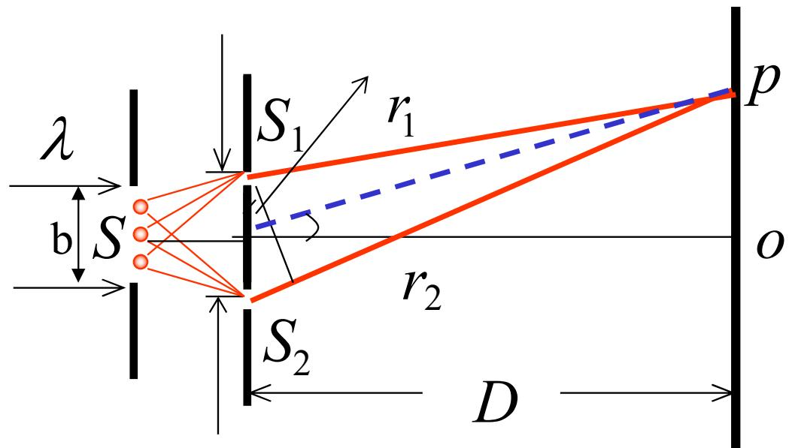

光源极限宽度：

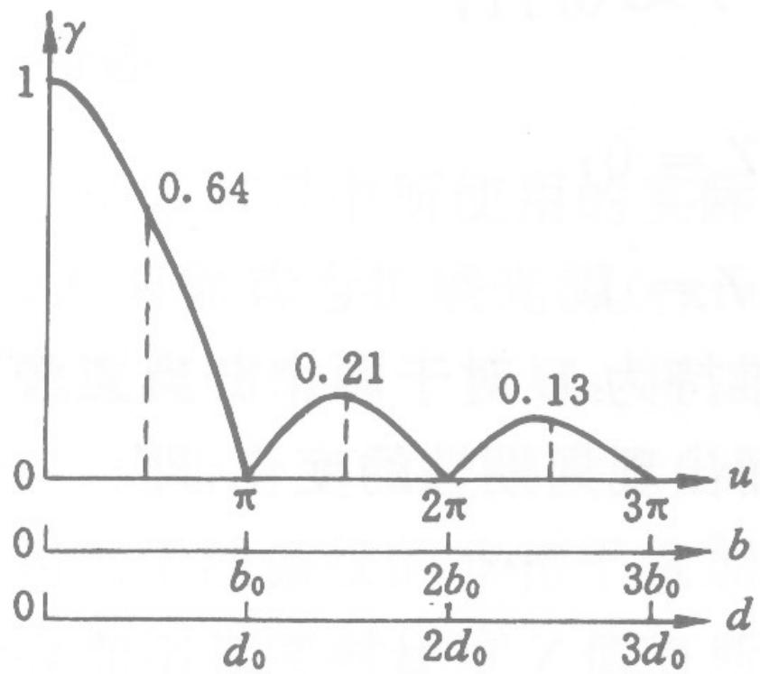

第一次衬比度降为零的光源宽度为光源的极限宽度。

$$
\frac {\pi d}{\lambda R} b _ {0} = \pi \Rightarrow b _ {0} = \lambda R \frac {1}{d}
$$

同理分析，如果b确定，能够干涉的S1和S2的距离也有个极限值。

$$
\frac {\pi b}{\lambda R} d _ {0} = \pi \Rightarrow d _ {0} = \lambda R \frac {1}{b}
$$

# 4.4 光场的空间相干性

空间相干性概念

反映空间相干性的反比律公式

相干面积 ·太阳光在地球上的相干面积

迈克耳孙的星体干涉仪

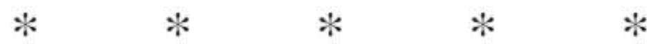

空间相干性概念

问题的提出

考察 照明空间中 横向两个点—两个次波源 (S.S2)相关性.

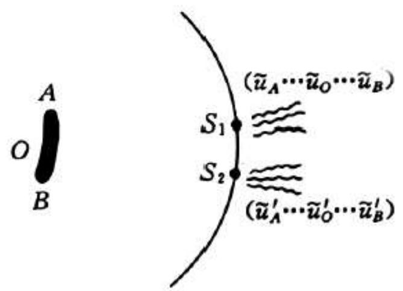

图4.10扩展光源照明下两点源光扰动的内部构成

$S _ { I }$ 点的总扰动

$$
\begin{array}{l} \widetilde {\mathbf {U}} _ {I} (t) = \left(u _ {A} + \dots + u _ {O} + \dots u _ {B}\right) \\ = \sum u _ {i} (t) ; \\ \end{array}
$$

$S _ { 2 }$ 点的总扰动

$$
\begin{array}{l} \widetilde {\mathbf {U}} _ {2} (t) = \left(u _ {A} ^ {\prime} + \dots + u _ {O} ^ {\prime} + \dots u _ {B} ^ {\prime}\right) \\ = \sum u _ {i} ^ {\prime} (t). \\ \end{array}
$$

可见，其中含

完全相干成份，u与u，uo与.完全非相干成份，u与u，u’…

▲总效果，既非完全相干，又非完全不相干，而是“部分相干”，虽然光源是完全非相干光源，

(S、S2) 相干程度一值

即 作双孔干涉实验，

由观察屏上光强分布的衬比度γ值，作为(S、S）相干度的一种度量.

·反映光场空间相干性的反比律公式

直接利用上节结果：

当光源线度 $b$ 给定，

则双孔的极限宽度 $d _ { 0 } = \frac { R \lambda } { b } ,$ 

即R

引入角量 △=d， ，极限角范围，R

或相干孔径角.

b·△0=> 

▲其意义是 (1)实际双孔对光源中心的张角

则y~0；

△0<△0，则γ>0，部分相干.

(2)光源线度b， 则△0↑

(3)由反比律而规划了一个角范围.

若（S,S2）处于△0之外，则γ≈0，它俩几手不相干；

若（S,S2）处于△0之内，则γ>0,它俩部分相干；

若（S,S）处于△0内部越深，则γ值越高，相干性越好.

几何图像

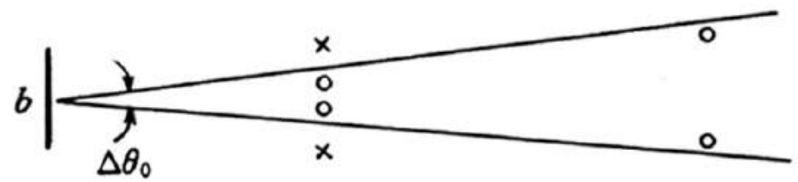

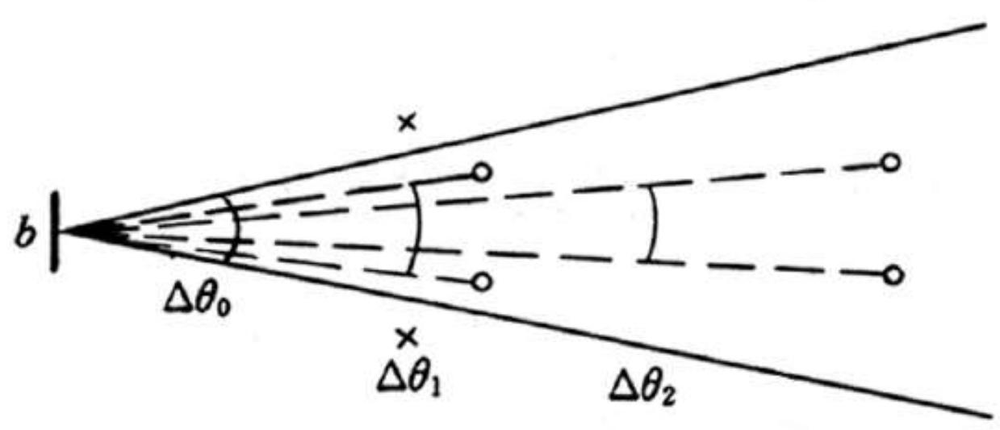

图4.12空间相干性反比公式的几何图像

双孔张角：△0<△0<△0，

部分相干度：γ>γ1>0.

$$
\gamma = \frac {I _ {M} - I _ {m}}{I _ {M} + I _ {m}} = \left| \frac {\sin u}{u} \right|, \text {其 中} u = \pi \frac {d b}{\lambda R}
$$

  改写： b Rd u , 0     d b       ，u 所以：

$$
\gamma \left(\frac {\Delta \theta}{\Delta \theta_ {0}}\right) = \left| \begin{array}{c} \sin \pi \frac {\Delta \theta}{\Delta \theta_ {0}} \\ \hline \pi \frac {\Delta \theta}{\Delta \theta_ {0}} \end{array} \right|
$$

相干面积

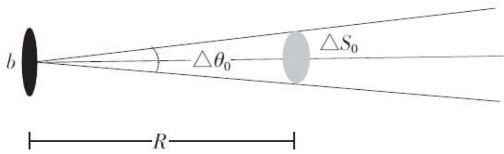

图4.13面光源照明空间中的相干面积△So

$\boxed { \dag } \ b \cdot \Delta \theta _ { o } \approx \lambda , \quad \acute { \lambda } _ { \mp } ^ { \boxplus } \ \triangle \theta _ { o } \approx \frac { \lambda } { b } \ ;$ 

距离 $R$ 远近的面积(圆锥底面)

$$
\begin{array}{l} \Delta S _ {0} \approx \frac {\pi}{4} (R \cdot \triangle \theta_ {0}) ^ {2} \\ \approx (\frac {R \lambda}{b}) ^ {2} \text {, 相 干 面 积}. \\ \end{array}
$$

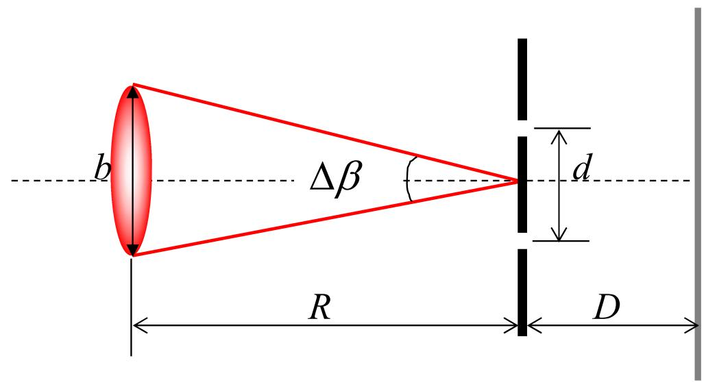

$$
d = \lambda R \frac {1}{b _ {0}} \xrightarrow {\text {改 写}} d \cdot \frac {b _ {0}}{R} = \lambda
$$

光源对双孔中心所张开的孔径角 $\Delta \beta ~ \approx ~ { \frac { b _ { _ 0 } } { R } } .$ 0 ，所以上式改写为：

$$
d \mathbf {\nabla} \cdot \Delta \boldsymbol {\beta} \approx \lambda
$$

0， 0，部分相干。  给定时，当0， 0，非相干。   

·太阳，圆盘光源， 作双孔干涉实验.

求最大间距 $d _ { o }$ (在地球上)？

已知,太阳对地面上观测者所张角度

$$
\triangle \theta_ {0} ^ {\prime} \approx 3 0 ^ {\prime} \approx 1 0 ^ {- 2} r a d,
$$

由d△0=，有

$$
d _ {0} \approx \frac {\lambda}{\triangle \theta_ {0} ^ {\prime}} = \frac {0 . 5 5 \mu m}{1 0 ^ {- 2}} = 5 5 \mu m,
$$

这表明，若开孔间距d～30μm (一根发丝粗细).作干涉实验，可以获得γ～0.5的干涉条纹.相应的相干面积

$$
\triangle S _ {0} \approx d _ {0} ^ {2} \approx 3 \times 1 0 ^ {- 3} m m ^ {2}.
$$

·迈克耳孙的星体干涉仪

利用值的变化(下降)，可以精测遥远星体的角径

化“消极”为积极。

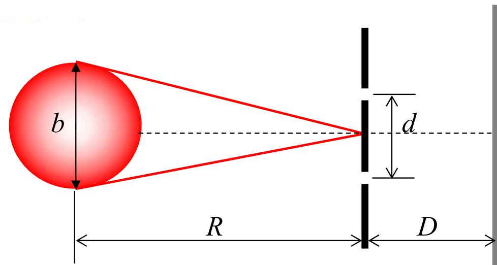

测量出干涉条纹消失时的d，就计算出了光源的孔径角 $\Delta \beta$ 。

问题：一般星体的孔径角非常小，比如猎户座“参宿四”的角径210-7rad，d=3.07m时杨氏干涉条纹才消失。d如此大,导致干涉条纹太密集，远远超过了人眼和仪器的空间分辨本领，这时对衬比度变化的检测早已失效，那么，如何解决星体视角的测量精度和条纹间距之间的矛盾？ --迈克耳孙星体干涉仪

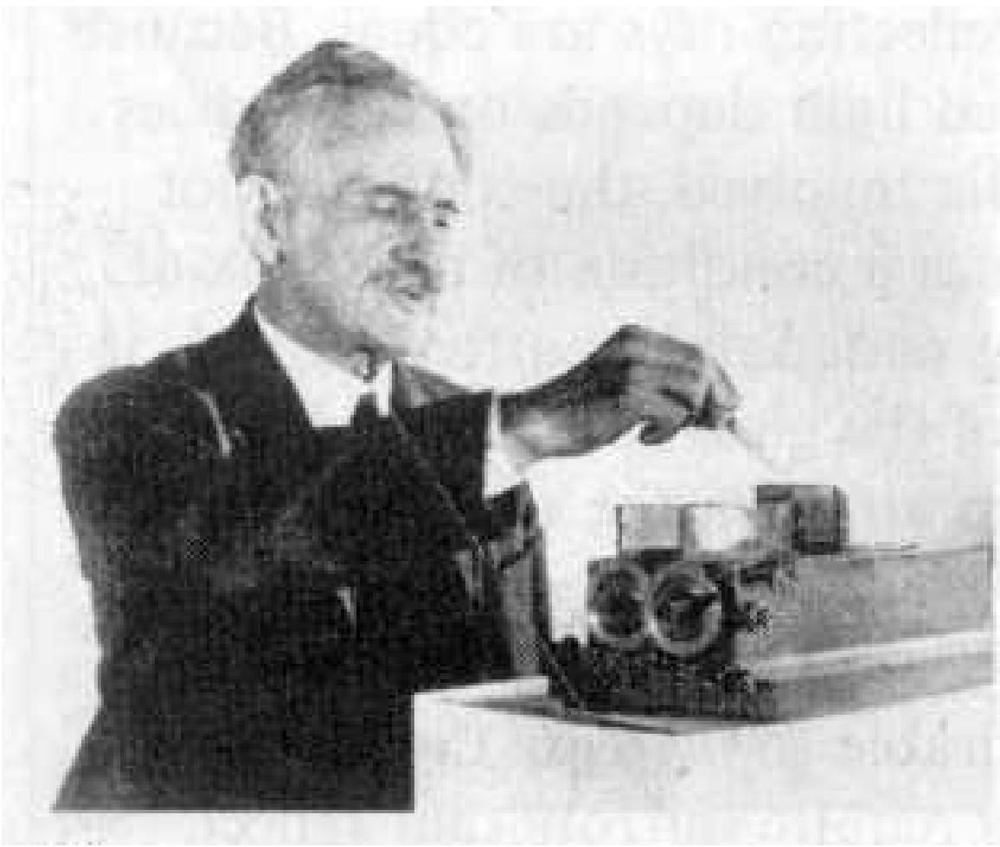

迈克耳孙（A.A.Michelson）美籍德国人，因创造精密光学仪器，用以进行光谱学和度量学的研究，并精确测出光速，获1907年诺贝尔物理奖，迈克耳孙干涉仪至今仍是许多光学仪器的核心。爱因斯坦： “我总认为迈克耳孙是科学中的艺术家，他的最大乐趣似乎来自实验本身的优美和所使用方法的精湛，他从来不认为自己在科学上是个严格的‘专家’，事实上的确不是，但始终是个艺术家。 ”

遥A0体 B

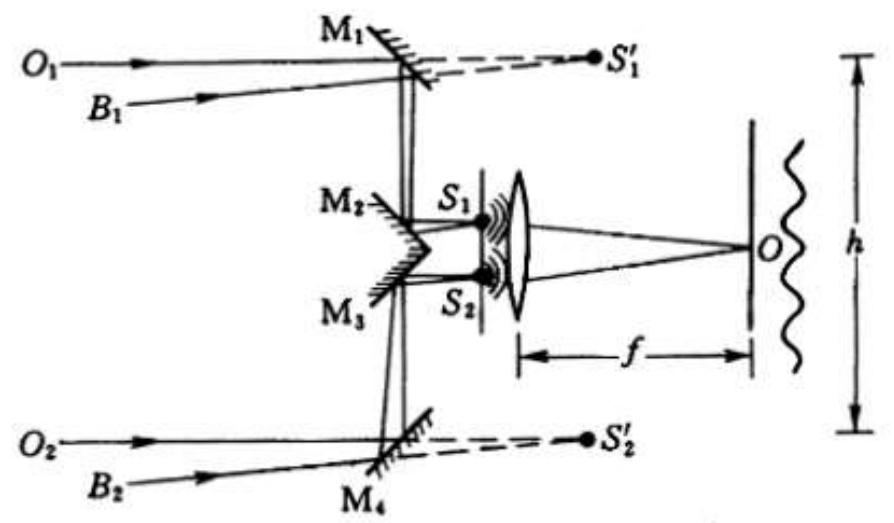

（a）结构与光路

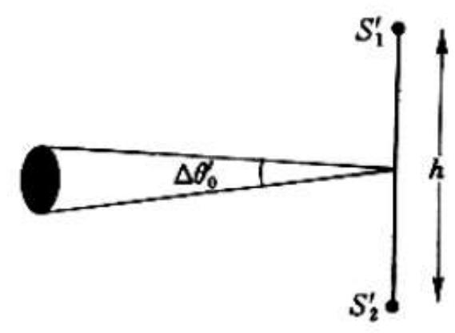

$\mathrm { ( b ) }$

图4.15迈克耳孙星体干涉仪

*评论

(1)它巧妙地解决了测角高精度与条纹宽间距之间的

$\sharp \overrightarrow { \triangleright } \_ d - \  \ \triangle x = \frac { \mathscr { A } } { d } , d { \sim } m m ;$ 

$\mathbb { K } \mathbb { \ Z } \mathbb { K } \mathbb { Z } \mathbb { E } \quad h  \triangle \theta ^ { \prime } \approx \frac { \lambda } { h _ { 0 } } \ , \quad h _ { 0 } \sim 1 0 ^ { 3 }$ mm. ho 

(2)在光源与双孔位置不变的条件下.它通过镜面的移动与改变场点(S,S)的相关程度，并予以探测.史无前例，这使它成为现代光学相关实验的先导，虽然这里涉及的是相位型干涉仪中的空间相干性概念；那里涉及的是强度干涉仪.

• 其他双缝型干涉装置

1. 菲涅耳双面镜

S：实光源，S1、S2：虚

M1、M2： 平面反射镜

两虚光源为相干光源，

阴影部分出现干涉

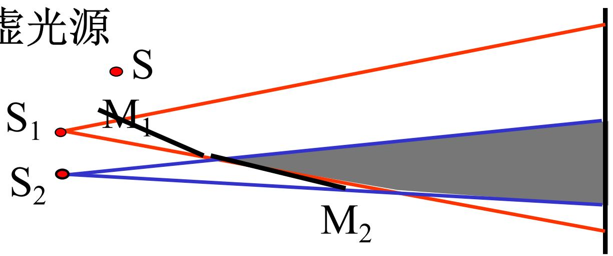

2.菲涅耳双棱镜

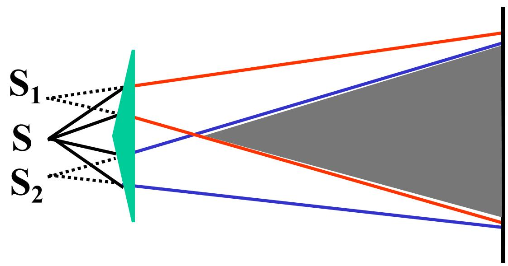

# 3、 洛埃德镜实验

S1：实光源，S2：虚光源

MN： 平面反射镜

阴影部分出现干涉

反射光存在半波损失。

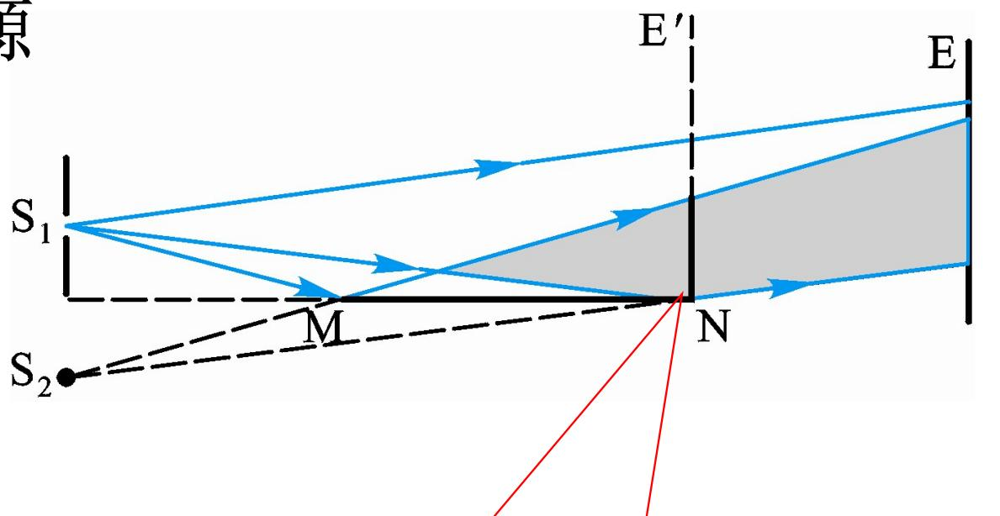

接触点: 暗条纹

$$
\delta = r _ {2} - r _ {1} + \frac {\lambda}{2} = d \sin \theta + \frac {\lambda}{2}
$$

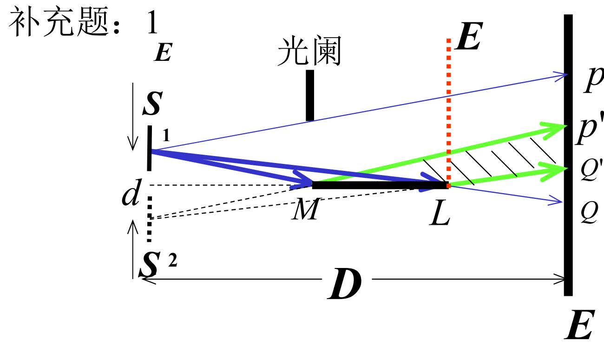

试分析光源宽度对洛埃德镜实验的干涉条纹分布的影响。

补充题：

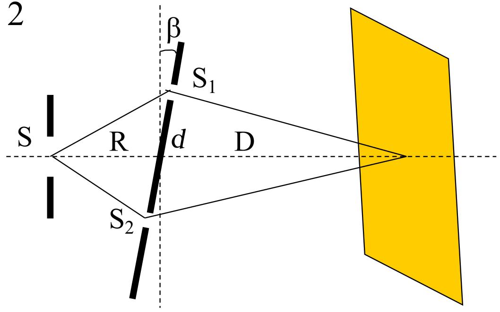

杨氏双缝干涉实验，衍射屏 $\mathrm { S } _ { 1 }$ ， $\mathrm { S } _ { 2 }$ 如果发生倾斜，倾斜角为，如上图：

1、求干涉条纹的变化

2、如果照明光源S为扩展光源，宽度为b，求可以获得干涉条纹的S1、 $\mathrm { S } _ { 2 }$ 最大的距离 $d _ { 0 } ?$ 

# 4.6 分振幅干涉

让一束光投射到由透明板制成的分束器，光能流一部分反射，一部分透射，在通过反射镜等一类光学器件，让两束光发生交叠。

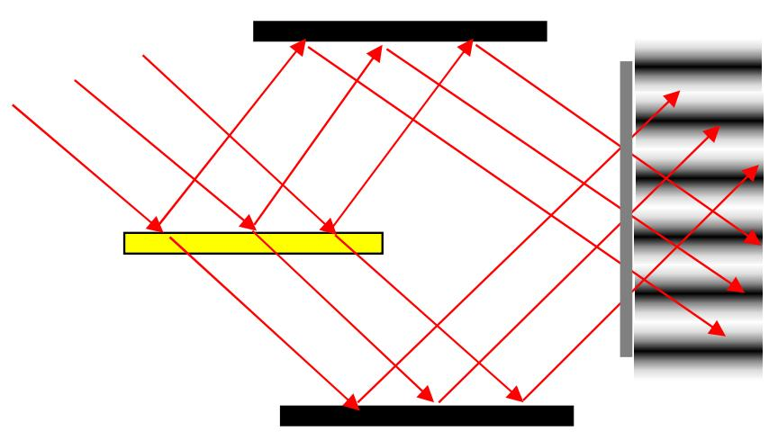

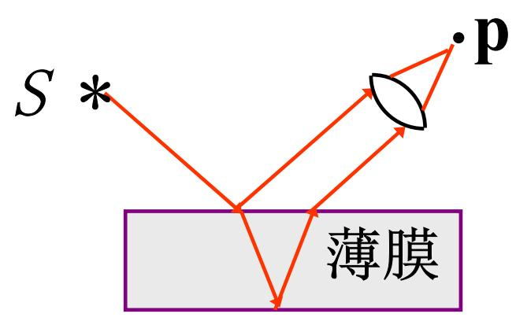

1、两平行光干涉

2、薄膜干涉的一般问题

3、等倾干涉

4、 等厚干涉

# 1、薄膜干涉的一般问题

薄膜干涉现象在日常生活中常能见到，如：肥皂泡上的彩色、雨天地上油膜的彩色、昆虫翅膀的彩色…

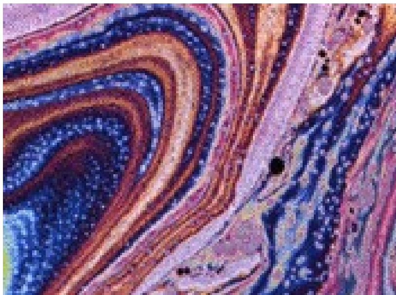

*干涉条纹的定域和非定域问题 *薄膜干涉的光程差公式

# *干涉条纹的定域和非定域问题

# 1、点光源照明

结论：点光源照明的薄膜干涉是非定域干涉。

解释：

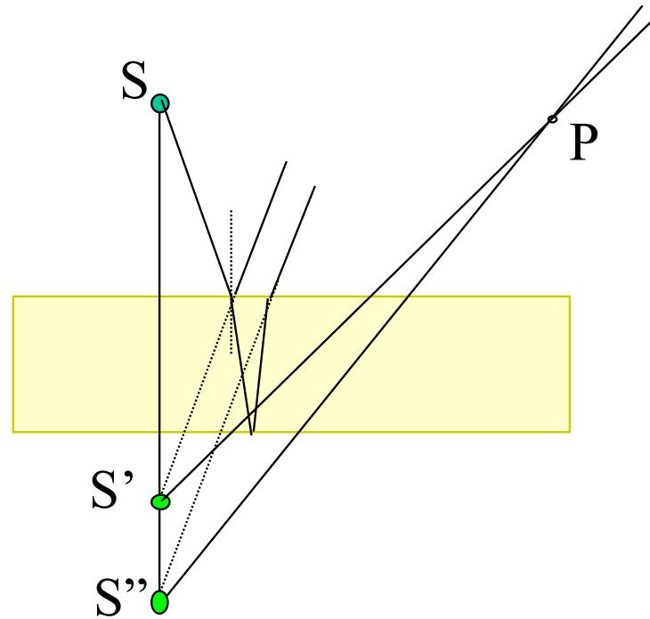

薄膜的两个界面相当于两个反射镜，两束相干光相当于来自S的两个反射镜的虚像点，于是点光源照明的薄膜干涉可以归结成两相干点光源的干涉，两相干点光源的干涉是非定域干涉。

# 2、扩展光源照明干涉是定域的

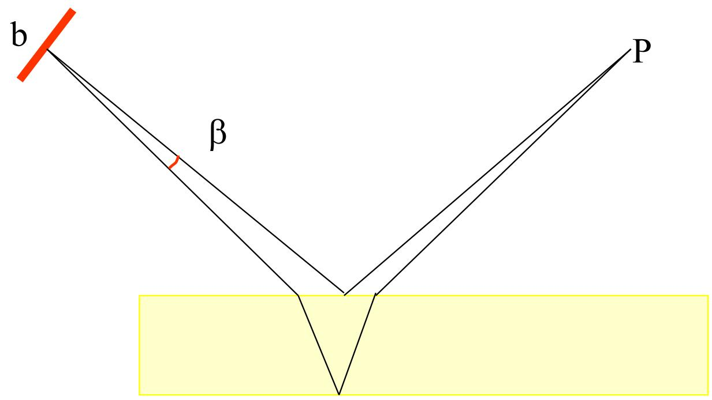

空间相干性：

$$
b \cdot \beta <   \lambda \qquad \text {即} \qquad \beta <   \frac {\lambda}{b}
$$

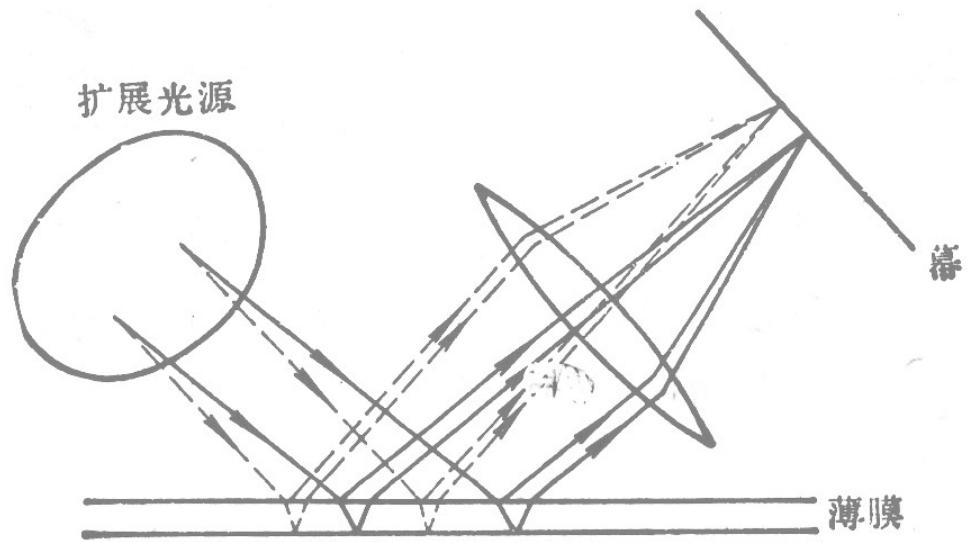

图3-26等倾干涉的产生和观察

用扩展光源照明平行平面薄膜时，只有在无穷远处才能观察到最清晰的干涉条纹。幕上同一条干涉条纹，是由同一倾角的入射光形成的，故此称此干涉条纹为等倾条纹。

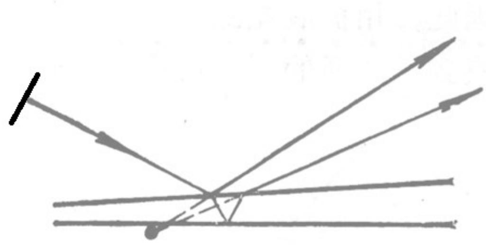

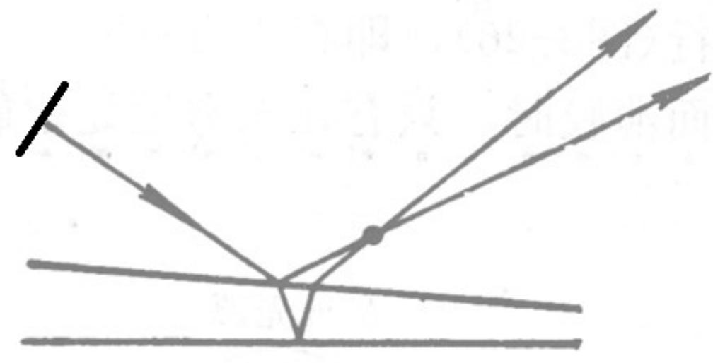

图3-27两相于光相交于楔形薄膜附近

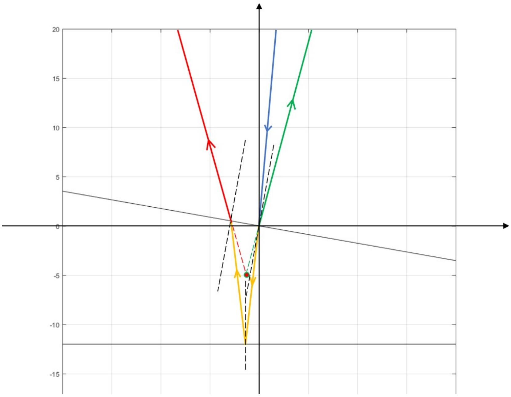

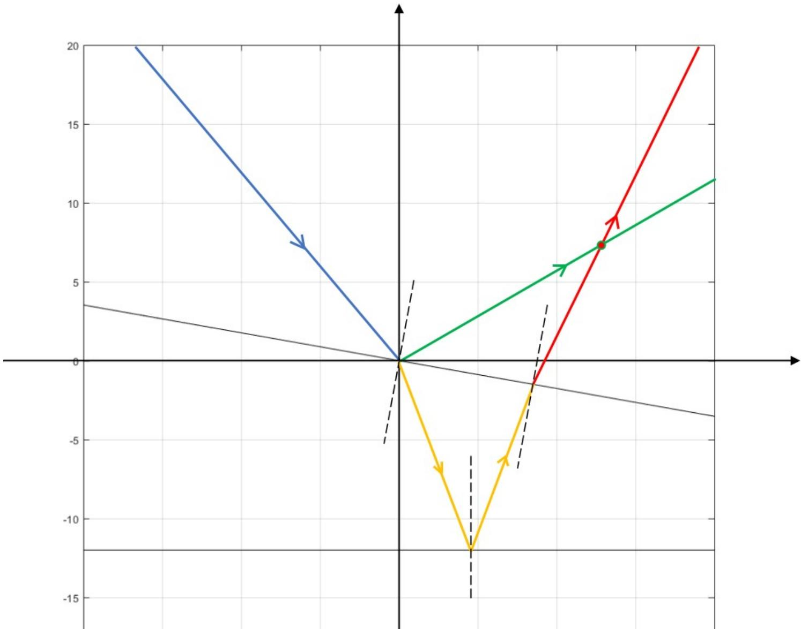

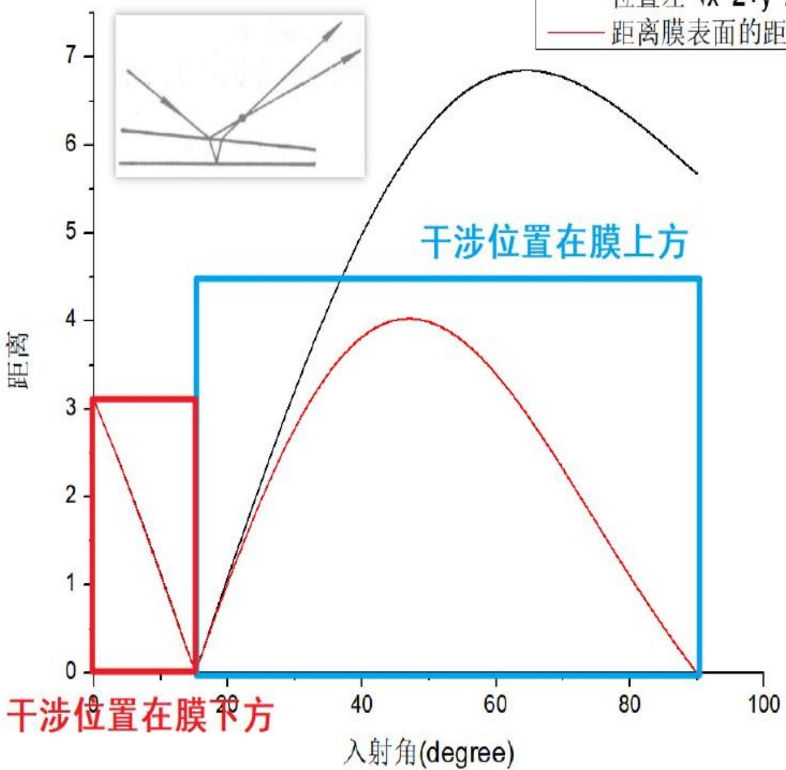

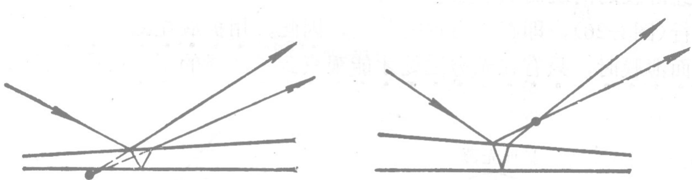

图3-27两相干光相交于楔形薄膜附近

干涉条纹定域在薄膜附近。若入射光为平行光或准平光，则入射角或折射角为一常数，光程差决定于薄膜的厚度，在薄膜厚度相等的地方具有相等的光程差，因而具有相同的干涉强度。干涉条纹和薄膜的等厚线一致，故称这种干涉条纹为等厚条纹。

*薄膜干

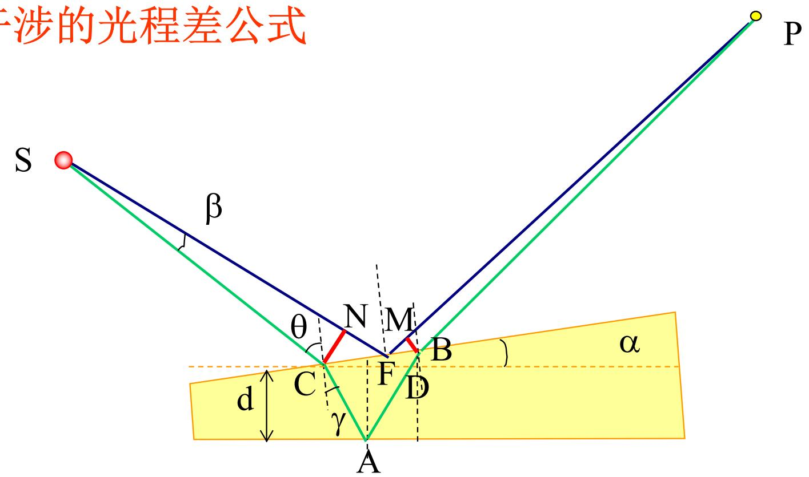

$$
\Delta = n \left(\overline {{A C}} + \overline {{A B}}\right) - \left(\overline {{F N}} + \overline {{F M}}\right)
$$

$$
\left(\overline {{F N}} + \overline {{F M}}\right) = \overline {{F C}} \cdot \sin (\theta + \beta) + \overline {{F B}} \cdot \sin (\theta + \beta) = \overline {{C B}} \cdot \sin (\theta + \beta)
$$

$$
\left(\overline {{A C}} + \overline {{A B}}\right) = \overline {{A C}} + \overline {{A D}} + \overline {{D B}} = 2 \frac {d}{\cos (\gamma + \alpha)} + \frac {\overline {{C B}} \sin \alpha}{\cos (\gamma + \alpha)}
$$

$$
\overline {{C B}} = 2 d \tan (\alpha + \gamma) (\cos \alpha + \sin \alpha \tan (2 \alpha + \gamma))
$$

$$
\Delta = 2 n \frac {d}{\cos (\gamma + \alpha)} + 2 d \tan (\alpha + \gamma) (\cos \alpha + \sin \alpha \tan (2 \alpha + \gamma)) \left[ \frac {n \sin \alpha}{\cos (\gamma + \alpha)} - \sin (\beta + \theta) \right]
$$

和一般非常小，近似0，所以上式可以近似简化为：

$$
\Delta \approx \frac {2 n d}{\cos \gamma} \left(1 - \frac {1}{n} \sin \gamma \sin \theta\right) = 2 n d \cos \gamma
$$

光在上下表面的反射情况不同，上表面是由光疏介质到光密介质，而下表面是由光密介质到光疏介质，实验和理论表明，光在这样的两个界面反射是，两反射光束存在半波损失，也就是存在的附加相位差。

$$
\Delta = 2 n d \cos \gamma + \frac {\lambda}{2}
$$

光疏介质和光密介质？

# 反射光的相位突变问题

半波损失：在反射点，入射光和反射光的线偏振态恰巧相反，也就是说相位相差，称之为半波损失。

# 结论：

1. 正入射时。 $\mathbf { n } _ { 1 } { \mathrm { < n } _ { 2 } } .$ ,界面反射有相位突变，有半波损失；$\mathbf { n } _ { 1 } { \ > } \mathbf { n } _ { 2 } .$ ,界面反射没有相位突变，即没有半波损失。

2. 掠射时。无论 $\mathbf { n } _ { 1 } { \mathrm { > n } } _ { 2 }$ 还是 $\mathbf { n } _ { 1 } { \mathrm { < n } _ { 2 } }$ ，界面反射均有半波损失。

3. 斜入射时；如下图，我们关心的薄膜上下界面反射的两光束1和2之间的相位差。

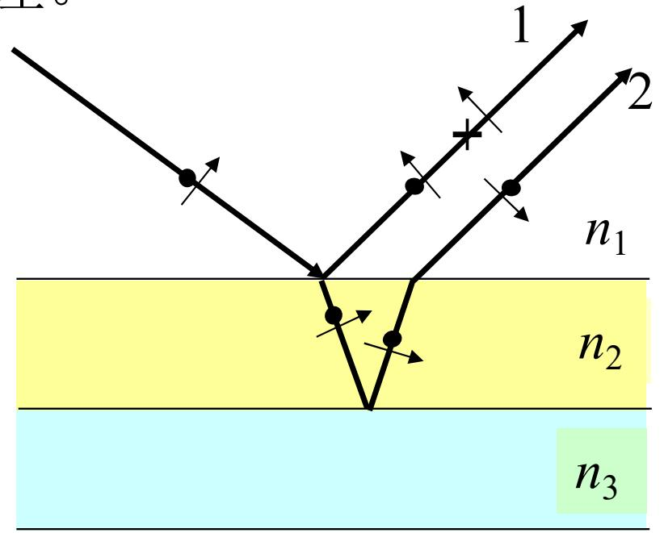

结论（限于入射角小于布儒斯特角）

i. 当 $\mathrm { n } _ { 1 } { > } \mathrm { n } _ { 2 } { < } \mathrm { n } _ { 3 }$ 或 $\mathrm { n } _ { 1 } { < } \mathrm { n } _ { 2 } { > } \mathrm { n } _ { 3 }$ ，要计相位突变，即实际光程差为：

$$
\Delta L _ {1 2} = \Delta L _ {0} \pm \frac {\lambda}{2}
$$

ii. 当 $\mathrm { n } _ { 1 } { > } \mathrm { n } _ { 2 } { > } \mathrm { n } _ { 3 }$ 或n1<n2<n3，没有相位突变，实际光程差为：

$$
\Delta L _ {1 2} = \Delta L _ {0}
$$

# 等倾干涉

1、等倾干涉的观察方法：

薄膜的折射率和厚度都是均匀的，所以光程差仅随着入射角（或折射角）而变化，也就是干涉条纹的明暗确定于入射角。

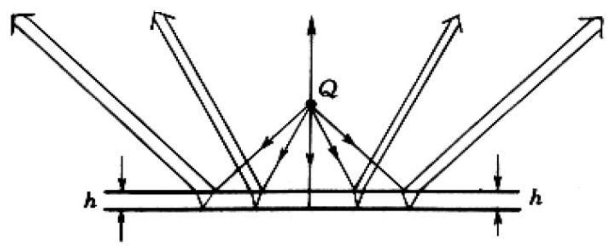

$$
\Delta = \begin{array}{c} 2 n d \\ \hline \\ \text {恒 定 不 变} \end{array} \cos \gamma + \frac {\lambda}{2}
$$

同一条干涉条纹对应着同一个倾角。

# 等倾干涉试验装置图：

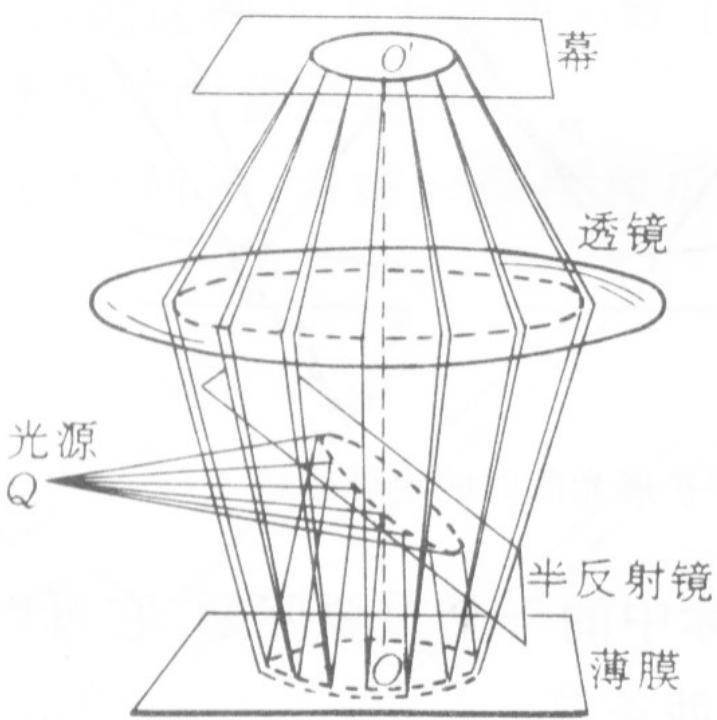

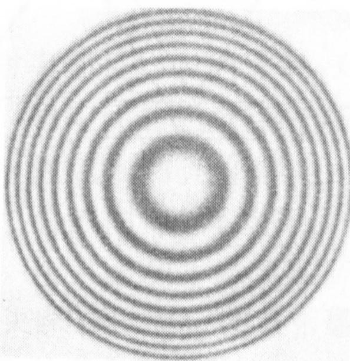

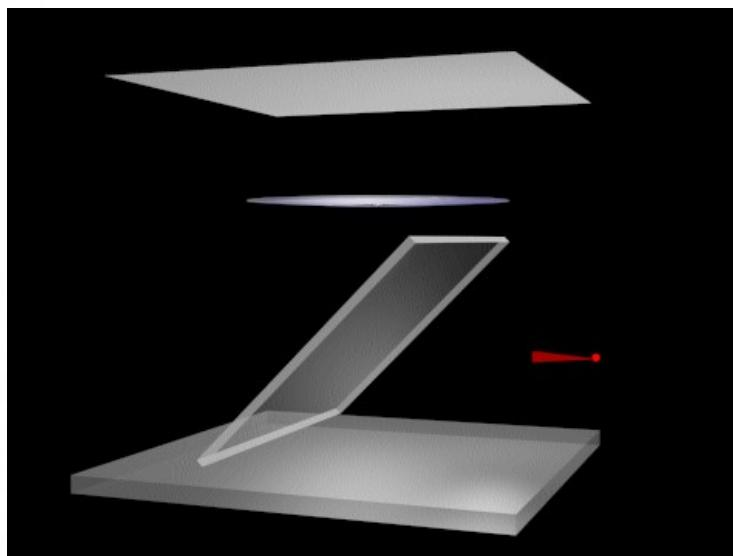

# 2、等倾干涉条纹的特征：

光程差

$$
\begin{array}{l} \Delta = n (\overline {{A B}} + \overline {{B C}}) - n ^ {\prime} \overline {{A D}} + \frac {\lambda}{2} \\ \overline {{A B}} = \overline {{B C}} = \frac {a}{\cos r} \\ \end{array}
$$

$$
\begin{array}{l} \overline {{A D}} = \overline {{A C}} \cdot \sin i \\ = 2 d \cdot \operatorname {t g} r \cdot \sin i \\ \end{array}
$$

$$
\therefore \Delta = \frac {2 n d}{\cos r} - \frac {2 n ^ {\prime} e \cdot \sin r \cdot \sin i}{\cos r} + \frac {\lambda}{2}
$$

因为 n  sin i  n sin r 得

$$
\Delta = 2 n d \cos \gamma + \frac {\lambda}{2}
$$

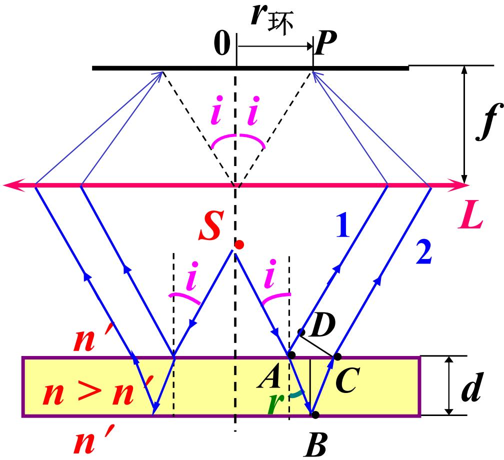

膜厚d均匀不变

$$
\Delta = 2 n \frac {d}{\cos (\gamma + \alpha)} + 2 d \tan (\alpha + \gamma) \bigl (\cos \alpha + \sin \alpha \tan (2 \alpha + \gamma) \bigr) \biggl [ \frac {n \sin \alpha}{\cos (\gamma + \alpha)} - \sin (\beta + \theta) \biggr ] + \frac {\lambda}{2}
$$

等倾干涉， $\alpha = \beta = 0 , \therefore \Delta = 2 n d \cos \gamma + \frac { \lambda } { 2 }$ $\alpha = \beta = 0 ;$ 2

# 干涉条纹的形状

入射角相同的光在膜内的折射角相同，根据光程差公式，光程差相等，所以入射角相等的光形成的干涉情况相同，应该处于同一个干涉条纹上，焦面上的干涉条纹为一系列的同心圆。

亮条纹满足：

$$
\Delta = 2 n d \cos \gamma + \frac {\lambda}{2} = k \lambda
$$

暗条纹满足：

$$
\Delta = 2 n d \cos \gamma + \frac {\lambda}{2} = (k + \frac {1}{2}) \lambda
$$

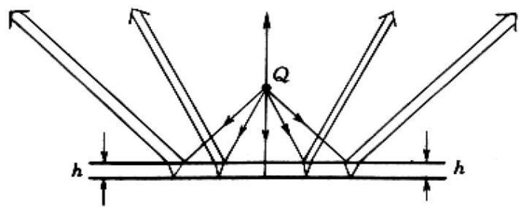

膜的厚度 $d$ 一定时，越靠近中心处，i 越小，γ越小，光程差越大，条纹级次越高。

干涉条纹的间距： 相邻条纹的光程差为

$$
\delta \Delta = - 2 n d \sin \gamma \cdot \delta \gamma = \lambda
$$

$$
\delta \gamma = \gamma_ {k + 1} - \gamma_ {k} = - \frac {\lambda}{2 n d \sin \gamma}
$$

$$
R = f \tan i
$$

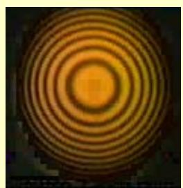

同心等倾干涉条纹，中心的干涉条纹较疏，外沿较密。

薄膜厚度变化时，干涉条纹变化规律

$$
\Delta = 2 n d \cos \gamma + \frac {\lambda}{2}
$$

$$
\delta \gamma = \gamma_ {k + 1} - \gamma_ {k} = - \frac {\pi}{2 n d \sin \gamma},
$$

$$
R = f \tan i
$$

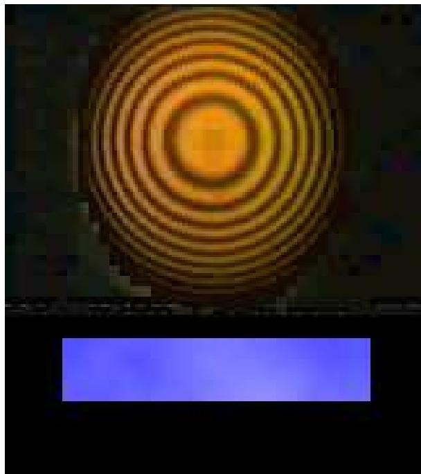

膜的厚度 $d$ 增大时，条纹外冒，中心处明暗交替。

膜的厚度 $\hat { \cal H } )$ 减小时，条纹内缩，中心处明暗交替。

# 面光源照明时，干涉条纹的分析

从面光源上不同点发出的光，只要入射角 i 相同，它们在厚度均匀的膜上下表面反射的光经透镜都将汇聚在同一个干涉环上，只是光源上不同点发出的光彼此非相干叠加。只要 i 相同，都将汇聚在同一个干涉环上，因而明暗对比更鲜明。

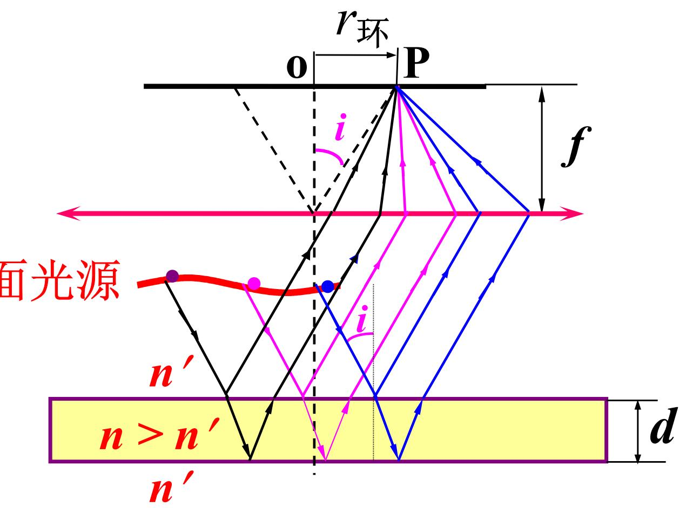

# 利用波前函数法讨论等倾干涉

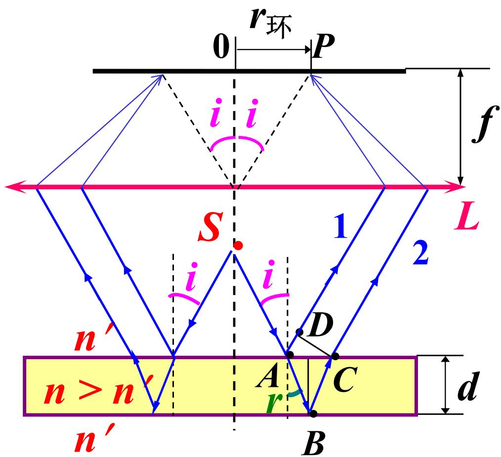

膜厚d均匀不变

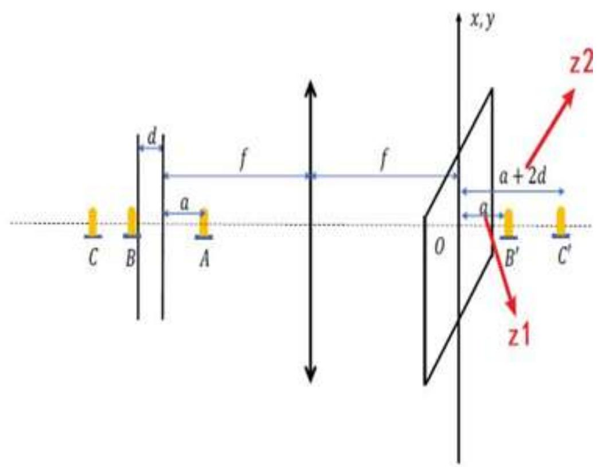

# 等厚干涉

光的等厚干涉在科学研究和工业生产上有着广泛的应用，可用于光波波长的测定、精密测长、光学元件及精密加工机械表面光洁度的判断等方面。

# 楔形等厚干涉

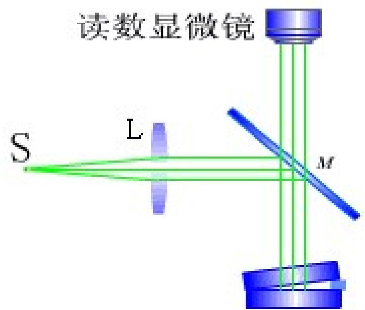

光程差： $\Delta = 2 n d \cos \gamma + \frac { \lambda } { 2 }$ 

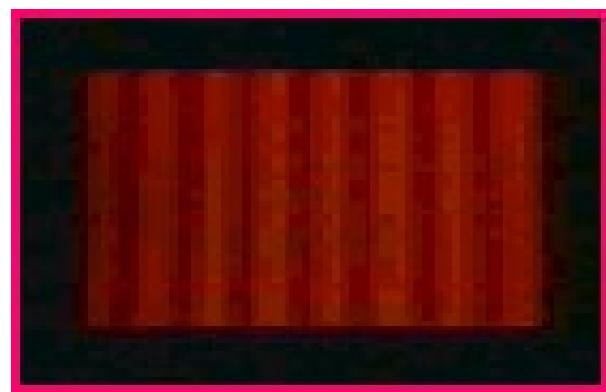

通常使用单色光垂直照 射薄膜，入射角 $i \approx 0 .$ ，折射角 $\gamma \approx 0$ ，所以：

$$
\Delta = 2 n d + \frac {\lambda}{2}
$$

# 1、等厚干涉条纹的特征

# *干涉条纹的形状：

薄膜厚度相同处，光程差相同，对应同一条干涉条纹。这种干涉称等厚

干涉。 $\Delta = 2 n d + \frac { \lambda } { 2 }$ 

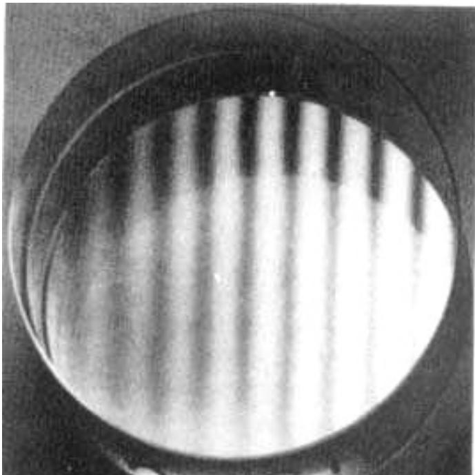

劈尖

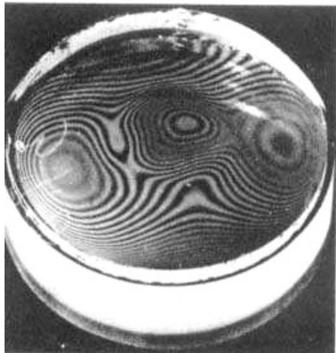

不规则表面

# *条纹级次分布和相邻亮条纹（或暗条纹）之间的厚度差

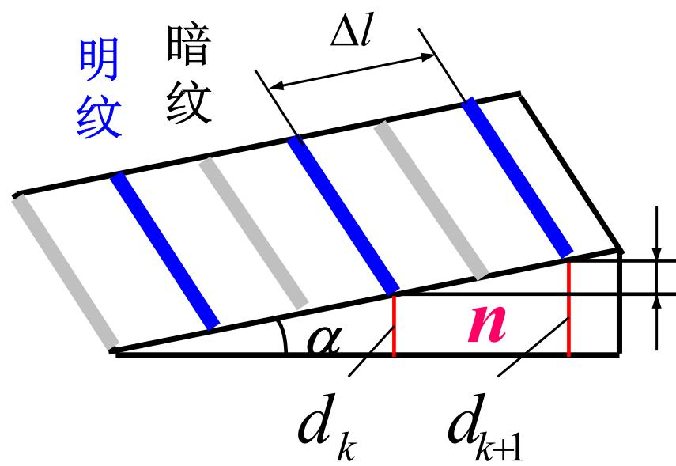

$$
\Delta = 2 n d + \frac {\lambda}{2} = k \lambda \qquad \mathrm {亮 条 纹}
$$

$$
- \Delta d \approx L \Delta = 2 n d + \frac {\lambda}{2} = (k + \frac {1}{2}) \lambda , \text {暗 条 纹}
$$

厚度差： $\Delta d = d _ { k + 1 } - d _ { k } = \frac { \lambda } { 2 n }$ 

d l     条纹间距： $\Delta l = \frac { \Delta d } { \alpha } = \frac { \lambda } { 2 n \alpha }$ 

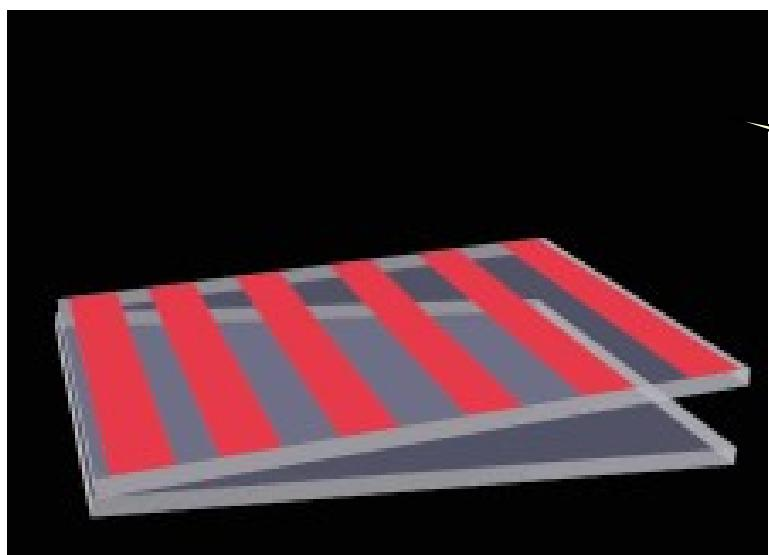

劈角越小，干涉条纹越稀疏，劈角越大，干涉条纹越密集。

# 干涉条纹的平移

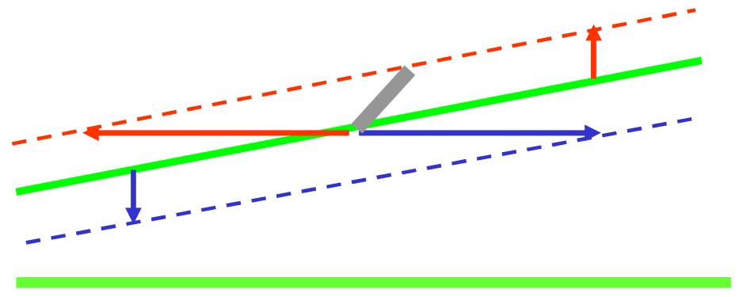

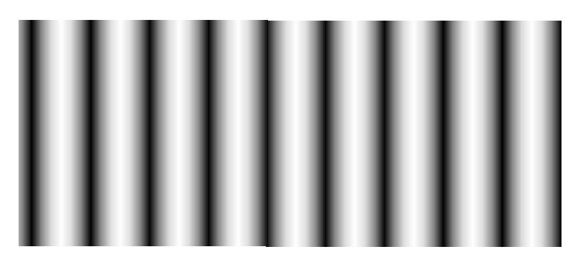

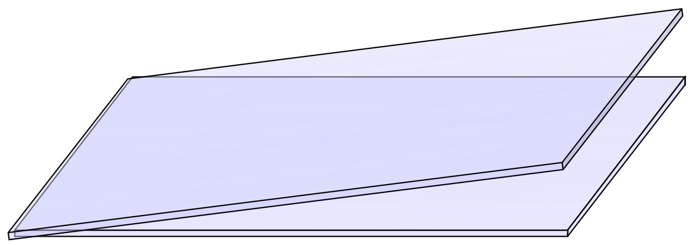

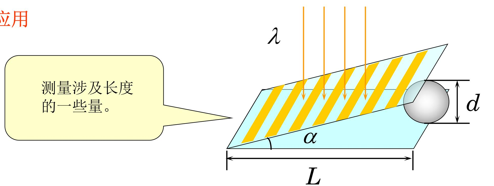

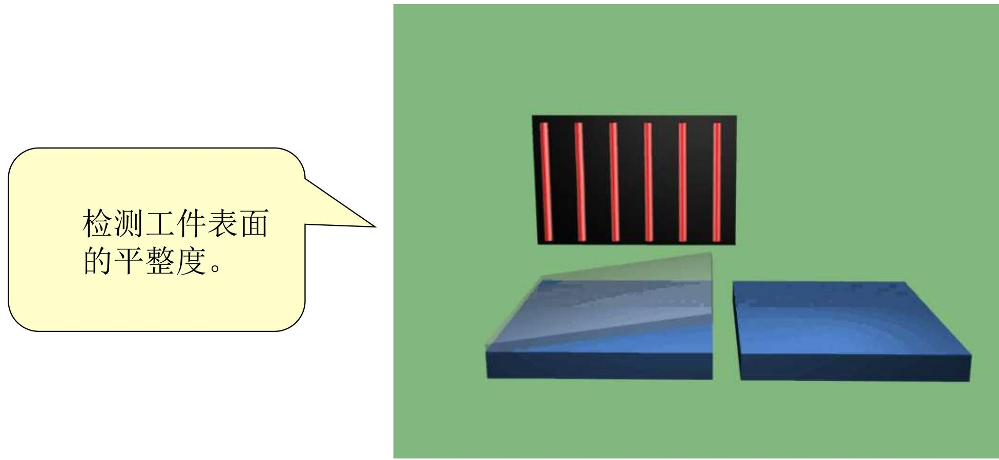

例1、测量钢球直径用波长为 $5 8 9 . 3 n m$ 的钠黄光垂直照射长 L=20mm 的空气劈尖，测得条纹间距为 $\phantom { - } l . 1 8 \times 1 0 ^ { - 4 } m \phantom { - }$ 。求：钢球直径d。

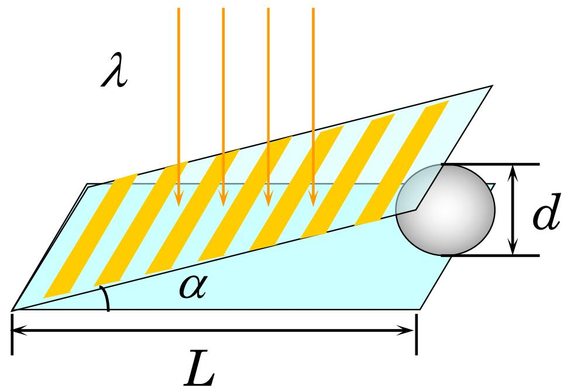

$$
\begin{array}{l} \Delta l = \frac {\Delta d}{\alpha} = \frac {\lambda}{2 n \alpha} \quad \xrightarrow {n = 1} \quad \alpha = \frac {\lambda}{2 \Delta l} \\ d = L \alpha = \frac {5 8 9 . 3 \times 1 0 ^ {- 9} \times 2 0 \times 1 0 ^ {- 3}}{2 \times 1 . 1 8 \times 1 0 ^ {- 4}} = 5 \times 1 0 ^ {- 5} \mathrm {m} \\ \end{array}
$$

例2、在半导体元件生产中，为测定硅（Si）片上 $S i O _ { 2 }$ 薄膜的厚度，将该膜一端削成劈尖状，已知 $S i O _ { 2 }$ 折射率 $n { = } 1 . 4 6$ ，用波长为 $5 4 6 . 1 n m$ 的绿光垂直照射，观测到 $S i O _ { 2 }$ 劈尖薄膜上出现7条暗纹图，问 $S i O _ { 2 }$ 薄膜厚度是多少（Si的折射率为3.42）？

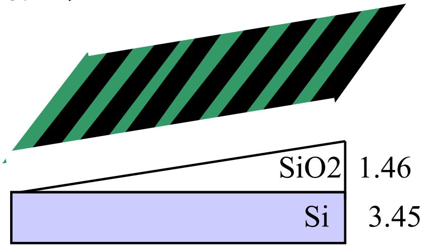

解：劈尖处是明纹，薄膜厚：

厚度差： $\Delta d = d _ { k + 1 } - d _ { k } = \frac { \lambda } { 2 n }$ 

$$
\begin{array}{l} D = 6 \Delta d + \frac {1}{2} \Delta d = 6. 5 \times \frac {\lambda}{2 n} = 6. 5 \times \frac {4 5 6 . 1 \times 1 0 ^ {- 9} m}{2 \times 1 . 4 6} \approx 1 \times 1 0 ^ {- 6} m \\ = 1 \mu m \\ \end{array}
$$

例3、为检测某一工件的表面光洁度，在它表面上放一块标准平面玻璃，一端垫一小片锡箔，使平板玻璃与待测物之间形成空气劈尖，用通过绿色滤片的波长为550nm的光垂直照射，观测到一般干涉条纹间距 $\varDelta l { = } 2 . 3 4 m m ,$ 但某处条纹弯曲如图所示，其弯曲最大畸变量a=1.86mm。问：该处工件表面有怎样的缺陷，其深度（或高度）如何？

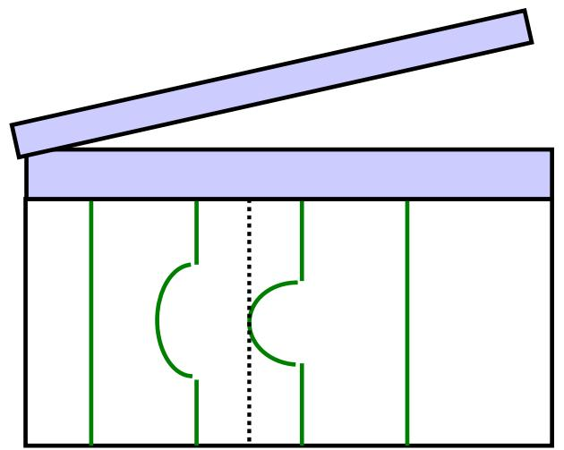

为凹陷，其深度为h

$$
\frac {a}{\Delta l} = \frac {h}{\Delta d}
$$

$$
\begin{array}{l} h = \frac {a \Delta d}{\Delta l} = \frac {a \lambda}{2 \Delta l} = \frac {1 . 8 6 \times 5 5 0 \times 1 0 ^ {- 6}}{2 \times 2 . 3 4} \approx 2. 1 9 \times 1 0 ^ {- 4} (m m) \\ = 0. 2 1 9 \mu m \\ \end{array}
$$

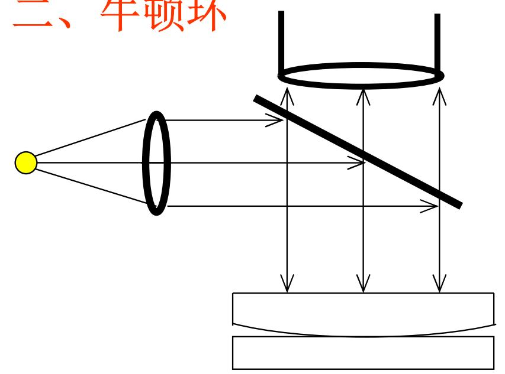

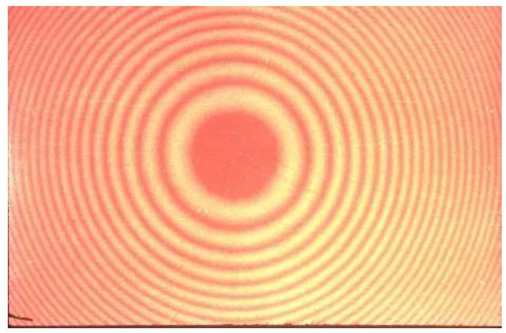

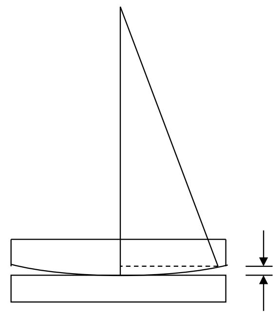

$$
\Delta = 2 n h + \frac {\lambda}{2} = \left\{ \begin{array}{l l} k \lambda & \text {亮 条 纹} \\ (k + \frac {1}{2}) \lambda , & \text {暗 条 纹} \end{array} \right.
$$

$$
h = R - \sqrt {R ^ {2} - r ^ {2}} = R \left[ 1 - \sqrt {1 - \left(\frac {r}{R}\right) ^ {2}} \right] \xrightarrow {r <   <   R} h \approx \frac {r ^ {2}}{2 R}
$$

亮条纹和暗条纹的半径？

$\begin{array} { r } { \boldsymbol r ^ { 2 } = \left\{ \begin{array} { l l } { \displaystyle \left( k - \frac { 1 } { 2 } \right) R \lambda , } \\ { \displaystyle } \\ { k R \lambda } \end{array} \right. } \end{array}$ k ，亮条纹，暗条纹

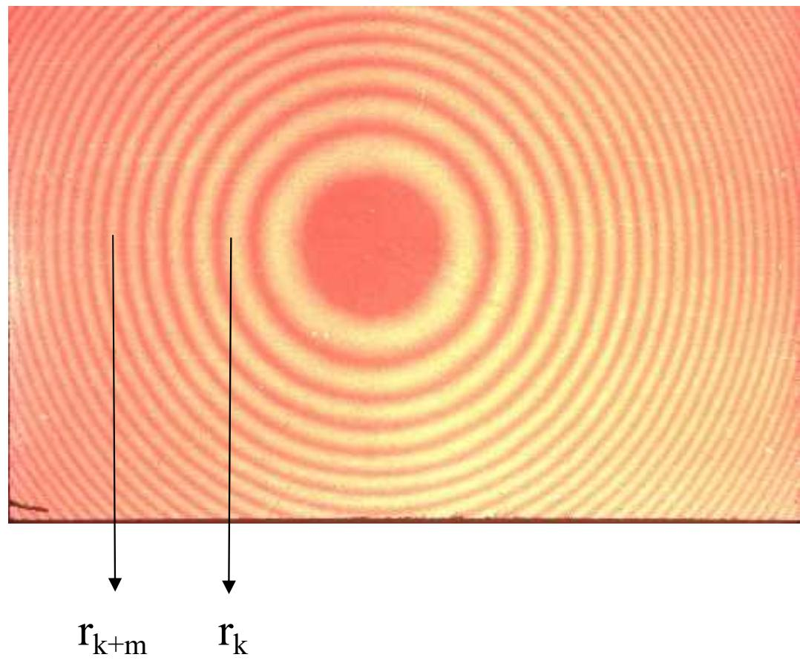

测量平凸透镜的曲率半径：

$$
r _ {m + k} ^ {2} - r _ {k} ^ {2} = \left(k + m - \frac {1}{2}\right) R \lambda - \left(k - \frac {1}{2}\right) R \lambda = m R \lambda
$$

所以：

$$
R = \frac {r _ {m + k} ^ {2} - r _ {k} ^ {2}}{m \lambda}
$$

# 检验透镜球表面质量

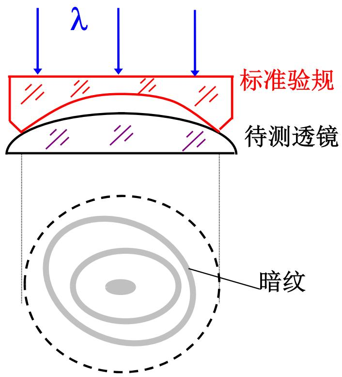

# 增透和增反膜

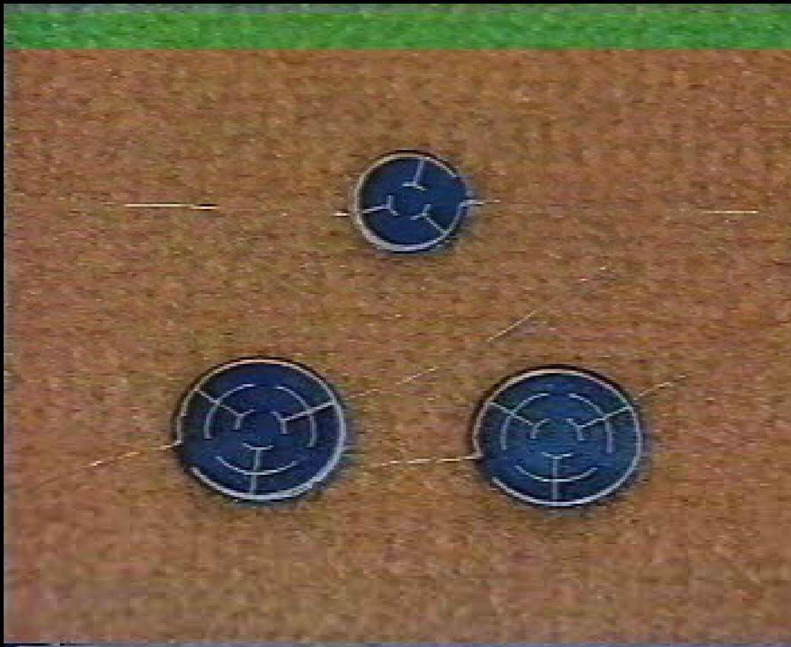

1.增透膜:光在空气 $\left( \mathrm { n } \mathrm { = } 1 \right)$ 和玻璃 $( n _ { g } = 1 . 5 2 )$ 分界面上的反射光强是入射光强的 $5 \%$ ；投射光强为 $9 5 \%$ 。在许多光学仪器中反射光是十分有害的，例如对照相机，有6个透镜12个反射面，投射光强为 $\left( 0 . 9 5 \right) { } ^ { 1 2 } \approx 0 . 5 5$ ，再比如潜水艇的潜望镜有20个透镜，投射光强为(0.95) $4 0 _ { \approx 0 }$ .13，反射光在界面上的多次反射，大大降低了成象质量。因此需要增透（减反）膜。

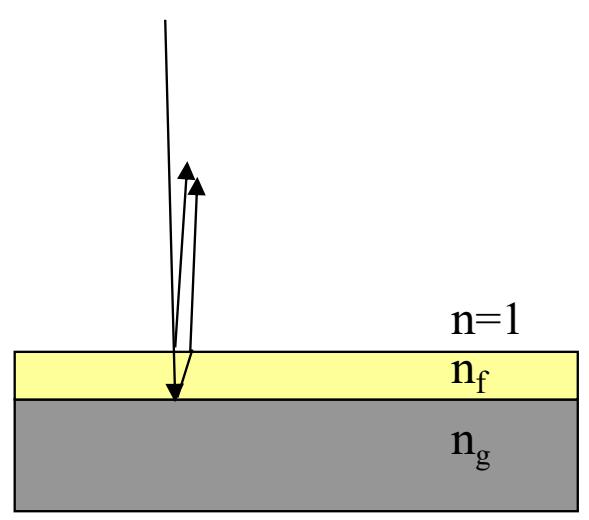

增透要求： $\Delta = \frac { \lambda } { 2 }$ 

要全消除反射,要求两列波的振幅相等；

$$
n _ {f} = \sqrt {n _ {1} \cdot n _ {g}} = 1. 2 3
$$

$\Delta = 2 n _ { f } d = \frac { \lambda } { 2 }$ 问题：为什么没有计半波损？

目前还找不到折射率为1.23的介质。现在的做法是使用折射率为1.38的MgF2，人对光的敏感波长为550nm，

$$
d = \frac {5 5 0 n m}{4 \times 1 . 3 8} \approx 1 0 0 n m
$$

# 增反膜：

蒸镀一定厚度的膜，使膜的两个分界面上的反射光相长相干，提高反射光强要达到较高的反射率，需要采用多层膜，比如MgF2和ZnS交替的多层膜。

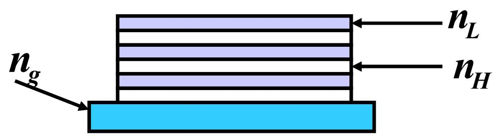

$$
\pmb {n} <   \pmb {n} _ {L} <   \pmb {n} _ {H}
$$

$$
n _ {H} > n _ {g}
$$

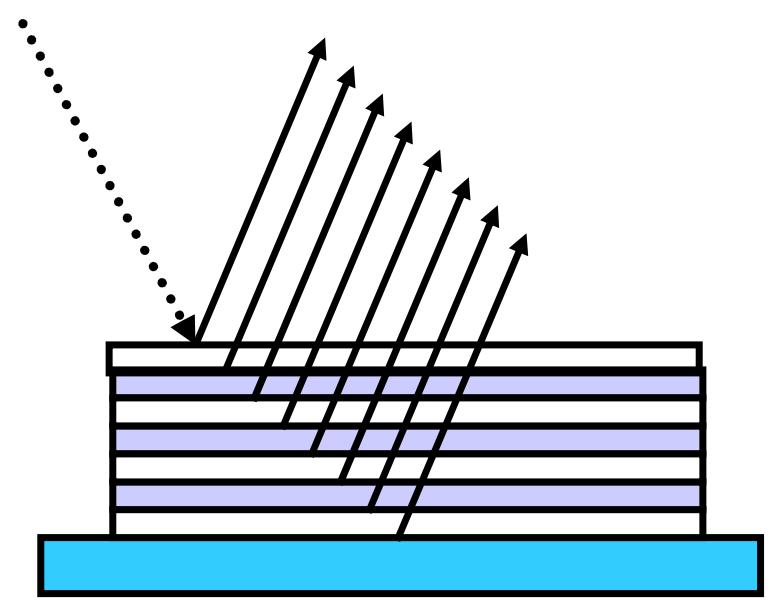

图中反射膜为7层。若镀13层，反射光的百分比可达 $9 9 \%$ 

# 7：迈克耳孙干涉仪

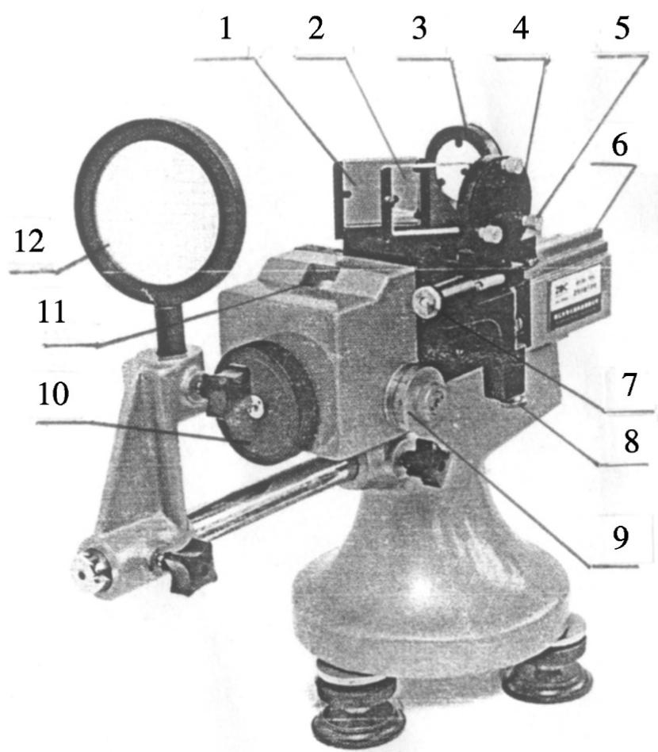

1—分束器G1；2—补偿板G2；3—可动反射镜M1；

4—固定反射镜M2；5—反射镜调节螺丝；6—导轨；

7—水平拉簧螺丝；8—垂直拉簧螺丝；9—微调手轮；

10—粗调手轮；11—读数窗口；12—光屏

# *迈克耳孙干涉仪装置

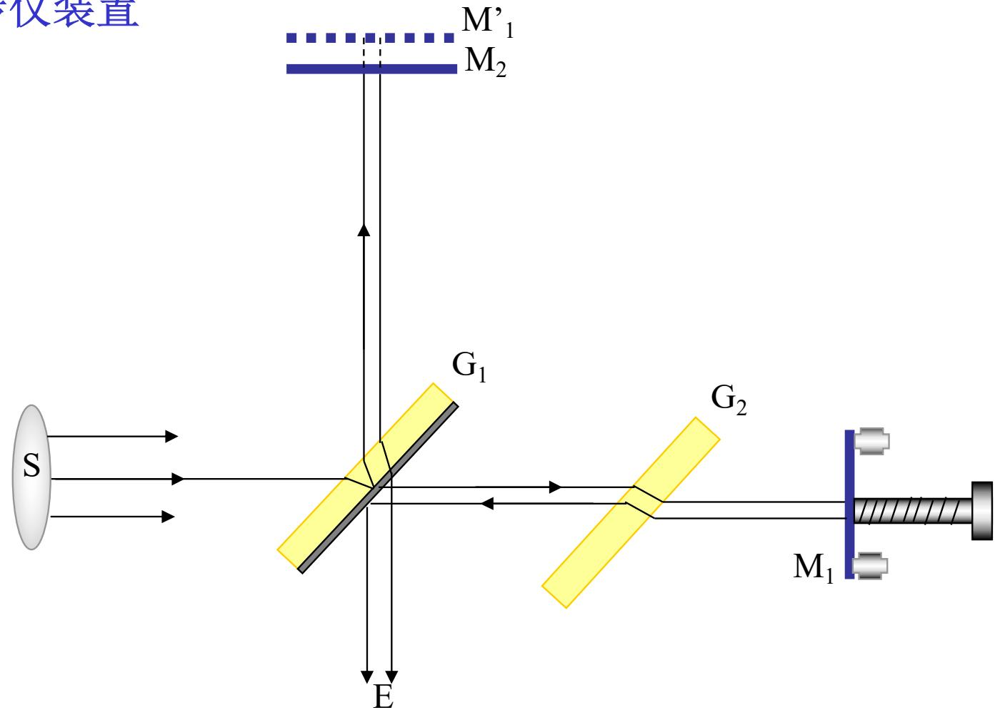

$\mathbf { M } _ { 1 }$ 和 $\mathbf { M } _ { 2 }$ 是一对精密磨制的平面反射镜， $\mathrm { G } _ { 1 }$ 和 ${ \bf G } _ { 2 }$ 是厚度和折射率都均匀相等的玻璃板， $\mathrm { G } _ { 1 }$ 背后镀了一层半反半透的银膜，称为分光板， ${ \bf G } _ { 2 }$ 为补偿板。两束光一个在 $\mathrm { G } _ { 1 }$ 背面内部反射一次，另外一束光在 $\mathrm { G } _ { 1 }$ 背面的外部反射一次，因为有银膜，两束光的相位突变比较复杂，附加相位并非恰好为。

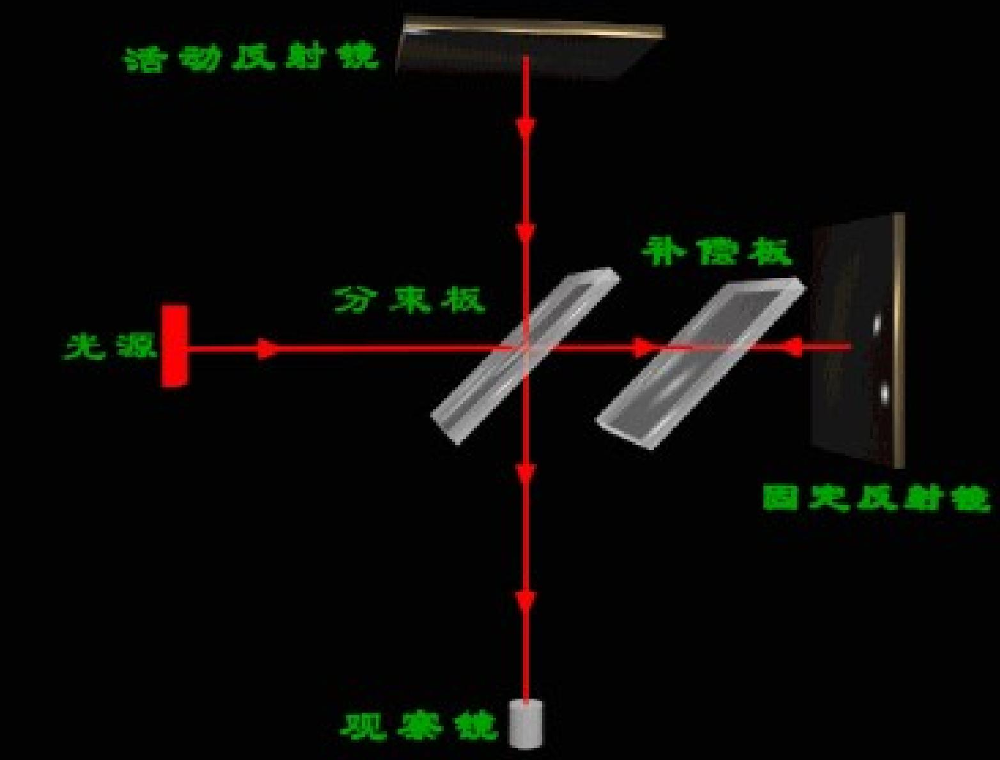

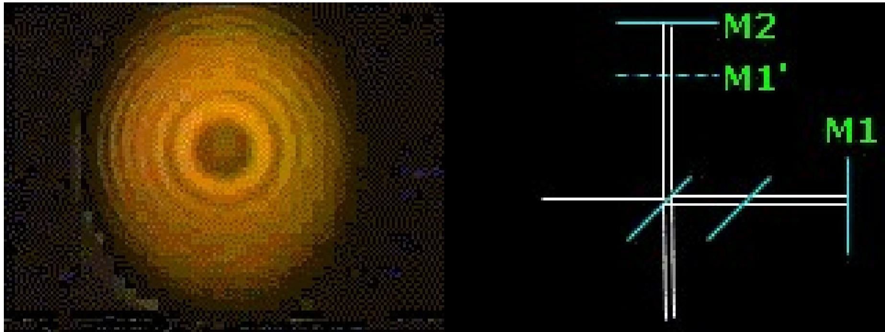

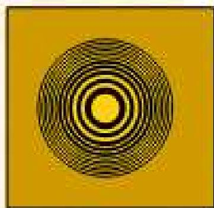

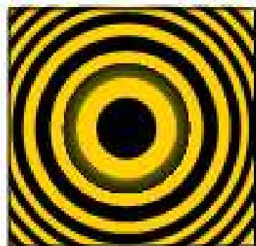

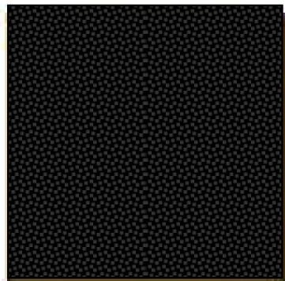

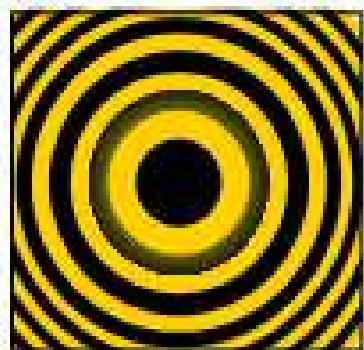

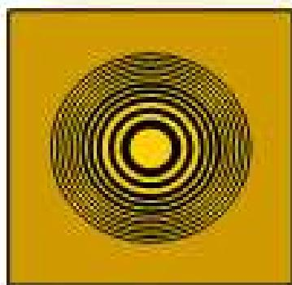

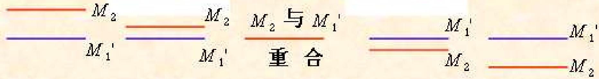

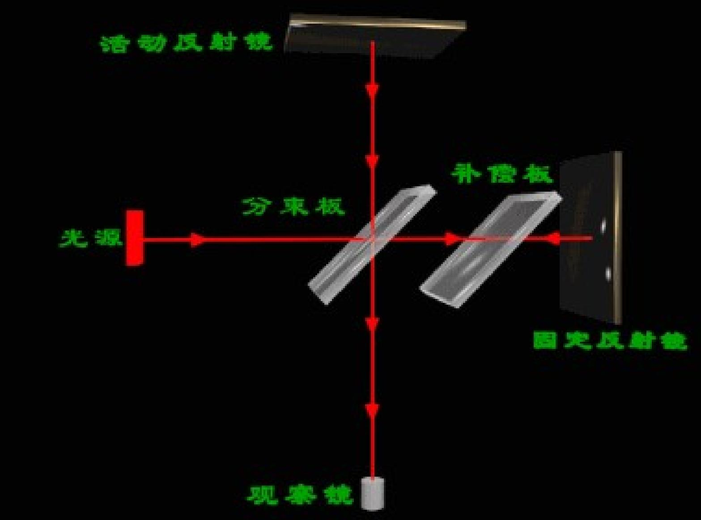

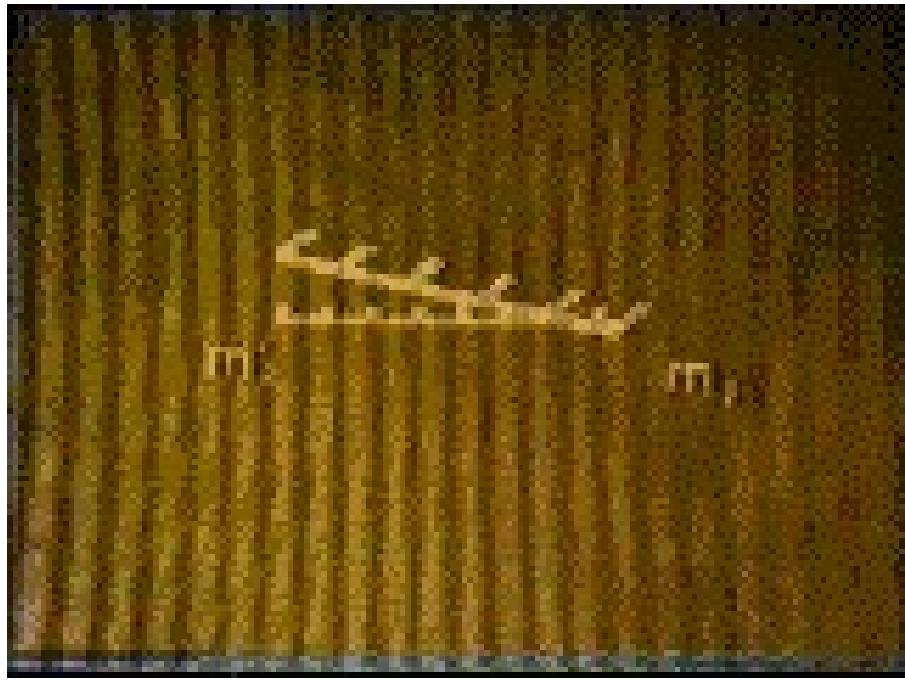

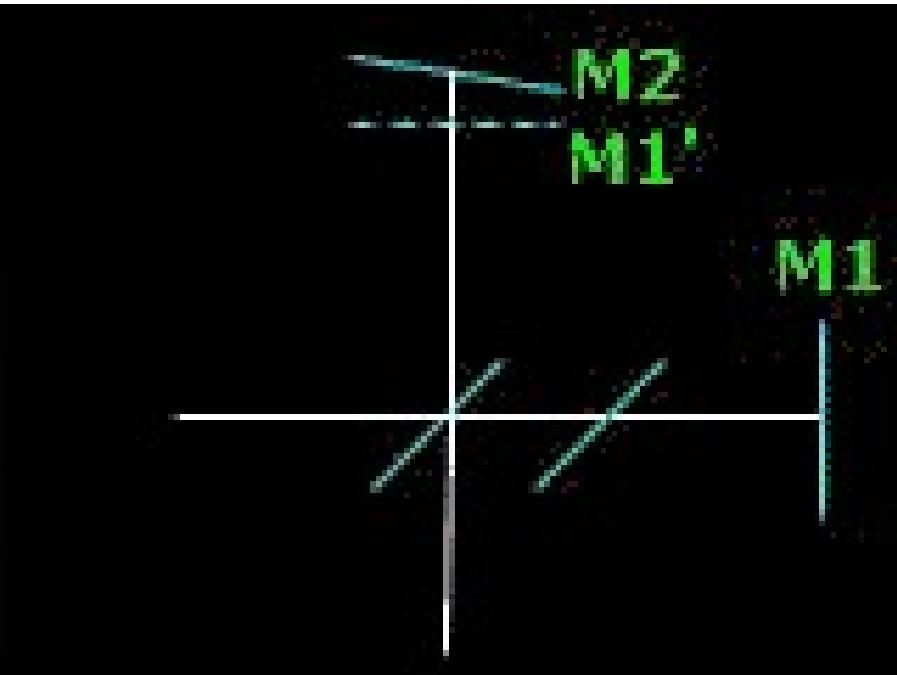

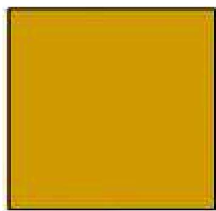

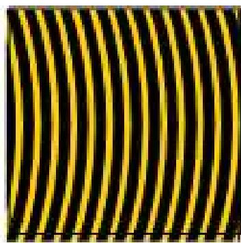

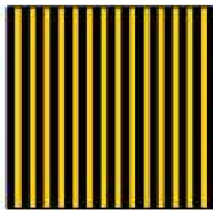

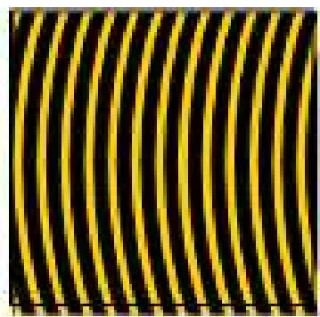

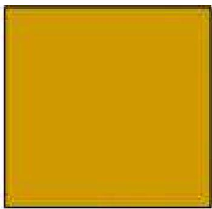

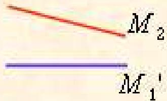

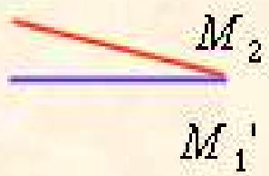

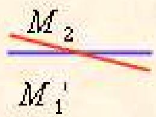

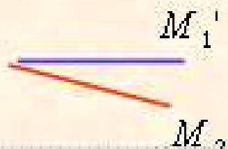

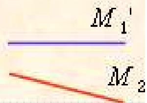

等厚条纹用于精密测量

微角度，微厚度及相关的物理量，

精度 △~100nm.

薄膜表面条纹偏离等厚线情形

现象

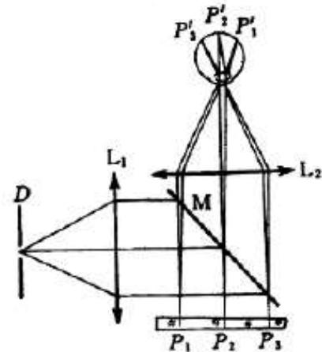

图4.22精密观测等厚条纹的装置

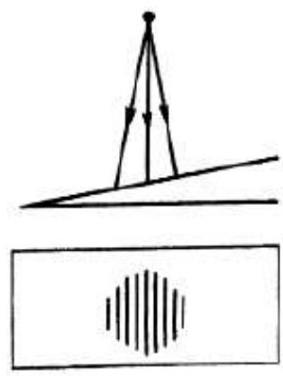

（a）

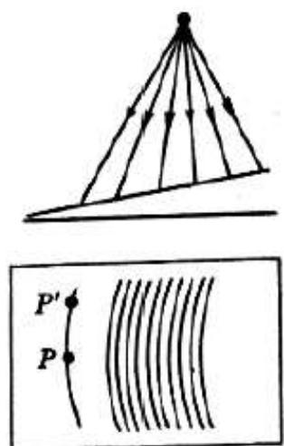

（b）

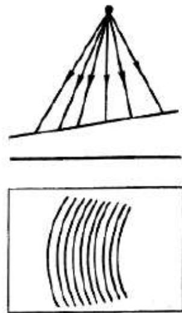

（c）

图4.23楔形膜表面条纹的弯曲

定性说明

考察条纹上，两点P,P 满足“等光程”：

$$
2 n h _ {p} \cos i _ {p} = 2 n h ^ {\prime} _ {p ^ {\prime}} \cos i ^ {\prime} _ {p},
$$

向稜边.

数学描写(粗略).

h变化—i变化，有确定关系,以维持

$$
2 n h c o s i = c o n s t.
$$

$\frac { d h } { d i } = h t a n i \quad \left\{ \begin{array} { l l } { \alpha t a n i , } & { \mathrm { ~ \# \# ~ } \nearrow } \\ { \propto h , } & { \mathrm { ~ \# \ " ~ } \nearrow } \end{array} \right.$ 因素；注意到 =h tani素

说明，

大倾角或厚膜层 d越大，di

条纹弯曲(或偏离等厚线)越明显.

★“薄膜”的一种意义 -膜层越薄，其表面条纹形貌与等厚线的一致性越好，因而精测的准确度越高.

·扩展光源将降低表面条纹的衬比度，因为

各点源生成的各套条纹，彼此错位；或者说,不同点源有不同的光程差(对同一场点P).

数学描写(粗略)

与接收光瞳对应的光源边缘两点 $A \ , B$ ，产生的光程差之差

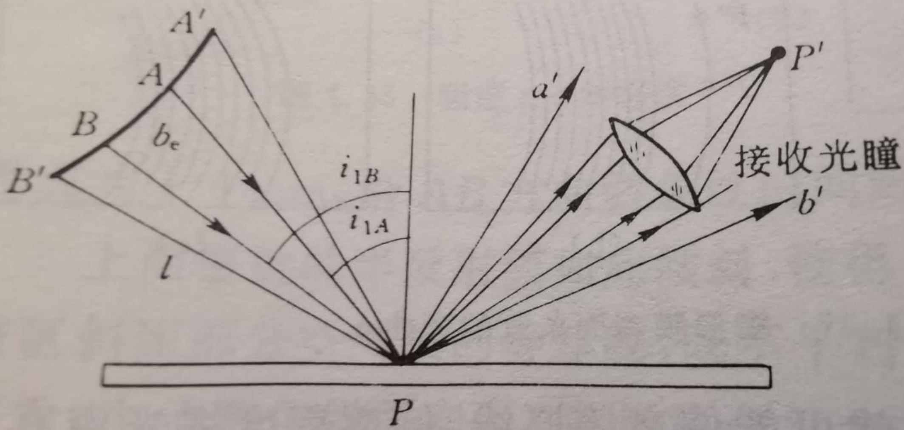

图4.38分析扩展光源和接收光瞳对表面条纹衬比度的影响

$$
\delta (\triangle L) = - 2 n h \sin i \delta i,
$$

令 8（△L)<λ0，取δ(△L）=λ0/2,

方有 γ~0.5的干涉场，可供观测.

由此,确定光源的“极限角宽"△u，

$$
- 2 n h \sin i \triangle i _ {M} = \lambda_ {0},
$$

即 $\triangle i _ { M } \approx \frac { \lambda } { 2 h s i n i } \propto \frac { 1 } { h } ,$ △iM

# ★膜越薄，所允许的光源线度则越大

# —薄膜的又一种意义.

# 数量级估算

设 $i _ { 1 } \approx i \approx 3 0 ^ { \circ } , ~ l \approx 3 0 c m ,$ 

$$
h \sim 6 0 \mu m, \quad \lambda \sim 0. 6 \mu m
$$

代人，算出

$$
\triangle i _ {M} = 1 0 ^ {- 2} r a d,
$$

$$
b _ {M} \approx l \triangle i _ {M} \approx 3 m m,
$$

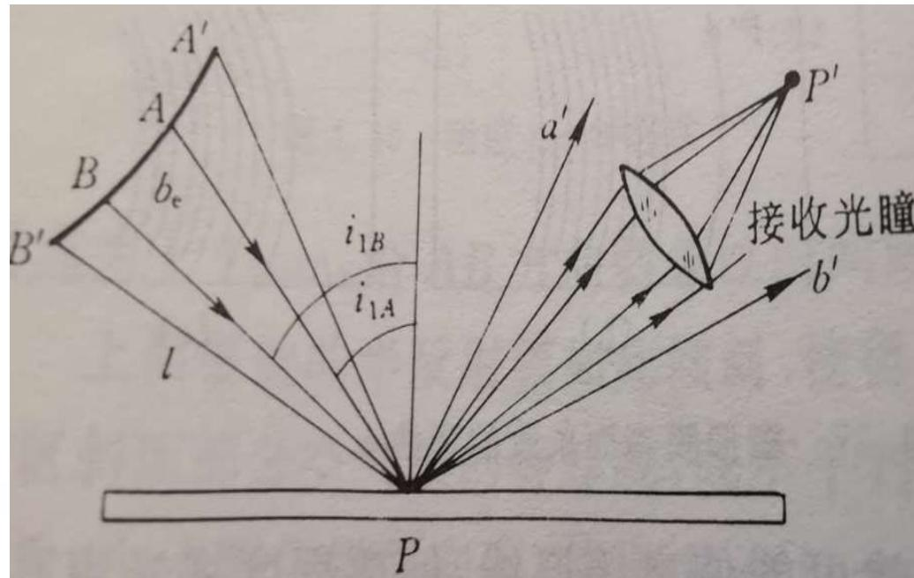

即 膜厚h~60μm—限宽bm~3mm,

膜厚 $h$ ~30μm 一限宽bm~6mm.

▲解释一个疑问

条件与上述相近，而当实际光源线度30mm时，人们却也能看见表面条纹？

这是因为接收光瞳（眼瞳）的限制 -实际光源的有效宽度变小了，b。<b成立．而相机镜头的光瞳几倍于人眼光瞳，以至光源有效宽度 $b _ { e } > b _ { M }$ ，导致表面条模糊一片

# *迈克耳孙干涉仪应用和物理意义

# 1、精密测长

精度

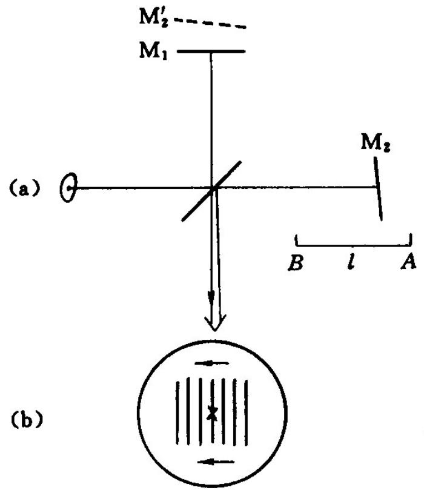

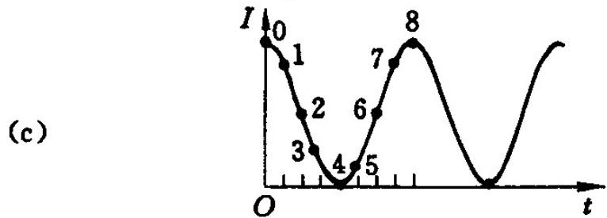

图4.51干涉测长原理示意图

（a）动臂平移，(b）条纹平移，(c）光电计数

迈克耳孙干涉仪的一个臂可由丝杠操纵做长程平移，如左图，M2由AB平移l，光程改变量为：

$$
\Delta L = 2 n l
$$

在平移中，该处的干涉强度改变了N次，则：

$$
\Delta L = N \lambda
$$

求得平移长度：

$$
l = N \frac {\lambda}{2 n}
$$

迈克耳孙干涉仪的测长精度，取决于对干涉强度变化的计数精度。

$$
\delta l = \frac {\lambda}{2 n} \delta N
$$

$$
\delta l = \frac {\lambda}{2} \cdot \delta N,
$$

取决于对条纹的计数精度SN，

1 

例如,SN(计数精度)~1/4,

有 Sl~λ/8~100nm (即0.1μm).

现代光电计数技术可以将条纹测量精度提高到1/12，此时干涉仪的测长精度达到：

$$
\delta l = \frac {\lambda}{2} \times \frac {1}{1 2} \sim 2 0 n m
$$

# 量程

测长量程 $l _ { M }$ 受限于谱线宽度△入, 其结果是

$$
l _ {M} \approx \frac {\lambda^ {2}}{2 \triangle \lambda}.
$$

例女 $\begin{array} { r } { \mathbb { H } , \triangle \lambda { \sim } 1 0 ^ { - 3 } n m , \lambda \sim 6 0 0 n m , } \end{array}$ 

$l _ { M } { \sim } 1 8 { \times } 1 0 ^ { 7 } n m { \sim } 1 8 c m$ 

即连续一次测长的量程为18cm.

干涉精密测长的相对精度

$$
\triangle = \frac {\delta l}{l _ {M}} \sim 1 0 ^ {- 6}, \quad 1 0 ^ {- 7},
$$

欲提高精度，△, 应当使

δN且△↓(单色性越好).

# 量程的再讨论

# 非单色性对干涉场衬比度的影响

非单色性的两种典型

·光谱双线结构导致 $\gamma ( \triangle L )$ 周期性变化

·准单色线宽导致 $\gamma ( \triangle L )$ 下降

·最大光程差 $\&$ 干涉测长量程

* * * * * 

# 非单色性的两种典型

(1)双线结构 例如，

$N a$ 黄双线

589.0nm, 589.6nm; 

Hg黄双线

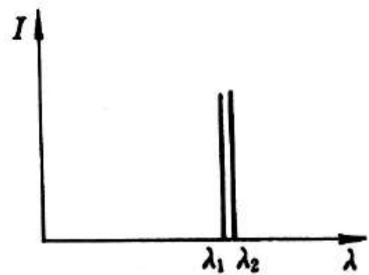

（a）

$$
5 7 7. 0 n m, \quad 5 7 9. 1 n m,
$$

均系 $\Delta \lambda = ( \lambda _ { 2 } { - } \lambda _ { \mathit { I } } ) { < } { < } \lambda _ { \mathit { I } } \setminus \lambda _ { 2 } \ .$ 

(2)单色线宽—准单色，

△λ~1nm, 单色性差；{△入~10-³, 单色性好;△λ~10, 单色性很好.

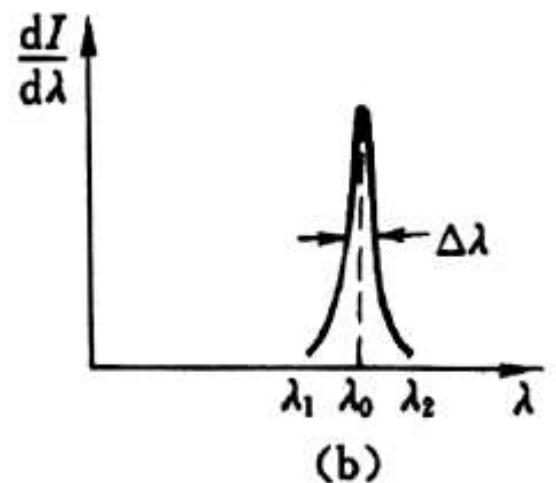

图4.36 非单色性的两种典型

例 $\triangle \lambda \sim 1 0 ^ { - 3 } n m , ~ \lambda _ { o } \sim 5 0 0 n m ,$ 

$\frac { \triangle \lambda } { \lambda _ { o } } \approx 2 \times 1 0 ^ { - 6 } .$ △~2×106. 

均系△入<<入o，准单色

·光谱双线结构导致γ(△L)作周期性变化：

$\begin{array} { r } { \bigg \{ \Delta L : \qquad 0  \frac { \lambda ^ { 2 } } { 2 \Delta \lambda }  \frac { \lambda ^ { 2 } } { \Delta \lambda } } \end{array}$ {干涉场：清晰—模糊—清晰，

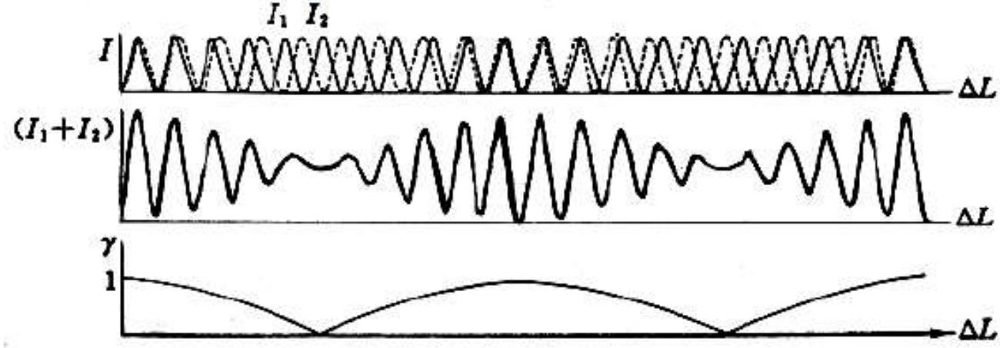

粗略分析

设初始 △L=0,

图4.37光谱双线产生的干涉强度 $I ( \triangle L )$ 及其相应的y（△L）

则(入色亮,色亮)→干涉场清晰；

随△L增加,当满足

$$
\triangle L = N _ {0} \lambda_ {1} = (N _ {0} - \frac {1}{2}) \lambda_ {2}, \quad \text {则}
$$

(入色亮,色暗)→干涉场模糊；

继续△L增加,当满足

$\triangle L ^ { \prime } = 2 N _ { o } \lambda _ { \scriptscriptstyle { I } } = ( 2 N _ { o } - 1 ) \lambda _ { \scriptscriptstyle { 2 } } ,$ 则

(入色亮，入色亮)→干涉场清晰.

据此,确定

$$
N _ {0} = \frac {\lambda_ {2}}{2 \Delta \lambda} \approx \frac {\bar {\lambda}}{2 \Delta \lambda}, \quad (\triangle \lambda <   <   \lambda_ {1}, \lambda_ {2})
$$

这提供了一个分解谱线的测量方法：先由低分辩的分光仪，粗测入；再由干涉法，移动一臂 $M _ { 2 }$ 改变光程差，计数条纹变动数目，直至模糊不清， $N _ { o }$ 

确定了双线波长差为

$$
\Delta \lambda = \frac {\bar {\lambda}}{2 N _ {0}},
$$

双线 $\lambda _ { \scriptscriptstyle I } = \overline { { { \lambda } } } - \frac { \triangle \lambda } { 2 } \ , \qquad \lambda _ { \scriptscriptstyle 2 } = \lambda + \frac { \triangle \lambda } { 2 } .$ A=+△1

# 数学描写

$\lambda _ { I }$ 谱线→一套条纹，

$$
I _ {1} (\triangle L) = I _ {0} (1 + \cos \frac {2 \pi}{\lambda_ {1}} \triangle L),
$$

λ谱线→一套条纹，

$$
I _ {2} (\triangle L) = I _ {0} (1 + \cos \frac {2 \pi}{\lambda_ {2}} \triangle L),
$$

(入2)双线→两套条纹非相干叠加，

$$
\begin{array}{l} I (\triangle L) = I _ {1} (\triangle L) + I _ {2} (\triangle L) \\ = I _ {0} \left(1 + \cos k _ {1} \triangle L\right) + I _ {0} \left(1 + \cos k _ {2} \triangle L\right) \\ = 2 I _ {0} (1 + \cos \frac {\triangle k}{2} \triangle L \cdot \cos \bar {k} \triangle L), \\ \end{array}
$$

其中

$$
k = \frac {k _ {1} + k _ {2}}{2} > > \triangle k = \left(k _ {1} - k _ {2}\right),
$$

衬比度

$$
\gamma = \left\{ \begin{array}{l l} 1. 0, & \text {当} \triangle L = 0, \dots \\ 0, & \text {当} \triangle L = \frac {\pi}{\triangle k}, \dots \end{array} \quad (= \frac {\lambda^ {2}}{2 \triangle \lambda}) \right.
$$

准单色导致γ(△L)值下降：

(1)谱密度函数i(k).

在k-k+△k区间,含光强

$$
\triangle I _ {0} \propto \triangle k,
$$

写成 △I0=i（k）△k，

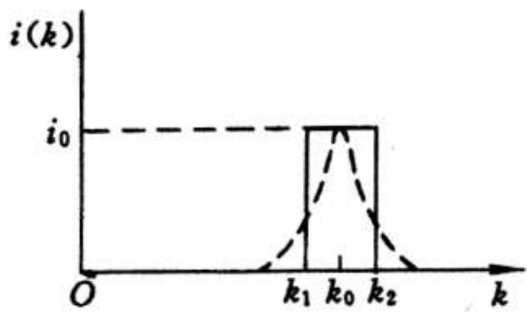

图4.38 方垒型谱密度函数

即 i）=d，光强谱密度.dk

(2)ik)有各种线型，取决于发光机制.目前，为计算简明且不影响物理后果(主要).设谱函数为“方垒型”(简化模型),其谱密度函数为

$$
i (k) = \left\{ \begin{array}{l} i _ {0}, | k - k _ {0} | <   \triangle k / 2; \\ O, | k - k _ {0} | > \triangle k / 2. \end{array} \right.
$$

(3)干涉场中，

（k-k+△k)谱元，提供相干强度为

$$
\begin{array}{l} d I = d I _ {0} (1 + \cos k \triangle L) \\ = i (k) (1 + \cos k \triangle L) d k, \\ \end{array}
$$

总干涉强度为各谱元贡献的非相干叠加，

$$
\begin{array}{l} I (\triangle L) = \int_ {0} ^ {\infty} i (k) (1 + \cos k \triangle L) d k \\ = \int_ {\left(k _ {0} - \frac {\Delta k}{2}\right)} ^ {\left(k _ {0} + \frac {\Delta k}{2}\right)} i _ {0} (1 + \cos k \Delta L) d k \\ = i _ {0} \triangle k + i _ {0} \int_ {k _ {1}} ^ {k _ {2}} \cos k \triangle L d k \\ = I _ {0} (1 + \frac {\sin v}{v} \cos k _ {0} \triangle L) \\ \end{array}
$$

其中 $I _ { O } { = } i _ { O } \triangle k$ ，入射于干涉仪的总光强，

宗量 v=2

$$
\sin \alpha - \sin \beta = 2 \sin \frac {\alpha - \beta}{2} \cos \frac {\alpha + \beta}{2}
$$

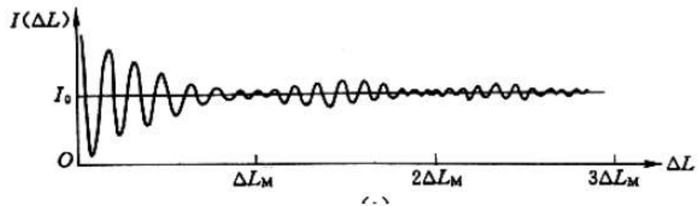

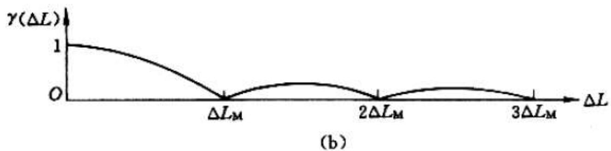

图4.39准单色线宽产生的干涉强度I(△L)(a)及其相应的 $\gamma ( \triangle L ) ( \mathrm { b } )$

(4)衬比

$\begin{array} { l } { \displaystyle \ddot { \Xi } ^ { \prime } \left( \triangle L \right) = \left| \frac { s i n v } { v } \right| } \\ { \displaystyle \gamma ( \triangle L ) = \left| \frac { s i n \frac { \triangle k } { 2 } \triangle L } { \frac { \triangle k } { 2 } \triangle L } \right| = \left| \frac { s i n \pi \frac { \triangle L } { \triangle L _ { u } } } { \pi \frac { \triangle L } { \triangle L _ { u } } } \right| } \end{array}$ sin△k即 △LM

·最大光程差 $\Delta L _ { u }$ 与干涉测长量程

$\mathrm { ~  ~ \curlywedge ~ } \quad \frac { \triangle k } { 2 } \triangle L = \pi ,$ 

反比形式

△LM·△k=2π.△ 注意到 $\triangle k = \frac { 2 \pi } { \lambda ^ { 2 } } \triangle \lambda .$ 非单色性度量可表达 LM △=入.△ 入

迈克耳孙测长仪的量程

$$
l _ {M} = \frac {1}{2} \triangle L _ {M} = \frac {\lambda^ {2}}{2 \cdot \triangle \lambda}.
$$

迈克耳孙测长仪的量程

$$
l _ {M} = \frac {1}{2} \triangle L _ {M} = \frac {\lambda^ {2}}{2 \cdot \triangle \lambda}.
$$

被单色性所限制！△，

$\triangle L _ { y }$ 的意义是

Y>0； 

$$
\triangle L \geqslant \Delta L _ {M}, \quad \gamma \approx 0.
$$

推荐一个有用的换算公式

$$
\frac {\triangle \lambda}{\lambda} \approx \frac {\triangle k}{k} \approx \frac {\triangle \omega}{\omega},
$$

据k=2π $k = \frac { 2 \pi } { \lambda } = \frac { \omega } { v }$ (不计较±号).

# 2、迈克耳孙干涉仪在化学、生物、医学等方面的应用：

# （1）傅立叶变换光谱仪

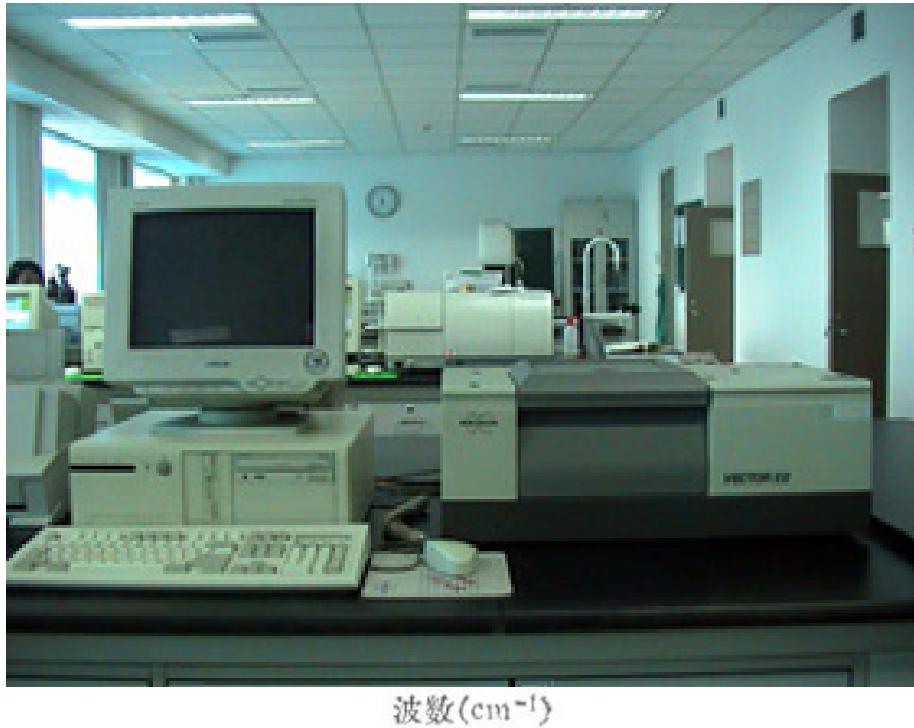

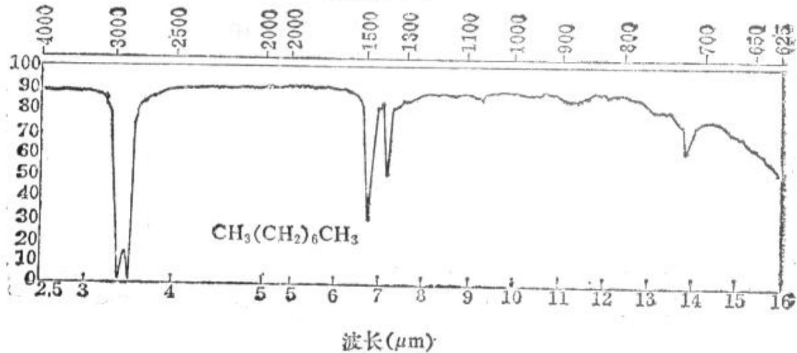

# VECTOR22付立叶红外光谱仪

主要技术指标：

波数范围：7500-370cm-1

分辨率： 1 cm-1

操作系统: OPUS/IR

主要应用：物质的定性、定量分析

生产厂家：德国Bruker公司

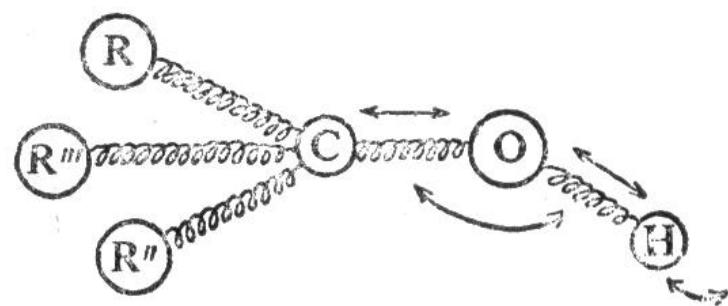

图7-6醇分子的机械模型

# 两类光谱仪：

1、根据光的干涉的光谱仪

2、根据光的衍射的光谱仪

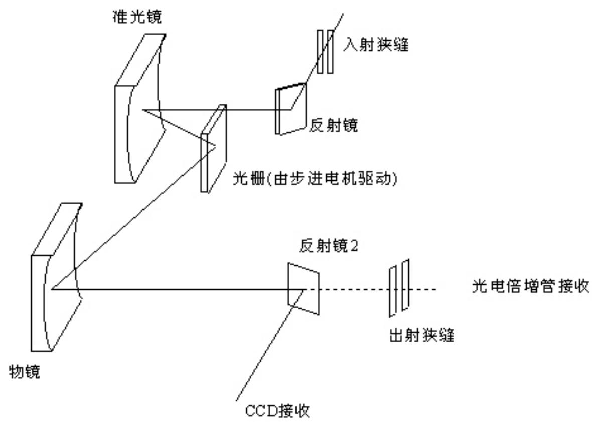

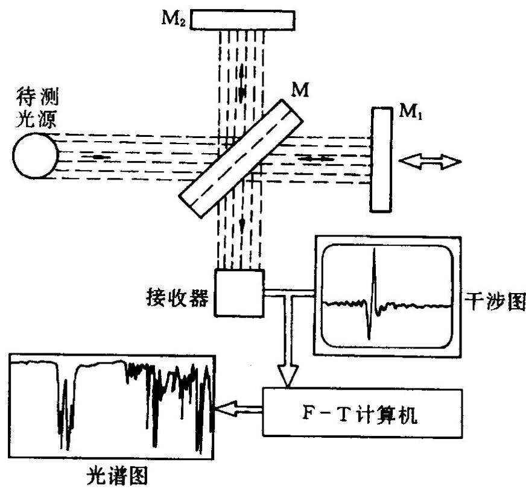

（b）傅里叶光谱仪原理图

傅立叶光谱仪的主要成分是迈克耳孙干涉仪，设光源的光强谱分布为 $I _ { 0 } ( \lambda )$ ，可以置备 $\mathbf { M } _ { 1 }$ 和 $\mathbf { M } _ { 2 }$ 的反射率相同，M的反射和透射相同，所以两束相干光的振幅均可写成 $I _ { 0 } ( \lambda )$ ，它们的干涉光强：

$$
I (\lambda) = 2 I _ {0} (\lambda) \cdot (1 + \cos \delta (\lambda))
$$

两束光的光程差 $D = 2 l$ ，相位差 $\delta ( \lambda ) = 2 l k$ ， $k = { \frac { 2 \pi } { \lambda } } ,$ 

接受到的总光强为不同波长光的非相干叠加：

$$
I (l) = \int_ {0} ^ {\infty} I (\lambda) d \lambda
$$

为了计算方便，以 $k = \frac { 2 \pi } { \lambda }$ 代替作为变量积分求和：

$$
\begin{array}{l} I (l) = \int_ {0} ^ {\infty} I (k) d k = \int_ {0} ^ {\infty} I _ {0} (k) (1 + \cos 2 l k) d k \\ = \int_ {0} ^ {\infty} I _ {0} (k) d k + \int_ {0} ^ {\infty} I _ {0} (k) \cos (2 l k) d k = I _ {0 0} + \int_ {0} ^ {\infty} I _ {0} (k) \cos (2 l k) d k \\ \end{array}
$$

傅立叶变换得：

$$
I _ {0} (k) = \frac {1}{\pi} \int_ {0} ^ {\infty} \left[ I (l) - I _ {0 0} \right] \cos \left(2 l k\right) d l \quad \text {这 就 是 光 源 的 光 谱 。}
$$

傅立叶变换光谱仪的优点：

A、速度快，B、分辨本领高，C、信噪比高。

这些优点在红外区显得更为重要，因此它多用于红外区域。

# 4.8 光场的时间相干性

·问题的提出·相干时间&相干长度

·时间相干性突出表现于长程差干涉

·波列长度与谱线宽度互为表里

时间相干性反比律公式 光场时空相干性小结* * *

问题的提出

即使是 点光源 其照明空间中的

两点（次波源） 亦并非“完全相关”

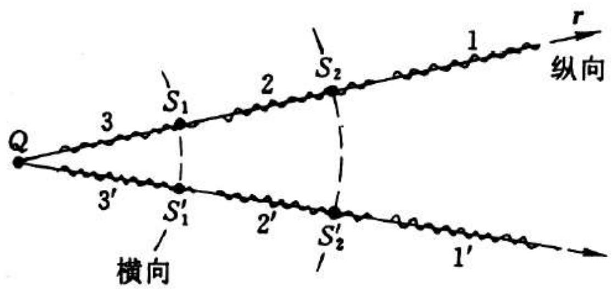

准单色光源，自发辐射，随机过程，断续发光；

微观上看 持续发光时间To（量级），

波列长度(光程)有限

$$
L _ {0} \approx c \tau_ {0}
$$

致使

扰动 $S _ { 1 }$ 与扰动 $S _ { 2 }$ 并不总能

处于一个波列之内；

它俩相关程度取决于光程差

（与 $L _ { 0 }$ 相比较).

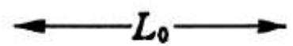

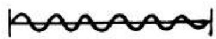

（a） A S 

（b） 

（c） ss 

图4.45 实际光程差与相干长度的比较

这里 $\triangle L = L ( Q S _ { 2 } ) - L ( Q S _ { 1 } ) ,$ 

注意，并不限于“纯纵向”，譬如

(S,S'）相干程度 ${ \approx } ( S _ { 1 } , S _ { 2 } )$ 相干程度，

相干时间&相干长度

T，相干时间，

Lo=cT相干长度

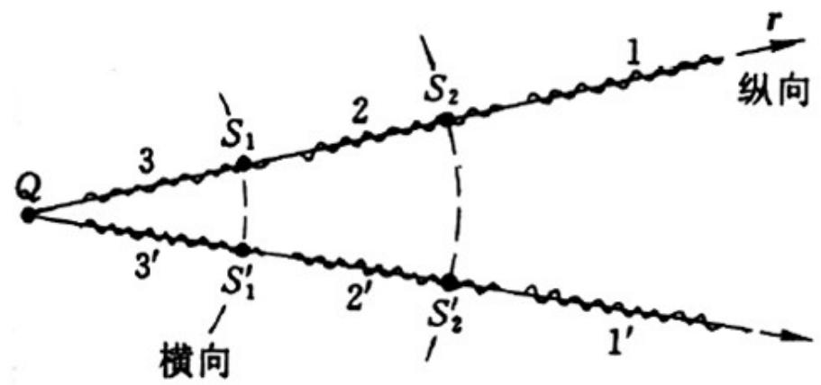

例如 $\begin{array} { c c c } { { \overline { { { \sf { \tau } } } } _ { o } \sim \displaystyle { \cal I } O ^ { - 9 } s , \ { \cal I } n s \ , \ } } & { { \ \ } } & { { \cal L } _ { o } \sim \displaystyle { 3 O c m } \ ; } \end{array}$ 

$$
\tau_ {0} \sim 1 0 ^ {- 5} s, \quad L _ {0} \sim 3 k m.
$$

# #时间相干性--迈克耳孙干涉仪的量程

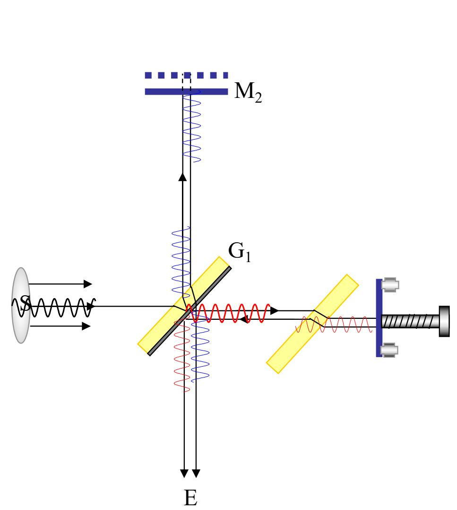

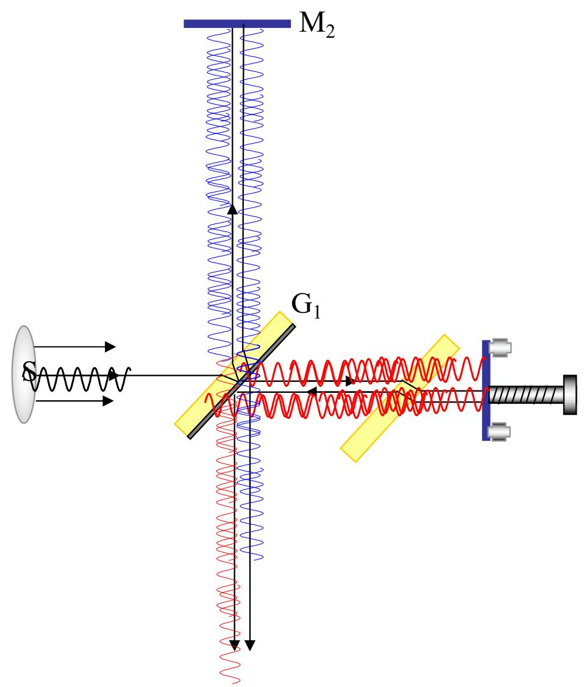

l 测长量程： Max $l _ { M a x } = ( \frac { 1 } { 2 } L _ { 0 } ) = \frac { 1 } { 2 } c \tau _ { 0 }$ 

若着眼于“干涉测长”，

则两路的最大光程差受相干长度的限制，

$$
\triangle L _ {M} ^ {\prime} \approx L _ {0},
$$

$\mathbb { \hat { H } H } \underline { { \hat { \nu } } } \underline { { \hat { \nu } } } \mathbb { \hat { H } } \mathbb { M } \underline { { \hat { \nu } } } \mathbb { M } \underline { { \hat { \nu } } } \mathbb { H } \mathbb { H } \mathbb { H } \mathbb { H } \mathbb { \hat \Lambda } \underline { { \hat { \nu } } } \mathbb { \hat { H } } \mathbb { \Lambda } l _ { M } ^ { \prime } \approx \frac { \Delta L ^ { \prime } } { 2 } \approx \frac { L _ { 0 } } { 2 } .$ 

波列长度与谱线宽度互为表里 证明：参考课本！

$\begin{array} { r } { \frac { \partial \left[ \frac { \rho } { \mathrm { d } s } \right] } { \partial t } \mathbb { F } ^ { \infty } \mathbb { F } \stackrel { \mathrm { \sim } \rho } { \operatorname { I } ^ { \mathrm { g } } } \frac { \zeta } { \langle \mathcal { I } \cup \mathcal { U } \vert } \frac { \partial \theta } { \partial z } \vert \stackrel { \mathrm { \sim } \rho } { \operatorname { I } ^ { \mathrm { g } } } \frac { \partial } { \partial z } , } \end{array}$ 

两者是否一致？

须知， 最大光程差△L是

一个可观测量，具有“唯一性”。

相干长度（或相干时间）和光波的单色性有关：

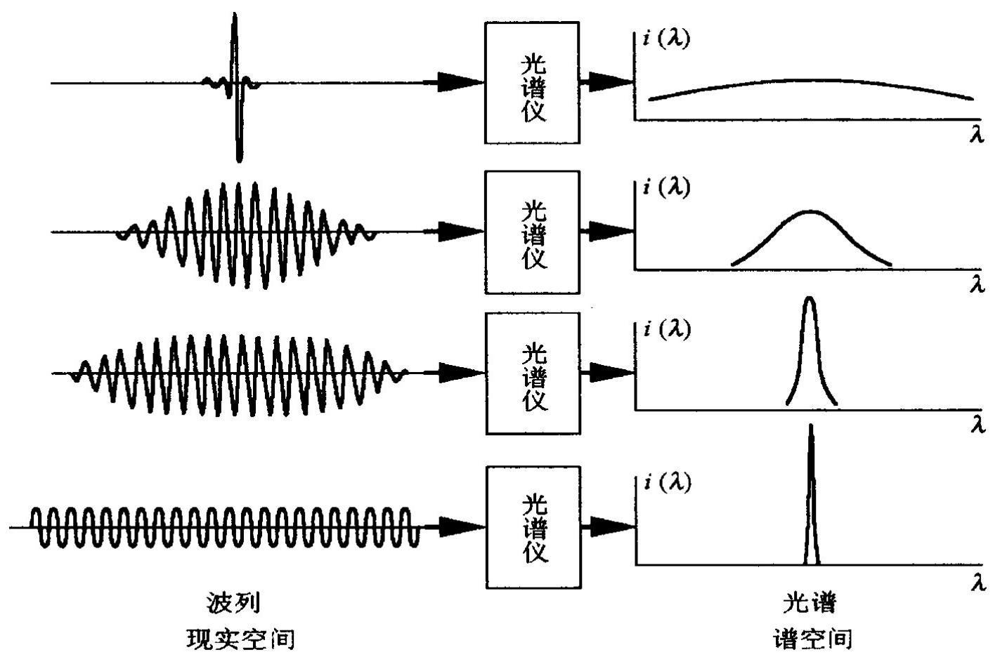

图4.66波列长度与非单色性之反比关系

$L _ { 0 } = c \tau _ { 0 } \approx \frac { \lambda ^ { 2 } } { \Delta \lambda } ,$  为谱线宽度。

  c    $\scriptstyle \nu = { \frac { c } { \lambda } }$  c0 aa 1    时间相干性反比例公式

★关于光场时空相干性小结

图示

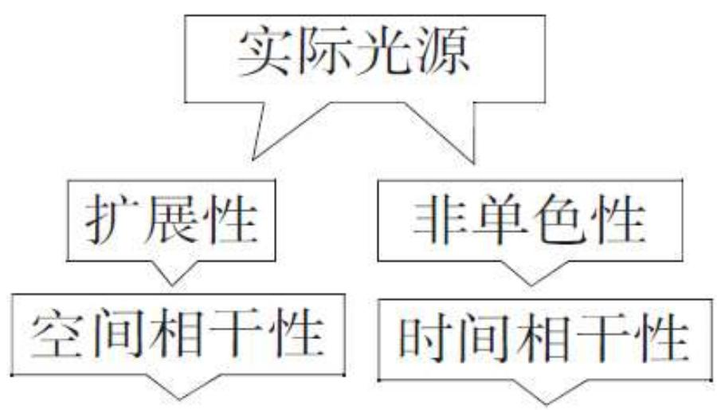

反比律公式 $b \cdot \triangle \theta _ { o } \approx \lambda \quad L _ { o } \cdot \frac { \triangle \lambda } { \lambda } \approx \lambda _ { \setminus } \quad \quad \tau _ { o } \triangle \nu \approx$ 1

常用术语

相干孔径角

相干面积

相干时间

相干长度

衬比度 $\gamma ( \triangle \theta ) = \frac { s i n \pi \frac { \triangle \theta } { \triangle \theta _ { o } } } { \pi \frac { \triangle \theta } { \triangle \theta _ { o } } }$ $\gamma ( \triangle L ) = \frac { s i n \pi \frac { \triangle L } { L _ { o } } } { \pi \frac { \triangle L } { L o } }$ L0

实际干涉装置中，两者并存。因为实际光源总是非单色的扩展

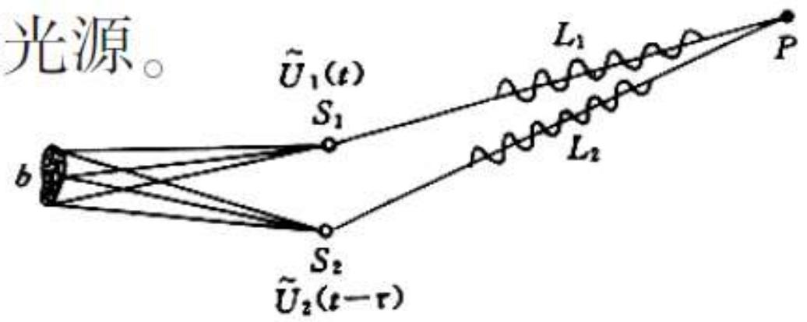

图4.50光场中时空相干性并存的图像

接收场点 $P$ ，叠加的“同时性”，

意味 发射源 $( S _ { 1 } , S _ { 2 } )$ ，“非同时”，

${ \boldsymbol { \mathsf { T } } } = { \frac { \triangle L } { c } } , t _ { 1 } = t , t _ { 2 } = t - { \boldsymbol { \mathsf { T } } } ,$ 

于是 对光场时空相干性的统一描述，

就集中于研究

$$
\widetilde {U} _ {1} (t)   \text {与}     \widetilde {U} _ {2} (t - \tau)
$$

两者的相关性，由此推演展开而

形成理论光学中的一个分支

“部分相干光的传播理论”

不过

在杨氏干涉为代表的分波前干涉装置中，

突出的表现为空间相干性，1>γs(△0)≥0.

因为那里是“短程差”干涉，

$$
\triangle L <   d <   <   L _ {0} \quad ,
$$

以致 Y(△L）~1.

而在迈克耳孙干涉仪这类“纵向、平移"场合，

突出的表现为时间相干性，

因为 那里是“长程差”干涉；

扩展光源可能有利.

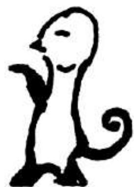

# 9. 多光束干涉

# 求解多光束干涉

光波的叠加原理，观察屏上的波前函数为：

$$
\widetilde {U} (x, y) = \widetilde {U} _ {1} (x, y) + \widetilde {U} _ {2} (x, y) + \dots
$$

观察屏上光强分布：

$$
\begin{array}{l} I (x, y) = \widetilde {U} (x, y) \cdot \widetilde {U} ^ {*} (x, y) \\ = \left(\widetilde {U} _ {1} (x, y) + \widetilde {U} _ {2} (x, y) + \bullet \bullet \bullet\right) \cdot \left(\widetilde {U} _ {1} (x, y) + \widetilde {U} _ {2} (x, y) + \bullet \bullet \bullet\right) ^ {*} \\ \end{array}
$$

要解决的关键问题：

各个波前函数之间的关系－－振幅关系和相位关系

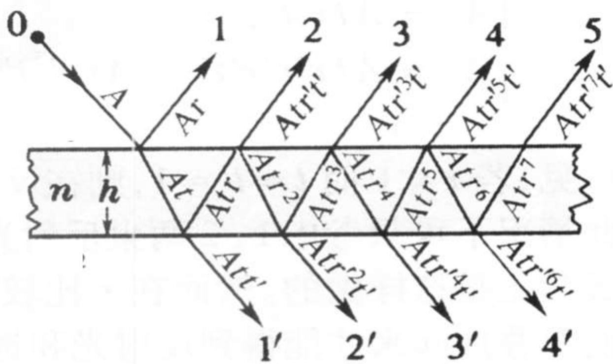

图3-58多次反射和折射时振幅的分割

振幅关系：

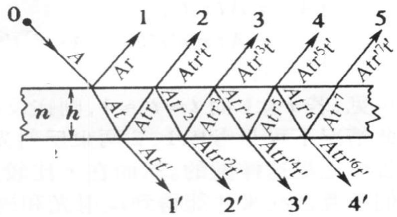

图3-58多次反射和折射时振幅的分割

反射光

$$
\left\{ \begin{array}{l} A _ {1} = A r \\ A _ {2} = A t r ^ {\prime} t ^ {\prime} \\ A _ {3} = A t r ^ {\prime 3} t ^ {\prime} \\ A _ {4} = A t r ^ {\prime 5} t ^ {\prime} \\ \dots \quad \dots \end{array} \right.
$$

透射光

$$
\left\{ \begin{array}{l} A _ {1} ^ {\prime} = A t t ^ {\prime} \\ A _ {2} ^ {\prime} = A t t ^ {\prime} r ^ {\prime 2} \\ A _ {3} ^ {\prime} = A t t ^ {\prime} r ^ {\prime 4} \\ A _ {4} ^ {\prime} = A t t ^ {\prime} r ^ {\prime 6} \\ \dots \quad \dots \end{array} \right.
$$

相位关系

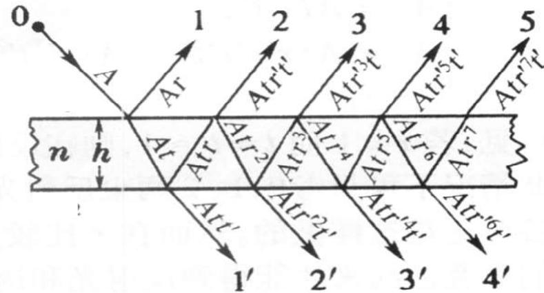

图3-58多次反射和折射时振幅的分割

L  2nhcosi ，不计相位突变 $\delta = \frac { 2 \pi } { \lambda } \Delta L = \frac { 4 \pi n h \cos i } { \lambda }$ 

反
射
光

$$
\left\{ \begin{array}{l} \widetilde {U} _ {1} = A r \\ \widetilde {U} _ {2} = A t r ^ {\prime} t ^ {\prime} e ^ {i \delta} \\ \widetilde {U} _ {3} = A t r ^ {\prime 3} t ^ {\prime} e ^ {i 2 \delta} \\ \widetilde {U} _ {4} = A t r ^ {\prime 5} t ^ {\prime} e ^ {i 3 \delta} \\ \dots \quad \dots \end{array} \right.
$$

透
射
光

$$
\left\{ \begin{array}{l} \widetilde {U} _ {1} ^ {\prime} = A t t ^ {\prime} \\ \widetilde {U} _ {2} ^ {\prime} = A t t ^ {\prime} r ^ {2} e ^ {i \delta} \\ \widetilde {U} _ {3} ^ {\prime} = A t t ^ {\prime} r ^ {4} e ^ {i 2 \delta} \\ \widetilde {U} _ {4} ^ {\prime} = A t t ^ {\prime} r ^ {6} e ^ {i 3 \delta} \\ \dots \quad \dots \end{array} \right.
$$

总的反射光和透射光：

$$
\left\{ \begin{array}{l} \widetilde {U} _ {R} = \sum_ {j = 1} ^ {\infty} \widetilde {U} _ {j} \\ \widetilde {U} _ {T} = \sum_ {j = 1} ^ {\infty} \widetilde {U} _ {j} ^ {\prime} \end{array} \Rightarrow \left\{ \begin{array}{l} I _ {R} = \widetilde {U} _ {R} \cdot \widetilde {U} _ {R} ^ {*} \\ I _ {T} = \widetilde {U} _ {T} \cdot \widetilde {U} _ {T} ^ {*} \end{array} \right. \right.
$$

等比数列之和：

$$
\widetilde {U} _ {T} = \frac {A t t ^ {\prime}}{1 - r ^ {\prime 2} e ^ {i \delta}} \xrightarrow [ R = r ^ {2} ]{r = - r ^ {\prime}, r ^ {2} + t t ^ {\prime} = 1} I _ {T} = \frac {I _ {0}}{1 + \frac {4 R \sin^ {2} \left(\frac {\delta}{2}\right)}{\left(1 - R\right) ^ {2}}}
$$

反射光光强：

$$
I _ {R} = I _ {0} - I _ {T} = \frac {I _ {0}}{1 + \frac {\left(1 - R\right) ^ {2}}{4 R \sin^ {2} \left(\frac {\delta}{2}\right)}}
$$

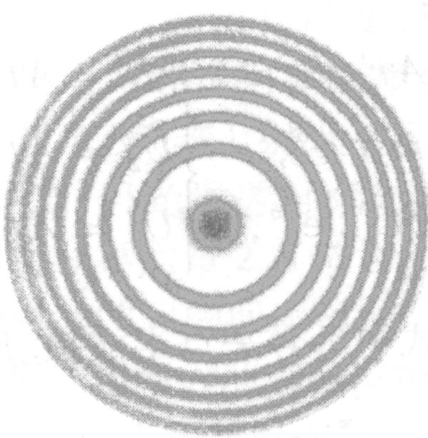

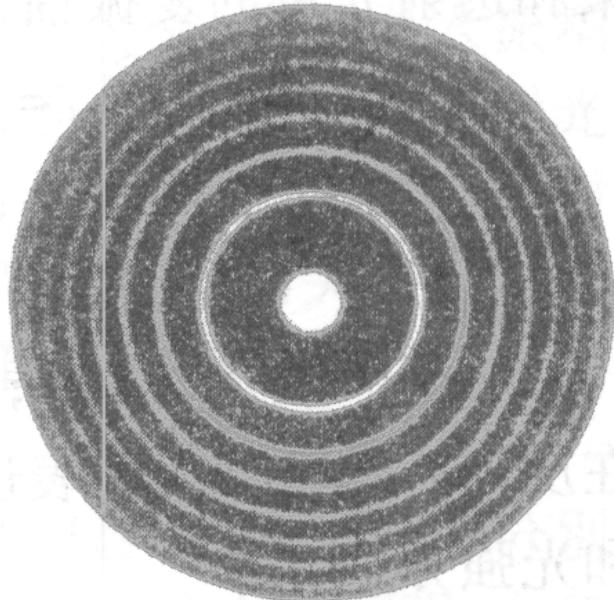

$3 \cdot - 5 9$

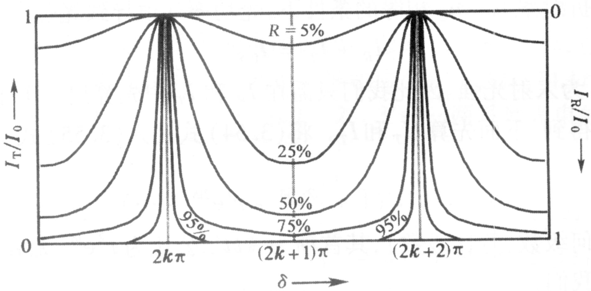

$3 ~ - 6 0$

法不里－珀罗干涉仪：

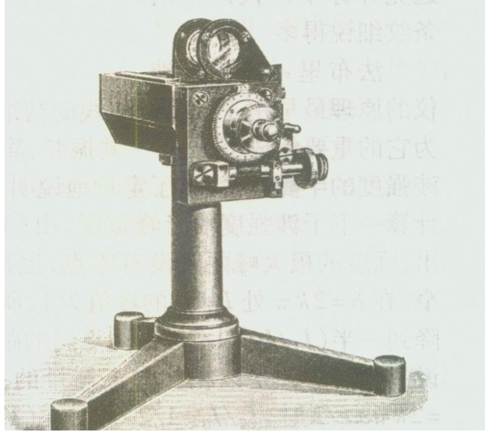

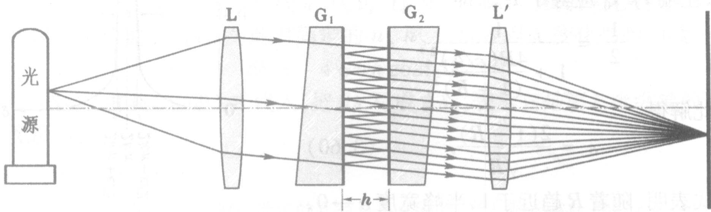

$3 \ : - \ : 6 2 \ :$

值得关注的两个特点是

(1)单界面光强反射率R,

作为一个重要参数，影响着多光束干涉

光强曲线I（8）的峰值锐度。

(2)相位差8是个宗(变)量

$$
\delta = \frac {2 \pi}{\lambda} 2 n h c o s \theta . \quad (n h, \lambda , \theta),
$$

于是，a.光源扩展、单色， 则

$$
\delta (\theta) \rightarrow I _ {T} (\theta) \text {曲 线}
$$

条纹细锐，用于分辨谱线.

# ·FP仪用于分辨超精细光谱

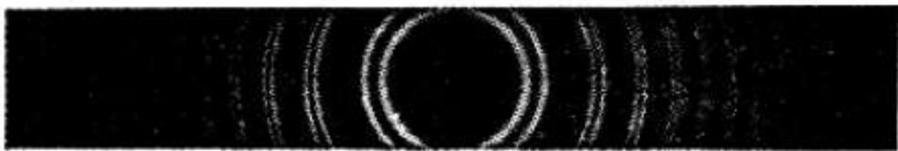

双谱线形成的法布里—珀罗干涉条纹

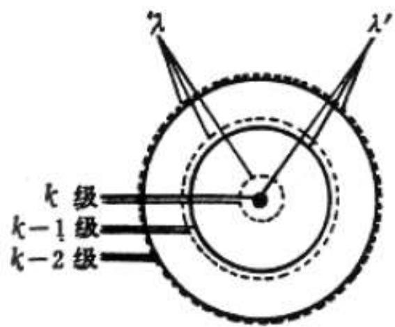

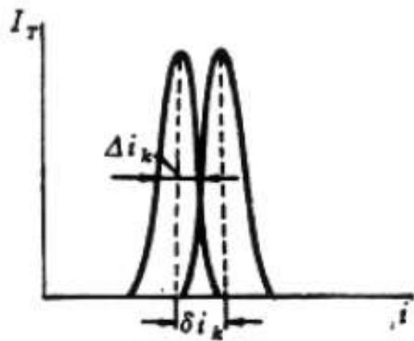

b.光源非单色、平行光照明(θ单一)，则S(）→I(）曲线

选频效应、选择波长、压缩线宽.

FP谐振腔的选频功能

装置与光谱图

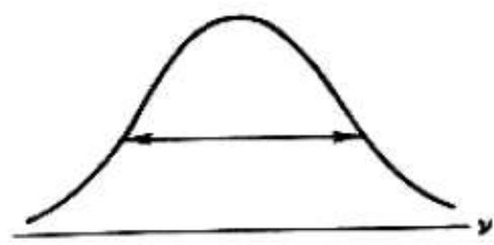

（a）输人光谱

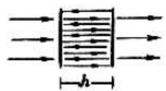

（b)FP谐振腔

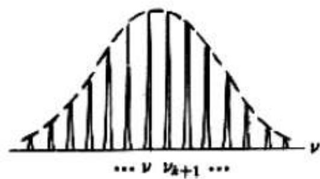

$\mathbf { \Pi } ( \mathrm { c } )$ 输出光谱

图4.58

▲纵模间隔 (平行光正人射,0=0)

透射相干极强的波长条件，

$$
\lambda_ {k} = \frac {2 n h}{k},
$$

即 频率条件为

$$
\nu_ {k} = k \frac {c}{2 n h}, \quad \text {“ 等 间 隔 ”}
$$

$$
\nu_ {k} = \nu_ {k + 1} - \nu_ {k} = \frac {c}{2 n h}, \quad “ 纵 楔 间 隔 ”,
$$

“短腔长，频差大”

# *第三章

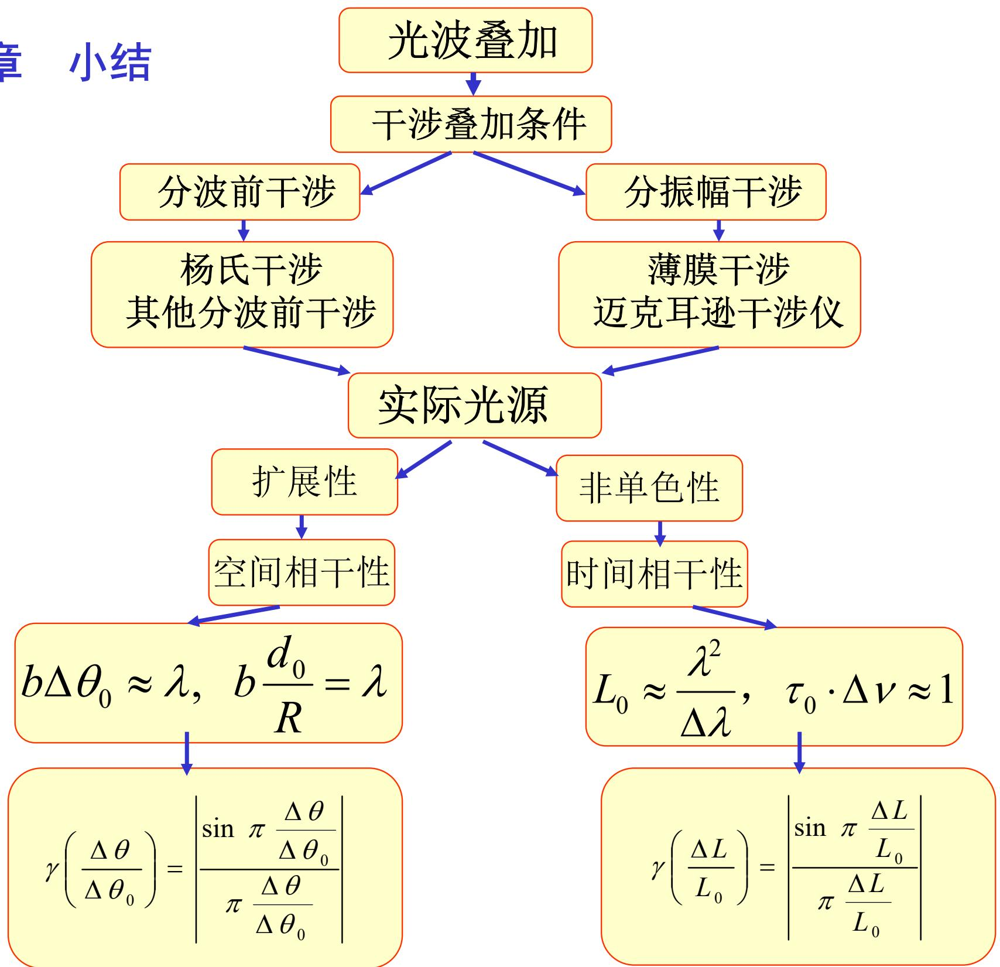
