# 第五章 光的衍射

# 第五章 光的衍射

1、 惠更斯-菲涅耳原理

2、 圆孔和圆屏菲涅耳衍射、波带片

3、 夫琅禾费单缝衍射

4、 夫琅禾费圆孔衍射和光学仪器的分辨本领

5、 位移-相移定理

6、 一维光栅、二维光栅

7、三维光栅—x射线晶体衍射

光的衍射：当光波遇到障碍物时，会偏离几何光学的直线传播而绕行的现象称为光的衍射(diffraction of light).

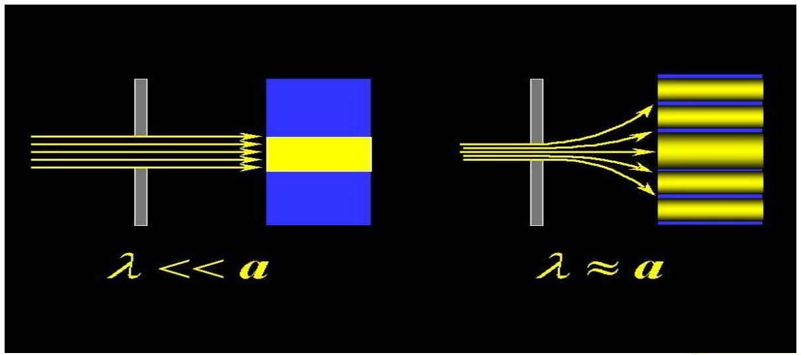

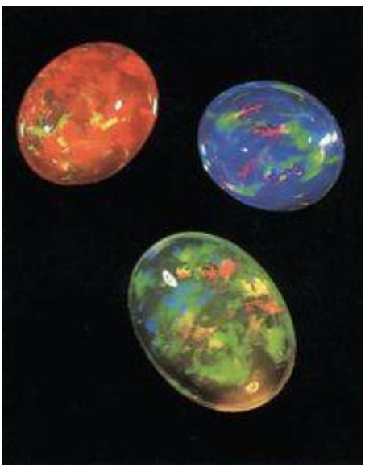

在欧泊石的内部，由无数规则的二氧化硅球粒一间隙形成了很多的三维衍射光栅，当光线射入到欧泊石内部时，发生了光线的衍射，衍射的角度随波长的变化而变化，从而在不同的角度可见不同的颜色，亦就是所谓的变彩。

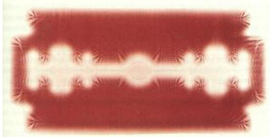

剃须刀片的衍射现象

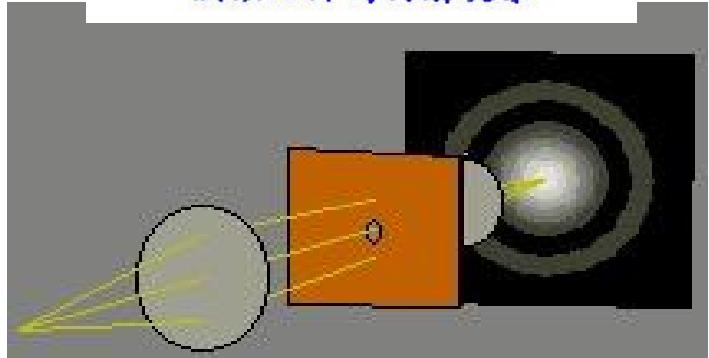

# 衍射的一般特点：

# 1、限制与展宽

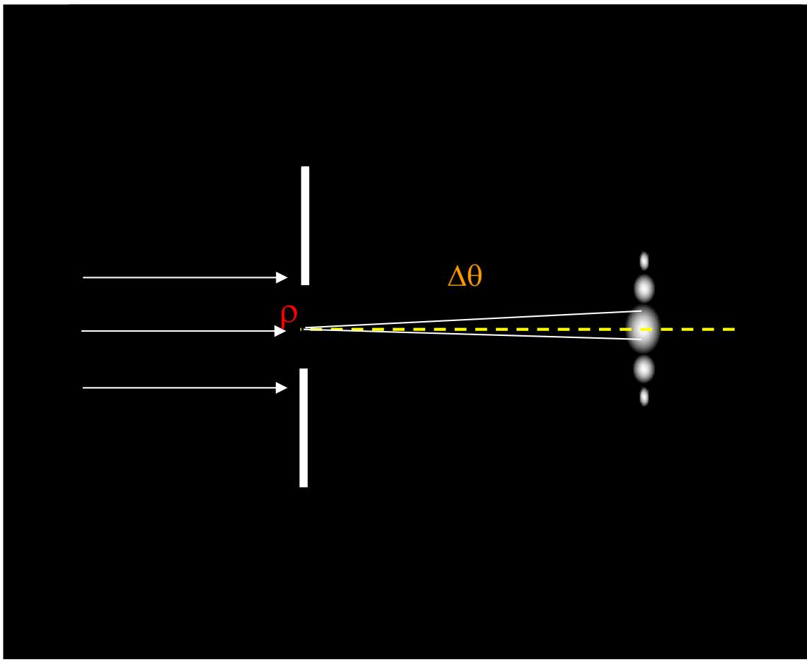

(1)“限制与扩展”～△θ衍射发散角，

(2)缝宽与波长～敏感因素，

$$
\rho \downarrow \triangle \theta \uparrow ; \lambda \uparrow , \triangle \theta \uparrow .
$$

(3)实验上(今后，理论上)，给出

$$
\rho \cdot \triangle \theta \approx \lambda
$$

# 衍射程度被粗分为三档

$( 1 ) \rho > 1 0 ^ { 3 } \lambda \downarrow \downarrow . \downarrow . ,$ 

衍射现象很不明显，近乎直线传播；

但边缘衍射效应仍不可忽视。

$( 2 ) 1 0 ^ { 3 } \lambda > \rho > \lambda ,$ 

衍射现象显著，出现衍射花样

(3)p≤λ, 

衍射现象过于明显向散射过渡。

2、衍射图样和衍射屏的结构一一对应，结构越细微，相应的衍射图样越扩大。

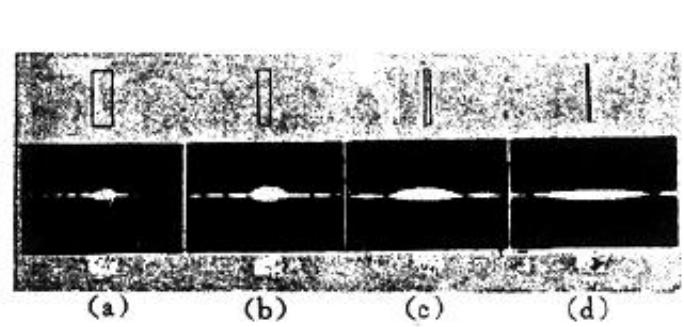

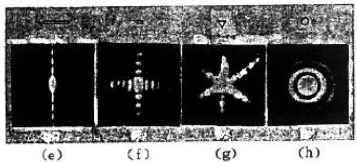

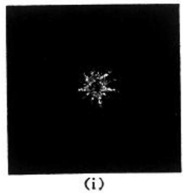

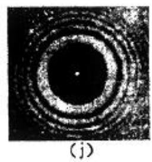

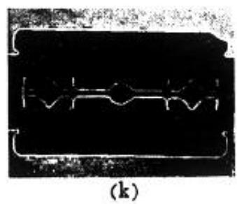

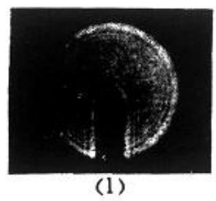

图2.41各种光孔的衍射图样

(a)-(d)可调单狭缝远场衍射图样； ${ \mathrm { ( e ) } } \mathrm { - } { \mathrm { ( h ) } }$ 从矩孔到圆孔远场衍射图样；（i）多边孔（相机光圈）远场衍射图样；（j）圆屏近场衍射图样；(k)刮胡刀片近场衍射图样；(1)圆孔中有尖钉近场衍射图样

# 微结构

# 衍射图样

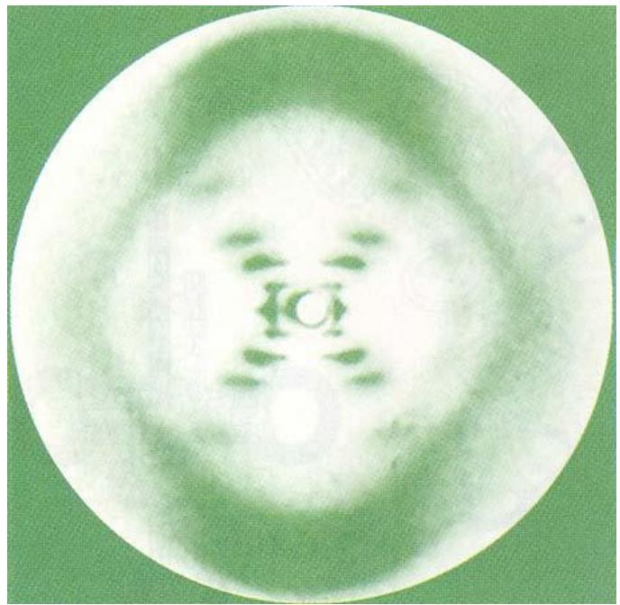

DNA的X光衍射照片

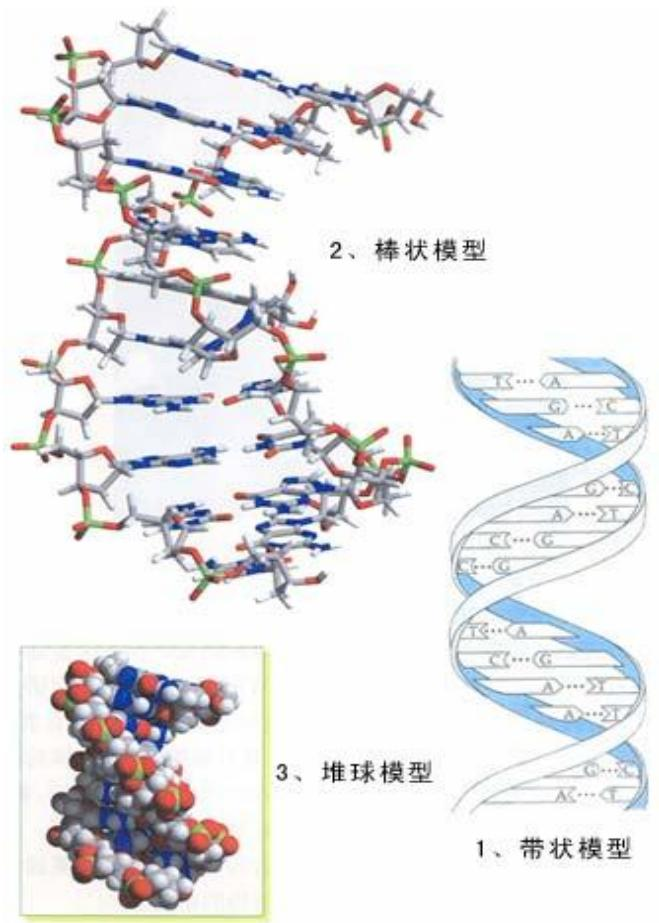

# 创新需要多学科交叉

克里克、沃森、威尔金斯，1962年 诺贝尔奖。研究DNA结构的都是物理学家或化学家，所以，有人说：是物理学“剑走偏锋”，助产了现代生物学。

# 惠更斯-菲涅耳原理

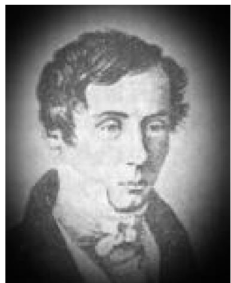

菲涅耳

菲涅耳是法国物理学家和铁路工程师。 1788年5月10日生于布罗利耶，1806年毕业于巴黎工艺学院，1809年又毕业于巴黎桥梁与公路学校。1823年当选为法国科学院院士，1825年被选为英国皇家学会会员。1827年7月14日因肺病医治无效而逝世，终年仅39岁。

（Augustin-Jean Fresnel 1788-1827） 

菲涅耳的科学成就主要有两个方面。一是衍射。他以惠更斯原理和干涉原理为基础，用新的定量形式建立了惠更斯--菲涅耳原理，完善了光的衍射理论。另一成就是偏振。他与D.F.J.阿拉果一起研究了偏振光的干涉，确定了光是横波（1821年）；他发现了光的圆偏振和椭圆偏振现象（1823年），用波动说解释了偏振面的旋转；他推出了反射定律和折射定律的定量规律，即菲涅耳公式；解释了马吕斯的反射光偏振现象和双折射现象，奠定了晶体光学的基础。

# 惠更斯原理

光扰动同时到达的空间曲面被称为波面或波前，波前上的每一点都可以看成一个新的扰动中心，称为子波源或次波源，次波源向四周发出次波；下一时刻的波前是这些大量次波面的公切面，或称为包络面；次波中心与其次波面上的那个切点的连线方向给出了该处光传播方向。

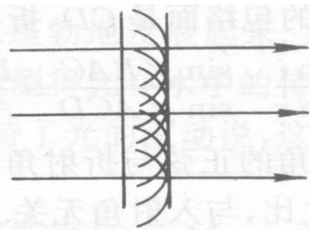

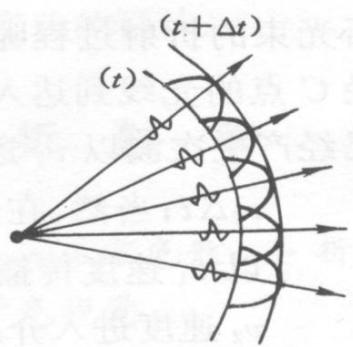

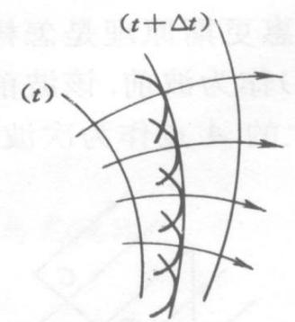

惠更斯原理的不足：

没有回答光振幅的传播问题

没有回答光相位的传播问题

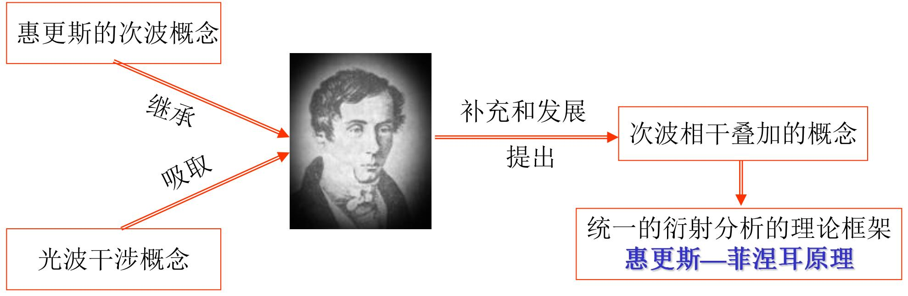

# 惠更斯—菲涅耳原理

波前上的每个面元都可以看成次波源，它们向四周发射次波；波场中任一场点的扰动都是所有次波源所贡献的次级扰动的相干叠加

惠更斯—菲涅耳原理的数学表示：

$$
\widetilde {U} (P) = \oiint_ {(\Sigma)} d \widetilde {U} (P)
$$

$$
d \tilde {U} (P) =???
$$

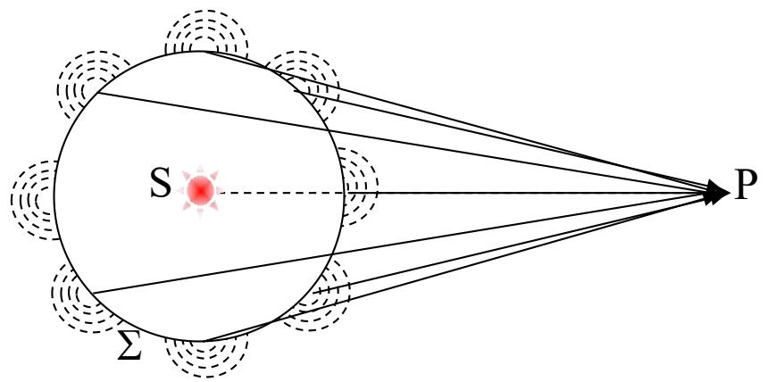

菲涅耳原理的实质 -无源空间边值定解，即波前决定一切，决定观测结果；其推论- 当再现或重构相同的波前，必将再现相同的观测结果，即使原物不复存在——此乃全息术之思想基础。

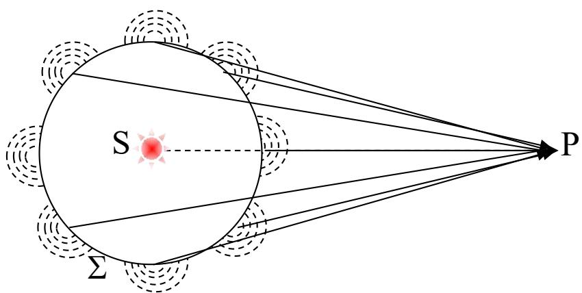

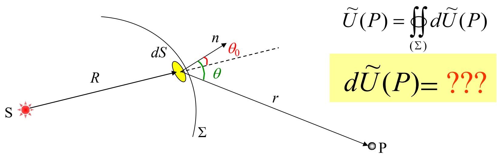

基于物理上的基本概念 考虑， $d \widetilde U ( P )$ 决定于：

的微 分面元

e 波到 达场点

面源 的发射非各向同性

引进一个比例常数，根据分析，惠更斯—菲涅耳原理的数学表达式写成：

$$
\widetilde {U} (P) = \underset {\left. \begin{array}{l} K \\ \Sigma \end{array} \right\}} {K} \oiint_ {(\Sigma)} f (\theta_ {0}, \theta) \widetilde {U} _ {0} (Q) \frac {e ^ {i k r}}{r} d S
$$

# 基尔霍夫衍射积分公式： 定态亥姆霍思方程，利用格林函数，在远场区域，解无源空间边值定解积分表达式

基尔霍夫，(G.R. Kirchhoff, 1824—1887) 德国物理学家。

$$
\widetilde {U} (P) = \frac {- i}{\lambda} \oiint_ {(\Sigma)} \frac {(\cos \theta_ {0} + \cos \theta)}{2} \widetilde {U} _ {0} (Q) \frac {e ^ {i k r}}{r} d S
$$

和菲涅耳的衍射积分公式的主体结构是相同的，基尔霍夫的新贡献是：

明确了倾斜因子，(1) $f ( \theta _ { 0 } , \theta ) = \frac { \cos \theta _ { 0 } + \cos \theta } { 2 } ,$ 闭合面上的各个次波源 均对场点扰动有贡献

给出了比例系数，(2)  1 2ieiK $K = \frac { - i } { \lambda } = \frac { 1 } { \lambda } e ^ { - i \frac { \pi } { 2 } }$ 

 明确指出，积分面 不限于等相面，可以是(3) ( )隔离光源和场点的任意 闭合曲面。

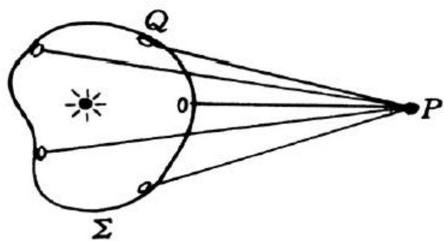

(a)

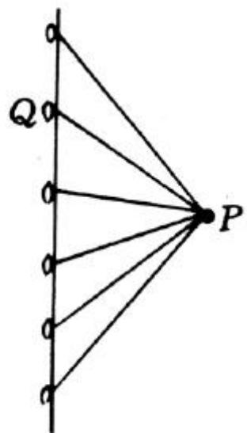

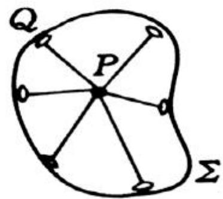

(b)

衍射积分面 闭合波前的几种选择

基尔霍夫边界条件(假设)

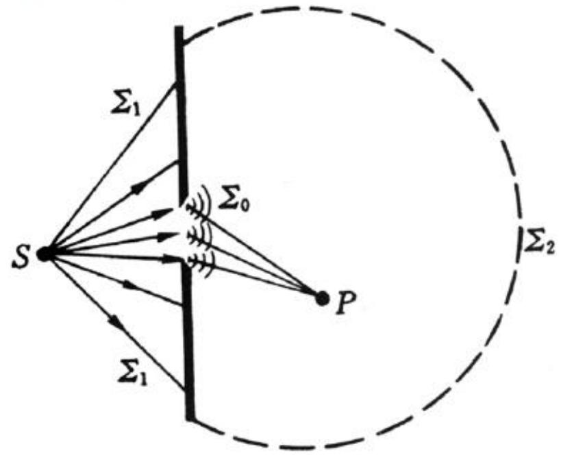

图2.35说明基尔霍夫边界条件

闭合面

$$
(\Sigma) = \Sigma_ {0} + \Sigma_ {1} + \Sigma_ {2}
$$

对衍射场的贡献：

(1)无穷远面 $\begin{array} { r } { \sum _ { 2 } \longrightarrow \widetilde { U } _ { 2 } ( P ) \approx 0 , } \end{array}$ 

(2)光屏面 $\begin{array} { r } { \sum _ { I } \longrightarrow \widetilde { U } _ { I } ( P ) \approx 0 , } \end{array}$ 

(3)光孔面 $\Sigma _ { O }$ ,其上源函数

U(Q)=U(Q),无屏时的源函数，

“假说,合理性，自洽性,可证实性”。

实验检测表明：理论式

$$
\tilde {U} (P) = \frac {- i}{\lambda} \iint_ {(\Sigma_ {0})} \frac {1}{2} (\cos \theta_ {0} + \cos \theta) \tilde {U} _ {0} (Q) \frac {e ^ {i k r}}{r} d s
$$

与实验结果符合得很好。

称其“菲涅耳—基尔霍夫衍射积分”

傍轴条件下，衍射积分表达式，

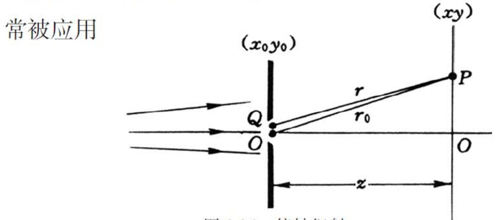

图2.36傍轴衍射

坐标原点0，次波源 $Q ( x _ { O } , y _ { o } )$ ，场点P(x,y),

傍轴 $\theta _ { o } , \ \theta < 0 . 4 \ r a d _ { \circ }$ 

$\frac { 1 } { 2 } ( c o s \theta _ { o } + c o s \theta ) \approx 1 ,$ 

$$
\frac {1}{r} e ^ {i k r} \approx \frac {1}{z} e ^ {i k r},
$$

于是

$$
\widetilde {U} (P) \approx \frac {- i}{\lambda z} \iint_ {(\sum_ {0})} \widetilde {U} _ {0} (Q) e ^ {i k r} d s
$$

强调指出：

不同的光孔形状(Σ）、不同的瞳函数UQ)，将产生不同的衍射场U(P)，而积分核eir总是这个形式。

衍射系统

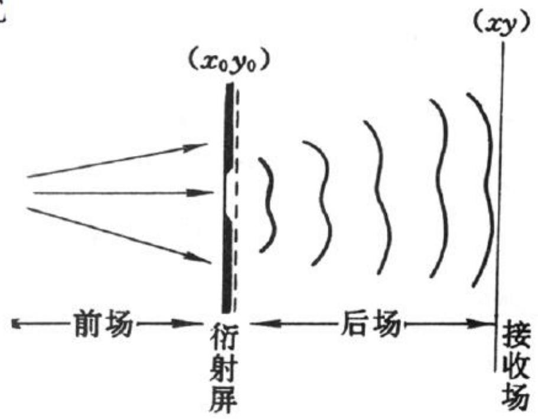

图2.37衍射系统

前场一照明空间，照明波一般较简单，后场一衍射空间，衍射波一般较复杂。

理论目标是

$\smash { \widetilde { U } ( x _ { 0 } , y _ { 0 } ) \longrightarrow \widetilde { U } ( x , y ) }$ 

# ·分类

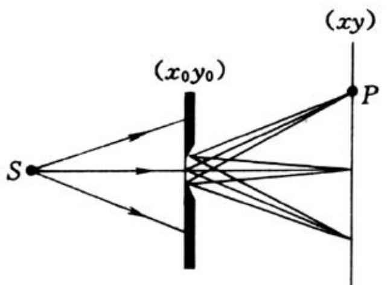

(a)

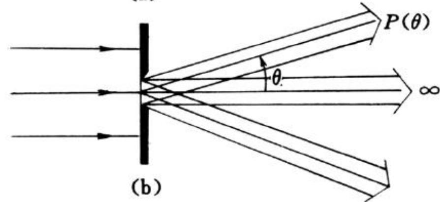

菲涅耳衍射，源或接收面之一与衍射屏的距离为有限远；

夫琅禾费衍射 -源与接收面均距离衍射屏无限远(无透镜条件下)。

图2.38（a）菲涅耳衍射，（b）夫琅禾费衍射

# 衍射巴比涅原理(互补衍射屏）

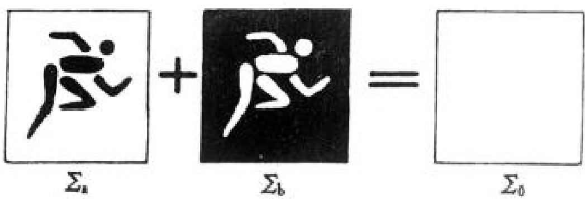

图2.39巴比涅原理中的一对互补屏

衍射屏 $\Sigma _ { \mathrm { a } } + \Sigma _ { \mathrm { b } } { = \Sigma _ { 0 } }$ 自由畅通

$$
\begin{array}{l} \widetilde {U} (P) = \frac {- i}{\lambda} \oiint_ {(\Sigma_ {0} = \Sigma_ {a} + \Sigma_ {b})} \frac {(\cos \theta_ {0} + \cos \theta)}{2} \widetilde {U} _ {0} (Q) \frac {e ^ {i k r}}{r} d S \\ = \frac {\frac {- i}{\lambda} \iint_ {(\Sigma_ {a})} \frac {(\cos \theta_ {0} + \cos \theta)}{2} \widetilde {U} _ {0} (Q) \frac {e ^ {i k r}}{r} d S + \frac {- i}{\lambda} \iint_ {(\Sigma_ {b})} \frac {(\cos \theta_ {0} + \cos \theta)}{2} \widetilde {U} _ {0} (Q) \frac {e ^ {i k r}}{r} d S}{\widetilde {U} _ {a} (P) + \widetilde {U} _ {b} (P)} = \widetilde {U} (P) \\ \end{array}
$$

意义：一旦求得 $\widetilde { U } _ { a } ( P )$ 场，则其互补屏之衍射场就容易地获$\begin{array} { r l r } { \mathcal { \hat { H } } , } & { { } } & { \mathcal { \tilde { U } } _ { b } ( P ) = \mathcal { \tilde { U } } _ { o } ( P ) - \mathcal { \tilde { U } } _ { a } ( P ) , } \end{array}$ 

因为自由场 $\widetilde { U } _ { o } ( P )$ 通常显而易见。

强调指出：用“矢量图解"语言表达巴俾涅原理，三者是“三角关系”

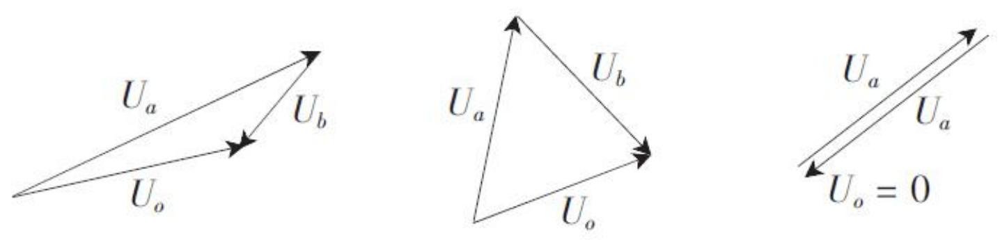

图2.40巴比涅原理的矢量图解

例题：夫琅禾费衍射

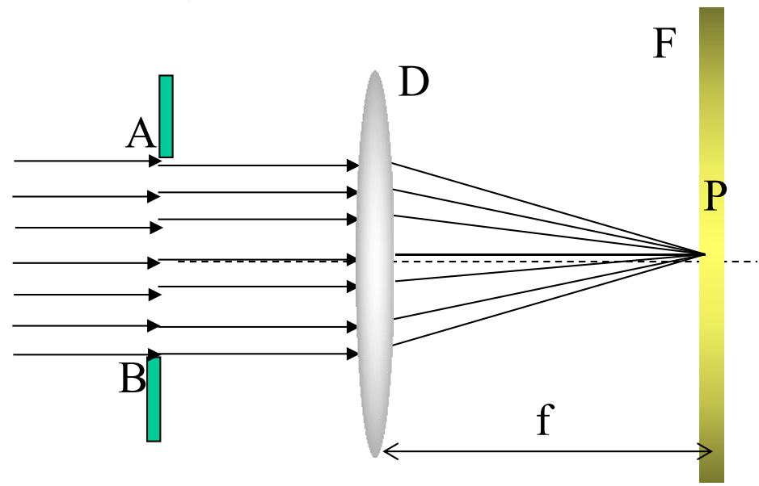

$$
\widetilde {U} _ {a} (P) + \widetilde {U} _ {b} (P) = \widetilde {U} (P)
$$

除后焦点，轴外自由光场 $\widetilde U ( P ) = 0$ 

$$
\widetilde {U} _ {a} (P) = - \widetilde {U} _ {b} (P) \quad \text {I I I} \longrightarrow \quad I _ {a} (P) = I _ {b} (P)
$$

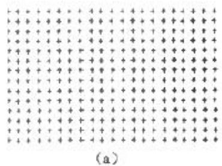

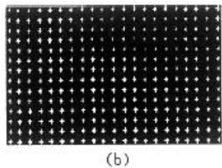

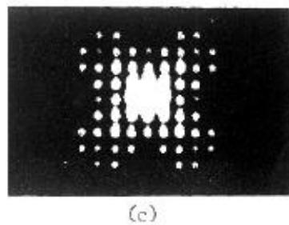

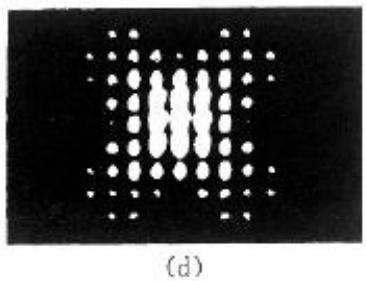

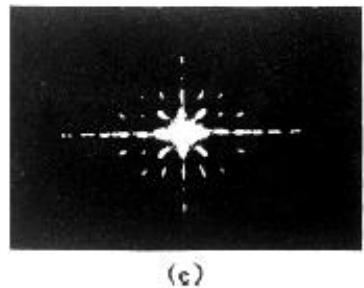

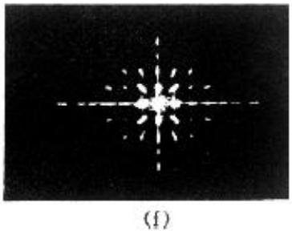

图2.43

# 圆孔和圆屏菲涅耳衍射、波带片

*衍射图样及其特征

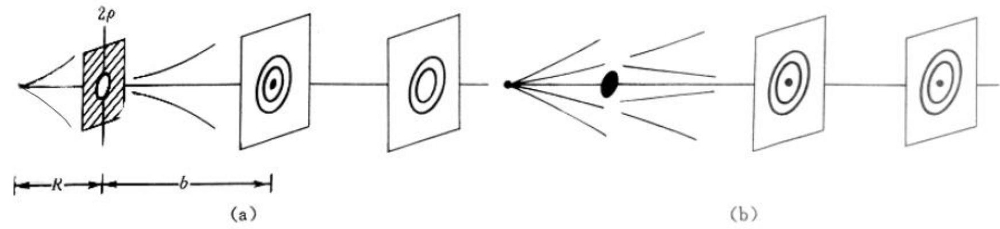

图2.44（a）圆孔菲涅耳衍射，（b）圆屏菲涅耳衍射

光波长λ~600nm,

衍射现象显著，当

$$
\rho \sim m m, R. b \sim m, 1 m - 1 0 m.
$$

衍射图样，轴对称性 同心衍射环

轴上光强I(P)的变化特点：

b不变，ρ/，Ip）周期性变化，反应敏感；

p不变，b/,I(p)也将周期性变化，反应迟钝；

当b很大(远场)时，I(P)，无起伏。

今人惊奇的是，对于圆屏衍射

不论p变,或b变，IP）总是一个亮斑！

■1818年，法兰西科学院，发起悬赏征文，

主题：<对光的衍射现象的说明)

评委由 拉普拉斯、毕奥、泊松；

阿喇戈和盖吕萨克 组成

前三位均信奉 光的微粒说，

菲涅耳提出“光波动说”,并以“次波相干叠加"说明光的衍射。

泊松立即据此计算出圆屏衍射有一中心亮斑，“泊松斑” 不可思议！ 以否定菲涅耳的衍射原理。

阿喇戈立即作实验，证明了该亮斑的存在。

菲涅耳由此而获头奖。

对衍射图样及其特征的分析：

（1）半波带方法—对波前次波源的一种特殊编组方式。

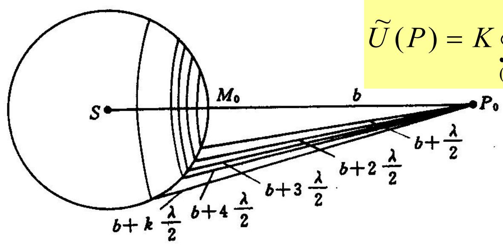

$$
\widetilde {U} (P) = K \oiint_ {(\Sigma)} f (\theta_ {0}, \theta) \widetilde {U} _ {0} (Q) \frac {e ^ {i k r}}{r} d S
$$

图2.39分割波前的半波带方法

以光源s为球心，以R为半径作闭合球面，球面为等相位的波前,点源与场点$\mathbf { P _ { 0 } }$ 的连线通过该波前 $\mathbf { M _ { 0 } }$ 点， $\bf { M _ { 0 } P _ { 0 } } \mathrm { { = } } \bf { b }$ ；尔后以 $\mathbf { P _ { 0 } }$ 为中心，分别以b+/2, b+2/2,b+3/2,…为半径分割波前，形成一系列环带，相邻环带到场点的光程差均为半波长，故称这些环带为半波带。

半波带的面积依次为 $\Delta \Sigma _ { 1 }$ ， $\Delta \Sigma _ { 2 }$ ， $\Delta \Sigma _ { 3 }$ …,对场点的贡献依次为U1，U2，U3…,则总扰动为：

$$
\widetilde {U} \left(P _ {0}\right) = \sum_ {i} \Delta \widetilde {U} _ {i} \quad \text {相 位 关 系}? ? \text {振 幅 关 系}? ?
$$

相位关系：

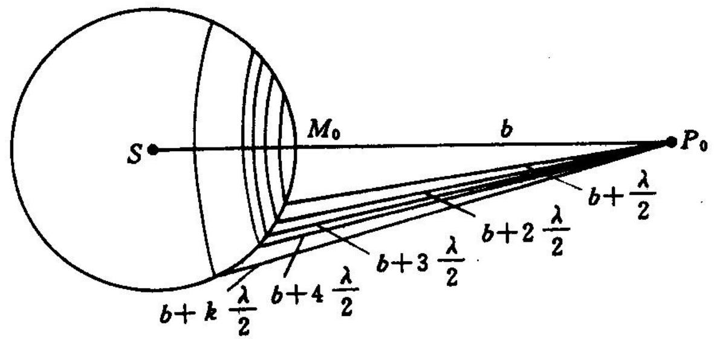

图2.39分割波前的半波带方法

场点到各个半波带的光程差递增/2，故此各个半波带对场点扰动的贡献依次相差，

$$
\Delta \widetilde {U} _ {1} = A _ {1}, \quad \Delta \widetilde {U} _ {2} = - A _ {2}, \quad \Delta \widetilde {U} _ {3} = A _ {3}, \ldots \quad \Delta \widetilde {U} _ {k} = (- 1) ^ {k + 1} A _ {k}, \ldots
$$

则：

$$
\widetilde {U} (P _ {0}) = \sum_ {k} (- 1) ^ {k + 1} A _ {k}
$$

下一个问题，振幅Ak=???？

振幅关系

$$
\widetilde {U} (P) = \frac {- i}{\lambda} \oiint_ {(\Sigma)} \frac {(\cos \theta_ {0} + \cos \theta)}{2} \widetilde {U} _ {0} (Q) \frac {e ^ {i k r}}{r} d S
$$

惠更斯—菲涅耳衍射原理：

$$
A _ {k} \propto f (\theta_ {0}, \theta_ {k}) \frac {\Delta \Sigma_ {k}}{r _ {k}}, f (\theta_ {0}, \theta_ {k}) = \frac {1}{2} \left(\cos \theta_ {0} + \cos \theta\right) \xrightarrow {\cos \theta_ {0} = 1} \frac {1}{2} \left(1 + \cos \theta\right)
$$

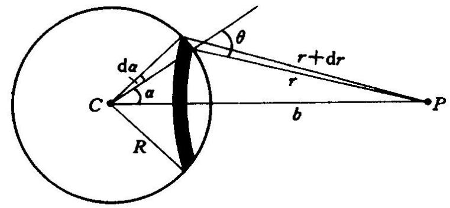

图2.40考量环带面积

球冠面积： $\Sigma = 2 \pi R ^ { 2 } ( 1 { - } \cos \alpha )$ ，于是环带的面积为：

$$
d \Sigma = 2 \pi R ^ {2} \sin (\alpha) d \alpha
$$

三角函数的余弦定理： $\cos \alpha = \frac { R ^ { 2 } + ( R + b ) ^ { 2 } - r ^ { 2 } } { 2 R ( R + b ) } ;$ ，两边求微分： $\sin ( \alpha ) d \alpha = { \frac { r d r } { R ( R + b ) } }$ 

于是： $d \Sigma = \frac { 2 \pi R } { R + b } r d r \propto r$ 

$$
\frac {d \Sigma}{r} = \frac {2 \pi R}{R + b} d r, \text {恰 好 和} r \text {无 关 。}
$$

相邻半波带间的 $\Delta r = \frac { \lambda } { 2 } < < R$ ， 。可用 代替 b r dr    :

$$
\frac {\Delta \Sigma_ {k}}{r _ {k}} \approx \frac {\pi R \lambda}{R + b}, \text {与} k \text {无 关 。}
$$

讨论： $f ( \theta _ { 0 } , \theta _ { k } ) = \frac { 1 } { 2 } \big ( 1 + \cos \theta \big ) = ? ?$ 

结论： $\mathbf { A _ { k } }$ 随着k的增加缓慢减少。缓慢程度可以用一个数值计算来说明：

$$
\lambda \sim 6 0 0 n m, R \sim 1 m, b \sim 1 m, k = 1 0 ^ {4}
$$

$$
\cos \theta_ {k} = \frac {(R + b) ^ {2} - R ^ {2} - (b + k \frac {\lambda}{2}) ^ {2}}{2 R b} \xrightarrow [ k \frac {\lambda}{2} = 3 m m <   <   R , b , \text {所 以 近 似 为 :} ]{\rightarrow \cos \theta_ {k}} \approx 1 - \frac {k \lambda}{2 R} = 1 - 0. 0 0 3
$$

$$
f (\theta_ {1 0 0 0 0}) \approx 1 - 0. 0 0 1 5 = 9. 9 9 8 5 \approx 1, \mathrm {可 以 看 出 倾 斜 因 子 的 变 化 非 常 缓 慢}!!
$$

图2.39分割波前的半波带方法

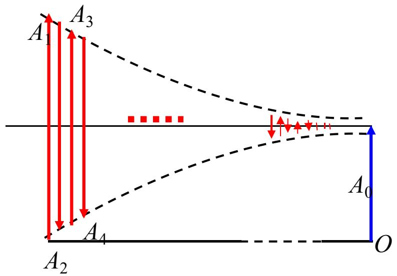

根据相位和振幅分析，画出半波带方法的矢量相干叠加图。如果没有任何屏障，波前是完整的，为自由传播，由矢量可知：

自由光场的振幅：

$$
A _ {0} = \frac {1}{2} A _ {1} \quad \text {或} \quad A _ {1} = 2 A _ {0}
$$

# *利用半波带方法的相干叠加矢量图解对衍射现象的说明

# （1）对于圆孔衍射现象的说明

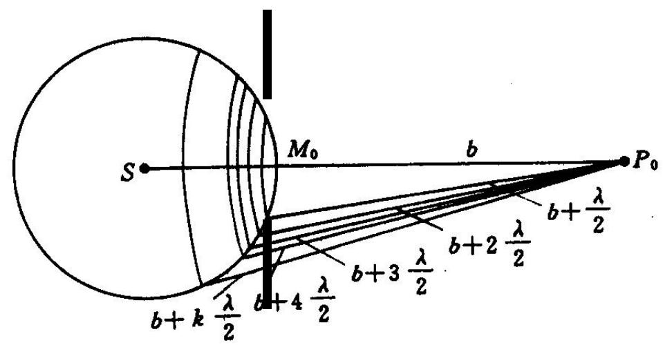

如果k=2m为偶数，

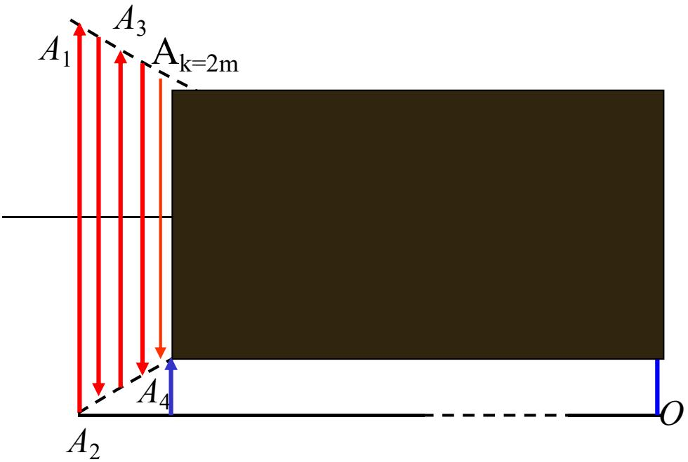

$$
\widetilde {U} (P _ {0}) = A _ {1} - A _ {2} + A _ {3} - A _ {4} + \ldots - A _ {2 m} \approx 0
$$

即轴上衍射光强约等于 0，中心为暗斑。

# *利用半波带方法的相干叠加矢量图解对衍射现象的说明

# （1）对于圆孔衍射现象的说明

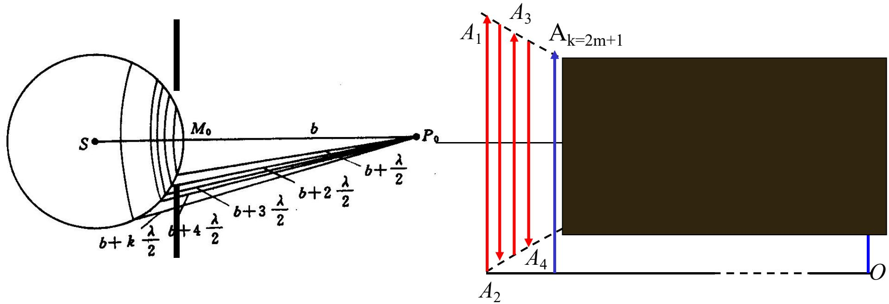

如果k=2m+1为奇数，

$$
\widetilde {U} (P _ {0}) = A _ {1} - A _ {2} + A _ {3} - A _ {4} + \ldots + A _ {2 m + 1} \approx A _ {1} = 2 A _ {0}
$$

即轴上衍射光振幅约等 于 $2 A _ { 0 } .$ ，中心为亮斑。

$$
I (P _ {0}) = 4 A _ {0} ^ {2} = 4 I _ {0}
$$

中心亮斑光强为自由光 强的 倍。4

# *利用半波带方法的相干叠加矢量图解对衍射现象的说明

（2）对于圆屏衍射的泊松亮斑的说明

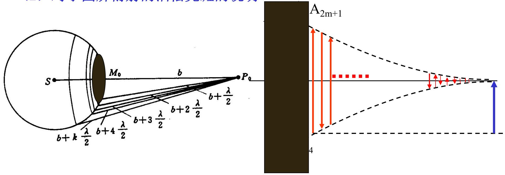

如果k=2m+1为奇数，

$$
\widetilde {U} (P _ {0}) = A _ {2 m + 1} - A _ {2 m + 2} + A _ {2 m + 3} + \ldots \approx A _ {0}
$$

即轴上衍射光振幅约等于 $A _ { 0 }$ ，中心为亮斑。

# *利用半波带方法的相干叠加矢量图解对衍射现象的说明

（2）对于圆屏衍射的泊松亮斑的说明

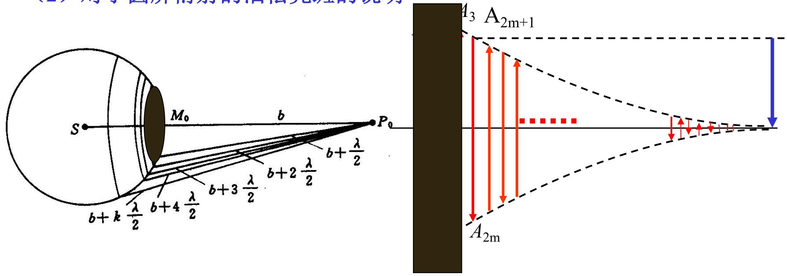

如果k=2m为偶数，

$$
\widetilde {U} (P _ {0}) = - A _ {2 m} + A _ {2 m + 1} - A _ {2 m + 2} + A _ {2 m + 3} + \dots \approx - A _ {0}
$$

即轴上衍射光强约等于 $\boldsymbol { I } _ { 0 } = \left( - \boldsymbol { A } _ { 0 } \right) ^ { 2 }$ ，中心为亮斑。

# 泊松亮斑成像—无透镜成像技术

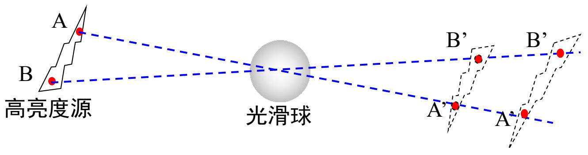

# 泊松成像的特点：

• 使用于高亮度物体的成像

• 泊松成像没有景深限制

• 不存在如透镜色散引起的色像差

*半波带半径公式

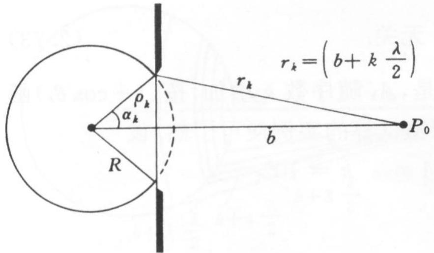

$$
\rho_ {k} = R \sin \alpha_ {k} = R \cdot \sqrt {1 - \cos^ {2} \alpha_ {k}}; \cos \alpha_ {k} = \frac {R ^ {2} + (R + b) ^ {2} - (b + k \frac {\lambda}{2}) ^ {2}}{2 R (R + b)}
$$

所以： $\rho _ { k } = R \sqrt { 1 - \left( \frac { R ^ { 2 } + ( R + b ) ^ { 2 } - ( b + k \frac { \lambda } { 2 } ) ^ { 2 } } { 2 R ( R + b ) } \right) ^ { 2 } } ,$ ，因为 $k \lambda < < R , b$ ，忽略 $( k \lambda ) ^ { 2 }$ 和高阶项，得：

$$
\rho_ {k} = \sqrt {k \frac {R b \lambda}{R + b}} = \sqrt {k} \cdot \rho_ {\mathrm {l}}; \quad \rho_ {\mathrm {l}} = \sqrt {\frac {R b \lambda}{R + b}}
$$

注：k不一定为整数

k 我们反过来再认识公式： $\rho _ { k } = \sqrt { k \frac { R b \lambda } { R + b } } = \sqrt { k } \cdot \rho _ { \mathrm { l } } ,$ ，当圆孔半径 给定时，它所包含的半波带数目 $k$ :可求解

$$
k = \left(\frac {1}{R} + \frac {1}{b}\right) \cdot \frac {\rho^ {2}}{\lambda}
$$

习惯写成：

$$
\frac {1}{R} + \frac {1}{b} = k \frac {\lambda}{\rho^ {2}} = (2 m + 1) \frac {\lambda}{\rho^ {2}} = \frac {1}{\rho^ {2} / (2 m + 1) \lambda} = \frac {1}{f _ {k}}
$$

说明，当屏幕由近至远， $b$ k  增加时， 数减少，时为偶数，时为奇数，也就是轴上光强时暗时亮。

$$
\Delta \rho_ {k} = \rho_ {k + 1} - \rho_ {k} = (\sqrt {k + 1} - \sqrt {k}) \rho_ {1} \approx \frac {1}{2 \sqrt {k}} \rho_ {1}
$$

即半波带越来越密集。

例题：设  600nm，  2mm， $R = 1 m$ ，试问该圆孔包含的半波带的最少数目？

解：

$k = \left( \frac { 1 } { R } { + } \frac { 1 } { b } \right) \cdot \frac { \rho ^ { 2 } } { \lambda } ,$ 当 $b \to \infty$ k时， 为最少；

$k _ { m } = \frac { 1 } { R } \cdot \frac { \rho ^ { 2 } } { \lambda } = \frac { 2 ^ { 2 } } { 1 0 0 0 \times 6 0 0 \times 1 0 ^ { - 6 } } = 6 . 7 ;$ ； 7这个数为非整数，接近奇数 ，

1 7 问题 ：严格包含 个半波带时的纵向距离为多少？

2问题 ： $k$ 为非整数时，如何求衍射光强？

11（）： $+ \frac { 1 } { b } = k \frac { \lambda } { \rho ^ { 2 } } \Rightarrow b = \frac { 1 } { k \frac { \lambda } { \rho ^ { 2 } } - \frac { 1 } { R } } = \frac { R \rho ^ { 2 } } { k \lambda R - \rho ^ { 2 } } =$ b  m20 R 2 0² 

问题2如何求解？？？

# *细致的矢量图解—螺旋式曲线

为了求解k为非整数时的光强，再将每个半波带细分成N个环带，这样：

$$
\Delta \tilde {U} _ {k} = \sum_ {i = 0} ^ {N} \Delta \tilde {U} _ {k i} = \Delta \tilde {U} _ {k 0} \cdot \sum_ {i = 0} ^ {N} e ^ {i \pi \frac {1}{N}}
$$

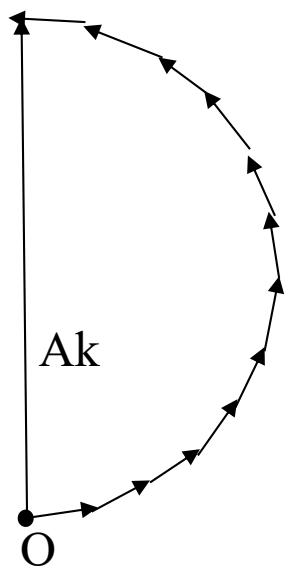

$$
\begin{array}{l} \widetilde {A} = A _ {1} e ^ {i \phi} + A _ {2} e ^ {i \phi + \Delta \varphi} \\ \left| A \right| = \sqrt {\widetilde {A} \cdot \widetilde {A} ^ {*}} = \sqrt {A _ {1} ^ {2} + A _ {2} ^ {2} - 2 A _ {1} A _ {2} \cos \Delta \varphi} \\ \end{array}
$$

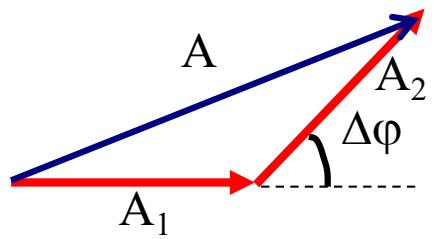

$$
\begin{array}{l} \widetilde {A} = A _ {1} e ^ {i \phi} + A _ {2} e ^ {i \phi + \Delta \varphi} + A _ {3} e ^ {i \phi + 2 \Delta \varphi} \\ \left| A \right| = \sqrt {\widetilde {A} \cdot \widetilde {A} ^ {*}} = \sqrt {A _ {1} ^ {2} + A _ {2} ^ {2} + A _ {3} ^ {2} + 2 \left(A _ {1} A _ {2} + A _ {2} A _ {3}\right) \cos \Delta \varphi + 2 A _ {1} A _ {3} \cos 2 \Delta \varphi} \\ \end{array}
$$

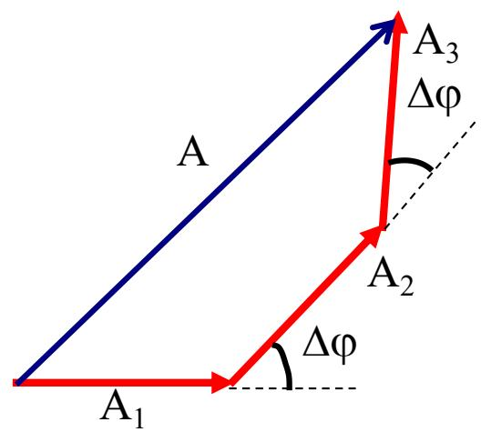

i A  Ae 代表一个矢量：

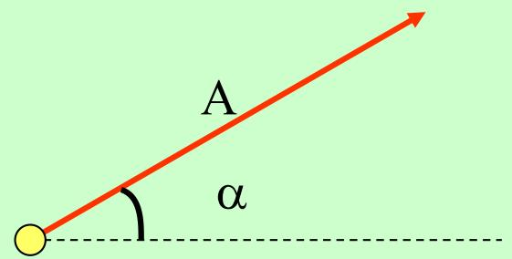

$$
\Delta \tilde {U} _ {k} = \sum_ {i = 0} ^ {N} \Delta \tilde {U} _ {k i} = \Delta \tilde {U} _ {k 0} \cdot \sum_ {i = 0} ^ {N} e ^ {i \pi \frac {1}{N}},
$$

可等效为 $N$ 个小矢量的和，相位代表各小矢量的方向，首尾衔接形成半个多边形当 $N  \infty$ 时，半个多边形过度成半圆。

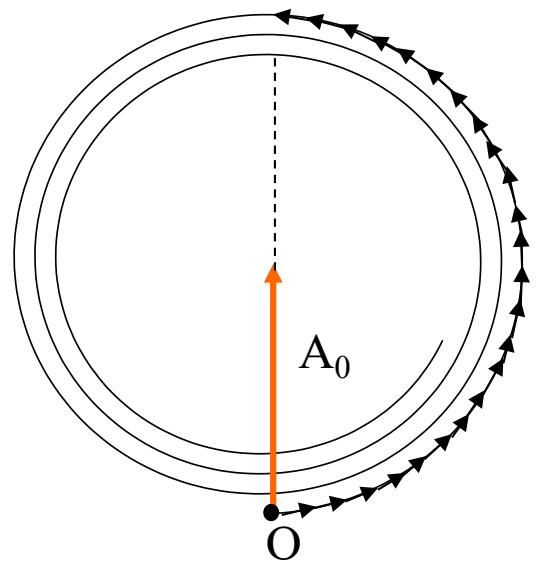

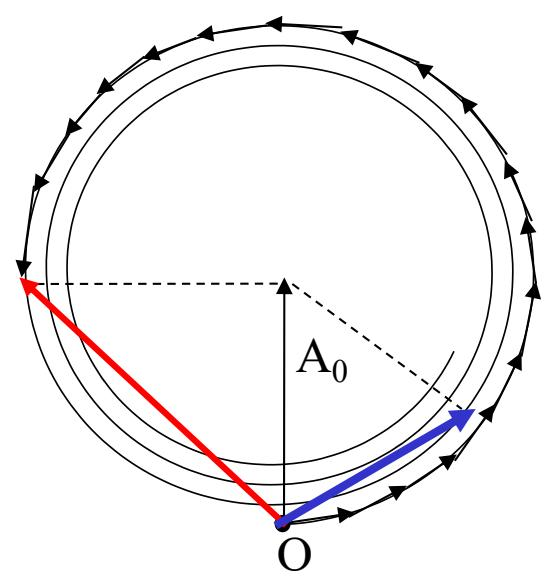

求解k为非整数的衍射光强：

k 1.5时，光强？

$A _ { 1 . 5 } = \sqrt { 2 } A _ { 0 } ,$ ，光强 $I _ { 1 . 5 } = \left( \sqrt { 2 } A _ { 0 } \right) ^ { 2 } = 2 I _ { 0 }$ 

k  2.25时，光强？

2.25 0 8A 2 A sin ，光强 $I _ { 2 . 2 5 } = \left( 2 A _ { 0 } \sin \frac { \pi } { 8 } \right) ^ { 2 } \approx 0 . 6 I _ { 0 }$ 

应用矢量图，可以解释圆屏衍射那个泊松斑.

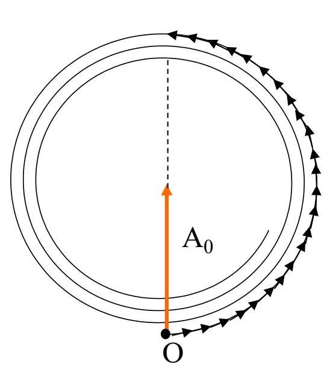

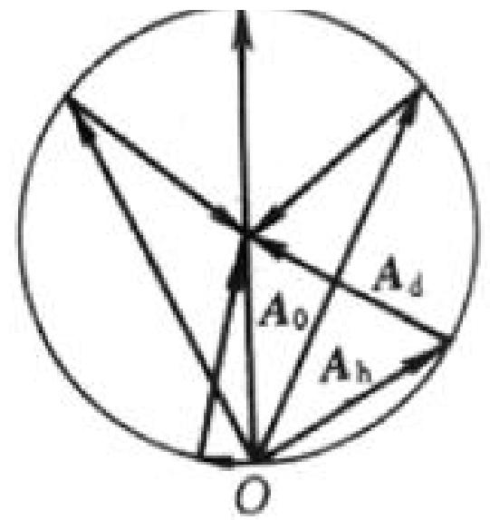

(圆屏)互补 (圆孔),应用巴俾涅原理,

$$
\widetilde {U} _ {\text {d i s k}} + \widetilde {U} _ {\text {h o l e}} = \widetilde {U} _ {0},
$$

即 Ad $\mathbf { \nabla } + \mathbf { A } _ { h } = \mathbf { A } _ { o } ~ , ~ \exists \mathbf { \hat { \zeta } } \cdot \mathbf { \nabla } \mathbf { A } _ { d } = \mathbf { A } _ { h } - \mathbf { A }$ 

可见，圆屏场(矢量),起点在螺旋线上，而端点始终指向螺旋中心，随圆屏半径增加，该矢量长度缓慢收缩，当p不太大时， $A _ { d } \approx A _ { o }$ 光强IP)~I（P），泊松斑。

*用基尔霍夫积分公式求圆孔菲涅耳衍射轴上光强变化函数

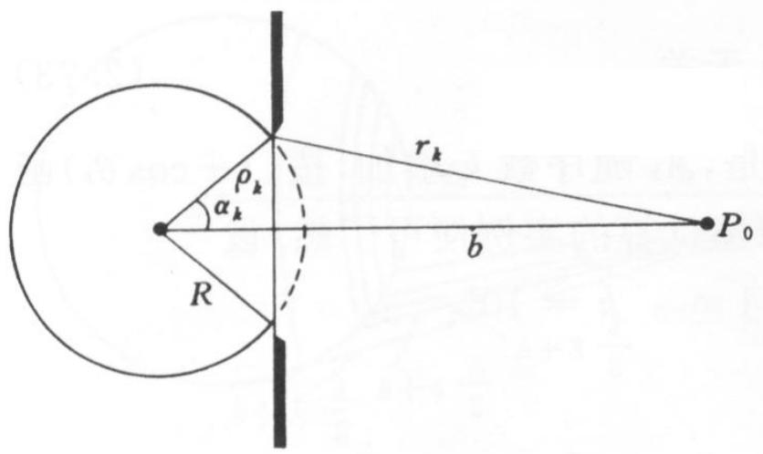

$$
\widetilde {U} (b) = \frac {- i}{\lambda} \iint_ {\Sigma_ {0}} \frac {(\cos \theta_ {0} + \cos \theta)}{2} \widetilde {U} _ {0} (Q) \frac {e ^ {i k r}}{r} d S
$$

$\frac { d S } { r } = \frac { 2 \pi R } { R + b } d r ,$ ， $\widetilde { U } _ { \scriptscriptstyle 0 } ( Q ) = \frac { a } { R } e ^ { i k R } ,$ e a   ，这里 为常数，

在傍轴条件下， $f ( \theta _ { 0 } , \theta ) \approx 1$ 

于是：

$$
\widetilde {U} (b) = \frac {- i}{\lambda} \frac {2 \pi R}{R + b} \cdot \frac {a}{R} e ^ {i k R} \int_ {b} ^ {r _ {k}} e ^ {i k r} d r = - \frac {a}{R + b} e ^ {i k R} \left(e ^ {i k r _ {k}} - e ^ {i k b}\right)
$$

$$
I (b) = \widetilde {U} (b) \cdot \widetilde {U} (b) ^ {*} = \left(\frac {a}{R + b}\right) ^ {2} \left(2 - 2 \cos k (r _ {k} - b)\right) = 4 \left(\frac {a}{R + b}\right) ^ {2} \sin^ {2} \left(k \frac {r _ {k} - b}{2}\right)
$$

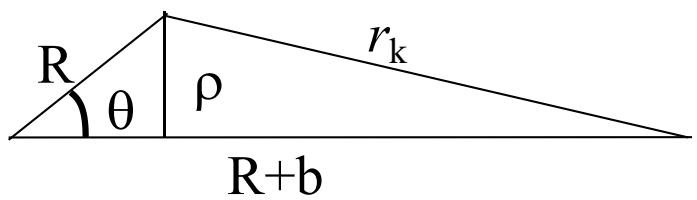

$$
r _ {k} = \sqrt {R ^ {2} + (R + b) ^ {2} - 2 R (R + b) \cos \theta} = \sqrt {R ^ {2} + (R + b) ^ {2} - 2 R (R + b) \sqrt {1 - \frac {\rho^ {2}}{R ^ {2}}}}
$$

傍轴条件， $\rho < < R , b$ ，于是： $r _ { k } = b + { \frac { 1 } { 2 } } { \frac { ( R + b ) \rho ^ { 2 } } { R b } }$ 

$$
I (b) = 4 \left(\frac {a}{R + b}\right) ^ {2} \sin^ {2} \left(\frac {2 \pi}{\lambda} \frac {(R + b) \rho^ {2}}{4 R b}\right) = 4 \left(\frac {a}{R + b}\right) ^ {2} \sin^ {2} \left(\frac {\pi}{2} \cdot \frac {\rho^ {2}}{\lambda} \cdot \left(\frac {1}{R} + \frac {1}{b}\right)\right)
$$

${ \frac { \pi } { 2 } } \cdot { \frac { \rho ^ { 2 } } { \lambda } } \cdot \left( { \frac { 1 } { R } } + { \frac { 1 } { b } } \right) = \left( k + { \frac { 1 } { 2 } } \right) \pi$ 时， $I ( b ) = 4 I _ { 0 }$ ，为衍射亮斑。

当 ${ \frac { \pi } { 2 } } \cdot { \frac { \rho ^ { 2 } } { \lambda } } \cdot \left( { \frac { 1 } { R } } + { \frac { 1 } { b } } \right) = k \pi$ 时， $I ( b ) = 0$ ，为衍射暗斑。

# 基尔霍夫积分系数的理解

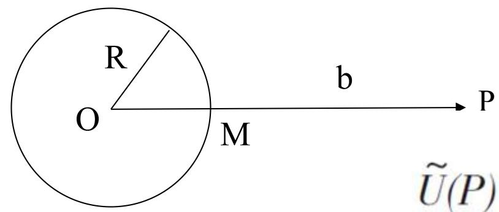

$$
\widetilde {U} (P) = K \oiint_ {(\Sigma)} f (\theta_ {0}, \theta) \cdot \widetilde {U} _ {0} (Q) \frac {e ^ {i k r}}{r} d s
$$

$$
\widetilde {U} (P) = \frac {- i}{\lambda} \iint_ {\lambda} \frac {1}{2} (\cos \theta_ {0} + \cos \theta) \widetilde {U} _ {0} (Q) \cdot \frac {e ^ {i k r}}{r} d s
$$

M： ${ \tilde { U } } ( \mathbf { M } ) = { \frac { a } { R } } e ^ { i k R }$ P： $\tilde { U } ( { \bf P } ) = \frac { a } { R + b } e ^ { i k ( R + b ) }$ ( )ik R be  

自由空间： $d \mathbf { s } = { \frac { 2 \pi R } { R + b } } r d r \propto r$ 

$$
\tilde {U} (\mathbf {P}) = \frac {1}{2} U _ {1} (\mathbf {P}) = \frac {1}{2} K \frac {2 \pi R}{R + b} \cdot \frac {a}{R} e ^ {i k R} \int_ {b} ^ {b + \frac {\lambda}{2}} e ^ {i k r} d r = K (- \frac {\lambda}{i}) \frac {a}{R + b} e ^ {i k (R + b)}
$$

$$
K = - \frac {i}{\lambda}
$$

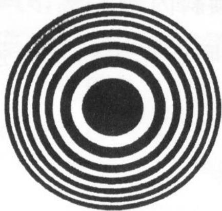

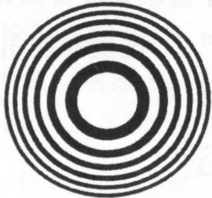

图2.45菲涅耳波带片.（a）开放偶数半波带，（b）开放奇数半波带

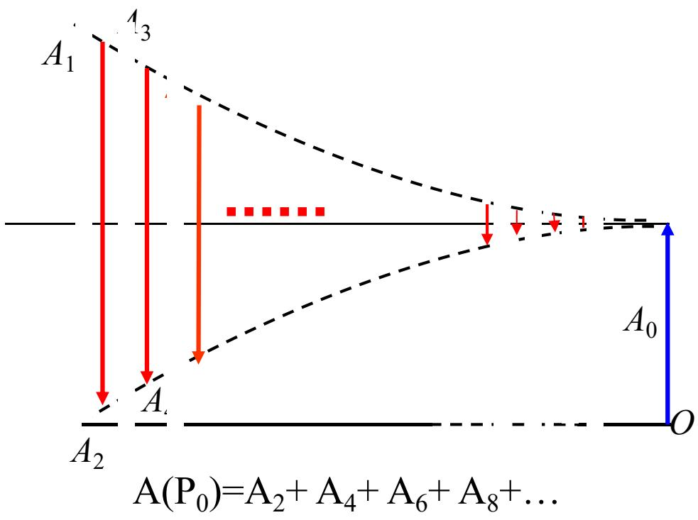

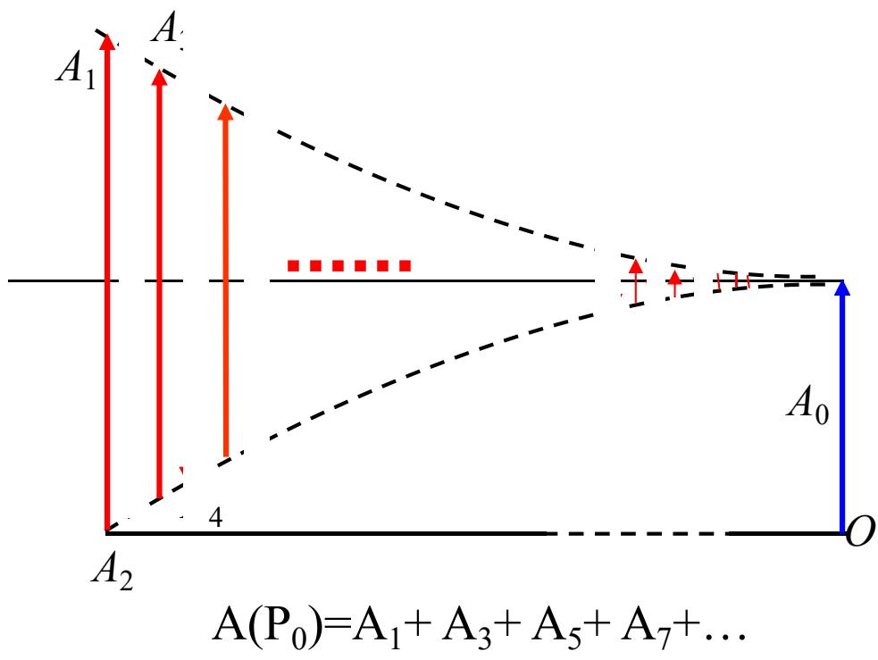

*菲涅耳波带片的衍射场一若干实焦点和虚焦点

$$
\frac {1}{R} + \frac {1}{b} = k \frac {\lambda}{\rho^ {2}}
$$

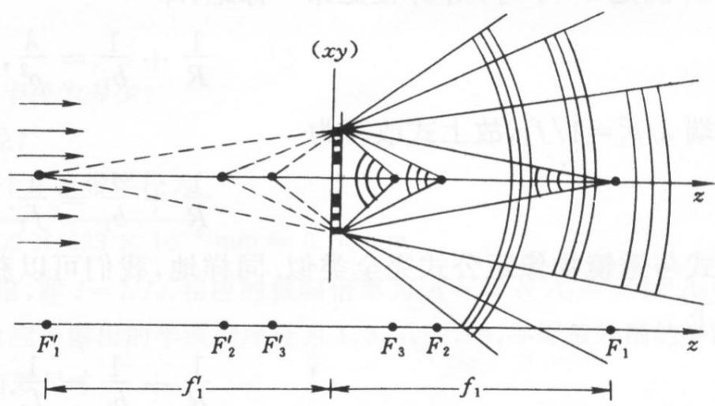

$$
\frac {1}{R} + \frac {1}{b} = \frac {\lambda}{\rho_ {1} ^ {2}} \xrightarrow {R \to \infty} f _ {1} = b = \frac {\rho_ {1} ^ {2}}{\lambda}
$$

f1称为主焦距， $\rho _ { 1 }$ 是由f1的设计要求而确定的。

图2.46菲涅耳波带片衍射产生实焦点和虚焦点

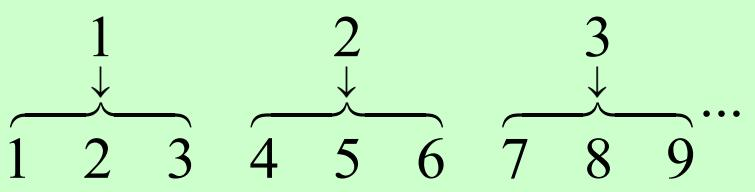

$$
\rho_ {1} = \sqrt {3} \rho_ {1} ^ {\prime}, \rho_ {1} ^ {\prime} = \frac {\rho_ {1}}{\sqrt {3}} \Rightarrow f _ {2} = \frac {\rho_ {1} ^ {\prime 2}}{\lambda} = \frac {\rho_ {1} ^ {2}}{3 \lambda} = \frac {f _ {1}}{3}
$$

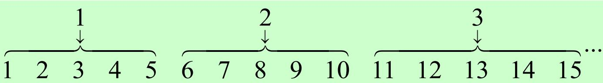

$$
\rho_ {1} = \sqrt {5} \rho_ {1} {"}, \quad \rho_ {1}" = \frac {\rho_ {1}}{\sqrt {5}} \Rightarrow f _ {3} = \frac {\rho_ {1} {" ^ {2}}}{\lambda} = \frac {\rho_ {1} {} ^ {2}}{5 \lambda} = \frac {f _ {1}}{5}
$$

焦点处衍射强度分析？？

# *波带片衍射成像—类似透镜成像公式

菲涅耳波带片有若干实焦点和虚焦点，它既具有汇聚透镜的功能，又具有发散透镜的功能，当物点发射球面波照明波带片时，可以产生若干实象和虚象，成像公式类似与透镜成像：

$$
\frac {1}{R} + \frac {1}{b} = \frac {1}{f _ {k}}, \text {其 中} k = \pm 1, \pm 2, \pm 3 \dots
$$

例题：对于一张经典菲涅耳波带片的制作，提出两点要求:(1)对=633nm的光，其第一焦距 $\mathrm { f _ { 1 } } { = } 4 0 0 \mathrm { m m }$ ，（2）主焦点的光强为自由光强的104倍。

问：(1)待制作的波带片的第一个半波带的半径为多少？

（2）这张波带片的至少应该有多大的有效半径？

（1）根据第一焦距公式， $f _ { 1 } = b = \frac { { \rho _ { 1 } } ^ { 2 } } { \lambda }$ 得：

$$
\rho_ {1} = \sqrt {f _ {1} \lambda} = \sqrt {4 0 0 \times 6 3 3 \times 1 0 ^ {- 6}} \approx 0. 5 0 m m
$$

（2）焦点光强I为自由光强 $\mathrm { I } _ { 0 }$ 的N倍，即 $\mathrm { I } { = } \mathrm { N I } _ { 0 }$ ，相应的振幅 $A = \sqrt { N } A _ { 0 }$ ，此题： $A = \sqrt { N } A _ { 0 } = \sqrt { 1 0 ^ { 4 } } A _ { 0 } = 1 0 0 A _ { 0 } = 5 0 A _ { 1 }$ ，有一半的半波带被遮掩，如果漏出奇数半波带，1，3，5…99,如果漏出偶数，2，4，6…100，所以最外围的半波带的序号为99或100，它决定了波带片的有效尺度：

$$
\rho_ {k} = \sqrt {k} \rho_ {1}, \rho_ {1 0 0} = \sqrt {1 0 0} \rho_ {1} = 5. 0 m m, \rho_ {9 9} = \sqrt {9 9} \rho_ {1} \approx 5. 0 m m
$$

*现代波带片

(1)全透明浮雕型波带片

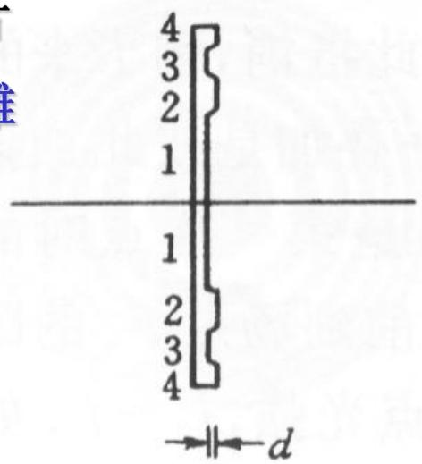

图2.47浮雕型波带

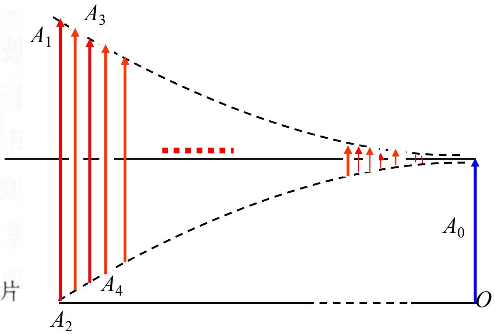

$$
(n - 1) d = (2 m + 1) \frac {\lambda_ {0}}{2}
$$

$\widetilde U ( P _ { 0 } ) = A _ { 1 } + A _ { 2 } + A _ { 3 } + A _ { 4 } + . . . \lambda$ 射光通量没有损失，

焦点或像点的光振幅是 经典波带片的 倍，光强为 倍。2 4

# (2)余弦式波带片

它是通过球面波和平面波干涉制作的，其光照时的透过函数为正弦或余弦式，具有更好的聚焦性能，只有一个实焦点和一个虚焦点。

# 四、 夫琅禾费衍射和光学仪器的分辨本领

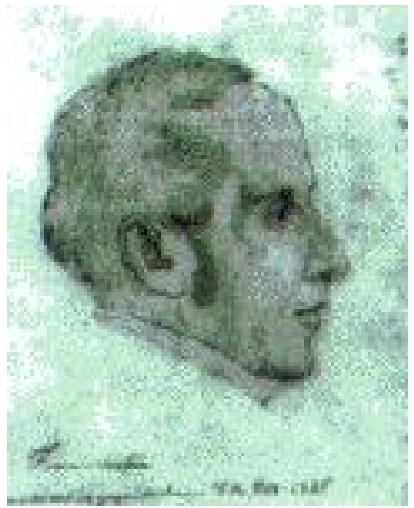

夫琅禾费 (Joseph von Fraunhofer 1787—1826)

夫琅禾费是德国物理学家。1787年3月6日生于斯特劳宾，父亲是玻璃工匠，夫琅禾费幼年当学徒，后来自学了数学和光学。1806年开始在光学作坊当光学机工，1818年任经理，1823年担任慕尼黑科学院物理陈列馆馆长和慕尼黑大学教授，慕尼黑科学院院士。夫琅禾费自学成才，一生勤奋刻苦，终身未婚，1826年6月7日因肺结核在慕尼黑逝世。

夫琅禾费集工艺家和理论家的才干于一身，把理论与丰富的实践经验结合起来，对光学和光谱学作出了重要贡献。1814年他用自己改进的分光系统，发现并研究了太阳光谱中的暗线（现称为夫琅禾费谱线），利用衍射原理测出了它们的波长。他设计和制造了消色差透镜，首创用牛顿环方法检查光学表面加工精度及透镜形状，对应用光学的发展起了重要的影响。他所制造的大型折射望远镜等光学仪器负有盛名。他发表了平行光单缝及多缝衍射的研究成果（后人称之为夫琅禾费衍射），做了光谱分辨率的实验，第一个定量地研究了衍射光栅，用其测量了光的波长，以后又给出了光栅方程。

# 实验装置和现象

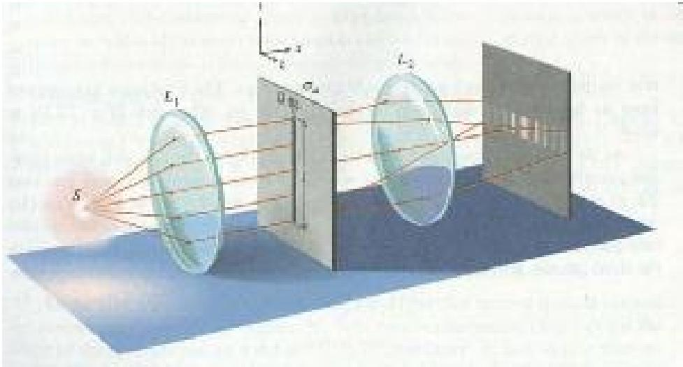

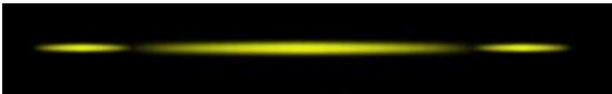

实验装置如上图，在透镜的后焦面接受夫琅禾费衍射场，中心为亮斑，并且亮度大于两侧的亮条纹，中心亮条纹宽度是两侧的二倍，亮斑的宽度随狭缝的变窄而展宽。

# 矢量图解法—衍射强度

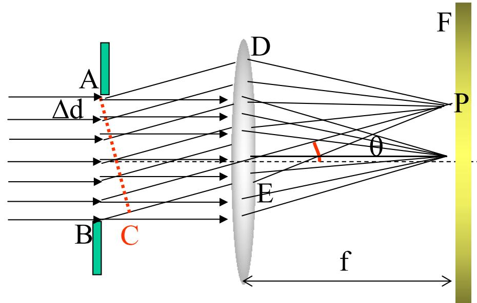

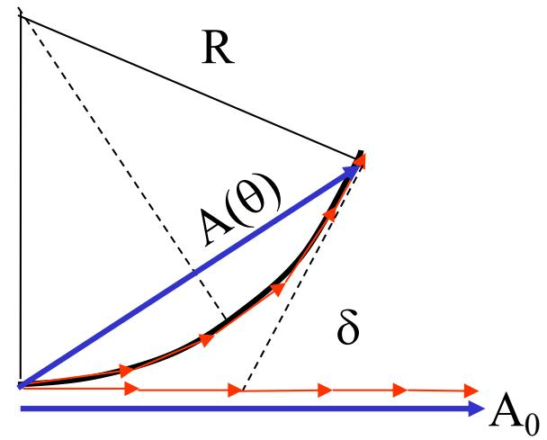

把狭缝 分成 等份，光程差AB N ${ \overline { { \mathbf { A D P } } } } = { \overline { { \mathbf { C E P } } } } ,$ ，所以由 到 ，每点附加的光程差：  A B$\Delta l = \Delta d \sin \theta ;$ ；所以 $P$ 点的复振幅可以写成：

$$
\widetilde {U} (\theta) = \sum_ {i = 0} ^ {N} \Delta \widetilde {U} _ {i} (\theta) = \Delta A e ^ {i k L _ {0}} \left(1 + e ^ {i \frac {2 \pi}{\lambda} \Delta d \sin \theta} + e ^ {i \frac {2 \pi}{\lambda} 2 \Delta d \sin \theta} + e ^ {i \frac {2 \pi}{\lambda} 3 \Delta d \sin \theta} + \ldots + e ^ {i \frac {2 \pi}{\lambda} N \Delta d \sin \theta}\right)
$$

相当于一系列小矢量首尾衔接的和，矢量方向依次相差 的角度。sin2 da

$$
\delta = \frac {2 \pi}{\lambda} N \Delta d \sin \theta = \frac {2 \pi}{\lambda} a \sin \theta ; R = \frac {A _ {0}}{\delta} = \frac {A _ {0}}{\frac {2 \pi}{\lambda} a \sin \theta}
$$

$$
A (\theta) = 2 R \sin \frac {\delta}{2} = \frac {A _ {0}}{\frac {\pi}{\lambda} a \sin \theta} \sin \left(\frac {\pi}{\lambda} a \sin \theta\right); \text {引 进 宗 量} \alpha = \frac {\pi}{\lambda} a \sin \theta , \text {得 :}
$$

$$
A (\theta) = A _ {0} \frac {\sin (\alpha)}{\alpha};
$$

光强： $I ( \theta ) = \big ( A ( \theta ) \big ) ^ { 2 } = I _ { 0 } \Bigg ( \frac { \sin \big ( \alpha \big ) } { \alpha } \Bigg ) ^ { 2 }$ 

# 衍射图样的积

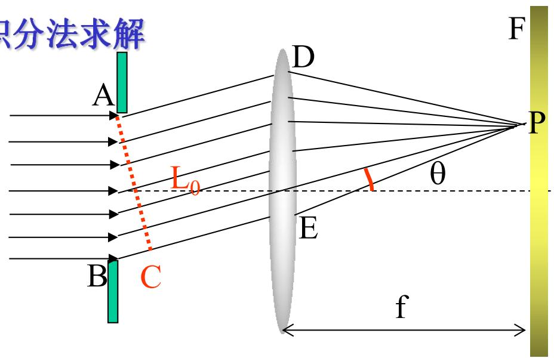

$$
\widetilde {U} (\theta) = \frac {- i}{\lambda} \iint_ {\Sigma_ {0}} \frac {(\cos \theta_ {0} + \cos \theta)}{2} \widetilde {U} _ {0} (Q) \frac {e ^ {i k r}}{r} d S
$$

 0dS bdx ， $\widetilde { U } _ { 0 } ( Q ) = A$ ，这里 $b$ 为常数，

在傍轴条件下， $f ( \theta _ { 0 } , \theta ) \approx 1$ ，振幅系数 1 1 经透镜变换  1r 0r f

相因子 $e ^ { i k r }$ , $k r = k L = - k x _ { 0 }$ sin $\theta + k L _ { 0 }$ 

$$
\widetilde {U} (\theta) = \frac {- i}{\lambda f} A b e ^ {i k L _ {0}} \int_ {- \frac {a}{2}} ^ {\frac {a}{2}} e ^ {- i k x _ {0} \sin \theta} d x _ {0} = \frac {- i}{\lambda f} A a b e ^ {i k L _ {0}} \left(\frac {\sin \left(\frac {\pi a \sin \theta}{\lambda}\right)}{\frac {\pi a \sin \theta}{\lambda}}\right)
$$

${ \tilde { U } } ( \theta ) = { \tilde { c } } { \Bigg ( } { \frac { \sin \alpha } { \alpha } } { \Bigg ) } ,$ $\widetilde { \boldsymbol { J } } \left( \theta \right) = \widetilde { c } \left( \frac { \sin \alpha } { \alpha } \right) , \enspace \enspace \sharp \sharp \enspace \widetilde { c } = \frac { - i } { \lambda f } A a b e ^ { \ i k L _ { 0 } } ,$ ，其中 ~      c $\widetilde { c } = \frac { - i } { \lambda f } A a b e ^ { i k L _ { 0 } } , \alpha = \frac { \pi a \sin \theta } { \lambda }$ $\widetilde { c } = \frac { - i } { \lambda f } A a b e ^ { i k L _ { 0 } } ;$ ，   s i n0    aA abe i  ikL

$I \big ( \theta \big ) = \widetilde U ( \theta ) \widetilde U ^ { * } ( \theta ) = I _ { 0 } \Bigg ( \frac { \sin \alpha } { \alpha } \Bigg ) ^ { 2 } ;$ ，和矢量图解方法求解 的结果完全一致。

1说明  经透镜变换 1r0

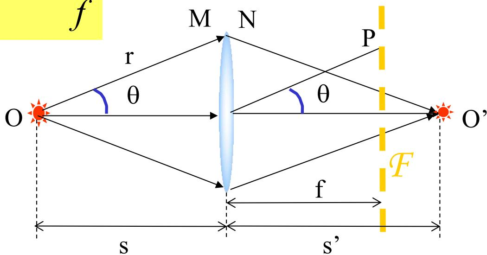

单缝—透镜—后焦面之间是非自由空间，次波源发出的发散球面波经透镜变成汇聚球面波，此时基尔霍夫积分公式中的r已经失去了明确的意义。

要处理此问题，我们可以分别在物空间(自由空间)和像空间(自由空间)，利用基尔霍夫积分公式的1/r关系，考虑振幅的传播规律。

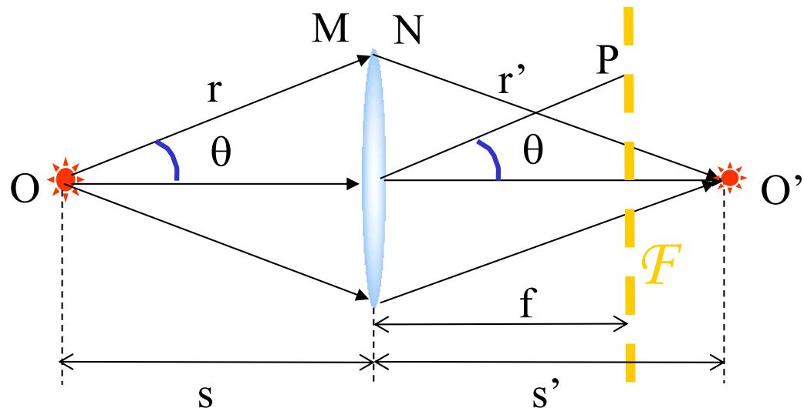

在傍轴条件下：

aaAM   ， $A _ { N } = { \frac { a ^ { \prime } } { r ^ { \prime } } } \approx { \frac { a ^ { \prime } } { s ^ { \prime } } }$ 这里忽 略透镜对光 能的 损耗， $A _ { M } = A _ { N }$ sr利用 $1 / r$ 的关系：

$$
\frac {A _ {P}}{A _ {N}} = \frac {\overline {{N O ^ {\prime}}}}{\overline {{P O ^ {\prime}}}} \approx \frac {s ^ {\prime}}{s ^ {\prime} - f} \Rightarrow A _ {P} \approx \frac {s ^ {\prime}}{s ^ {\prime} - f} A _ {N} \approx \frac {s ^ {\prime}}{s ^ {\prime} - f} A _ {M} = \frac {a \cdot s ^ {\prime}}{s \cdot (s ^ {\prime} - f)}
$$

利用透镜成像公式：

$\frac { 1 } { s } + \frac { 1 } { s ^ { \prime } } = \frac { 1 } { f } \Rightarrow \frac { 1 } { s } = \frac { 1 } { f } - \frac { 1 } { s ^ { \prime } } = \frac { s ^ { \prime } - f } { s ^ { \prime } f }$ 代入上 式得：

$$
A _ {P} = \frac {a}{f} \propto \frac {1}{f}
$$

# *衍射图样的主要特点：

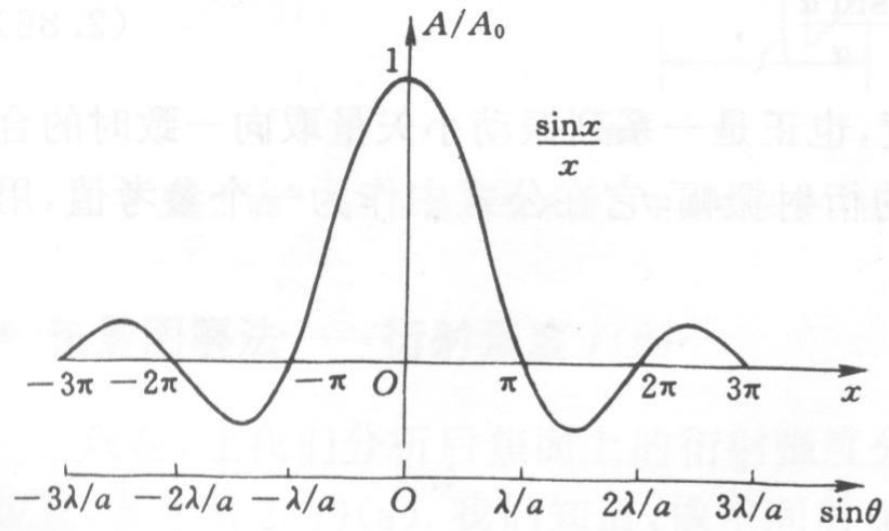

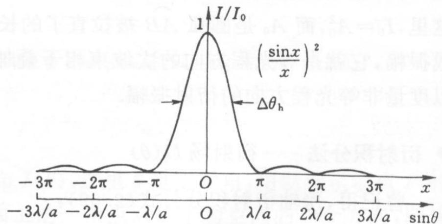

（b）

$$
\begin{array}{l} {\widetilde {U} (\theta) = \widetilde {c} \left(\frac {\sin \alpha}{\alpha}\right), \text {其 中} \widetilde {c} = \frac {- i}{\lambda f} A a b e ^ {i k L _ {0}}, \alpha = \frac {\pi a \sin \theta}{\lambda}} \\ {I (\theta) = \widetilde {U} (\theta) \widetilde {U} ^ {*} (\theta) = I _ {0} \left(\frac {\sin \alpha}{\alpha}\right) ^ {2}} \end{array}
$$

(1)最大值（I0)在几何光学像点，=0

(2)零点的位置；

$\frac { \pi } { \lambda } a \sin \theta = k \pi ,$ ，即 sina $\theta = k \lambda$ ， $k = \pm 1 , \pm 2 .$ ..；衍射强度 $I ( \theta ) { = } 0 ;$ ,出现暗纹。

（3）次极大的位置

${ \frac { d } { d \alpha } } \left( { \frac { \sin \alpha } { \alpha } } \right) = { \frac { \cos \alpha } { \alpha } } - { \frac { \sin \alpha } { \alpha ^ { 2 } } } = 0 ,$ ，即  时出现次极值。0 tan cos sin 2     $\alpha = \tan \alpha$ α²

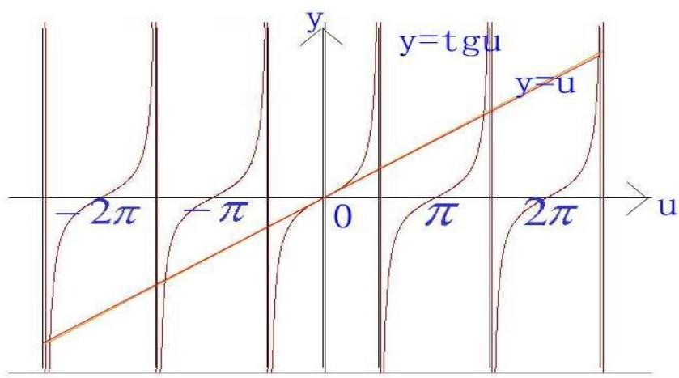

（4）半角宽度 $\Delta \theta _ { 0 }$ ；

零级衍射峰值与其相邻的暗点之间的夹角称为衍射的半角宽度。

$$
\frac {\pi}{\lambda} a \sin \theta_ {1} = \pi \Rightarrow \sin \theta_ {1} = \frac {\lambda}{a} \Rightarrow \theta_ {1} \approx \frac {\lambda}{a},
$$

$\Delta \theta _ { 0 } = \theta _ { 1 } - 0 = \theta _ { 1 } \approx \frac { \lambda } { a } ,$ ，即 $\Delta \theta _ { 0 } \cdot a \approx \lambda$ 

(5)单缝宽度对衍射图样的影响

$\tilde { U } ( \theta ) = \tilde { c } \left( \frac { \sin \alpha } { \alpha } \right) ,$ 其中= $\tilde { c } = \frac { - i } { \lambda f } A a b e ^ { i k L _ { 0 } }$ Aabeikla

$$
\Delta \theta_ {0} \cdot a \approx \lambda
$$

$$
A _ {0} \propto S, I _ {0} = A _ {0} ^ {2} \propto S ^ {2}
$$

（6）波长的影响

$\Delta \theta _ { 0 } \approx \frac { \lambda } { a } ,$ 所以长波长

的光衍射半角宽度大。

根据基尔霍夫积分公式：

$I \propto \frac { 1 } { \lambda ^ { 2 } } ,$ 22 所以波长短的光

衍射峰值大。

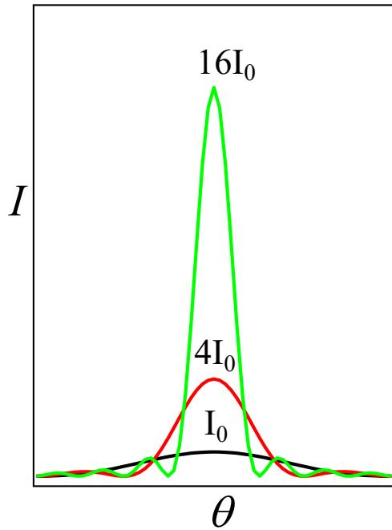

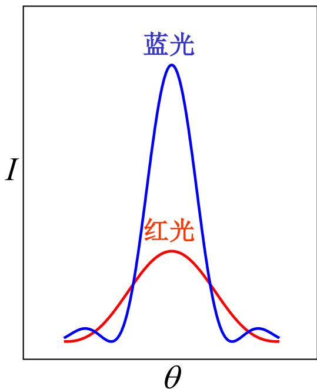

：在单缝夫琅禾费衍射实验中，照明光波长为600nm，透镜焦距为200mm，单缝宽度为15m,求零级衍射斑的斑角宽度和屏幕上显示的零级斑的几何宽度？

解：

半角宽度： $\Delta \theta _ { 0 } = \frac { \lambda } { a } = \frac { 6 0 0 \times 1 0 ^ { - 3 } } { 1 5 } = 0 . 0 4 r a d$ 

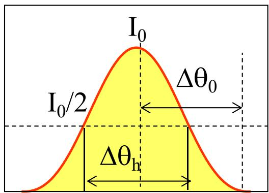

$\Delta \theta _ { h } \approx \Delta \theta _ { 0 } ,$ ，所以几何长度为：

$$
l \approx f \Delta \theta_ {0} = 2 0 0 \times 0. 0 4 = 8 m m
$$

# *思考题：斜入射的夫琅禾费单缝衍射

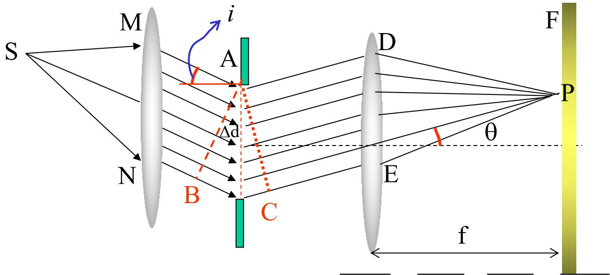

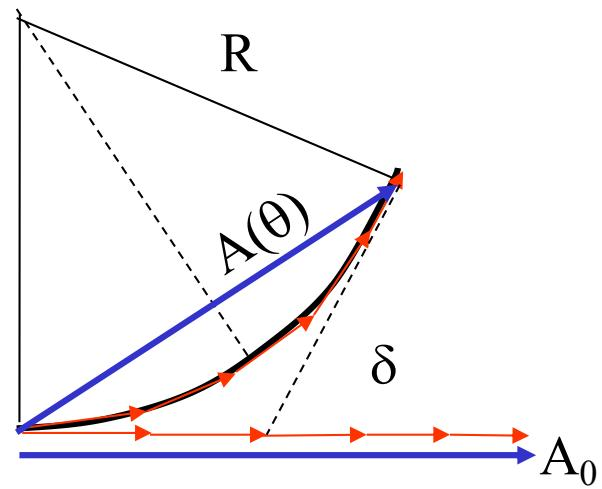

把狭缝分成 等份，光程差N $\mathbf { A D P = C E P }$ ， $S N B = S M A ,$ ，所以每点附加的光程差：$\Delta l = ( \sin \theta + \sin i ) \Delta d \colon$ ；所以 $P$ 点的复振幅可以写成：

$$
\widetilde {U} (\theta) = \sum_ {i = 0} ^ {N} \Delta \widetilde {U} _ {i} (\theta) = \Delta A e ^ {i k L _ {0}} \left(1 + e ^ {i \frac {2 \pi}{\lambda} \Delta l} + e ^ {i \frac {2 \pi}{\lambda} 2 \Delta l} + e ^ {i \frac {2 \pi}{\lambda} 3 \Delta l} + \ldots + e ^ {i \frac {2 \pi}{\lambda} N \Delta l}\right)
$$

相当于一系列小矢量首尾衔接的和，矢量方向依次相差 $\frac { 2 \pi } { \lambda } \Delta l$ 的角度。

$$
\delta = \frac {2 \pi}{\lambda} N \Delta d (\sin \theta + \sin i) = \frac {2 \pi}{\lambda} a (\sin \theta + \sin i); R = \frac {A _ {0}}{\delta} = \frac {A _ {0}}{\frac {2 \pi}{\lambda} a (\sin \theta + \sin i)}
$$

$$
A (\theta) = 2 R \sin {\frac {\delta}{2}} = \frac {A _ {0}}{\frac {\pi}{\lambda} a (\sin \theta + \sin i)} \sin \left(\frac {\pi}{\lambda} a (\sin \theta + \sin i)\right);
$$

引进宗量 $\alpha = \frac { \pi } { \lambda } a ( \sin \theta + \sin i ) ,$ ，得：

$$
A (\theta) = A _ {0} \frac {\sin (\alpha)}{\alpha};
$$

光强： $I ( \theta ) = \big ( A ( \theta ) \big ) ^ { 2 } = I _ { 0 } \Bigg ( \frac { \sin \big ( \alpha \big ) } { \alpha } \Bigg ) ^ { 2 }$ 

斜入射和正入射的单缝夫琅禾费衍射的表达式一致。变化的是宗量。

正入射

宗量 $\alpha = \frac { \pi } { \lambda } a \sin \theta$ 

斜入射

 a(sin   sin i) 

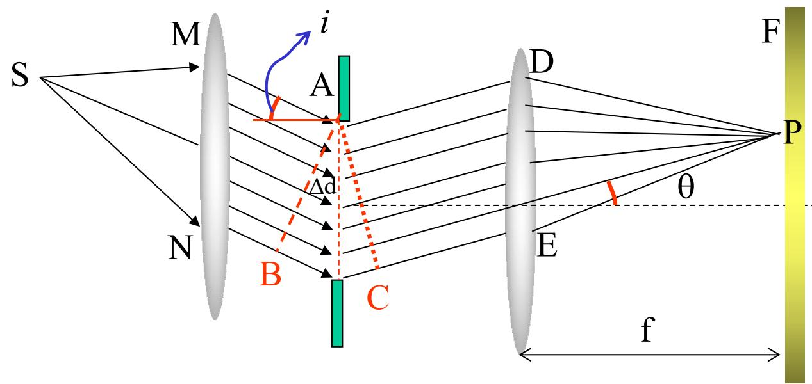

$$
\widetilde {U} (\theta) = \frac {- i}{\lambda} \iint_ {\Sigma_ {0}} \frac {(\cos \theta_ {0} + \cos \theta)}{2} \widetilde {U} _ {0} (Q) \frac {e ^ {i k r}}{r} d S
$$

$d S = b d x _ { 0 } , \qquad \widetilde { U } _ { 0 } ( Q ) = A e ^ { - i k x _ { 0 } \sin i } ,$ $\widetilde { U } _ { \mathfrak { o } } ( Q ) = A e ^ { - i k x _ { 0 } \sin i }$ 这里 $b$ 为常数，

在傍轴条件下， $f ( \theta _ { 0 } , \theta ) \approx 1$ ，振幅系数 1r → 1r 经透镜变换  1f

相因子 $e ^ { i k r }$ , $k r = k L = - k x _ { 0 }$ sin $\theta + k L _ { 0 }$ 

$$
\widetilde {U} (\theta) = \frac {- i}{\lambda f} A b e ^ {i k L _ {0}} \int_ {- \frac {a}{2}} ^ {\frac {a}{2}} e ^ {- i k x _ {0} (\sin \theta + \sin i)} d x _ {0} = \frac {- i}{\lambda f} A a b e ^ {i k L _ {0}} \left(\frac {\sin \left(\frac {\pi a (\sin \theta + \sin i)}{\lambda}\right)}{\frac {\pi a (\sin \theta + \sin i)}{\lambda}}\right)
$$

${ \tilde { U } } ( \theta ) = { \tilde { c } } { \Bigg ( } { \frac { \sin \alpha } { \alpha } } { \Bigg ) } ,$ ，其中 $\widetilde { c } = \frac { - i } { \lambda f } A a b e ^ { i k L _ { 0 } } ,$ ，   (sin sin )0    a iAabe i  ikL $\alpha = { \frac { \pi a ( \sin \theta + \sin i ) } { \lambda } }$ 

$$
I (\theta) = \widetilde {U} (\theta) \widetilde {U} ^ {*} (\theta) = I _ {0} \left(\frac {\sin \alpha}{\alpha}\right) ^ {2}
$$

和矢量图解方法求解的 结果完全一致。

斜入射和正入射的单缝夫琅禾费衍射的表达式一致。变化的是宗量。

正入射

宗量a=asinθ 

斜入射

 a(sin   sin i) 

矩孔夫琅禾费衍射

装置构图与场点定位

衍射积分运算

衍射图样及特点

衍射反比律

·反比关系式

“衍射放大”功能

·衍射场公式 U(0，,02)

几何光学限度

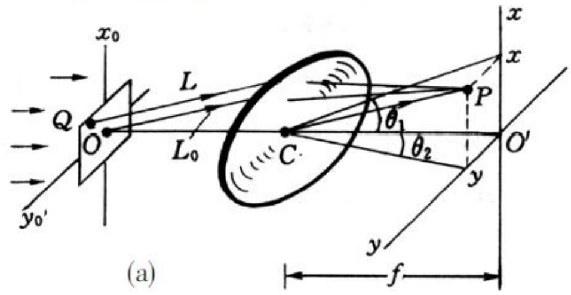

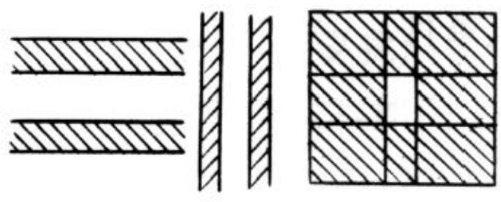

$$
\propto \frac {\sin \alpha}{\alpha}, \quad \propto \frac {\sin \beta}{\beta}, \quad \propto \left(\frac {\sin \alpha}{\alpha}\right) \left(\frac {\sin \beta}{\beta}\right)
$$

场点位置P

位置标定问题。 源点 Q(xo,yo）,

在衍射问题中,宜取角度来定位：P(0,02).

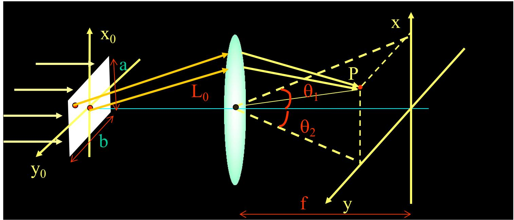

衍射积分运算

$$
d s = d x _ {0} d y _ {0}, \quad \tilde {U} _ {0} (Q) = A, \quad \frac {1}{r _ {0}} \rightarrow \frac {1}{f};
$$

处理eikr

$$
\begin{array}{l} k r \rightarrow k L (Q P) = k (L - L _ {0}) + k L _ {0} \\ = - k \triangle r + k L _ {0}, \\ \end{array}
$$

计算△r=OQ·L。,注意到

而衍射角(0,,02)与方位余弦角(α,α2)

互为余角,即cosα=sinθ，cosα=sin02

△r= xocosa +yocosα2 

$$
= x _ {0} \sin \theta_ {1} + y _ {0} \sin \theta_ {2},
$$

相因子 $e ^ { i k r }$ , $k r = k L = - k x _ { 0 }$ sin $\theta _ { 1 } - k y _ { 0 }$ sin $\theta _ { 2 } + k L _ { 0 }$ 

$$
\begin{array}{l} \widetilde {U} (\theta_ {1}, \theta_ {2}) = \frac {- i}{\lambda f} A e ^ {i k L _ {0}} \int_ {- \frac {b}{2}} ^ {\frac {b}{2}} \int_ {- \frac {a}{2}} ^ {\frac {a}{2}} e ^ {- k x _ {0} \sin \theta_ {1} - k y _ {0} \sin \theta_ {2}} d x _ {0} d y _ {0} \\ = \frac {- i}{\lambda f} A a b e ^ {i k L _ {0}} \left(\frac {\sin \left(\frac {\pi a \sin \theta_ {1}}{\lambda}\right)}{\frac {\pi a \sin \theta_ {1}}{\lambda}}\right) \left(\frac {\sin \left(\frac {\pi b \sin \theta_ {2}}{\lambda}\right)}{\frac {\pi b \sin \theta_ {2}}{\lambda}}\right) \\ \end{array}
$$

$$
\widetilde {U} (\theta_ {1}, \theta_ {2}) = \widetilde {c} \bigg (\frac {\sin \alpha}{\alpha} \bigg) \bigg (\frac {\sin \beta}{\beta} \bigg),
$$

~  ic其中 0Aabe ikL ， $\alpha = \frac { \pi a \sin \theta _ { 1 } } { \lambda } , \beta = \frac { \pi b \sin \theta _ { 2 } } { \lambda }$ 1sin a  ，f

$$
I \big (\theta_ {1}, \theta_ {2} \big) = \widetilde {U} \big (\theta_ {1}, \theta_ {2} \big) \widetilde {U} ^ {*} \big (\theta_ {1}, \theta_ {2} \big) = I _ {0} \left(\frac {\sin \alpha}{\alpha}\right) ^ {2} \left(\frac {\sin \beta}{\beta}\right) ^ {2}
$$

# 夫琅禾费方孔衍射的主要特点

(1)衍射峰，当 $( \theta _ { 1 }$ ， $\theta _ { 2 } ) = ( 0 , 0 ) ,$ ，有 $I = I _ { 0 } ,$ ，衍射强度最大，称此为零级衍射峰。

零点的位置；(2)

$\stackrel { \scriptscriptstyle \underbrace { \mathrm {  ~ \scriptstyle \Psi ~ } } } { \boldsymbol { \Xi } } \left( \begin{array} { l } { \alpha = \frac { \pi a \sin \theta _ { 1 } } { \lambda } = k _ { 1 } \pi } \\ { \beta = \frac { \pi b \sin \theta _ { 2 } } { \lambda } = k _ { 2 } \pi } \end{array} \right) \stackrel { \scriptscriptstyle ( a \sin \theta _ { 1 } = k _ { 1 } \lambda } { \scriptscriptstyle \mathrm {  ~ \scriptstyle \theta _ { \mathrm { \tiny ~ s i n } } } \theta _ { 2 } = k _ { 2 } \lambda } \stackrel { \scriptscriptstyle } { \boldsymbol { \mathrm { \tiny ~ \theta ~ } } }$ sin 1  ka 时sin 2  kb

$I ( \theta _ { 1 } , \theta _ { 2 } ) { = } 0$ 为暗区。

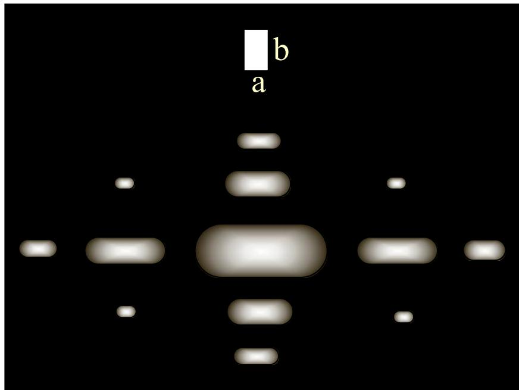

$( 3 )$ 零级斑的半角宽度；

   沿 方向的扩展x, 1 a 沿 方向的扩展yb , 2 2

衍射发散角度和衍射孔的几何线度的反比律关系；

$$
a \cdot \Delta \theta_ {1} \approx \lambda , b \cdot \Delta \theta_ {2} \approx \lambda
$$

光波,声波,电波…

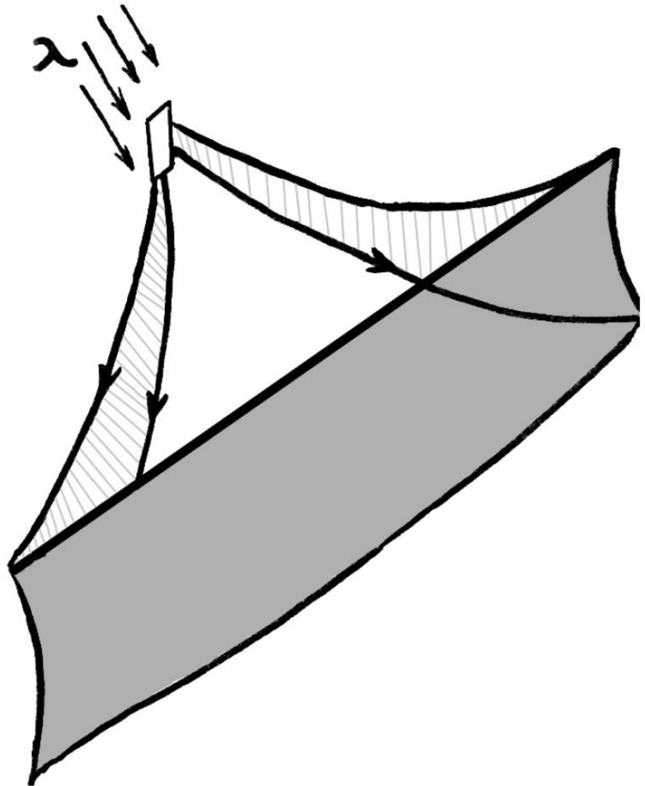

图2.64

思考题：斜入射夫琅禾费方孔衍射？

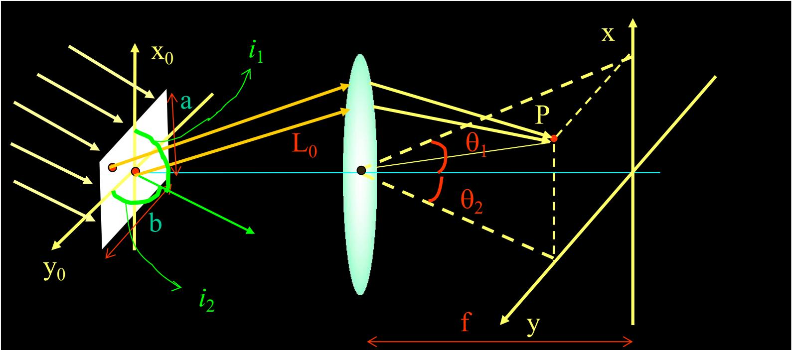

$$
\widetilde {U} (\theta_ {1}, \theta_ {2}) = \frac {- i}{\lambda} \iint_ {\Sigma_ {0}} \frac {(\cos \theta_ {0} + \cos \theta)}{2} \widetilde {U} _ {0} (Q) \frac {e ^ {i k r}}{r} d S
$$

$$
d S = d x _ {0} d y _ {0}, \qquad \widetilde {U} _ {0} (Q) = A e ^ {- i k (x _ {0} \sin i _ {1} + y _ {0} \sin i _ {2})},
$$

在傍轴条件下， $f ( \theta _ { 0 } , \theta ) \approx 1 .$ r r 1 1   0 ，振幅系数 经透镜变换 f 1相因子 $e ^ { i k r }$ , $k r = k ( L - L _ { 0 } )$ 

$$
= - k x _ {0} \sin \theta_ {1} - k y _ {0} \sin \theta_ {2} + k L _ {0}
$$

$$
\widetilde {U} (\theta_ {1}, \theta_ {2}) = \frac {- i}{\lambda f} A e ^ {i k L _ {0}} \int_ {- \frac {b}{2}} ^ {\frac {b}{2}} d y _ {0} \int_ {- \frac {a}{2}} ^ {\frac {a}{2}} e ^ {- k x _ {0} (\sin \theta_ {1} + \sin i _ {1}) - k y _ {0} (\sin \theta_ {2} + \sin i _ {2})} d x _ {0}
$$

$$
= \frac {- i}{\lambda f} A a b e ^ {i k L _ {0}} \left(\frac {\sin \left(\frac {\pi a (\sin \theta_ {1} + \sin i _ {1})}{\lambda}\right)}{\frac {\pi a (\sin \theta_ {1} + \sin i _ {1})}{\lambda}}\right) \left(\frac {\sin \left(\frac {\pi b (\sin \theta_ {2} + \sin i _ {2})}{\lambda}\right)}{\frac {\pi b (\sin \theta_ {2} + \sin i _ {2})}{\lambda}}\right)
$$

$$
\widetilde {U} (\theta_ {1}, \theta_ {2}) = \widetilde {c} \bigg (\frac {\sin \alpha}{\alpha} \bigg) \bigg (\frac {\sin \beta}{\beta} \bigg),
$$

~  ic其中 $\frac { - i } { \lambda f } A a b e ^ { \ i k L _ { 0 } } , \alpha = \frac { \pi a ( \sin \theta _ { 1 } + \sin i _ { 1 } ) } { \lambda } ,$ $\frac { \tau a \big ( \sin \theta _ { 1 } + \sin i _ { 1 } \big ) } { \lambda } , \beta = \frac { \pi b \big ( \sin \theta _ { 2 } + \sin i _ { 1 } \big ) } { \lambda }$    2 2  sin sin   b i，

$$
I (\theta_ {1}, \theta_ {2}) = \widetilde {U} (\theta_ {1}, \theta_ {2}) \widetilde {U} ^ {*} (\theta_ {1}, \theta_ {2}) = I _ {0} \left(\frac {\sin \alpha}{\alpha}\right) ^ {2} \left(\frac {\sin \beta}{\beta}\right) ^ {2}
$$

斜入射和正入射的矩形夫琅禾费衍射的表达式一致。变化的是宗量。

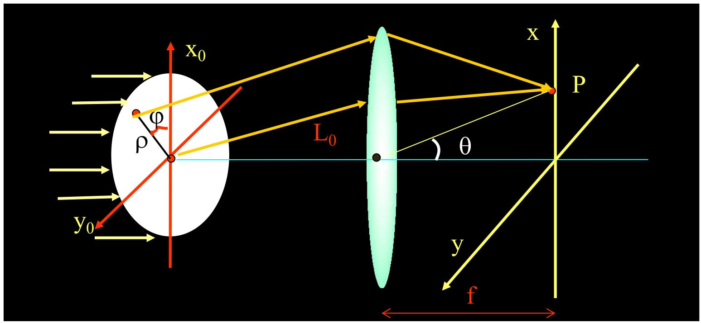

$$
\widetilde {U} (\theta) = \frac {- i}{\lambda} \iint_ {\Sigma_ {0}} \frac {(\cos \theta_ {0} + \cos \theta)}{2} \widetilde {U} _ {0} (Q) \frac {e ^ {i k r}}{r} d S
$$

，dS d d $\widetilde { U } _ { 0 } ( Q ) = A$ ，在傍轴条件下， $f ( \theta _ { 0 } , \theta ) \approx 1 ,$ 

振幅系数 $\frac { 1 } { r }  \frac { 1 } { r _ { 0 } } \xrightarrow [ f ] { \xi _ { \pm } ^ { 2 } ; \xi _ { \pm } ^ { \pm } ; \xi _ { \pm } ^ { \pm } } \infty \frac { 1 } { f }$ ( ) 前面已经说明

相因子 $e ^ { i k r }$ , $k r = k L = - k \rho$ cos sin $\theta + k L _ { 0 }$ 

$$
\begin{array}{l} \tilde {U} (\theta) = \frac {- i}{\lambda f} A e ^ {i k L _ {0}} \int_ {0} ^ {R} \int_ {0} ^ {2 \pi} e ^ {- k \rho \cos \varphi \sin \theta} \rho d \varphi d \rho \\ = \frac {- i}{\lambda f} A e ^ {i k L _ {0}} \pi R ^ {2} \left[ \frac {2 J _ {1} \left(\frac {2 \pi R \sin \theta}{\lambda}\right)}{\frac {2 \pi R \sin \theta}{\lambda}} \right]; \\ \end{array}
$$

$$
\widetilde {U} (\theta) = \widetilde {c} \left(\frac {2 J _ {1} (x)}{x}\right),
$$

其中 $\widetilde c = \frac { - i } { \lambda f } A \pi R ^ { 2 } e ^ { i k L _ { 0 } } , x = \frac { 2 \pi R \sin \theta } { \lambda } ,$ 

$$
I (\theta) = \widetilde {U} (\theta) \widetilde {U} ^ {*} (\theta) = I _ {0} \left(\frac {2 J _ {1} (x)}{x}\right) ^ {2}
$$

<table><tr><td>x</td><td>0</td><td>1.22π</td><td>1.64π</td><td>2.23π</td><td>2.68π</td><td>3.24π</td></tr><tr><td>I(θ)=I0(2J1(x)/x)2</td><td>1</td><td>0</td><td>0.017</td><td>0</td><td>0.004</td><td>0</td></tr></table>

其中 为一阶贝塞尔函数1

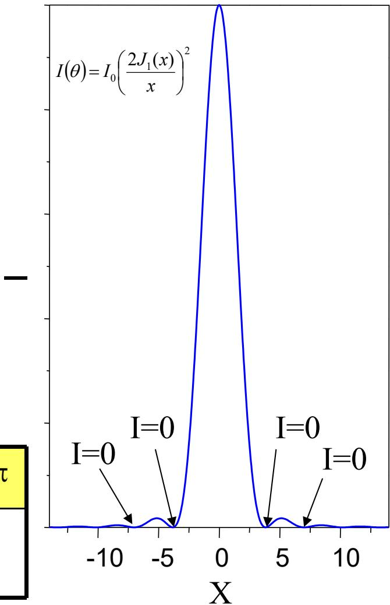

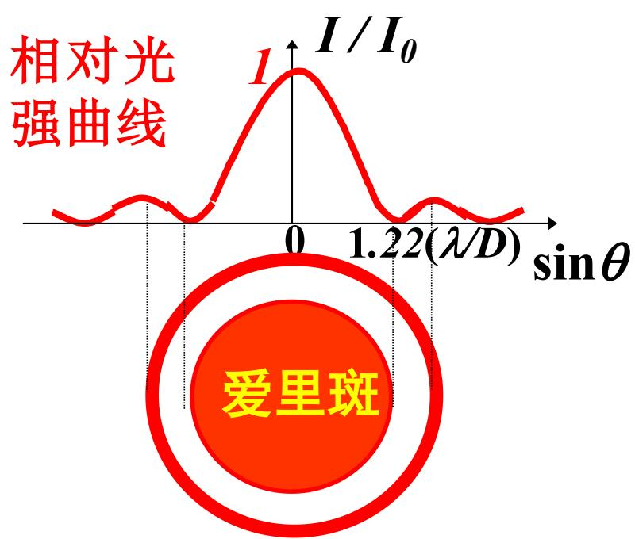

第一个暗环的方位角 $\theta _ { 1 0 } \gamma _ { \mathbb { J } } $ ：

x 1.22 sin 1.222 sin 0    R $\frac { 2 \pi R \sin \theta _ { 0 } } { \lambda } = 1 . 2 2 \pi \Rightarrow \sin \theta _ { 0 } = 1 . 2 2 \frac { \lambda } { D } ,$ 为圆孔直径。2D R

艾里斑的半角宽度 $\Delta \theta _ { 0 }$ 体现了圆孔衍射效应的强弱程度，由上式得：

$\Delta \theta _ { 0 } \approx 1 . 2 2 { \frac { \lambda } { D } } , \enspace \enspace { \overrightarrow { \ast } } \enspace \enspace D \cdot \Delta \theta _ { 0 } \approx 1 . 2 2 \lambda$ 

它和单缝和矩形孔的衍射反比律公式一致，只是系数有差别。

# 光学仪器的分辨本领

分辨本领是一个复杂的问题，它涉及到几何光学系统的种种相差和缺欠，涉及到被分辨物点的亮度和其他一些性质。我们现在考虑理想的分辨本领，即两个亮度相同、波长相等的独立光源经过光学系统所能达到的最佳分辨本领，也就是光学仪器的分辨本领的衍射极限。

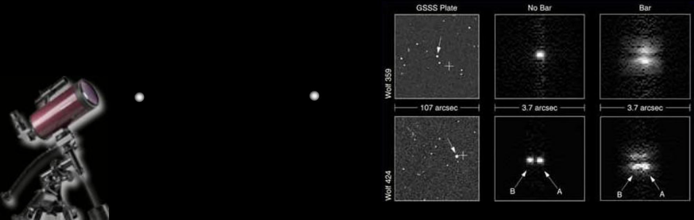

几何光学 : . 物点 像点

物(物点集合)  像(像点集合)

波动光学 : 物点  像斑

物(物点集合)  像(像斑集合)

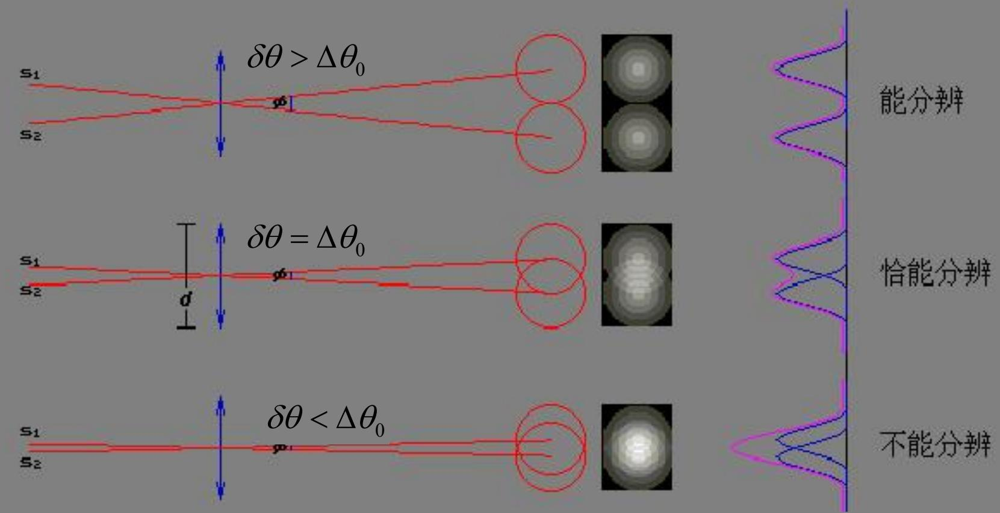

瑞利判据：两个物点反应在像面上有两个艾里斑，设两物点的夹角或两艾里斑中心的夹角为80，每个艾里斑自身的半角宽度为△0，瑞利判据是：当80>△00时，可分辨；当80<△00时，不可分辨；当80=△00时，给出可分辨的最小角度--80,

*人眼睛的分辨本领

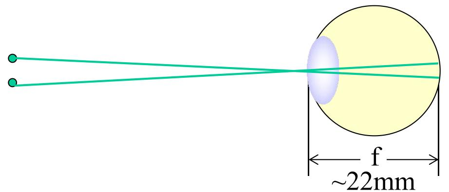

决定眼睛分辨本领的是瞳孔的直径De, $\mathrm { D _ { e } }$ 白昼小，黑夜大，正常范围在2~8mm,分析白昼时，人眼的分辨本领 $\delta \theta _ { \mathrm { e } }$ .

nm~ 550 ， $D _ { e } \sim 2 m m$ ，眼睛晶体折射率 $n \approx 1 . 3$ 3

$$
\delta \theta_ {e} = 1. 2 2 \frac {\lambda}{D _ {e}} = 1. 2 2 \times \frac {5 5 0 n m}{2 m m} \approx 3. 3 \times 1 0 ^ {- 4} r a d \approx 1 ^ {\prime}
$$

cm 25 正常人的明视距离为 ，在明视距离处，人可 分辨：

$$
\delta y _ {e} = l \cdot \delta \theta_ {e} = 2 5 c m \times 3. 3 \times 1 0 ^ {- 4} r a d = 0. 0 8 m m
$$

m10 人眼在 处的分辨本领： $\delta y _ { e } = l \cdot \delta \theta _ { e } = 1 0 m \times 3 . 3 \times 1 0 ^ { - 4 } r a d = 3 .$ mm 3人眼睛分辨本领对一些仪器的设计有指导作用。

# *人眼睛的感光细胞密度

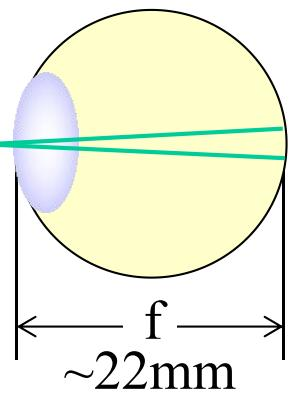

，在黑夜~ 550nm $D _ { e } \sim 8 m m $ ，晶体折射率 $n \approx 1 . 3$ 3

$$
\delta \theta_ {e} = 1. 2 2 \frac {\lambda}{D _ {e}} = 1. 2 2 \times \frac {5 5 0 n m}{8 m m} \approx 0. 8 \times 1 0 ^ {- 4} r a d
$$

人眼睛焦距， $f \approx 2 2 m m$ 所以：,

$$
d \approx \frac {1}{1 . 3 3} \times f \cdot \delta \theta_ {e} = 1. 3 \mu m, s \approx \frac {\pi}{4} d ^ {2} \approx 1. 3 \times 1 0 ^ {- 6} m m ^ {2}
$$

则感光细胞的面密度为 ： 个7 10 /1 5 2mmn   s

视网膜的面积： $S \approx 2 0 0 m m ^ { 2 }$ ，所以人眼视网膜上感光细胞总数为：

$$
N = n \cdot S \sim 1 \mathrm {亿 个}
$$

# 补充说明：

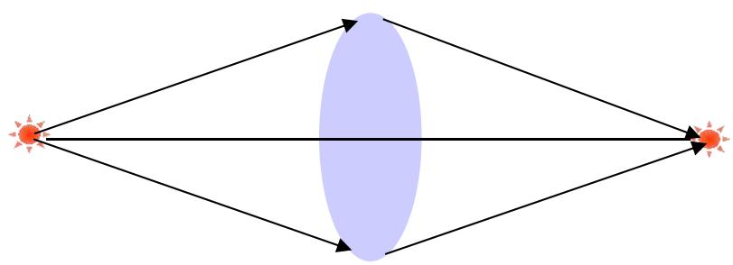

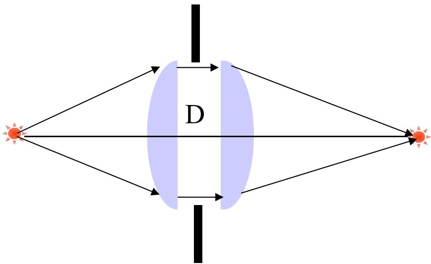

夫琅禾费圆孔衍射是一个在一切使用透镜的光学系统中普遍存在的现象，因为任何一个单透镜成像，都可以看成两个透镜加上一个光阑的组合。因此几何像点实际上是有一定半径的艾里斑，这种情况就产生了一个问题，即两个像斑可能发生重叠，重叠到一定程度，就无法分辨。这就是仪器的分辨本领问题。

# *望远镜的分辨本领和物镜口径

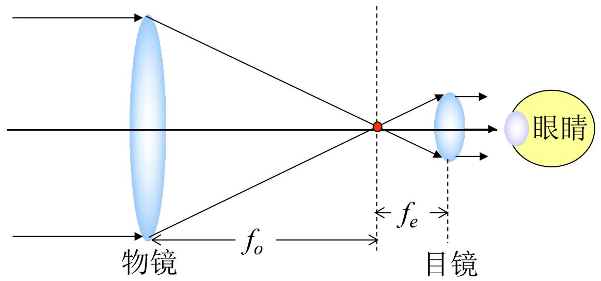

望远镜的角放大倍数为：

$$
M = \frac {f _ {o}}{f _ {e}}
$$

望远镜的角分辨本领决定于物镜的口径 $D _ { o }$ ，因为望远镜的孔径光阑是物镜—凡是被物镜接受的正入射宽光束总能全部通过目镜而进入人眼睛，故此望远镜的最小分辨角为：

$$
\delta \theta_ {m} \approx 1. 2 2 \frac {\lambda}{D _ {o}}
$$

有效放大率： M ef e m  最小分辨角度 等于人眼的分辨角。 $\delta \theta _ { m }$ 经过 $M _ { \it e f f }$ 放大恰好

例题：一光学望远镜，物镜的口径 $D _ { o } \sim 2 0 0 0 m m$ ，求它的最小分辨角度和有效放大倍数？

解：

$$
\delta \theta_ {m} \approx 1. 2 2 \frac {\lambda}{D _ {0}} = 1. 2 2 \times \frac {5 5 0 n m}{2 0 0 0 m m} \approx 3. 3 \times 1 0 ^ {- 7} \approx 0. 0 0 1 ^ {\prime}
$$

$$
M _ {e f f} = \frac {\delta \theta_ {e}}{\delta \theta_ {m}} \approx \frac {3 . 3 \times 1 0 ^ {- 4} r a d}{3 . 3 \times 1 0 ^ {- 7} r a d} \approx 1 0 ^ {3} \mathrm {倍}
$$

*显微镜的分辨本领和物镜数值孔径

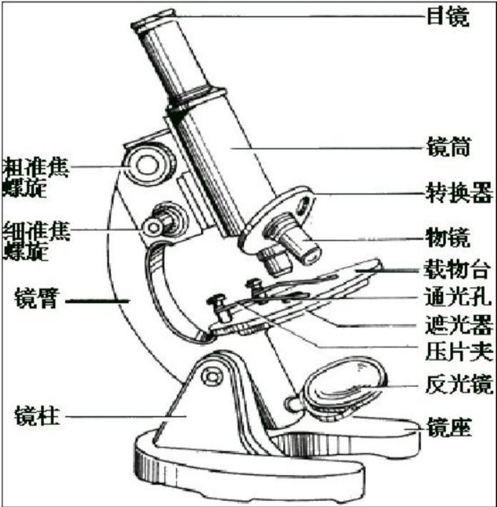

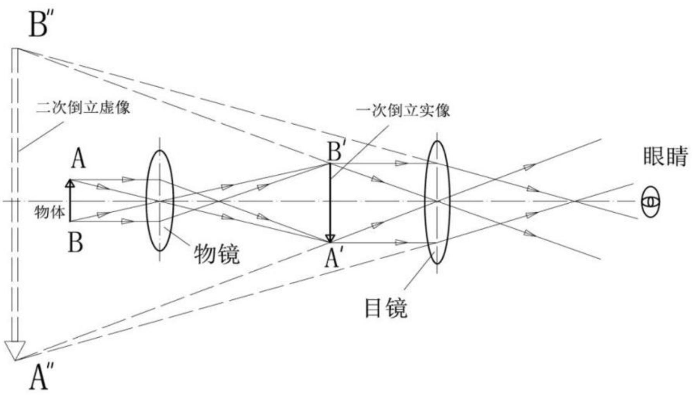

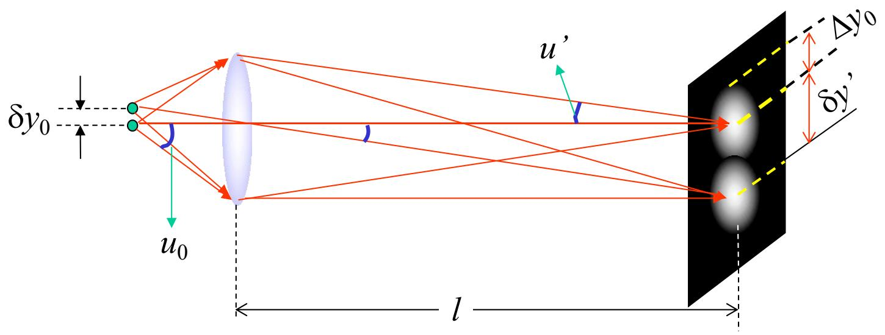

艾里斑对物镜中心张开的半角宽度： $\Delta \theta _ { 0 } \approx 1 . 2 2 \frac { \lambda _ { 0 } } { n ^ { \prime } D }$ ；瑞利判据在此表现为：0

$\delta { y _ { } } ^ { \prime } = \Delta y _ { 0 } = l \cdot \Delta \theta _ { 0 } = 1 . 2 2 \frac { { { \lambda } _ { 0 } } } { { { n } ^ { \prime } } \frac { { D } } { l } } ;$ 有几何关系： 2sin ' Du  $\imath u ^ { \prime } \approx \frac { \not { J } 2 } { l } = \frac { D } { 2 \cdot l }$ D 得：Z

$\delta { y _ { m } } ^ { \prime } = 0 . 6 1 \frac { { \lambda _ { 0 } } } { { { n ^ { \prime } } \sin u ^ { \prime } } } ,$ 由 正弦条件， Abbe $n _ { 0 } \delta y _ { 0 }$ sin $u _ { 0 } = n ^ { \prime } \delta y ^ { \prime } \sin u ^ { \prime }$ 得：

0 0.61y m  $\delta y _ { 0 m } = 0 . 6 1 \frac { \lambda _ { 0 } } { n _ { 0 } \sin u _ { 0 } } = 0 . 6 1 \frac { \lambda _ { 0 } } { N . A . }$ ， 称为显微镜的数值孔径 。0 0 0  . . sin  N A n u    $N . A . = n _ { 0 }$ $u _ { 0 }$ 

$$
\delta y _ {0 m} = 0. 6 1 \frac {\lambda_ {0}}{n _ {0} \sin u _ {0}} = 0. 6 1 \frac {\lambda_ {0}}{N . A .}
$$

# *几点说明：

1. 显微镜的有效放大倍数：

$$
M _ {e f f} = \frac {\delta y _ {e}}{\delta y _ {0 m}}
$$

比如，显微镜的 $N . A . { = } 1 . 5 $ ,照明波长为550nm的有效放大倍数：

$$
M _ {e f f} = \frac {\delta y _ {e}}{\delta y _ {0 m}} = \frac {\delta y _ {e}}{0 . 6 1 \frac {\lambda_ {0}}{N . A .}} = \frac {0 . 1 m m}{0 . 6 1 \times \frac {5 5 0 n m}{1 . 5}} \approx 4 5 0 倍
$$

这是光学显微镜的最大放大倍数，因为超过M 的放大倍数以试图看到小于 $\delta \mathrm { y } _ { 0 \mathrm { m } }$ 的细节是徒劳的。

2. 提高分辨率的方法之一是提高N.A.，可通过油浸和使用广角透镜获得较大的数值孔径。不过N.A.最大为1.5左右，此时 $\delta y _ { 0 \mathrm { m } } { \approx } \lambda _ { 0 } / 2 .$ ,这是传统光学显微镜的极限分辨率—半波长。

3. 选择短波长光照明是提高显微镜分辨本领的另一个途径。

*电子显微镜：

传统的光学显微镜的分辨本领受限于光波长，使用短波长光照明是提高显微镜分辨本领的途径之一。利用运动电子的具有波动性制造电子显微镜，因为电子的德布罗意波长极短，所以它有极高的空间分辨本领。

电子显微镜的分辨本领，电子束发散角较小， $\mathbf { u } _ { 0 } { \sim } 0$ .16rad；

$$
\delta y _ {m} ^ {E} \approx 0. 6 1 \frac {\lambda_ {e}}{N . A .} \approx 0. 6 1 \frac {\lambda_ {e}}{0 . 1 6} \approx 4 \lambda_ {e}
$$

电子波长取决于电子的加速电压：

$$
\begin{array}{l} \frac {1}{2} \frac {p ^ {2}}{m} = e V \\ \lambda_ {e} = \frac {h}{p} = \frac {h}{\sqrt {2 m e V}} \\ \end{array}
$$

<table><tr><td>加速电压</td><td>电子波长</td><td>分辨本领</td><td>有效放大率</td></tr><tr><td>104V</td><td>1.2×10-2nm</td><td>5×10-2nm</td><td>2×106</td></tr><tr><td>105V</td><td>3.7×10-3nm</td><td>1.5×10-2nm</td><td>6×106</td></tr></table>

1986年诺贝尔物理学奖一半授予德国柏林弗利兹-哈伯学院（Fritz-Haber-Institut der Max-Planck-Gesellschaft）的恩斯特·鲁斯卡（ErnstRuska，1906-1988)，以表彰他在电光学领域做了基础性工作，并设计了第一架电子显微镜；另一半授予瑞士鲁希利康（Rüschlikon）IBM苏黎世研究实验室的德国物理学家宾尼希（Gerd Binnig，1947-）和瑞士物理学家罗雷尔（HeinrichRohrer，1933-)以表彰他们设计出了扫描隧道显微镜。

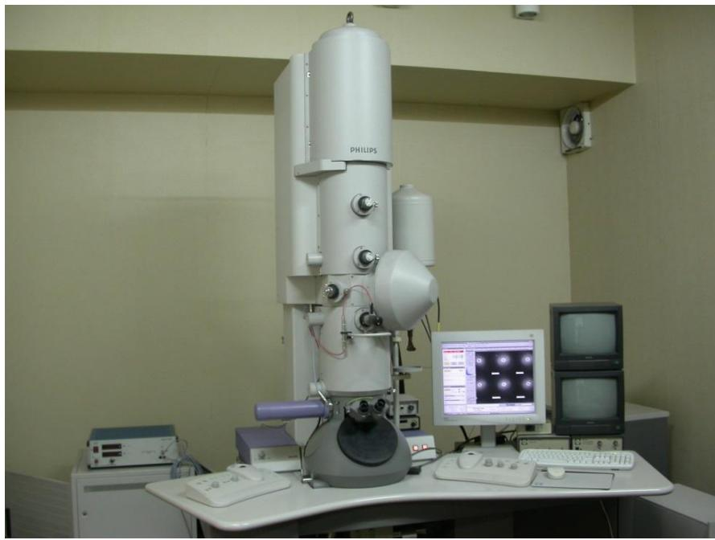

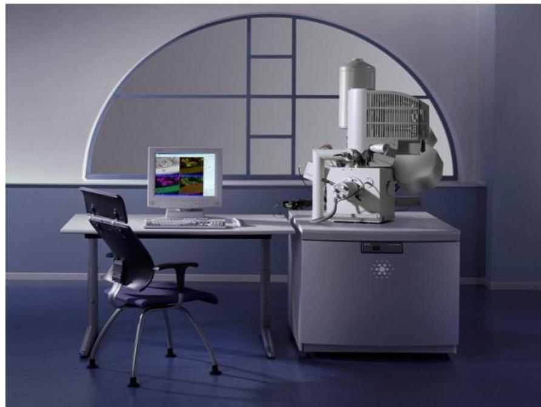

环境可控扫描电镜

# TECNAI F30场发射透射电镜

点分辨率：0.205 nm point at 300kV线分辨率：0.102 nm line at 300kV

特点:图像分辨率高对任何样品无需处理，可直接进行观察；进行动态反应过程的直接观察 。

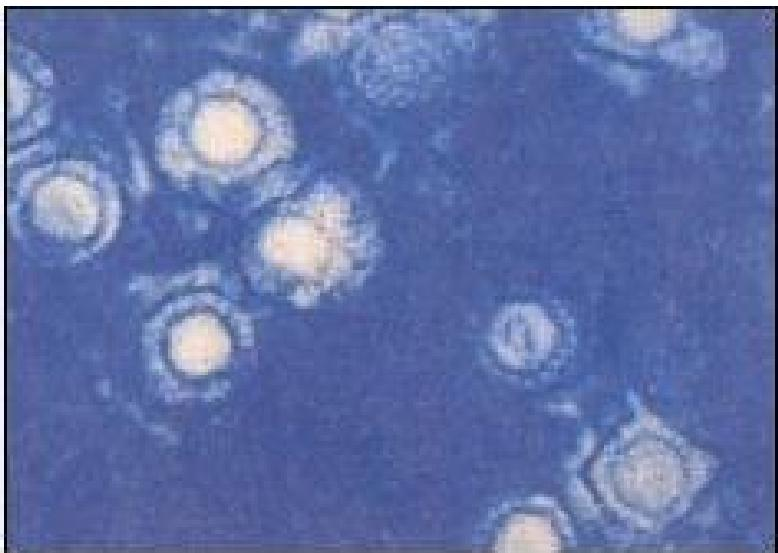

球形病毒

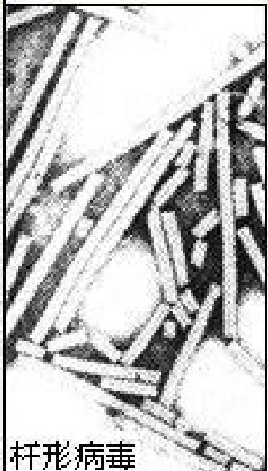

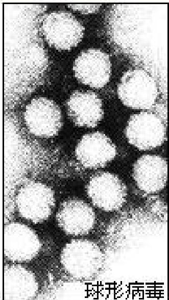

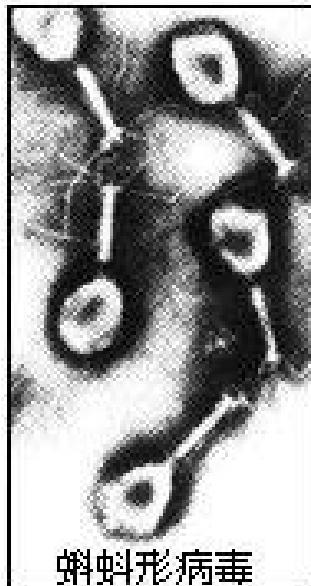

电子显微镜下的病毒照片

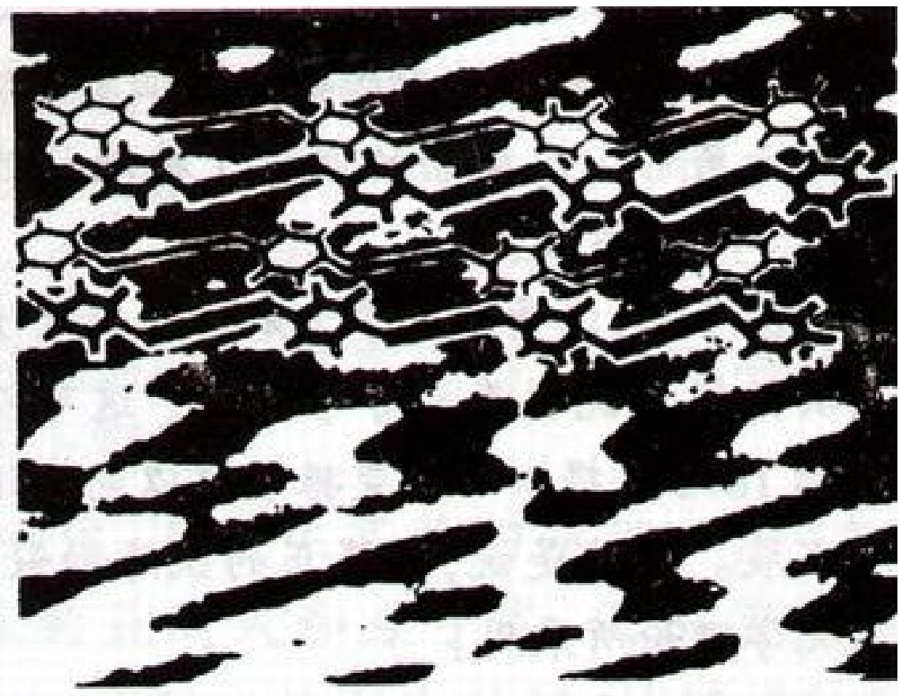

用电子显微镜拍摄的苯分子照片

# *像记录介质的空间分辨率

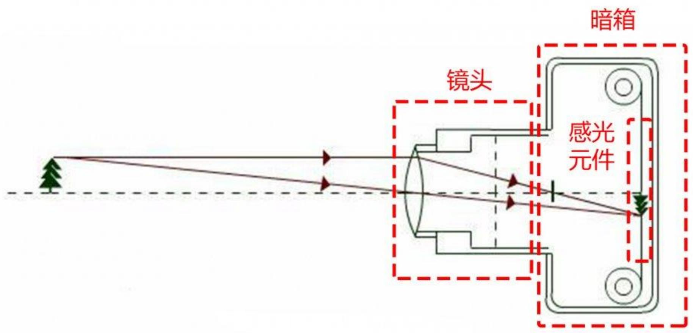

4.0例题：一照相机，选其光圈为 ，即相对孔径 ${ \frac { D } { f } } = { \frac { 1 } { 4 } } ,$ ，计算像方最小分辨率？

$$
\delta \dot {y} _ {m} ^ {\prime} \approx f \cdot \Delta \theta_ {0} \approx 1. 2 2 \frac {\lambda}{D} \cdot f = 1. 2 2 \frac {\lambda}{D / f} = 1. 2 2 \times 4 \lambda
$$

nm550这里 ，所以：

$$
\delta \mathbf {y} _ {m} ^ {\prime} \approx 2. 7 \mu m
$$

与其匹配的胶卷的空间分辨率应该是：

$$
N \geq \frac {1}{\delta y _ {m} ^ {\prime}} \approx 3 7 0 \text {线 / m m}
$$

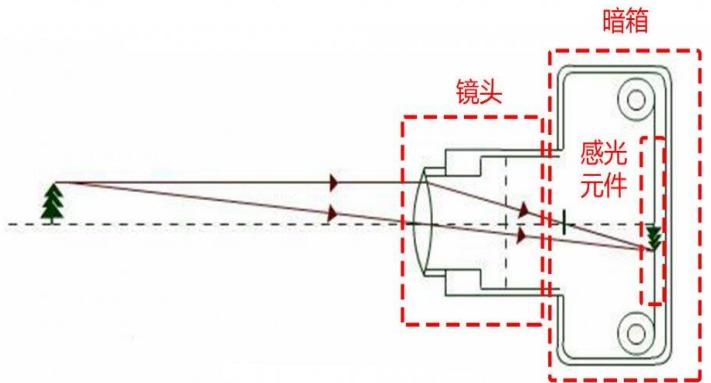

附录：阿贝正弦条件

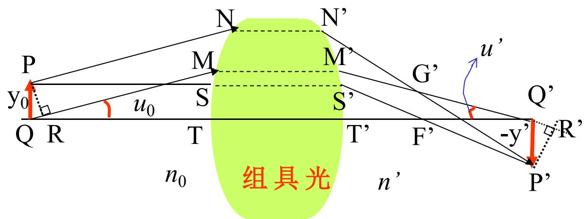

在傍轴条件下：

$$
\left(F ^ {\prime} P ^ {\prime}\right) = \left(F ^ {\prime} Q ^ {\prime}\right), \quad \left(G ^ {\prime} P ^ {\prime}\right) = \left(G ^ {\prime} R ^ {\prime}\right)
$$

物像等光程

$$
\begin{array}{l} (P N N ^ {\prime} P ^ {\prime}) = (P S S ^ {\prime} P ^ {\prime}); \quad (Q M M ^ {\prime} Q ^ {\prime}) = (Q T T ^ {\prime} Q ^ {\prime}) \\ \left(P N N ^ {\prime} G ^ {\prime}\right) = \left(R M M ^ {\prime} G ^ {\prime}\right); \quad \left(P S S ^ {\prime} F ^ {\prime}\right) = \left(Q T T ^ {\prime} F ^ {\prime}\right) \\ \end{array}
$$

所以：

$$
\left(Q R\right) = \left(Q ^ {\prime} R ^ {\prime}\right); \qquad \left(Q R\right) = n _ {0} y _ {0} \sin u _ {0}, \qquad \left(Q ^ {\prime} R ^ {\prime}\right) = n ^ {\prime} y ^ {\prime} \sin u ^ {\prime}
$$

得到阿贝正弦条件：

$$
n _ {0} y _ {0} \sin u _ {0} = n ^ {\prime} y ^ {\prime} \sin u ^ {\prime}
$$

补充题：圆孔夫琅禾费衍射，圆孔的直径为D，透镜前的介质为空气（折射率 $\bf { \Pi } \cdot \bf { n } _ { 1 } \mathrm { = } 1 )$ ，透镜后的介质折射率为 ${ \bf n } _ { 2 }$ ，透镜在介质2中的后焦距为f ，入射光波长在空气中为 $\lambda _ { 0 }$ ，求接受屏 $\bf ( x , y )$ 上艾里斑大小？

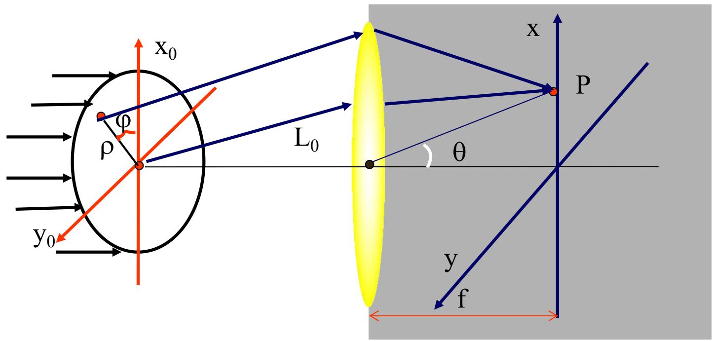

# 五、 位移-相移定理

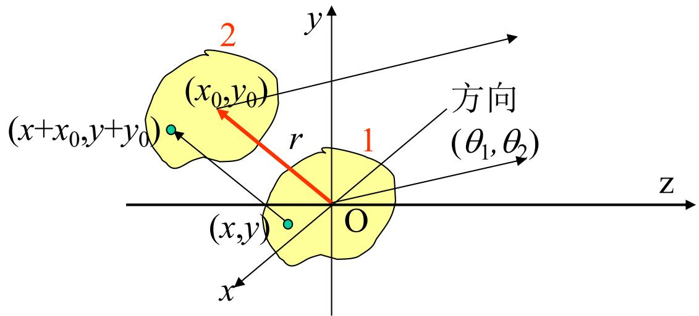

$$
\widetilde {U} _ {1} (\theta_ {1}, \theta_ {2}) = \frac {- i}{\lambda} \iint_ {\Sigma_ {0}} f (\theta_ {0}, \theta) \widetilde {U} _ {0} (x, y) \frac {e ^ {i k r _ {1}}}{r _ {1}} d x d y
$$

在傍轴条件下， $f ( \theta _ { 0 } , \theta ) \approx 1 \mathrm { . }$ r，振幅系数 1 → 1 经透镜变换 1f10r

所以： $\widetilde { U } _ { 1 } ( \theta _ { 1 } , \theta _ { 2 } ) = \frac { - i } { \lambda } \underset { \Sigma _ { 0 } } { \iint } \widetilde { U } _ { 0 } ( x , y ) \frac { e ^ { i k r _ { 1 } } } { f } d x d y$ 1eikr

同理： $\widetilde { U } _ { 2 } ( \theta _ { 1 } , \theta _ { 2 } ) = \frac { - i } { \lambda } \int \int \displaylimits _ { \Sigma _ { 0 } } ^ { \infty } \Bigl ( x + x _ { 0 } , y + y _ { 0 } \Bigr ) \frac { e ^ { i k r _ { 2 } } } { f } d ($ 2eikr ( ) ( ) 00x x d y y       '0

$$
\widetilde {U} _ {0} (x + x _ {0}, y + y _ {0}) = \widetilde {U} _ {0} (x, y), \qquad \Sigma_ {0} ^ {\prime} = \Sigma_ {0}, \qquad k r _ {2} - k r _ {1} = - k (x _ {0} \sin \theta_ {1} + y _ {0} \sin \theta_ {2})
$$

$$
\begin{array}{l} \widetilde {U} _ {2} (\theta_ {1}, \theta_ {2}) = \frac {- i}{\lambda} \iint_ {\Sigma_ {0}} \widetilde {U} _ {0} (x, y) \frac {e ^ {i k r _ {1} - i k (x _ {0} \sin \theta_ {1} + y _ {0} \sin \theta_ {2})}}{f} d x d y \\ = e ^ {- i k (x _ {0} \sin \theta_ {1} + y _ {0} \sin \theta_ {2})} \cdot \frac {- i}{\lambda} \iint_ {\Sigma_ {0}} \widetilde {U} _ {0} (x, y) \frac {e ^ {i k r _ {1}}}{f} d x d y \\ = e ^ {- i k (x _ {0} \sin \theta_ {1} + y _ {0} \sin \theta_ {2})} \cdot \widetilde {U} _ {1} (\theta_ {1}, \theta_ {2}) \\ \end{array}
$$

位移-相移定理:

在夫琅禾费衍射系统中，当一个图像位移时，夫琅禾费衍射场响应一个相移；

图像位移 $( x _ { 0 } , y _ { 0 } ) { \Longleftrightarrow } \implies$ 衍射场相 移 $\left( \delta _ { 1 } \right.$ ， $\delta _ { 2 } )$ 

$$
\widetilde {U} ^ {\prime} (\theta_ {1}, \theta_ {2}) = e ^ {i (\delta_ {1} + \delta_ {2})} \cdot \widetilde {U} (\theta_ {1}, \theta_ {2})
$$

这里： $\left\{ { \begin{array} { l } { \delta _ { 1 } = - k x _ { 0 } \sin \theta _ { 1 } } \\ { \delta _ { 2 } = - k y _ { 0 } \sin \theta _ { 2 } } \end{array} } \right.$ 

说明：对该定理的证明中，隐含了“系统具有空间不变性” 。

*全同结构的夫琅禾费衍射场

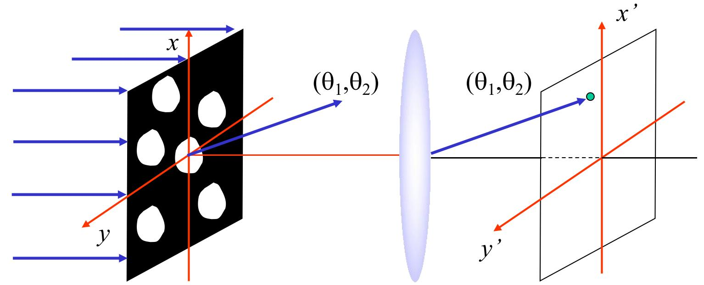

  1 2( , ) i i i ix y 图像位移 衍射场相移 ，

$\widetilde { U } _ { i } ( \theta _ { 1 } , \theta _ { 2 } ) = e ^ { i ( \delta _ { i 1 } + \delta _ { i 2 } ) } \cdot \widetilde { U } _ { 0 } ( \theta _ { 1 } , \theta _ { 2 } ) ;$ 其中： $\left\{ { \begin{array} { l } { \delta _ { i 1 } = - k x _ { i } \sin \theta _ { 1 } } \\ { \delta _ { i 2 } = - k y _ { i } \sin \theta _ { 2 } } \end{array} } \right.$ 

总的衍射场：

$$
\widetilde {U} (\theta_ {1}, \theta_ {2}) = \sum_ {i = 0} ^ {N - 1} \widetilde {U} _ {i} (\theta_ {1}, \theta_ {2}) = \widetilde {U} _ {0} (\theta_ {1}, \theta_ {2}) \left(\sum_ {i = 0} ^ {N - 1} (e ^ {i (\delta_ {i 1} + \delta_ {i 2})})\right)
$$

例题：求解五方孔的夫琅禾费衍射场

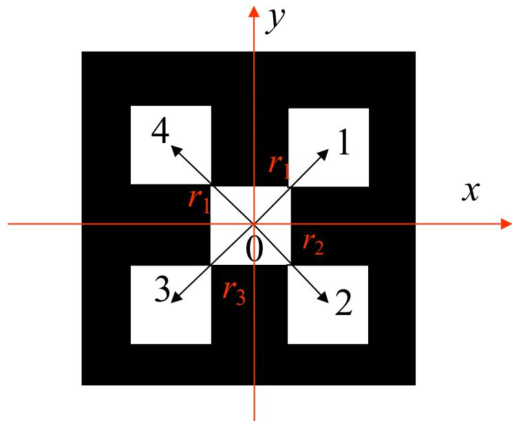

方孔夫琅禾费衍射场 ( )a b ：

$\widetilde { U } _ { \upsilon } ( \theta _ { 1 } , \theta _ { 2 } ) = \widetilde { c } \Bigg ( \frac { \sin { \alpha } } { \alpha } \Bigg ) \Bigg ( \frac { \sin { \beta } } { \beta } \Bigg ) ,$ 1 2   sin sina a ，其中 ，

位移： $r _ { 1 } , ( a , a ) , \quad r _ { 2 } , ( a , - a ) , \quad r _ { 3 } , ( - a , - a ) , \quad r _ { 4 } \colon$ ,  a, a

位移—相移定理：

$$
\widetilde {U} _ {1} (\theta_ {1}, \theta_ {2}) = e ^ {- i k (a \sin \theta_ {1} + a \sin \theta_ {2})} \cdot \widetilde {U} _ {0} (\theta_ {1}, \theta_ {2})
$$

$$
\begin{array}{l} \widetilde {U} _ {2} \left(\theta_ {1}, \theta_ {2}\right) = e ^ {- i k \left(a \sin \theta_ {1} - a \sin \theta_ {2}\right)} \cdot \widetilde {U} _ {0} \left(\theta_ {1}, \theta_ {2}\right) \\ \widetilde {U} _ {3} (\theta_ {1}, \theta_ {2}) = e ^ {- i k (- a \sin \theta_ {1} - a \sin \theta_ {2})} \cdot \widetilde {U} _ {0} (\theta_ {1}, \theta_ {2}) \\ \widetilde {U} _ {4} (\theta_ {1}, \theta_ {2}) = e ^ {- i k (- a \sin \theta_ {1} + a \sin \theta_ {2})} \cdot \widetilde {U} _ {0} (\theta_ {1}, \theta_ {2}) \\ \end{array}
$$

这五个方孔的衍射场为 ：

$$
\begin{array}{l} \widetilde {U} \left(\theta_ {1}, \theta_ {2}\right) = \widetilde {U} _ {0} \left(\theta_ {1}, \theta_ {2}\right) + \widetilde {U} _ {1} \left(\theta_ {1}, \theta_ {2}\right) + \widetilde {U} _ {2} \left(\theta_ {1}, \theta_ {2}\right) + \widetilde {U} _ {3} \left(\theta_ {1}, \theta_ {2}\right) + \widetilde {U} _ {4} \left(\theta_ {1}, \theta_ {2}\right) \\ = \widetilde {U} _ {0} (\theta_ {1}, \theta_ {2}) \Big (1 + e ^ {- i k (a \sin \theta_ {1} + a \sin \theta_ {2})} + e ^ {- i k (a \sin \theta_ {1} - a \sin \theta_ {2})} + e ^ {- i k (- a \sin \theta_ {1} - a \sin \theta_ {2})} + e ^ {- i k (- a \sin \theta_ {1} + a \sin \theta_ {2})} \Big) \\ = \widetilde {c} \left(\frac {\sin \alpha}{\alpha}\right) \left(\frac {\sin \beta}{\beta}\right) \left(1 + 2 \cos (a \sin \theta_ {1} + a \sin \theta_ {2}) + 2 \cos (a \sin \theta_ {1} - a \sin \theta_ {2})\right) \\ \end{array}
$$

$$
I (\theta_ {1}, \theta_ {2}) = \widetilde {U} (\theta_ {1}, \theta_ {2}) \cdot \widetilde {U} ^ {*} (\theta_ {1}, \theta_ {2})
$$

注解：  ~ 0ikLAabei c 一f

# 六、一维光栅、二维光栅

光栅：凡是含有众多全同单元，并且排列规则、取向有序的周期结构，统称为光栅。

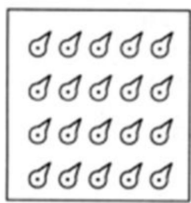

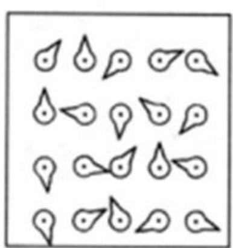

（b)

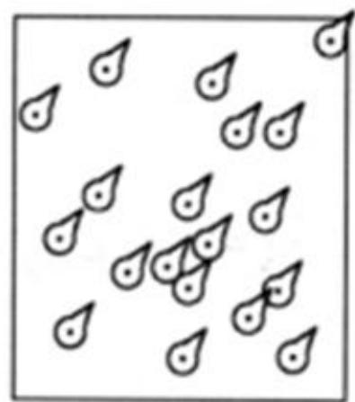

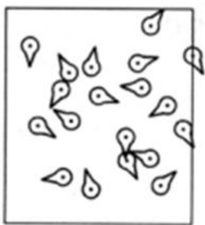

一维光栅是最简单的一种光栅，也是常用的一种光栅。如下图就是一个一维光栅，其透光缝宽为 $\pmb { a }$ ，挡光宽度为b，即光栅的空间周期$\scriptstyle d = a + b$ ， 也称为光栅常数。

描述光栅的参数：单元密度： $n = { \frac { 1 } { d } } ,$ ，比如 、 等；mm mm600 / 1200 /

光栅的有效宽度： $D$ ，比如 、 等cm cm5 10

光栅的单元总数： $N = n D = D / d$ 

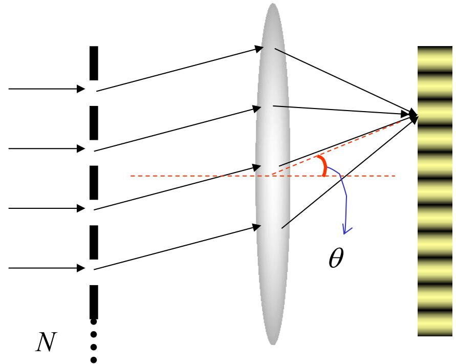

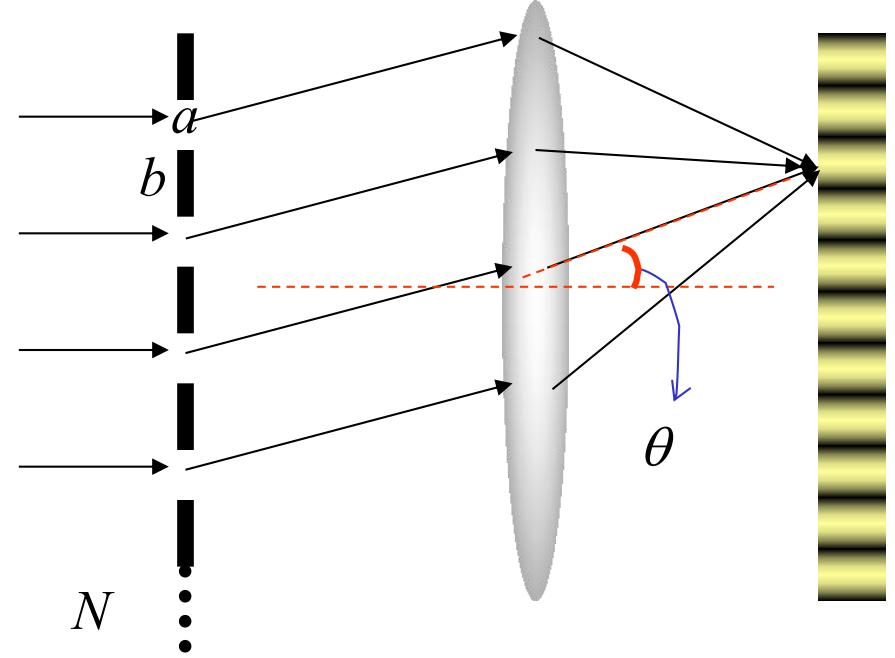

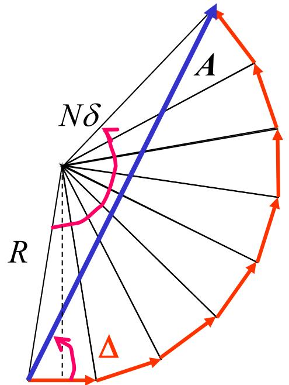

位移 $x _ { m } = - m d \iff$ 相移 $\delta _ { { \scriptscriptstyle m } } = \frac { 2 \pi } { \lambda } m d$ sin  m

光栅衍射场： 0 ( )~( )~ U U  m N  ${ \bf \Phi } _ { 0 } ^ { 1 } \left( e ^ { i \delta _ { m } } \right) = \widetilde U _ { 0 } ( \theta ) \frac { 1 - e ^ { i N \delta } } { 1 - e ^ { i \delta } } = \widetilde U _ { 0 } ( \theta ) e ^ { i ( N - 1 ) \beta } \left( \frac { \mathrm { s i } } { \mathrm { s } } \right.$ ( )e i m 1  e iN 1   e  i n   N in

其中 $\beta = \frac { \delta } { 2 } = \frac { \pi } { \lambda } d$ sin $\theta$ ，这里利用了公式 $( 1 - e ^ { i \Phi } ) = - 2 i \cdot \sin \frac { \Phi } { 2 } \cdot e ^ { \frac { \Phi } { 2 } }$ 

矢

$$
\Delta A = 2 R \sin \frac {\delta}{2} \Rightarrow R = \frac {\Delta A}{2 \sin \frac {\delta}{2}} \Rightarrow A = 2 R \sin \frac {N \delta}{2} = \Delta A \cdot \frac {\sin \frac {N \delta}{2}}{\sin \frac {\delta}{2}}
$$

光栅衍射场： A $( \theta ) = \Delta A ( \theta ) \left( \frac { \sin \displaystyle \frac { N \delta } { 2 } } { \sin \displaystyle \frac { \delta } { 2 } } \right) = \Delta A ( \theta ) \left( \frac { \sin N _ { \beta } } { \sin \beta } \right)$ B

矢量图解和等比求和得到的结果完全一样。

单缝夫琅禾费衍射场： $\widetilde { U } _ { \scriptscriptstyle 0 } ( \theta ) = \widetilde { c } \left( \frac { \sin \alpha } { \alpha } \right) ,$ ，其中 $\alpha = { \frac { \pi a \sin \theta } { \lambda } }$ 

( 1) ~ sin sin( ) ~      NU c e 所以： i N $\widetilde { U } ( \theta ) = \widetilde { c } e ^ { i ( N - 1 ) \beta } \Biggl ( \frac { \sin \alpha } { \alpha } \Biggr ) \Biggl ( \frac { \sin N \beta } { \sin \beta } \Biggr )$ 

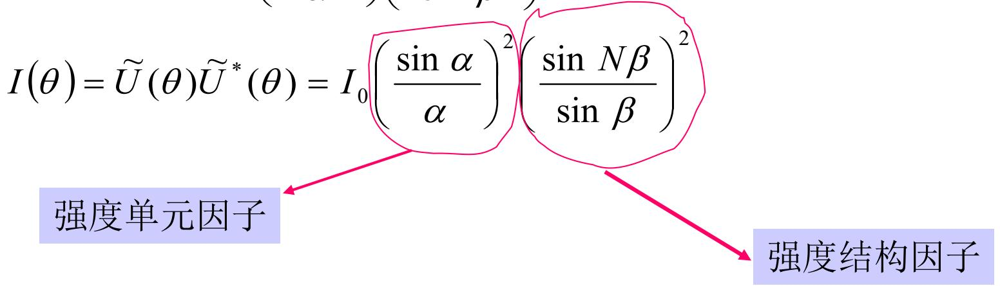

*一维光栅强度的主要特点

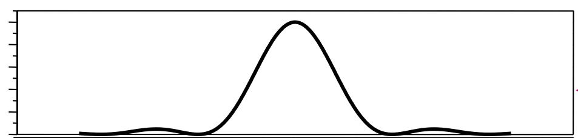

N=1

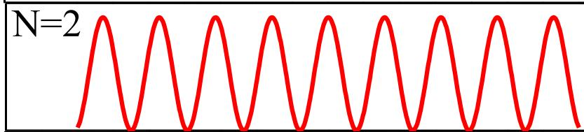

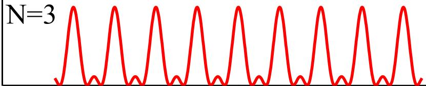

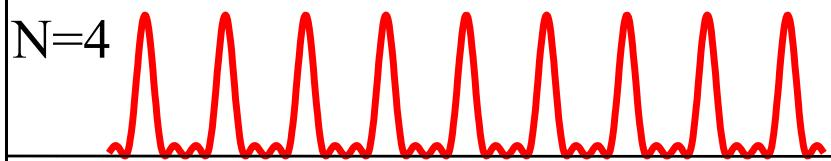

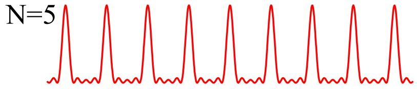

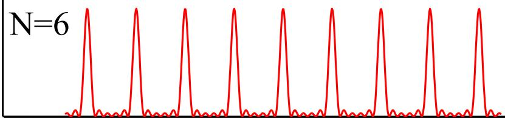

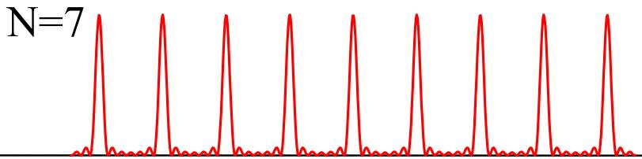

$$
I (\theta) = \boxed {I _ {0} \left(\frac {\sin \alpha}{\alpha}\right) ^ {2} \left(\frac {\sin N \beta}{\sin \beta}\right) ^ {2}}
$$

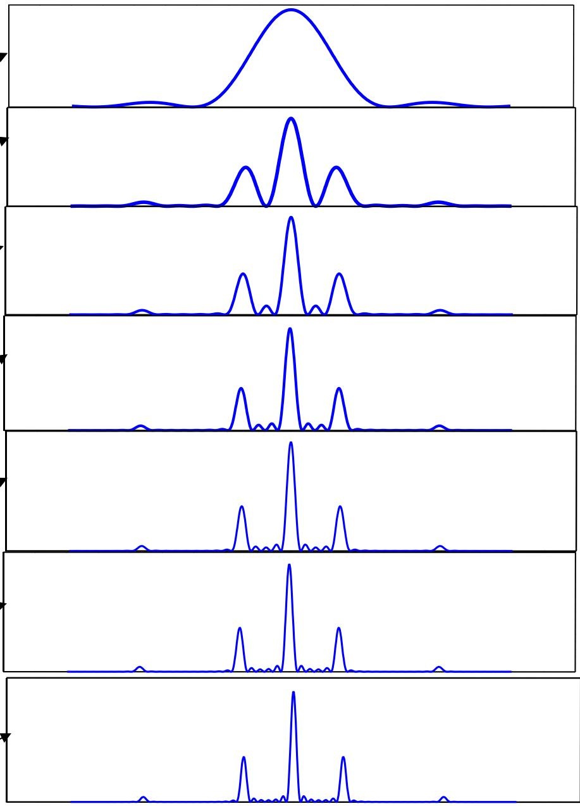

(1)主峰位置：

$\beta = \frac { \pi } { \lambda } d$ sin $\theta = k \pi$ 的地方出现主极强，即 ：

$d$ sin $\theta _ { k } = k \lambda$ ， $k = 0$ 1 2 3...      ， ， ， 此式称为光栅公式。

此时结构因子的极限值 ：

$$
\left(\frac {\sin N \beta}{\sin \beta}\right) ^ {2} = N ^ {2}
$$

于是： $I { \big ( } \theta _ { k } { \big ) } = N ^ { 2 } \cdot I _ { 0 } { \big ( } \theta _ { k } { \big ) }$ 

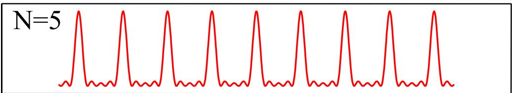

(2) 主峰的半角宽度：

第k级主峰，其左右的第一个零点，即暗点的位置 $( \theta _ { k } , \pm \varDelta \theta )$ ，应该满足：

$$
d \sin \left(\theta_ {k} \pm \Delta \theta_ {k}\right) = \left(k \pm \frac {1}{N}\right) \lambda \Rightarrow d \cos \theta_ {k} \cdot \Delta \theta_ {k} = \frac {\lambda}{N}
$$

k 从而得到 级主峰的半角宽度：

$$
\Delta \theta_ {k} = \frac {\lambda}{N d \cos \theta_ {k}} = \frac {\lambda}{D \cos \theta_ {k}}
$$

光栅尺度越大，主峰半角宽度越小，两者呈反比关系。

(3) 两个主峰之间；

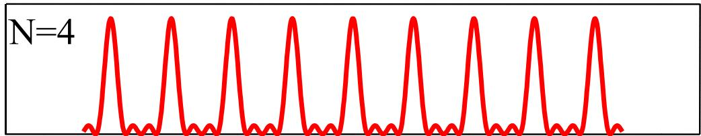

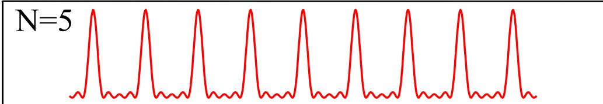

两个主峰之间有N-1个零点和N-2个次极大值，随N的增加，次极强的高度相对于主极强迅速下降，一般光栅N比较大，所以次极强非常弱，于是光栅的衍射图样仅仅观察到离散的非常细锐的条纹。

(4) 单元因子的作用：

单元因子 $( \sin \alpha / \alpha ) ^ { 2 }$ 决定了入射光功率在各主峰之间的分配。在某些特殊情况下，可能使个别主极峰消失—缺级。

sin结构因子主极峰位置：d $\theta _ { k } = k \lambda$ 0 1 2...  ， ， ， k单元因子暗点位置： sin ' 1 2...   ， ，a k k

'   kdk k k 当  时， 级主极峰消失，此时 $\theta _ { k ^ { \prime } } = \theta _ { k }$ $\frac { d } { a } = \frac { k } { k " }$ 

2ad比如 ， $\frac { k } { k ^ { \prime } } = \frac { 2 } { 1 } = \frac { 4 } { 2 } = \frac { 6 } { 3 } \cdots \qquad \mathsf { t r } \mathscr { H } \frac { d } { a } = 1 . 5 , \frac { k } { k ^ { \prime } } = \frac { 3 } { 2 }$ 'k 6 .9

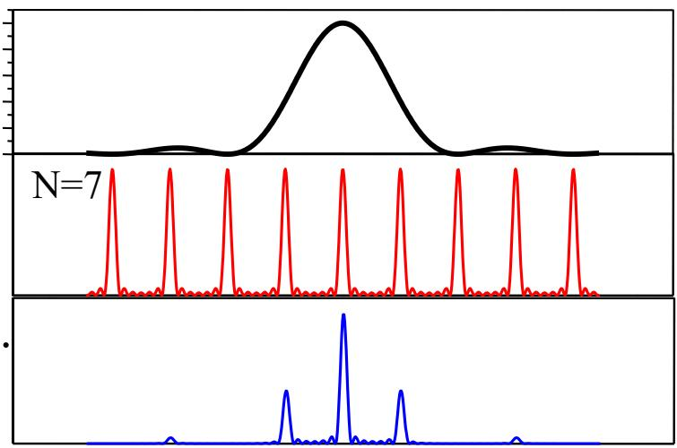

一块一维光栅，刻缝密度为600线/mm，有效尺度为5cm，入射光为氦氖激光，波长为633nm，求第1和2级主峰的方位角以及它们的半角宽度？

解：

根据光栅公式： d sin $\theta _ { k } = k \lambda$ 

$$
d \sin \theta_ {1} = \lambda , d \sin \theta_ {2} = 2 \lambda
$$

1sin 即： 2 nm mm 1 633 600 / 0.38 22 20 '     ，d

$$
\sin \theta_ {2} = \frac {2 \lambda}{d} \approx 0. 7 6, \quad \theta_ {2} \approx 4 9 ^ {\circ} 2 8 ^ {\prime}
$$

根据半角宽度公式： k  $\Delta \theta _ { k } = \frac { \lambda } { D \cos \theta _ { k } }$ 

$$
\Delta \theta_ {1} = \frac {\lambda}{D \cos \theta_ {1}}, \Delta \theta_ {2} = \frac {\lambda}{D \cos \theta_ {2}}
$$

即： $\Delta \theta _ { 1 } = \frac { 6 3 3 n m } { 5 c m \times \cos { \left( 2 2 \mathrm { ~ } ^ { \circ } 2 0 \mathrm { ~ ^ { \circ } } \right) } } \approx 1 . 3 7 \times 1 0 \mathrm { ~ } ^ { - 5 } r a$ 

$$
\Delta \theta_ {2} = \frac {6 3 3 \mathrm {n m}}{5 \mathrm {c m} \times \cos \left(4 9 ^ {\circ} 2 8 ^ {\prime}\right)} \approx 1. 9 5 \times 1 0 ^ {- 5} \mathrm {r a d}
$$

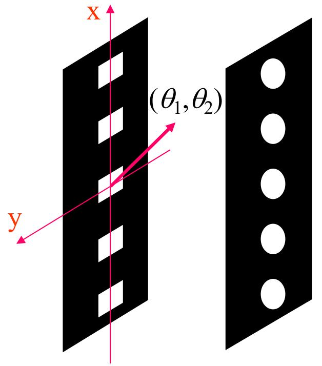

$$
\widetilde {U} \left(\theta_ {1}, \theta_ {2}\right) = \widetilde {u} _ {0} \left(\theta_ {1}, \theta_ {2}\right) \left[ e ^ {i (N - 1) \beta} \cdot \frac {\sin N \beta}{\sin \beta} \right], \text {其 中} \beta = \frac {\pi d \sin \theta_ {1}}{\lambda}
$$

$$
I (\theta_ {1}, \theta_ {2}) = | \widetilde {u} _ {0} (\theta_ {1}, \theta_ {2}) | ^ {2} \left(\frac {\sin N \beta}{\sin \beta}\right) ^ {2}
$$

思考题：

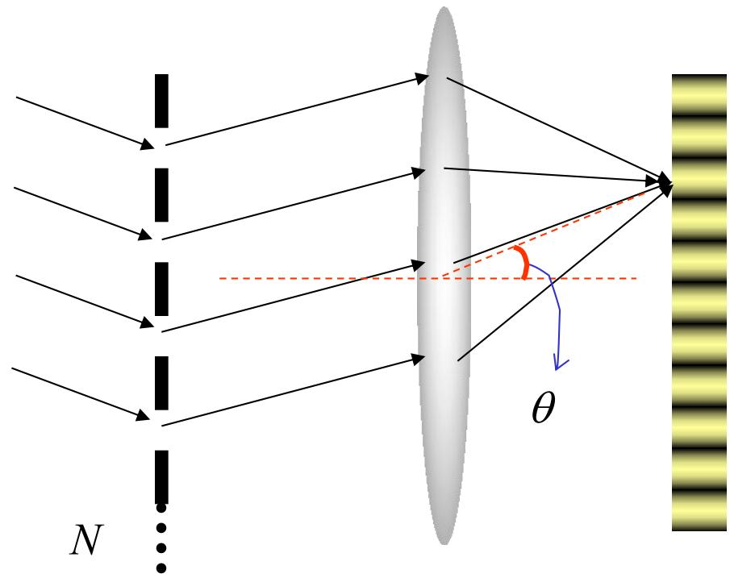

斜入射照明时的光栅衍射场？

补充题：求“品”的夫琅禾费衍射场，黑色表示不透光。三个为全同正方形，边长为a, 入射光正入射平面波，其振幅为A，波长为。

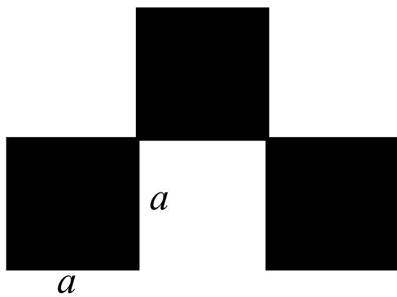

# 光谱仪简介

一个世纪以前光谱技术已有了它的雏形，并作出了至今仍光辉闪耀的成就。一个世纪以来，光谱技术有了长足的发展。量子力学的建立为光谱学奠定了理论基础。研究对象扩展到各种物质层次和物态：从离子、原子、分子到凝聚态，从气态、液态、固态到等离子体，从遥远的天体到显微镜下的DNA。

在光谱分析方法上也已多样化，除了发射、吸收、反射、荧光、散射光谱方法外，还有偏振、旋光、光声、光热、光导等光谱方法，以及微分光谱、调制光谱、付利叶变换、哈特玛变换光谱、干涉分光计、相关光谱仪方法等。在光谱仪器方面（即硬件），扩展了波段，长波方面与毫米波相连；而短波与软射线（100 埃）相连。提高了光谱分辨率、灵敏度（ppm,ppb）、高精确度、高重复性、稳定性。

# 光谱仪的构成

光谱仪一般由5部分构成：

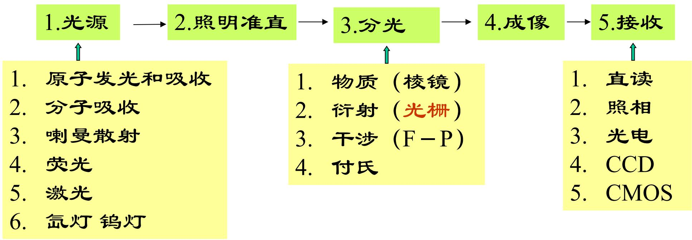

主流读出系统的演变：

直读（单通道，强度分辩本领极低，无时间分辨）

摄谱（多通道，强度分辩本领较低，无时间分辨，低效）

光电（单通道，强度分辩本领高，无时间分辨，低效）

CCD（多通道，强度分辩本领高，时间分辨，高效）

# ·光栅光谱仪一光栅分光原理

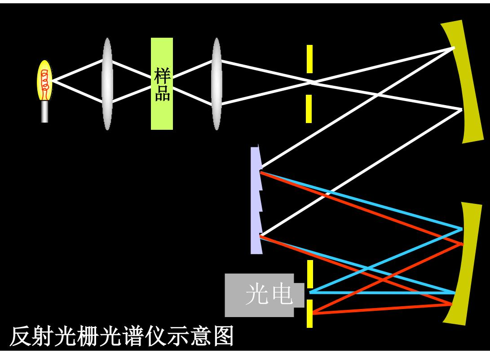

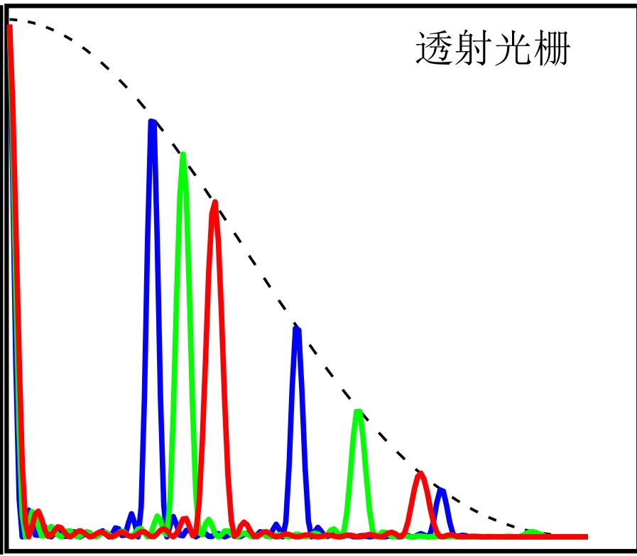



透射光栅，根据光栅公 式： $d$ sin $\theta _ { k } = k \lambda$ ，在不同波长的非零级 主峰$( k \neq 0 )$ 的同级主峰出现在不同 的方位角 $\theta _ { - }$ 上，从而形成光谱。

（）1 零级 $( k = 0 )$ 主峰的方位角都是 $\theta = 0 _ { \circ }$ 

(2) 越是高级 $( k$ 越大 主峰，不同波长的主峰 的方位角 错开越大。 )

# ·一台多功能光栅光谱仪

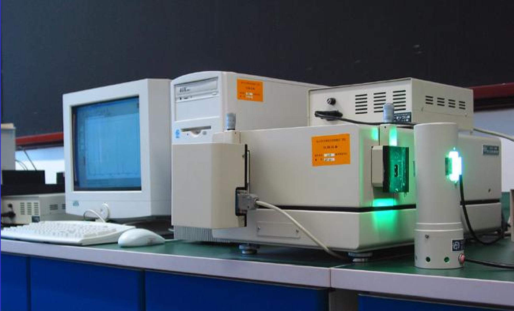

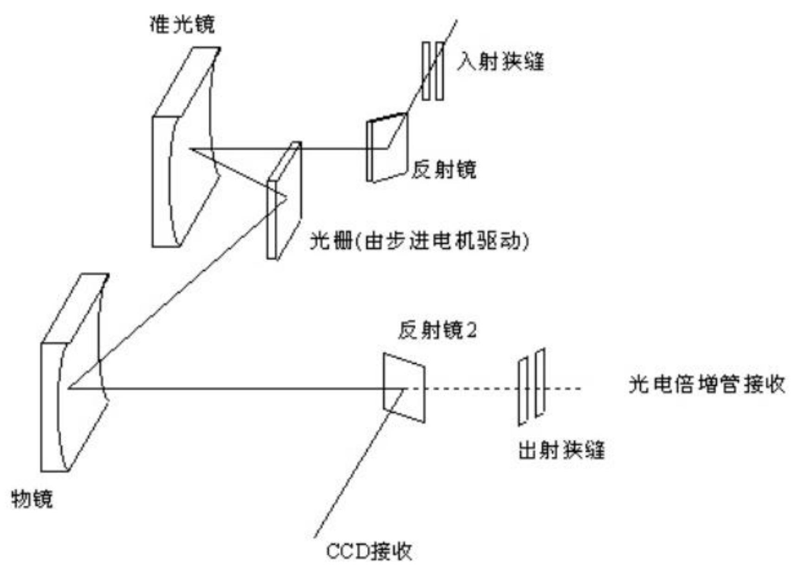

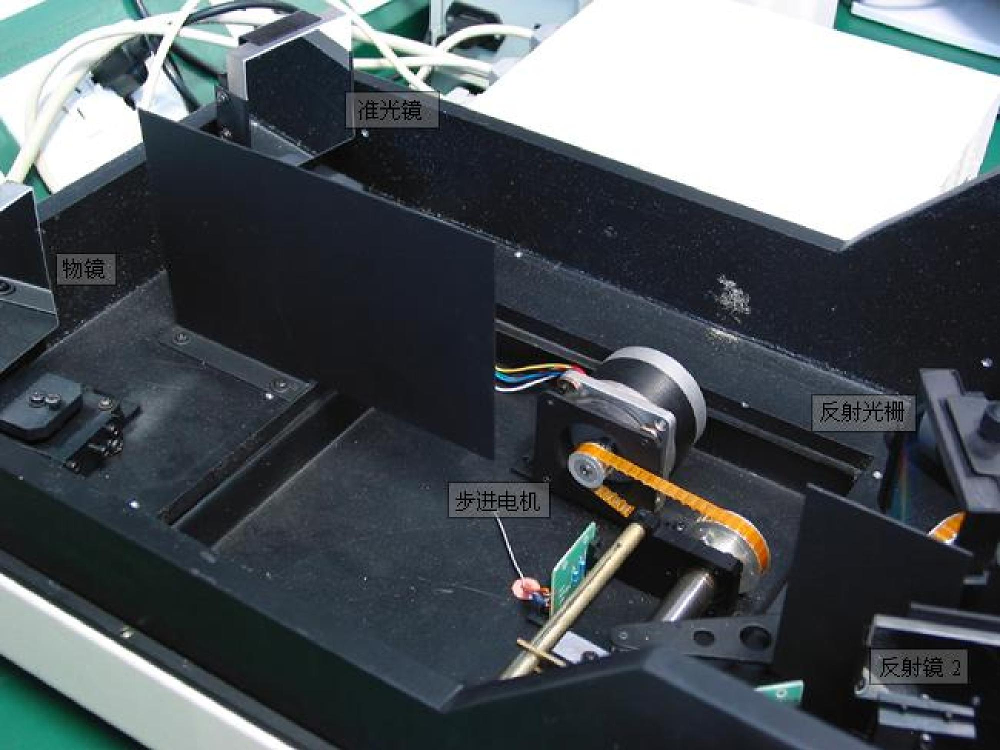

# 光谱仪追求的目标

1. 分开不同波长的光： 波长分辨本领

2. 记录不同波长的光的强度：强度分辨本领

3. 时间分辨本领

4. 效率

5. 价格

1、角色散本领

2、 线色散本领

3、色分辨本领

# *光栅光谱仪的角色散率、线色散率和色分辨本领

•角色散本领

$$
d \sin \theta_ {k} = k \lambda
$$

k ' 设波长 、 的光经光栅衍射后， 级主极峰的方位角分别 为 $\theta _ { k }$ 和 $\theta _ { \boldsymbol { k } } ^ { \prime } \boldsymbol { , }$ 即 $B \lambda = \lambda ^ { \prime } - \lambda ^ { \frac { 1 } { 5 } }$ 起衍射角之差为 $\delta \theta = { \theta ^ { \prime } } _ { k } - \theta _ { k }$ ，角色散率定义为：

$$
D _ {\theta} = \frac {\delta \theta}{\delta \lambda} \quad \left(\text {单 位 :} \circ / n m\right)
$$

sind根据光栅公式： $\theta _ { k } = k \lambda$ ，得：

$$
d \cos \theta_ {k} d \theta = k d \lambda
$$

于是： $D _ { \theta } = \frac { k } { d \cos \theta _ { k } }$ 

光栅周期 $d$ 越小，角色散本领越大，和光栅单元总数 $N$ 无关；级数 $( k )$ 越高，色散本领越大。

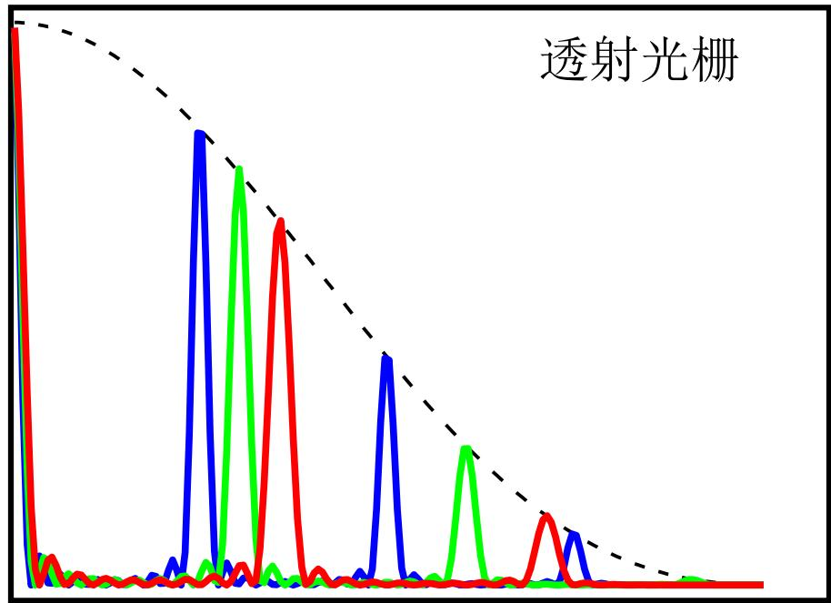

例题：光栅刻槽密度 $\frac { 1 } { d } = 8 0 0$ 线 ，分析波长在 附近。 / ~ 600mm nm 求其 级光谱的角色散率？1

解：

$$
d \sin \theta_ {1} = \lambda \Rightarrow \sin \theta_ {1} = \frac {\lambda}{d} = 6 0 0 n m \times 8 0 0 / m m = 0. 4 8
$$

$$
\begin{array}{l} D _ {\theta} = \frac {1}{d \cos \theta_ {1}} = \frac {1}{d \sqrt {1 - \sin^ {2} \theta_ {1}}} = \frac {8 0 0 \times 1 0 ^ {- 6}}{\sqrt {1 - (0 . 4 8) ^ {2}}} = 0. 9 \times 1 0 ^ {- 3} r a d / n m \\ = 5 \times 1 0 ^ {- 2} \mathrm {o m e g a / n m} \\ \end{array}
$$

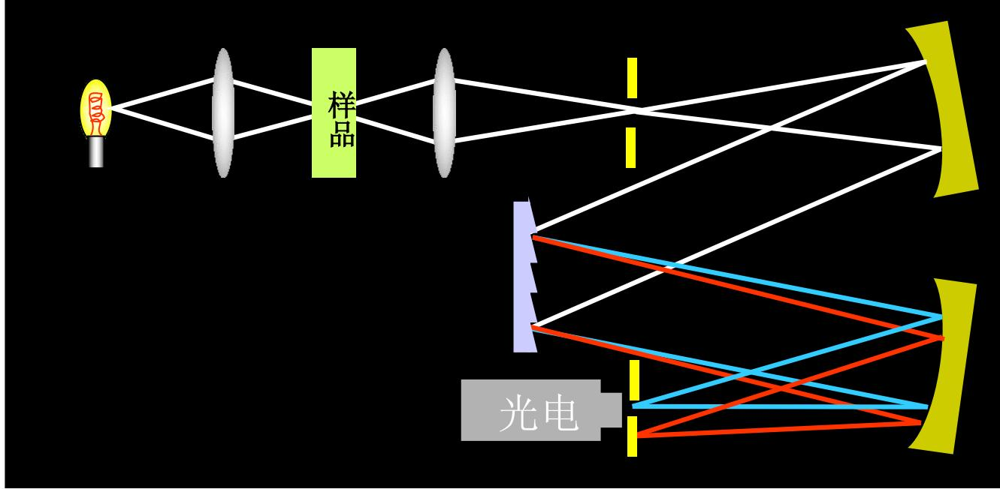

•线色散本领

光谱仪线色散本领(或线色散率)定义为： $D _ { l } = \frac { \delta l } { \delta \lambda }$ 

凹面镜的焦距为f，则： l  f

于是： $D _ { l } = f D _ { \theta } = f { \frac { k } { d \cos \theta _ { k } } }$ 

说明：在相同的衍射角和相同的级数 $( k )$ ，焦距越长，线色散本领越大。

·色分辨本领

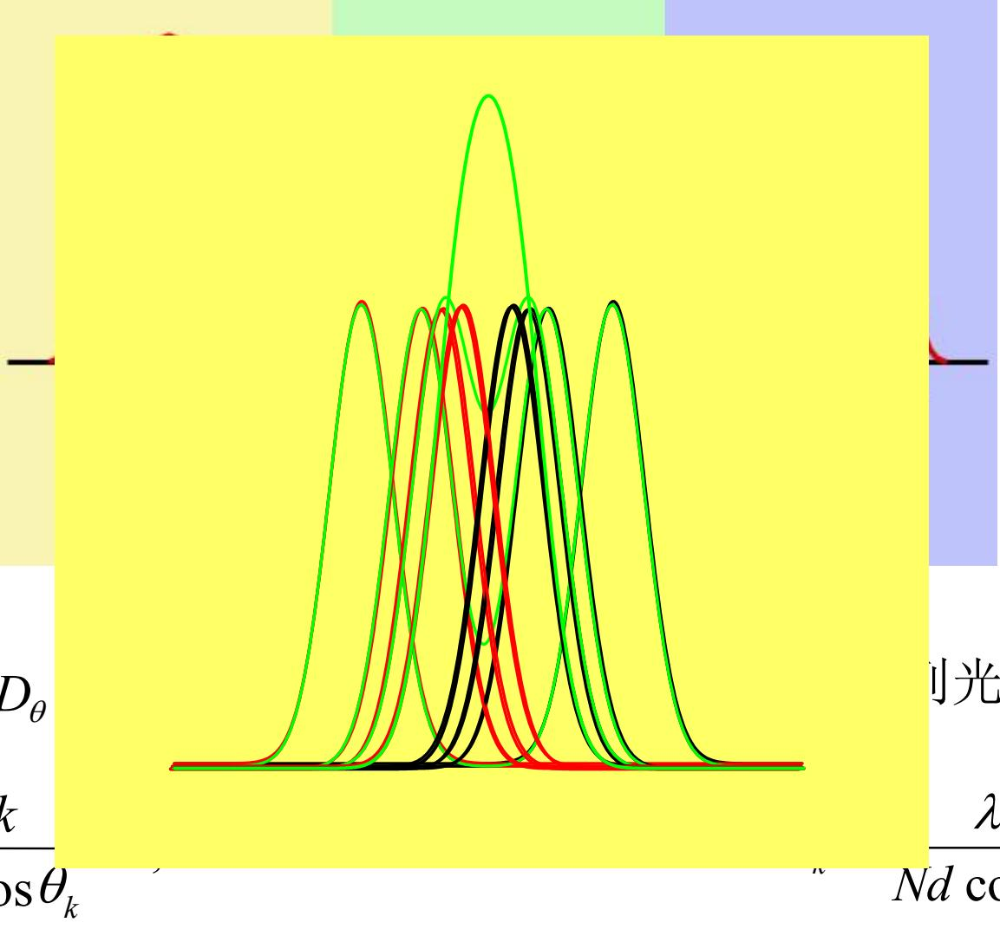

根据角色散本领

$$
\delta \theta_ {k} = D _ {\theta} \delta \lambda = \frac {k}{d \cos \theta_ {k}}
$$

的色散角度为

$$
\frac {\lambda}{N d \cos \theta_ {k}} = \frac {\lambda}{D \cos \theta_ {k}}
$$

判据：

当80k>△θk时，可分辨； 当80k<△0时，不可分辨；

当δ0=△0时，给出可分辨的最小波长差。

当 $\delta \Theta _ { \mathbf { k } } { = } \Delta \Theta _ { \mathbf { k } }$ 时

$$
\delta \theta_ {k} = D _ {\theta} \delta \lambda_ {m} = \frac {k}{d \cos \theta_ {k}} \delta \lambda_ {m} = \Delta \theta_ {k} = \frac {\lambda}{N d \cos \theta_ {k}} = \frac {\lambda}{D \cos \theta_ {k}}
$$

2可分辨最小波长差： mkN定义光栅色分辨本领： R  2 R  kNm

例题：一光栅线密度为500/mm，有效尺度为30mm，求（1）该光栅的2级光谱在波长为500nm附近的角分辨率？（2） 能分辨的最小波长差？

(1)解： ： $d \sin \theta _ { 2 } = 2 \lambda \Rightarrow \sin \theta _ { 2 } = 2 \frac { \lambda } { d } = 2 \times 5 0 0 n m \times$ $\theta _ { 2 } = 2 \lambda$ $\sin \theta _ { 2 } = 2 \frac { \lambda } { d } = 2 \times 5 0 0 n m \times 5 0 0 / m m = 0 . 5$ 

$$
D _ {\theta} = \frac {k}{d \cos \theta_ {k}} = \frac {2}{d \sqrt {1 - \sin^ {2} \theta_ {2}}} = 1. 1 5 \times 1 0 ^ {- 4} r a d / n m
$$

$( 2 ) : \delta \lambda _ { m } = \frac { \lambda } { k N } = \frac { 5 0 0 n m } { 2 \times ( 5 0 0 / m m \times 3 0 m m ) } = 0 . 0$ nm17 

# 给你足够的光学元器件，让你组建一套光栅光谱仪，你主要考虑哪些因素？

答：主要考虑以下几个方面，1）选择光栅的光栅常数大于将要测量光的波长；2）从角色散本领看，在选择光栅常数大于测量光的波长的条件下，选择光栅常数越小，光谱仪的角色散本领越大；3）为使具有一定波长差的两个光在摄谱仪记录介质上离开的距离足够远，或作为单色仪时线宽更窄，在空间范围允许的条件下，选用的凹面反射镜的焦距尽可能的大；4）从光谱仪的色分辨本领看，在经济允许的条件下，选择的光栅总线数尽可能的多；5）为使衍射条纹更加清楚，单缝衍射的零级中包含的干涉级次越少越好。

# *闪耀光栅

透射光栅的缺点：

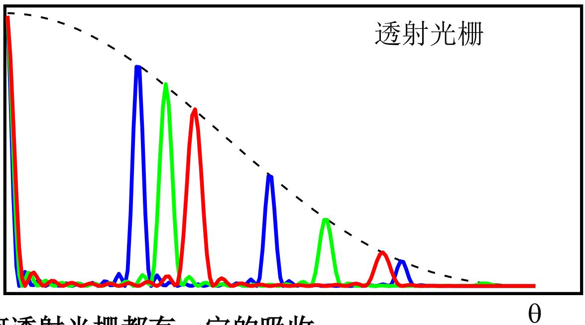

1. 任何透射光栅都有一定的吸收。

2. 不同波长的零级主峰重合，即所谓“零级无色散”，同时正好处在单元衍射因子的最大值上，对光能是极大的浪费。

3. 光谱分析只需要其中一个序列光谱，但是透射光栅的衍射光强分散到正负各级光谱中，也是对光能的浪费。使我们观察的那级光谱只能分配到少量的能量。

•闪耀光栅的结构

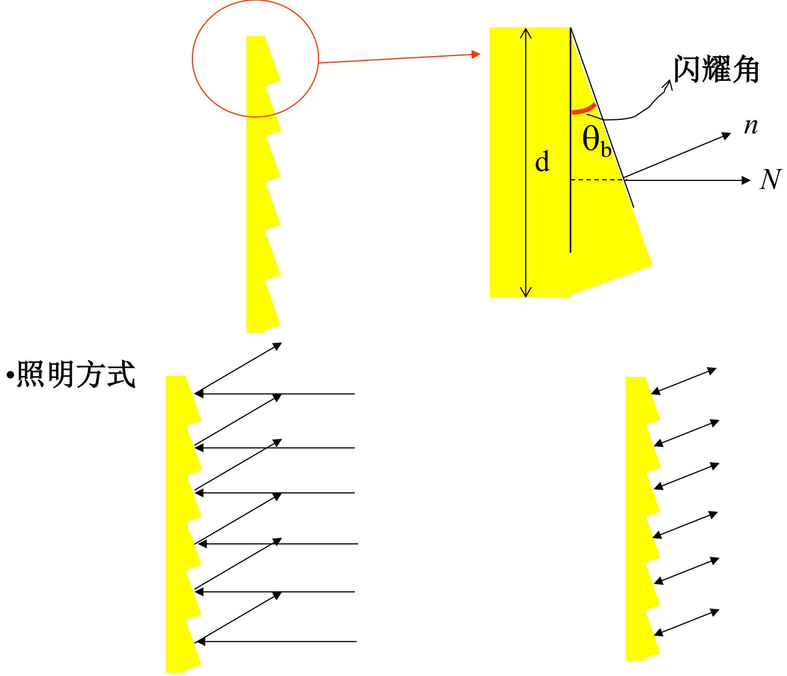

（1）沿N的方向入射

（2）沿n的方向入射

（1）沿N的方向入射

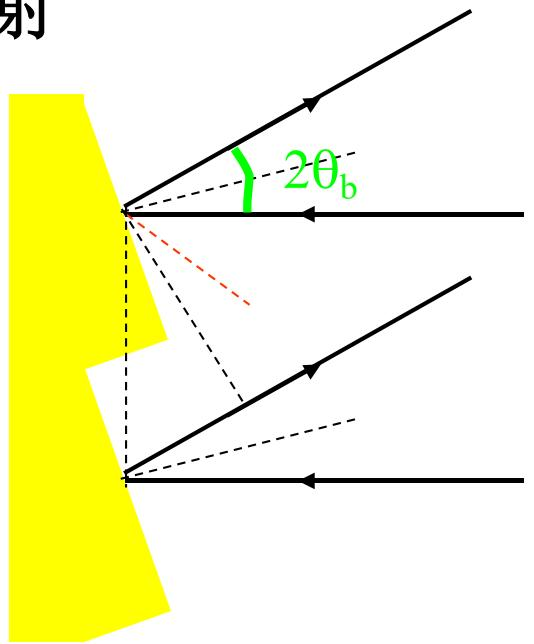

单槽衍射场，按几何光学定律传播的方向是衍射的零级方位。单槽的零级衍射角为=2b。

结构干涉，此时的相邻槽衍射线之间的光程差为：

$$
\Delta L = d \sin (2 \theta_ {b})
$$

满足： $d \sin ( 2 \theta _ { b } ) = \lambda _ { 1 b }$ 的 $\lambda _ { 1 b }$ 的光波在 $2 \theta _ { b }$ 方向出现一级主峰， $\lambda _ { 1 b }$ 称为一级闪耀波长。$d \sin ( 2 \theta _ { b } ) = 2 \lambda _ { 2 b }$ 的 $\lambda _ { 2 b }$ 的光波 在 $2 \theta _ { b }$ 方向出现二级主峰， $\lambda _ { 2 b }$ 称为二级闪耀波长。

这样，把单槽衍射零级方向变成了槽间干涉的非零级，产生高衍射效率的色散。克服了透明光栅的单缝衍射零级和缝间干涉零级重合。

干闪耀光栅仅有一序列光谱：

$$
\Delta L = d \sin (2 \theta_ {b}) = \lambda
$$

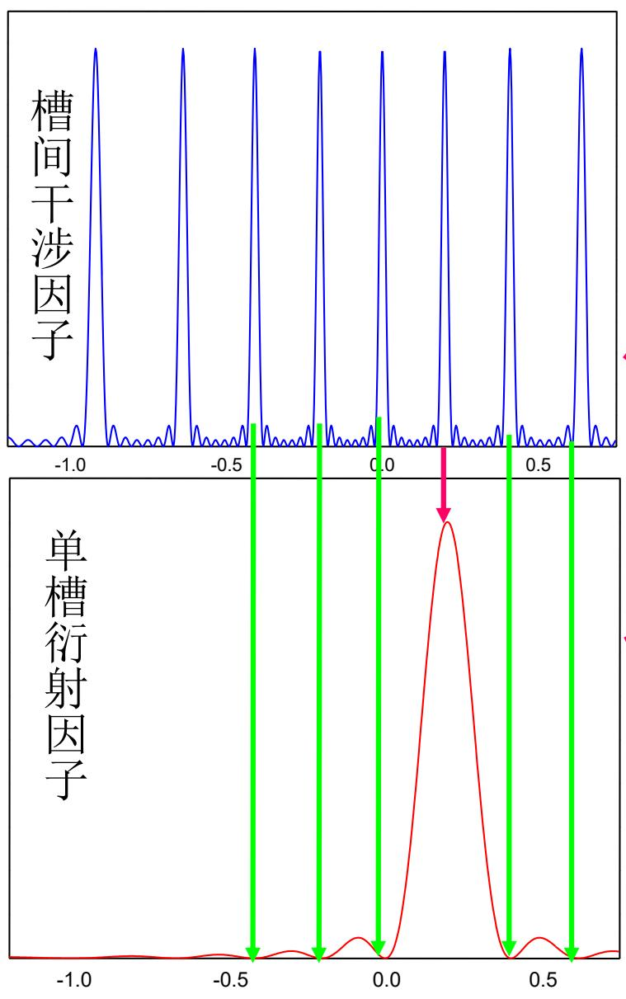

由于闪耀光栅的单槽宽度a和光栅周期d相近，使得一级闪耀波长的其他级别的主峰方向，正好落在单槽衍射的零点上，从而全部消失，仅保留了一级主峰，因此闪耀光栅仅有一列光谱。

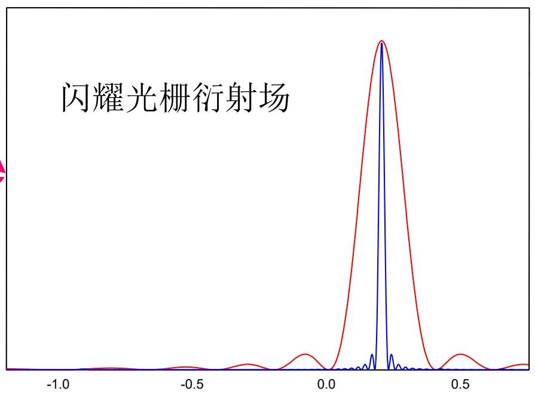

（2）沿n的方向入射 （自学）

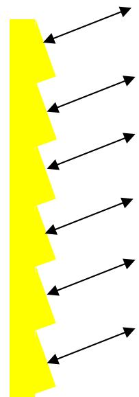

槽间光程差：

$$
\Delta L = 2 d \sin \theta_ {b}
$$

一级闪耀波长：

$$
2 d \sin \theta_ {b} = \lambda_ {1 b}
$$

二级闪耀波长：

$$
2 d \sin \theta_ {b} = 2 \lambda_ {2 b}
$$

# ＊ 二维

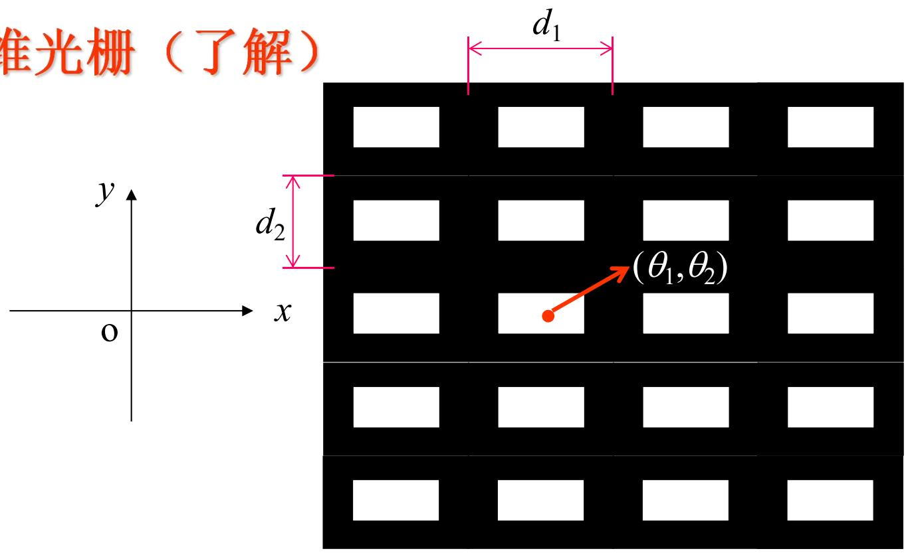

位移 相移

mx md  1位移 相移 $\delta _ { x m } = \frac { 2 \pi } { \lambda } m d _ { 1 } \sin \theta _ { 1 } = m \delta _ { x }$ 

n y nd  2位移 相移 $\delta _ { y n } = \frac { 2 \pi } { \lambda } n d _ { 2 } \sin \theta _ { 2 } = n \delta _ { y }$ 

光栅衍射场：

$$
\begin{array}{l} \widetilde {U} (\theta_ {1}, \theta_ {2}) = \widetilde {U} _ {0} (\theta_ {1}, \theta_ {2}) \left(\sum_ {n = 0} ^ {N _ {2} - 1} \sum_ {m = 0} ^ {N _ {1} - 1} (e ^ {i (m \delta_ {x} + n \delta_ {y})})\right) = \widetilde {U} _ {0} (\theta_ {1}, \theta_ {2}) \sum_ {n = 0} ^ {N _ {2} - 1} e ^ {i n \delta_ {y}} \sum_ {m = 0} ^ {N _ {1} - 1} e ^ {i m \delta_ {x}} \\ = \widetilde {U} _ {0} (\theta_ {1}, \theta_ {2}) \frac {1 - e ^ {i N _ {1} \delta_ {x}}}{1 - e ^ {i \delta_ {x}}} \frac {1 - e ^ {i N _ {2} \delta_ {y}}}{1 - e ^ {i \delta_ {y}}} \\ = \widetilde {U} _ {0} (\theta_ {1}, \theta_ {2}) e ^ {i (N _ {1} - 1) \beta_ {1}} e ^ {i (N _ {2} - 1) \beta_ {2}} \left(\frac {\sin N _ {1} \beta_ {1}}{\sin \beta_ {1}}\right) \left(\frac {\sin N _ {2} \beta_ {2}}{\sin \beta_ {2}}\right) \\ \end{array}
$$

其中 $\beta _ { 1 } = \frac { \delta _ { x } } { 2 } = \frac { \pi } { \lambda } d _ { 1 }$ $\beta _ { 1 } = \frac { \delta _ { x } } { 2 } = \frac { \pi } { \lambda } d _ { 1 } \sin \theta _ { 1 } , \beta _ { 2 } = \frac { \delta _ { y } } { 2 } = \frac { \pi } { \lambda } d _ { 2 } \mathrm { \bf ~ s } .$ 1 1 2sin  d ， $\beta _ { 2 } = \frac { \delta _ { y } } { 2 } = \frac { \pi } { \lambda } d _ { 2 }$ 2in

$$
I \left(\theta_ {1}, \theta_ {2}\right) = \boxed {\left| \widetilde {U} _ {0} \left(\theta_ {1}, \theta_ {2}\right) \right| ^ {2} \left(\frac {\sin N _ {1} \beta_ {1}}{\sin \beta_ {1}}\right) ^ {2} \left(\frac {\sin N _ {2} \beta_ {2}}{\sin \beta_ {2}}\right) ^ {2}}
$$

单元衍射因子，如果为矩形则： $\left| \widetilde { U } ( \theta _ { 1 } , \theta _ { 2 } ) \right| ^ { 2 } = I _ { 0 } \left( \frac { \sin \alpha _ { 1 } } { \alpha _ { 1 } } \right) ^ { 2 } \left( \frac { \sin \alpha _ { 2 } } { \alpha _ { 2 } } \right) ^ { 2 }$ 2

$$
\alpha_ {1} = \frac {\pi a (\sin \theta_ {1})}{\lambda}, \alpha_ {2} = \frac {\pi b (\sin \theta_ {2})}{\lambda}
$$

衍射结构因子，它决定了衍射主级强的方位角 $( \Theta _ { 1 } ^ { \phantom { } }$ ，$\mathsf { \Omega } \theta _ { 2 } )$ 。 

衍射结构因子，它决定了衍射主极强的方位角(0，02)。

$$
\left\{ \begin{array}{l} d _ {1} \sin \theta_ {1} = k _ {1} \lambda ; k _ {1} = 0, \pm 1, \pm 2 \dots \\ d _ {2} \sin \theta_ {2} = k _ {2} \lambda ; k _ {2} = 0, \pm 1, \pm 2 \dots \end{array} \right.
$$

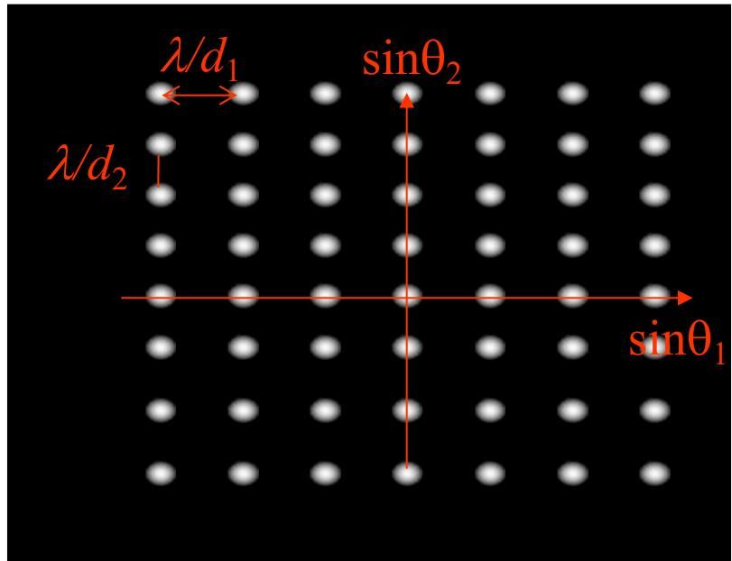

图为二维晶面的夫琅禾费衍射强度结构因子

相应的主峰半角宽度:

$$
d _ {1} \sin (\theta_ {1 k} \pm \Delta \theta_ {1 k}) = \left(k \pm \frac {1}{N _ {1}}\right) \lambda \Rightarrow d _ {1} \cos \theta_ {1 k} \cdot \Delta \theta_ {1 k} = \frac {\lambda}{N _ {1}}
$$

从而得到 $\theta _ { 1 }$ k 的 级主峰的半角宽度：

$$
\Delta \theta_ {1 k} = \frac {\lambda}{N _ {1} d _ {1} \cos \theta_ {1 k}} = \frac {\lambda}{D _ {1} \cos \theta_ {1 k}}
$$

k2  同理： $\Delta \theta _ { 2 k } = \frac { \lambda } { N _ { 2 } d _ { 2 } \cos \theta _ { 2 k } } = \frac { \lambda } { D _ { 2 } \cos \theta _ { 2 k } }$ 

# *二维晶片的共面衍射

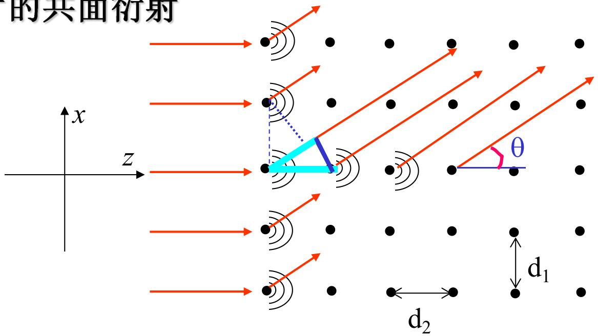

位移 相移

位移 $x _ { m } = - m d _ { 1 } $ 相移 $\delta _ { x m } = \frac { 2 \pi } { \lambda } m d _ { 1 }$ $\delta _ { x m } = \frac { 2 \pi } { \lambda } m d _ { 1 } \sin \theta = m \delta _ { x }$ 

位移 $z _ { n } = n d _ { 2 } \Leftrightarrow$ 相移 $\cdot \delta _ { z n } = \frac { 2 \pi } { \lambda } n ( d _ { 2 } - d _ { 2 } \cos \theta ) = n \delta _ { z }$ 

光栅衍射场：

$$
\begin{array}{l} \widetilde {U} (\theta) = \widetilde {U} _ {0} (\theta) \left(\sum_ {n = 0} ^ {N _ {2} - 1} \sum_ {m = 0} ^ {N _ {1} - 1} (e ^ {i (m \delta_ {x} + n \delta_ {z})})\right) = \widetilde {U} _ {0} (\theta) \sum_ {n = 0} ^ {N _ {2} - 1} e ^ {i n \delta_ {z}} \sum_ {m = 0} ^ {N _ {1} - 1} e ^ {i m \delta_ {x}} \\ = \widetilde {U} _ {0} (\theta) \frac {1 - e ^ {i N _ {1} \delta_ {x}}}{1 - e ^ {i \delta_ {x}}} \frac {1 - e ^ {i N _ {2} \delta_ {z}}}{1 - e ^ {i \delta_ {z}}} \\ = \widetilde {U} _ {0} (\theta) e ^ {i (N _ {1} - 1) \beta_ {1}} e ^ {i (N _ {2} - 1) \beta_ {2}} \left(\frac {\sin N _ {1} \beta_ {1}}{\sin \beta_ {1}}\right) \left(\frac {\sin N _ {2} \beta_ {2}}{\sin \beta_ {2}}\right) \\ \end{array}
$$

其中 $\beta _ { 1 } = \frac { \delta _ { x } } { 2 } = \frac { \pi } { \lambda } d _ { 1 }$ 2sin  y， 2 2( cos )   d d 

$$
I (\theta) = \left| \widetilde {U} _ {0} (\theta) \right| ^ {2} \left(\frac {\sin N _ {1} \beta_ {1}}{\sin \beta_ {1}}\right) ^ {2} \left(\frac {\sin N _ {2} \beta_ {2}}{\sin \beta_ {2}}\right) ^ {2}
$$

衍射结构因子，它决定了衍射主级强的方位角()。

# 衍射主极强的方位角(0)

由衍射结构因子得，主极强出现在：

$$
\left\{ \begin{array}{l} d _ {1} \sin \theta = k _ {1} \lambda \\ d _ {2} - d _ {2} \cos \theta = k _ {2} \lambda \end{array} ; k _ {1}, k _ {2} = 0, \pm 1, \pm 2, \pm 3 \dots \right.
$$

例题：如果 $d _ { \scriptscriptstyle 1 } = d _ { \scriptscriptstyle 2 } = 1 0 \lambda$ ，求主极强的方位角？

解：

$d _ { \mathrm { { 1 } } }$ sin k ${ \bar { \iota } } _ { 1 } \lambda \Rightarrow \sin \theta = \frac { k _ { 1 } \lambda } { d _ { 1 } } { = } \frac { k _ { 1 } } { 1 0 } , k _ { 1 } = 0 , \pm 1 , \pm 2 . . . \pm 1 0$ 0    ， 代 入 条 件

$d _ { 2 } - d _ { 2 }$ cos $\mathfrak { s } \theta = k _ { 2 } \lambda$ 得：

$$
k _ {2} = \frac {d _ {2} - d _ {2} \cos \theta}{\lambda} = 1 0 - 1 0 \times \sqrt {1 - \left(\frac {k _ {1}}{1 0}\right) ^ {2}} = 1 0 - \sqrt {1 0 0 - k _ {1} ^ {2}}
$$

满足 $k _ { 2 }$ 为整数的解为：

k  0 6 8 10 2k  0 2 4 10 7；所以有 个衍射主极强的方位角。 0 36 52' 53 8' 90    

# 七、三维光栅—x射线晶体衍射

# 劳厄 Max von Laue（1879-1960）

德国慕尼黑大学理论物理学家

X射线衍射的发现者

1914年诺贝尔物理学奖--因发现晶体的X射线衍射

# 意义：

X射线衍射现象的发现对近代物理学的发展有重要意义，因为它不仅证明了X射线是一种比可见光波长短千倍的电磁波，使人们对X射线的认识迈出了关键的一步，而且还第一次对晶体的空间点阵假说作出了实验验证，使晶体物理学发生了质的飞跃。这一发现继佩兰（Perrin）的布朗运动实验之后，又一次向科学界提供证据，证明原子的真实性。由于X射线衍射的发现，X射线学在理论和实验方法上飞速发展，很快形成了一门内容极为丰富、应用极为广泛、影响极为深远的综合学科。

# 伦琴（1845-1923）

德国维尔茨堡大学实验物理学家

X射线的发现者

1901年诺贝尔物理学奖

-因发现X-射线

1.X射线产生机制

• 一种是由于高能电子打到靶上后，电子受原子核电场的作用而速度骤减，电子的动能转换成辐射能----轫制辐射，X光谱连续。

•其次是高能电子将原子内层的电子激发出来，当回到基态时，辐射出 X射线，光谱不连续。

2. X射线性质：

1. X射线是一种电磁波。

2. 波长很短(10－11~10－8m)， X射线穿透力很强。

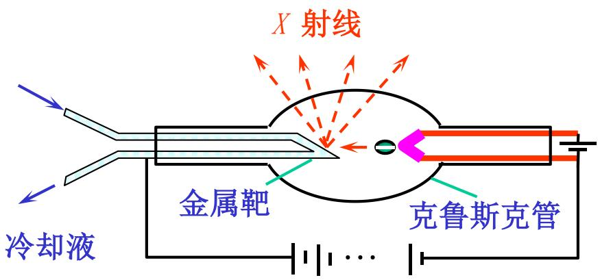

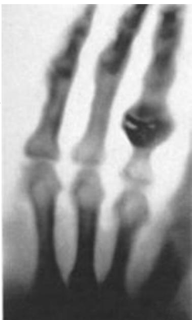

X射线的应用不仅开创了研究晶体结构的新领域，而且用它可以作光谱分析，在科学研究和工程技术上有着广泛的应用。在医学和分子生物学领域也不断有新的突破。

# X-射线衍射的发现过程：

发现X射线衍射和慕尼黑大学的科学气氛有密切关系，当时师生们讨论最多的一个问题就是X射线的本性。劳厄认为X射线是电磁波。1912年,劳厄在同一位博士研究生厄瓦耳交谈时，产生了用X射线照射晶体用以研究固体结构的想法。他设想X射线是极短的电磁波，而晶体又是原子（离子）的有规则的三维排列, 就像是一块天然光栅那样，只要X射线的波长和晶体中原子（离子）的间距具有相同的数量级，那么当用X射线照射晶体时就应能观察到干涉现象。这确实是一个极其奇特而又非常有效的方法。劳厄的“光学直觉”使他产生了思想上的飞跃，晶体中原子的排列如果是有规则的，其间距与入射波的波长同数量级，就有可能产生干涉。

1912年4月他们开始了这项试验。弗里德利希和尼平很快地按劳厄的设计搭起了安装有实验装置的架子，但是他们在第一轮实验中，由于X射线太弱，曝光时间不足而屡遭失败，幸亏他们有坚定的信念，把曝光时间延为数小时，才在底片上显出有规则的斑点。后来，他们改进了设备，采用ZnS、NaCl等晶体做试验，衍射斑点具有更为明显的对称性。接着，劳厄推导出一系列衍射方程，很好地解释了这些斑点的成因。

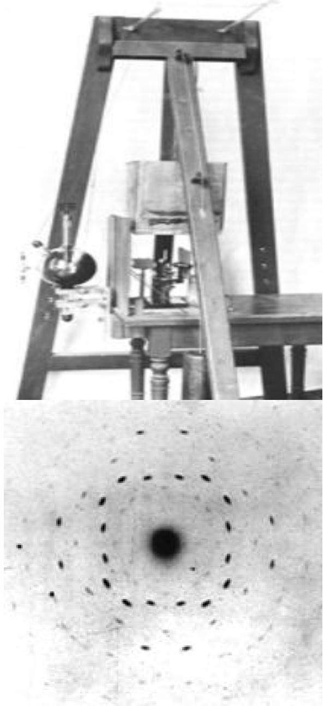

在照相底片上形成对称分布的若干衍射斑点，称为劳厄斑。

# 晶体结构

离子晶体、 分子晶体、原子晶体七大晶系，十四种晶格类型

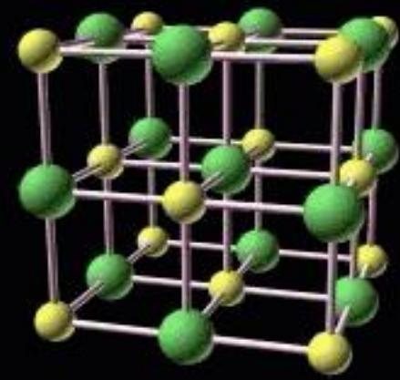

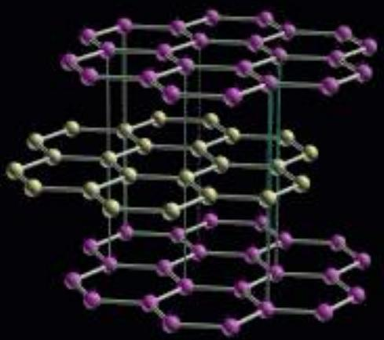

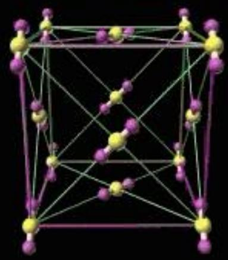

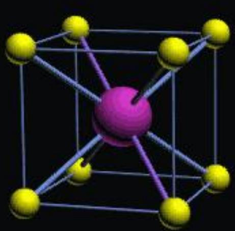

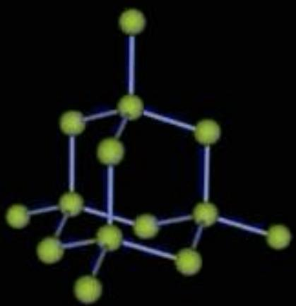

# 劳厄的实验装置

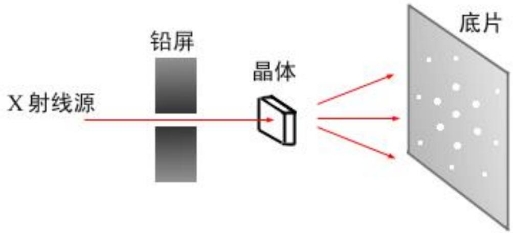

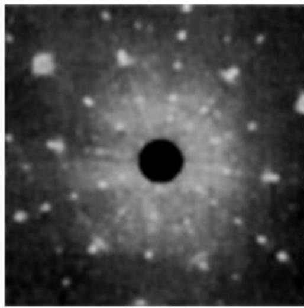

(a)

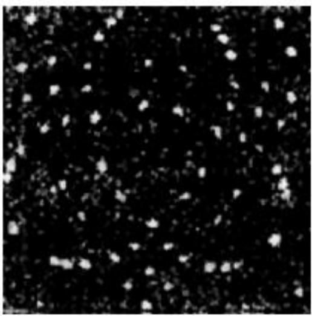

(b)

X射线通过红宝石晶体(a)和硅单晶体(b)所拍摄的劳厄斑照片

# 布拉格公式

布喇格，W.H.

布喇格，W.L.

1915年诺贝尔物理学奖 X射线晶体结构分析亨利，授予英国伦敦大学的亨利·布拉格(SirWilliam Henry Bragg ,1862-1942)和他的儿子英国曼彻斯特维克托利亚大学的劳伦斯·布拉格(SirWilliam Lawrence Bragg ,1890-1971).

劳厄解释了劳厄斑的形成，但他的方法比较复杂。不久，英国物理学家布拉格父子提出一种比较简单的方法来说明X射线的衍射。布喇格父子认为当X射线射到晶体各层面的原子时，原子中的电子将发生受迫振荡，从而向周围发射同频率的电磁波，即产生了X射线的散射，而每个原子则是一个次波源；劳厄斑正是次波的干涉叠加的结果。

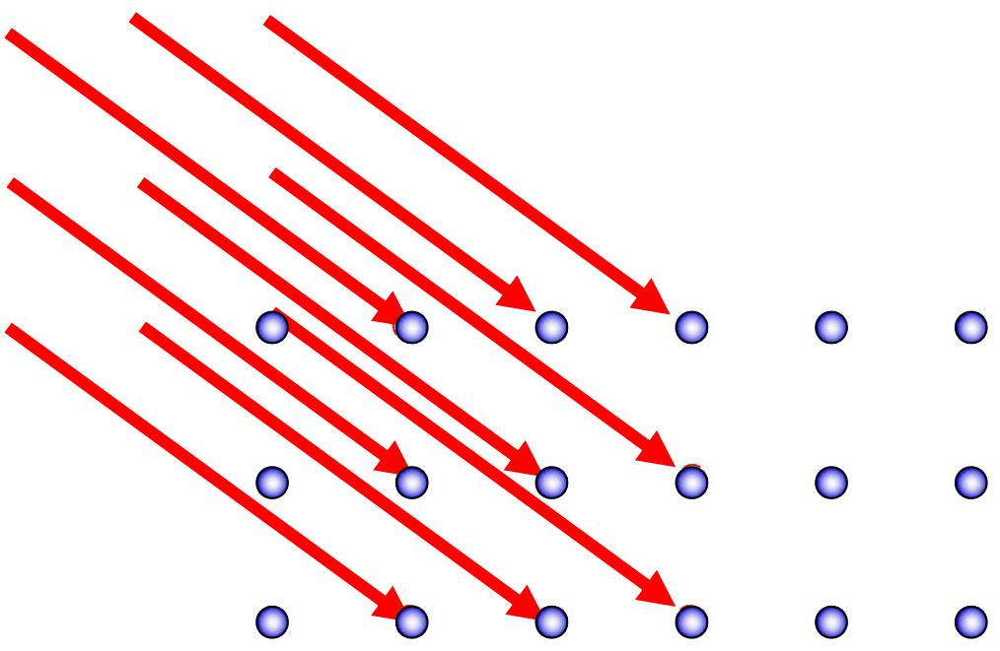

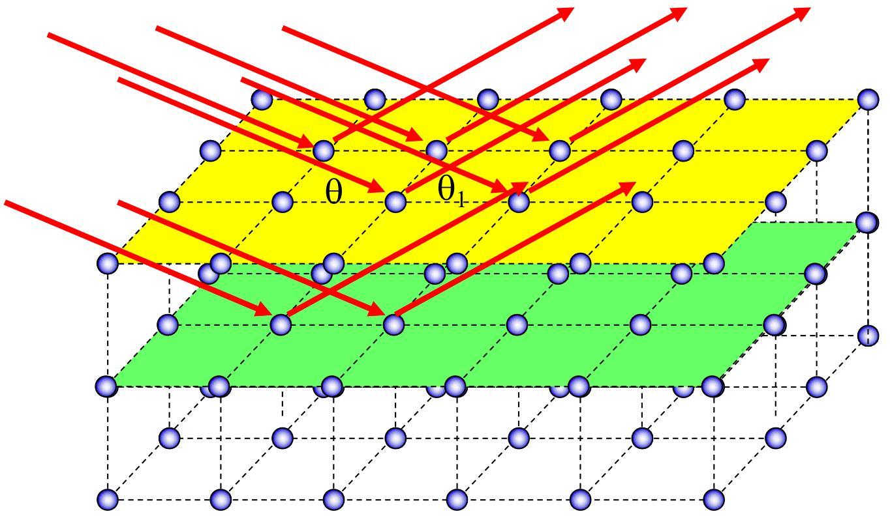

1、同一晶面的干涉增强：

$$
l \cdot (\sin \theta - \sin \theta_ {1}) = k \lambda
$$

同一晶面内对于所有的l都要求满足上式，于是：

$$
\sin \theta_ {1} = \sin \theta
$$

即只有按反射定律反射的射线的强度干涉增强。

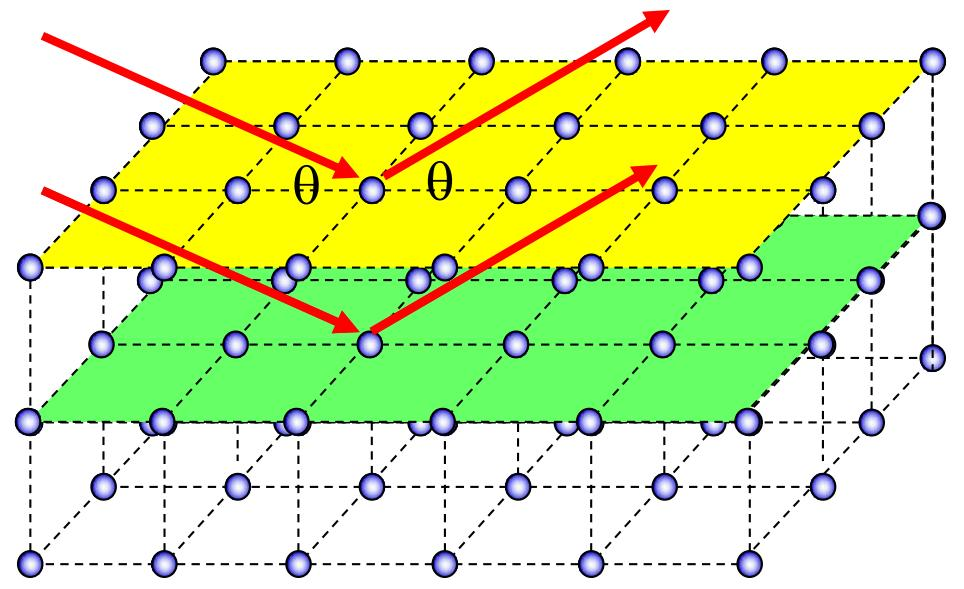

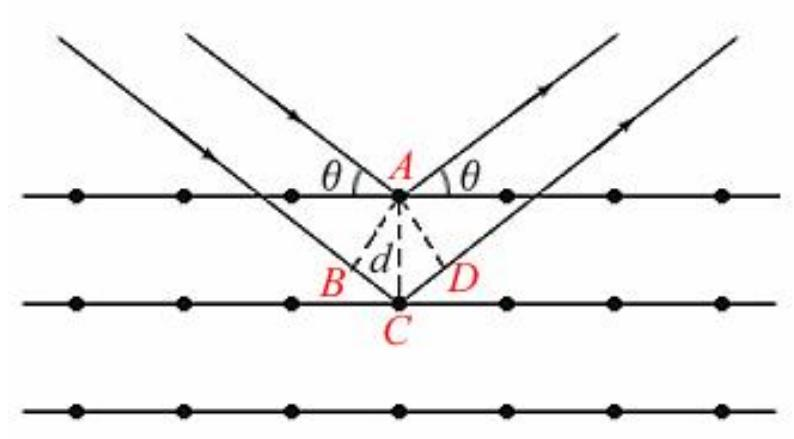

# 2、不同晶面之间的干涉增强

对于以角掠射的单色平行的X光束投射到晶面间距为d的晶面上时，在各晶面所散射的射线中，只有按反射定律反射的射线的强度为最大，上、下两晶面所发出的反射线的光程差为:

$$
\delta = \overline {{B C}} + \overline {{C D}} = 2 d \sin \theta
$$

当=2dsin = k时各层面上的反射光相干加强，形成亮点，称为 k 级干涉主极大。该式称为布喇格公式。

# 布拉格公式与一维光栅方程相似，但是也有所不同：

1. 对于一维光栅，只有一个光栅方程，而对于X-射线晶体衍射，晶体是三维光栅，有一系列不同取向的晶面，它们的晶面之间的距离不同，因此晶体的X-射线衍射有一系列的布拉格公式。

2. 对于一维光栅，任意波长的单色光照射，总可以在某一个方向得到衍射极大值。而对于晶体衍射，X-射线入射方向和晶体的位置确定后，则一系列的d和也就确定了，任意波长的X-射线不能都满足布拉格公式，因此有可能得不到X-射线的衍射图样。

问题：如何观察到X-射线的衍射图样？？

# *观察X-射线衍射的两种方法：

（1）劳厄法：用连续X-射线照射单晶，此时一系列d和给定，而X-射线的波长是任意的，因此对于每一晶面族总能找到满足布拉格公式的波长，得到衍射图样。

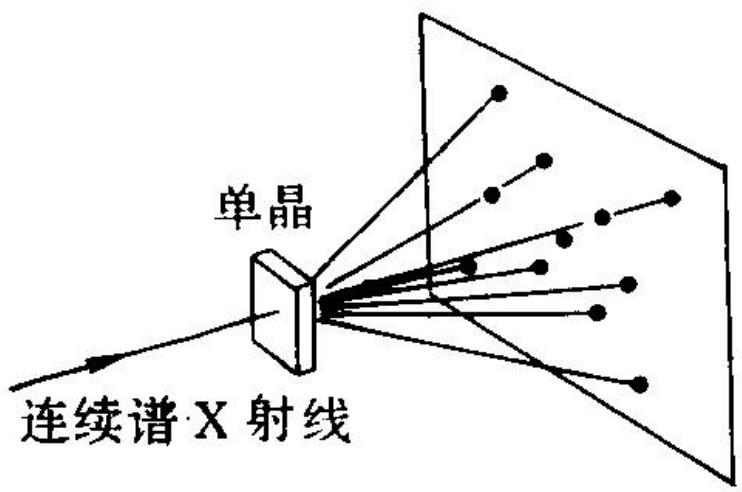

（a）劳厄法

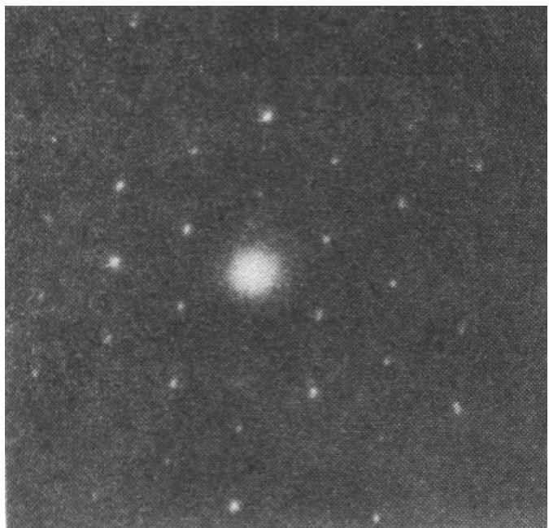

照相记录的是一些亮斑，这些亮斑称为劳厄斑，衍射图称为劳厄图，劳厄图上的劳厄斑对应着晶面，研究劳厄图上的衍射点的分布可以推测出晶格中粒子的分布。

（2）德拜法：用单色X-射线照射多晶或旋转的单晶，此时X-射线的波长给定，而对于多晶或旋转的单晶，d和 是任意的，因此总能找到满足布拉格公式的d和，得到衍射图样。

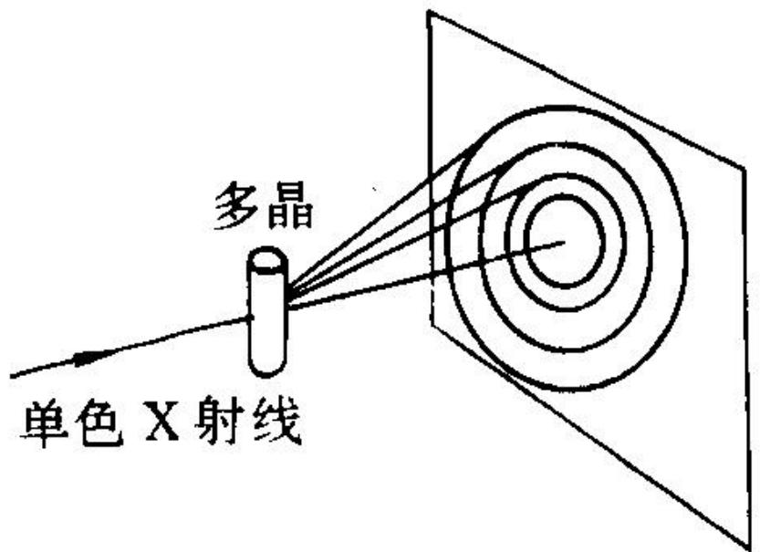

(b）德拜法

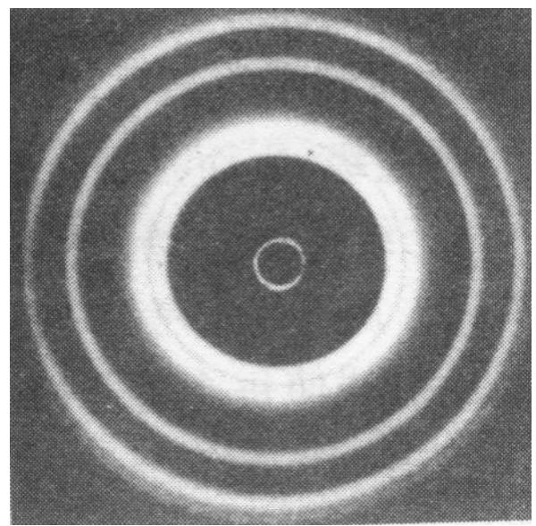

照相记录的是一些亮环，这些亮环组成的衍射图称为德拜图。

# 光的衍射小结：

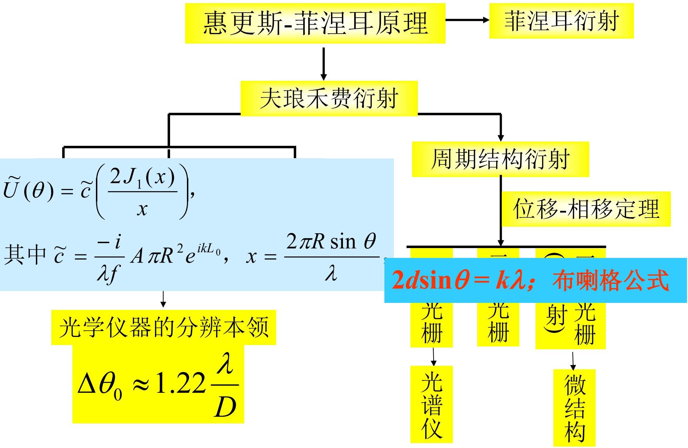

# 如何理解光的衍射 （三个层面）

1）当光在传播过程中遇到障碍物时，将发生偏离直线传播或偏离几何光学的传播行为，这种现象被称为衍射；

2）从惠更斯-菲涅尔原理看，光波在传播过程中其波阵面受到某种限制，自由、完整的波阵面发生了破缺，光的传播将偏离原来的传播方向；当光在传播过程中遇到障碍物时，将发生偏离直线传播或偏离几何光学的传播行为，这种现象被称为衍射；

3）当光在传播过程中，由于某种原因，使光的振幅或相位分布发生了改变，致使后场的光场分布相对于自由传播的光场有很大的改变，这就是衍射。