# 第八章光的吸收、色散

# 光的吸收、色散和散射

8.1：吸收

8.2：色散

8.3：波包的群速度和波包的展宽

# 7.1 吸收

# 线性吸收规律

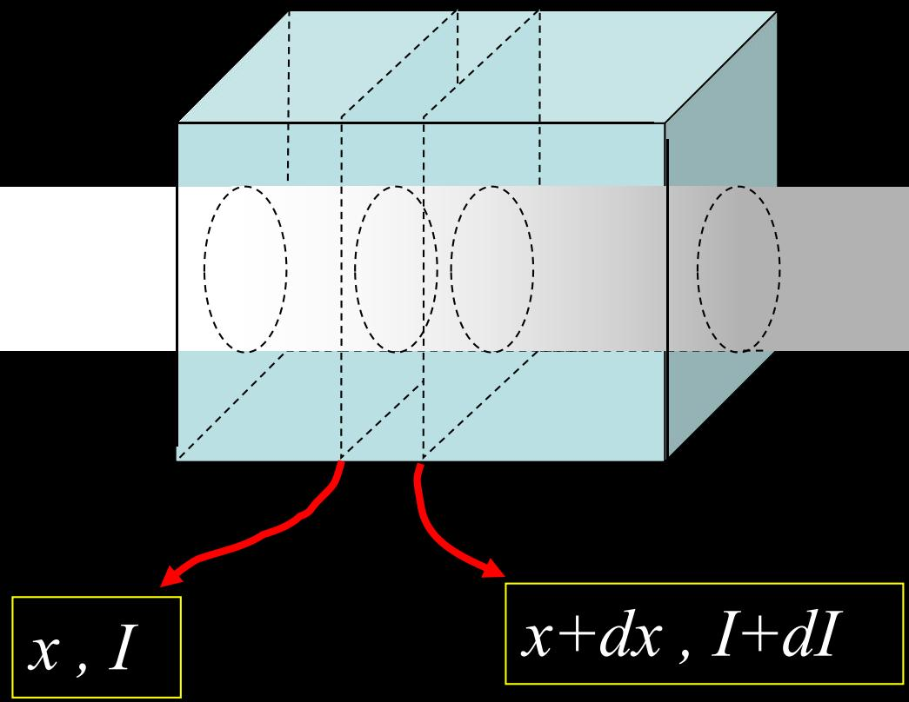

$$
d I \propto - I d x
$$

引进一系数，于是：

$$
d I = - \alpha I d x \quad \text {即} \alpha = - \frac {d I}{I d x} \quad \alpha \text {称 为 物 质 的 吸 收 系 数}
$$

$$
I (x) = C e ^ {- \alpha x} \xrightarrow {x = 0 \text {时 ,} I (0) = I _ {0}} I (x) = I _ {0} e ^ {- \alpha x}
$$

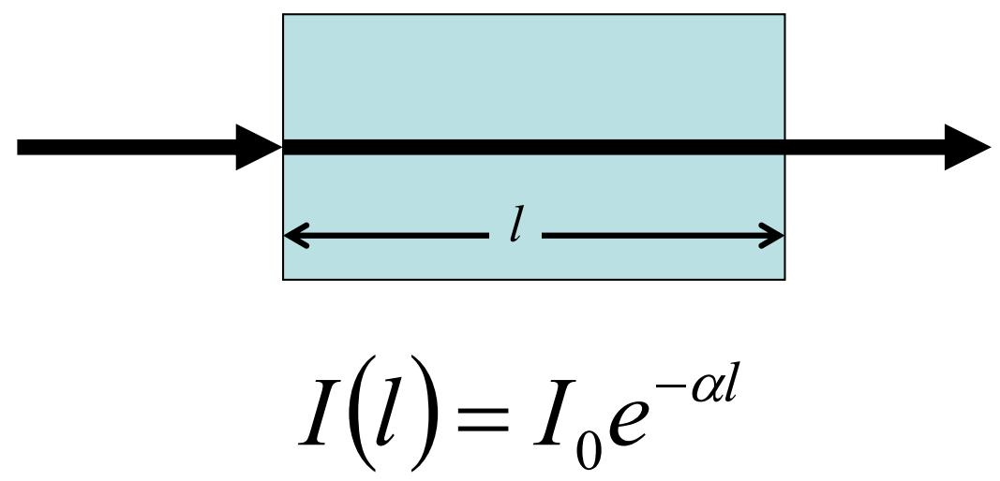

在线性光学介质里，于光强无关。

但是在光强比较强时，光与物质相互作用的非线性光学效应明显表现出来，此时的与光强有关。比如光限幅效应等。

# 光限幅 (Optical Limiting)

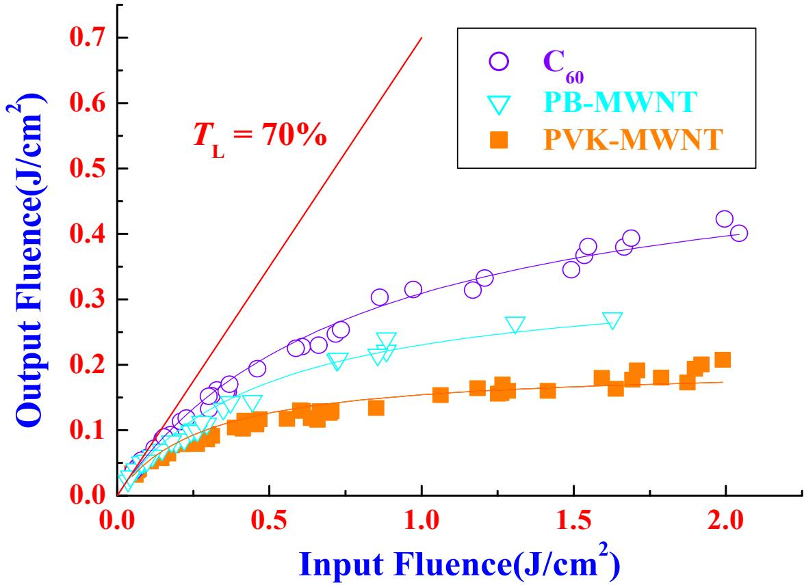

# 激光防护理想性能：

 足够宽的防护带宽

 对弱辐射有足够高的线性透过率

对强激光有足够高的衰减能力

 足够快的响应时间

 足够大的破坏阈值

# *普遍吸收和选择吸收

# 普遍吸收

样品

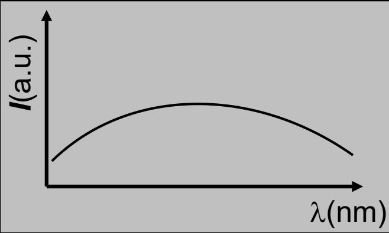

不同波长的光具有相同程度的吸收，称这种物质具有普遍吸收性(General absorption)

# *选择吸收

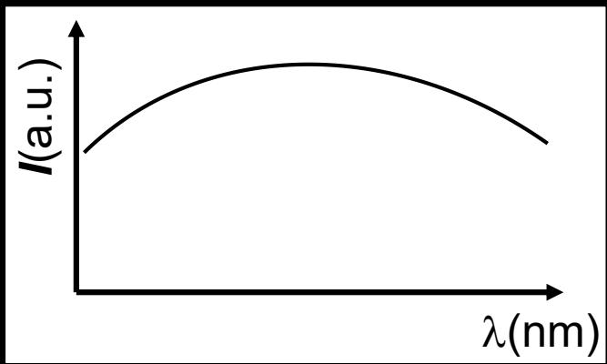

样品

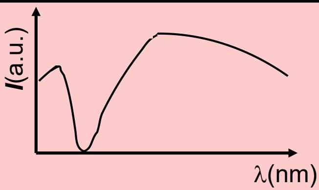

若介质对于某些波长吸收比较强烈，称选择吸收 (Selectiveabsorption)

# 选择吸收

分子具有转动能级、振动能级和电子能级。通常，分子处于低能量的基态，从外界吸收能量后，引起分子能级的跃迁。

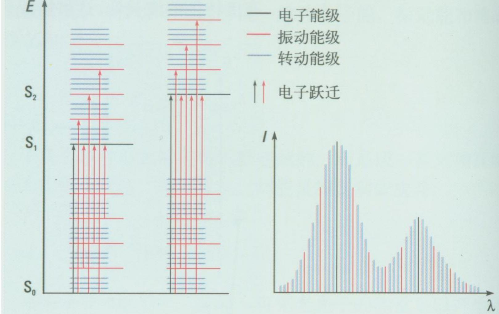

表11-5常见生色团的吸收峰

<table><tr><td>生色团</td><td>化合物</td><td>溶剂</td><td>\( {\lambda }_{\max }/\mathrm{{nm}} \)</td><td>\( {\epsilon }_{\max } \)</td></tr><tr><td rowspan="2"></td><td>乙 烯</td><td>气 态</td><td>171</td><td>15 530</td></tr><tr><td>1-己烯</td><td>庚 烷</td><td>180</td><td>12 500</td></tr><tr><td></td><td>乙 炔</td><td>气 态</td><td>173</td><td>6 000</td></tr><tr><td rowspan="4"></td><td rowspan="2">乙 醛</td><td rowspan="2">蒸 气</td><td>289</td><td>12.5</td></tr><tr><td>182</td><td>10000</td></tr><tr><td rowspan="2">丙酮</td><td rowspan="2">环己烷</td><td>190</td><td>1000</td></tr><tr><td>279</td><td>22</td></tr><tr><td>—COOH</td><td>乙酸</td><td>水</td><td>204</td><td>40</td></tr><tr><td>—COCI</td><td>乙酰氯</td><td>庚 烷</td><td>240</td><td>34</td></tr><tr><td>—COOR</td><td>乙酸乙酯</td><td>水</td><td>204</td><td>60</td></tr><tr><td>—CONH2</td><td>乙酰胺</td><td>甲 醇</td><td>295</td><td>160</td></tr><tr><td>\( -{\mathrm{{NO}}}_{2} \)</td><td>硝基甲烷</td><td>水</td><td>270</td><td>14</td></tr><tr><td rowspan="2"></td><td rowspan="2">丙酮肟</td><td rowspan="2">气 态</td><td>190</td><td>5 000</td></tr><tr><td>300</td><td>-</td></tr><tr><td></td><td>重氮甲烷</td><td>乙 醚</td><td>417</td><td>7</td></tr><tr><td rowspan="4"></td><td rowspan="2">苯</td><td rowspan="2">水</td><td>254</td><td>205</td></tr><tr><td>203.5</td><td>7 400</td></tr><tr><td rowspan="2">甲 苯</td><td rowspan="2">水</td><td>261</td><td>225</td></tr><tr><td>206.5</td><td>7 000</td></tr><tr><td></td><td>1,3-丁二烯</td><td>正 己 烷</td><td>217</td><td>21 000</td></tr></table>

$\pi \to \pi ^ { * }$ 跃迁的吸收峰都在远紫外区，但当分子中再引入一个与之共轭的不饱和键

表11-7烷基对共轭体系吸收波长的影响

<table><tr><td>化 合 物</td><td>λmax/nm</td></tr><tr><td>CH2=CH-CH=CH2</td><td>217</td></tr><tr><td>CH3-CH=CH-CH=CH2</td><td>222</td></tr><tr><td>CH3-CH=CH-CH=CH-CH3</td><td>227</td></tr><tr><td>CH3CH3</td><td>227</td></tr><tr><td>CH2=C-C=CH2</td><td>219</td></tr><tr><td>CH2=CH-C-CH3</td><td>224</td></tr><tr><td>CH3CH=CH-C-CH3</td><td>235</td></tr><tr><td>CH3C=CH-C-CH3</td><td>255</td></tr><tr><td>CH3</td><td>261</td></tr></table>

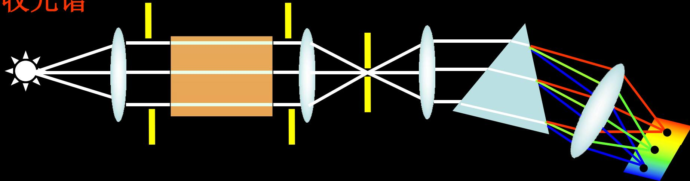

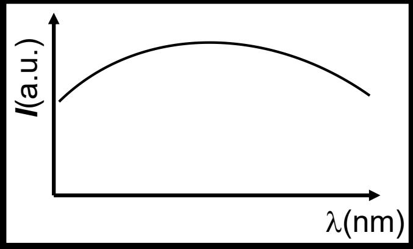

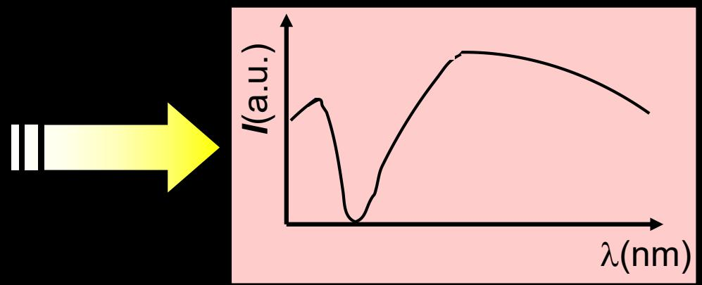

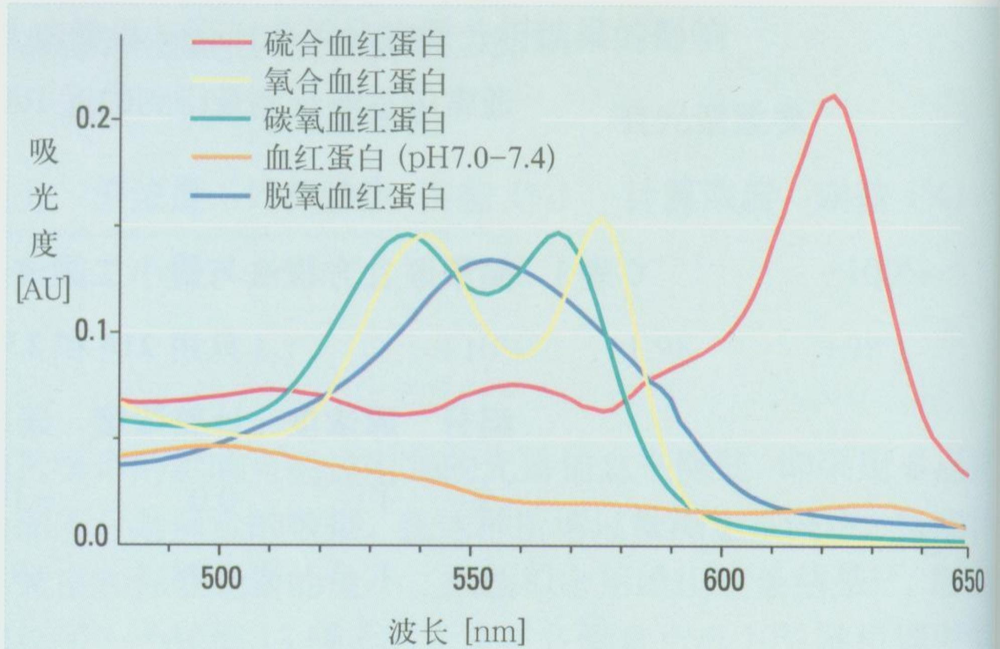

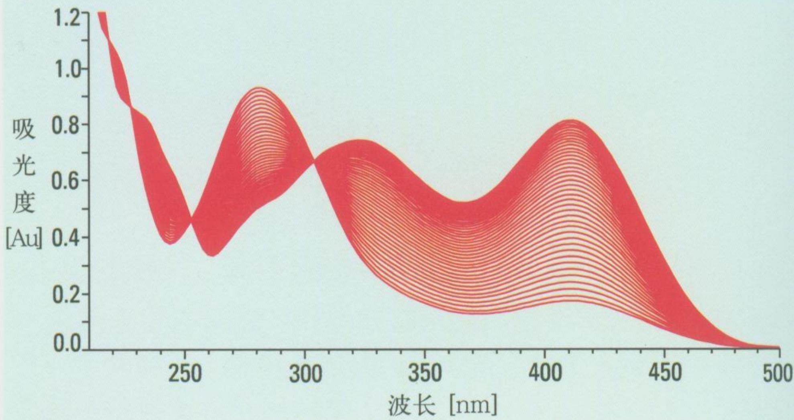

$7 2$

磺内酯水解光谱

吸收光谱提供了部分分子信息，比如生色团、分子结构等等。是鉴别分子的手段之一。

# 复折射率：

考虑到介质对光的吸收，介质的光学性能需要由两个参数来描述，即折射率n和吸收系数。

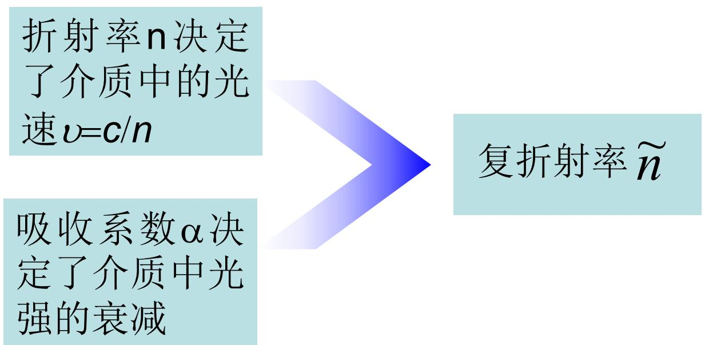

无吸收透明介质，沿x方向传播的平面波函数：

$$
\widetilde {E} (x, t) = A _ {0} e ^ {- i (\omega t - k x)} = A _ {0} e ^ {i k x} e ^ {- i \omega t}
$$

吸收介质中，光强随传播距离x衰减：

$$
I (x) = I _ {0} e ^ {- \alpha \cdot x}
$$

光强和振幅的关系：

$$
I (x) = A ^ {2} (x) \Rightarrow A (x) = A _ {0} e ^ {- \frac {\alpha}{2} x}
$$

所以在吸收介质中的波函数可以写成：

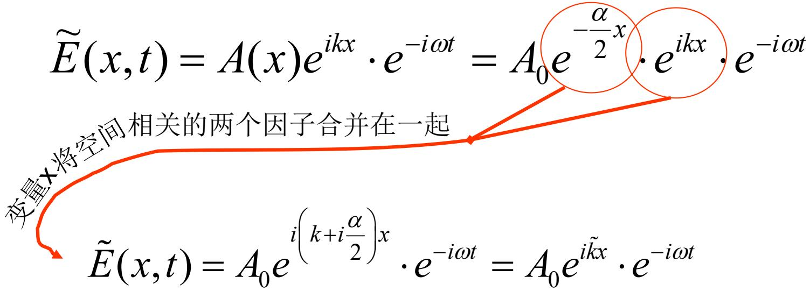

k为复波矢： ${ \tilde { k } } = k + i { \frac { \alpha } { 2 } }$ 

实波矢和折射率的关系：

$$
k = \frac {2 \pi}{\lambda} = \frac {\omega}{\nu} = \frac {\omega}{c / n} = \frac {\omega}{c} n
$$

所以：

$$
\widetilde {k} = \frac {\omega}{c} \left(n + i \frac {c \alpha}{2 \omega}\right) = \frac {\omega}{c} \widetilde {n}
$$

其中 为复折射率，n n~ ~  $n + i \frac { c \alpha } { 2 \omega } = n \big ( 1 + i \kappa \big ) , \kappa = \frac { c \alpha } { 2 n \omega } =$ 0n4它的虚部反映了介质的 吸收， 称为衰减系数。

# 7.2: 色散

光在媒质中的传播速度或折射率随波长改变，称为色散。

正常色散、反常色散、经典色散理论

# 正常色散：

对光波透明的介质，其折射率n随波长λ的增加而减小，色散曲线(n-λ关系曲线)如下图所示，称为正常色散。

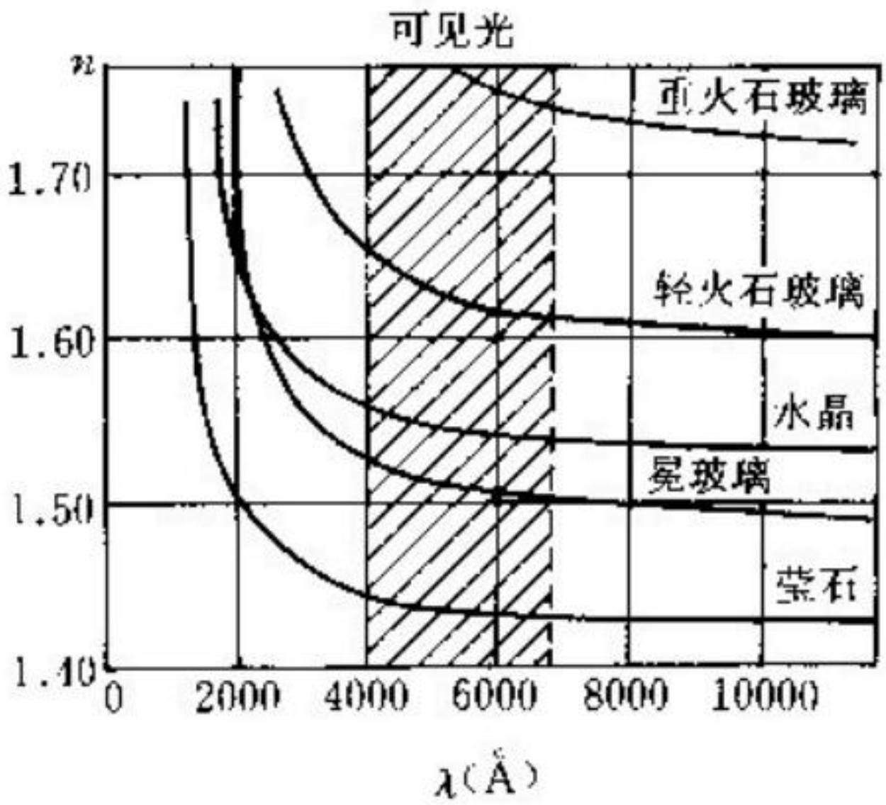

法国数学家A.L.柯西于首先给出了正常色散的经验公式，称柯西公式：

$$
n = A + \frac {B}{\lambda^ {2}} + \frac {C}{\lambda^ {4}}
$$

在可见光波段，在很多材料中，柯西公式相当准确地反映了实际色散曲线。当考察的波长范围不太大时，只要取柯西公式的前两项就够了：

$$
n = A + \frac {B}{\lambda^ {2}}
$$

$$
\frac {d n}{d \lambda} = - 2 \frac {B}{\lambda^ {3}}
$$

表明紫段的色散效应比红段的要大。

# 反常色散：

在介质对光有强烈吸收的波段内(吸收带)，折射率随波长的增加而减小，色散率dn／dλ＞0，这与正常色散相反，故称反常色散。

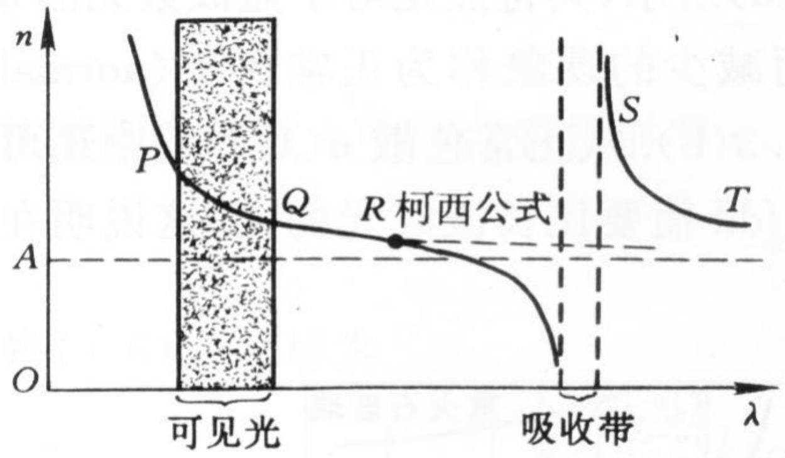

图9.4吸收带附近的反常色散

在可见光区域内色散是正常色散曲线（PQ段）满足柯西公式。若向红外区域延伸，并接近吸收带时，色散曲线开始与柯西公式偏离见。在吸收带内因光极弱很难测到折射率的数据，过了吸收带，色散曲线又恢复正常的形式，并满足柯西公式，不过式中的常数A，B，C等换为新的数值了。F.-P.勒鲁于1860年首先在碘蒸气棱镜内观察到反常色散现象 。

R.W.伍德于1904年利用交叉棱镜法成功地显示出钠蒸气在可见光波段内的反常色散。

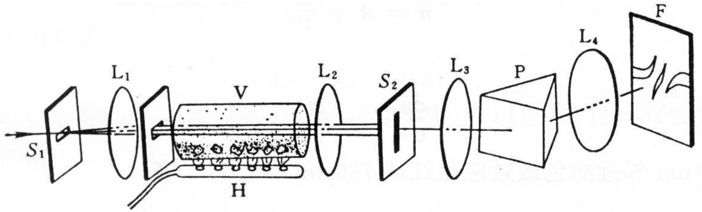

图9.5观察钠蒸气反常色散的实验装置—交叉棱镜法

令一束光从水平狭缝S1穿出，经透镜L1变为平行光，再经过透镜L2聚焦在分光仪的竖直狭缝S2上，当钢管V未加热时，其内只有均匀气体，光线经过它时不发生偏折，在分光仪上形成一水平光谱带，当钠被蒸发时，在管内形成下部密度大上部密度小的水平钠蒸汽柱，它和一个棱边在上（与管轴垂直）底部在下的“棱镜”等效。由于管V内蒸汽的色散作用，不同波长的光不同程度的向下偏折，在钠的吸收线附近，分光仪焦面上的水平光谱带被严重扭曲和割断，变成图所示的样子，这种现象叫做反常色散。

# *一种物质的全域色散曲线

图9.6一种介质的全域色散曲线

# 经典色散理论

概述：光与物质的相互作用导致了色散效应。

经典电磁场理论表明，介质中单色电磁波的传播速度：

$$
\nu = \frac {1}{\sqrt {\varepsilon \varepsilon_ {0} \mu \mu_ {0}}} = \frac {c}{\sqrt {\varepsilon \mu}} \approx \frac {c}{\sqrt {\varepsilon}} \qquad (\mu \approx 1)
$$

介质的光学折射率：

$$
n = \sqrt {\varepsilon}
$$

介质的相对介电常数，联系着宏观上的介质极化强度P与电场强度矢量E：

$$
P (t) = \varepsilon_ {0} \chi E (t), \varepsilon = 1 + \chi
$$

其中称为介质的电极化率。

# 电介质的洛伦兹模型

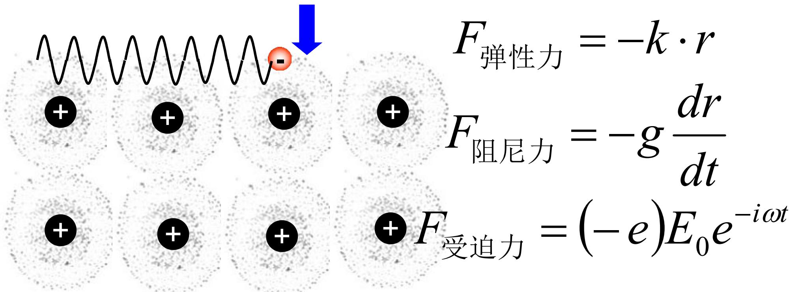

色散求解思路：

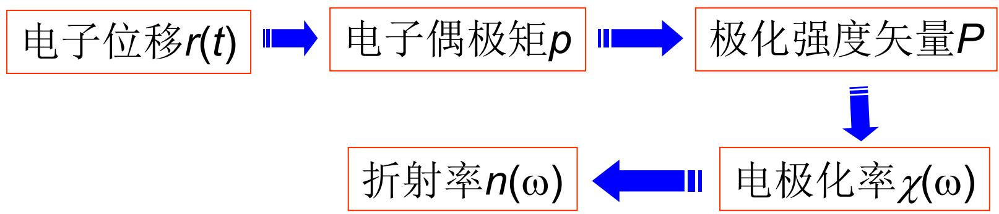

# 单一本征频率情况

电子在光作用下的受迫运动方程：

$$
m \frac {d ^ {2} r}{d t ^ {2}} = F _ {\text {弹 性 力}} + F _ {\text {阻 尼 力}} + F _ {\text {受 迫 力}}
$$

即： $\begin{array} { l } { { \displaystyle n \frac { d ^ { 2 } r } { d t ^ { 2 } } + g \frac { d r } { d t } } + k r = ( - e ) E _ { 0 } e ^ { - i \omega t } } \\ { { \displaystyle \stackrel { \scriptscriptstyle \geq } { \mathbb { H } } \mathbb { H } \mathbb { H } \mathbb { H } \mathbb { H } \mathbb { H } \mathbb { H } \mathbb { H } \mathbb { \Xi } \Re } + \ k r , ~ \displaystyle \not \leq : \gamma : } \end{array}$ dt 2

谐振子的本征频率 0 g  ，于是： m

$$
\frac {d ^ {2} r}{d t ^ {2}} + \gamma \frac {d r}{d t} + \omega_ {0} ^ {2} r = \frac {- e}{m} E _ {0} e ^ {- i \omega t}
$$

复数解：

$$
\widetilde {r} (t) = \frac {- e}{m} \frac {E _ {0} e ^ {- i \omega t}}{\left(\omega_ {0} ^ {2} - \omega^ {2}\right) - i \gamma \omega}
$$

电子偶极矩

$$
\tilde {p} = (- e) \cdot \tilde {r}
$$

极化强度矢量

介质原子数密度为N (1/m3)，每个原子提供外层弱束缚电子数为Z；

$$
\widetilde {P} = N Z \widetilde {p} = N Z (- e) \widetilde {r} = \frac {N Z e ^ {2}}{m} \cdot \frac {E _ {0} e ^ {- i \omega t}}{\left(\omega_ {0} ^ {2} - \omega^ {2}\right) - i \gamma \omega}
$$

电极化率

$$
\widetilde {P} = \varepsilon_ {0} \chi \widetilde {E} = \varepsilon_ {0} \chi E _ {0} e ^ {- i \omega t}
$$

$$
\begin{array}{l} \widetilde {\chi} (\omega) = \frac {N Z e ^ {2}}{\varepsilon_ {0} m} \cdot \frac {1}{\left(\omega_ {0} ^ {2} - \omega^ {2}\right) - i \gamma \omega}, \text {令} \omega_ {p} ^ {2} \equiv \frac {N Z e ^ {2}}{\varepsilon_ {0} m} \\ = \omega_ {p} ^ {2} \cdot \frac {1}{\left(\omega_ {0} ^ {2} - \omega^ {2}\right) - i \gamma \omega} \\ \end{array}
$$

$$
\widetilde {n} ^ {2} = \widetilde {\varepsilon} = \left(1 + \widetilde {\chi}\right)
$$

$$
\begin{array}{l} \tilde {n} ^ {2} = \tilde {\varepsilon} = 1 + \omega_ {p} ^ {2} \cdot \frac {1}{\left(\omega_ {0} ^ {2} - \omega^ {2}\right) - i \gamma \omega} \\ = \left[ 1 + \omega_ {p} ^ {2} \cdot \frac {\omega_ {0} ^ {2} - \omega^ {2}}{\left(\omega_ {0} ^ {2} - \omega^ {2}\right) ^ {2} + (\gamma \omega) ^ {2}} \right] + i \left[ \omega_ {p} ^ {2} \cdot \frac {\gamma \omega}{\left(\omega_ {0} ^ {2} - \omega^ {2}\right) ^ {2} + (\gamma \omega) ^ {2}} \right] \\ \end{array}
$$

$$
\widetilde {n} ^ {2} = \left[ n (1 + i \kappa) \right] ^ {2} = n ^ {2} (1 - \kappa^ {2}) + i 2 n ^ {2} \kappa
$$

所以：

$$
\left\{ \begin{array}{l} n ^ {2} \left(1 - \kappa^ {2}\right) = 1 + \omega_ {p} ^ {2} \cdot \frac {\omega_ {0} ^ {2} - \omega^ {2}}{\left(\omega_ {0} ^ {2} - \omega^ {2}\right) ^ {2} + (\gamma \omega) ^ {2}} \\ 2 n ^ {2} \kappa = \omega_ {p} ^ {2} \cdot \frac {\gamma \omega}{\left(\omega_ {0} ^ {2} - \omega^ {2}\right) ^ {2} + (\gamma \omega) ^ {2}} \end{array} \right.
$$

在弱阻尼、低损耗，即 $\kappa { < } { < } 1$ 条件下，取近似：

$$
n ^ {2} \left(1 - \kappa^ {2}\right) \approx n ^ {2}
$$

在光谱学中，习惯使用真空波长：

$$
\omega_ {0} = \frac {2 \pi c}{\lambda_ {0}}
$$

$$
\omega = \frac {2 \pi c}{\lambda}
$$

于是：

$$
\left[ n ^ {2} = 1 + \omega_ {p} ^ {2} \cdot \frac {\lambda_ {0} ^ {2} \lambda^ {2} \left(\lambda^ {2} - \lambda_ {0} ^ {2}\right)}{\left(2 \pi c\right) ^ {2} \left(\lambda^ {2} - \lambda_ {0} ^ {2}\right) ^ {2} + \gamma^ {2} \lambda_ {0} ^ {4} \lambda^ {2}} \right.
$$

$$
2 n ^ {2} \kappa = \omega_ {p} ^ {2} \cdot \frac {1}{2 \pi c} \cdot \frac {\gamma \lambda_ {0} ^ {4} \lambda^ {3}}{\left(2 \pi c\right) ^ {2} \left(\lambda^ {2} - \lambda_ {0} ^ {2}\right) ^ {2} + \gamma^ {2} \lambda_ {0} ^ {4} \lambda^ {2}}
$$

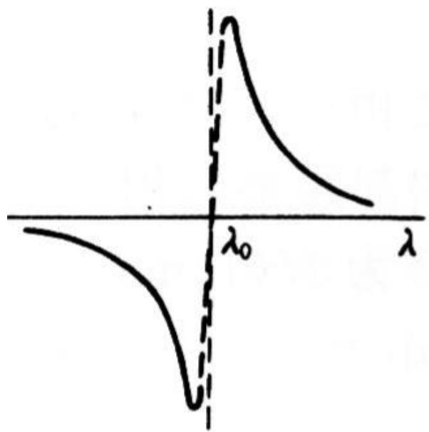

(a）

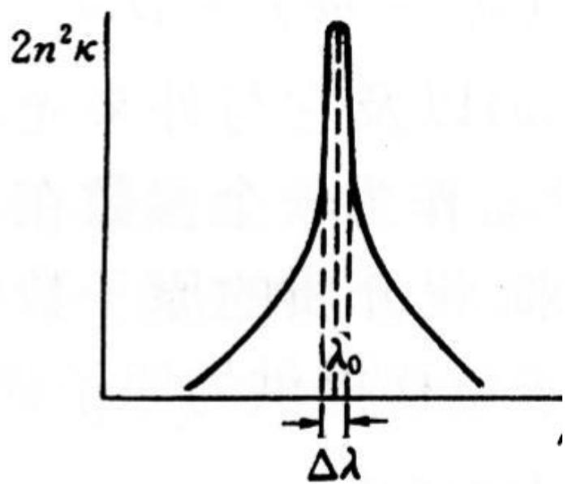

（b）

图9.10单一本征频率的振子的色散和吸收

在共振波长0附近，n和2n随波长的变化如上图，它们具有正常色散、反常色散和共振吸收的一切特点。

当远离共振波长时，为透明区，可以忽略阻尼项，于是

$$
n ^ {2} = 1 + \omega_ {p} ^ {2} \cdot \frac {\lambda_ {0} ^ {2} \lambda^ {2}}{(2 \pi c) ^ {2} (\lambda^ {2} - \lambda_ {0} ^ {2})}
$$

当>>0

$$
n ^ {2} = 1 + \omega_ {p} ^ {2} \cdot \frac {\lambda_ {0} ^ {2}}{(2 \pi c) ^ {2} \left(1 - \left(\frac {\lambda_ {0}}{\lambda}\right) ^ {2}\right)} \approx 1 + \omega_ {p} ^ {2} \cdot \frac {\lambda_ {0} ^ {2}}{(2 \pi c) ^ {2}} \left[ 1 + \left(\frac {\lambda_ {0}}{\lambda}\right) ^ {2} + \dots \right]
$$

$$
n \approx A + \frac {B}{\lambda^ {2}} + \dots
$$

$$
A = \sqrt {1 + {\omega_ {p}} ^ {2} \cdot {\frac {{\lambda_ {0}} ^ {2}}{\left(2 \pi c\right) ^ {2}}}}, B = {\omega_ {p}} ^ {2} \cdot {\frac {{\lambda_ {0}} ^ {4}}{2 A \cdot \left(2 \pi c\right) ^ {2}}}, \ldots
$$

和柯西公式吻合。

当<<0

$$
n ^ {2} = 1 + \omega_ {p} ^ {2} \cdot \frac {\lambda^ {2}}{\left(2 \pi c\right) ^ {2} \left(\left(\frac {\lambda}{\lambda_ {0}}\right) ^ {2} - 1\right)} \approx 1 - \omega_ {p} ^ {2} \cdot \frac {\lambda^ {2}}{\left(2 \pi c\right) ^ {2}} \left[ 1 + \left(\frac {\lambda}{\lambda_ {0}}\right) ^ {2} + \dots \right]
$$

背离了柯西公式。

# 多个本征频率情况

图9.6一种介质的全域色散曲线

设介质的原子体系具有多个本征频率i，相应地有多个共振波长i，阻尼常数i和振子个数 $f _ { j }$ 

... ... ... ...1 2 1 1 2 1 j j j j 频率： ， ， ， 波长： ， ， ，

... ... ... ...1 2 1 1 2 1 j j j j 阻尼： ， ， ， 振子数：f ， f ， f ， f

每个原子提供外层弱束缚电子数为Z，按一定的比例分布在各个本征态上；

$$
\sum_ {j} f _ {i} = Z, N \cdot \sum_ {j} f _ {i} = N Z
$$

仿照单一本征频率时的类似推导：

$$
\begin{array}{l} \widetilde {\varepsilon} = 1 + \omega_ {p} ^ {2} \cdot \sum_ {j} \frac {f _ {j}}{Z} \frac {1}{\left(\omega_ {j} ^ {2} - \omega^ {2}\right) - i \gamma_ {j} \omega} \\ = \left[ 1 + \frac {\omega_ {p} ^ {2}}{Z} \cdot \sum_ {j} \frac {f _ {j} (\omega_ {j} ^ {2} - \omega^ {2})}{(\omega_ {j} ^ {2} - \omega^ {2}) ^ {2} + (\gamma_ {j} \omega) ^ {2}} \right] + i \left[ \frac {\omega_ {p} ^ {2}}{Z} \cdot \sum_ {j} \frac {f _ {j} \gamma_ {j} \omega}{(\omega_ {j} ^ {2} - \omega^ {2}) ^ {2} + (\gamma_ {j} \omega) ^ {2}} \right] \\ \end{array}
$$

在弱阻尼、低损耗，即 $\kappa { < } { < } 1$ 条件下，取近似：

$$
\left\{ \begin{array}{l} n ^ {2} = 1 + \frac {\omega_ {p} {} ^ {2}}{Z} \cdot \sum_ {j} \frac {f _ {j} \lambda_ {j} {} ^ {2} \lambda^ {2} \left(\lambda^ {2} - \lambda_ {j} {} ^ {2}\right)}{\left(2 \pi c\right) ^ {2} \left(\lambda^ {2} - \lambda_ {j} {} ^ {2}\right) ^ {2} + \gamma_ {j} {} ^ {2} \lambda_ {j} {} ^ {4} \lambda^ {2}} \\ 2 n ^ {2} \kappa = \frac {\omega_ {p} {} ^ {2}}{Z} \cdot \frac {1}{2 \pi c} \cdot \sum_ {j} \frac {\gamma_ {j} \lambda_ {j} {} ^ {4} \lambda^ {3}}{\left(2 \pi c\right) ^ {2} \left(\lambda^ {2} - \lambda_ {j} {} ^ {2}\right) ^ {2} + \gamma_ {j} {} ^ {2} \lambda_ {j} {} ^ {4} \lambda^ {2}} \end{array} \right.
$$

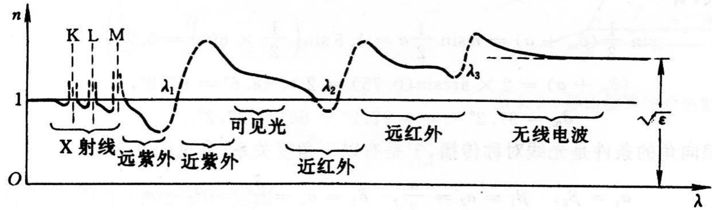

图9.6一种介质的全域色散曲线

在远离吸收线的波段均系透明区域，可以上式的阻尼项j，于是：

$$
n ^ {2} = 1 + \sum_ {j} \frac {a _ {j} \lambda^ {2}}{\lambda^ {2} - \lambda_ {j} ^ {2}}
$$

$$
a _ {j} \equiv \omega_ {p} ^ {2} \cdot \frac {f _ {j} \lambda_ {j} ^ {2}}{Z (2 \pi c) ^ {2}}
$$

两种经典情形

（1）入射光波段处于两条吸收线之间

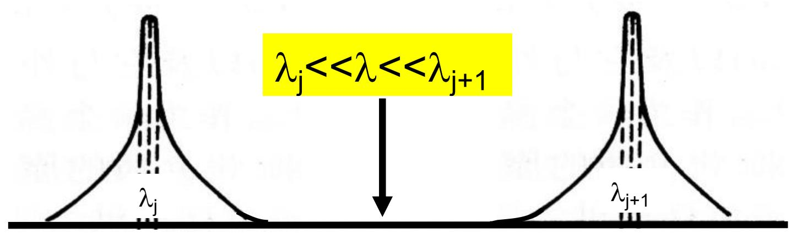

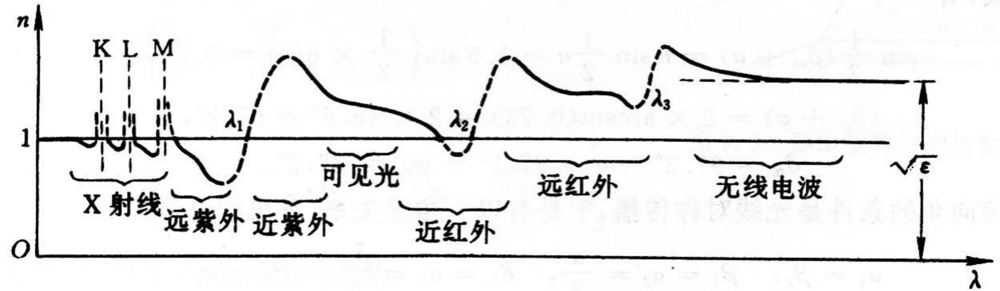

图9.6一种介质的全域色散曲线

$$
\begin{array}{l} n (\lambda) \approx A + \frac {B}{\lambda^ {2}} + \dots \\ A = \sqrt {1 + a _ {1} + a _ {2} + \ldots + a _ {j}}, B = \frac {a _ {i} \lambda_ {j} ^ {2}}{2 A}, \ldots \\ \end{array}
$$

这就导出了柯西公式，并说明常数项A随j增大而上升的特点。

（2）在超高频极短波段，即波长远小于所有吸收线，<<1

$$
n ^ {2} = 1 + \sum_ {j} \frac {a _ {j} \lambda^ {2}}{\lambda^ {2} - \lambda_ {j} ^ {2}} = 1 - \sum_ {j} \frac {a _ {j} \left(\frac {\lambda}{\lambda_ {j}}\right) ^ {2}}{1 - \left(\frac {\lambda}{\lambda_ {j}}\right) ^ {2}} \approx 1 - a _ {j} \left(\frac {\lambda}{\lambda_ {j}}\right) ^ {2} <   1
$$

0 1 n当  ，

图9.6一种介质的全域色散曲线

# 7.3：波包的群速度和波包的展宽

*问题的引出

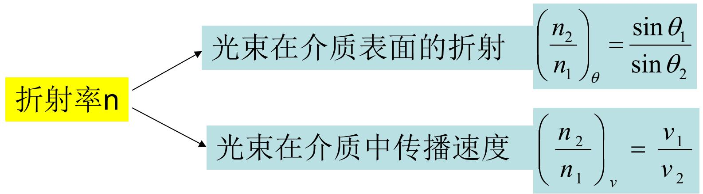

在历史上，迈克耳孙于1885年用钠黄光测定了液体CS2的折射率（相对于空气），其结果为：

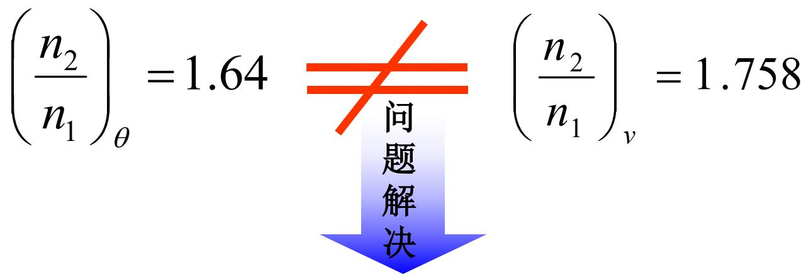

瑞利提出“群速度”

# ●波拍的群速度

平面单色光波； $\widetilde { U } ( x , t ) = A e ^ { i ( k x - \omega t ) }$ 对于空间某一点 $( x _ { 0 } , t _ { 0 } ) \vert ^ { t }$ 的运动状态由它的相位 $( k x _ { 0 } - \omega t _ { 0 } )$ 来刻画，经历dt时间，该运动状态传播到 $( x _ { 0 } + d x )$ ；显然，两个相位值相等。

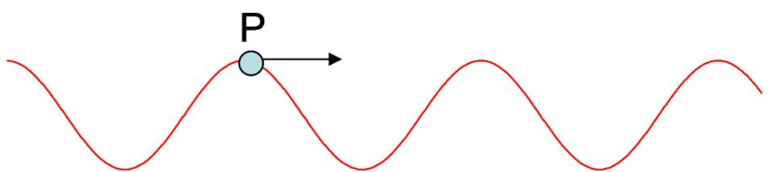

$$
k (x _ {0} + d x) - \omega (t _ {0} + d t) = k x _ {0} - \omega t _ {0}
$$

波的速度为单位时间里运动状态的传播距离：

$$
\nu_ {p} = \frac {d x}{d t} = \frac {\omega}{k}
$$

这个速度的定义是运动状态的传播，或者说是相位的转播速度，故称为相速度。

对于理想的单色光，相位的传播速度和能量的传播速度完全一致，故没有必要特意指出其为相速度。但是在非单色光的情况下会出现一个速度概念—群速度，此时才有必要将单色光波的速度称为相速度，以示区别。

# 群速度是什么？

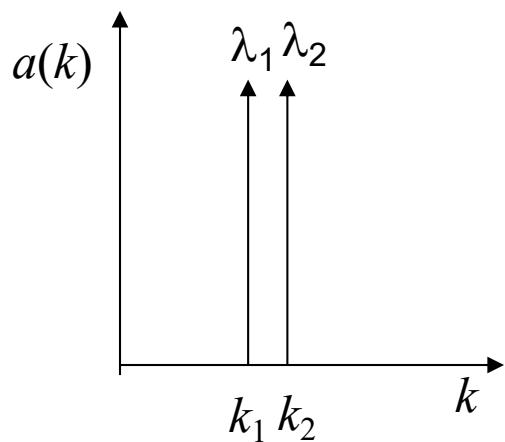

最简单的非单色光，含有两个波长1和2，相应地含有两个 $\omega _ { 1 }$ 和 $\omega _ { 2 }$ ，k1和k2

$$
U _ {1} (x, t) = A \cos \left(\omega_ {1} t - k _ {1} t\right)
$$

$$
U _ {2} (x, t) = A \cos (\omega_ {2} t - k _ {2} t)
$$

则合成波场为：

$$
\begin{array}{l} U (x, t) = U _ {1} (x, t) + U _ {2} (x, t) = 2 A \cos \left(\frac {\omega_ {1} - \omega_ {2}}{2} t - \frac {k _ {1} - k _ {2}}{2} x\right) \cdot \cos \left(\frac {\omega_ {1} + \omega_ {2}}{2} t - \frac {k _ {1} + k _ {2}}{2} x\right) \\ = 2 A \cos \left(\frac {\Delta \omega}{2} t - \frac {\Delta k}{2} x\right) \cdot \cos \left(\overline {{\omega}} t - \overline {{k}} x\right) \\ \end{array}
$$

$$
U (x, t) = 2 A \cos \left(\frac {\Delta \omega}{2} t - \frac {\Delta k}{2} x\right) \cdot \cos \left(\overline {{\omega}} t - \overline {{k}} x\right)
$$

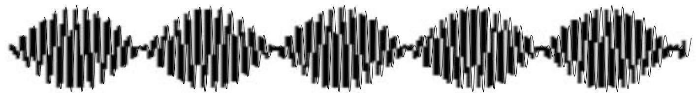

形成波拍。波拍有两个相速度：

$$
v _ {1} = \frac {\omega_ {1}}{k _ {1}} = \frac {c}{n (\lambda_ {1})} v _ {2} = \frac {\omega_ {2}}{k _ {2}} = \frac {c}{n (\lambda_ {2})}
$$

在有色散的介质中传播，两者不相等。接收器感受的是波拍带来的能量流，波拍运动的速度，可以由低频包络因子决定：

$$
\nu_ {p} = \frac {\Delta \omega}{\Delta k} \longrightarrow \boxed {\text {样 速 度}}
$$

色散介质：

$$
n (\lambda_ {1}) \neq n (\lambda_ {2}) \Rightarrow v _ {1} = \frac {\omega_ {1}}{k _ {1}} = \frac {c}{n (\lambda_ {1})} \neq v _ {2} = \frac {\omega_ {2}}{k _ {2}} = \frac {c}{n (\lambda_ {2})}
$$

$$
\begin{array}{l} \nu_ {g} = \frac {\Delta \omega}{\Delta k} = \frac {\nu_ {1} k _ {1} - \nu_ {2} k _ {2}}{k _ {1} - k _ {2}} = \nu_ {1} + \frac {k _ {2}}{k _ {1} - k _ {2}} \left(\nu_ {1} - \nu_ {2}\right) \\ = v _ {1} + \frac {k _ {2}}{k _ {1} - k _ {2}} (v _ {1} - v _ {2}) \\ \end{array}
$$

于是：

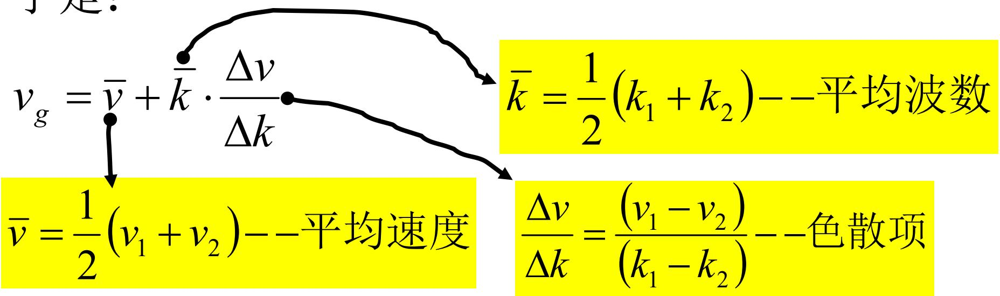

v v v v v v正常色散： g  ；无色散： g  ；反常色散： g 

# ●迈克耳孙实验的说明

钠黄光测定了液体CS2的折射率；钠黄光包含两条谱线，真空中波长为：

$$
\lambda_ {1} = 5 8 9. 0 n m \quad \lambda_ {2} = 5 8 9. 6 n m
$$

两者在色散介质CS 的折射率稍有不同，在折射实验中只涉及光束的方向，它仅与折射率n 和n 有关，故折射法测量的是折射率的平均值: n  1.64

而在速度法中测量的是光束的能流，即波拍的群速度 $V _ { g }$ 

$$
\frac {v _ {\mathrm {g}}}{c} = \frac {\bar {v} + \bar {k} \frac {\Delta v}{\Delta k}}{c} = \frac {\bar {v}}{c} + \frac {\Delta v}{c} \frac {\bar {k}}{\Delta k} = \frac {1}{1 . 7 5 8} <   \frac {\bar {v}}{c} = \frac {1}{1 . 6 4}
$$

$\frac { \overline { { { \nu } } } } { c } + \frac { \Delta \nu } { c } \frac { \overline { { { k } } } } { \Delta k } = \frac { 1 } { 1 . 7 5 8 }$  v其中： 1所以：c 1.64

$$
\frac {\Delta v}{c} \frac {\bar {k}}{\Delta k} = \frac {1}{1 . 7 5 8} - \frac {1}{1 . 6 4} = - 0. 0 4 1
$$

$$
\frac {\Delta v}{c} = - 0. 0 4 0 9 \times \frac {\Delta k}{\bar {k}} \approx - 0. 0 4 1 \times \frac {\Delta \lambda}{\bar {\lambda}} = - 0. 0 4 1 \times \frac {0 . 6 n m}{5 8 9 . 3 n m} = - 4. 2 \times 1 0 ^ {- 5}
$$

$$
\Delta v = - 4. 2 \times 1 0 ^ {- 5} \times c = - 1. 2 5 \times 1 0 ^ {4} m / s
$$

$$
\overline {{v}} \approx \frac {c}{\overline {{n}}} = 1. 8 3 \times 1 0 ^ {8} m / s
$$

 nm589.0 ，相速度 $\nu _ { 1 } = \overline { { { \nu } } } + \frac { \Delta \nu } { 2 } \approx \Big ( 1 . 8 3 - 6 . 3 { \times } 1 0 ^ { - 5 } \Big ) { \times } 1 0 ^ { 8 } m / s$        m sv   1.83 6.3 10 10 / 5 8所以：  nm589.62 ，相速度 $\nu _ { 2 } = \overline { { { \nu } } } - \frac { \Delta \nu } { 2 } \approx \Big ( 1 . 8 3 + 6 . 3 \times 1 0 ^ { - 5 } \Big ) { \times 1 0 ^ { 8 } m / s }$ 

$$
\begin{array}{l} \nu_ {g} = \overline {{\nu}} + \overline {{k}} \frac {\Delta \nu}{\Delta k} \approx (1. 8 3 - 0. 1 2) \times 1 0 ^ {8} m / s = 1. 7 1 \times 1 0 ^ {8} m / s \\ = v _ {g} = \frac {c}{1 . 7 5 8} = 1. 7 1 \times 1 0 ^ {8} m / s \\ \end{array}
$$

# 值得注意：

两条谱线的光的相速度相差甚少，约万分之一，但是对群速度影响很显著，群速度低于相速度小于5%，比其中小相速度还要小。

# ●波包的群速度和宽度

讨论准单色光问题

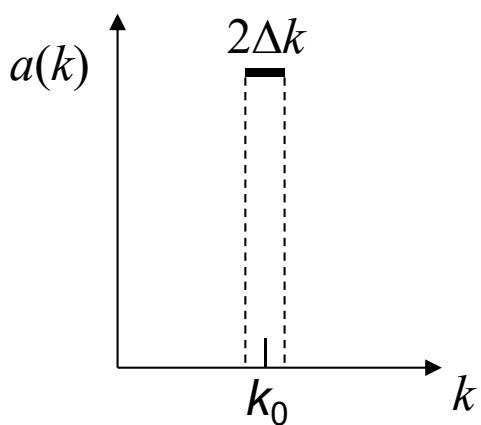

$$
a (k) = \left\{ \begin{array}{l l} a _ {0}, & \quad \left| k - k _ {0} \right| \leq \Delta k \\ 0, & \quad \left| k - k _ {0} \right| > \Delta k \end{array} ; \right.
$$

$$
\Delta k \ll k _ {0}
$$

谱元k—k+dk，它所贡献的元振幅dA

$$
d A = a (k) d k
$$

相应的元波函数：

$$
d \widetilde {U} = d A \cdot e ^ {i (k x - \omega t)} = a (k) e ^ {i (k x - \omega t)} d k
$$

总的波场：

$$
\widetilde {U} (x, t) = \int_ {0} ^ {\infty} a (k) e ^ {i (k x - \omega t)} d k
$$

对于方垒谱密度函数 $a ( k ) = \left\{ { a _ { 0 } } , \ \left| k - k _ { 0 } \right| \le \Delta k \right. _ { ; }$ 0 k k 

其波场为：

$$
\widetilde {U} (x, t) = \int_ {k _ {0} - \Delta k} ^ {k _ {0} + \Delta k} a _ {0} e ^ {i (k x - \omega t)} d k
$$

$\omega = { \frac { c } { n ( k ) } } \cdot k ,$ ，因为色散 和 不是线性关系，对 在 k $k _ { 0 }$ 点级数展开：

$$
\omega (k) = \omega (k _ {0}) + \left(\frac {d \omega}{d k}\right) _ {k _ {0}} \cdot (k - k _ {0}) + \frac {1}{2} \left(\frac {d ^ {2} \omega}{d k ^ {2}}\right) _ {k _ {0}} \cdot (k - k _ {0}) ^ {2} + \dots
$$

只保留一阶：

$$
\omega (k) = \omega (k _ {0}) + \left(\frac {d \omega}{d k}\right) _ {k _ {0}} \cdot K; \qquad K \equiv (k - k _ {0})
$$

$$
\begin{array}{l} \widetilde {U} (x, t) = \int_ {k _ {0} - \Delta k} ^ {k _ {0} + \Delta k} a _ {0} e ^ {i (k x - \omega t)} d k = \int_ {- \Delta k} ^ {\Delta k} a _ {0} e ^ {i K (x - \left(\frac {d \omega}{d k}\right) _ {k _ {0}} \cdot t)} \cdot e ^ {i (k _ {0} x - \omega_ {0} t)} d K \\ = 2 a _ {0} \frac {\sin \left[ \left(x - \left(\frac {d \omega}{d k}\right) _ {k _ {0}} \cdot t\right) \cdot \Delta k \right]}{\left(x - \left(\frac {d \omega}{d k}\right) _ {k _ {0}} \cdot t\right)} \cdot e ^ {i (k _ {0} x - \omega_ {0} t)} \\ \end{array}
$$

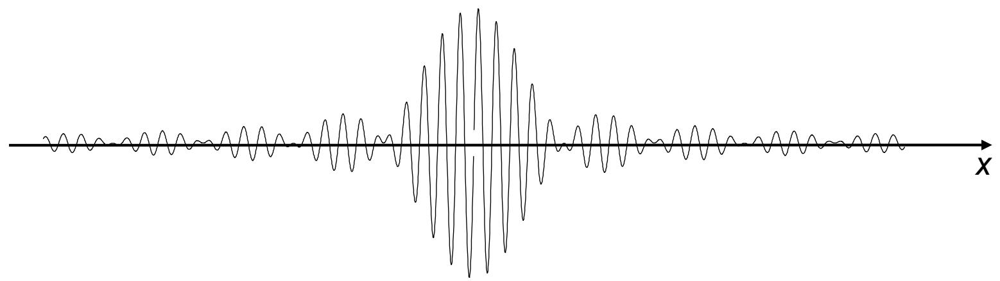

1.波包的群速度：

$$
2 a _ {0} \frac {\sin \left[ \left(x - \left(\frac {d \omega}{d k}\right) _ {k _ {0}} \cdot t\right) \cdot \Delta k \right]}{\left(x - \left(\frac {d \omega}{d k}\right) _ {k _ {0}} \cdot t\right)} \cdot e ^ {i (k _ {0} x - \omega_ {0} t)}
$$

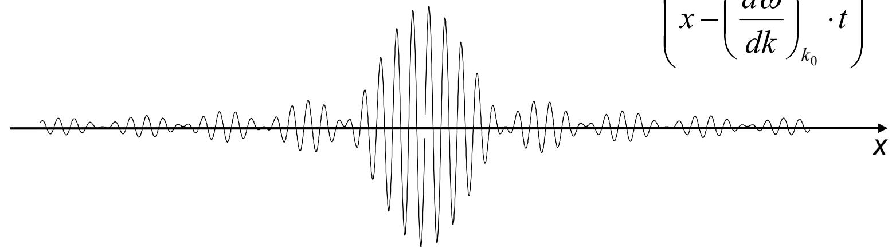

传播因子：

$$
x - \left(\frac {d \omega}{d k}\right) _ {k _ {0}} \cdot t = (x + d x) - \left(\frac {d \omega}{d k}\right) _ {k _ {0}} \cdot (t + d t)
$$

群速度：

$$
\nu_ {g} = \frac {d x}{d t} = \left(\frac {d \omega}{d k}\right) _ {k _ {0}}
$$

2.波包的宽度：

$$
2 a _ {0} \frac {\sin \left[ \left(x - \left(\frac {d \omega}{d k}\right) _ {k _ {0}} \cdot t\right) \cdot \Delta k \right]}{\left(x - \left(\frac {d \omega}{d k}\right) _ {k _ {0}} \cdot t\right)} \cdot e ^ {i (k _ {0} x - \omega_ {0} t)}
$$

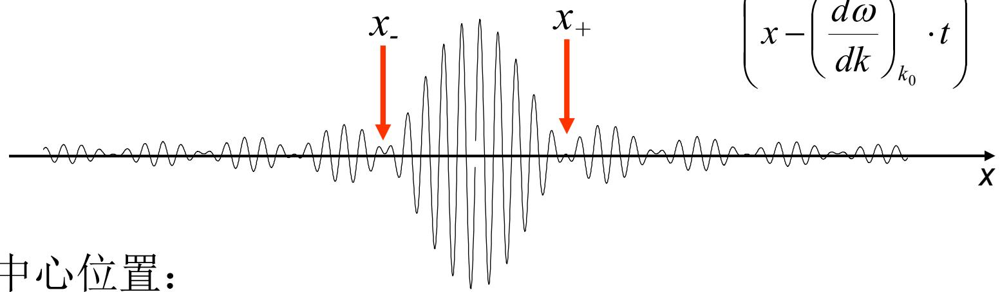

$$
\left(x _ {0} - \left(\frac {d \omega}{d k}\right) _ {k _ {0}} \cdot t\right) \cdot \Delta k = 0, \quad \text {即 :} x _ {0} = \left(\frac {d \omega}{d k}\right) _ {k _ {0}} \cdot t
$$

宽度：

$$
\left(x _ {\pm} - \left(\frac {d \omega}{d k}\right) _ {k _ {0}} \cdot t\right) \cdot \Delta k = \pm \pi \Rightarrow \Delta x = \left(x _ {+} - x _ {-}\right) = \frac {2 \pi}{\Delta k}
$$

$$
\Delta x \cdot \Delta k \approx 2 \pi , \quad \text {即} \Delta v \cdot \tau_ {0} \approx 1
$$

波包宽度和时间无关

# ● 波包的展宽

$$
\begin{array}{l} {\omega (k) = \omega (k _ {0}) + \left(\frac {d \omega}{d k}\right) _ {k _ {0}} \cdot (k - k _ {0}) + \frac {1}{2} \left(\frac {d ^ {2} \omega}{d k ^ {2}}\right) _ {k _ {0}} \cdot (k - k _ {0}) ^ {2} + \dots} \\ {\text {保 留 到 二 阶 ：}} \\ {\omega (k) = \dot {\omega} _ {0} + \dot {\omega} \cdot K + \ddot {\omega} \cdot K ^ {2}} \end{array}
$$

讨论高斯型准单色光谱：

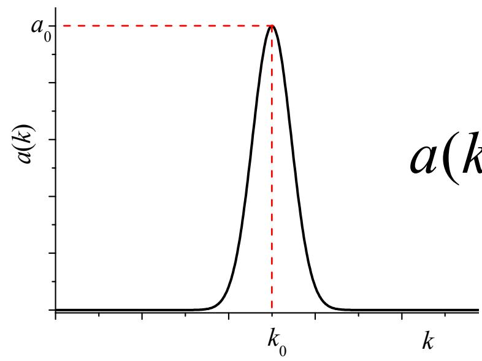

$$
a (k) = a _ {0} e ^ {- \beta (k - k _ {0}) ^ {2}} = a _ {0} e ^ {- \beta K ^ {2}}
$$

$$
\begin{array}{l} \widetilde {U} (x, t) = \int_ {0} ^ {\infty} a _ {0} e ^ {i (k x - \omega t)} d k = a _ {0} e ^ {i (k _ {0} x - \omega_ {0} t)} \cdot \int_ {- k _ {0}} ^ {\infty} e ^ {- \beta K ^ {2}} \cdot e ^ {i (K x - \dot {\omega} K t - \ddot {\omega} K ^ {2} t)} d K \\ = a _ {0} e ^ {i (k _ {0} x - \omega_ {0} t)} \cdot \int_ {- k _ {0}} ^ {\infty} e ^ {- (\beta + i \ddot {\omega} t) K ^ {2}} \cdot e ^ {- i 2 \pi \left(\frac {(\dot {\omega} t - x)}{2 \pi}\right) K} d K \\ \end{array}
$$

积分公式： e bx √   fx e dx2 2 π e bfb

$$
\widetilde {U} (x, t) = \sqrt {\frac {\pi}{\beta + i \ddot {\omega} t}} \cdot e ^ {- \frac {(\dot {\omega} t - x) ^ {2}}{4 (\beta + i \ddot {\omega} t)}} \cdot e ^ {i (k _ {0} x - \omega_ {0} t)}
$$

注意上面推导中取了一个近似，把（-k，+）延伸到（-，+）

$\ddot { \omega } = \frac { 1 } { 2 } \Bigg ( \frac { d ^ { 2 } \omega } { d k ^ { 2 } } \Bigg ) _ { k _ { 0 } } \approx 0$ 2d .当k

于是：

$$
\widetilde {U} (x, t) \approx \sqrt {\frac {\pi}{\beta}} \cdot e ^ {- \frac {(\dot {\omega} t - x) ^ {2}}{4 \beta}} \cdot e ^ {i (k _ {0} x - \omega_ {0} t)}
$$

传播因子：

$$
x - \left(\frac {d \omega}{d k}\right) _ {k _ {0}} \cdot t = (x + d x) - \left(\frac {d \omega}{d k}\right) _ {k _ {0}} \cdot (t + d t)
$$

群速度：

$$
\nu_ {g} = \frac {d x}{d t} = \left(\frac {d \omega}{d k}\right) _ {k _ {0}}
$$

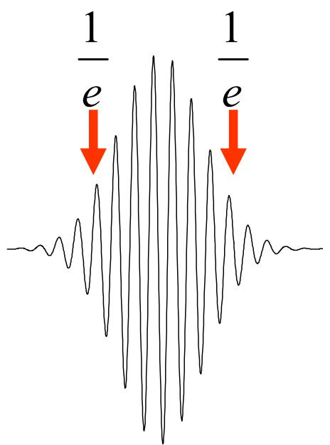

波包中心位置：

$$
\left(x _ {0} - \left(\frac {d \omega}{d k}\right) _ {k _ {0}} \cdot t\right) \cdot \Delta k = 0, \quad \text {即 :} x _ {0} = \left(\frac {d \omega}{d k}\right) _ {k _ {0}} \cdot t
$$

宽度：

$$
\left(x _ {\pm} - \dot {\omega} \cdot t\right) ^ {2} = 4 \beta \Rightarrow \Delta x = \left(x _ {+} - x _ {-}\right) = 4 \sqrt {\beta}
$$

波包宽度和时间无关

2.当 $\ddot { \omega } = \frac { 1 } { 2 } \Bigg ( \frac { d ^ { 2 } \omega } { d k ^ { 2 } } \Bigg ) _ { k _ { 0 } } \neq 0 ,$ ，不 能忽 略时 ：k

$$
\widetilde {U} (x, t) = \sqrt {\frac {\pi}{\beta + i \ddot {\omega} t}} \cdot e ^ {- \frac {(\dot {\omega} t - x) ^ {2}}{4 (\beta + i \ddot {\omega} t)}} \cdot e ^ {i (k _ {0} x - \omega_ {0} t)}
$$

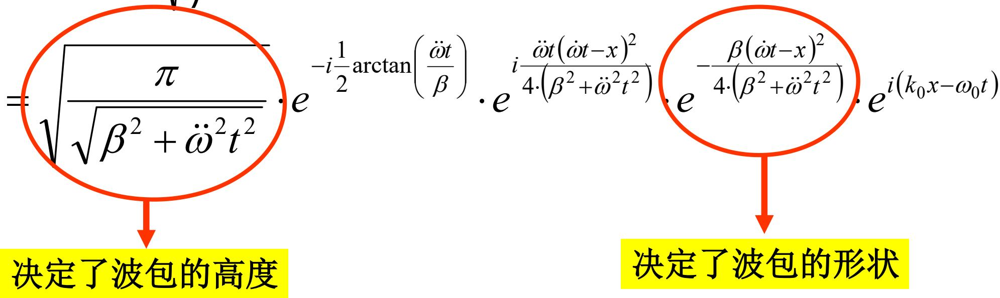

$$
\widetilde {P} (x, t) = \sqrt {\frac {\pi}{\sqrt {\beta^ {2} + \ddot {\omega} ^ {2} t ^ {2}}}} \cdot e ^ {- \frac {\beta (\dot {\omega} t - x) ^ {2}}{4 \cdot (\beta^ {2} + \ddot {\omega} ^ {2} t ^ {2})}}
$$

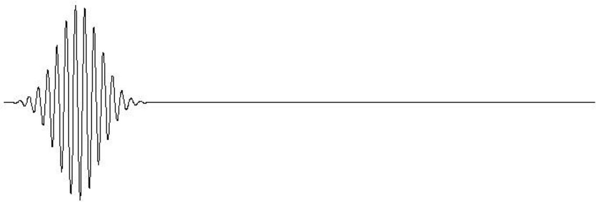

$$
\left(x _ {0} - \dot {\omega} \cdot t\right) = 0, \quad \text {即 :} x _ {0} = \dot {\omega} \cdot t \rightarrow v _ {g} = \dot {\omega}
$$

宽度：

$$
\beta \left(x _ {\pm} - \dot {\omega} \cdot t\right) ^ {2} = 4 \left(\beta^ {2} + \ddot {\omega} ^ {2} t ^ {2}\right) \Rightarrow \Delta x = \left(x _ {+} - x _ {-}\right) = \frac {4}{\sqrt {\beta}} \sqrt {\beta^ {2} + \ddot {\omega} ^ {2} t ^ {2}}
$$

波包宽度和时间有关，波包随时间展宽，变矮，以至消失。

# 波包的寿命：

从 $\mathrm { \Delta t } _ { 0 } { = } 0$ 时刻开始，到波包展宽到原来3倍所需要的时间。

$$
\Delta x = \left(x _ {+} - x _ {-}\right) = \frac {4}{\sqrt {\beta}} \sqrt {\beta^ {2} + \ddot {\omega} ^ {2} t ^ {2}}
$$

$$
\Delta x _ {0} = 4 \cdot \sqrt {\beta}, \Delta x _ {\tau} = \frac {4}{\sqrt {\beta}} \sqrt {\beta^ {2} + \ddot {\omega} ^ {2} \tau^ {2}}
$$

$$
\frac {\Delta x _ {\tau}}{\Delta x _ {0}} = \sqrt {1 + \frac {\ddot {\omega} ^ {2} \tau^ {2}}{\beta^ {2}}} = 3 \rightarrow \tau \approx \frac {3 \beta}{\ddot {\omega}}
$$

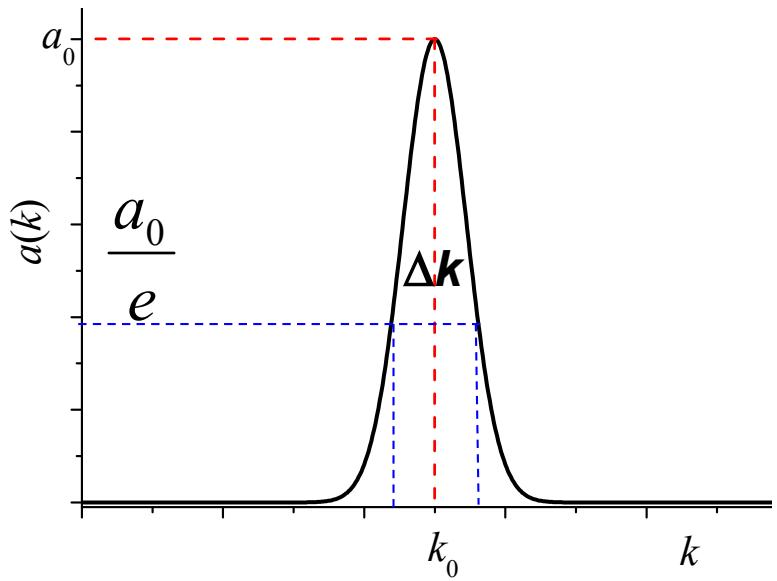

$$
a (k) = a _ {0} e ^ {- \beta (k - k _ {0}) ^ {2}} = a _ {0} e ^ {- \beta K ^ {2}}
$$

$$
\Delta k = \frac {2}{\sqrt {\beta}} - - \rightarrow \beta = \frac {4}{\Delta k ^ {2}}
$$

12所以： 2k 

# 单粒子波包的经典描述

pE p k E     2能量： ，动量： ，能量： $E = \hbar \omega$ $p = \hbar k ,$ $E = { \frac { p ^ { 2 } } { 2 m } }$ 

k 2所以：m2

$$
\ddot {\omega} = \frac {1}{2} \frac {d ^ {2} \omega}{d k ^ {2}} = \frac {\hbar k}{m}
$$

根据量子力学的测不准关系：

$$
\Delta p \cdot \Delta x \geq 2 \pi \hbar \xrightarrow {p = \hbar k , \text {所 以 :} \Delta p = \hbar \Delta k} \rightarrow \Delta k \cdot \Delta x \geq 2 \pi
$$

$\tau \cong \frac { 1 2 } { \boldsymbol { \ddot { \omega } } \cdot \Delta \boldsymbol { k } ^ { 2 } } \le 4 \frac { m \cdot \Delta \boldsymbol { x } ^ { 2 } } { h }$ m x2 所以粒子波包的寿命：k 2 

• 被束缚在原子中的电子

$$
\Delta x \approx 1 \mathring {\mathrm {A}}
$$

电子波包的寿命：

$$
\tau \sim 5 \times 1 0 ^ {- 1 7} s
$$

• 电子管中的电子

$$
\Delta x \approx 1 m
$$

电子波包的寿命：

$$
\tau \sim 5 \times 1 0 ^ {3} s
$$