# 几何光学基本原理

以光线概念为基础，根据以实验事实建立的几个基本定律，通过三角运算、矩阵运算、几何作图法讨论物体经过光学系统的成像规律。

(光线是表示光传播方向的几何线。光束是同一光源发出的许多光线的集合。但是光线不是具体的一束光，即使是很细的一束光也不能称之为光线）

# 第一章 费马原理和变折射率光学

1. 几何光学基本定律

2. 惠更斯原理

3. 光程

4. 费马原理

5. 变折射率光学

# 1 几何光学的基本规律

（1） 直线传播定律

（2） 独立传播定律

（3） 反射定律

（4） 折射定律

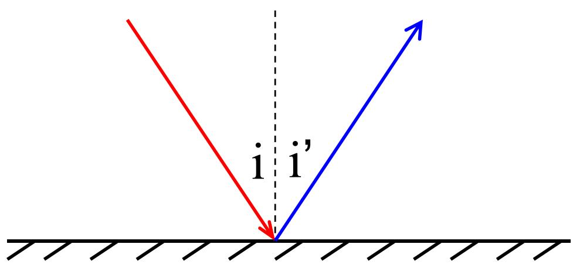

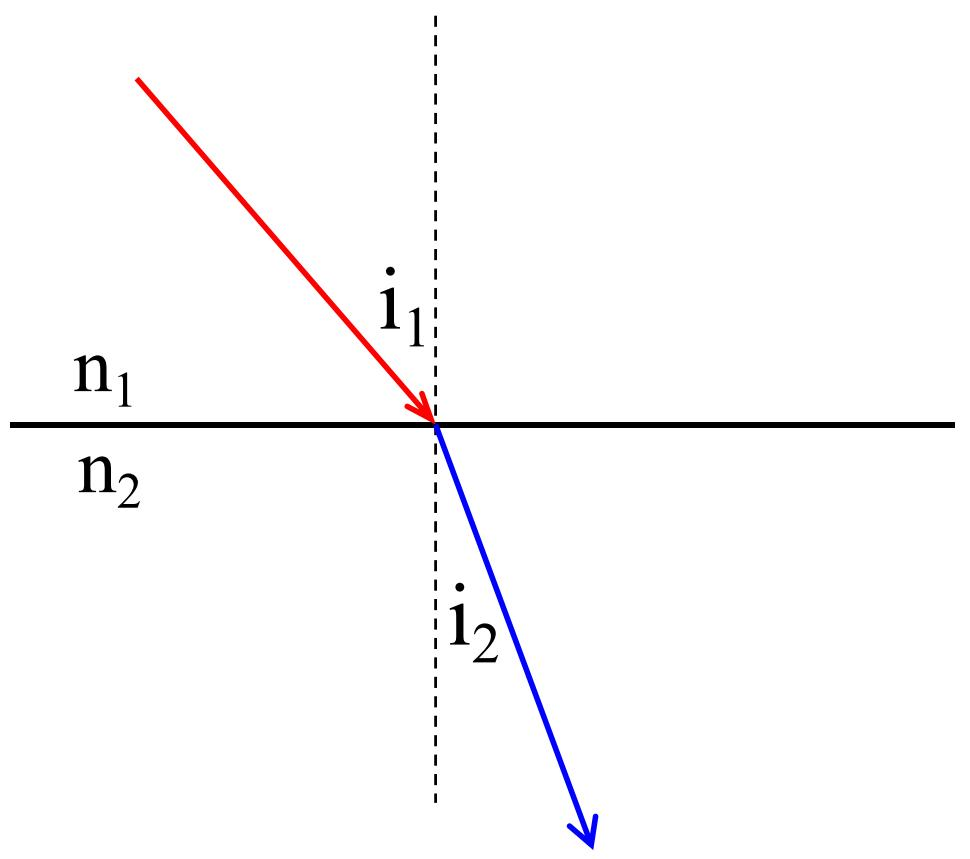

$$
i = i ^ {\prime}
$$

反射定律

$$
\mathrm {n} _ {1} \mathrm {s i n i} _ {1} = \mathrm {n} _ {2} \mathrm {s i n i} _ {2}
$$

折射定律

# 惠更斯原理

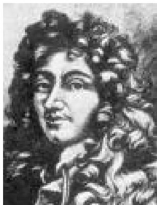

C. Huygens(1629—1695)

惠更斯，荷兰物理学家，天文学家，数学家。在阿基米德的著作和R.笛卡尔等人的影响下，致力于力学、光学、天文学及数学的研究。1663年选为英国皇家学会成员。1666年选为刚成立的法国科学院的成员。1681年返回荷兰定居。

惠更斯首先发明了摆钟并对有关时计的若干种摆（单摆、复摆、旋轮摆等）作了研究，这对当时天文与航行上所用和后来时计的发展起了重要的作用。惠更斯是创建经典力学的先驱之一，在研究钟摆、圆周运动、完全弹性体碰撞等问题中，他阐明了许多动力学的概念和规律（摆的运动方程与周期、向心力与离心力、摆动中心、转动惯量、简单情况下的动量及机械能守恒定律等）。他精通几何光学和擅长应用光学技术，设计了新的透镜研磨法而制成消除像差的惠更斯目镜以致优质的显微镜和望远镜，其中物镜焦距长达数十米的天文望远镜沿用了近一个世纪。

惠更斯是经典物理光学的奠基人。他提出的光的波动理论是以“光是以太媒介中的波动”为前提和波的惠更斯原理为核心的光波理论。这原理的现代表述为：在行进波的波阵面上各点发出的许多次波所形成的包络面，就是原波面在一定时间内所传播的新波面；它适用于一切的波动。据此，惠更斯不但解释了光的反射与（在各向同性介质中）光的折射定律和光的定性的衍射现象，尤为精彩的是他用这一原理来定量说明了光在单轴晶体如冰洲石中的双折射现象。原始的惠更斯原理“不能说明及确定光衍射强度的定性分布”的不足之处 ，由后来菲涅耳加以补充而使之完备（ 见惠更斯-菲涅耳原理）。

在数学方面 ，惠更斯主要是在 1658 年求得摆线（旋轮线）曲线的长度。在天文学方面，他发现了土星的光环、土卫六和猎户星云等。其他还有对空气泵和气压计的改进，提出测微计的初步设想，发明钟表的弹簧游丝，改进测温术 ，对引力及地球形状的研究，提出各种动力机的设想等工作与成就。《光论》是他的经典名著。

# 惠更斯原理

光扰动同时到达的空间曲面被称为波面或波前，波前上的每一点都可以看成一个新的扰动中心，称为子波源或次波源，次波源向四周发出次波；下一时刻的波前是这些大量次波面的公切面，或称为包络面；次波中心与其次波面上的那个切点的连线方向给出了该处光传播方向。

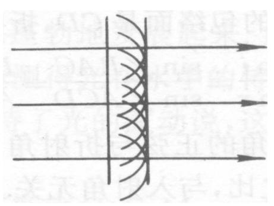

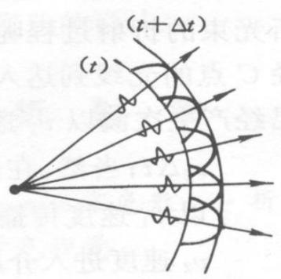

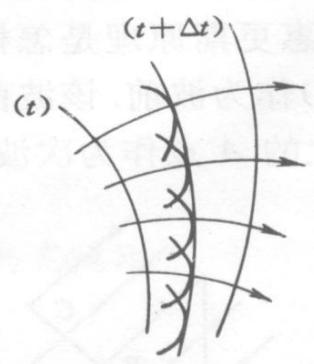

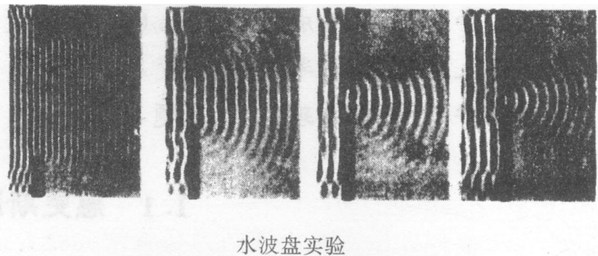

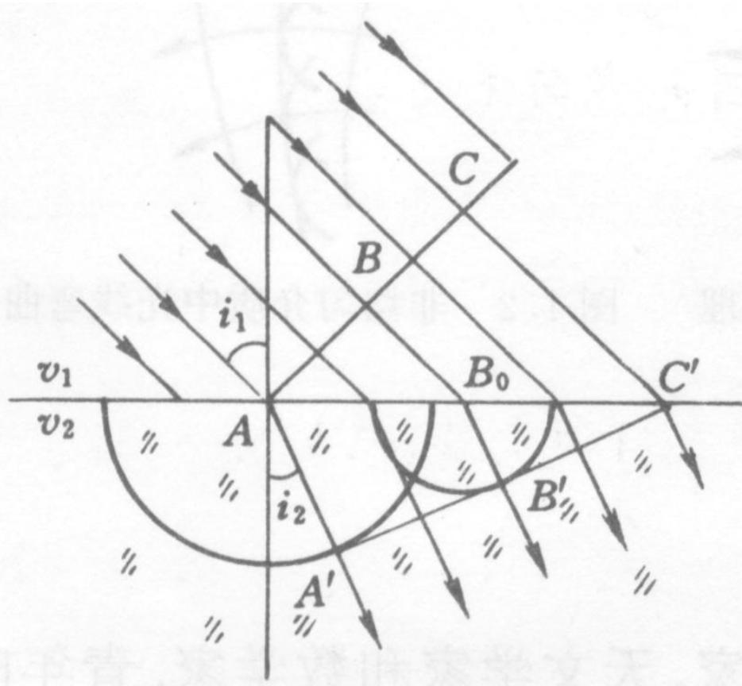

$1 , 5$

ABC 

C→C’的时间： 'CCt 1v

A点：

$$
\rho_ {A} = v _ {2} \cdot \Delta t = \frac {v _ {2}}{v _ {1}} \overline {{C C ^ {\prime}}}
$$

由C’点向圆A作切线C’A’

B点：B

次波面的公切面：A’B’C’

次波中心和切点的连线AA’、

$\mathrm { B } _ { \mathrm { o } } \mathrm { B } ^ { \prime }$ , 折射光的传播方向，折射角为i2:

$$
\sin i _ {1} = \frac {\overline {{C C}} ^ {\prime}}{\overline {{A C}} ^ {\prime}}, \quad \sin i _ {2} = \frac {\rho_ {A}}{\overline {{A C}} ^ {\prime}} = \frac {v _ {2}}{v _ {1}} \frac {\overline {{C C}} ^ {\prime}}{\overline {{A C}} ^ {\prime}}
$$

折射定律：

$$
\frac {\sin i _ {1}}{\sin i _ {2}} = \frac {v _ {1}}{v _ {2}} = c o n s t
$$

◈ 折射定律和速度比

光粒子说：

$$
\frac {\sin i _ {1}}{\sin i _ {2}} = \frac {\nu_ {2}}{\nu_ {1}} = c o n s t
$$

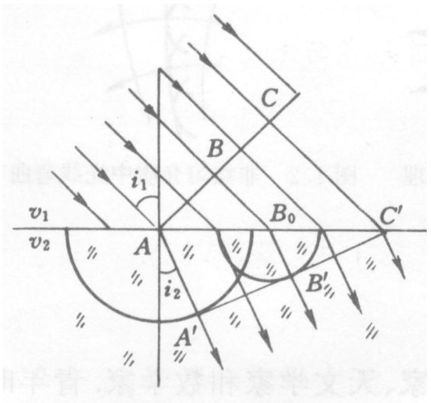

1850年傅科和斐索测量了光速，光波动说又一次得到了证实。

惠更斯原理的不足:

1. 不能回答光振幅或光强的传播问题。

2. 不能回答光位相的传播问题。

惠更斯－菲聂耳原理光场衍射理论的诞生

惠更斯原理的精华:

次波源的概念。

几个重要物理量和关系：

折射率、色散、折射率和光速比、折射率和波长比、

光程、光程和相位差、光程和时间差…

# 折射率：

折射率是一个关于介质材料光学性能的重要参数，它源于折射率定律：

$$
\frac {\sin i _ {1}}{\sin i _ {2}} = n _ {1 2} = \frac {n _ {2}}{n _ {1}}
$$

真空： $\mathrm { n } { = } 1$ , 玻璃： $\mathrm { \ n } { = } 1 . 5 ,$ , 空气：n=1.000292

# *色散

同一种介质对于不同的波长具有不同的折射率，称为色散。

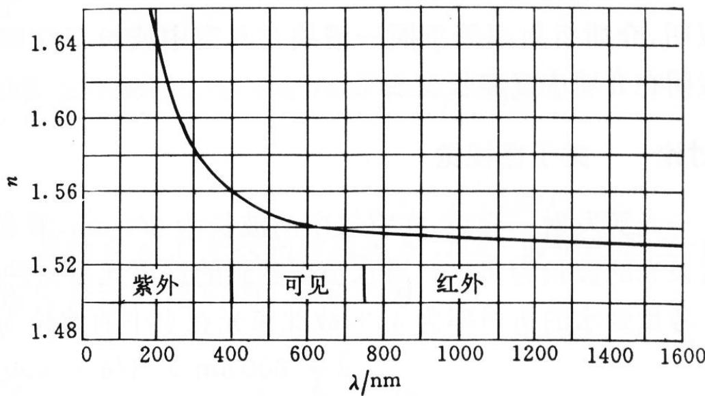

图1.9石英的色散曲线

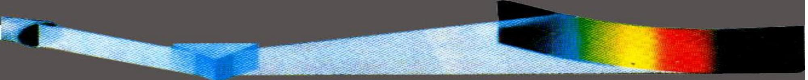

# 颜色机理

色素颜色

物体表面含有特定的化学色素（如叶绿素、血红蛋白、颜料分子等），这些色素会选择性地吸收某些波长的可见光，反射或透射其余波长的光。人眼感知到的颜色正是物体反射的光的波长范围。

结构颜色

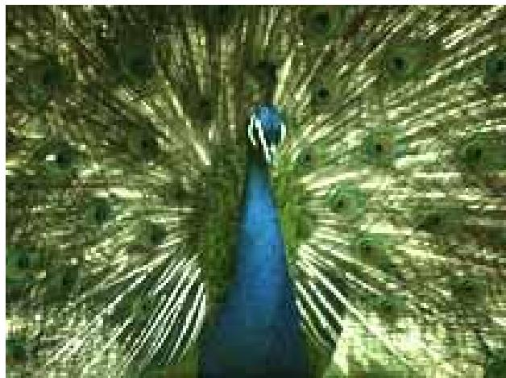

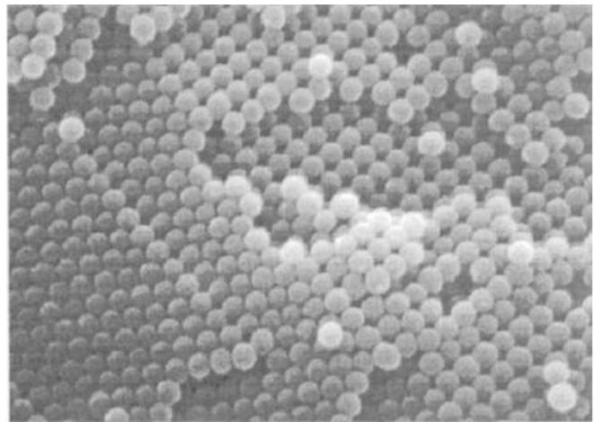

孔雀羽毛的颜色并非来自色素，而是由羽毛表面的纳米级周期性结构（如光子晶体或多层薄膜）引起的光学效应。这些结构通过光的干涉、衍射或散射选择性增强某些波长的反射光，产生鲜艳的虹彩色。

# 颜色机理

<table><tr><td>特征</td><td>色素色</td><td>结构色</td></tr><tr><td>原理</td><td>化学物质吸收/反射特定波长光</td><td>物理结构调控光的干涉/衍射</td></tr><tr><td>颜色来源</td><td>分子电子跃迁</td><td>纳米结构的光学相互作用</td></tr><tr><td>颜色稳定性</td><td>随时间可能褪色（化学降解）</td><td>持久（除非结构破坏）</td></tr><tr><td>角度依赖性</td><td>无（颜色固定）</td><td>有（颜色随角度变化）</td></tr><tr><td>典型例子</td><td>树叶、颜料、血液</td><td>孔雀羽毛、蝴蝶翅膀、肥皂泡</td></tr></table>

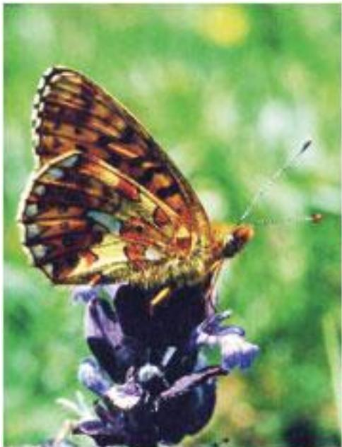

.色彩亮麗的蝴蝶

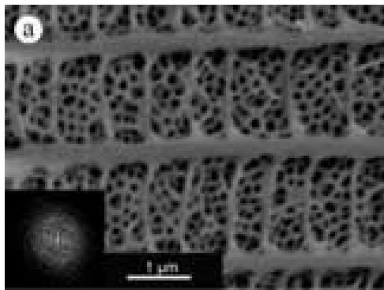

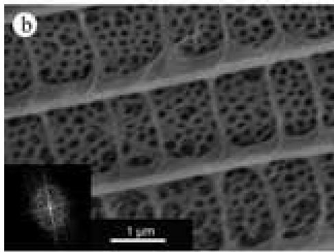

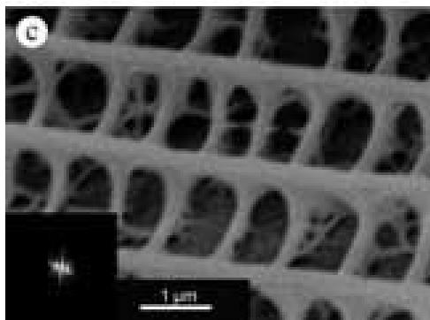

蝴蝶翅膀放大圖

# *折射率与光速

$$
{\frac {\sin i _ {1}}{\sin i _ {2}}} = {\frac {n _ {2}}{n _ {1}}}, \quad {\frac {\sin i _ {1}}{\sin i _ {2}}} = {\frac {v _ {1}}{v _ {2}}}
$$

所以： $\frac { \nu _ { 1 } } { \nu _ { 2 } } = \frac { n _ { 2 } } { n _ { 1 } }$ 2v

真空的折射率为1，光速为c

$$
n = \frac {c}{v} \qquad \text {或} \qquad v = \frac {c}{n}
$$

比如光在水中的速度：

$$
\nu = 3 \times 1 0 ^ {8} m / s \div 1. 3 3 3 = 2. 2 5 \times 1 0 ^ {8} m / s
$$

$$
n (\lambda) \Rightarrow v (\lambda)
$$

# *折射率与波长

波速： v  f

对于一切波具有普遍的意义。

真空中光速： $c = f _ { 0 } \lambda _ { 0 } ,$ ，介质中光速： $\nu = f \lambda$ 

$$
n = \frac {f _ {0} \lambda_ {0}}{f \lambda}
$$

在线性光学介质中: 0f  f 所以：

$$
n = \frac {\lambda_ {0}}{\lambda} \qquad \text {或} \qquad \lambda = \frac {\lambda_ {0}}{n}
$$

光波在介质中的波长等于真空中波长除于介质折射率。

# 3. 光程

光程：光线路径的几何长度与所经过的介质折射率的乘积。

（Q→P)光程的表达式：

同一种均匀介质：

$$
L (Q P) = n l
$$

比如透镜组 ：

$$
L (Q P) = n _ {1} l _ {1} + n _ {2} l _ {2} + \dots = \sum n _ {i} l _ {i}
$$

变折射率介质：

$$
L (Q P) = \int_ {Q} ^ {P} n (r) d s
$$

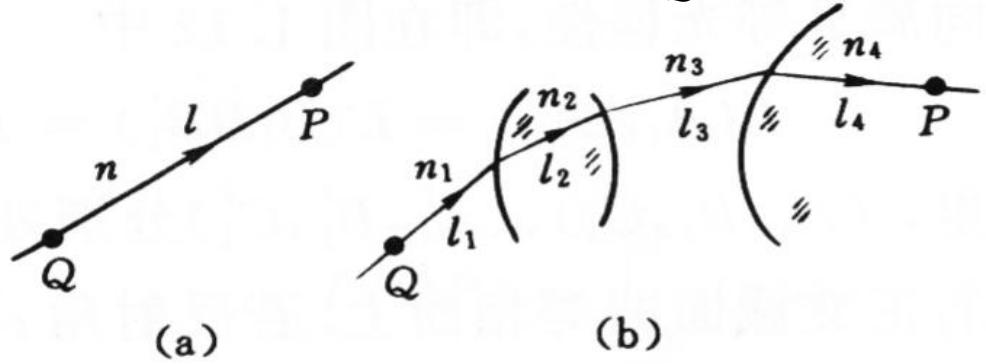

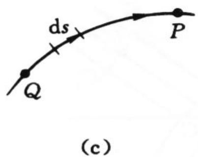

图1.10各种场合下的光程计算.（a）均匀介质，（b）介质分区均匀，(c）变折射率场合

# *光程与相位差

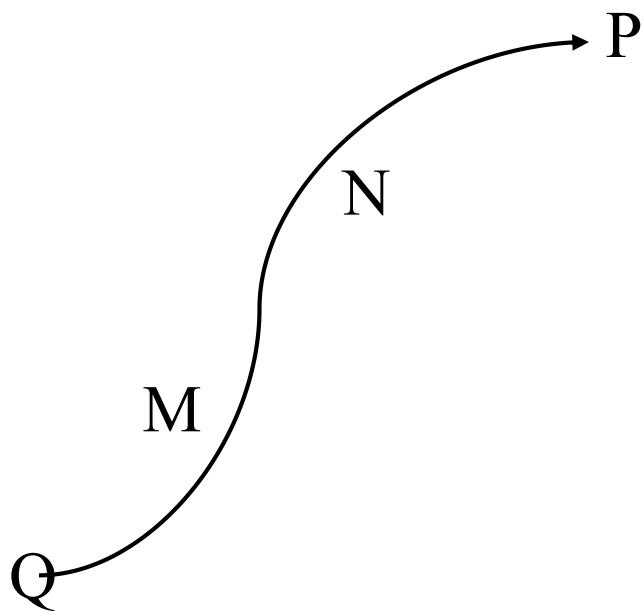

Q→M →N →…→P,相位逐点落后；

$$
\varphi (Q) - \varphi (P) = - (\frac {2 \pi}{\lambda_ {1}} l _ {1} + \frac {2 \pi}{\lambda_ {2}} l _ {2} + \dots) = - \sum_ {i} \frac {2 \pi}{\lambda_ {i}} l _ {i}
$$

即：

$$
\varphi (Q) - \varphi (P) = - \frac {2 \pi}{\lambda_ {0}} \sum_ {i} n _ {i} l _ {i} = - \frac {2 \pi}{\lambda_ {0}} L (Q P)
$$

# *光程与时差

QP的传播时间：

$$
\Delta t = t _ {P} - t _ {Q} = \sum_ {i} \Delta t _ {i} = \sum_ {i} \frac {l _ {i}}{\nu_ {i}}
$$

介质中光速用真空光速和折射率代替：

$$
\Delta t = \frac {1}{c} \sum_ {i} n _ {i} l _ {i} = \frac {1}{c} L (Q P) \quad \text {或} \quad L (Q P) = c \Delta t
$$

光程的另一角度认识—

光经历Q和P两点的光程等于传播时间乘以真空光速。

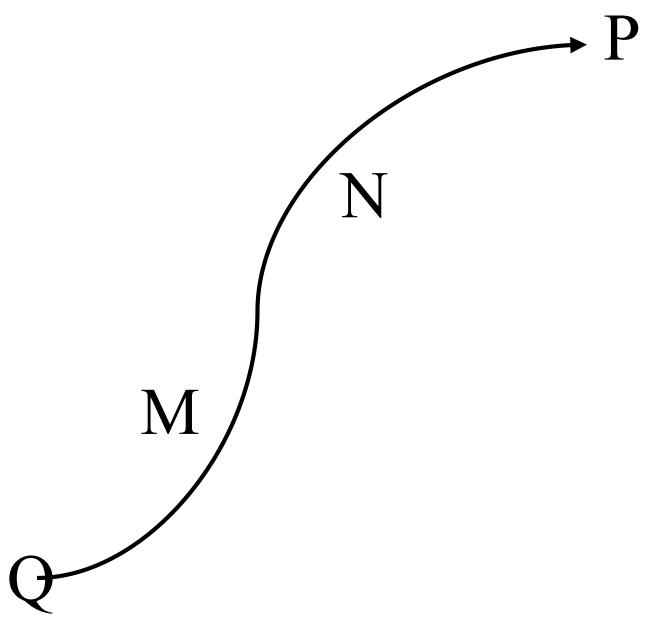

作业（1.2，1.4）：反射光束、折射光束的等光程性

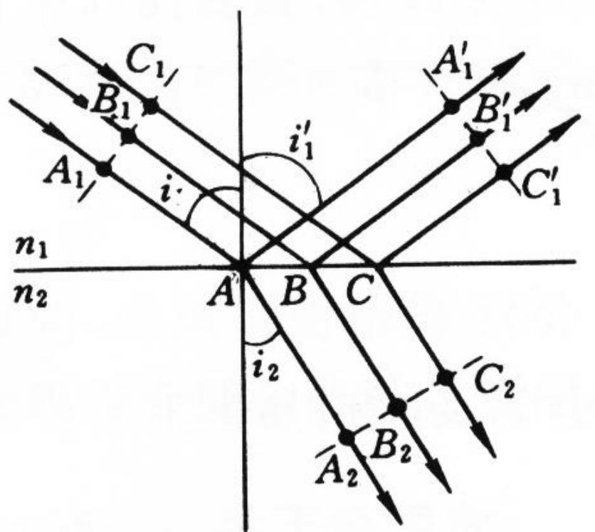

反射光束： $L ( \mathrm { A } _ { 1 } \mathrm { A A } ^ { \prime } _ { 1 } ) { = } L ( \mathrm { B } _ { 1 } \mathrm { B B } ^ { \prime } _ { 1 } ) { = } L ( \mathrm { C } _ { 1 } \mathrm { C C } ^ { \prime } _ { 1 } )$ 

折射光束： $L ( \mathrm { A } _ { 1 } \mathrm { A } \mathrm { A } _ { 2 } ) { = } L ( \mathrm { B } _ { 1 } \mathrm { B } \mathrm { B } _ { 2 } ) { = } L ( \mathrm { C } _ { 1 } \mathrm { C } \mathrm { C } _ { 2 } )$ 

反过来；等光程性可以推出折射定律和反射定律作业（1.4）：推导光程差

# 费马原理

光程的概念对几何光学的重要意义体现在费马原理中。几何光学的基础是前面所提到三个实验定律，费马却用光程的概念高度概括地把它们归结成一个统一的原理。

*原理表述

*数学表达

*导出反射定律、 折射定律

*费马原理与成像

*费马原理的评述

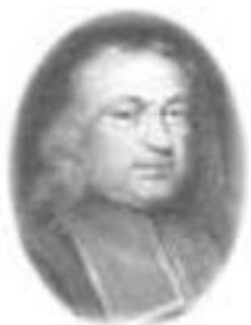

17世纪的一位法国数学家，提出了一个数学难题，使得后来的数学家一筹莫展，这个人就是费马(1601—1665)。

这道题是这样的：当n>2时， $\scriptstyle \mathbf { X } ^ { \mathrm { n + y } \mathrm { n = Z } ^ { \mathrm { n } } }$ 没有正整数解。在数学上这称为“费马大定理” 。为了获得它的一个肯定的或者否定的证明，历史上几次悬赏征求答案，一代又一代最优秀的数学家都曾研究过，但是300多年过去了，至今既未获得最终证明， 也未被推翻。即使用现代的电子计算机也只能证明：当n小于等于4100万时，费马大定理是正确的。由于当时费马声称他已解决了这个问题，但是他没有公布结果，于是留下数学难题中少有的千古之谜。

费马生于法国南部，在大学里学的是法律，以后以律师为职业，并被推举为议员。费马的业余时间全用来读书，哲学、文学、历史、法律样样都读。30岁时迷恋上数学，直到他64岁病逝，一生中有许多伟大的发现。不过，他极少公开发表论文、著作，主要通过与友人通信透露他的思想。在他死后，由儿子通过整理他的笔记和批注挖掘他的思想。好在费马有个“不动笔墨不读书”的习惯，凡是他读过的书，都有他的圈圈点点，勾勾画画，页边还有他的评论。他利用公务之余钻研数学，并且成果累累。后世数学家从他的诸多猜想和大胆创造中受益非浅，赞誉他为“业余数学家之王”。

费马对数学的贡献包括：与笛卡尔共同创立了解析几何；创造了作曲线切线的方法，被微积分发明人之一牛顿奉为微积分的思想先驱；通过提出有价值的猜想，指明了关于整数的理论—— 数论的发展方向。他还研究了掷骰子赌博的输赢规律，从而成为古典概率论的奠基人之一。 。

*表

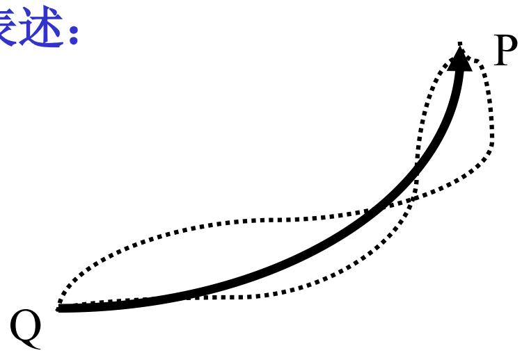

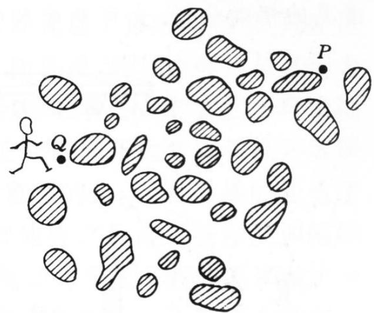

：光线沿光程为平稳值的路径而传播。

$$
L (Q P) = \int_ {Q} ^ {P} n (r) d s \quad \rightarrow \text {平 稳 值}
$$

平稳值的三种基本的含义：

极小值常见情况， 常数成像系统的物像关系

极大值个别现象

# *费马原理的数学表达式

路径积分：

$$
L (Q P) = \int_ {\stackrel {P} {Q} (l)} n (r) d s = L (l)
$$

是路径（l）的函数，平稳值要求变分为零，

$$
\delta \int_ {Q _ {(l)}} ^ {P} n (r) d s = 0, \text {或} \delta L (l) = 0
$$

# *费马原理与三个实验定律

1、光在均匀介质中直线传播

2、反射定律

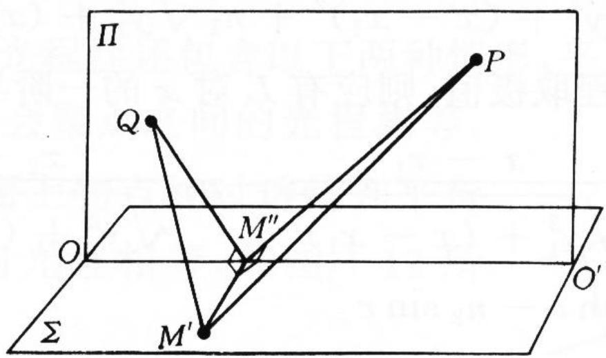

图1-8由费马原理推导反射定律步骤1

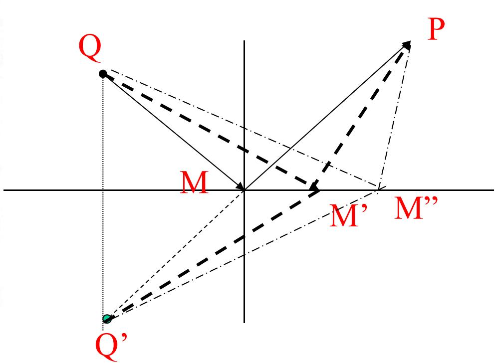

要点：反射光线在入射面，反射角等于入射角，光程最短。

3、折射定律

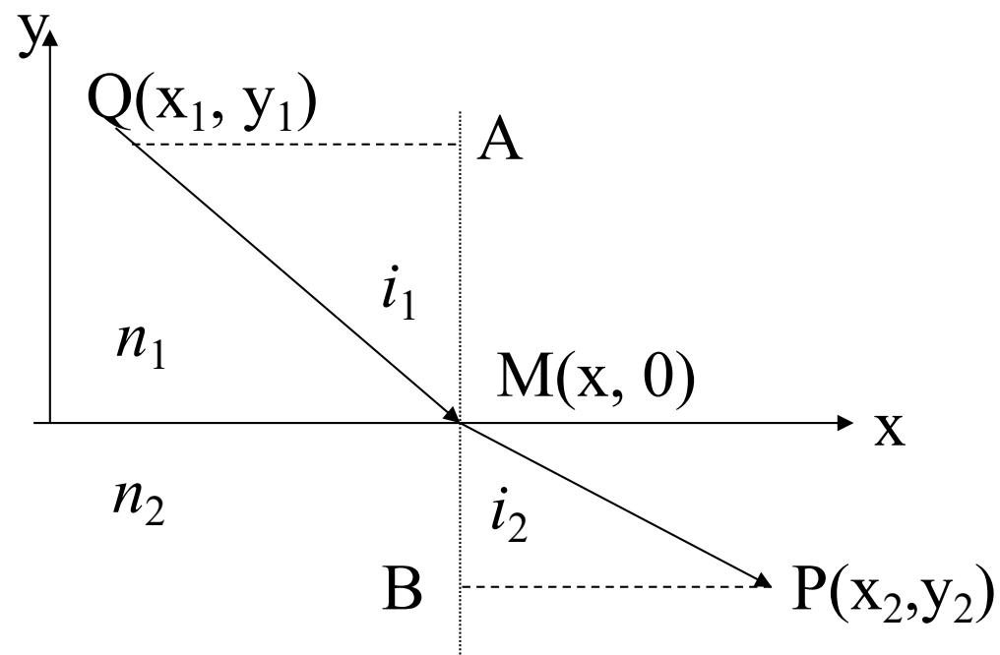

(1)折射光线在入射面内，方法和反射定律推导一样。

(2)入射角和折射角的关系；

QMP的光程：

$$
L = n _ {1} \overline {{Q M}} + n _ {2} \overline {{M P}} = n _ {1} \sqrt {y _ {1} ^ {2} + (x - x _ {1}) ^ {2}} + n _ {2} \sqrt {y _ {2} ^ {2} + (x _ {2} - x) ^ {2}}
$$

根据费马原理，L对x的一阶导数为零；

$$
\frac {d L}{d x} = n _ {1} \frac {x - x _ {1}}{\sqrt {y _ {1} ^ {2} + (x - x _ {1}) ^ {2}}} - n _ {2} \frac {x _ {2} - x}{\sqrt {y _ {2} ^ {2} + (x _ {2} - x) ^ {2}}} = 0
$$

$$
\frac {d L}{d x} = n _ {1} \frac {\overline {{Q A}}}{\overline {{Q M}}} - n _ {2} \frac {\overline {{P B}}}{\overline {{P M}}} = n _ {1} \sin i _ {1} - n _ {2} \sin i _ {2} = 0
$$

即

$$
n _ {1} \sin i _ {1} = n _ {2} \sin i _ {2}
$$

*费马原理与成像

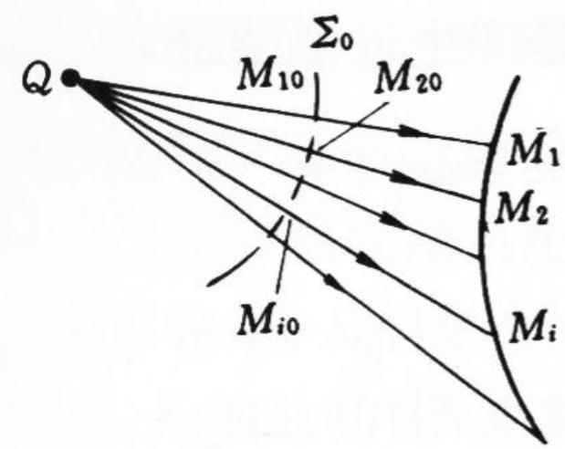

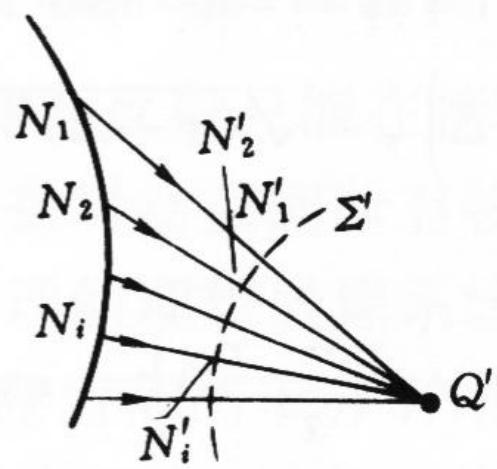

图1.17物像等光程性

$$
L (Q M _ {1} N _ {1} Q ^ {\prime}) = L (Q M _ {2} N _ {2} Q ^ {\prime}) = \dots = L (Q M _ {i} N _ {i} Q ^ {\prime})
$$

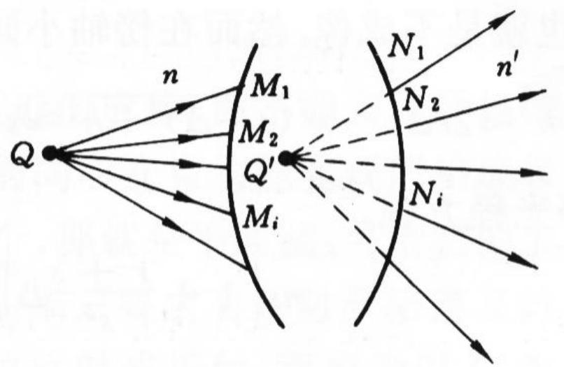

图1.18虚光程的计算

$$
\begin{array}{l} L (Q M _ {1} N _ {1}) - L (N _ {1} Q ^ {\prime}) = L (Q M _ {2} N _ {2}) - L (N _ {2} Q ^ {\prime}) = \dots \\ = L (Q M _ {i} N _ {i}) - L (N _ {i} Q ^ {\prime}) \\ \end{array}
$$

其中： $L ( N _ { i } { \cal Q } ^ { \prime } ) = n ^ { \prime } { \cdot } N _ { i } { \cal Q } ^ { \prime }$ 

等光程与成像：

严格等光程 $\Leftrightarrow$ 严格成像，近似等光程 近似成像，非等光程  不成像，

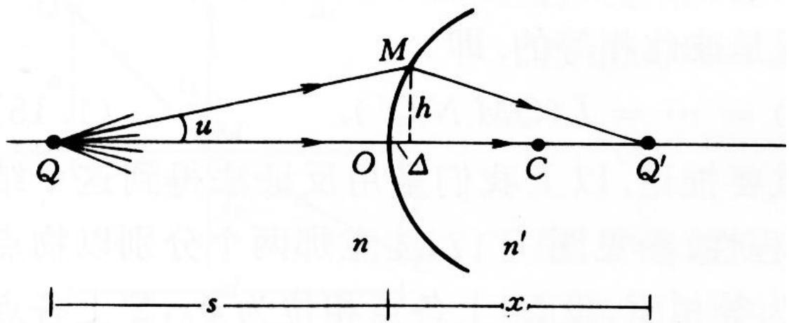

图1.19由物像等光程性导出球面折射傍轴成像

等光程： $L ( \cal { Q M Q ^ { \prime } } ) = L ( \cal { Q O Q ^ { \prime } } )$ 

$$
\begin{array}{l} L (Q M Q ^ {\prime}) = n \overline {{Q M}} + n ^ {\prime} \overline {{M Q ^ {\prime}}} \\ = n \sqrt {(s + \Delta) ^ {2} + h ^ {2}} + n ^ {\prime} \sqrt {(x - \Delta) ^ {2} + h ^ {2}} \\ \end{array}
$$

$$
L (Q O Q ^ {\prime}) = n s + n ^ {\prime} x
$$

傍轴条件：   s, r, x

$$
h ^ {2} \approx 2 r \Delta , \sqrt {(s + \Delta) ^ {2} + h ^ {2}} \approx s \left(1 + \frac {r + s}{s ^ {2}} \Delta\right), \sqrt {(x - \Delta) ^ {2} + h ^ {2}} \approx x \left(1 + \frac {x - r}{x ^ {2}} \Delta\right)
$$

代入等光程： ns $\scriptstyle \left( 1 + { \frac { r + s } { s ^ { 2 } } } \Delta \right) + n ^ { \prime } x \left( 1 + { \frac { x - r } { x ^ { 2 } } } \Delta \right) = n s$ n x  ' 

$$
n \frac {r + s}{s} \Delta = n ^ {\prime} \frac {r - x}{x} \Delta \Rightarrow n \frac {r + s}{s} = n ^ {\prime} \frac {r - x}{x}
$$

即：

$$
\frac {n}{s} + \frac {n ^ {\prime}}{x} = \frac {n ^ {\prime} - n}{r}
$$

s f  '，后焦距

$$
f ^ {\prime} = \frac {n ^ {\prime}}{n ^ {\prime} - n} r
$$

x f，前焦距

$$
f ^ {\prime} = \frac {n}{n ^ {\prime} - n} r
$$

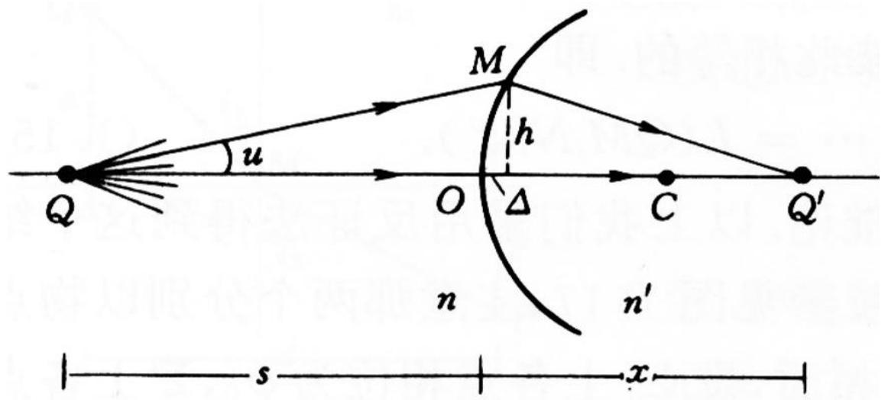

值得指出的两点：

1、单球面傍轴成像公式的获得没有使用折射定律，结果和利用折射定律所得结果一致。

2、傍轴条件：<<s, r, x

# *费马原理应用例题2—双曲透镜聚焦平行光

一宽平行光入射于一透镜，要求其透射光线严格聚焦于F点，试问应该是何形状？

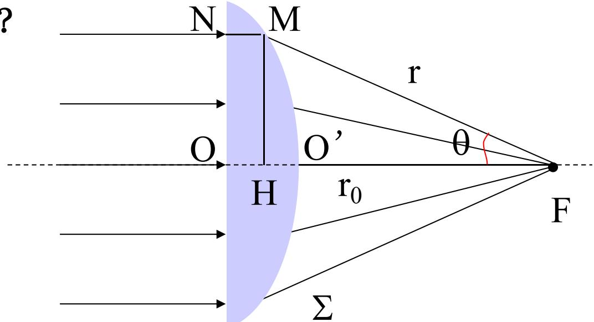

严格成像严格等光程

$$
L (N M F) = L \left(O O ^ {\prime} F\right)
$$

$$
n \cdot \overline {{N M}} + \overline {{M F}} = n \cdot \left(\overline {{O H}} + \overline {{H O ^ {\prime}}}\right) + \overline {{O ^ {\prime} F}}
$$

$$
\overline {{M F}} = n \cdot \overline {{H O ^ {\prime}}} + \overline {{O ^ {\prime} F}} \longleftrightarrow r (\theta) = n \cdot \left[ r (\theta) \cdot \cos \theta - r _ {0} \right] + r _ {0}
$$

解出：

$$
r (\theta) = \frac {(1 - n) r _ {0}}{1 - n \cos \theta} = \frac {n \left(\frac {1}{n} - 1\right) r _ {0}}{1 - n \cos \theta}
$$

是一条二次曲线，曲面是旋转双曲面。

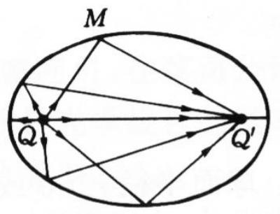

（a）旋转椭球面

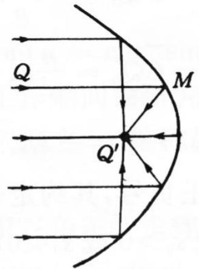

（b）旋转抛物面

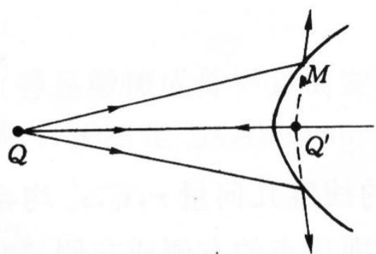

（c）旋转双曲面

图1.20反射等光程面

# *评述费马原理

费马原理的使用限度：

费马原理是几何光学的理论基础，几何光学使用限度也是费马原理的使用限度。

费马原理在物理学发展史上的贡献：

开创了以“路径积分，变分原理”表述物理规律的新思维方式。（理论力学—最小作用原理或哈密顿原理和费马原理有相同的数学表达式。）

# 小结：惠更斯原理，费马原理

作业：1.5

补充题： （1）证明：

$$
L \left(Q M _ {1} N _ {1}\right) - L \left(N _ {1} Q ^ {\prime}\right) = L \left(Q M _ {2} N _ {2}\right) - L \left(N _ {2} Q ^ {\prime}\right) = \dots = L \left(Q M _ {i} N _ {i}\right) - L \left(N _ {i} Q ^ {\prime}\right)
$$

其中： $L ( N _ { i } { \mathcal { Q } } ^ { \prime } ) = n ^ { ! } { \overline { { \cdot N _ { i } { \mathcal { Q } } ^ { \prime } } } }$ 

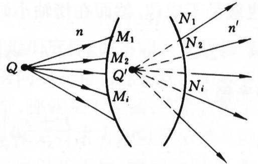

（2）如图所示，一宽平行光入射于一凸面镜，要求其反射光的延长线严格聚焦于F点，试问凸面镜的反射面应该是何形状？

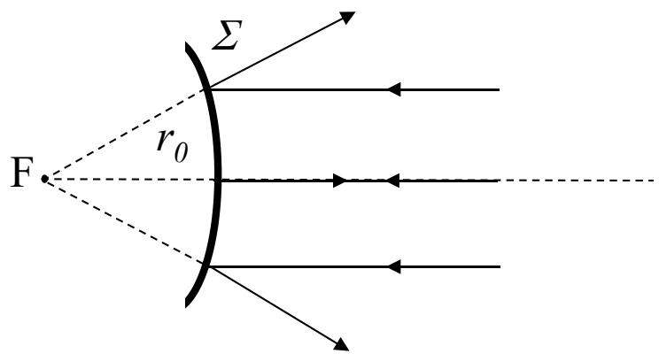

# 5. 变折射率光学

1. 自然变折射率 ---大气光学现象

◎寒冷海面上空---海市蜃楼

◎炽热地面上空---沙洲神泉

◎大气电离层(D 层)

◎“夜半钟声到客船”

2. 人工变折射率

◎抛物型

◎聚光纤维

◎微型透镜

3. 强光变折射率

◎非线性效应

◎自聚焦

# 4. 光线方程

● 特殊情形 ? ? ●普遍情形? ?

# 5. 实例

机场跑道可见距离

聚光纤维光线径迹

# 6. 费马原理几度大放异彩

18世纪的分析力学～

20世纪的量子力学～

● ‘路径积分’ 、‘泛函分析’‘变分原理”

从Fermat到Feynman（费因曼）

# 海市蜃楼

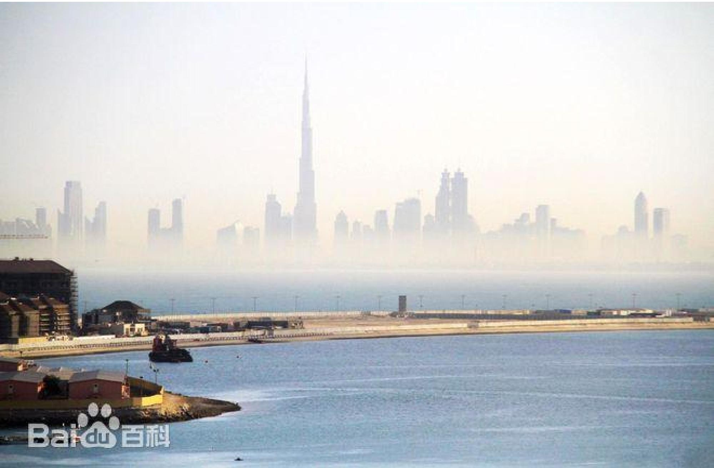

# 海市广楼的成因

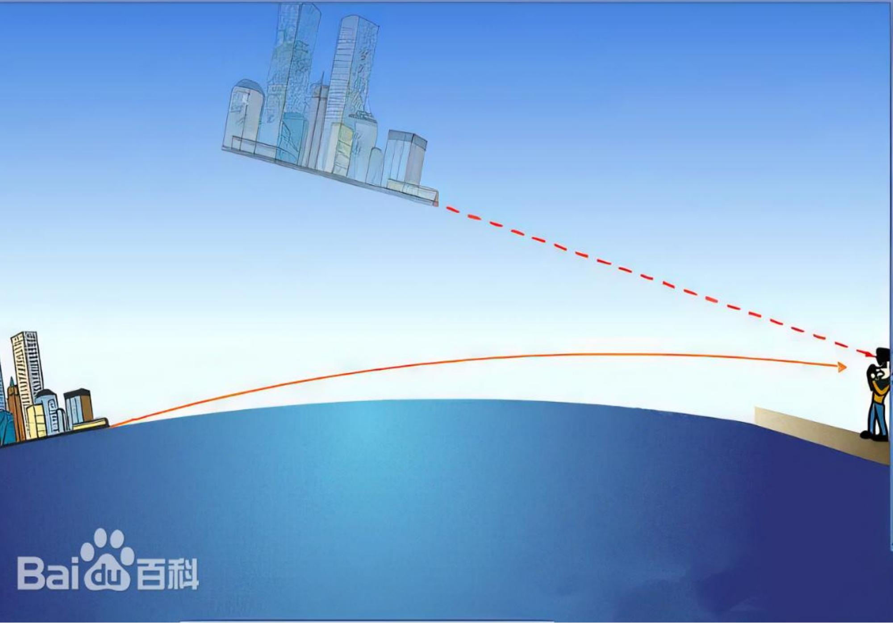

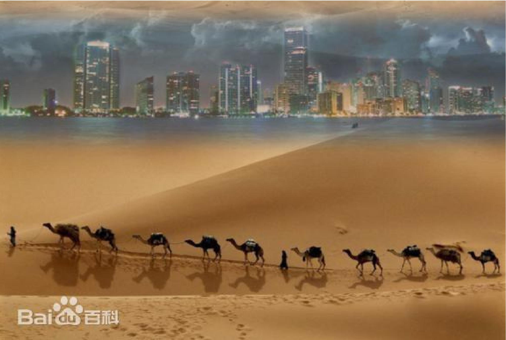

# 1.·寒冷海面上空 海市屋楼

高度y，有T，有n，

$$
n ^ {2} (y) = n _ {0} ^ {2} + n _ {p} ^ {2} e ^ {- \alpha y}
$$

典型数据

$$
n _ {0} \sim 1. 0 0 0 2 3 3,
$$

$$
n _ {0} \sim 0. 4 5 8 3 6, \alpha \sim 2. 3 0 3 / \mathrm {m}
$$

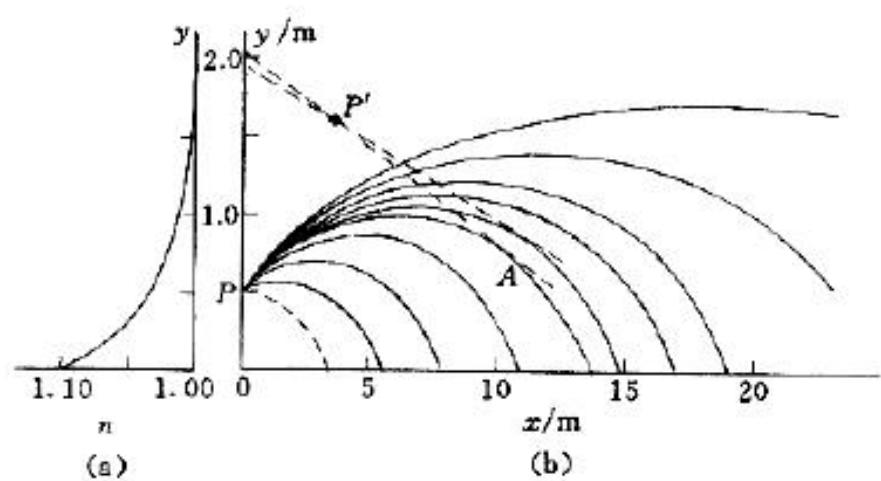

图1.21海市蜃楼现象的生成

靠近海面的空气由于海水温度较低，且水蒸汽潮湿，因而折射率较大，而上方的空气因受日照影响温度较高。海面上空空气层的折射率是由下而上随高度逐渐减小，由于气象要素变化的不连续性，导致光在空气中折射率变化也呈现不连续性，光线穿过折射率大的空气层顶时，在晴朗、无风或微风的气象条件下，则容易形成全反射，从而产生“海市蜃楼”的奇观。

# ·炽热地面上空 沙洲神泉

高度y，有T，有n，

$$
n ^ {2} (y) = n _ {0} ^ {2} + n _ {p} ^ {2} \left(1 - e ^ {- \alpha y}\right)
$$

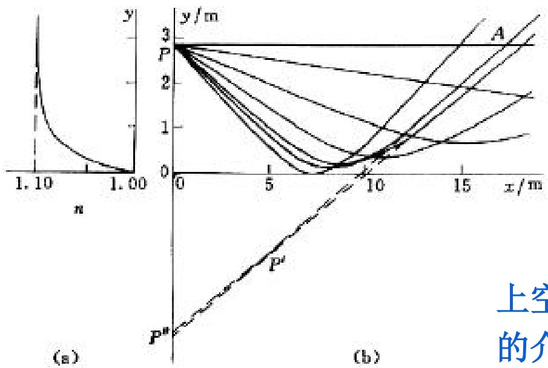

图1.22沙洲泉现象的生成

由于沙漠表面温度偏高，越往空温度越低，再因为光在温度高介质中折射率小，在温度低的介质中折射率大，光线由竖立着的物体发出从上空射向地面,并由于温度差异逐渐朝上偏转，造成人看过去上空和地下都有光进入眼睛，误以为远处地上有水在反射光线。

·大气电离层(D层)

$$
n ^ {2} (y) = n _ {0} ^ {2} - \alpha y ^ {2},
$$

当ay²<n²时，

有 $n ( \gamma ) \approx n _ { o } ( 1 - \frac { \alpha } { 2 { n _ { o } } ^ { 2 } } \gamma ^ { 2 } )$ ,抛物型，

被用于研究电磁波被电离层反射～。

理论上的根据：

介电常数与温度、浓度的关系

$$
\varepsilon (T, \rho)
$$

又温度分布T(y).

玻耳兹曼分布p(y)

得 $\varepsilon ( y ) \to n \approx { \sqrt { \varepsilon } } , n ( y )$ 函数。

对T，n的理解。

对“沿水平方向"的光线将继续弯曲的理解。孤立一根光线是不存在的，与光线相联系的是一光锥或光束，其小面积波前上，子波有不同速度。另一角度审视，沿水平方向直线行进的光线，不是“极值路径”，违背费马原理。

·大气中声线的变曲

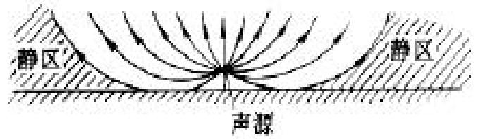

（a）白天

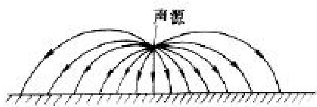

（b）夜间

图1.23白天和夜间的声线

姑苏城外寒山寺，夜半钟声到管船。（张继）

新秋松影下，半夜钟声后。（白居易）

秋水临水月，夜半隔山钟。(皇甫冉)

半夜、夜字、午夜 钟声、笛声、琴声.…

# 2.人工变折射率

·抛物型

·聚光纤维，单根传象

$$
n (r) = n _ {o} \left(1 - \frac {1}{2} \alpha r ^ {2}\right)
$$

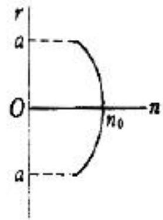

（a）

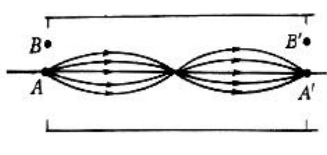

（b）

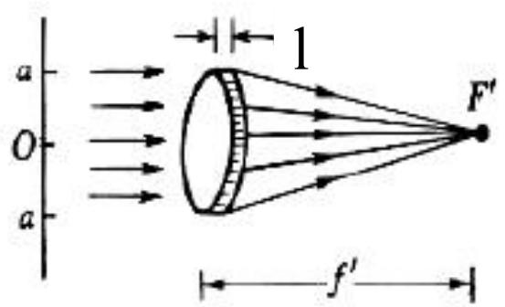

（c）

图1.25聚光纤维，(a)折射率变化，(b)聚光性能，(c)制成微透镜

·微透镜

$$
l \sim 1 0 ^ {2} \mu \mathrm {m} \text {量 级},
$$

制成

微透镜列阵

用于

集成光学中的光互连

薄片

$$
l \ll a,
$$

有焦距公式，

$$
f ^ {\prime} = \frac {1}{n _ {0} \alpha l}
$$

或

$$
f ^ {\prime} = \frac {a ^ {2}}{2 \left(n _ {0} - n _ {a}\right) l}
$$

其相对孔径

$$
\frac {D}{f ^ {\prime}} = 4 \left(n _ {0} - n _ {a}\right) \frac {l}{a}
$$

# 3.非线性效应n(l)

在强光条件下(10W/cm2)，显现！又当光束被限制于介质棒中传播时，发生衍射，其光强分布I(r)。于是有n(r)

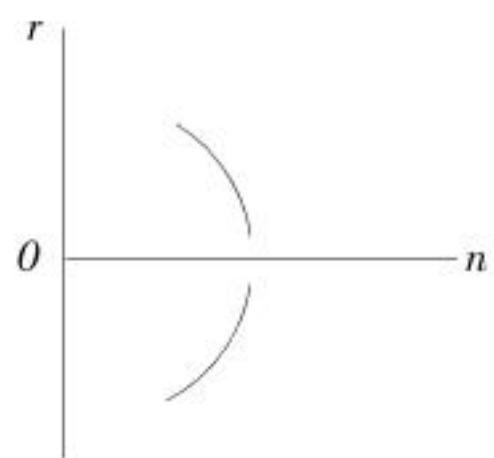

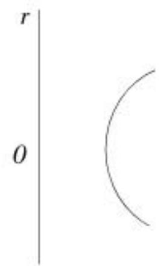

n

图1.26

类似于凸透镜；

“自聚焦”；

类似于凹透镜

“自散焦”

# 4.光线方程

·特殊n(y):

任意小弧元，微分线段ds，有 $( d s ) ^ { 2 } = ( d x ) ^ { 2 } + ( d y ) ^ { 2 } ,$ 

即 $( \frac { d y } { d x } ) ^ { 2 } = ( \frac { d s } { d x } ) ^ { 2 } - 1$ 

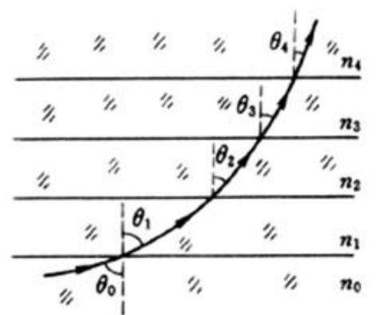

（a)

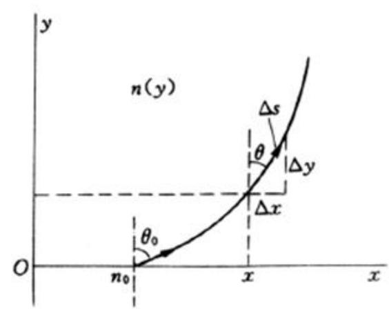

(b)

注意到 $\frac { d s } { d x } = \frac { 1 } { s i n \theta }$ ,和Snell定律，n(y)·sinθ(y)=nsinθ0,

有 $( \frac { d y } { d x } ) ^ { 2 } = \frac { n ^ { 2 } ( y ) } { \Gamma _ { n o } { } ^ { 2 } s i n ^ { 2 } \theta _ { o } } - 1 ~ ,$ 

由初条件 求解微分方程，得y(x)曲线函数。nsin,

光线方程的另一种形式 (对上式再求导一次而获得),

$: \frac { d ^ { 2 } y } { d x ^ { 2 } } = \frac { 1 } { 2 { n _ { o } } ^ { 2 } s i n ^ { 2 } \theta _ { o } } \cdot \frac { d n ^ { 2 } ( y ) } { d y } , \frac { \ d } { ( \longrightarrow | \widehat { y _ { \Gamma } } | }$ .dn(y），(二阶微分方程)dx

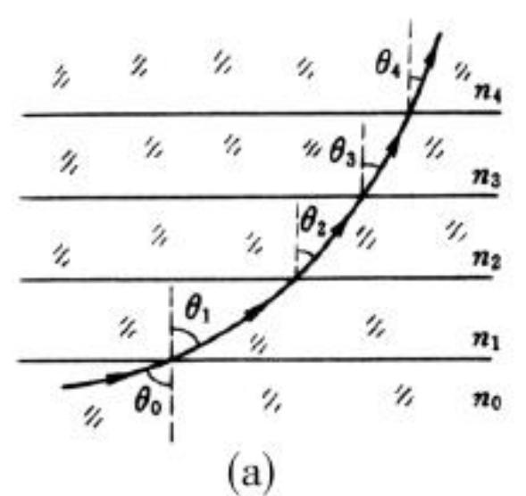

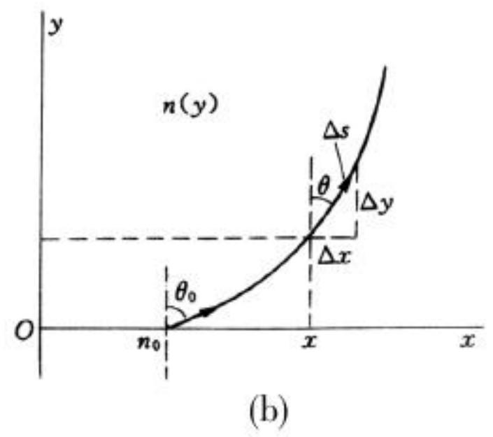

图1.27光线径迹，(a)折射率分层均匀 $, ( \mathrm { b } )$ 折射率连续变化

# 5.实例

·机场跑道可见距离

夏日，机场跑道，

地勤人员，能见到的最远的跑道(与观察者的距离)？

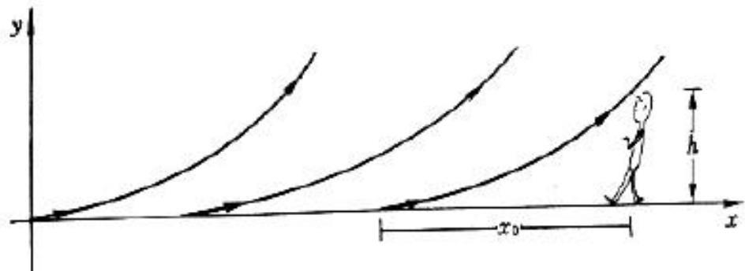

图1.30光线弯曲导致跑道可见距离受限

分析与计算：

跑道上方附近，温度梯度大，

导致空气折射率变化显著，

$$
\begin{array}{l} n (y) \approx n _ {0} (1 + \alpha y), \\ \alpha \approx 1.5 \times 10 ^ {- 6} l / m \\ \end{array}
$$

寻求光线径迹方程 考虑初始方向沿水平,即=

$$
\sin \theta = \frac {1}{\sqrt {1 + (\frac {d y}{d x}) ^ {2}}}
$$

(1） 

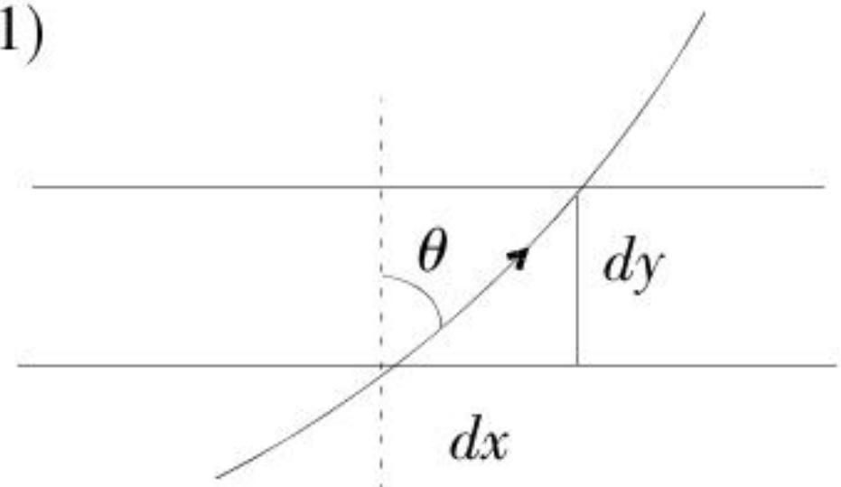

图1.31

将一组平行平板的折射定律形式推广到n连续变化的“分层介质”情形，

$$
n (y) \cdot \sin \theta (y) = n _ {0} \cdot \sin \theta_ {0}
$$

即 $n _ { o } ( 1 + \alpha y ) s i n \theta = n _ { o }$ (2)

由（1)、(2），得

=√2ay，这里取近似(1+ay）²≈1+2ay dx

解出 2 -x,

即光线径迹为一抛物线。

令y=h (人高),得最远距离

$$
\begin{array}{l} x _ {0} = \sqrt {\frac {2 h}{\alpha}} \\ = \sqrt {\frac {2 \times 1 . 7 m}{1 . 5 \times 1 0 ^ {- 6} / m}} \\ \approx 1. 5 \times 1 0 ^ {3} m \\ \end{array}
$$

气象知识：最好能见度可达10km.

上海浦东，新机场，跑道长2000m.

·求聚光纤维中光线径迹

$\frac { 4 } { \cup } \pm \frac { - } { \pi } \mathrm { i } \frac { . } { \Sigma } n ^ { 2 } ( y ) = n _ { o } ^ { 2 } ( 1 - \frac { 1 } { 2 } \alpha y ^ { 2 } ) ^ { 2 }$ 

$$
\approx n _ {0} ^ {2} \left(1 - \alpha y ^ {2}\right), (\text {忽 略} \alpha^ {2} y ^ {4} \text {项})
$$

于是 d(n2）=-2an²y $\frac { d ( n ^ { 2 } ) } { d y } = - 2 \alpha { n _ { o } } ^ { 2 } y$ 

有 $\frac { d ^ { 2 } y } { d x ^ { 2 } } = - \frac { \alpha } { \sin ^ { 2 } \theta _ { o } } y , - 3 \sharp \frac { } { \sin } \mathtt { l } \mathtt { l } \mathtt { l } \mathtt { l } \mathtt { l } \mathtt { l } \mathtt { k } \mathtt { j } \mathtt { k } \mathtt { j } \mathtt { k } \mathtt { \overline { { \mathtt { d } } } } \mathtt { j } \mathtt { \overline { { k } } } \mathtt { \overline { { \mathtt { d } } } }$ 方程

$$
\frac {d ^ {2} x}{d t ^ {2}} = - w _ {0} ^ {2} x!
$$

其解y（x）=AcosVa $\stackrel { \triangledown } { \boldsymbol { x } } = \boldsymbol { A } \cdot \cos ( \frac { \sqrt { \alpha } } { \sin \theta _ { o } } \boldsymbol { x } + \varphi _ { o } ) \stackrel { \triangledown } { \operatorname { \lrcorner } } \boldsymbol { \Psi } ( \boldsymbol { \cdot } \boldsymbol { \cdot } , ($ A,φ）由边条件yo，，,即光线的出发点与倾角来决定.人们关心其空间周期，

$$
L = 2 \pi \frac {\sin \theta_ {0}}{\sqrt {\alpha}} = 2 \pi \frac {\cos u _ {0}}{\sqrt {\alpha}} \propto \cos u _ {0},
$$

(在子午面内)

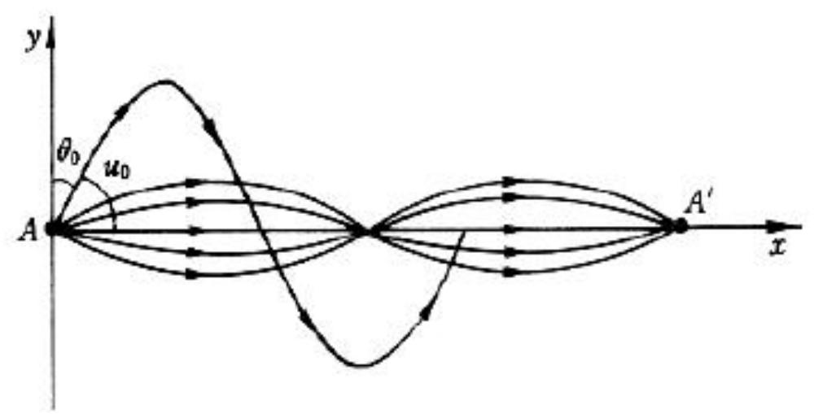

图1.32聚光纤维子午光线径迹为简谐曲线

傍轴u $_ { \rho } \leqslant 0 . 4 r a d , c o s u _ { o } \approx 1 , L \approx \frac { 2 \pi } { \sqrt { \alpha } }$ 