# 第七章 光的偏振 &光在晶体中的传播

# 第七章 光的偏振和光在晶体中的传播

1、 自然光和偏振光

2、 起偏器与检偏器、马吕斯定律

3、 双折射现象

4、 惠更斯作图

5、 波片和补偿器

6、 偏振光的干涉

7、 人为双折射

8、 旋光性

光波是横波。

将平面电磁波函数代入E=0和H=0，得到Ek和Hk，即电磁场振荡方向与波矢方向正交，在与波矢正交的横平面中振荡，即自由空间中光波为横波。

电场和磁场之间正交和同步。

$$
\mu \mu_ {0} \vec {H} = \frac {1}{\omega} \vec {k} \times \vec {E}
$$

可知： H E ， $\varphi _ { H } = \varphi _ { E } ,$ ， $\sqrt { \mu \mu _ { 0 } } H _ { 0 } = \sqrt { \varepsilon \varepsilon _ { 0 } } E _ { 0 }$ 

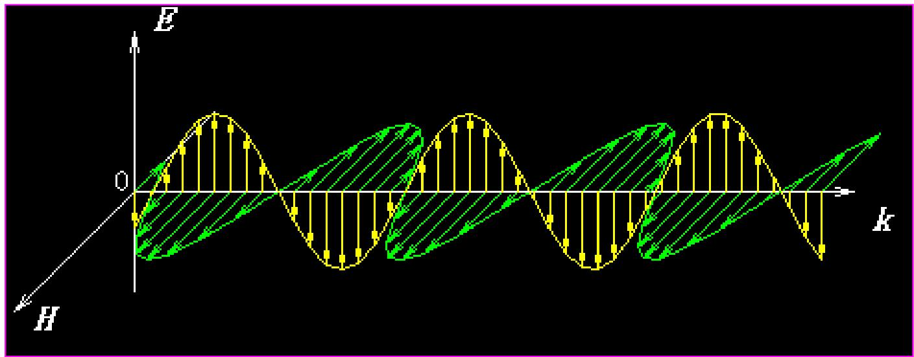

# 偏振态: 电场矢量在与光传播方向垂直的平面内的振动状态。

线偏振光

自然光

部分偏振光

椭圆偏振光

圆偏振光

# 线偏振光

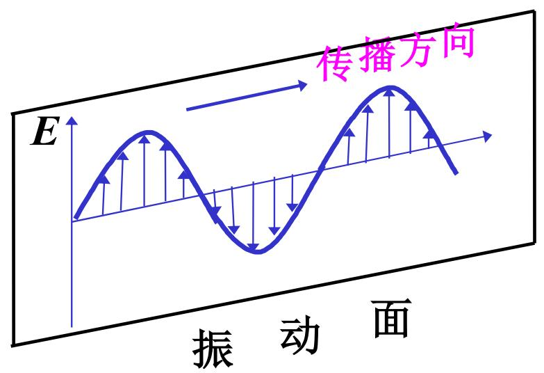

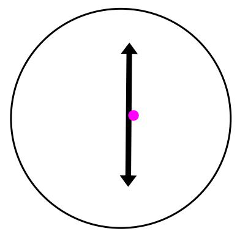

面对光的传播方向看

$$
\left\{ \begin{array}{l} E _ {x} = E _ {0 x} \cos (\omega t + \pi) \\ E _ {y} = E _ {0 y} \cos \omega t \end{array} \right. \left\{ \begin{array}{l} E _ {0 x} = E _ {0} \cos \alpha \\ E _ {0 y} = E _ {0} \sin \alpha \end{array} \right.
$$

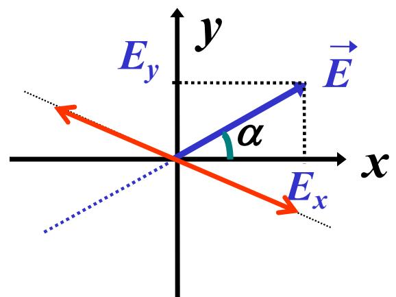

线偏振光可沿两个相互垂直的方向分解

线偏振光的表示法：

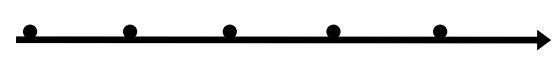

光振动垂直板面

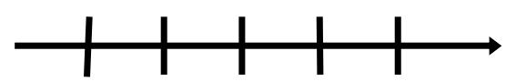

光振动平行板面

# 2.圆偏振光和椭圆偏振光

在垂直于光的传播方向的平面内，光矢量以一定的频率旋转。

圆偏振光： 矢量端点轨迹为圆

椭圆偏振光： 矢量端点轨迹为椭圆

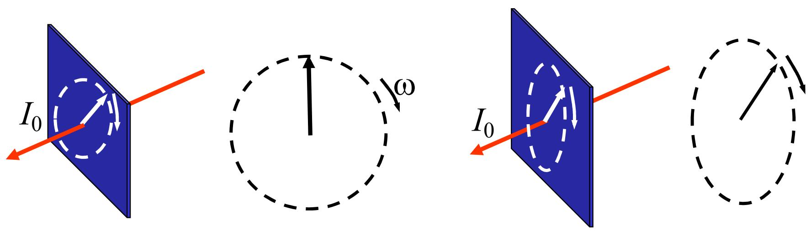

空间某一点的右旋圆和椭圆偏振光

同一时刻，空间不同点，圆偏振光电场方向的变化

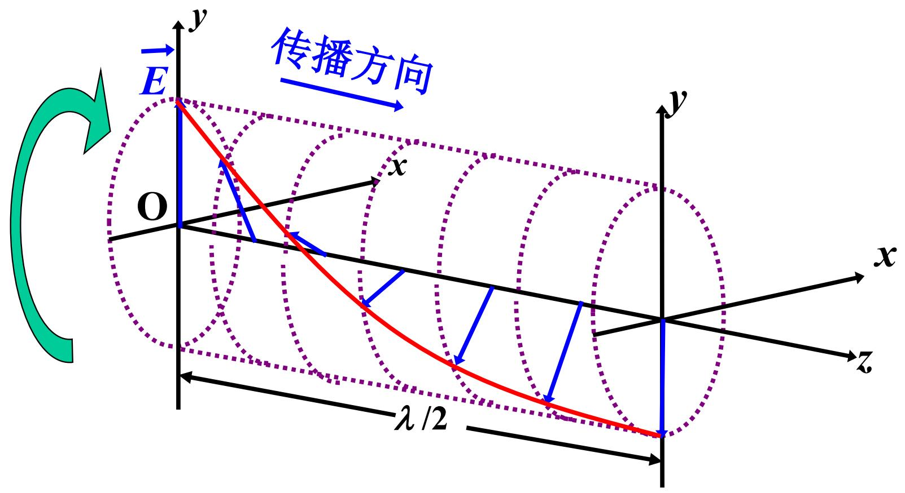

某时刻右旋圆偏振光E随z的变化

圆偏振光和椭圆偏振光可以看成是两个同频，振动方向相互垂直，并且有稳定的相位关系的线偏振光合成的结果。即任何一个圆偏振光和椭圆偏振光可以分解成两个同频，振动方向相互垂直，并且有稳定的相位关系的线偏振光。

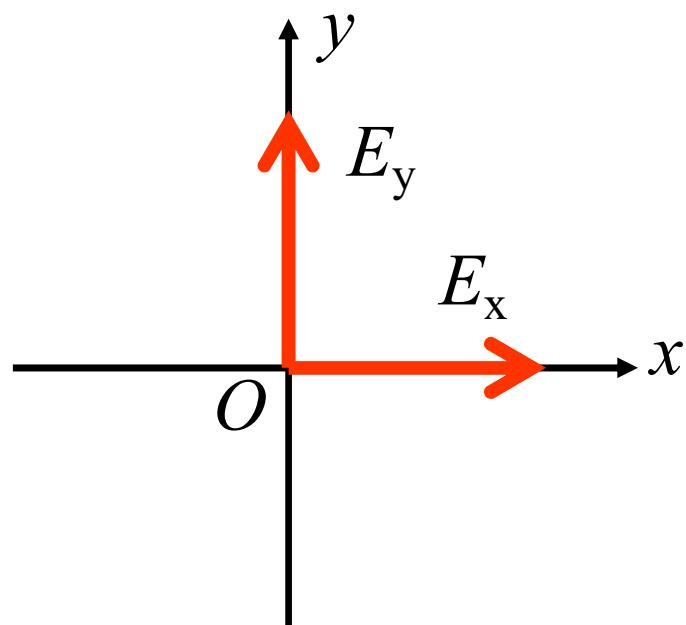

$$
\left\{ \begin{array}{l} E _ {x} = E _ {0 x} \cos \omega t \\ E _ {y} = E _ {0 y} \cos (\omega t + \Delta \varphi) \end{array} \right.
$$

E0xx  E0 yyE0  E0 

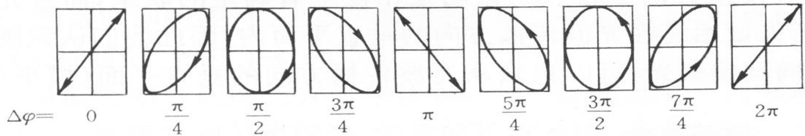

图4-5两个互相垂直的简谐振动合成椭圆振动

# 3 自然光

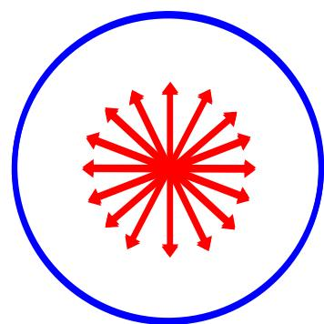

没有优势方向

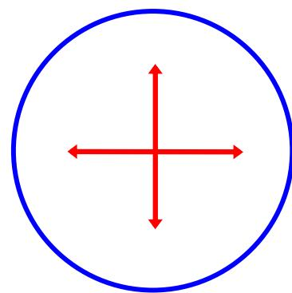

自然光的分解

一束自然光可分解为两束振动方向相互垂直的、等幅的、无固定相位关系的线偏振光。

$$
\left\{ \begin{array}{l l} E _ {x} = E _ {0 x} \cos \omega t \\ E _ {y} = E _ {0 y} \cos (\omega t + \Delta \varphi) \end{array} \right. \quad \Delta \varphi \text {随 机 变 化}
$$

$$
E _ {0 x} = E _ {0 y} \qquad I = I _ {x} + I _ {y} \qquad I _ {x} = I _ {y}
$$

自然光的表示法： · 

# 4. 部分偏振光

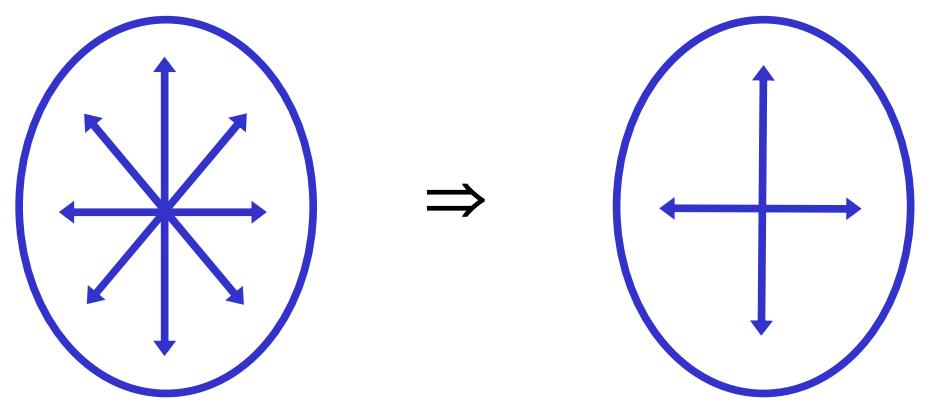

部分偏振光

部分偏振光的分解

部分偏振光可分解为两束振动方向相互垂直的、不等幅的、无固定相位关系线偏振光。

$$
\left\{ \begin{array}{l l} E _ {x} = E _ {0 x} \cos \omega t & \Delta \varphi \text {随 机 变 化} \\ E _ {y} = E _ {0 y} \cos (\omega t + \Delta \varphi) & \end{array} \right.
$$

$$
I = I _ {x} + I _ {y} \quad E _ {0 x} \neq E _ {0 y} \quad I _ {x} \neq I _ {y}
$$

部分偏振光的表示法：

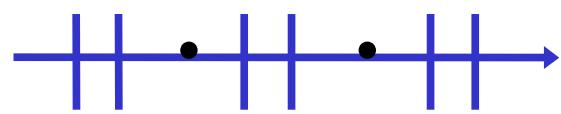

平行板面的光振动较强

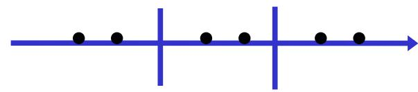

垂直板面的光振动较强

# 偏振度：

$$
P = \frac {I _ {\mathrm {m a x}} - I _ {\mathrm {m i n}}}{I _ {\mathrm {m a x}} + I _ {\mathrm {m i n}}}
$$

式中Imax和Imin分别是最大振幅和最小振幅对应的光强。

对于线偏振光， Imin=0， P=1。

对于自然光， Imax=Imin，P=0.

对于部分偏振光， 0<P<1

# 起偏器和检偏器 马吕斯定律

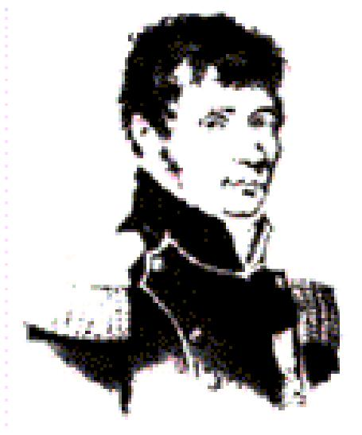

# 马吕斯 ( Etienne Louis Malus 1775-1812 )

法国物理学家及军事工程师。出生于巴黎，1796年毕业于

巴黎工艺学院，曾在工程兵部队中任职。1808年起在巴黎工艺学院工作。1810年被选为巴黎科学院院士，曾获得过伦敦皇家学会奖章。

马吕斯从事光学方面的研究。1808年发现反射时光的偏振，确定了偏振光强度变化的规律（现称为马吕斯定律）。他研究了光在晶体中的双折射现象，1811年，他与J.毕奥各自独立地发现折射时光的偏振，提出了确定晶体光轴的方法，研制成一系列偏振仪器。

# 偏振片 （Polaroid）

是获得线偏振光的平面片状器件，通常用P表示。

1928年一位19岁的美国大学生 （E.H.Land）发明的。

起偏的原理：利用某种光学的不对称性, 如物质的二向色性，散射，反射和折射，双折射….

两向色性的有机晶体，如硫酸碘奎宁、 电气石或聚乙烯醇薄膜在碘溶液中浸泡后，在高温下拉伸、烘干，然后粘在两个玻璃片之间就形成了偏振片。它有一个特定的方向，只让平行与该方向的振动通过。

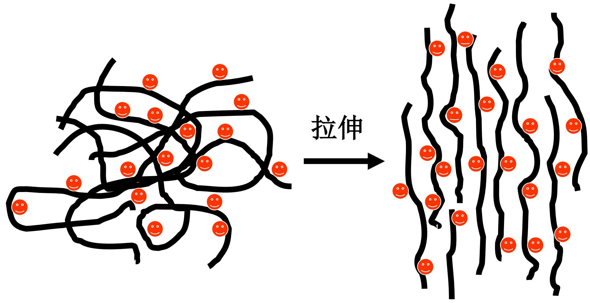

将聚合物薄膜在碘溶液中浸泡后，在高温下拉伸、烘干，然后粘在透明衬底上就形成了偏振片。

电子受体分子附着于聚合物链上，发生电荷转移，改善聚合物链的导电性。本为无序排列的聚合物薄膜，拉伸使其排列有了方向性，形成导电线栅。

# 起偏原理类似于导电线栅的作用

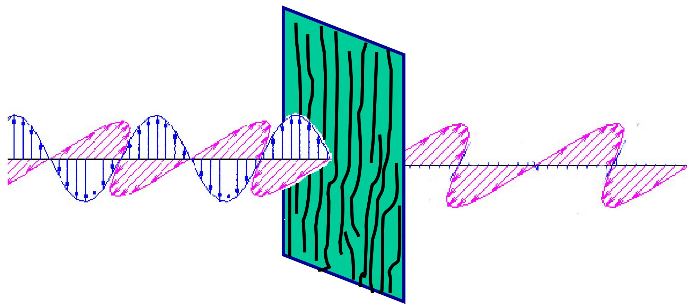

理想偏振片,自然光入射：

出射光强2

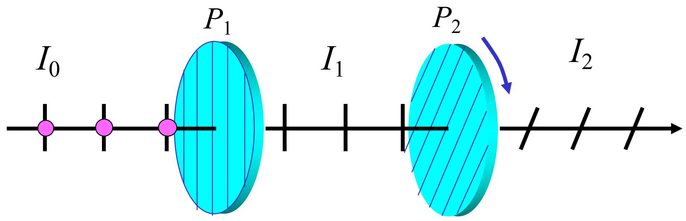

起偏器

检偏器

起偏器：自然光通过偏振片后变为线偏振光

检偏器：利用偏振片检验光线的偏振化程度

检偏器旋转一周，光强两亮两暗

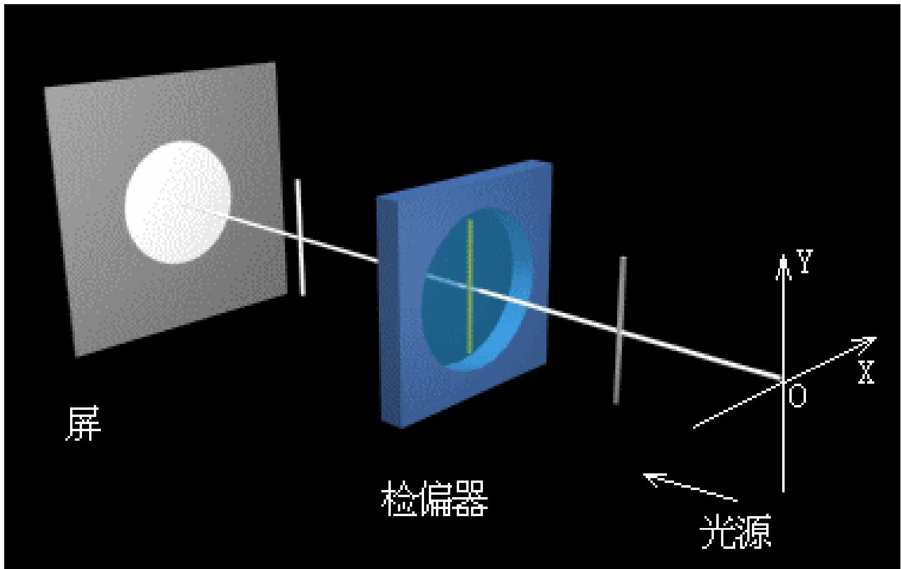

# 在自然光和圆偏振光的光路中插入检偏器，检偏器旋转一周

在光路中插入检偏器，屏上光强减半。检偏器旋转，屏上亮暗无变化。

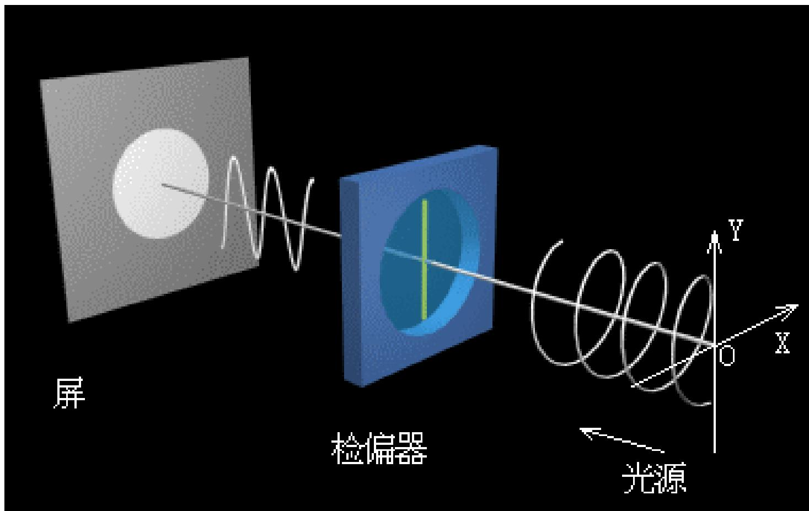

检偏器旋转一周，屏上光强两强两弱。

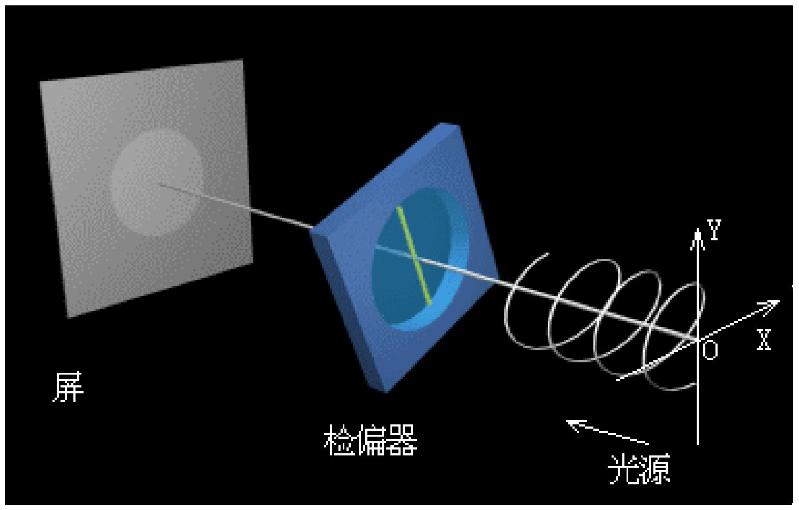

根据上面的实验，利用偏振片可以区分出线偏振光，但是无法区分自然光和圆偏振光，也无法区分是部分偏振光还是椭圆偏振光，关于自然光和圆偏振光、部分偏振光和椭圆偏振光的区分，以后讲解。

# 马吕斯定律

线偏振光经过偏振片前后的光强关系

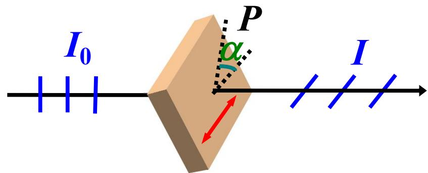

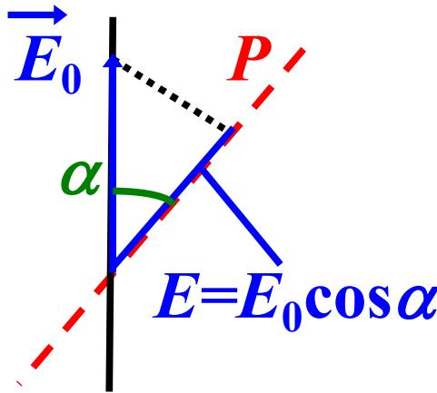

$$
I _ {0} \propto E _ {0} ^ {2}, I \propto E ^ {2} = E _ {0} ^ {2} \cos^ {2} \alpha
$$

$$
I = I _ {0} \cos^ {2} \alpha
$$

$$
\alpha = 0, \quad I = I _ {\max } = I _ {0}
$$

$$
\alpha = \frac {\pi}{2}, I = 0 \quad — — \text {消 光}
$$

例题：有三个偏振片堆叠在一起，第一块与第三块的偏振片化方向相互垂直，第二块和第一块的偏振化方向相互平行，然后第二块偏振片以恒定的角速度  绕光传播的方向旋转，设入射自然光的光强为 I0。

求：出射光的光强随时间的变化关系。

0II 解 ： 2c o s )c o s (2 t

$$
= \frac {I _ {0} \cos^ {2} \omega t \sin^ {2} \omega t}{2} = \frac {I _ {0} \sin^ {2} 2 \omega t}{8}
$$

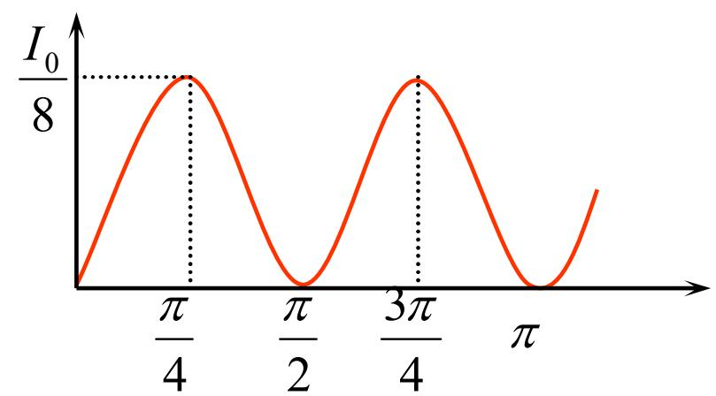

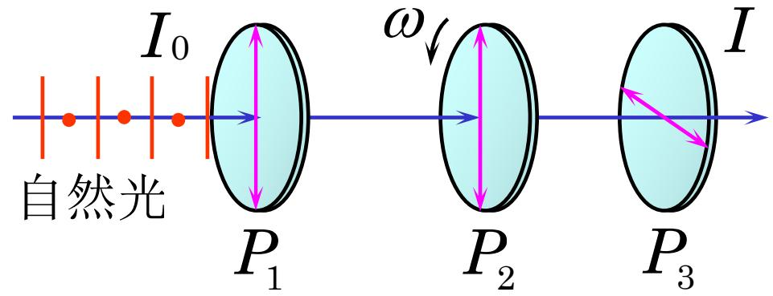

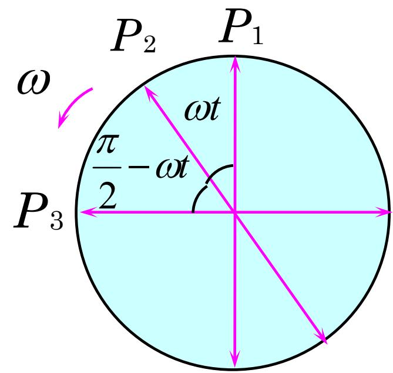

# 三、反射光、折射光和散射光的偏振

自然光在两种各向同性介质分界面上反射、折射时，反自然光在两种各向同性介质分界面上反射、折射时，反射光和折射光的偏振态？？射光和折射光都是部分偏振光。反射光中垂直振动(S)多于平行振动(P)，折射光中平行振动(P)多于垂直振动(S)。

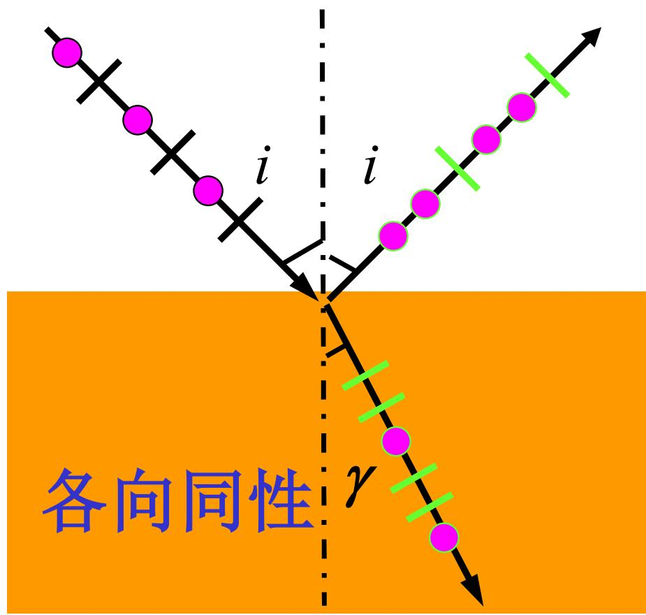

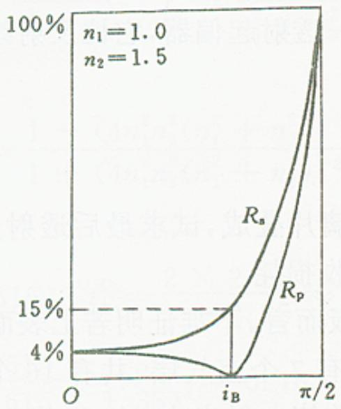

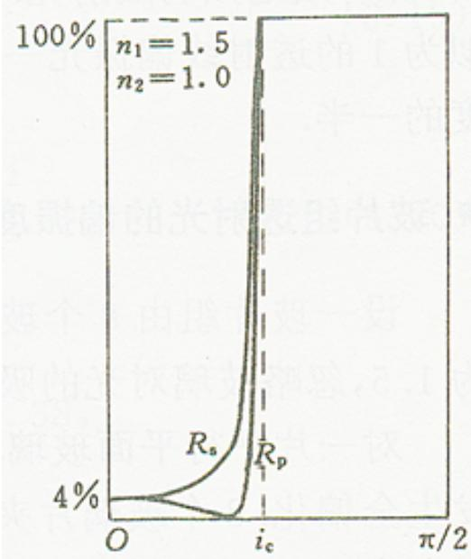

当入射角满足关系式

$$
\tan i _ {B} = \frac {n _ {2}}{n _ {1}}
$$

时，反射光为振动垂直于入射面的线偏振光，该式称为布儒斯特定律， 为起偏振角或布儒斯特角。此时折射光偏振化的iB强度最强，但它不是完全偏振光。

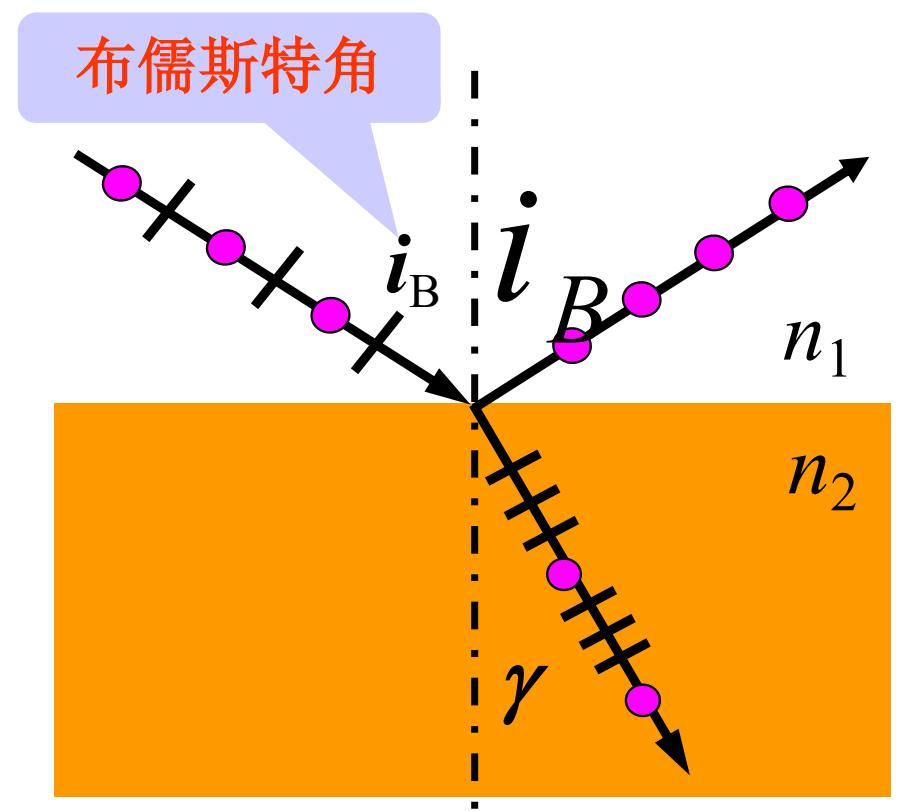

问题：当光线以起偏振角入射时，反射光和折射光的传播方向互相垂直，即： $i _ { \mathrm { B } } { + } \gamma { = } 9 0 ^ { \mathrm { o } }$ 。

反射光的偏振态和入射光的偏振态、入射角和介质的折射率有关。

举一特例----自然光入射（光疏到光密）

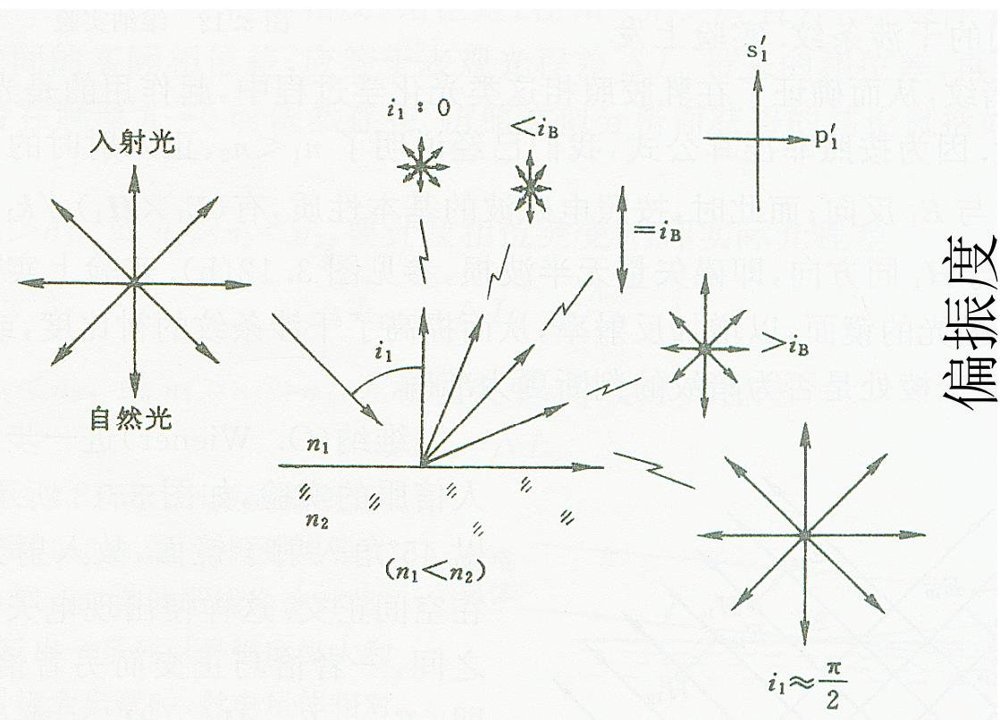

图3.14自然光入射时反射光偏振态变化图像

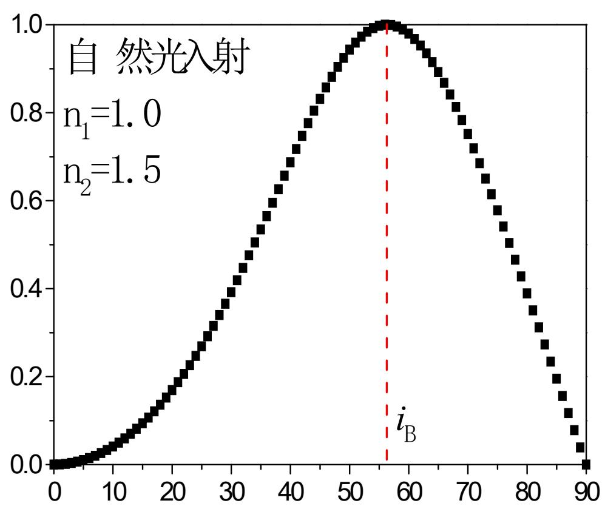

入射角(度)

# 玻片组透射光的偏振度

利用p光和s光的光强反射率，使用玻片组可以或得比较高偏振度的偏振光.

(1) $i = i _ { \mathrm { B } }$ 时,反射光为线偏振光,而折射光仍然是部分偏振光,但偏振化程度最高

(2) 反射光光强较弱，折射光较强

(3) 让自然光通过玻璃片堆,可使折射光的偏振化程度增加.玻璃片足够多时,可使折射光为完全偏振光.

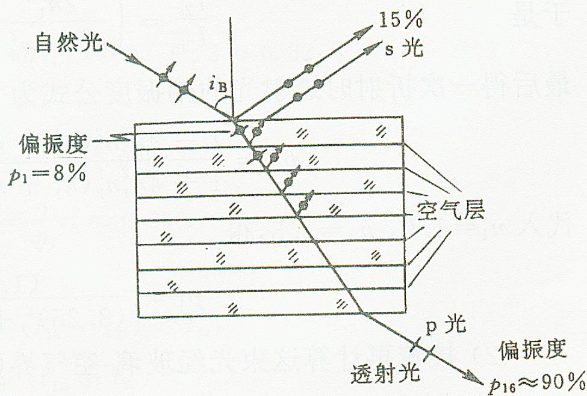

图3.5一玻片组成为透射起偏器

外腔式激光管加装布儒斯特窗.

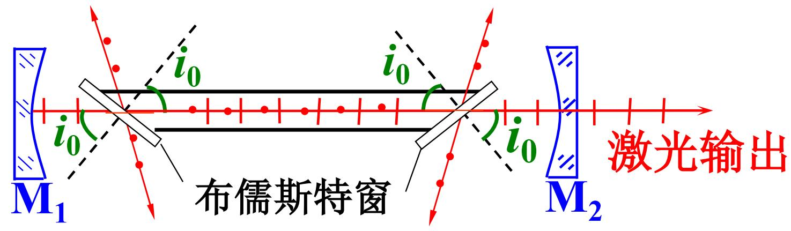

# 在拍摄玻璃窗内的物体时，去掉反射光的干扰

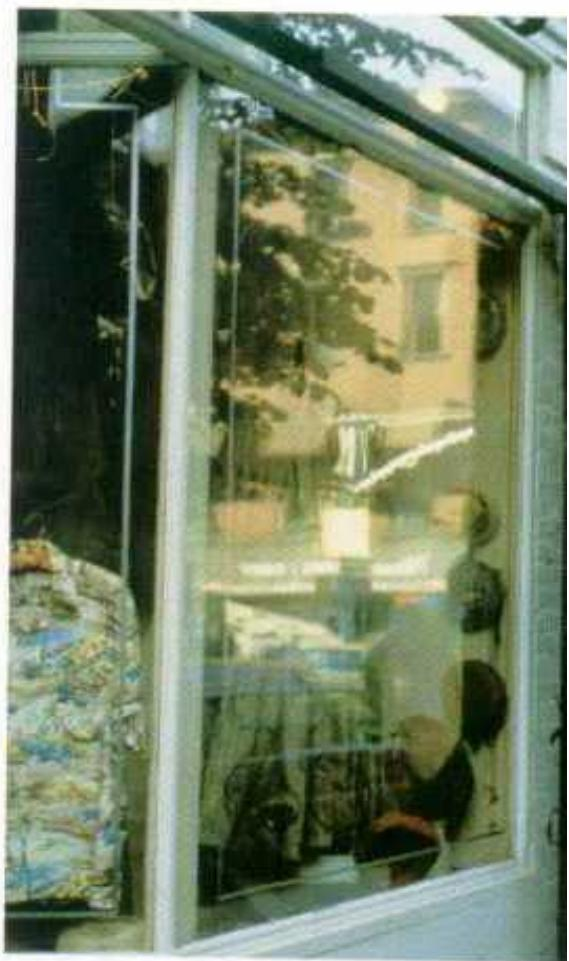

未装偏振片

装偏振片

# 晶体光学— 双折射现象

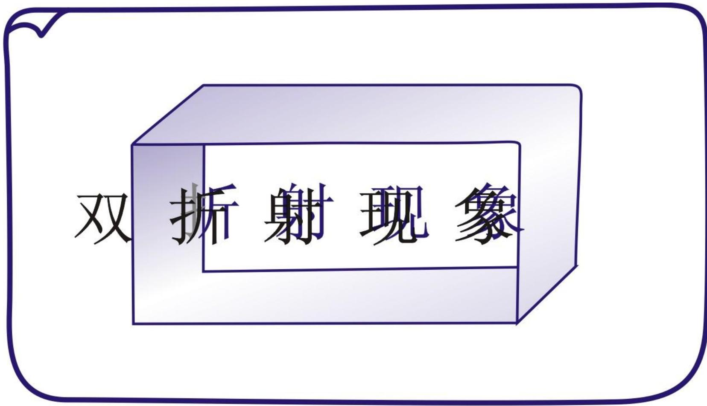

# 晶体简介

外形有一定规则性或对称性，

内部 原子排列 有序、周期性,

规则有序结构 导致物理性质的各向异性

-热传导的各向异性，

电导、极化、磁化的各向异性，

光速的各向异性，

光在晶体中的传播

光在各向异性介质中的传播。

*《固体物理》、<晶格几何理论>表明：

7种品系 -14种晶格、32种点群，

单轴晶体：三角晶系，四角晶系，六角晶系，如冰洲石CaCO3 一方解石之一种，红宝石、石英、……

双轴晶体：单斜晶系，三斜晶系，正交晶系，如 蓝宝石、云母、·…

立方晶系 各向同性介质，如食盐 NaCl晶粒。

<table><tr><td>光学性质</td><td>晶系</td><td>布拉斐格子</td><td>晶体</td></tr><tr><td rowspan="3">第一类:各向同性</td><td rowspan="3">立方</td><td>简单立方</td><td rowspan="3">食盐NaCl</td></tr><tr><td>体心立方</td></tr><tr><td>面心立方</td></tr><tr><td rowspan="4">第二类:单轴晶体</td><td>三角晶系</td><td>三角</td><td>方解石、红宝石、</td></tr><tr><td>六角晶系</td><td>六角</td><td>石英、冰</td></tr><tr><td rowspan="2">四方晶系</td><td>简单四方</td><td></td></tr><tr><td>体心四方</td><td></td></tr></table>

<table><tr><td rowspan="7">第三类:双轴晶体</td><td>三斜晶系</td><td>简单三斜</td><td>α
β
γ</td><td>蓝宝石、云母、正方铅矿、</td></tr><tr><td rowspan="2">单斜晶系</td><td>简单单斜</td><td>α
β
c
a</td><td>硬石膏</td></tr><tr><td>底心单斜</td><td>α
β
c
b
a</td><td></td></tr><tr><td rowspan="4">正交晶系</td><td>简单正交</td><td>α
c
b
a</td><td></td></tr><tr><td>底心正交</td><td>α
c
b
a</td><td></td></tr><tr><td>体心正交</td><td>α
c
b
a</td><td></td></tr><tr><td>面心正交</td><td>α
c
b
a</td><td></td></tr></table>

光轴：光线在晶体中沿某一方向传播时不发生双折射现象，这一方向称为晶体的光轴.

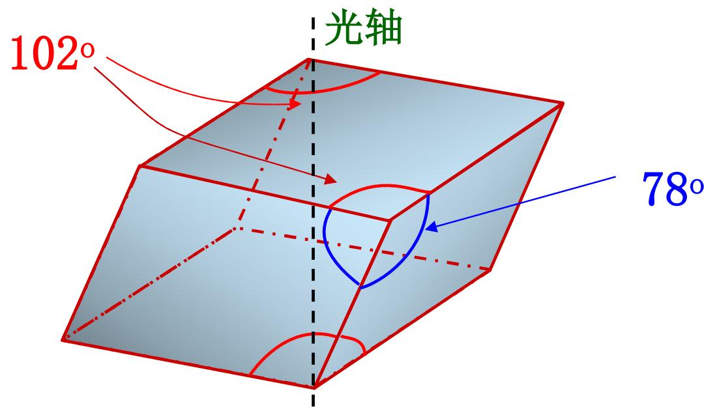

天然方解石晶体是一六面棱体,每一面都是菱形,大角约为102o, 小角约为78o. 六面体中有两个相对的分别由三个钝角围成的顶角, 连接这两个顶角, 与连线平行的方向既是方解石光轴的方向.

单轴晶体：只有一个光轴(如方解石、石英)的晶体

双轴晶体：有两个光轴(如云母、硫磺)的晶体

# 双折射光的偏振特点

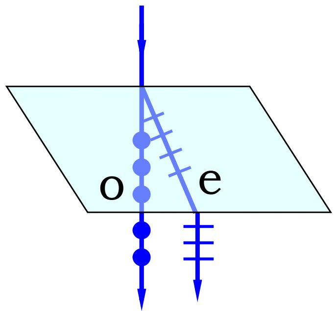

o光（Ordinary Light, 寻常光） 遵守折射定律

e光（Extra-ordinary light 非常光） 不遵守折射定律

所谓o光和e光，只在双折射晶体的内部才有意义，射出晶体以后，就无所谓o光和e光了。

用检偏器来考察从晶体射出的两光束时，就会发现它们都是线偏振光。

宝石和双折射：从不同的方向看双折射的宝石，有机会看到不同深浅的颜色，甚至不同颜色。切磨专家在选择宝石的「台面方向」时，要顾及其不同的色泽，选择颜色最美丽的方向作为台面。

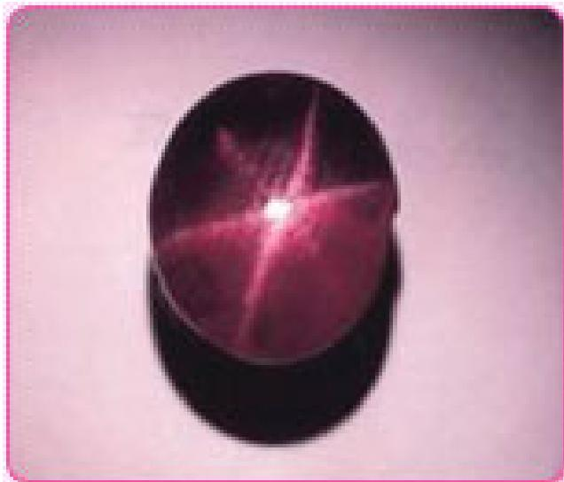

# 红宝石（含铬或铁)

化学成分:

${ \mathrm { A L } } _ { 2 } { \mathrm { O } } _ { 3 }$ ，三氧化二铝

结晶晶系:

三方晶系

晶体形状:

六方双锥和菱面体加六方柱

物理性质:

摩氏硬度计9:级（仅次于钻石）

比重:

4.00左右

折射率:

1.762 - 1.770 

双折射率:

0.008 

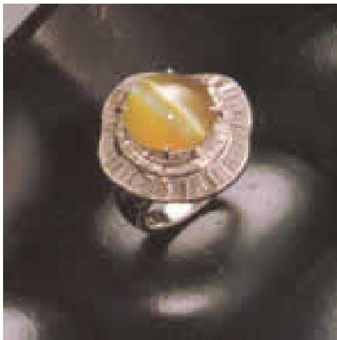

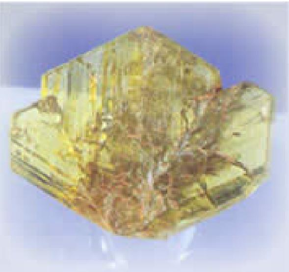

# 猫眼石

化学成份：

氧化铝铍(Beryllium Aluminate, ${ \mathrm { B e A l } } _ { 2 } { \mathrm { O } } _ { 4 ) }$ 

晶系：

多是Orthorhombic Twin 晶系；

三个晶系孪生，产生一种六方对称的外貌

硬度：

8.5 (仅次于红、蓝宝)

比重：

3.71 

透明度：

高至不透明

折射率：

1.74 至 1.75

双折射：

0.009 

# 寻常光（o光） .

(1) 是振动面垂直与自己的主平面的线偏振光;

(2) 符合折射定律和反射定律;

(3) 沿各个方向折射率相同 $( n _ { \mathrm { o } } )$ , 传播速度相同.

# 非常光(e光):

(1)是振动面平行于自己的主平面的线偏振光;

(2)一般不符合折射定律,在垂直于光轴的方向传播时符合折射定律.

(3)沿不同的方向折射率不同, 传播速度不同.沿光轴的方向折射率为 $\scriptstyle { \boldsymbol { { \mathit { \Pi } } } } { \boldsymbol { { \mathit { 1 } } } } _ { 0 }$ 与o光相同.沿垂直于光轴的方向的折射率称为 $\textstyle { \boldsymbol { \mathcal { n } } } _ { \mathrm { e } }$ . $\scriptstyle { \boldsymbol { { \mathit { \Pi } } } } { \boldsymbol { { \mathit { 1 } } } } _ { 0 }$ 和 $\textstyle { \boldsymbol { \it { \Pi } } } { \boldsymbol { \it { \Pi } } } _ { \mathrm { { e } } }$ 成为晶体的主折射率。

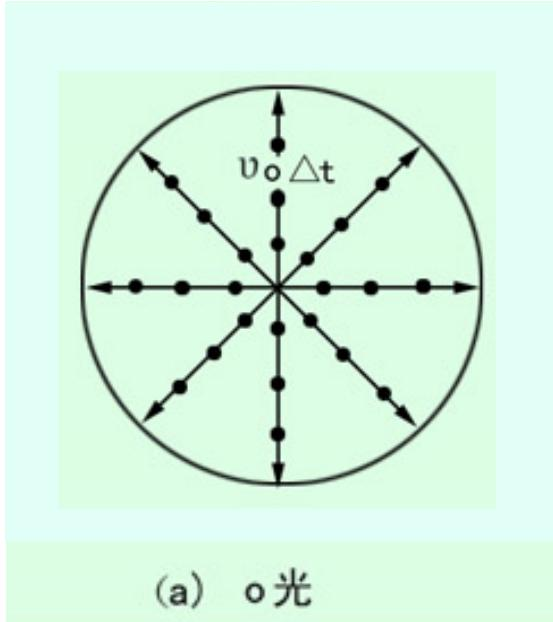

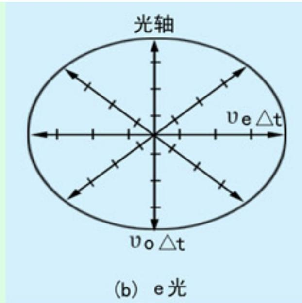

图1-5单轴晶体中的波面

主截面：光轴和晶体表面光入射点的法线组成的平面。

主平面：晶体中光（o光或e光）的传播方向与晶体光轴构成的平面。

o光的振动方向垂直于o光的主平面；

e光的振动方向平行于e光的主平面。

当o光和e光的主平面相互平行时,两光的振动互相垂直

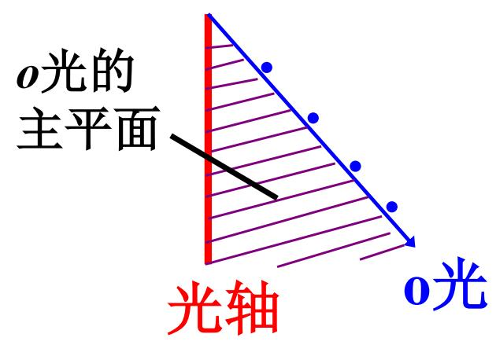

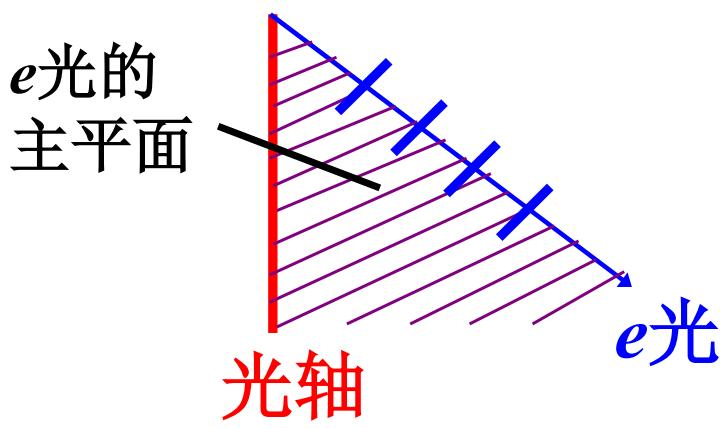

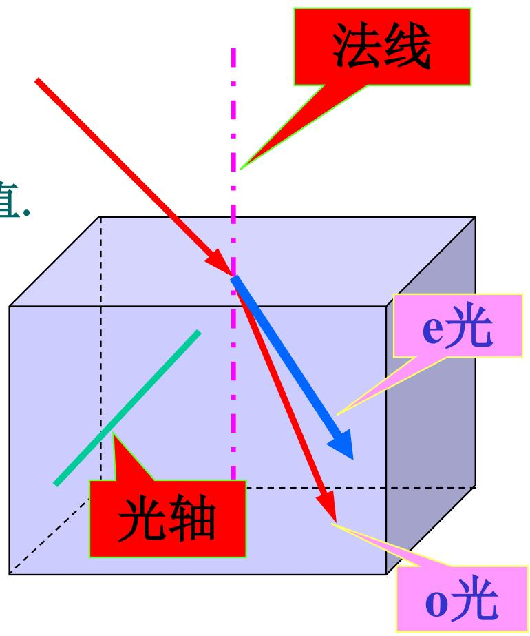

说明：当入射面和主截面重合一致时，e光的偏折依然在入射面内；当入射面和主截面不一致时，则e光射线就可能不在入射面内。o光的偏折总在入射面内。

晶体可分为正晶和负晶.

$ { n _ { \mathrm { e } } } <  { n _ { \mathrm { o } } }$ 的晶体, 叫做负晶体. 如方解石.

Ø $\mathrm { \Delta } n _ { \mathrm { e } } { > } n _ { \mathrm { o } }$ 的晶体, 叫做正晶体. 如石英.

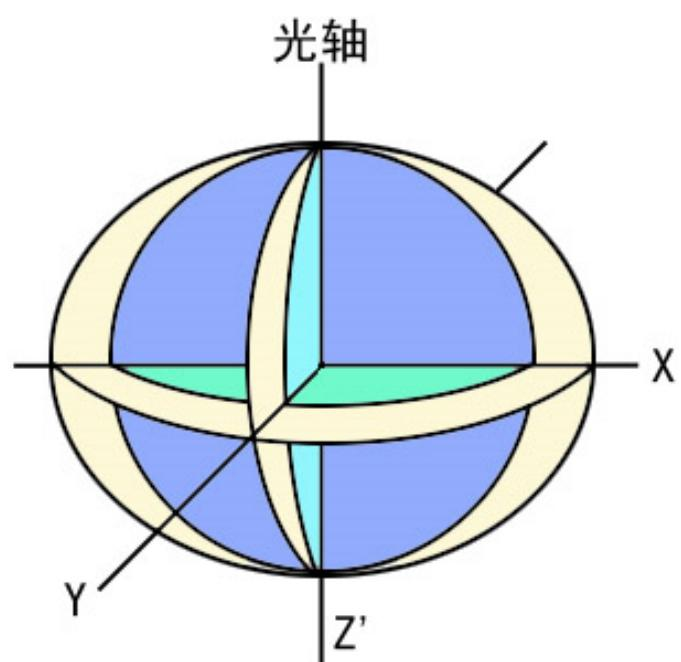

(a)负晶体

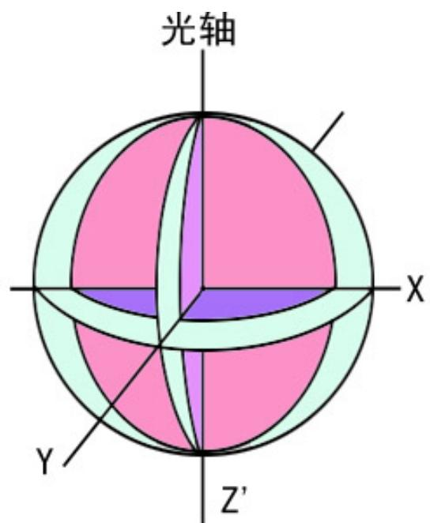

(b)正晶体

# 光在晶体中波面

O-xyz是方解石晶体内的三维坐标, $\mathtt { t } = 0$ 时刻自原点发出的光振动, 在t=t时刻, o光振动传到以v0t为半径的球面上. 因此 ,o光的波面图是球面. e光波面图是长轴为vet, 短轴为vot, 在光轴方向上外切球面的椭球面.

负晶体 $( n _ { \mathrm { e } } < n _ { \mathrm { o } } )$ 

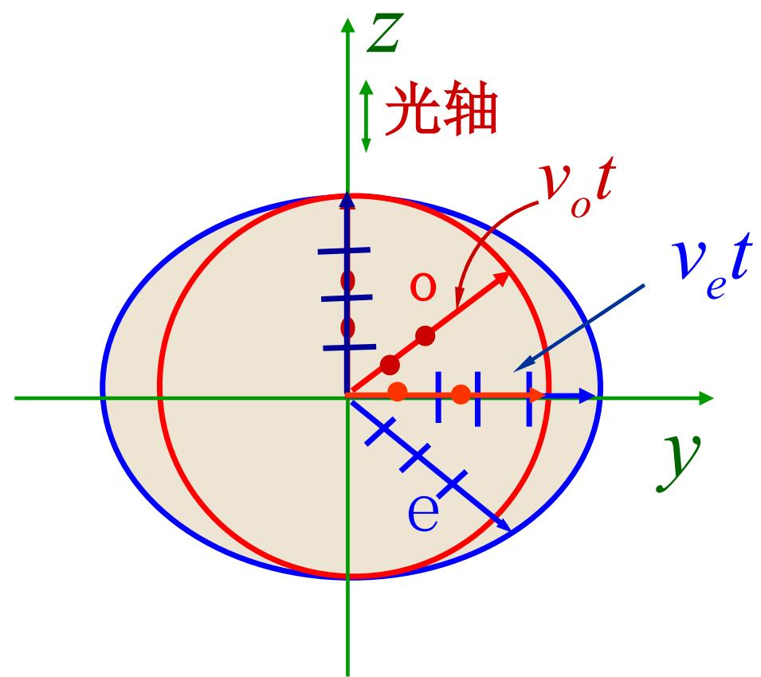


正 晶 体 $( n _ { \mathrm { e } } > n _ { \mathrm { o } } )$ 


# 用惠更斯原理确定反射光和折射光传播方向

(1)作图法确定光在各向同性介质界面上的反射和折射光方向.


用惠更斯原理确定反射光的传播方向.

用惠更斯原理确定折射光的传播方向.

# 用惠更斯作图法确定光在晶体中的传播方向

例题1：负晶体方解石 1.486, n $n _ { o } = 1$ .658


例题2：方解石  1.486n  1.658n


例题3：石英(正晶体) $n _ { e } = 1 . 5 5 , n _ { o } = 1 . 5 4 ,$ e

光轴垂直于入射面


例题4


例题5


# 单轴晶体光学公式

1 射线速度V和波法向速度VN

·速度各向异性公式

速度倒数面 $-$ 折射率椭球面

V定义与意义

图8-14 e光波面的运动图像

考察波面∑(t) 随时间在空间的推移出发点 惠更斯模型。

∑(t)为旋转椭球面，其主（轴）速度为

$$
\left(v _ {x}, v _ {y}, v _ {z}\right) = \left(v _ {e}, v _ {e}, v _ {o}\right),
$$

(xz)面内，椭圆方程

$$
\frac {x ^ {2}}{a ^ {2}} + \frac {z ^ {2}}{b ^ {2}} = 1.
$$

其中 1■

提取“速度”概念， ∑,(t)→∑,(t +△r).

(1)射线速度 d 具有物理意义。T d 1

(2)法线速度 dFN 具有几何意义。dt


$$
\frac {x ^ {2}}{a ^ {2}} + \frac {z ^ {2}}{b ^ {2}} = 1,
$$

$$
\frac {1}{a ^ {2}} 2 x d x + \frac {1}{b ^ {2}} 2 z d z = 0,
$$

于是，切线斜率：

$$
\begin{array}{r l} \frac {d z}{d x} & = - \frac {b ^ {2}}{a ^ {2}} \cdot \frac {x}{z} \\ & = - \frac {n _ {c} ^ {2}}{n _ {o} ^ {2}} \cdot \tan \xi , \end{array} \quad \left\{ \begin{array}{l} a = v _ {c} t = \frac {c}{n _ {c}} t \\ b = v _ {o} t = \frac {c}{n _ {o}} t \end{array} \right.
$$

*V,与v之关系

对场点P而言，

$$
v _ {N} (p) = v _ {r} (p) \cdot \cos \alpha
$$

$$
\tan \theta = \frac {n _ {c} ^ {2}}{n _ {o} ^ {2}} \tan \xi .
$$

$$
\alpha \quad 0 ^ {\circ} \longrightarrow \quad 0 ^ {\circ}.
$$

其 $\kappa J \downarrow + \frac { 1 } { 2 } J \downarrow + \frac { 1 } { 2 } J \downarrow + \frac { 1 } { 2 } J \downarrow + \frac { 1 } { 2 } J \downarrow - \frac { 1 } { 2 } J \uparrow + \frac { 1 } { 2 } J \uparrow$ 分离角，

$\mathrm { ~  ~ \xi ~ } \tan \theta _ { \circ } = \frac { n _ { e } } { n _ { \circ } } \ \not  \ , \mathrm { ~  ~ \psi ~ } \not  \ \not \& \ \alpha _ { M } , \mathrm { ~  ~ \psi ~ } \not  \ ,$ n0 

$$
\tan \alpha_ {M} = \frac {n _ {o} ^ {2} - n _ {e} ^ {2}}{2 n _ {o} n _ {e}}.
$$

# 速度各向异性 $V _ { 1 } ( \xi )$ 公式

由 $e ^ { 2 } = x ^ { 2 } + z ^ { 2 }$ ，以改写波面椭圆方程为极坐标形式，

$$
\begin{array}{l} r ^ {2} (\xi) = \frac {a ^ {2} b ^ {2}}{a ^ {2} \cos^ {2} \xi + b ^ {2} \sin^ {2} \xi} \\ = \frac {v _ {o} ^ {2} v _ {e} ^ {2}}{v _ {e} ^ {2} \cos^ {2} \xi + v _ {o} ^ {2} \sin^ {2} \xi} \cdot t ^ {2}, \\ \end{array}
$$

于是，射线速度各向异性公式为

$$
\frac {v _ {r} ^ {2} (\xi) = \left(\frac {r (\xi)}{t}\right) ^ {2}}{v _ {c} ^ {2} \cos^ {2} \xi + v _ {o} ^ {2} \sin^ {2} \xi}.
$$

它符合椭圆方程。 由此推出折射率

速度各向异性 vN()公式

据 $\left\{ \begin{array} { l l } { { \displaystyle { \nu _ { _ { R } } ^ { 2 } ( \theta ) = \nu _ { _ { r } } ^ { 2 } ( \underline { { { \xi } } } ) \cdot \cos ^ { 2 } ( \underline { { { \xi } } } - \theta ) } } } \\ { { \displaystyle { \tan \theta = \frac { n _ { e } ^ { 2 } } { n _ { \sigma } ^ { 2 } } \tan \frac { \xi } { s } } } } \end{array} \right. ,$ 

可以导出

$$
\underline {{v _ {N} ^ {2} (\theta) = v _ {a} ^ {2} \cos^ {2} \theta + v _ {c} ^ {2} \sin^ {2} \theta .}}
$$

它不符合椭圆方程。

负晶体 (ne  no)


# 偏光器件 1、 偏光棱镜

尼科尔棱镜


$$
n = 1. 5 5
$$


# 格兰—汤普森


方解石制成的罗匈棱镜


玻璃和方解石制成的偏振器

# 2、 波片

将单轴晶体切成的有一定厚度的晶体片，使其光轴平行于表面，叫做波片．当光垂直通过波片时，在波片内分解为o光e光，因在晶体内垂直于光轴传播，所以o光e光的传播速度不同，这样，传播到波片的后表面o光e光就有了附加的相位差．


波片产生的相位差与波片的d, $\mathtt { n } _ { \mathfrak { o } }$ 和 $\boldsymbol { \mathrm { n } } _ { \epsilon }$ e有关

光程差 $\Delta = ( n _ { o } - n _ { e } ) d .$ 

o光e光的相位差为： $\delta = \frac { 2 \pi } { \lambda } ( n _ { o } - n _ { e } ) d .$ 

若＞0表示o光落后. 若0表示o光超前.


$$
\left\{ \begin{array}{l} E _ {o} = E _ {0 o} \cos \omega t \\ E _ {e} = E _ {0 e} \cos (\omega t + \Delta \varphi) \end{array} \right.
$$

经过波片$\begin{array} { l } { \int E _ { o } = E _ { 0 o } \cos \omega t } \\ { \left\lfloor E _ { e } = E _ { 0 e } \cos ( \omega t + \Delta \varphi + \delta ) \right. } \end{array}$ 

光在波片内被分解为o光和e光,经过波片后可以认为强度没有变化, 但相位差发生变化,因此光过波片后可能要引起偏振态的变化.

(1)波长片(或片)

当 $\delta = \frac { 2 \pi } { \lambda } ( n _ { o } - n _ { e } ) d = 2 k \pi ,$ S :

k即 时,称为波长片. n

经过波片 $\left\{ \begin{array} { l } { E _ { o } = E _ { 0 o } \cos \omega t } \\ { E _ { e } = E _ { 0 e } \cos ( \omega t + \Delta \varphi + 2 k \iota } \end{array} \right.$ )

入射偏振光通过波长片后不改变其偏振态。

# (2)二分之一波片(或/2片)

当 $\delta = \frac { 2 \pi } { \lambda } ( n _ { o } - n _ { e } ) d = ( 2 k + 1 ) \pi$ 

) (  k  即 d  时,称为二分之一波片.

经过波片   cos0E E to o       cos (2 1)0E E t ke e


(3)四分之一波片 (或/4片)

$$
\delta = \frac {2 \pi}{\lambda} (n _ {o} - n _ {e}) d = 2 k \pi + \frac {\pi}{2},
$$

k    ) (时,称为四分之一波长片.n no e

经过波片 $\left\{ \begin{array} { l l } { { \displaystyle E _ { o } = E _ { 0 o } \cos \omega t } } \\ { { } } \\ { { \displaystyle E _ { e } = E _ { 0 e } \cos \left( \omega t + \Delta \varphi + ( 2 k + \frac { 1 } { 2 } ) \right) } } \end{array} \right.$ 

当线偏振光入射到/4片时，出射光为正椭圆偏振或圆偏振光。相应地，当椭圆偏振或圆偏振光入射到适当的/4片后，出射光可以转变为线偏振光。


（g） 


线偏振光通过/4波片后将变为椭圆(圆)偏振光

圆或主轴与波片光轴平行的正椭圆偏振光通过/4波片后可变为线偏振光

# 椭圆与圆偏振光的检偏


用四分之一波片和偏振片P 可区分出自然光和圆偏振光或部分偏振光和椭圆偏振光.

自然光在晶体（波片）内产生的o光和e光虽然同频率且振动方向相互垂直，但它们之间无固定的位相差，这样经过四分之一波片的出射光仍然是自然光。


补偿器：


经过补偿器后两偏振光之间的相位差：

$$
\Delta \varphi = \frac {2 \pi}{\lambda} \bigl [ (n _ {o} - n _ {e}) d _ {1} + (n _ {e} - n _ {0}) d _ {2} \bigr ] = \frac {2 \pi}{\lambda} (n _ {o} - n _ {e}) (d _ {1} - d _ {2})
$$

# 偏振光的干涉


1、 P1P2 2 


$$
\left\{ \begin{array}{l} A _ {2 e} = A _ {1} \cos \alpha \sin \alpha \\ A _ {2 o} = A _ {1} \sin \alpha \cos \alpha \end{array} \right.
$$

它们之间的相位差：

$$
\delta = \frac {2 \pi}{\lambda} \left(n _ {o} - n _ {e}\right) d + \pi
$$

晶体双折射

投影

$$
I (P) = A _ {2 e} ^ {2} + A _ {2 o} ^ {2} + 2 A _ {2 e} A _ {2 o} \cos \delta = \frac {1}{2} A _ {1} ^ {2} \sin^ {2} 2 \alpha \cdot (1 + \cos \delta)
$$

当： $\mathfrak { s } = 2 k \pi , \mathtt { H } \sharp \frac { 2 \pi } { \lambda } \big ( n _ { o } - n _ { e } \big ) d = \big ( 2 k + 1 \big ) \pi ,$ 干涉相长，亮条纹。

当： $\delta = ( 2 k + 1 ) \pi ,$ $\mathcal { S } = ( 2 k + 1 ) \pi , \mathop { \mathrm { ~ \tiny ~ \textnormal ~ { ~  ~ } ~ } } \frac { 2 \pi } { \lambda } \big ( n _ { o } - n _ { e } \big ) d = 2 k \pi ,$ ，干涉相消，暗条纹。

2、 P1//P2 


$$
\left\{ \begin{array}{l} A _ {2 e} = A _ {e} \cos \alpha = A _ {1 1} \cos^ {2} \alpha \\ A _ {2 o} = A _ {o} \sin \alpha = A _ {1 1} \dot {\sin} ^ {2} \alpha \end{array} \right.
$$

它们之间的相位差：

$$
\delta = \frac {2 \pi}{\lambda} \left(n _ {o} - n _ {e}\right) d
$$

晶体双折射

$$
\begin{array}{l} I (P) = A _ {2 e} ^ {2} + A _ {2 o} ^ {2} + 2 A _ {2 e} A _ {2 o} \cos \delta \\ = \left(A _ {1} \cos^ {2} \alpha\right) ^ {2} + \left(A _ {1} \sin^ {2} \alpha\right) ^ {2} + 2 A _ {1} ^ {2} \sin^ {2} \alpha \cdot \cos^ {2} \alpha \cdot \cos \delta \\ = A _ {1} ^ {2} \left(1 - \frac {1}{2} \sin^ {2} 2 \alpha + \frac {1}{2} \sin^ {2} 2 \alpha \cdot \cos \delta\right) \\ \end{array}
$$

当： $\delta = 2 k \pi \cdot$ ，即 $\frac { 2 \pi } { \lambda } \big ( n _ { o } - n _ { e } \big ) d = 2 k \pi ,$ ，干涉相长，亮条纹。

当： $\delta = ( 2 k + 1 ) \pi ,$ $= ( 2 k + 1 ) \pi , \mathtt { H J } \frac { 2 \pi } { \lambda } \big ( n _ { o } - n _ { e } \big ) d = \big ( 2 k + 1 \big ) \pi ,$ $\frac { 2 \pi } { \lambda } \big ( n _ { o } - n _ { e } \big ) d = \big ( 2 k + 1 \big ) \pi ,$ ，干涉相消，暗条纹。

当P ${ \bf \Phi } _ { 1 } / / { \bf P } _ { 2 } \mathrm { \Delta }$ 满足亮条纹条件时， P1P2为暗条纹

当P ${ \bf \Phi } _ { 1 } / / { \bf P } _ { 2 } \mathrm { . }$ 满足暗条纹条件时， P1P2为亮条纹

两种情况互补，旋转第二个偏振片，从P1P2到 ${ \bf { \cal I } } _ { 1 } / / { \bf P } _ { 2 }$ 观察的明暗互补

例题1：


劈尖晶片的等厚干涉花样

P1P2,出射光强度分布为：

$$
\begin{array}{l} I (P) = A _ {2 e} ^ {2} + A _ {2 o} ^ {2} + 2 A _ {2 e} A _ {2 o} \cos \delta = A _ {1} ^ {2} \sin^ {2} 2 \alpha \cdot (1 + \cos \delta) \\ \delta = \frac {2 \pi}{\lambda} (n _ {o} - n _ {e}) d + \pi \approx \frac {2 \pi}{\lambda} (n _ {o} - n _ {e}) \beta x + \pi \\ \end{array}
$$

当偏振光的干涉装置中的晶片厚度不均匀时，具有相同厚度的地方，将产生同样的干涉光强，形成等厚干涉花样

    当： ，即 ，干涉相长，亮条纹。k n n x k2 122   2

当： $\delta = ( 2 k + 1 ) \pi ,$ $= ( 2 k + 1 ) \pi , \mathtt { H } \mathtt { H } \frac { 2 \pi } { \lambda } \big ( n _ { o } - n _ { e } \big ) \beta x = 2 k \pi ,$ 2 ，干涉相消，暗条纹。

等厚条纹，条纹间距：

$$
\Delta x = \frac {\lambda}{\beta (n _ {o} - n _ {e})}
$$

# 人工双折射

# 光弹测量：

构件做成模型，置于光场中，测定模型应力值。在构件上施加一定拉力和压力，介质内部形成一定的应力分布，介质变成各向异性，产生双折射。

$$
\Delta n (x, y) = n _ {o} - n _ {e} \Leftrightarrow \delta (x, y) = \frac {2 \pi}{\lambda} d \cdot \Delta n (x, y) \Leftrightarrow I (x, y)
$$

在一定的应力范围里，双折射率 n 和应力成正比， n的空间分布反映在偏振光的干涉条纹花样，由相似原理换算出实际应力。


• 克尔效应:某些各向同性的透明介质（如非晶体和液体），在外电场的作用下，显示出双折射现象，称为克尔效应。


外加电场破坏溶液的各向同性，产生各向异性，产生双折射，光轴方向平行于电场方向；

$$
\Delta n = n _ {o} - n _ {e} \propto E ^ {2} \quad \text {即 :} \Delta n = b E ^ {2}
$$

经过长度为l的电场区，克尔效应产生的附加相位差为：

2 2 lbE 222 KlE K mbK ，其中 为克尔常数，单位为令 

透过P2的光强：

$$
I (P) = A _ {1} ^ {2} \sin^ {2} 2 \alpha \cdot \left(1 - \cos \Delta \varphi\right) = A _ {1} ^ {2} \sin^ {2} 2 \alpha \cdot \left[ 1 - \cos \left(2 \pi K l E ^ {2}\right) \right]
$$

当： $E = 0 \mathbb { H } \mathbf { \overline { { \Omega } } } \mathbf { \overline { { \Omega } } } \mathbf { j }$ ， $I ( P ) = 0 ;$ 

$2 \pi K l E ^ { 2 } = \pi$ 时， $I ( P )$ 极大，此时的外加电场为：

1 $U _ { \not \equiv } = E d = { \frac { d } { \sqrt { 2 K l } } }$ E  对应的外加电压：Kl2

当电压在此值与零值间变换时，克尔盒可使光路通、断，故可用作电光开关。若克尔盒的电极与调制信号电压相接，则通过P 的光强将随信号电压的变化而改变，这时的克尔盒就是一个光调制器。由于克尔效应几乎没有延迟时间，随外电场变化的响应时间极短,可达109 s，因此可制成高速光闸和光调制器等，用于高速摄影、电影电视以及激光通讯等领域。

*泡克耳斯效应：


图为泡克耳斯效应装置( 光传播方向与电场平行 )， P1 ⊥ P2；透明电极；晶体是单轴晶体，光轴沿光传播方向( 不加电场时，无双折射 )。

加电场 → 晶体变双轴晶体 → 原光轴方向附加了双折射效应。泡克耳斯效应产生的n正比于外加电场；

$$
\Delta n = \gamma n _ {o} ^ {3} E \quad - - \text {线 性 电 光 效 应}
$$

$n _ { o } - o$ 光在晶体中的折射率，V─电压， ─ 电光常数。

经过长度为l的电场区，克尔效应产生的附加相位差为：

$$
\Delta \varphi = \frac {2 \pi}{\lambda} n _ {o} ^ {3} \gamma E l = \frac {2 \pi}{\lambda} n _ {o} ^ {3} \gamma V
$$

=时，P2透光最强。

磷酸二氢钾（KH PO ，简称KDP）、磷酸二氢胺（NH4H2PO4，ADP）等单晶都具有线性电光效应。例如KDP晶体对于λ=546nm的绿光， $n _ { o } = 1 . 5 1$ ，=10.610-12 m/V， $\Delta \varphi { = } \pi$ 时，半波电压 $\mathrm { V } { = } 7 6 0 0 \mathrm { V }$ ，这比克尔盒要求的电压低得多。

泡克尔斯效应的开关响应时间也极短，一般小于 $1 0 ^ { - 9 } \mathrm { s }$ ，可用作超高速开关，激光调 $\boldsymbol { \mathcal { Q } }$ ，显示技术，数据处理…

# 旋光现象

石英的旋光现象


图8-46 旋光性实验演示

$P _ { 1 } \perp P _ { 2 }$ $I _ { 2 } \neq 0$ ，不消光，

转 $P _ { 2 }$ $\psi$ 角度，却再现消光， $I _ { 2 } = 0$ 

这说明：从石英晶片出射的依然是线偏振光，其偏振面却有了旋转。


物质的旋光性

某些物质（如石英、氯酸钠、糖的水溶液、酒石酸溶液、松节油等）具有能使线偏振光的振动面发生旋转的性质，称为旋光性(optical activity)。

振动面旋转的角度：

$$
\varphi = \alpha d
$$

$a -$ 旋光率(specific rotation)， 它取决于入射光的波长和旋光物质的性质。

# 菲涅耳旋光现象的说明


任何一个圆偏振光和椭圆偏振光可以分解成两个同频，振动方向相互垂直，并且有稳定的相位关系的线偏振光。

$$
\left\{ \begin{array}{l} E _ {x} = E _ {0 x} \cos \omega t \\ E _ {y} = E _ {0 y} \cos (\omega t + \Delta \varphi) \end{array} \right.
$$


任何线偏振光可以分解成两个同频的左右旋、振幅相等、并且有稳定的相位关系的圆偏振光。

$$
E (t) = E _ {0} \cos \omega t = E _ {L} (t) + E _ {R} (t)
$$

$$
E _ {L} = E _ {R} = \frac {E _ {0}}{2}
$$

$$
\theta_ {L} = \omega t + \theta_ {L 0}, \quad \theta_ {R} = \omega t + \theta_ {R 0}
$$

在旋光晶体中左旋圆偏振光和右旋圆偏振光的传播速度不同，即两种偏振态的折射率不同；

$$
v _ {L} \neq v _ {R}, \quad \text {即 :} \quad n _ {L} = \frac {c}{v _ {L}} \neq n _ {R} = \frac {c}{v _ {R}}
$$

左旋偏振光和右旋偏振光经过厚度为d的晶体，两者经历的光程不同，相应地产生不同的相位落后：

$$
\left\{ \begin{array}{l} \Delta \phi_ {L} (B) = \phi_ {L} (\mathbf {A}) - \frac {2 \pi}{\lambda} n _ {L} \cdot d \\ \Delta \phi_ {R} (B) = \phi_ {R} (\mathbf {A}) - \frac {2 \pi}{\lambda} n _ {R} \cdot d \end{array} \right.
$$


某时刻右旋圆偏振

光E 随 z 的变化


空间某一点的右旋

圆偏振光

对于圆偏振光，相位落后意味着光矢量转角的倒退，即：

相位落后

转角倒退

$$
\left\{ \begin{array}{l} \Delta \phi_ {L} (B) = \phi_ {L} (\mathrm {A}) - \frac {2 \pi}{\lambda} n _ {L} \cdot d \\ \Delta \phi_ {R} (B) = \phi_ {R} (\mathrm {A}) - \frac {2 \pi}{\lambda} n _ {R} \cdot d \end{array} \right.
$$


晶体前表面


晶体后表面

晶体后表面合成的线偏振光矢量为 $\alpha _ { L }$ 、 $\alpha _ { R }$ 夹角的平分线，相对于前表面的线偏振光矢量旋转了

当 $n _ { L } > n _ { R }$ ，右旋角度：

$\phi _ { R } = { \frac { 1 } { 2 } } ( \alpha _ { L } - \alpha _ { R } ) = { \frac { \pi } { \lambda } } ( n _ { L } - n _ { R } ) d ,$ ，称右旋品体


晶体前表面


晶体后表面

当 $n _ { L } < n _ { R } ,$ ， 左旋角度：

$\phi _ { { L } } = \frac { 1 } { 2 } \big ( \alpha _ { { R } } - \alpha _ { { L } } \big ) = \frac { \pi } { \lambda } \big ( n _ { { R } } - n _ { { L } } \big ) d ,$ ，称左旋晶体

菲涅耳复合棱镜：


 对于 光，光密 光疏，向棱镜顶偏 L  从 R n n L n n L R L R, ( ) , ( )  对于 光，光疏 光密，向棱镜底偏R

$( n _ { L } < n _ { R } ) \Longrightarrow R , ( n _ { L } > n _ { R } ) { \left\{ \atop { \vec { \chi } } \right\} } \not \equiv L { \vec { \chi } } , { \vec { \jmath } } { \downarrow } { \downarrow } { \vec { \jmath } } _ { \mathrm { t } } ^ { 2 }$ 光密，向棱镜底偏从L ,  光疏，向棱镜顶偏

# 菲涅耳复合棱镜的意义：

1、证实了菲涅耳提出的关于晶体旋光性机理的假设解释。

2、提供了一种产生圆偏振光的一个典型器件。

# 磁致旋光效应

# 法拉第 （Michael Faraday，1791—1867）

伟大的英国物理学家、化学家。法拉第出身贫寒，自学成才，工作勤奋，热心科普工作，是实验大师。他发现了电磁感应现象、法拉第电解定律和磁致旋光效应，提出了力线和场的概念，主张自然界的各种力相互有关，反对超距作用的观点。J.C.麦克斯韦电磁场理论是在法拉第工作的基础上建立的。

法拉第的主要著作有《电学实验研究》、《化学和物理学实验研究》、《日记》 0

1845年8月,法拉第研究电和磁对偏振光的影响,9月用过去研制的重玻璃做实验，发现原来没有旋光性的重玻璃在强磁场的作用下产生旋光性，使偏振光的偏振面发生偏转。这是人类第一次认识到电磁现象和光现象之间的关系。磁致旋光效应后来称为法拉第效应。


在两个透振方向正交的偏振片之间沿光的传播方向放置一个螺线管，将待测的透明介质样品插入螺线管内。单色平行自然光通过起偏器M后变为线偏振光，如果螺线管未接通电源，透明介质样品无旋光性，透射光将完全被检偏器N所阻隔。螺线管接通电源后，介质样品在强磁场的作用下而产生旋光性，因而将有光从偏振片N射出。这时若将N旋转某个角度，则会重新产生消光, 这说明从介质样品出射的光仍是线偏振光，只是其振动面相对于入射线偏振光的振动面转过了角度。实验表明，磁致旋光效应中振动面的旋转角正比于光在介质中通过的距离l，正比于介质内的磁感应强度B，即

$$
\theta = \nu l B
$$

式中v是比例系数，称为维尔德常量，决定于介质的性质，也与入射光的波长有关。

实验还表明，磁致旋光性与天然旋光性是有差别的。天然旋光性的右旋和左旋取决于物质的结构，与光的传播方向无关；磁致旋光性的右旋和左旋与光相对于磁场的传播方向有关，若光沿磁场方向传播是左旋的，则逆着磁场方向传播变为右旋。

所以，线偏振光往返两次通过天然旋光物质，振动面将恢复到原先的方位。


而线偏振光往返两次通过磁致旋光物质情况就不同了，如果光沿磁场方向通过，振动面左旋了角，那么当它沿原路径逆着磁场返回时，物质变为右旋的，振动面又旋转了角，这样往返两次通过同一物质振动面共旋转了2角。

利用磁致旋光的这种性质，可以制成光隔离器、光调制器等器件。


