# 物理光学

冯 帅

Email：shuaifeng@muc.edu.cn 

# 绪 论

一、 光学的研究内容

二、 光学的发展过程

三、光学的特点

四、学习方法

# 光学的研究内容

1、 光的本性；

2、 光的产生和控制；

3、 光的传输和检测；

4、光和其它物质的相互作用；

5、 光学的各种应用。

# 电磁波谱与可见光范围

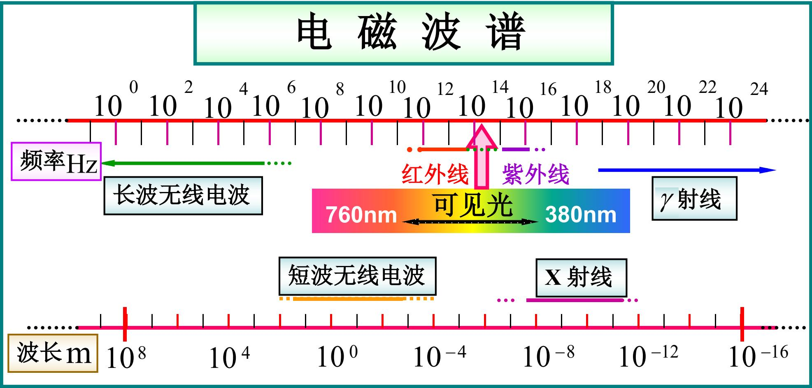

$$
\lambda = 3 8 0 \rightarrow 7 6 0 \mathrm {n m} \quad \nu = 4 - 8 \times 1 0 ^ {1 4} \mathrm {H z}
$$

# 麦克斯韦电磁理论认为: 光是一种电磁波

各种视觉对应的波长频率范围：

<table><tr><td>色视觉</td><td>频率 /Hz</td><td>真空中波长 /nm</td></tr><tr><td>红</td><td>(3.9~4.8)×1014</td><td>760~630</td></tr><tr><td>橙</td><td>(4.8~5.0)×1014</td><td>630~600</td></tr><tr><td>黄</td><td>(5.0~5.3)×1014</td><td>600~570</td></tr><tr><td>绿</td><td>(5.3~6.0)×1014</td><td>570~500</td></tr><tr><td>青</td><td>(6.0~6.7)×1014</td><td>500~450</td></tr><tr><td>蓝</td><td>(6.7~7.0)×1014</td><td>450~430</td></tr><tr><td>紫</td><td>(7.0~7.7)×1014</td><td>430~390</td></tr></table>

光既有波动性也有粒子性，即具有波粒二象性。

普朗克常数非常小，一个光子的能量也非常小。

一般情况下我们遇到极大数量的光子，明显表现波动性。在光极其弱的情况下，以及光和物质相互作用的某些特殊情况下，其量子特性才会明显地表现出来。

# 二、 光学的发展过程

¨经典光学：

1、几何光学 光的传播、反射、折射、成像等。

2、 物理光学

①波动光学：光的干涉、衍射、偏振等。

②量子光学：光的吸收、散射、色散、光的本性等。

# ¨现代光学时期： 20世纪中~

三件大事： ①1948年 全息技术

②1955年 光学传递函数

③1960年 激光器

# 现代光学

①激光光学：激光物理、激光技术、激光应用等。

②全息光学：光学全息与信息处理等。

③晶体光学：光波在晶体中的传播及晶体的电光效应等。

④集成光学：集成光路理论及制造等。

⑤傅立叶光学：光学傅立叶分析、傅立叶变换等。

⑥激光光谱学：物质微观结构及分子运动规律的分析等。

⑦非线性光学：光学介质与强光的相互作用。瞬态光学、光纤通信、光信息存储、受激拉曼散射、受激布里渊散射、飞秒激光…

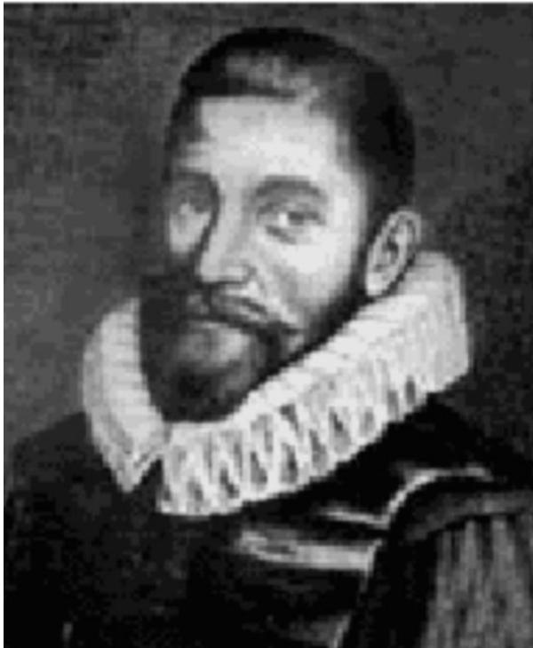

# 光的机械论认识-- 粒子光学：

斯涅耳（W. Snell, 约1580-1626)荷兰莱顿人，数学家和物理学家，曾在莱顿大学担任过数学教授。斯涅尔最早发现了光的折射定律，从而使几何光学的精确计算成为了可能。斯涅耳的这一折射定律（也称斯涅耳定律）是从实验中得到的，未做任何的理论推导，虽然正确，但却从未正式公布过。

折射定律是几何学的最重要基本定律之一。斯涅耳的发现为几何光学的发展奠定了理论基础，把光学发展往大大的推进了一步。斯涅耳作图法来分析双折射中光在单轴晶体中传播方向的确定。用斯涅耳作图法可以求取波法线方向。斯涅耳作图法是基于折射和反射定律、利用波矢面的作图法。这种方法与惠更斯作图法各有千秋。斯涅耳作图法不仅限于光学，还可以分析电磁波在各向异性的介质中入射波、反射波以及透射波的关系。

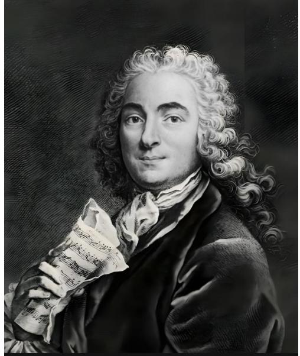

# 光的机械论认识-- 粒子光学：

笛卡儿 (1596年3月31日–1650年2月11日），生于法国安德尔–卢瓦尔省的图赖讷（现笛卡尔，因笛卡尔得名），逝世于瑞典斯德哥尔摩，法国哲学家、数学家、物理学家。他对现代数学的发展作出了重要的贡献，由于他的几何坐标系的公式化而被认为是解析几何之父。

光学方面，笛卡尔提出了关于光的本性的独到见解。他坚信光是“即时”传播的，并阐发了光的折射定律的理论推证。笛卡尔在《屈光学》中详细探讨了光的折射现象，为理解光的传播规律做出了重要贡献。此外，他还解释了视力失常的原因，并成功解释了彩虹现象的成因，这些成就都体现了他在光学领域的深厚造诣。

力学方面，笛卡尔发展了伽利略的运动相对性理论，并首次明确表述了惯性定律。他指出，只要物体开始运动，就将继续以同一速度并沿同一直线方向运动，直到遇到某种外来原因造成的阻碍或偏离为止。这一表述与牛顿后来的惯性定律不谋而合，为经典力学的发展奠定了基础。此外，笛卡尔还首次提出了动量守恒定律，强调物质和运动的总量永远保持不变，这一观点在力学研究中具有重要意义。

# 光的机械论认识-- 粒子光学：

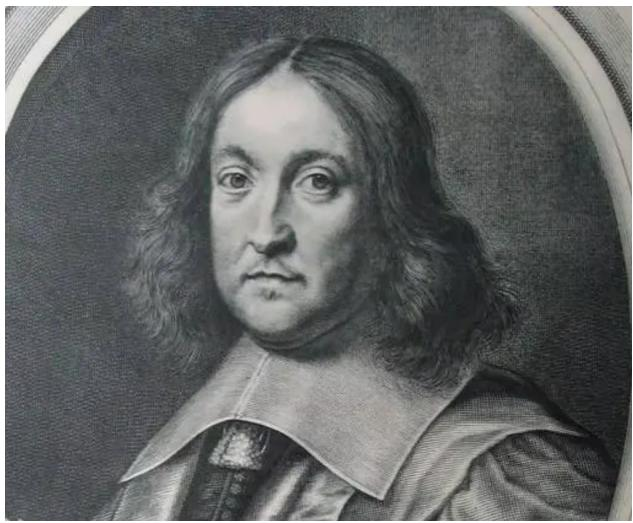

费马 Pierre de Fermat，（1601年8月17日～1665年1月12日），法国律师和业余数学家。他在数学上的成就不比职业数学家差，他似乎对数论最有兴趣，亦对现代微积分的建立有所贡献。被誉为“业余数学家之王”。费马在光学中突出的贡献是提出最小作用原理，也叫最短时间作用原理。

古希腊时期，欧几里得就提出了光的直线传播定律和反射定律。后由海伦揭示了这两个定律的理论实质——光线取最短路径。经过若干年后，这个定律逐渐被扩展成自然法则，并进而成为一种哲学观念。—个更为一般的“大自然以最短捷的可能途径行动”的结论最终得出来，并影响了费马。费马的高明之处在于将这种哲学观念变为科学理论。费马同时讨论了光在逐点变化的介质中行径时，其路径取极小的曲线的情形。并用最小作用原理解释了一些问题。

# 光的机械论认识-- 粒子光学：

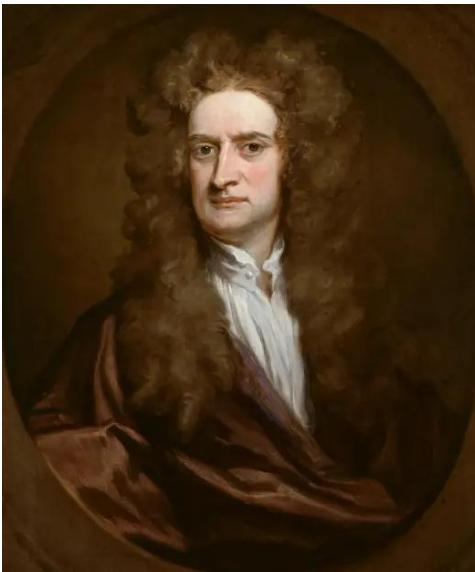

牛顿,（Isaac Newton，1643年1月4日－1727年3月31日），爵士，英国数学家、物理学家、哲学家。牛顿毕业于剑桥大学，后任该校教授。还曾担任英国皇家学会会员、会长。在1687年发表的论文《自然定律》中，牛顿对万有引力和牛顿三大定律进行了描述。

牛顿曾致力于颜色的现象和光的本性的研究。1666年，他用三棱镜研究日光，得出结论：白光是由不同颜色（即不同波长）的光混合而成的，不同波长的光有不同的折射率。在可见光中，红光波长最长，折射率最小；紫光波长最短，折射率最大。牛顿的这一重要发现成为光谱分析的基础，揭示了光色的秘密。牛顿还曾把一个磨得很精、曲率半径较大的凸透镜的凸面，压在一个十分光洁的平面玻璃上，在白光照射下可看到，中心的接触点是一个暗点，周围则是明暗相间的同心圆圈。后人把这一现象称为“牛顿环” 。他创立了光的“微粒说”，从一个侧面反映了光的运动性质，但牛顿对光的“波动说”并不持反对态度。

# 波动光学

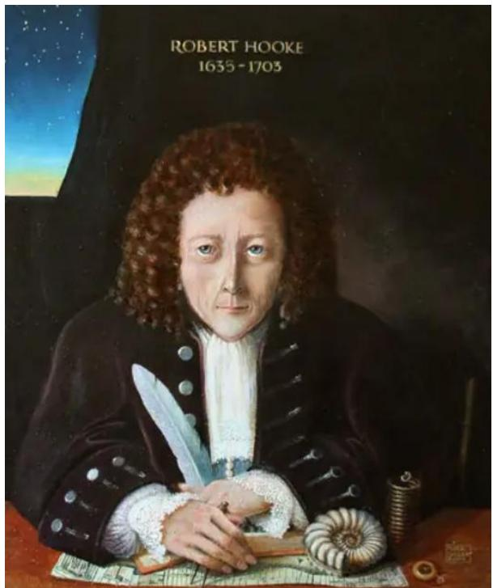

胡克，Robert Hooke，(1635年7月18日－1703年3月3日），英国科学家、博物学家、发明家。在物理学研究方面，他提出了描述材料弹性的基本定律-胡克定律，在机械制造方面，他设计制造了真空泵，显微镜和望远镜，并将自己用显微镜观察所得写成《显微术》一书，细胞一词即由他命名。在新技术发明方面，他发明的很多设备仍然在使用。除去科学技术，胡克还在城市设计和建筑方面有着重要的贡献。但由于与牛顿的争论导致他去世后少为人知。

在光学方面，胡克是光的波动说的支持者。1655年，胡克提出了光的波动说，他认为光的传播与水波的传播相似。1672年胡克进一步提出了光波是横波的概念。在光学研究中，胡克更主要的工作是进行了大量的光学实验，特别是致力于光学仪器的创制。他制作或发明了显微镜、望远镜等多种光学仪器。

# 波动光学

惠更斯，Christiaan Huyg(h)ens，(1629年04月14日-1695年07月08日) 荷兰物理学家、天文学家、数学家，他在力学、光学、数学和天文学方面都有卓越的成就，是近代自然科学的一位重要开拓者。他建立向心力定律，提出动量守恒原理，并改进了计时器。

惠更斯在1690年发表的《光论》书中阐述了他的光波动原理，即惠更斯原理．惠更斯原理认为:对于任何一种波，从波源发射的子波中，其波面上的任何一点都可以作为子波的波源，各个子波波源波面的包洛面就是下一个新的波面。他认为每个发光体的微粒把脉冲传给邻近一种弥漫媒质（“以太”）微粒，每个受激微粒都变成一个球形子波的中心。他从弹性碰撞理论出发，认为这样一群微粒虽然本身并不前进，但能同时传播向四面八方行进的脉冲，因而光束彼此交叠而不相互影响，并在此基础上用作图法解释了光的反射、折射等现象。

# 波动光学

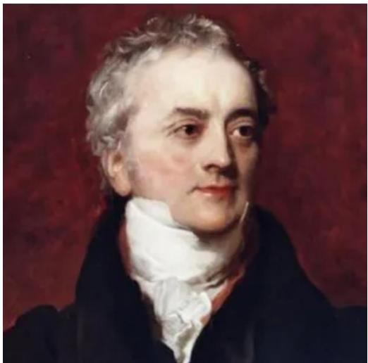

托马斯·杨（Thomas Young，1773年-1829年 ）英国医生、物理学家，光的波动说的奠基人之一。托马斯·杨涉猎甚广：力学、数学、光学、声学、语言学、动物学、考古学等。他对艺术还颇有兴趣，热爱美术，几乎会演奏当时的所有乐器，并且会制造天文器材，还擅长骑马，耍杂技走钢丝。

托马斯·杨在物理学上作出的最大贡献是关于光学，1801年进行了杨氏双缝实验，发现了光的干涉性质，证明光以波动形式存在，而不是牛顿所想象的光颗粒（Corpuscles），该实验被评为“物理最美实验”之一。二十世纪初物理学家将杨的双缝实验结果和爱因斯坦的光量子假说结合起来，提出了光的波粒二象性，后来又被德布罗意利用量子力学引申到所有粒子上。

马斯·杨曾被誉为是生理光学的创始人。在1793年提出人眼里的晶状体会自动调节以适应所见的物体的远近。他也是第一个研究散光的医生（1801年）。后来，他提出色觉取决于眼睛里的三种神经，分别感觉红色、绿色和紫色。

# 波动光学

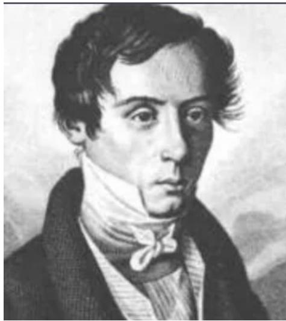

菲涅耳，（Augustin-Jean Fresnel，1788年5月10日-1827年7月14日），法国物理学家 ；菲涅耳以惠更斯原理和干涉原理为基础，用新的定量形式建立了以他们的姓氏命名的惠更斯－菲涅耳原理。解释了衍射现象，完成了光的波动说的全部理论。

对于波动光学的理论建立做出了杰出的贡献，曾利用自己设计的双镜和双棱镜做光的干涉实验，继托马斯·杨之后再次证实了光的波动性，并提出了两束光发生干涉的条件，诸如：惠更斯-菲涅尔原理、菲涅尔衍射、对于反射现象和折射现象得出的菲涅耳方程以及较好的解释了物质的旋光性等。

此外，他还设计了一种特殊的透镜，称为“螺纹透镜”（菲涅耳透镜）；又算出光在运动媒质中传播时所谓的“曳引系数”，以后也为实验所证实。

# 对于光波的进一步认识—电磁波：

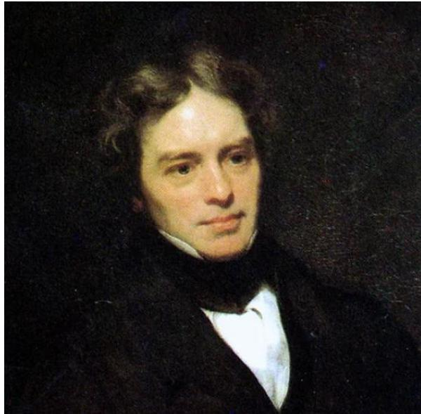

法拉第（Michael Faraday，1791年9月22日-1867年8月25日），英国物理学家、化学家。法拉第是英国化学家汉弗里·戴维的学生，詹姆斯·克拉克·麦克斯韦的先导。被称为“电学之父”和“交流电之父”。

1831年，发现电磁感应现象，并进而得到产生交流电的方法。1831年发明了圆盘发电机，是人类创造出的第一个发电机。1837年他引入了电场和磁场的概念，指出电和磁的周围都有场的存在，这打破了牛顿力学“超距作用”的传统观念。1838年，他提出了电力线的新概念来解释电、磁现象，这是物理学理论上的一次重大突破。1843年，法拉第用有名的“冰桶实验”，验证了电荷守恒定律。

# 对于光波的进一步认识—电磁波：

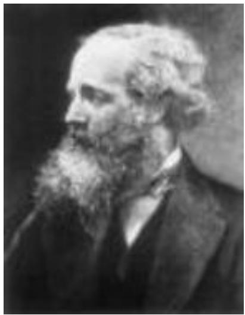

麦克斯韦 （James Clerk Maxwell，1831年6月13日-1879年11月5日），英国物理学家、数学家，经典电动力学创始人，统计物理学奠基人之一。1865年，詹姆斯·克拉克·麦克斯韦预言了电磁波的存在，电磁波只可能是横波，并推导出电磁波的传播速度等于光速，同时得出结论：光是电磁波的一种形式，揭示了光现象和电磁现象之间的联系。

麦克斯韦是继法拉第之后，集电磁学大成的伟大科学家，建立了完整的电磁理论体系，不仅科学地预言了电磁波的存在，而且揭示了光、电、磁现象的本质的统一性，完成了物理学的一次大综合。

在热力学与统计物理学方面，他是气体动理论的创始人之一。1859年用统计规律得出麦克斯韦速度分布律，从而找到了由微观量求统计平均值的更确切的途径。1866年他给出了分子按速度的分布函数的新推导方法，这种方法是以分析正向和反向碰撞为基础的。他引入了弛豫时间的概念，发展了一般形式的输运理论，并把它应用于扩散、热传导和气体内摩擦过程。1867年引入了“统计力学”这个术语。

# 对于光波的进一步认识—电磁波：

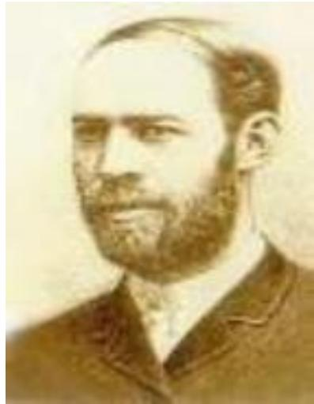

赫兹（Heinrich Rudolf Hertz，1857年2月22日—1894年1月1日），德国物理学家，于1888年首先证实了电磁波的存在。并对电磁学有很大的贡献，故频率的国际单位制单位赫兹以他的姓氏命名。赫兹的主要贡献是用实验证明了电磁波的存在，并测出电磁波传播的速度跟光速相同，还进一步观察到电磁波具有聚焦、直进性、反射、折射和偏振等性质。

1888年1月，赫兹将研究成果总结在《论动电效应的传播速度》一文中。赫兹实验公布后，轰动了全世界的科学界。由法拉第开创，麦克斯韦总结的电磁理论，至此才取得决定性的胜利。1888年，成了近代科学史上的一座里程碑。赫兹的发现具有划时代的意义，它不仅证实了麦克斯韦发现的真理，更重要的是开创了无线电电子技术的新纪元。

随着迈克尔逊在1881年进行的实验和1887年的迈克尔逊-莫雷实验推翻了光以太的存在，赫兹改写了麦克斯韦方程组，将新的发现纳入其中。通过实验，他证明电信号像詹姆士·麦克斯韦和迈克尔·法拉第预言的那样可以穿越空气，这一理论是发明无线电的基础。

# 量子光学（能量子）

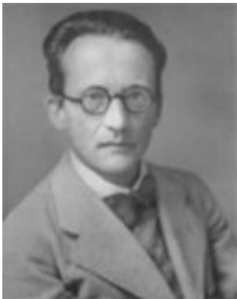

uidingu. 

薛定谔

Erwin 

Schrödinger 

1887-1961 

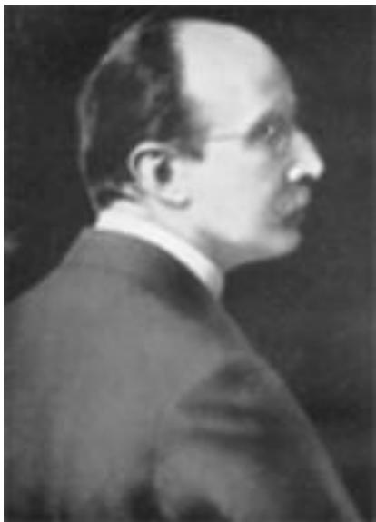

s.Heuw. 

普朗克

Max Karl Ernst Ludwig Planck 

1858-1947 

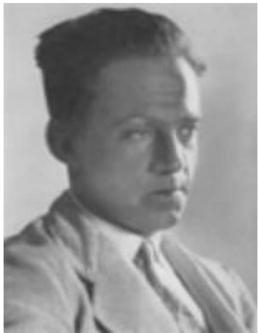

海森伯

Werner Karl Heisenberg 

1901-1976 

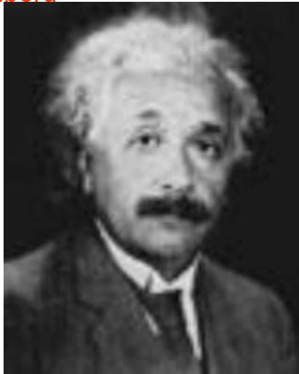

爱因斯坦

(1879-1955) 

# 光学的特点

¨年轻而古老：光缆、光盘等——远古

¨基础加应用：力、热、电、光——工业、农业、军事、天文学、医学、电子学、材料科学、化学、生物、通信等

¨理论与实验：张量、卷积、相关、δ函数、

傅氏变换——普通光学实验、

近代光学实验、现代光学实验等

# 四、 怎样学习物理光学

# 师生配合

认真备课

按时上课

¨ 因材施教

¨ 认真听讲

重点突出

¨ 搞好复习

方法先进

完成作业

为人师表

注重实践

¨ 要求严格

¨ 创新思维

# 学 习 方 法

1. 掌握相应的数学知识;

2. 培养对光学学科的兴趣。

3. 物理实际问题—数学关系式—物理结论；

4. 正确处理好实验—理论的关系；

5. 合理利用课堂时间和课余时间；

6. 独立完成作业。

# 参 考 书

1、《现代光学基础》第二版 钟锡华 北京大学出版社；

2、《光学》赵凯华、钟锡华 北京大学出版社；

3、《光学》第二版 游璞 等 高等教育出版社；

4、《光学》第二版 章志鸣等 高等教育出版社；

5、 普通物理学教程《光学》易明 高等教育出版社；

6、《光学》 张阜权等 北京师范大学出版社；

8、《光学教程》第三版 姚启钧 高等教育出版社；

7、《光学》 母国光、 战元令 人民教育出版社。