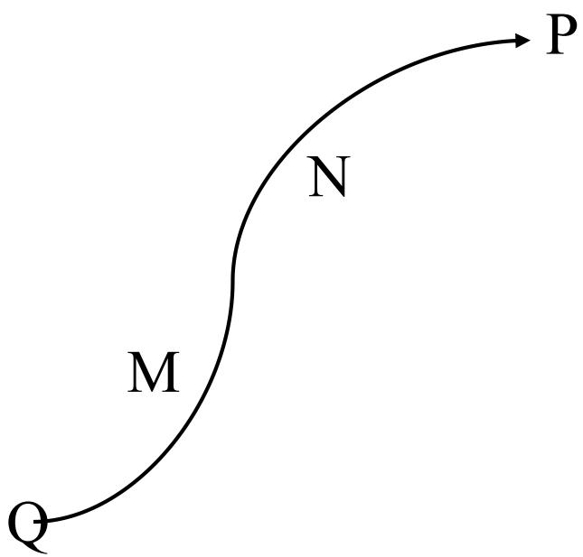
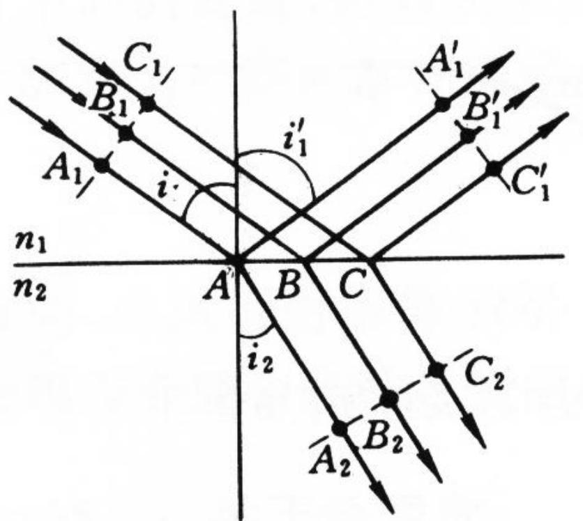

> [!tip] 🧠 通俗理解：什么是“光程”？
> 如果你在泥洼地（折射率 $n>1$）里艰难跋涉了 10 米（几何路程 $l$），你消耗的体力可能等同于在平坦柏油路（真空，$n=1$）上跑了 15 米。
> **光程 (Optical Path Length)** 就是在算这笔“等效账”：光在介质中走过的距离 $l$，**折算成它在真空中走相同相位/时间所对应的距离**。
> 换句话说，光程抹平了不同介质对光速的拖累，让我们有了一个绝对公平的“真空标尺”来衡量光的相位积累。

### 一、 光程的定义与数学表达

光从空间点 P 传播到 Q 点，其**光程** $L$ 定义为介质折射率 $n$ 与几何路程 $l$ 的乘积：

- **均匀介质中**：
  $$L(PQ) = n \cdot l$$
- **穿过多层介质（如各种透镜组合）**：
  $$L(PQ) = \sum_{i} n_{i} l_{i}$$
- **折射率连续变化的介质（如海市蜃楼的大气）**：
  $$L(PQ) = \int_{P}^{Q} n(s) ds$$

> **说明**：光程是一个**相对真空**的等效距离。因为 $n \ge 1$，所以同一个传播过程，**光程永远大于或等于实际的几何路程**。

### 二、 光程的核心物理意义

引入“光程”不是为了找麻烦，而是为了将复杂的折射率变化统一为我们在第三章学过的 **相位差** 和 **传播时间**。

#### 1. 光程与相位差 (Phase Difference)
在真空中，波长为 $\lambda_0$ 的光每走过一段距离，相位就在不断发生变化。在任意介质中，由 P 传到 Q 引起的相位变化量 $\Delta\varphi$ 完全由光程决定：
$$\varphi(Q) - \varphi(P) = - \frac{2\pi}{\lambda_0} \sum_{i} n_{i} l_{i} = - \frac{2\pi}{\lambda_0} L(PQ)$$
这就意味着，**只要两束光跑过的“光程”相等，它们产生的相位差就必定完全一致**，这就是后续干涉理论（如杨氏双缝干涉）的基础！

#### 2. 光程与传播时间 (Time)
光在不同介质中的速度 $v_i = c/n_i$。计算光从 Q 到 P 的总时间 $\Delta t$：
$$\Delta t = \sum_{i} \frac{l_i}{v_i} = \sum_{i} \frac{n_i l_i}{c} = \frac{1}{c} L(PQ)$$
结论：**光程 $L$ 等于光传播相同时间，在真空中所走过的距离 ($c\Delta t$)**。

### 三、 等光程性：反射与折射的隐秘规律

根据惠更斯原理推导出的反射和折射定律，其实隐含了一个深刻的结论：**波面在传播过程中，各个光线之间的光程是相等的**。

- **反射光束**：光线 $A_1 \to A \to A_1'$ 与光线 $B_1 \to B \to B_1'$ 的光程完全相等。
- **折射光束**：同样，透过界面后的各光线积累的总光程也是完全一致的。这就是为什么透镜能够将光完美聚焦（中心透镜厚，边缘走空气，最终大家“光程”一样，相位相同，实现相长干涉）。