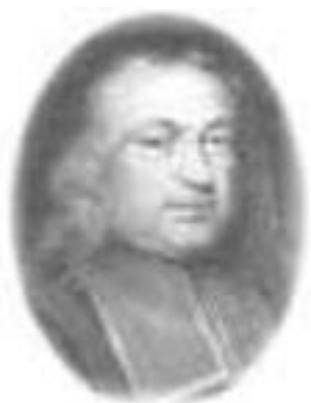
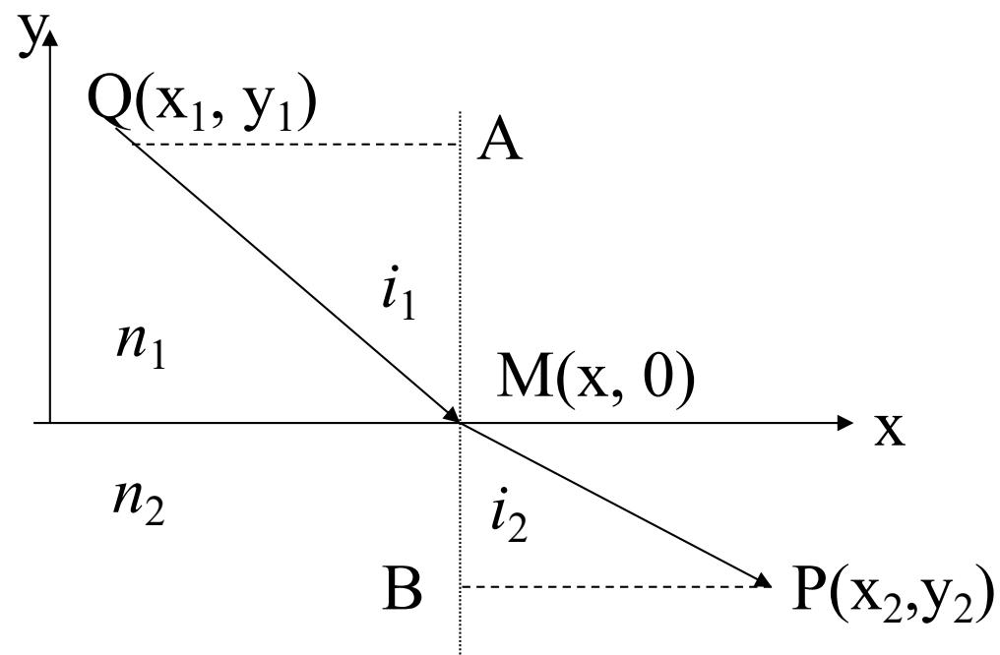

> [!tip] 🧠 通俗理解：费马的“偷懒哲学”
> 想象你在沙滩上救人，你不能走直线！因为你在沙滩（跑得快）和海水（游得慢）里的速度不同，为了最快救人，你应该在沙滩多跑点，海水少游点。
> ——这也是光学的最高法则：**费马原理 (Fermat's Principle)**。
> 这个原理用一句话概括就是：光总是**挑“最省时间”的路走**。既然前一节我们说过，时间 $\Delta t \propto L$，所以也可以说：光总是沿着**使得光程成为平稳值（极小值等）的路径传播**。

### 一、 费马原理的数学表达 (变分法)

费马原理将纷繁复杂的几何光学定律压缩成了一个极简的数学语言——**变分法下的极值问题**。

光从 $Q$ 点传播到 $P$ 点，总光程 $L(QP) = \int_{Q}^{P} n(r)ds$。这里涉及到高级数学中的“变分法”，我们要从数学和物理的直观定义来直接理解其中的两个核心概念：

- **什么是“泛函” (Functional)？** 
  普通函数 $f(x)$ 的自变量是一个**数值** $x$。而光程 $L$ 的自变量是一整条具体的**空间几何路径** $l$。你需要输入一条从 $Q$ 到 $P$ 的连续完整曲线，它才能算出一个总光程数值。这种“以整条路径为自变量的函数”，在数学上严格称为“泛函”。
- **什么是“变分为零” ($\delta L = 0$)？** 
  在普通微积分中，当函数 $f(x)$ 取得极值（极小或极大值）时，其一阶导数为零（即差分 $df=0$）。这意味着在极值点附近微小改变自变量 $x$，函数值 $f(x)$ 的变化量为零（至少在一阶项上为零）。
  把这个概念推广到路径上：如果我们把光实际走的那条路径 $l$ 稍微挪动一点，变成另一条邻近的假想路径 $l'$，这叫做路径的“变分”（记为 $\delta$）。因为真实光路对应的光程 $L$ 恰好是一个极值（或平稳值），所以在真实路径附近做微小偏离时，光程的变化量（即变分 $\delta L$）为零。

用数学符号表示这种“在真实光路上微调，积分结果的一阶改变为零”的极值条件，即为：
$$\delta \int_{Q}^{P} n(r) ds = 0 \quad \text{或} \quad \delta L(l) = 0$$

这条式子就是**费马原理的数学表达式**。

![[微信图片_20260514171207_586_289.jpg]]

把这条式子按“整条路径”来读，会更清楚：

- 从 $Q$ 到 $P$ 不止一条可能路径，记其中任意一条候选路径为 $l$。
- 路径上的微元弧长记为 $ds$，路径经过位置 $\vec{r}$ 处的折射率写成 $n(\vec{r})$。
- 因而这条路径对应的光程泛函可以写成：

$$L(l)=\int_Q^P n(\vec{r})\,ds$$

- 光真正走的那条路，不是“随便一条”路，而是使光程成为==平稳值==的路径，所以有：

$$\delta L(l)=\delta \int_Q^P n(\vec{r})\,ds=0$$

这里要特别注意，费马原理说的是==平稳值==，不是机械地等同于“最小值”。多数情况下它表现为极小值，但在某些特殊光学系统中，也可能表现为极大值或常值。

### 二、 所谓“平稳值”到底是什么？

> [!warning] 注意
> 我们常说光走“最短时间”或“最短光程”，这其实不严谨！正确的说法是**极值或平稳值**，它包含三种完全不同的物理含义：

1. **极小值 (最常见)：**
   一般情况下的折射和反射，光线追求的是最小化光程。比如在均匀介质中，两点之间直线最短（光程极小）。
2. **常数 (等光程系统)：**
   这种最为巧妙，对应于**理想成像系统（如透镜聚光）**。当你从物点发出的所有光线都能汇聚到像点时，意味着它们**走的所有路径，其光程全都是一个常数（彼此相等）**！这就是前一节所讲透镜“等光程性”的底层原理。
3. **极大值 (较罕见)：**
   比如在内凹的椭球面或球面反射镜内部，特定的光线路径不仅不是最短，反而是光程的极大值。

### 三、 费马原理能推出什么结论？

把“光程取平稳值”作为总原则后，很多几何光学结论都能统一推出：

- ==反射定律==和==折射定律==，都可以看成费马原理在具体边界条件下的直接结果。
- 在近轴条件下，如果把路径与界面的几何关系写成光程函数，就能进一步推出对应的==成像公式==。
- 对满足成像条件的反射面或折射面，也可以从“==等光程==”这个角度来理解它们的几何性质。

这也是费马原理的重要意义：它不是一条孤立结论，而是几何光学多条规律背后的统一出发点。

### 四、 费马原理的具体应用：推导折射定律

前面说“变分为零”很抽象，那在做题或推导中具体怎么用呢？
**实际应用的核心思路只有三步**：
1. **设未知量找路径**：起点 $Q$ 和终点 $P$ 位置是固定的，光只有在界面上打中的那个点 $M$ 是未知的。假设 $M$ 点的横坐标是 $x$，不同的 $x$ 代表不同的光线路径。
2. **写出总光程函数**：用这个变动中的M点的横坐标 $x$，写出整条路径的总光程 $L(x)$ 的代数表达式。
3. **求导等于零找极值**：根据费马原理，光一定会选择使得光程 $L$ 最小（或平稳）的那条路径。在数学求极值的方法中，就是**对光程 $L$ 求一阶导数，并让结果等于 0**。解出这个方程，就能得到真实光线对应的折射规律。

下面我们具体实操一次：

**第一步：写出总光程表达式**
设光从折射率为 $n_1$ 的介质经过 $M(x, 0)$ 点进入 $n_2$。$Q \to M \to P$ 的总光程就是两部分折射率乘上几何距离：
$$L = n_1 \overline{QM} + n_2 \overline{MP} = n_1 \sqrt{y_1^2 + (x - x_1)^2} + n_2 \sqrt{y_2^2 + (x_2 - x)^2}$$

**第二步：应用费马原理（对未知点求导 = 0）**
只有 $x$ 是自变量。我们让光程 $L$ 对光线入射横坐标 $x$ 求一阶导数，并令其为零（这一步就是把物理原理 $\delta L=0$ 变成了计算公式）：
$$\frac{dL}{dx} = n_1 \frac{x - x_1}{\sqrt{y_1^2 + (x - x_1)^2}} - n_2 \frac{x_2 - x}{\sqrt{y_2^2 + (x_2 - x)^2}} = 0$$

**第三步：结合几何关系得出规律**
其实你不需要死算代数，观察图中的直角三角形的边长关系，刚好有：
- 入射角正弦 $\sin i_1 = \frac{x - x_1}{\overline{QM}}$ 
- 折射角正弦 $\sin i_2 = \frac{x_2 - x}{\overline{MP}}$

把正弦代入到那串长长的导数方程里，立刻化简得到：
$$n_1 \sin i_1 - n_2 \sin i_2 = 0 \quad \Rightarrow \quad n_1 \sin i_1 = n_2 \sin i_2$$
这就是著名的斯涅尔折射定律！这就说明费马原理“挑极值”的哲学，在数学微积分的操作下，能直接严格证明出折射定律。

在上述证明过程中，没有用到别的已知定律——除了费马原理，一个纯粹的数学假设