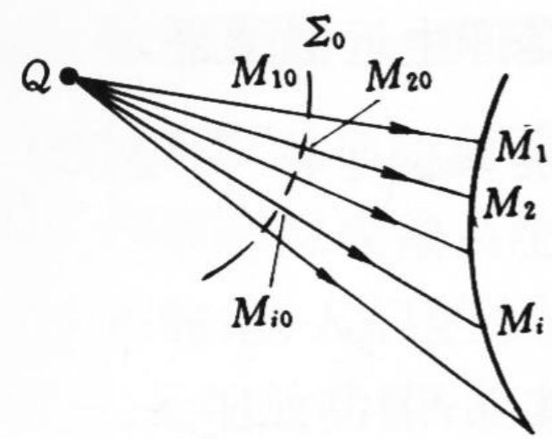
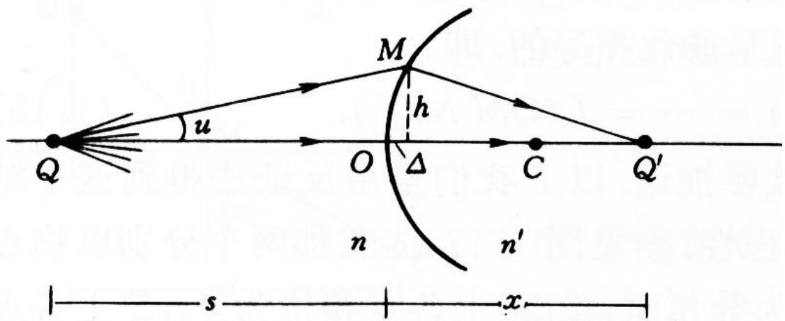
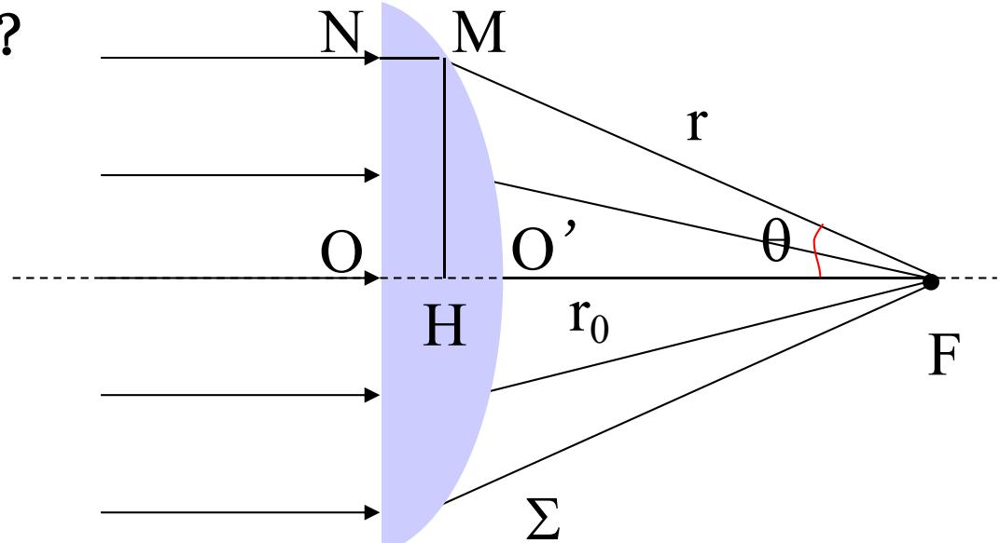

> [!tip] 🧠 通俗理解：透镜为什么能“成像”？
> 如果让一群人分头从 A 出发去 B，有人走直线，有人绕远路，大家肯定到达时间不同，结果在 B 点队伍变得稀稀拉拉（不聚焦/模糊）。
> 怎么让大家在同一地点、**同一瞬间**汇合（形成最清晰的像）？唯一的办法是：**人为给走直线的人增加阻力（玻璃中间厚），给绕远路的人减轻阻力（玻璃边缘薄）**。
> 这就是透镜的本质：利用**等光程性**，让所有方向的光“同时抵达像点”。

### 一、 终极结论：成像与光程的绑定关系

费马原理指出，要想让物点 $Q$ 发出的光通过复杂介质后，全部汇聚在像点 $Q'$ 上，必须满足一种极端情况：所有可能到达 $Q'$ 的光线路径，其光程必须完全相等！

$$L(QM_1 Q') = L(QM_2 Q') = \dots = L(QM_i Q') = \text{常数}$$

这条定则建立了**成像**和**光程**之间绝对的对应关系：
1. **严格等光程** $\Leftrightarrow$ **严格成像**（完美聚焦，没有像差）
2. **近似等光程** $\Leftrightarrow$ **近似成像**（如近轴光线的聚焦，稍有误差）
3. **非等光程** $\Leftrightarrow$ **不成像**（一片模糊散开）

### 二、 近似等光程：单球面傍轴成像公式

我们中学学过的薄透镜成像公式，其实根本不需要复杂的几何画图和折射定律，只用“等光程”就能暴力求解。

我们要证明：只要光线足够靠近中心光轴（傍轴条件），不同高度的光束走过的光程几乎是一样长的。
**第一步：分别写出边缘光线和中心光线的光程**
- **中心光线光程**：直接沿着中心轴直线走，所以 $L(中心) = ns + n'x$
- **边缘光线光程**：途经球面上的 $M$ 点，$M$ 点距离光轴高度为 $h$，水平方向比球面顶点 $O$ 退后了凹陷量 $\Delta$。由勾股定理可得其总光程为：$n \sqrt{(s+\Delta)^2 + h^2} + n' \sqrt{(x-\Delta)^2 + h^2}$

**第二步：应用“极端近似”化简根号**
因为光线非常靠近光轴，$h$ 和 $\Delta$ 是极小量。在球面的几何性质中有一个近似结论：$h^2 \approx 2r\Delta$。
把复杂的根号利用数学中的泰勒展开公式（$\sqrt{1+y} \approx 1+\frac{y}{2}$）进行拆解，边缘光程可以化为：
$$ns \left(1 + \frac{r+s}{s^2}\Delta\right) + n'x \left(1 + \frac{x-r}{x^2}\Delta\right)$$

**第三步：让“边缘光程 = 中心光程”解出公式**
为了能“成像”，我们强制令两边的光程相等：
$$ns + n\frac{r+s}{s}\Delta + n'x + n'\frac{x-r}{x}\Delta = ns + n'x$$
你会发现等式两边的 $ns + n'x$ 直接完美抵消，然后再约掉共同的极小量 $\Delta$，只要稍微移项，立刻得出极其优美简洁的**球面折射傍轴成像公式**：
$$ \frac{n}{s} + \frac{n'}{x} = \frac{n' - n}{r} $$
*(注：完全不需要画繁琐的入射角、折射角三角形去算三角函数，纯靠“光程相等”这一条方程直接暴力秒杀。)*

### 三、 严格等光程：如何完美聚焦平行光？

什么样的透镜能把一束平行光**完美无瑕疵**地聚焦到一个点 $F$（不能有任何傍轴近似）？
答案是一定要实现**严格等光程**：任意高度光线走过的光程 $L(NMF)$，必须等于中心光轴上的光线走过的光程 $L(OO'F)$。

**第一步：列出“严格等光程”方程**
为了让宽光束完美聚焦在一点，所有的光走的光程必须精分不差地完全相等。我们取代表性的两束光来建立等式：
1. 边缘高度进来的光：在玻璃中走 $N \to M$，出射后在空气中走 $M \to F$。
2. 走中心光轴的光：epsilon0在玻璃中走到突出的顶点，然后再走常数焦距 $r_0$ 到达 $F$ 点。
让这两条路径的光程相等，抵消掉入射前的公共部分，提炼出的核心代数等式就是：
$$\overline{MF} = n \cdot (\text{中心光轴比边缘多走出的那段厚度玻璃}) + r_0$$

**第二步：放入极坐标系解出边缘面形状**
设透镜焦点 $F$ 为极点，折射出来的光线 $MF$ 的长度设为 $r(\theta)$，出射角度设为 $\theta$。利用简单的三角函数把刚才文字描述的那段玻璃厚度用极坐标写出来，等式就变成了：
$$r(\theta) = n \cdot [ r(\theta)\cos\theta - r_0 ] + r_0$$
把带有 $r(\theta)$ 的因式都移到等号左边并合并同类项，就能精确解出透镜表面的极坐标函数方程：
$$ r(\theta) = \frac{(1 - n)r_0}{1 - n \cos \theta} $$

**第三步：揭晓这个函数的真实身份**
在解析几何中，形如 $r = \frac{ed}{1 - e \cos \theta}$ 的方程是标准的**圆锥曲线**方程，其中分母的系数 $e$ 叫作圆锥曲线的“离心率”。
对比我们刚刚解出来的结果，发现**玻璃的折射率 $n$ 刚好充当了离心率 $e$ 的角色！** 
既然玻璃的折射率 $n > 1$，那就意味着 $e > 1$。在数学定义里，离心率大于 1 的曲线必定是**双曲线**！
这一下从物理直接贯通到了几何：为了不带任何误差、完美地聚集平行光带，透镜的凸面不能敷衍了事做成球面，其三维形状必须是非常精密的**旋转双曲面**。这就是为什么高端相机镜头必须花高价使用非球面镜片（Aspherical Lens）背后的硬核物理定理。