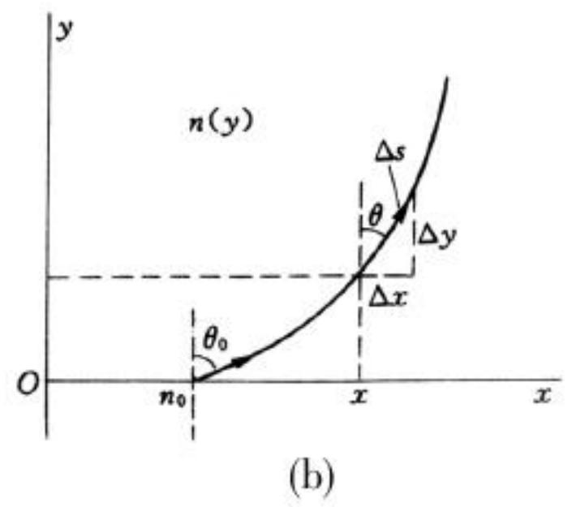
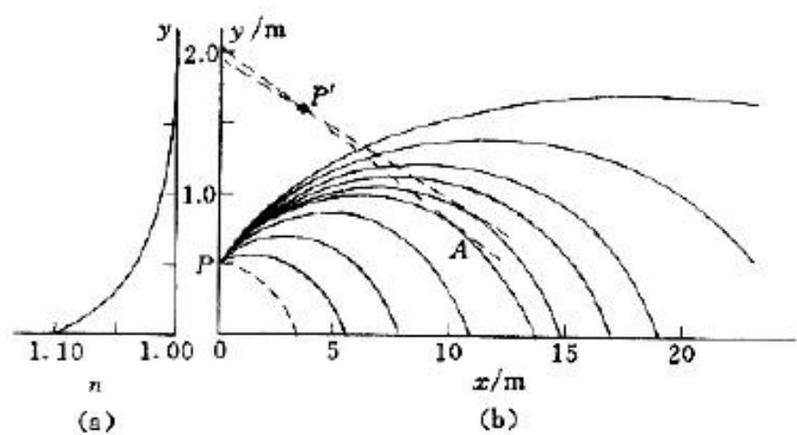
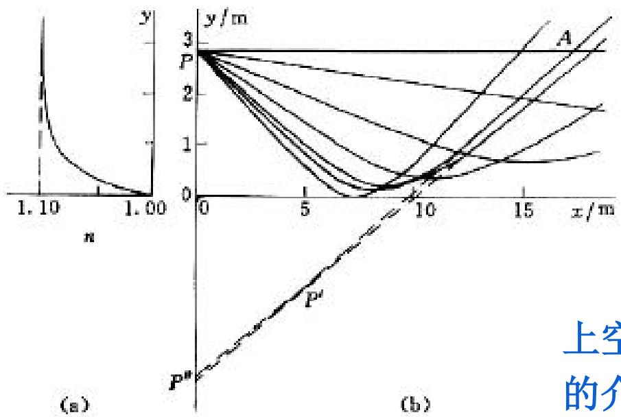

> [!tip] 🧠 通俗理解：什么是“变折射率”与“折射不变量”？
> 想象你在玩赛车游戏，平时玩的赛道要么全是柏油路，要么全是泥地，车子走直线（均匀介质）。
> 但现在有一种“渐变赛道”，从下到上泥层越来越厚（折射率 $n$ 随高度 $y$ 变化）。你的车轮一边受阻大，一边受阻小，车子就会不自觉地**拐弯打滑**。这就是光在“变折射率介质”中走曲线的原因。
> 怎么算它拐弯的轨迹？物理学家教你一招：把渐变赛道切成无数个极薄的“千层糕”。根据斯涅尔定律，只要介质是横跨平铺的，光每穿过一层，它的 **当前层折射率 $n(y)$ 与入射角正弦 $\sin\theta(y)$ 的乘积永远是一个死规矩（常值）**！

本章标题叫《费马原理与变折射率光学》，这就是本章的后半壁江山。它的核心在于解决：**当折射率不再是常数，而是坐标的函数 $n(y)$ 时，光会怎么走？**

### 一、 终极武器：折射不变量（广义斯涅尔定律）

*(图：介质折射率连续变化时的光线弯曲径迹)*

当介质只在某一个方向（例如高度 $y$ 方向）折射率发生逐步递增或递减时，我们可以将其视作无数片极薄的、折射率不同的均匀平行介质层叠在一起。
光在跨过每一层界面时，都会严格遵循斯涅尔折射定律：
$$n_0 \sin\theta_0 = n_1 \sin\theta_1 = n_2 \sin\theta_2 = \dots = n(y) \sin\theta(y)$$
这意味着，不论光线在里面怎么蜿蜒曲折，**在任意高度 $y$ 处，该点的折射率与此处光线方向相对于法线（$y$ 轴）夹角的正弦值之乘积，等于光刚射入时的初始乘积**。
这个被死死锁定的定值，就叫 **折射不变量 $C$**。
换句话说，$n(y) \sin\theta(y) = \text{常数}$，这就是破解所有变折射率题目（如习题 1.6）的唯一钥匙！

### 二、 推出“光线方程”微分式

知道了这个不变量，我们就能算光线的真实几何轨迹 $\frac{dy}{dx}$ 了。
在微积分几何中，一小段光线微元 $ds$ 满足：$(ds)^2 = (dx)^2 + (dy)^2$，稍作除法变形就是：
$$\left(\frac{dy}{dx}\right)^2 = \left(\frac{ds}{dx}\right)^2 - 1 = \frac{1}{\sin^2\alpha} - 1$$
*(注：这里的 $\alpha$ 是光线与 $x$ 轴的夹角，刚好和前面提的法线夹角 $\theta$ 互为余角，所以其实这就是 $\cot^2\theta$ )*

结合我们的“折射不变量”代入，立刻得到光线在物理中的基础轨迹偏微分方程：
$$\left( \frac{dy}{dx} \right)^2 = \frac{n^2(y)}{n_0^2 \sin^2\theta_0} - 1$$
只要你给我一个介质变化的规律 $n(y)$，比如等于某个 $ay^2$ 或别的，塞进这个等式里求两边积分，就能准确算出光弯曲成了什么形状的曲线！

### 三、 自然界的大型魔术：海市蜃楼

为什么会有海市蜃楼？这是变折射率光学在自然界最宏大的展现。

**1. 寒冷海面：正宗的海市蜃楼**

海面冷，高空热。空气温度越低，折射率越大。所以 $y$ 越高，$n(y)$ 越小。
远处轮船发出的光，原本倾斜向上射，但因为高空折射率小，“折射不变量”强迫它发生连续折射，直到发生全反射又弯回地面人的眼睛里。人的大脑习惯认为光走直线，所以就把源自海面的船看成了挂在半空中的悬浮倒影。

**2. 炽热沙漠：沙洲神泉**

沙漠地面极热，高空冷。地面附近的靠近地皮的空气折射率极低。
天空的蓝光射向沙漠，在贴近地皮的时候由于折射率不够，被连续反折“抬头”进入骆驼/旅人的眼睛里。因为人往下看却看到了蓝天，大脑就会以为前方地上有一大片反射着蓝光的水滩，也就是所谓的沙漠水柱“神泉”了。