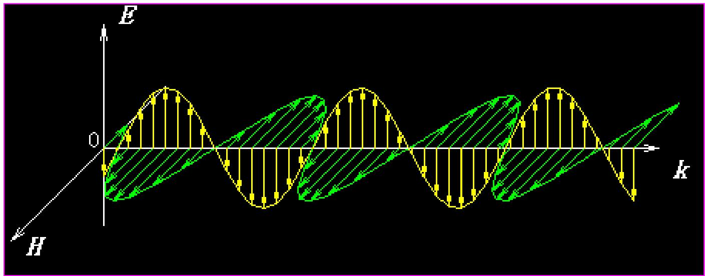
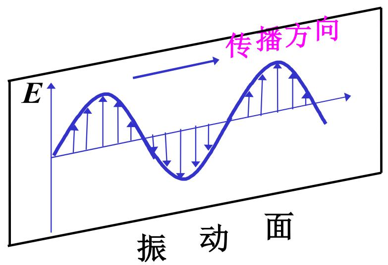
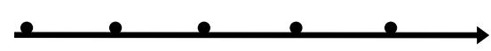
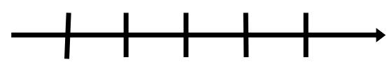

# 7.1.1 ==偏振态==的定义与==线偏振光==

> **脉络**：前面在[[2.1.2 电磁波的横波与正交特性|电磁波的横波与正交特性]]中已经知道，光波的电场 $\vec{E}$ 和磁场 $\vec{H}$ 都垂直于传播方向 $\vec{k}$。第七章从这个结论继续往下走：既然 $\vec{E}$ 只能在垂直于 $\vec{k}$ 的横平面内振动，那么 $\vec{E}$ 在这个平面内怎样振动，就决定了光的==偏振态==。

---

### 一、 为什么光有偏振态

教材先强调一句话：==光波是横波==。

平面电磁波满足麦克斯韦方程组中的无源散度方程：

$$
\nabla \cdot \vec{E}=0,\qquad \nabla \cdot \vec{H}=0
$$

把平面波形式代入以后，可以得到：

$$
\vec{E}\perp \vec{k},\qquad \vec{H}\perp \vec{k}
$$

这说明电场和磁场都不沿传播方向振动，而是在垂直于传播方向的横平面中振动。教材还给出电场和磁场的关系：

$$
\mu\mu_0 \vec{H}=\frac{1}{\omega}\vec{k}\times \vec{E}
$$

这个式子说明三件事：

- $\vec{H}$ 的方向由 $\vec{k}\times \vec{E}$ 决定，所以 $\vec{H}$ 同时垂直于 $\vec{k}$ 和 $\vec{E}$。
- $\vec{E}$、$\vec{H}$ 和 $\vec{k}$ 互相构成右手关系。
- 在同一束平面光波中，电场和磁场同步振荡，即教材写的 $\varphi_H=\varphi_E$。

因为后续讨论光与物质相互作用时，主要起作用的是电场矢量，所以物理光学里常把电场矢量 $\vec{E}$ 称为==光矢量==。这一点也可以和[[3.3.3 维纳实验(光波交互本源)|维纳实验]]联系起来：实验结论说明感光作用主要由电场分量决定，而不是由磁场分量决定。

---

### 二、 偏振态的定义

教材给出的定义是：

> ==偏振态==：电场矢量在与光传播方向垂直的平面内的振动状态。

这句话要抓住两个限制：

#### 1. 只看电场矢量

研究偏振时，默认研究的是 $\vec{E}$ 的振动方向、大小和相位关系。磁场 $\vec{H}$ 不是没有意义，而是它已经由 $\vec{k}$ 和 $\vec{E}$ 共同决定：

$$
\vec{H}\propto \vec{k}\times \vec{E}
$$

所以只要知道 $\vec{E}$ 怎样振动，就基本知道了这一束光的偏振状态。

#### 2. 只在横平面内讨论

由于 $\vec{E}\perp \vec{k}$，偏振态不是三维空间里任意方向的振动，而是在垂直于传播方向的二维平面内讨论。这个横平面可以选取两条互相垂直的坐标轴，例如 $x$ 轴和 $y$ 轴，然后把电场写成：

$$
\vec{E}=E_x\hat{x}+E_y\hat{y}
$$

后面所有线偏振、圆偏振、椭圆偏振的判断，本质上都是判断 $E_x$ 和 $E_y$ 这两个正交分量的==振幅关系==和==相位关系==。

---

### 三、 什么是线偏振光

==线偏振光==是最简单的偏振态：在空间某一点观察时，电场矢量 $\vec{E}$ 的方向始终沿一条固定直线来回振动。

也就是说，虽然 $\vec{E}$ 的大小随时间周期变化，但它的振动方向不转动。面对光的传播方向看，电场矢量的端点只在一条直线上往复运动。

教材把线偏振光分解到两个互相垂直方向：

$$
\left\{
\begin{array}{l}
E_x=E_{0x}\cos(\omega t+\pi)\\
E_y=E_{0y}\cos\omega t
\end{array}
\right.
\qquad
\left\{
\begin{array}{l}
E_{0x}=E_0\cos\alpha\\
E_{0y}=E_0\sin\alpha
\end{array}
\right.
$$

这里各量的含义是：

- $E_x$、$E_y$ 是电场在两个正交方向上的分量。
- $E_{0x}$、$E_{0y}$ 是两个分量的振幅。
- $\alpha$ 表示总电场方向相对于所选坐标轴的方位角。
- 两个分量之间的相位差为 $\pi$，所以它们始终同相或反相地变化。

相位差为 $0$ 或 $\pi$ 时，两个分量的比值在时间中保持不变：

$$
\frac{E_y}{E_x}=\text{常数}
$$

这就说明合电场方向固定，因此电场端点只能沿一条直线运动。这就是线偏振光的数学判断。

---

### 四、 线偏振光可以沿任意两个正交方向分解

教材强调：==线偏振光可沿两个相互垂直的方向分解==。

这句话很重要，因为后面分析反射、折射、晶体双折射时，通常不会直接使用原来的振动方向，而是先把它分解成两个方便处理的正交分量。

例如第三章中处理斜入射界面问题时，我们把电场分解成：

- $p$ 分量：电场振动方向平行于入射面；
- $s$ 分量：电场振动方向垂直于入射面。

这正是[[3.1.2 特征振动方向(p与s分量)|p 与 s 特征振动方向]]的内容。这样分解以后，两个偏振分量在各向同性介质界面上的反射和折射可以分别独立处理，再用[[3.2.1 菲涅耳公式与复振幅反射率|菲涅耳公式]]求各自的反射系数和透射系数。

对一束线偏振光来说，若它与 $p$ 方向夹角为 $\alpha$，就可以写成：

$$
E_p=E_0\cos\alpha,\qquad E_s=E_0\sin\alpha
$$

对应的光强分量满足：

$$
I_p\propto E_p^2,\qquad I_s\propto E_s^2
$$

所以偏振分解不只是几何投影，也直接决定能量在两个正交偏振方向上的分配。

---

### 五、 线偏振光的表示方法

教材中给出了线偏振光的常用图示方法：用双箭头或短线表示电场振动方向。

常见说法有两种：

#### 1. 光振动垂直板面

如果电场方向垂直于纸面或屏幕平面，常用点、叉或类似符号表示。点可以理解为电场指向观察者，叉可以理解为电场背向观察者。

#### 2. 光振动平行板面

如果电场方向就在纸面或屏幕平面内，通常直接用一条带箭头的线段表示振动方向。

这类表示法在后面会频繁出现。读图时要先分清：图中画出的箭头一般表示的是==电场振动方向==，不是光线传播方向。光线传播方向通常由 $\vec{k}$ 或光路箭头表示。

---

### 六、 本节和前面知识的联系

#### 1. 和电磁波横波性的联系

偏振现象只会出现在横波中。纵波只有沿传播方向的压缩和稀疏，没有横向振动方向可供区分。光有偏振态，正是因为光的电场矢量在横平面内振动，这和[[2.1.2 电磁波的横波与正交特性|光波是横波]]完全一致。

#### 2. 和界面反射折射的联系

在第三章中，反射和折射已经多次用到偏振分解。比如[[3.2.2 外反射与布儒斯特角|布儒斯特角]]处 $p$ 分量反射率为零，反射光会变成纯 $s$ 线偏振光。这说明偏振态不是单独的概念，它会直接影响光在界面处的能量分配。

#### 3. 和后续晶体光学的联系

晶体中不同振动方向的电场会看到不同的折射率。后面学习双折射时，所谓 o 光和 e 光，本质上就是晶体把入射光分解成两个特定偏振方向的光，并让它们以不同速度传播。

---

### 七、 本节需要记住的结论

> **结论一**：光波是横波，$\vec{E}\perp\vec{k}$，$\vec{H}\perp\vec{k}$，且 $\vec{E}$、$\vec{H}$、$\vec{k}$ 互相垂直。

> **结论二**：偏振态描述的是电场矢量 $\vec{E}$ 在垂直于传播方向的横平面内怎样振动。

> **结论三**：线偏振光中，电场矢量始终沿固定直线往复振动。若把它分解成两个正交分量，则两个分量的相位差为 $0$ 或 $\pi$。

> **结论四**：线偏振光可以沿任意两个正交方向分解。第三章的 $p$ 分量和 $s$ 分量就是这种分解在界面问题中的具体应用。
