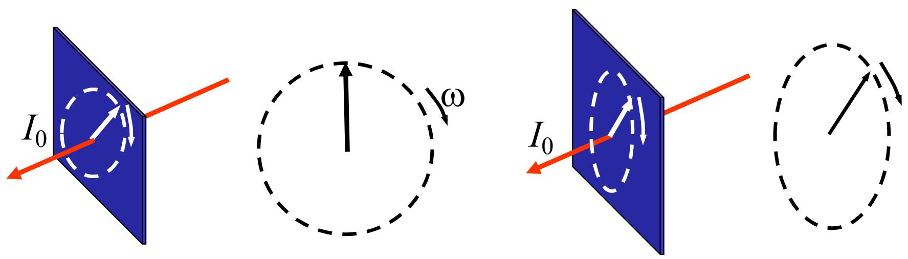
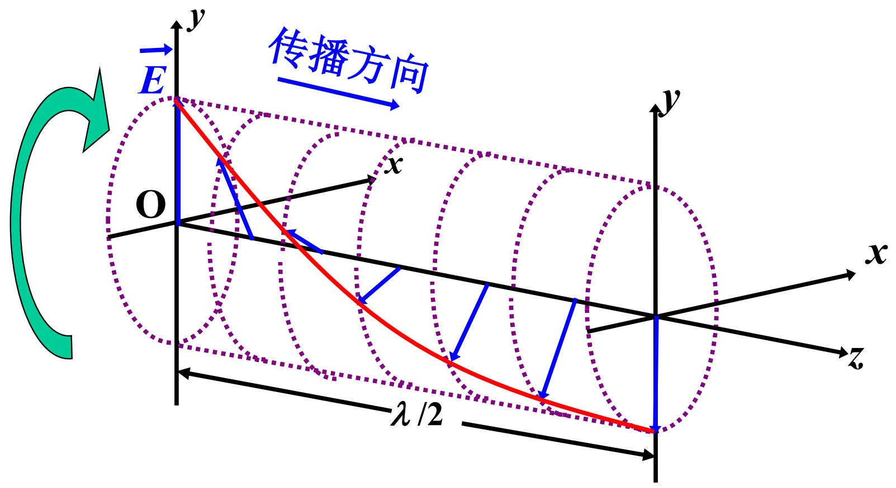
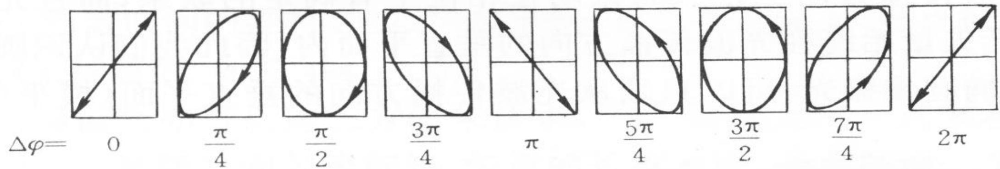

# 7.1.2 ==圆偏振光==和==椭圆偏振光==

> **脉络**：在[[7.1.1 偏振态的定义与线偏振光|线偏振光]]中，两个正交电场分量的相位差为 $0$ 或 $\pi$，所以合电场方向固定。本节讨论另一种情况：两个正交分量同频振动，但相位差不是 $0$ 或 $\pi$。此时合电场的方向会随时间转动，电场端点的轨迹可以成为圆或椭圆。

---

### 一、 圆偏振光和椭圆偏振光的直观定义

教材给出的描述是：在垂直于光传播方向的平面内，光矢量以一定频率旋转。

这里的“光矢量”仍然指电场矢量 $\vec{E}$。在空间某一点观察时，如果 $\vec{E}$ 的端点不是沿固定直线往复运动，而是在横平面内转动，就会出现圆偏振光或椭圆偏振光。

- ==圆偏振光==：电场矢量端点的轨迹是圆。
- ==椭圆偏振光==：电场矢量端点的轨迹是椭圆。

这两个定义要注意观察对象：

- 固定空间某一点看：看的是 $\vec{E}$ 随时间怎样转动。
- 固定某一时刻看不同空间位置：看的是沿传播方向上，不同位置的 $\vec{E}$ 方向怎样排布。

教材给出的右旋圆偏振图就同时提示了这两个角度。圆偏振光沿 $z$ 方向传播时，在同一时刻，不同 $z$ 位置的电场方向会依次转过不同角度。

---

### 二、 数学本质：两个正交线偏振光的合成

教材的核心结论是：

> 圆偏振光和椭圆偏振光可以看成是两个同频、振动方向相互垂直、并且有稳定相位关系的线偏振光合成的结果。

也就是说，一束圆偏振光或椭圆偏振光可以分解成两个正交线偏振分量：

$$
\left\{
\begin{array}{l}
E_x=E_{0x}\cos\omega t\\
E_y=E_{0y}\cos(\omega t+\Delta\varphi)
\end{array}
\right.
$$

这里需要同时看三个条件：

#### 1. 同频

两个分量都含有同一个角频率 $\omega$。如果频率不同，合成轨迹一般不会稳定成一个固定的圆或椭圆，而会随时间改变。

#### 2. 方向互相垂直

$E_x$ 和 $E_y$ 是横平面内两条正交方向上的电场分量。这和[[3.1.2 特征振动方向(p与s分量)|p、s 正交分解]]的思想相同：先选一组正交方向，再分别分析各分量。

#### 3. 相位差稳定

$\Delta\varphi$ 必须是稳定常数。这里“稳定”很关键，它和[[4.2.2 相干叠加的三个条件及其原因分析|相干叠加的相位差稳定条件]]是同一种要求：如果两个分量相位差不断随机变化，电场端点轨迹就不能保持稳定的圆或椭圆。

---

### 三、 从相位差判断偏振态

把一束光分解为 $x$、$y$ 两个正交分量后，偏振态主要由 $E_{0x}$、$E_{0y}$ 和 $\Delta\varphi$ 决定。

#### 1. 线偏振光

当

$$
\Delta\varphi=0 \quad \text{或} \quad \Delta\varphi=\pi
$$

两个分量同相或反相，合电场方向固定，得到线偏振光。

#### 2. 圆偏振光

当两个正交分量振幅相等，并且相位差为四分之一周期：

$$
E_{0x}=E_{0y},\qquad \Delta\varphi=\pm\frac{\pi}{2}
$$

合电场端点轨迹为圆，得到圆偏振光。

可以把它理解成：$x$ 方向分量达到最大时，$y$ 方向分量正好过零；过了四分之一周期以后，$y$ 方向分量达到最大，$x$ 方向分量过零。两个方向轮流达到最大，使合电场大小保持不变，而方向连续转动。

#### 3. 椭圆偏振光

更一般地，如果

$$
E_{0x}\ne E_{0y}
$$

或者

$$
\Delta\varphi \ne 0,\ \pi,\ \pm\frac{\pi}{2}
$$

合电场端点通常为椭圆。圆偏振光可以看成椭圆偏振光的特殊情况：椭圆的长轴和短轴相等时，椭圆就退化为圆。

---

### 四、 右旋和左旋的含义

教材提到“右旋圆和椭圆偏振光”。旋向描述的是：面对光的传播方向观察时，电场矢量端点随时间转动的方向。

不同教材对“右旋”“左旋”的观察方向约定可能不同，所以做题时要先看教材定义。当前阶段需要先记住：

- 圆偏振光和椭圆偏振光都有旋向。
- 旋向由 $\Delta\varphi$ 的正负决定。
- 改变 $\Delta\varphi$ 的符号，会把右旋变成左旋，或把左旋变成右旋。

后面学习波片时，四分之一波片的作用就是给两个正交分量引入 $\pm\pi/2$ 的相位差，从而在线偏振光和圆/椭圆偏振光之间转换。

---

### 五、 和全反射相移的联系

第三章中已经遇到过一个产生圆/椭圆偏振的机制：全反射。

在[[3.2.3 内反射与全反射临界角|全反射相移]]中，$p$ 分量和 $s$ 分量的反射率模值都为 1，但它们获得的相位延迟一般不同：

$$
\Delta\delta=\delta_p-\delta_s \ne 0
$$

如果入射光原来是含有 $p$、$s$ 两个分量的线偏振光，全反射后这两个分量之间就会产生新的相位差。于是原来的线偏振光可能变成椭圆偏振光，特殊条件下也可能变成圆偏振光。

这和本节公式完全一致：只要两个正交分量同频、振幅合适、相位差稳定，就可以形成圆偏振光或椭圆偏振光。全反射、波片和晶体双折射，本质上都是改变两个正交偏振分量之间的相位关系。

---

### 六、 本节需要记住的结论

> **结论一**：圆偏振光和椭圆偏振光中，电场矢量 $\vec{E}$ 的方向随时间转动；端点轨迹为圆时是圆偏振光，为椭圆时是椭圆偏振光。

> **结论二**：圆偏振光和椭圆偏振光都可以分解为两个同频、互相垂直、相位差稳定的线偏振分量。

> **结论三**：若 $E_{0x}=E_{0y}$ 且 $\Delta\varphi=\pm\pi/2$，得到圆偏振光；一般情况下得到椭圆偏振光；若 $\Delta\varphi=0$ 或 $\pi$，则退化为线偏振光。

> **结论四**：旋向由相位差正负决定。后面的波片、全反射延迟器和晶体光学器件，本质上都在控制两个正交偏振分量之间的相位差。
