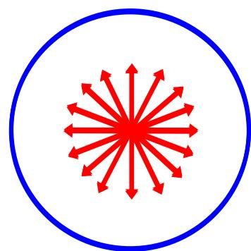
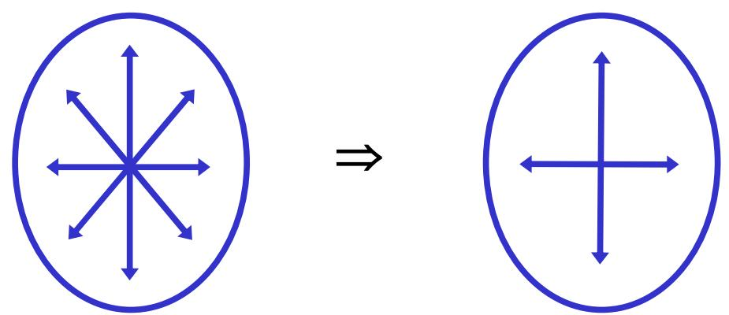
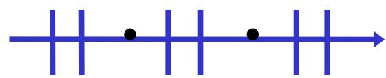
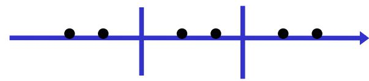

# 7.1.3 ==自然光==、==部分偏振光==与==偏振度==

> **脉络**：前两节讨论的是完全偏振光：线偏振光、圆偏振光、椭圆偏振光都有确定的振动规律。本节讨论实际光源中更常见的情况。自然光没有稳定的优势振动方向；部分偏振光有一定优势方向，但还没有达到完全线偏振。为了定量描述偏振程度，引入==偏振度== $P$。

---

### 一、 自然光的物理图像

教材对自然光的核心描述是：==没有优势方向==。

普通热光源中，大量原子或分子独立发光。每一小段波列可以有自己的电场振动方向，但这些方向在整体上随机分布。经过探测器的时间平均以后，横平面内各个方向没有哪一个方向长期占优势。

所以自然光不是“没有电场振动方向”，而是“电场振动方向在统计平均上没有固定优势方向”。任何瞬间仍然可以有某个具体方向的电场，但这个方向会快速、随机地变化。

---

### 二、 自然光的分解

教材给出结论：

> 一束自然光可分解为两束振动方向相互垂直的、等幅的、无固定相位关系的线偏振光。

可写为：

$$
\left\{
\begin{array}{ll}
E_x=E_{0x}\cos\omega t\\
E_y=E_{0y}\cos(\omega t+\Delta\varphi)
\end{array}
\right.
\qquad
\Delta\varphi\ \text{随机变化}
$$

并且：

$$
E_{0x}=E_{0y},\qquad I=I_x+I_y,\qquad I_x=I_y
$$

这里的关键不是 $x$、$y$ 两个方向有什么特殊性，而是对于自然光，任意选择两条互相垂直的方向，都可以把它看成两个强度相等、相位无固定关系的正交线偏振分量。

这和[[4.2.2 相干叠加的三个条件及其原因分析|相位差稳定条件]]也能联系起来：自然光中两个正交分量的 $\Delta\varphi$ 随机变化，所以它们之间没有稳定的合成轨迹，不会形成线偏振、圆偏振或椭圆偏振那样的固定偏振态。

---

### 三、 部分偏振光的物理图像

==部分偏振光==介于自然光和完全偏振光之间。

它仍然含有随机成分，因此不是完全线偏振光；但它在某一个方向上的光强更大，因此也不是自然光。

教材给出部分偏振光的分解：

$$
\left\{
\begin{array}{ll}
E_x=E_{0x}\cos\omega t & \Delta\varphi\ \text{随机变化}\\
E_y=E_{0y}\cos(\omega t+\Delta\varphi)
\end{array}
\right.
$$

并且：

$$
I=I_x+I_y,\qquad E_{0x}\ne E_{0y},\qquad I_x\ne I_y
$$

因此，部分偏振光可以理解为：两个互相垂直方向上的光强不相等，但相位关系仍然不稳定。

教材给出的图示中，如果平行板面的光振动较强，就表示该方向是优势方向；如果垂直板面的光振动较强，则优势方向换到垂直板面方向。

---

### 四、 自然光怎样变成部分偏振光

第三章已经遇到过最典型的例子：自然光在各向同性介质界面上反射和折射。

自然光可以分解成强度相等的 $p$ 分量和 $s$ 分量。斜入射到界面时，$p$ 分量和 $s$ 分量的反射率一般不同。根据[[3.3.2 偏振态变换与玻片组起偏|界面反射与折射对偏振态的改变]]：

- 反射光中通常 $s$ 分量更强；
- 透射光中通常 $p$ 分量更强；
- 因此反射光和透射光都会从自然光变成部分偏振光。

在布儒斯特角处，反射光中的 $p$ 分量为零，所以反射光可以成为完全 $s$ 线偏振光；但透射光仍然含有 $p$ 和剩余的 $s$ 分量，所以通常只是部分偏振光。这一点在[[3.3.6 反射光偏振态图解与布儒斯特窗应用|反射光偏振态图解]]中已经讨论过。

---

### 五、 偏振度的定义

为了定量描述“偏振得有多强”，教材引入偏振度：

$$
P=\frac{I_{\max}-I_{\min}}{I_{\max}+I_{\min}}
$$

其中：

- $I_{\max}$ 是通过检偏器转动时测得的最大光强，也对应优势振动方向的光强。
- $I_{\min}$ 是通过检偏器转动时测得的最小光强，也对应弱振动方向的光强。
- 分母 $I_{\max}+I_{\min}$ 表示总强度。
- 分子 $I_{\max}-I_{\min}$ 表示两个正交方向强度的不均衡程度。

这个公式的物理意义很直接：如果两个方向强度差别越大，光越接近完全偏振；如果两个方向强度相等，光越接近自然光。

---

### 六、 三种典型情况

#### 1. 完全线偏振光

完全线偏振光只有一个振动方向。把检偏器转到垂直方向时，没有透射光：

$$
I_{\min}=0
$$

所以：

$$
P=\frac{I_{\max}-0}{I_{\max}+0}=1
$$

因此完全线偏振光的偏振度为 1。

#### 2. 自然光

自然光没有优势方向，任意两个正交方向上的平均光强相等：

$$
I_{\max}=I_{\min}
$$

所以：

$$
P=\frac{I_{\max}-I_{\max}}{I_{\max}+I_{\max}}=0
$$

因此自然光的偏振度为 0。

#### 3. 部分偏振光

部分偏振光有优势方向，但弱方向仍然有光强：

$$
I_{\max}>I_{\min}>0
$$

所以：

$$
0<P<1
$$

这正是“部分”的含义：既不是完全随机，也不是完全单方向振动。

---

### 七、 和玻片组起偏的联系

在[[3.3.5 专题例题：玻片组起偏器的偏振度推导|玻片组起偏器的偏振度推导]]中，已经使用过同一个偏振度公式：

$$
P=\frac{I_M-I_m}{I_M+I_m}
$$

那里 $I_M$ 对应透射后较强的 $p$ 分量，$I_m$ 对应被多次反射削弱的 $s$ 分量。随着玻片数增加，$s$ 分量越来越弱，$I_m$ 越来越小，于是 $P$ 越来越接近 1。

这说明偏振度不仅是定义，也可以直接用来评价起偏器的效果。

---

### 八、 本节需要记住的结论

> **结论一**：自然光没有优势振动方向，可分解为两个强度相等、互相垂直、相位差随机变化的线偏振分量。

> **结论二**：部分偏振光有优势振动方向，可分解为两个强度不相等、互相垂直、相位差随机变化的线偏振分量。

> **结论三**：偏振度
> $$
> P=\frac{I_{\max}-I_{\min}}{I_{\max}+I_{\min}}
> $$
> 用来描述偏振程度。线偏振光 $P=1$，自然光 $P=0$，部分偏振光 $0<P<1$。

> **结论四**：自然光经过反射、折射、散射或起偏器后，两个正交分量的强度可能变得不相等，于是会变成部分偏振光或完全偏振光。
