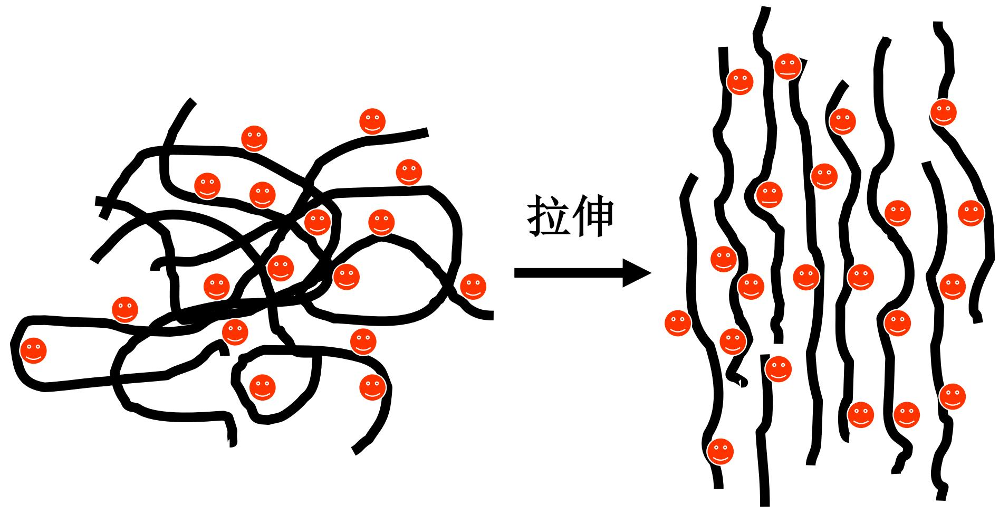
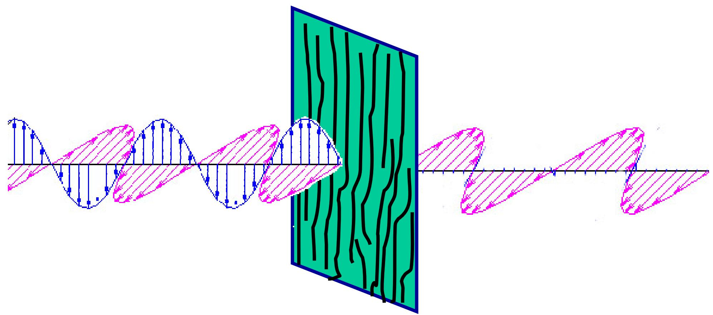
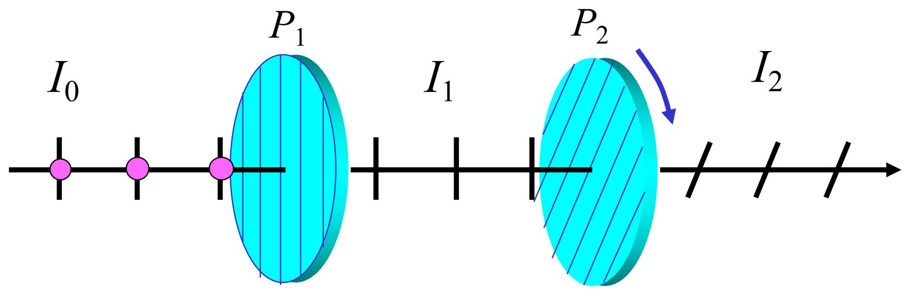
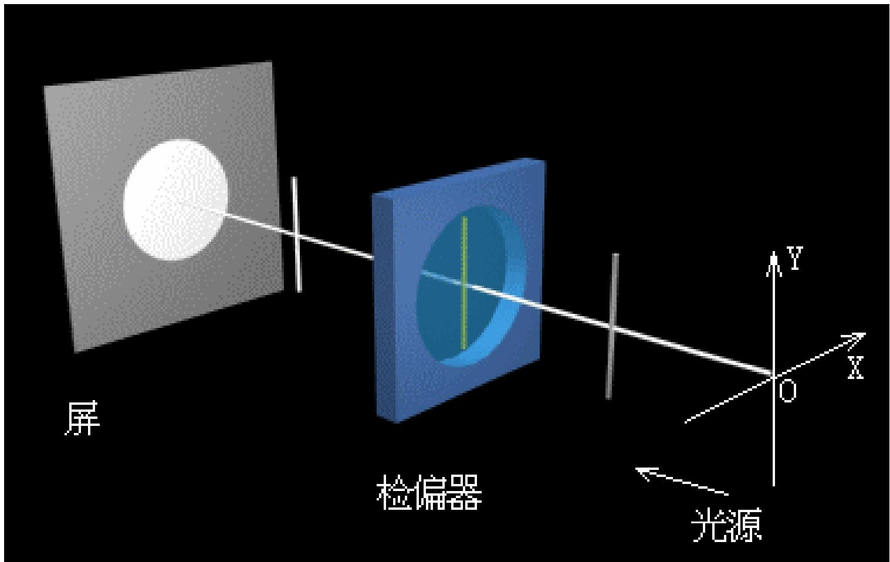
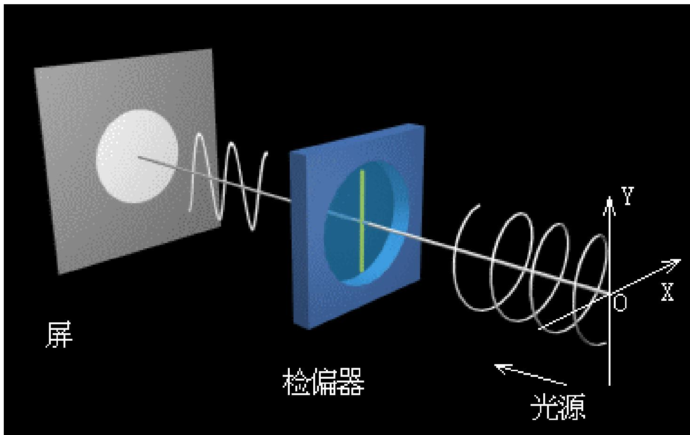
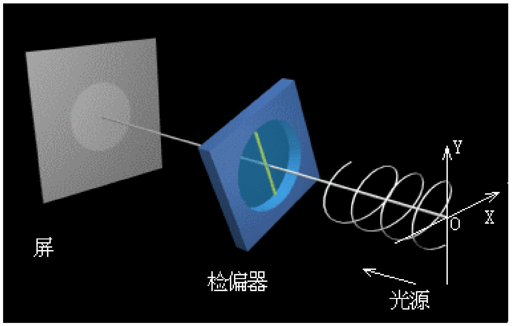

# 7.2.1 ==偏振片==、==起偏器==和==检偏器==

> **脉络**：前面已经把偏振态分成线偏振光、圆偏振光、椭圆偏振光、自然光和部分偏振光。本节开始讨论怎样用器件产生和检查偏振光。核心器件是==偏振片==：它只允许某一特定方向的电场振动较好地通过，从而把入射光中的某个线偏振分量选出来。

---

### 一、 偏振片是什么

教材说，偏振片（Polaroid）是获得线偏振光的平面片状器件，通常用 $P$ 表示。

偏振片的作用可以概括为：

- 对某一方向的电场振动允许通过；
- 对与该方向垂直的电场振动强烈吸收或阻挡；
- 因此输出光主要只剩一个振动方向，成为线偏振光。

这个允许通过的方向通常叫做==透振方向==。读图或做题时，一定要先找偏振片的透振方向，因为后面的马吕斯定律就是围绕入射线偏振光方向和透振方向夹角来写的。

---

### 二、 偏振片的起偏原理

教材列出几种起偏机制：物质的二向色性、散射、反射和折射、双折射等。

本节重点说明偏振片的二向色性机制。某些有机晶体或聚合物薄膜经过拉伸以后，分子链会沿某一方向排列。若再经过碘溶液处理，电子受体分子附着在聚合物链上，使该方向具有类似导电线栅的性质。

教材的表述是：本来无序排列的聚合物薄膜，拉伸以后排列有了方向性，形成导电线栅。

导电线栅的判断可以这样理解：

- 若电场振动方向平行于导电链方向，电子容易沿链方向运动，电场能量容易被吸收。
- 若电场振动方向垂直于导电链方向，电子不容易沿这个方向长距离运动，该分量较容易通过。

所以偏振片并不是“把电场转到某个方向”，而是从入射光中筛选出能通过的分量，同时削弱另一个正交分量。

---

### 三、 偏振片作为起偏器

==起偏器==指用来把非偏振光或部分偏振光变成线偏振光的器件。

教材给出的定义是：

> 起偏器：自然光通过偏振片后变为线偏振光。

对理想偏振片，若自然光入射，出射光强为入射光强的一半：

$$
I=\frac{I_0}{2}
$$

原因是自然光可以分解成两个强度相等的正交线偏振分量：

$$
I_x=I_y=\frac{I_0}{2}
$$

理想偏振片只让其中一个分量通过，所以只剩一半光强。这一点和[[7.1.3 自然光、部分偏振光与偏振度|自然光的分解]]完全对应。

第三章中讨论过的玻片组也可以看作一种起偏器。不同点是，[[3.3.2 偏振态变换与玻片组起偏|玻片组起偏]]利用布儒斯特角处 $p$ 分量反射率很小、$s$ 分量被多次削弱的规律；偏振片则主要依靠材料对不同振动方向的吸收差异。

---

### 四、 偏振片作为检偏器

==检偏器==指用来检验入射光偏振状态的偏振片。

教材给出的定义是：

> 检偏器：利用偏振片检验光线的偏振化程度。

操作方法是：把一片偏振片插入光路中，并绕光传播方向旋转一周，观察屏上光强怎样变化。

#### 1. 线偏振光通过检偏器

若入射光是线偏振光，旋转检偏器时，透振方向会时而平行于入射电场方向，时而垂直于入射电场方向。因此屏上光强一周内出现两次最亮、两次最暗。

若某个角度下完全消光，说明入射光是完全线偏振光。

#### 2. 自然光或圆偏振光通过检偏器

若入射光是自然光，任意方向平均光强相同。插入理想检偏器后，光强减半；继续旋转检偏器，屏上亮暗无变化。

若入射光是圆偏振光，它在任意方向上的线偏振投影平均也相同。因此只用一个旋转检偏器时，圆偏振光也表现为光强不随角度变化。

#### 3. 部分偏振光或椭圆偏振光通过检偏器

若入射光是部分偏振光或椭圆偏振光，旋转检偏器时会出现两强两弱，但一般不会完全消光。

这说明只靠一片检偏器可以判断“有没有线偏振优势方向”，但不能完全区分所有偏振态。

---

### 五、一片检偏器能区分什么，不能区分什么

教材特别提醒：

- 可以区分线偏振光：因为线偏振光旋转检偏器时会出现完全消光。
- 不能区分自然光和圆偏振光：二者通过单个旋转检偏器时，光强都不随角度变化。
- 不能区分部分偏振光和椭圆偏振光：二者通过单个旋转检偏器时，都表现为两强两弱。

后面需要借助波片或更完整的偏振分析方法，才能把自然光和圆偏振光、部分偏振光和椭圆偏振光分开。

---

### 六、 本节需要记住的结论

> **结论一**：偏振片是只允许某一特定方向电场振动通过的器件，这个方向叫透振方向。

> **结论二**：偏振片作为起偏器时，可把自然光变成线偏振光；理想情况下自然光通过后光强变为 $I_0/2$。

> **结论三**：偏振片作为检偏器时，通过旋转观察光强变化来判断偏振状态。线偏振光会两亮两暗且可完全消光；自然光和圆偏振光亮度不变；部分偏振光和椭圆偏振光两强两弱但不完全消光。

> **结论四**：单个旋转检偏器的判别能力有限，不能完全区分自然光与圆偏振光，也不能完全区分部分偏振光与椭圆偏振光。
