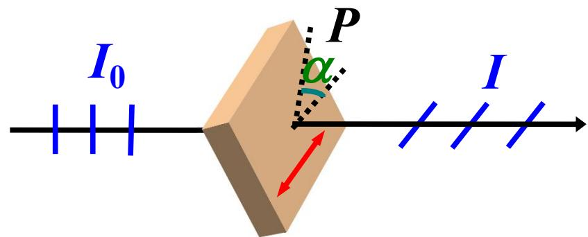
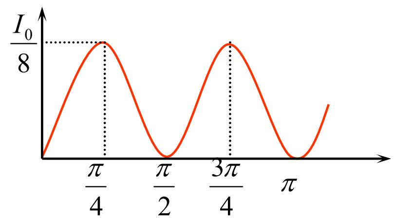

# 7.2.2 ==马吕斯定律==及偏振态判别

> **脉络**：在[[7.2.1 偏振片、起偏器和检偏器|偏振片、起偏器和检偏器]]中，已经知道偏振片只让沿透振方向的电场分量通过。本节把这个投影关系写成光强公式。因为光强正比于电场振幅平方，所以电场投影中的 $\cos\alpha$ 会变成光强中的 $\cos^2\alpha$。

---

### 一、 马吕斯定律研究什么

马吕斯定律描述的是：一束==线偏振光==通过一片理想偏振片以后，出射光强和偏振片转角之间的关系。

设：

- 入射线偏振光的电场振幅为 $E_0$；
- 入射光强为 $I_0$；
- 偏振片的透振方向与入射电场方向夹角为 $\alpha$；
- 通过偏振片后的电场振幅为 $E$；
- 通过偏振片后的光强为 $I$。

偏振片只允许入射电场在透振方向上的投影通过，所以：

$$
E=E_0\cos\alpha
$$

又因为光强正比于电场振幅平方，这和[[4.2.1 光强的定义与双光束叠加后的合成光强公式|光强正比于振幅平方]]一致：

$$
I_0\propto E_0^2,\qquad I\propto E^2=E_0^2\cos^2\alpha
$$

因此得到马吕斯定律：

$$
\boxed{I=I_0\cos^2\alpha}
$$

---

### 二、 公式中的角度 $\alpha$

这里的 $\alpha$ 不是入射角，也不是光线和法线的夹角，而是两个方向之间的夹角：

- 一个方向是入射线偏振光的电场振动方向；
- 另一个方向是偏振片的透振方向。

所以做题时要先找清楚“光的振动方向”和“偏振片透振方向”。如果题目说两片偏振片夹角为 $\alpha$，通常指的是两片偏振片透振方向之间的夹角。

---

### 三、 两个特殊情况

#### 1. 平行时光强最大

当

$$
\alpha=0
$$

入射电场方向和透振方向平行，电场全部通过：

$$
I=I_{\max}=I_0
$$

此时偏振片不改变理想线偏振光的光强。

#### 2. 垂直时消光

当

$$
\alpha=\frac{\pi}{2}
$$

入射电场方向和透振方向垂直，电场在透振方向上的投影为零：

$$
I=I_0\cos^2\frac{\pi}{2}=0
$$

这就是==消光==。实验中若旋转检偏器可以找到完全消光的位置，就说明入射光具有完全线偏振成分。

---

### 四、 三片偏振片旋转例题

教材给出的例题是：![[Pasted image 20260617101605.jpg]]

> 三个偏振片堆叠在一起，第一块与第三块的偏振化方向相互垂直，第二块和第一块的偏振化方向起初相互平行。第二块偏振片以恒定角速度 $\omega$ 绕光传播方向旋转。入射自然光光强为 $I_0$，求出射光强随时间的变化。

设第一片透振方向为 $x$ 方向，第三片透振方向为 $y$ 方向。第二片相对第一片转过角度：

$$
\theta=\omega t
$$

#### 1. 通过第一片

自然光通过第一片理想偏振片后变成线偏振光，光强减半：

$$
I_1=\frac{I_0}{2}
$$

#### 2. 通过第二片

第二片与第一片夹角为 $\theta=\omega t$，由马吕斯定律：

$$
I_2=I_1\cos^2\theta=\frac{I_0}{2}\cos^2\omega t
$$

此时出射光的偏振方向沿第二片透振方向。

#### 3. 通过第三片

第三片与第一片垂直，所以第三片与第二片之间的夹角为：

$$
\frac{\pi}{2}-\theta
$$

再次用马吕斯定律：

$$
I=I_2\cos^2\left(\frac{\pi}{2}-\theta\right)
$$

因为

$$
\cos\left(\frac{\pi}{2}-\theta\right)=\sin\theta
$$

所以：

$$
I=\frac{I_0}{2}\cos^2\theta\sin^2\theta
$$

代入 $\theta=\omega t$：

$$
I=\frac{I_0}{2}\cos^2\omega t\sin^2\omega t
$$

利用

$$
\sin 2\omega t=2\sin\omega t\cos\omega t
$$

得到教材结果：

$$
\boxed{I=\frac{I_0}{8}\sin^2 2\omega t}
$$

---

### 五、 为什么中间加一片反而能透光

如果只有第一片和第三片，且二者透振方向互相垂直，那么第一片出射的线偏振光会被第三片完全挡住，出射光强为零。

但加入第二片以后，第二片先把第一片出射的电场投影到一个中间方向。这个中间方向相对于第三片不再完全垂直，所以第三片还能取到一部分投影。

这里没有违反能量守恒。第二片并不是“凭空增加光强”，而是改变了通过它之后的偏振方向，同时每次投影都损失一部分光强。

---

### 六、 本节需要记住的结论

> **结论一**：马吕斯定律适用于线偏振光通过理想偏振片：
> $$
> I=I_0\cos^2\alpha
> $$
> 其中 $\alpha$ 是入射电场方向和偏振片透振方向之间的夹角。

> **结论二**：$\alpha=0$ 时光强最大，$I=I_0$；$\alpha=\pi/2$ 时光强为零，出现消光。

> **结论三**：自然光先通过第一片偏振片时要先减半，之后再对后续线偏振光逐片使用马吕斯定律。

> **结论四**：多个偏振片叠放时，每经过一片偏振片，出射光的偏振方向都会变成该偏振片的透振方向，下一步计算要用新的偏振方向。
