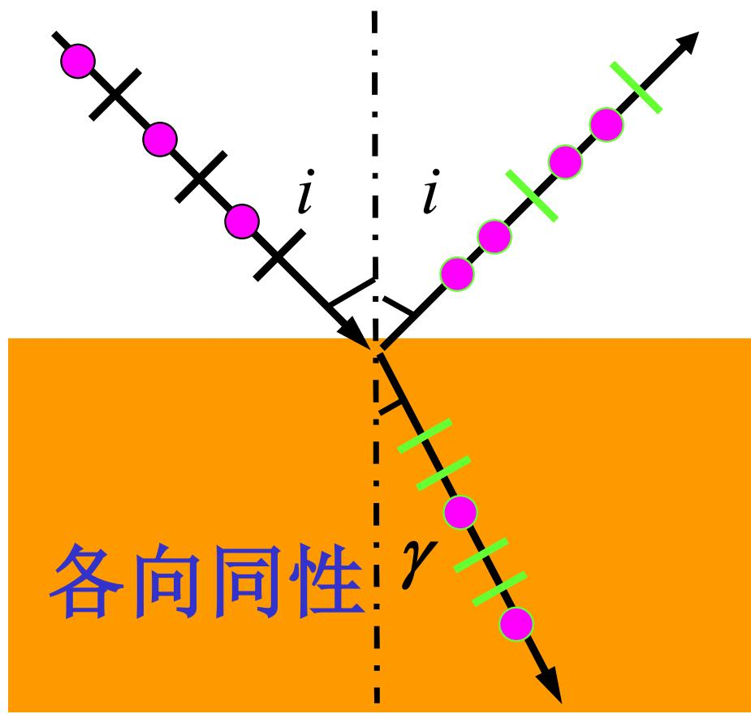
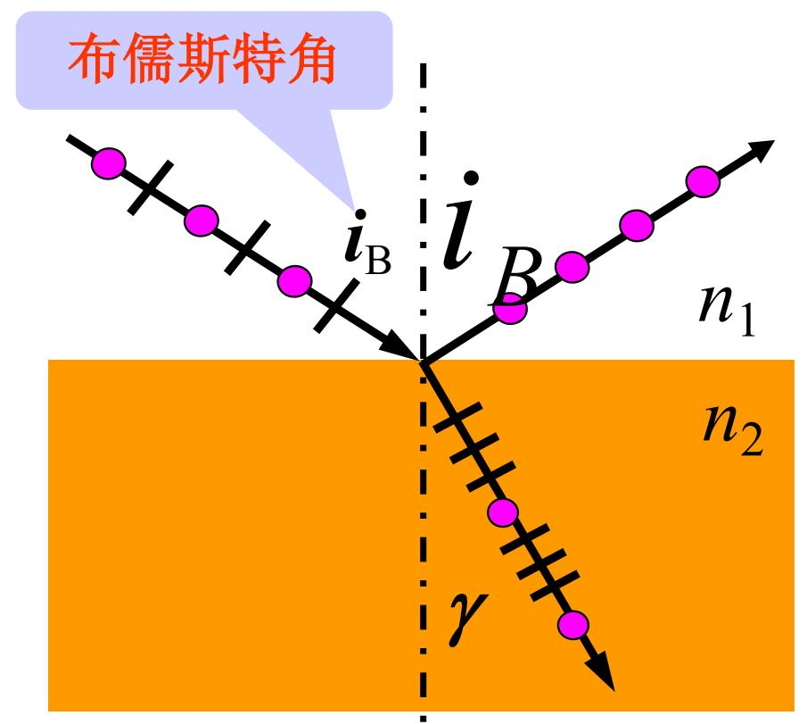
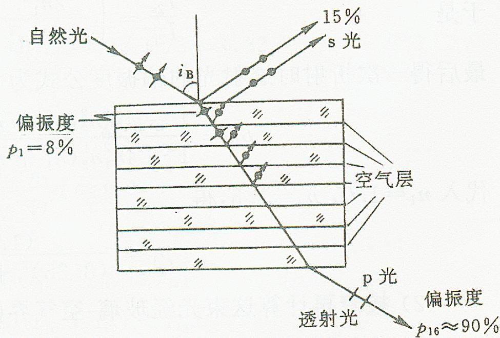
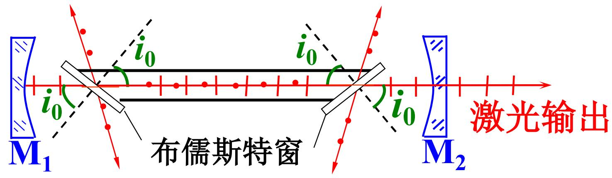
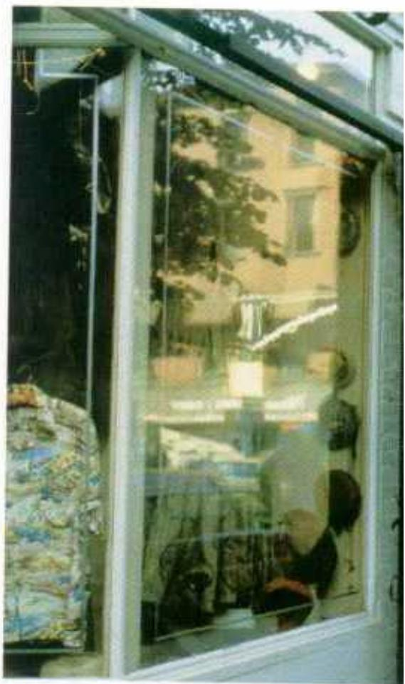
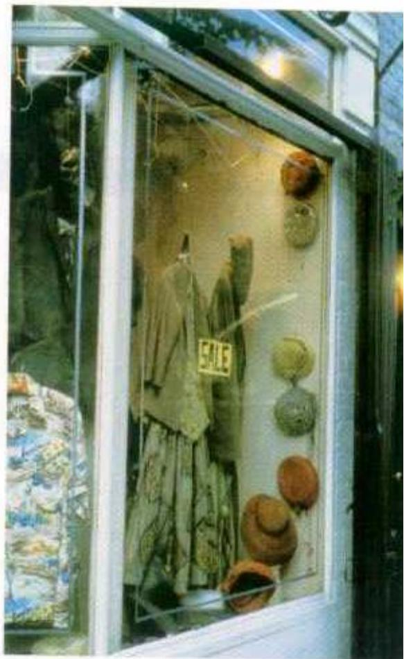

# 7.3.1 ==反射光==、==折射光==和==散射光==的偏振

> **脉络**：前面已经知道自然光可分解为两个强度相等、相位无固定关系的正交线偏振分量。现在把自然光射到介质界面上，由于 $p$ 分量和 $s$ 分量的反射率、透射率不同，反射光和折射光就会由自然光变为==部分偏振光==，在特殊入射角下反射光还能成为完全线偏振光。

---

### 一、 自然光在界面上的偏振改变

自然光入射到两种各向同性介质分界面上时，可以先分解为：

- $s$ 分量：电场振动方向垂直于入射面；
- $p$ 分量：电场振动方向平行于入射面。

这和[[3.1.2 特征振动方向(p与s分量)|p 与 s 分量]]的分解完全一致。自然光中两个分量原本光强相等：

$$
I_s=I_p=\frac{I_0}{2}
$$

但在斜入射反射和折射时，两个分量的反射率不同。通常情况下：

$$
R_s>R_p
$$

所以：

- 反射光中 $s$ 分量更多，即垂直于入射面的振动更强；
- 折射光中 $p$ 分量更多，即平行于入射面的振动更强。

因此，反射光和折射光一般都不是自然光，而是==部分偏振光==。

这正是[[3.3.2 偏振态变换与玻片组起偏|界面反射与折射对自然光偏振态的改变]]中已经讨论过的结果。第七章这里是从“偏振态分类”的角度重新理解它。

---

### 二、 布儒斯特定律

当入射角满足：

$$
\tan i_B=\frac{n_2}{n_1}
$$

时，反射光成为振动方向垂直于入射面的线偏振光。这个关系叫==布儒斯特定律==，$i_B$ 叫==布儒斯特角==或==起偏振角==。

式中：

- $n_1$ 是入射介质的折射率；
- $n_2$ 是折射介质的折射率；
- $i_B$ 是入射角，不是折射角；
- 条件成立时，反射光中 $p$ 分量消失，只剩 $s$ 分量。

所以在布儒斯特角下：

$$
R_p=0
$$

反射光变成完全 $s$ 线偏振光。

---

### 三、 为什么布儒斯特角下反射光和折射光互相垂直

教材提出结论：当光线以起偏振角入射时，反射光和折射光的传播方向互相垂直：

$$
i_B+\gamma=90^\circ
$$

这里 $\gamma$ 是折射角。由折射定律：

$$
n_1\sin i_B=n_2\sin\gamma
$$

若 $i_B+\gamma=90^\circ$，则：

$$
\gamma=90^\circ-i_B
$$

所以：

$$
\sin\gamma=\sin(90^\circ-i_B)=\cos i_B
$$

代入折射定律：

$$
n_1\sin i_B=n_2\cos i_B
$$

于是：

$$
\tan i_B=\frac{n_2}{n_1}
$$

这就得到布儒斯特定律。反过来，只要满足布儒斯特定律，反射光与折射光也互相垂直。

第三章的[[3.2.2 外反射与布儒斯特角|外反射与布儒斯特角]]还给过一个物理解释：在这个几何关系下，第二介质中受迫振动的偶极子不能沿反射光方向辐射 $p$ 分量，所以反射光中没有 $p$ 分量。

---

### 四、 布儒斯特角下折射光不是完全偏振光

教材特别说明：当 $i=i_B$ 时，反射光为线偏振光，而折射光仍然是部分偏振光，只是偏振化程度最高。

原因是：

- 反射光中 $p$ 分量为零，只剩 $s$ 分量，所以反射光完全线偏振；
- 折射光中 $p$ 分量全部透过，但 $s$ 分量并没有全部消失，只是被反射掉一部分；
- 因此折射光仍含有 $p$ 和 $s$ 两个分量，只是 $p$ 分量占优势。

所以不能把“布儒斯特角起偏”误解为“反射光和折射光都完全偏振”。完全偏振的是反射光；折射光只是偏振度较高的部分偏振光。

这也对应[[3.3.6 反射光偏振态图解与布儒斯特窗应用|反射光偏振态图解]]中的结论。

---

### 五、 玻片组透射起偏

教材接着说明：利用 $p$ 光和 $s$ 光的反射率差异，可以用玻片组获得较高偏振度的透射光。

单块玻璃片的作用有限。虽然在布儒斯特角下 $p$ 分量不反射，但 $s$ 分量只被反射掉一部分，透射光还不是完全线偏振光。若让自然光依次通过多片玻璃片：

- 每经过一个界面，$s$ 分量都被反射掉一部分；
- $p$ 分量在布儒斯特角条件下损失很小；
- 界面数越多，透射光中的 $s$ 分量越弱；
- 玻璃片足够多时，透射光可接近完全 $p$ 线偏振光。

这就是[[3.3.5 专题例题：玻片组起偏器的偏振度推导|玻片组起偏器的偏振度推导]]中的物理基础。

---

### 六、 布儒斯特窗和偏振消反光

#### 1. 布儒斯特窗

外腔式激光管可以加装布儒斯特窗。窗口倾斜放置，使激光中某一偏振方向满足布儒斯特角入射。这样 $p$ 偏振光的反射损失很小，而 $s$ 偏振光损失较大。经过谐振腔内多次往返后，$p$ 偏振光更容易积累，输出激光就具有较高偏振度。

#### 2. 拍摄玻璃窗内物体时去掉反射光

玻璃、水面、路面等非金属表面的反射光常常含有较强的某一偏振分量。若在相机前加偏振片，并旋转到合适角度，就可以削弱这部分反射光，使玻璃窗内或水面下的物体更清楚。

这个应用也可以和[[3.2.2 外反射与布儒斯特角|偏振墨镜减少反光]]联系起来理解。

---

### 七、 关于散射光的偏振

教材本节标题包含散射光，但这几页主要讲反射和折射。散射光偏振的基本思想可以先记住：

自然光被微小粒子散射时，散射光中不同方向的电场分量辐射能力不同，因此某些观察方向上的散射光会表现出明显偏振。典型例子是天空散射光具有一定偏振性。

从机制上看，散射起偏和反射起偏都说明同一件事：光与物质相互作用后，不同振动方向的电场分量可能被区别对待，于是原本没有优势方向的自然光会变成部分偏振光。

---

### 八、 本节需要记住的结论

> **结论一**：自然光在各向同性介质界面斜入射时，反射光和折射光通常都是部分偏振光。反射光中 $s$ 分量较强，折射光中 $p$ 分量较强。

> **结论二**：布儒斯特定律为
> $$
> \tan i_B=\frac{n_2}{n_1}
> $$
> 满足该条件时，反射光为完全 $s$ 线偏振光，反射光和折射光传播方向互相垂直。

> **结论三**：布儒斯特角下，折射光偏振化程度最高，但仍不是完全偏振光，因为它仍然含有两个正交分量。

> **结论四**：玻片组、布儒斯特窗和偏振片消反光，都是利用不同偏振分量在反射、透射或吸收中的差异来控制偏振态。
