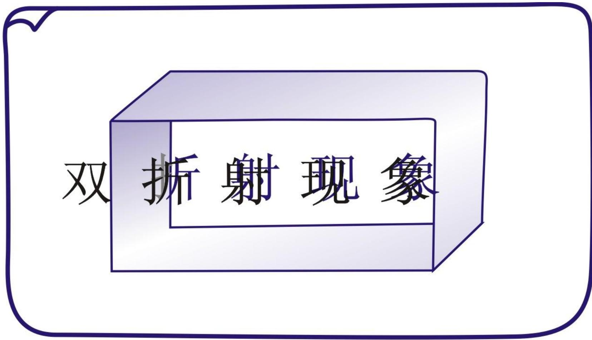
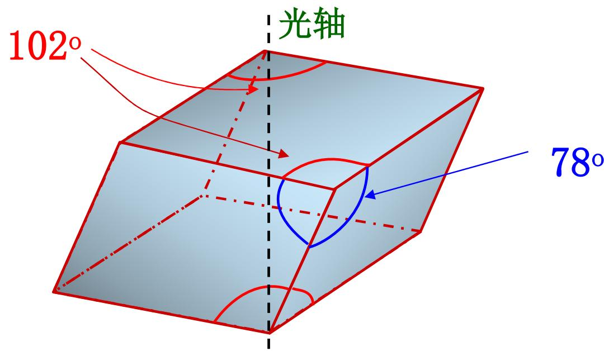

# 7.4.1 ==晶体结构==与==双折射现象==

> **脉络**：前面几节主要研究各向同性介质界面上的偏振问题。从本节开始进入晶体光学。晶体的内部原子排列具有有序性和周期性，这种结构会使某些物理性质随方向不同而不同。对光学来说，最重要的是：光在晶体中的传播速度和折射率可能与传播方向、偏振方向有关，于是出现==双折射==。

---

### 一、 什么是晶体

教材对晶体的描述有两层：

#### 1. 外形有规则性或对称性

很多晶体在宏观外形上有比较规则的几何形状，例如方解石晶体常见为菱面体。这种外形规则性不是偶然的，而是内部结构长期重复排列的外在表现。

#### 2. 内部原子排列有序、周期性

晶体内部的原子、离子或分子不是杂乱排列，而是在空间中按一定规则周期重复。这个特点和[[5.7.1 三维光栅、X 射线衍射与布拉格公式|晶体可以看成三维光栅]]的想法相通。

第五章讨论 X 射线晶体衍射时，重点是“周期结构会让散射波在某些方向相干增强”；第七章讨论晶体光学时，重点变成“周期结构会让介质对不同方向的电场响应不同”。两者都来自晶体的内部有序结构。

---

### 二、 各向异性从哪里来

教材写道：

> 规则有序结构导致物理性质的各向异性。

==各向异性==的意思是：同一个物理量沿不同方向测量时，结果不同。

教材列出几个例子：

- 热传导的各向异性；
- 电导的各向异性；
- 极化、磁化的各向异性；
- 光速的各向异性。

对本章最重要的是光速的各向异性。因为折射率和光速有关：

$$
n=\frac{c}{v}
$$

若光在晶体中沿不同方向、不同偏振方向传播时速度 $v$ 不同，那么它对应的折射率 $n$ 也不同。于是同一束入射光进入晶体后，可能分成两束具有不同传播方向或不同传播速度的光。

这就是双折射现象的基础。

---

### 三、 各向同性介质和各向异性介质的区别

在第三章中，我们主要研究[[3.2.1 菲涅耳公式与复振幅反射率|各向同性介质界面上的反射和折射]]。各向同性介质的特点是：介质的光学性质与方向无关。

例如普通玻璃、水、空气等，在同一点上不管光沿哪个方向传播，若忽略色散等影响，可以用一个折射率 $n$ 描述。

晶体光学中则不同。许多晶体是各向异性介质：

- 折射率可能不是一个单独的数；
- 光速可能依赖传播方向；
- 光速也可能依赖电场振动方向；
- 因此入射光可能分成两束折射光。

所以，前面用普通斯涅尔定律处理的“一束入射光对应一束折射光”的图像，在晶体中不一定成立。

---

### 四、 晶体的光学分类

教材给出按光学性质的三类晶体。

#### 1. 各向同性晶体

立方晶系通常表现为光学各向同性，例如食盐 $\mathrm{NaCl}$ 晶粒。

虽然它是晶体，有规则点阵，但由于立方对称性很高，从光学上看各个方向等效，所以不表现出双折射。

#### 2. 单轴晶体

单轴晶体只有一个光轴。教材举例：

- 方解石；
- 石英；
- 冰；
- 红宝石。

常见对应晶系包括三角晶系、四角晶系、六角晶系。

第七章后面主要讨论单轴晶体，因为它的双折射规律相对简单，可以用 o 光、e 光和一个光轴方向来描述。

#### 3. 双轴晶体

双轴晶体有两个光轴。教材举例：

- 蓝宝石；
- 云母；
- 硫磺等。

双轴晶体的传播规律更复杂，本章主要先理解单轴晶体。

---

### 五、 光轴的定义

教材给出定义：

> 光线在晶体中沿某一方向传播时不发生双折射现象，这一方向称为晶体的光轴。

要注意：==光轴不是某一条固定的实际直线，而是晶体中的一个特殊方向==。

如果光沿这个方向传播，两种偏振分量看到的传播速度相同，不分裂成两束光；如果偏离这个方向传播，就可能发生双折射。

教材用方解石说明光轴方向：

天然方解石晶体是六面棱体，每一面都是菱形，大角约 $102^\circ$，小角约 $78^\circ$。六面体中有两个相对的、分别由三个钝角围成的顶角，连接这两个顶角，与这条连线平行的方向就是方解石的光轴方向。

---

### 六、 什么是双折射现象

==双折射==指一束光进入某些各向异性晶体后，分裂成两束折射光的现象。

在普通各向同性介质中，同一束入射光通常只对应一束折射光。但在晶体中，入射光可分解成两个特定偏振方向的分量，这两个分量在晶体中看到不同的折射率，因此传播速度和折射方向可能不同。

所以双折射的根本原因不是“晶体把光机械地劈成两份”，而是：

- 晶体对不同方向的电场响应不同；
- 两个正交偏振分量在晶体中的折射率不同；
- 折射率不同导致传播速度和传播方向不同；
- 于是形成两束可分开的光。

后面会把这两束光称为 o 光和 e 光。

---

### 七、 本节需要记住的结论

> **结论一**：晶体内部原子排列有序、周期性，这种结构会导致物理性质的各向异性。

> **结论二**：晶体光学研究的是光在各向异性介质中的传播，重点是光速和折射率随方向、偏振方向改变。

> **结论三**：光轴是晶体中的特殊方向。光沿光轴传播时不发生双折射。单轴晶体只有一个光轴，双轴晶体有两个光轴。

> **结论四**：双折射的本质是晶体对两个正交偏振分量给出不同折射率，使一束入射光在晶体中分成两束传播。
