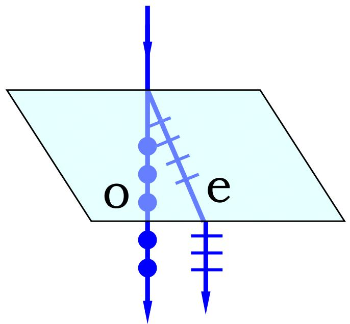
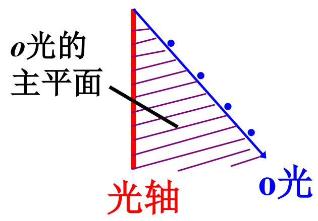
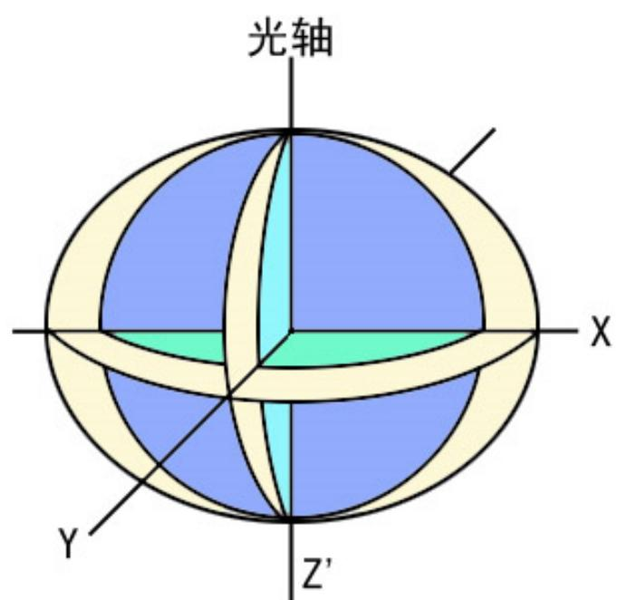

# 7.4.2 ==o 光==、==e 光==与双折射偏振特点

> **脉络**：在[[7.4.1 晶体结构与双折射现象|晶体结构与双折射现象]]中已经知道，双折射来自晶体对不同偏振方向给出不同折射率。本节进一步给这两束光命名：一束叫==寻常光==或 o 光，另一束叫==非常光==或 e 光。二者不仅传播规律不同，而且偏振方向也有严格关系。

---

### 一、 o 光和 e 光只在晶体内部有意义

教材先说明：

- o 光（Ordinary Light，寻常光）：遵守折射定律；
- e 光（Extraordinary Light，非常光）：一般不遵守普通折射定律。

这里要注意一句话：

> 所谓 o 光和 e 光，只在双折射晶体的内部才有意义，射出晶体以后，就无所谓 o 光和 e 光了。

原因是：o 光和 e 光的区别来自晶体内部的各向异性响应。离开晶体进入空气或普通玻璃后，介质又变成各向同性介质，两束光只是两束普通线偏振光，不再具有“o 光折射率”和“e 光折射率”的区别。

用[[7.2.1 偏振片、起偏器和检偏器|检偏器]]考察从晶体射出的两束光时，会发现它们都是线偏振光。也就是说，双折射晶体不仅把一束光分成两束，还把它分解成两个特定偏振方向的线偏振光。

---

### 二、 寻常光 o 光

教材给出 o 光的三个特点。

#### 1. o 光是线偏振光

o 光的振动面垂直于自己的主平面。这里“振动面”可以理解为电场振动方向和传播方向共同确定的平面。

更直接地说：o 光的电场振动方向与它的主平面垂直。

#### 2. o 光符合普通反射定律和折射定律

o 光叫“寻常光”，就是因为它在晶体中的传播规律像普通各向同性介质中的光一样。它有一个固定折射率：

$$
n_o
$$

所以可以按照普通斯涅尔定律处理：

$$
n_1\sin i=n_o\sin r_o
$$

这里 $r_o$ 是 o 光的折射角。

#### 3. o 光沿各方向折射率相同

教材写道：o 光沿各个方向折射率相同，传播速度相同。

这表示对 o 光来说，晶体表现得像一个折射率为 $n_o$ 的各向同性介质。它的波面后面会画成球面。

---

### 三、 非常光 e 光

e 光的规律和 o 光不同。

#### 1. e 光也是线偏振光

e 光的振动面平行于自己的主平面。更直接地说：e 光的电场振动方向在它的主平面内。

这和 o 光形成互补关系：在常用情形中，o 光和 e 光的振动方向互相垂直。

#### 2. e 光一般不符合普通折射定律

e 光叫“非常光”，是因为它一般不遵守普通斯涅尔折射定律。它的折射率不是一个固定常数，而是随传播方向改变。

只有在某些特殊方向上，例如沿垂直于光轴的方向传播时，e 光的行为可以写得比较像普通折射规律。

#### 3. e 光沿不同方向折射率不同

教材的 OCR 在这一行符号有误，按常规定义应理解为：

- 沿光轴方向传播时，e 光折射率与 o 光相同；
- 沿垂直于光轴方向传播时，e 光折射率记为 $n_e$；
- $n_o$ 和 $n_e$ 称为单轴晶体的==主折射率==。

所以：

$$
n_o,\quad n_e
$$

是描述单轴晶体最重要的两个折射率。

---

### 四、 主截面和主平面

教材给出两个容易混淆的概念。

#### 1. 主截面

==主截面==：由晶体光轴和晶体表面入射点处的法线组成的平面。

它和入射表面有关，常用于讨论光从晶体外入射到晶体表面时的几何关系。

#### 2. 主平面

==主平面==：晶体中某一束光的传播方向与==晶体光轴==构成的平面。

因为 o 光和 e 光在晶体中可能传播方向不同，所以严格说，o 光有自己的主平面，e 光也有自己的主平面。

教材给出偏振方向规则：

$$
\text{o 光振动方向} \perp \text{o 光主平面}
$$

$$
\text{e 光振动方向} \parallel \text{e 光主平面}
$$

当 o 光和 e 光的主平面相互平行时，两束光的振动方向互相垂直。

---

### 五、 o 光和 e 光偏折方向的差别

教材说明：

> 当入射面和主截面重合一致时，e 光的偏折依然在入射面内；当入射面和主截面不一致时，e 光射线就可能不在入射面内。o 光的偏折总在入射面内。

这句话可以这样理解：

- o 光有固定折射率 $n_o$，像普通光一样遵守折射定律，所以它的折射光线在入射面内。
- e 光的折射率随方向改变，能流方向和波法线方向也可能不一致，所以它的射线方向可能偏出普通入射面。

这正是 e 光“非常”的地方：它不仅折射角不好用普通斯涅尔定律求，而且射线几何也更复杂。

---

### 六、 正晶体和负晶体

晶体可分为正晶体和负晶体，判断依据是 $n_e$ 和 $n_o$ 的大小关系。

#### 1. 负晶体

若：

$$
n_e<n_o
$$

则称为==负晶体==。教材举例：方解石。

负晶体中，e 光在垂直光轴方向的折射率小于 o 光，对应速度更大。

#### 2. 正晶体

若：

$$
n_e>n_o
$$

则称为==正晶体==。教材举例：石英。

正晶体中，e 光在垂直光轴方向的折射率大于 o 光，对应速度更小。

---

### 七、 宝石中的双折射

教材提到红宝石、猫眼石等宝石的双折射。宝石从不同方向观察时，可能出现深浅不同甚至颜色不同的效果。这与晶体的各向异性和偏振选择有关。

例如红宝石折射率约为：

$$
1.762\sim 1.770
$$

双折射率约为：

$$
0.008
$$

猫眼石折射率约为：

$$
1.74\sim 1.75
$$

双折射约为：

$$
0.009
$$

双折射率可以粗略理解为两个主折射率之间的差：

$$
\Delta n=|n_e-n_o|
$$

这个差值越大，两束偏振光在传播中的速度差和相位差通常越明显。

---

### 八、 本节需要记住的结论

> **结论一**：o 光和 e 光只在双折射晶体内部有意义，射出晶体后只是两束普通线偏振光。

> **结论二**：o 光遵守普通折射定律，折射率为固定的 $n_o$；e 光一般不遵守普通折射定律，折射率随传播方向改变。

> **结论三**：o 光振动方向垂直于自己的主平面；e 光振动方向平行于自己的主平面。常见情况下两束光偏振方向互相垂直。

> **结论四**：单轴晶体的主折射率为 $n_o$ 和 $n_e$。若 $n_e<n_o$，为负晶体；若 $n_e>n_o$，为正晶体。
