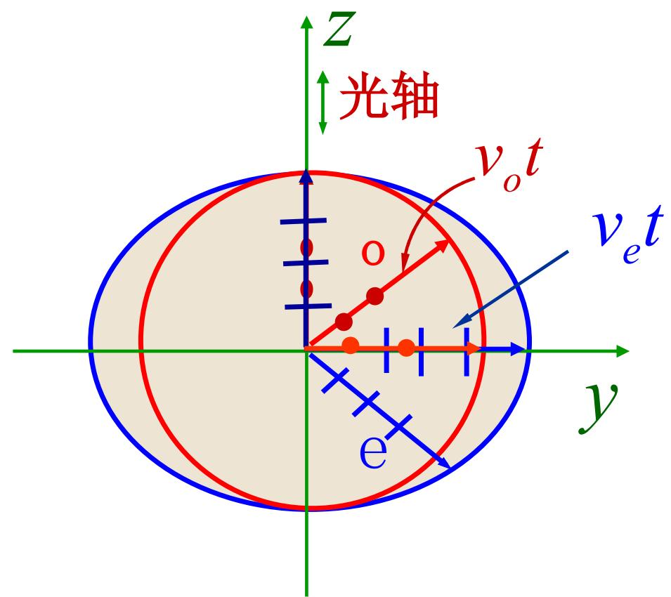
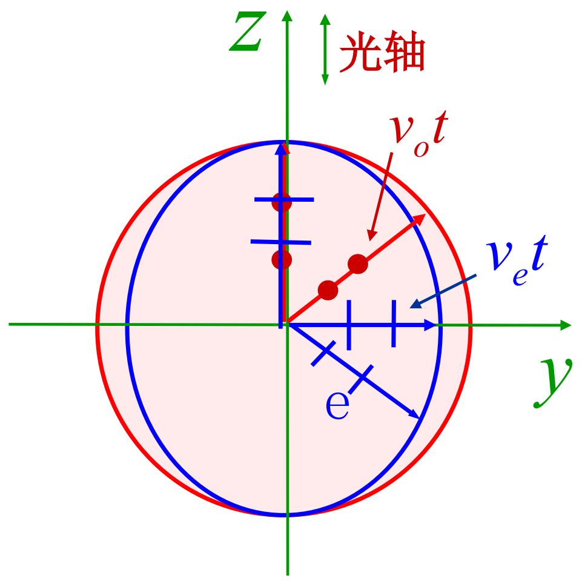
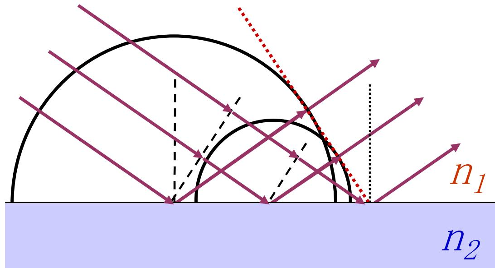
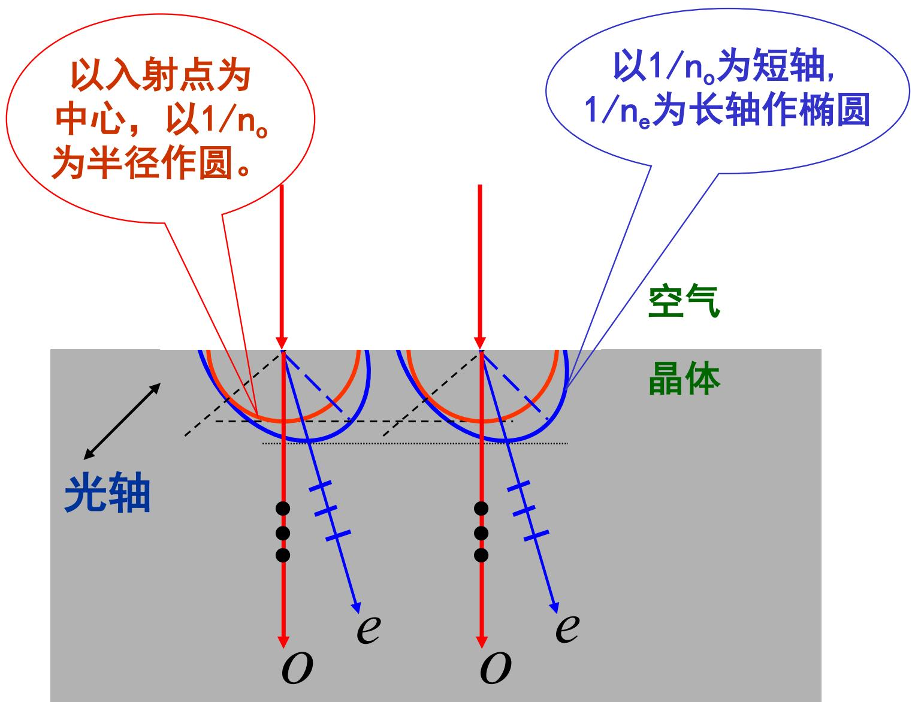

# 7.4.3 光在晶体中的==波面==与==惠更斯作图==

> **脉络**：在[[7.4.2 o 光、e 光与双折射偏振特点|o 光和 e 光]]中已经知道，o 光折射率固定，e 光折射率随方向改变。本节用波面图像说明这个差别：o 光从晶体内一点发出后形成球面波，e 光形成椭球面波。再用惠更斯作图法确定它们在晶体中的传播方向。

---

### 一、 先回到波面的概念

==波面==是相位相同的点组成的面。这个概念在[[2.3.1 波前的概念与共轭波前|波前的概念]]中已经出现过。

如果介质中各方向传播速度相同，那么从一点发出的光经过时间 $t$ 后，到达的点到源点距离都相同，波面就是球面。

如果介质中不同方向传播速度不同，那么同样经过时间 $t$，某些方向传播得远，某些方向传播得近，波面就不再是球面。

晶体中 o 光和 e 光的波面差别正是由这个原因造成的。

---

### 二、 o 光的波面是球面

教材设 $O-xyz$ 是方解石晶体内部坐标系，$t=0$ 时刻从原点发出光振动。到 $t$ 时刻，o 光振动传播到以

$$
v_o t
$$

为半径的球面上。

所以 o 光的波面是球面。

原因是 o 光沿各个方向折射率相同：

$$
n_o=\text{常数}
$$

因此传播速度也相同：

$$
v_o=\frac{c}{n_o}
$$

球面波表示：o 光在晶体中仍像普通各向同性介质中的光一样传播。这和 o 光遵守普通折射定律是一致的。

---

### 三、 e 光的波面是椭球面

e 光沿不同方向折射率不同，所以速度也随方向改变。教材说：e 光波面是长轴为 $v_e t$、短轴为 $v_o t$，并且在光轴方向上与 o 光球面外切的椭球面。

这里要抓住两点：

#### 1. 沿光轴方向，e 光和 o 光速度相同

沿光轴方向不发生双折射，所以 e 光与 o 光在该方向传播速度相同。于是 e 光椭球面与 o 光球面在光轴方向相切。

#### 2. 垂直光轴方向，e 光速度由 $n_e$ 决定

垂直光轴方向上，e 光折射率为主折射率 $n_e$，速度为：

$$
v_e=\frac{c}{n_e}
$$

若 $v_e$ 与 $v_o$ 不同，e 光波面就不是球面，而是椭球面。

---

### 四、 负晶体和正晶体的波面差别

#### 1. 负晶体

负晶体满足：

$$
n_e<n_o
$$

所以：

$$
v_e=\frac{c}{n_e}>\frac{c}{n_o}=v_o
$$

这表示 e 光在垂直光轴方向传播得更快，因此 e 光椭球面在相应方向会伸出 o 光球面外。教材举例：方解石是负晶体。

#### 2. 正晶体

正晶体满足：

$$
n_e>n_o
$$

所以：

$$
v_e=\frac{c}{n_e}<\frac{c}{n_o}=v_o
$$

这表示 e 光在垂直光轴方向传播得更慢，因此 e 光椭球面在相应方向会落在 o 光球面内。教材举例：石英是正晶体。

---

### 五、 惠更斯原理怎样用于作图

惠更斯原理说：波面上的每一点都可以看成发出次波的新波源。这个思想在[[5.1.2 惠更斯原理与惠更斯-菲涅耳原理|惠更斯-菲涅耳原理]]中已经用来解释衍射。

在这里，惠更斯原理用来确定反射光和折射光的方向。

基本步骤是：

1. 入射波面到达界面上的不同点有先后顺序。
2. 先到达的界面点先成为次波源。
3. 在第二介质中画出这些次波源在同一时间内传播出的次波面。
4. 作这些次波面的公切面。
5. 公切面就是折射波的新波面。
6. 从次波源到切点的方向给出对应光线或能流方向。

对于各向同性介质，次波面是球面，所以作图得到普通反射定律和折射定律。

---

### 六、 惠更斯作图用于晶体

晶体中的作图和各向同性介质不同，因为同一个次波源会同时发出两类次波面：

- o 光次波面：球面；
- e 光次波面：椭球面。

因此一束入射光进入晶体后，需要分别对 o 光球面和 e 光椭球面作公切面，得到两套波面和两束传播方向。

这就是用惠更斯作图解释双折射的核心。

---

### 七、 波面法线和光线方向的区别

在各向同性介质中，波面法线方向通常就是光线传播方向。但在各向异性晶体中，尤其对 e 光来说，波面法线方向和能量传播方向可能不完全一致。

可以这样记：

- 波面法线对应波矢方向，即相位传播方向；
- 光线方向对应能流方向，即能量传播方向；
- o 光因为波面是球面，两者关系比较普通；
- e 光因为波面是椭球面，两者可能分离。

这也是为什么 e 光在某些情况下“不在入射面内”，以及为什么它不按普通折射定律来处理。

---

### 八、 本节需要记住的结论

> **结论一**：o 光沿各方向速度相同，从晶体中一点发出后的波面是球面，半径为 $v_o t$。

> **结论二**：e 光速度随方向改变，从一点发出后的波面是椭球面。沿光轴方向 e 光与 o 光速度相同，所以两波面在光轴方向相切。

> **结论三**：负晶体满足 $n_e<n_o$，所以 $v_e>v_o$；正晶体满足 $n_e>n_o$，所以 $v_e<v_o$。

> **结论四**：惠更斯作图中，o 光用球面次波，e 光用椭球面次波。分别作公切面，就能确定晶体中的两束折射光。

> **结论五**：在晶体中，尤其对 e 光，波面法线方向和光线能流方向可能不同。这是晶体光学比各向同性介质折射更复杂的重要原因。
