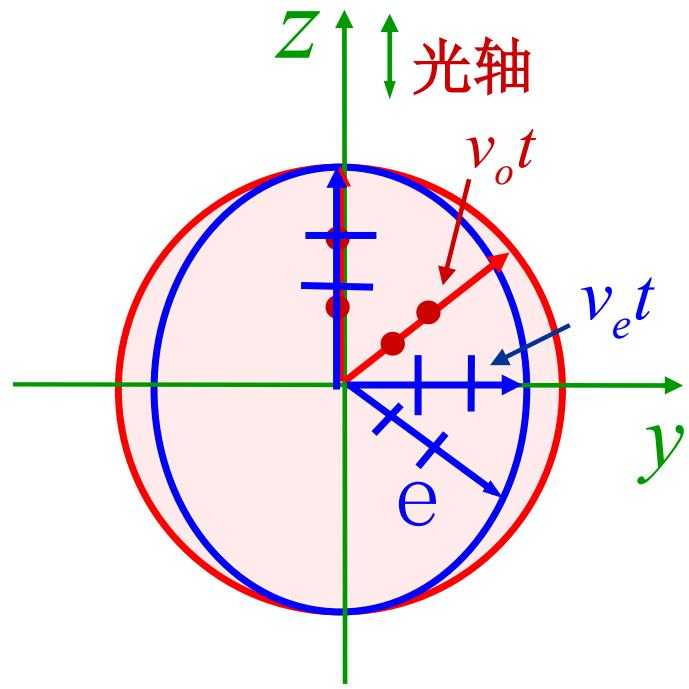
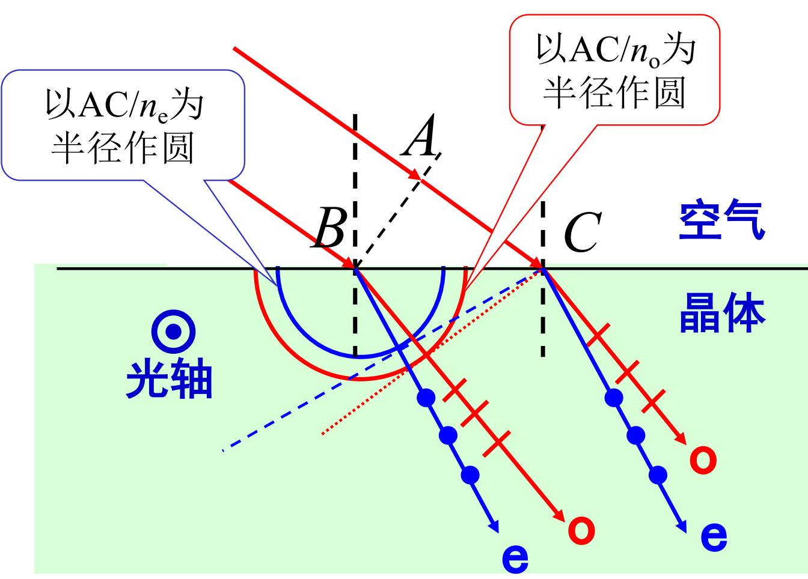
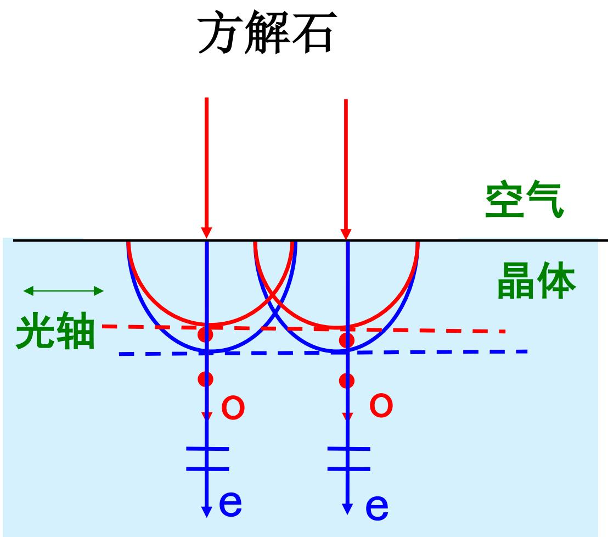
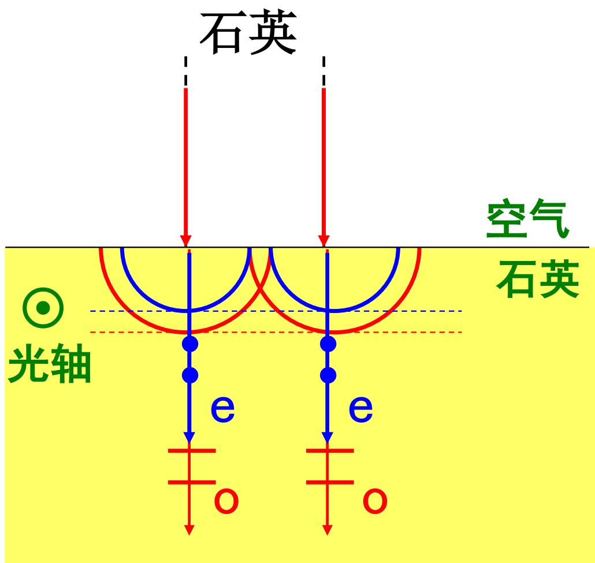

# 7.4.3 光在晶体中的==波面==与==惠更斯作图==

> **脉络**：在[[7.4.2 o 光、e 光与双折射偏振特点|o 光和 e 光]]中已经知道，o 光折射率固定，e 光折射率随方向改变。本节用波面图像说明这个差别：o 光从晶体内一点发出后形成球面波，e 光形成椭球面波。再用惠更斯作图法确定它们在晶体中的传播方向。

---

### 一、 先回到波面的概念

==波面==是相位相同的点组成的面。这个概念在[[2.3.1 波前的概念与共轭波前|波前的概念]]中已经出现过。

如果介质中各方向传播速度相同，那么从一点发出的光经过时间 $t$ 后，到达的点到源点距离都相同，波面就是球面。

如果介质中不同方向传播速度不同，那么同样经过时间 $t$，某些方向传播得远，某些方向传播得近，波面就不再是球面。

晶体中 o 光和 e 光的波面差别正是由这个原因造成的。

---

### 二、 o 光的波面是球面

教材设 $O-xyz$ 是方解石晶体内部坐标系，$t=0$ 时刻从原点发出光振动。到 $t$ 时刻，o 光振动传播到以

$$
v_o t
$$

为半径的球面上。

所以 o 光的波面是球面。

原因是 o 光沿各个方向折射率相同：

$$
n_o=\text{常数}
$$

因此传播速度也相同：

$$
v_o=\frac{c}{n_o}
$$

球面波表示：o 光在晶体中仍像普通各向同性介质中的光一样传播。这和 o 光遵守普通折射定律是一致的。

---

### 三、 e 光的波面是椭球面

e 光沿不同方向折射率不同，所以速度也随方向改变。教材说：e 光波面是长轴为 $v_e t$、短轴为 $v_o t$，并且在光轴方向上与 o 光球面外切的椭球面。

这里要抓住两点：

#### 1. 沿光轴方向，e 光和 o 光速度相同

沿光轴方向不发生双折射，所以 e 光与 o 光在该方向传播速度相同。于是 e 光椭球面与 o 光球面在光轴方向相切。

#### 2. 垂直光轴方向，e 光速度由 $n_e$ 决定

垂直光轴方向上，e 光折射率为主折射率 $n_e$，速度为：

$$
v_e=\frac{c}{n_e}
$$

若 $v_e$ 与 $v_o$ 不同，e 光波面就不是球面，而是椭球面。

---

### 四、 负晶体和正晶体的波面差别

#### 1. 负晶体

负晶体满足：

$$
n_e<n_o
$$

所以：

$$
v_e=\frac{c}{n_e}>\frac{c}{n_o}=v_o
$$

这表示 e 光在垂直光轴方向传播得更快，因此 e 光椭球面在相应方向会伸出 o 光球面外。教材举例：方解石是负晶体。

#### 2. 正晶体

正晶体满足：

$$
n_e>n_o
$$

所以：

$$
v_e=\frac{c}{n_e}<\frac{c}{n_o}=v_o
$$

这表示 e 光在垂直光轴方向传播得更慢，因此 e 光椭球面在相应方向会落在 o 光球面内。教材举例：石英是正晶体。

---

### 五、 惠更斯原理怎样用于作图

惠更斯原理说：波面上的每一点都可以看成发出次波的新波源。这个思想在[[5.1.2 惠更斯原理与惠更斯-菲涅耳原理（期末重点）|惠更斯-菲涅耳原理]]中已经用来解释衍射。

在这里，惠更斯原理用来确定反射光和折射光的方向。

基本步骤是：

1. 入射波面到达界面上的不同点有先后顺序。
2. 先到达的界面点先成为次波源。
3. 在第二介质中画出这些次波源在同一时间内传播出的次波面。
4. 作这些次波面的公切面。
5. 公切面就是折射波的新波面。
6. 从次波源到切点的方向给出对应光线或能流方向。

对于各向同性介质，次波面是球面，所以作图得到普通反射定律和折射定律。

---

### 六、 惠更斯作图用于晶体

晶体中的作图和各向同性介质不同，因为同一个次波源会同时发出两类次波面：

- o 光次波面：球面；
- e 光次波面：椭球面。

因此一束入射光进入晶体后，需要分别对 o 光球面和 e 光椭球面作公切面，得到两套波面和两束传播方向。

这就是用惠更斯作图解释双折射的核心。

---

### 七、 怎样确定 o 光和 e 光进入晶体后的传播方向

这里最容易混淆的是：==折射波面==、==波面法线==、==光线方向==不是同一个概念。

在各向同性介质和 o 光中，波面是球面，波面法线方向和从次波源指向切点的方向重合，所以看起来没有区别。

但 e 光的波面是椭球面，一般情况下：

- 公切面表示折射后的波面；
- 公切面的法线表示波矢方向，也就是相位传播方向；
- 次波源到切点的连线表示光线方向，也就是能量传播方向。

所以问“e 光的传播方向”时，要先看题目是在问哪一个方向。教材这些惠更斯作图例题里，画出的带箭头的 o 光、e 光通常表示==光线方向==。

#### 1. 通用作图步骤

设入射光在空气中从 $A$ 传播到 $C$ 所需时间为 $\Delta t$，空气中近似有 $v=c$，所以

$$
\Delta t=\frac{AC}{c}
$$

在这段时间内，晶体中的次波面大小为：

$$
v\Delta t=\frac{c}{n}\frac{AC}{c}=\frac{AC}{n}
$$

于是：

1. **o 光**：以入射点为圆心，作半径

$$
R_o=\frac{AC}{n_o}
$$

的圆。

2. **e 光**：以入射点为中心作椭圆截面。沿光轴方向速度与 o 光相同，所以半轴为

$$
R_{\parallel}=\frac{AC}{n_o}
$$

垂直光轴方向用 e 光主折射率，所以半轴为

$$
R_{\perp}=\frac{AC}{n_e}
$$

3. 从同一时刻到达界面的点 $C$ 向 o 光圆和 e 光椭圆分别作切线。
4. 切线就是折射波面。
5. 对 o 光，圆心到切点的方向就是 o 光折射方向。
6. 对 e 光，椭圆中心到切点的方向就是 e 光的射线传播方向；切线法线才是 e 光的波法线方向。

> **结论**：o 光折射角可以直接用普通折射定律；e 光一般不能直接套固定的 $n_e$，而要看 e 光椭圆波面的切点在哪里。

#### 2. o 光折射角

o 光沿所有方向折射率都是 $n_o$，所以从空气射入晶体时：

$$
\sin i=n_o\sin r_o
$$

即

$$
\sin r_o=\frac{\sin i}{n_o}
$$

这里 $i$ 是入射角，$r_o$ 是 o 光在晶体内相对界面法线的折射角。

这说明 o 光一定在入射面内，并且遵守普通折射定律。

#### 3. e 光折射角

e 光要分两种情况：

**第一种：特殊几何下，e 光截面退化成圆。**

例如光轴垂直于入射面时，e 光在入射面内看到的波面截面可以看成半径为 $AC/n_e$ 的圆。这时 e 光在入射面内也可以写成类似折射定律的形式：

$$
\sin i=n_e\sin r_e
$$

即

$$
\sin r_e=\frac{\sin i}{n_e}
$$

但这只是这个几何条件下的简化。

**第二种：一般情况，e 光截面是椭圆。**

这时不能只用一个固定折射率直接算 $r_e$。要用上面的惠更斯作图：画 e 光椭圆，作公切线，再用“椭圆中心到切点”的方向确定 e 光射线方向。

> **结论**：e 光的“折射角”如果指光线方向，就是椭圆中心到切点与法线的夹角；如果指波法线方向，就是折射波面法线与界面法线的夹角。两者一般不相等。

---

### 八、 教材例题 3：石英正晶体，光轴垂直于入射面

教材给出：

$$
n_e=1.55,\qquad n_o=1.54
$$

石英是正晶体，所以

$$
n_e>n_o
$$

也就是

$$
v_e=\frac{c}{n_e}<\frac{c}{n_o}=v_o
$$

题目中光轴垂直于入射面，也就是图中光轴用“点”表示，朝向纸外或纸内。

在入射面内看：

- o 光波面是半径 $AC/n_o$ 的圆；
- e 光波面也表现为半径 $AC/n_e$ 的圆。

因为 $n_e>n_o$，所以

$$
\frac{AC}{n_e}<\frac{AC}{n_o}
$$

也就是说，e 光次波面半径比 o 光小。

因此从空气斜入射时：

$$
\sin r_o=\frac{\sin i}{n_o},\qquad
\sin r_e=\frac{\sin i}{n_e}
$$

由于 $n_e>n_o$，所以

$$
r_e<r_o
$$

> **结论**：在例题 3 中，e 光比 o 光更靠近法线，e 光折射角更小。这里能直接用 $n_e$ 算 e 光，是因为光轴垂直于入射面，e 光截面退化成圆。

---

### 九、 教材例题 4：方解石负晶体，垂直入射

方解石是负晶体：

$$
n_e<n_o
$$

所以

$$
v_e>v_o
$$

图中入射光垂直入射，入射波面与界面平行。由于入射角

$$
i=0
$$

o 光满足普通折射定律：

$$
\sin r_o=\frac{\sin 0}{n_o}=0
$$

所以

$$
r_o=0
$$

o 光沿界面法线方向传播。

对 e 光，虽然一般不能直接套普通折射定律，但这个例题中光轴平行于晶体表面，入射方向垂直于光轴。e 光次波面的公切面仍与界面平行，所以 e 光的射线方向也沿法线方向。

区别不在方向，而在速度：

$$
v_e>v_o
$$

所以同一时间内 e 光波面比 o 光波面走得更深。

> **结论**：例题 4 中，o 光和 e 光都没有偏折，折射角都是 $0^\circ$；但方解石是负晶体，e 光传播得更快。

---

### 十、 教材例题 5：石英正晶体，垂直入射

石英是正晶体：

$$
n_e>n_o
$$

所以

$$
v_e<v_o
$$

图中也是垂直入射：

$$
i=0
$$

因此 o 光：

$$
r_o=0
$$

e 光在这个图示几何下，公切面仍与界面平行，所以 e 光射线也沿法线方向：

$$
r_e=0
$$

但石英是正晶体，e 光比 o 光慢：

$$
v_e<v_o
$$

所以同一时间内 e 光波面比 o 光波面走得浅。

> **结论**：例题 5 中，o 光和 e 光也都不发生方向偏折，折射角都是 $0^\circ$；但石英是正晶体，e 光传播得更慢。

---

### 十一、 把三个例题放在一起记

| 例题 | 晶体 | 光轴条件 | 入射情况 | o 光方向 | e 光方向 |
|---|---|---|---|---|---|
| 例题 3 | 石英，正晶体，$n_e>n_o$ | 光轴垂直入射面 | 斜入射 | $r_o=\arcsin(\sin i/n_o)$ | $r_e=\arcsin(\sin i/n_e)$，且 $r_e<r_o$ |
| 例题 4 | 方解石，负晶体，$n_e<n_o$ | 光轴平行晶体表面 | 垂直入射 | $r_o=0$ | $r_e=0$，但 e 光更快 |
| 例题 5 | 石英，正晶体，$n_e>n_o$ | 光轴垂直纸面 | 垂直入射 | $r_o=0$ | $r_e=0$，但 e 光更慢 |

> **总判断方法**：先画 o 光圆和 e 光椭圆，再作公切面。o 光半径永远用 $AC/n_o$；e 光沿光轴方向用 $AC/n_o$，垂直光轴方向用 $AC/n_e$。切点连线给光线方向，切线法线给波法线方向。

---

### 十二、 波面法线和光线方向的区别

在各向同性介质中，波面法线方向通常就是光线传播方向。但在各向异性晶体中，尤其对 e 光来说，波面法线方向和能量传播方向可能不完全一致。

可以这样记：

- 波面法线对应波矢方向，即相位传播方向；
- 光线方向对应能流方向，即能量传播方向；
- o 光因为波面是球面，两者关系比较普通；
- e 光因为波面是椭球面，两者可能分离。

这也是为什么 e 光在某些情况下“不在入射面内”，以及为什么它不按普通折射定律来处理。

---

### 十三、 本节需要记住的结论

> **结论一**：o 光沿各方向速度相同，从晶体中一点发出后的波面是球面，半径为 $v_o t$。

> **结论二**：e 光速度随方向改变，从一点发出后的波面是椭球面。沿光轴方向 e 光与 o 光速度相同，所以两波面在光轴方向相切。

> **结论三**：负晶体满足 $n_e<n_o$，所以 $v_e>v_o$；正晶体满足 $n_e>n_o$，所以 $v_e<v_o$。

> **结论四**：惠更斯作图中，o 光用球面次波，e 光用椭球面次波。分别作公切面，就能确定晶体中的两束折射光。

> **结论五**：在晶体中，尤其对 e 光，波面法线方向和光线能流方向可能不同。这是晶体光学比各向同性介质折射更复杂的重要原因。

> **结论六**：o 光折射角可由 $\sin r_o=\sin i/n_o$ 求出；e 光只有在特殊几何下才能写成 $\sin r_e=\sin i/n_e$，一般要靠 e 光椭圆波面的公切线和切点来确定传播方向。
