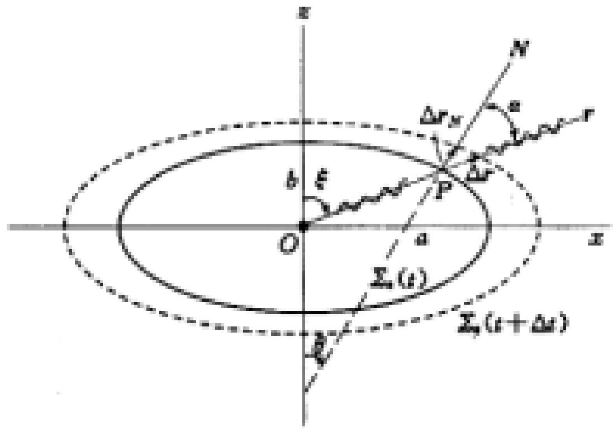

# 7.5.1 单轴晶体光学公式

> **脉络**：前面用[[7.4.3 光在晶体中的波面与惠更斯作图|o 光球面波和 e 光椭球面波]]定性说明了双折射。这里开始把 e 光的波面写成公式，并区分两个速度：==射线速度==描述能量沿光线方向传播的快慢，==波法向速度==描述波面沿法线方向推进的快慢。二者在各向同性介质中通常一致，但在单轴晶体中，尤其对 e 光，一般不相同。

---

### 一、 两个速度：射线速度和波法向速度

教材把本节开头放在“射线速度 $v_r$ 和波法向速度 $v_N$”上。

#### 1. 射线速度 $v_r$

==射线速度==沿光线方向，也就是能量传播方向。它具有直接物理意义，因为它描述光能量在晶体中实际向哪里走、走得多快。

在晶体中，尤其是 e 光，光线方向不一定等于波面法线方向。

#### 2. 波法向速度 $v_N$

==波法向速度==沿波面法线方向，也就是等相位面推进的方向。它具有几何意义，因为它更直接对应波面的位置变化。

在各向同性介质中，波面是球面，射线方向和波面法线方向一致，所以这两个速度通常不需要区分；但在单轴晶体中，e 光波面是椭球面，因此必须分清。

教材给出两者关系：

$$
v_N(P)=v_r(P)\cos\alpha
$$

其中 $\alpha$ 是射线方向与波法线方向之间的夹角。这个公式说明：波法向速度是射线速度在波法线方向上的投影。

---

### 二、 e 光波面的椭圆方程

教材从 e 光波面 $\Sigma(t)$ 随时间推进出发。对于单轴晶体，可以取光轴为 $z$ 方向。在这种坐标下，e 光波面是旋转椭球面。

主轴方向上的速度写为：

$$
(v_x,v_y,v_z)=(v_e,v_e,v_o)
$$

这里：

- $v_o=\dfrac{c}{n_o}$；
- $v_e=\dfrac{c}{n_e}$；
- $z$ 方向取为光轴方向；
- 在光轴方向上，e 光与 o 光速度相同，因此用 $v_o$；
- 在垂直光轴方向上，e 光速度由 $v_e$ 决定。

在包含光轴的 $xz$ 平面内，e 光波面截线是椭圆：

$$
\frac{x^2}{a^2}+\frac{z^2}{b^2}=1
$$

其中：

$$
a=v_e t=\frac{c}{n_e}t,\qquad b=v_o t=\frac{c}{n_o}t
$$

这个椭圆就是[[7.4.3 光在晶体中的波面与惠更斯作图|e 光椭球波面]]在主平面内的截面。

---

### 三、 椭圆切线斜率与射线方向

教材对椭圆方程微分：

$$
\frac{x^2}{a^2}+\frac{z^2}{b^2}=1
$$

两边求微分：

$$
\frac{2x}{a^2}dx+\frac{2z}{b^2}dz=0
$$

所以切线斜率：

$$
\frac{dz}{dx}=-\frac{b^2}{a^2}\frac{x}{z}
$$

代入

$$
a=\frac{c}{n_e}t,\qquad b=\frac{c}{n_o}t
$$

得到：

$$
\frac{b^2}{a^2}
=\frac{(c t/n_o)^2}{(c t/n_e)^2}
=\frac{n_e^2}{n_o^2}
$$

因此：

$$
\frac{dz}{dx}
=-\frac{n_e^2}{n_o^2}\frac{x}{z}
$$

教材中用角度 $\xi$ 和 $\theta$ 描述椭圆上一点的几何关系，最终给出：

$$
\tan\theta=\frac{n_e^2}{n_o^2}\tan\xi
$$

这里可先定性理解：

- $\xi$ 描述从椭圆中心指向波面上一点的方向；
- $\theta$ 描述该点波面法线或相关几何方向；
- 如果 $n_e=n_o$，椭圆退化为圆，就有 $\theta=\xi$；
- 如果 $n_e\ne n_o$，两角不相等，说明射线方向与波法线方向分离。

---

### 四、 最大分离角

教材给出最大分离角公式：

$$
\tan\alpha_M=\frac{n_o^2-n_e^2}{2n_o n_e}
$$

这里 $\alpha_M$ 表示射线方向与波法线方向之间可能达到的最大夹角。它的物理意义是：e 光能量传播方向和波面法线方向最多能偏离多少。

从公式可以看出：

- 若 $n_o=n_e$，则 $\tan\alpha_M=0$，没有分离；
- $n_o$ 和 $n_e$ 差别越大，分离角越明显；
- 这就是双折射率越大，e 光非寻常性越明显的一个表现。

---

### 五、 射线速度各向异性公式

教材把 e 光椭圆波面改写为极坐标形式。设从原点到椭圆上一点的距离为 $r(\xi)$，其中 $\xi$ 是该方向与某一主轴的夹角。由椭圆方程可得：

$$
r^2(\xi)=
\frac{a^2b^2}{a^2\cos^2\xi+b^2\sin^2\xi}
$$

代入：

$$
a=v_e t,\qquad b=v_o t
$$

得到：

$$
r^2(\xi)=
\frac{v_o^2v_e^2}{v_e^2\cos^2\xi+v_o^2\sin^2\xi}t^2
$$

因此射线速度为：

$$
v_r^2(\xi)=\left(\frac{r(\xi)}{t}\right)^2
=
\frac{v_o^2v_e^2}{v_e^2\cos^2\xi+v_o^2\sin^2\xi}
$$

这就是射线速度的各向异性公式。它说明 e 光的射线速度随方向 $\xi$ 改变。

---

### 六、 波法向速度各向异性公式

教材还给出波法向速度公式：

$$
v_N^2(\theta)=v_o^2\cos^2\theta+v_e^2\sin^2\theta
$$

其中 $\theta$ 描述波法线方向相对于晶体主轴的角度。

这个公式的含义是：波面沿法线推进的速度，也随法线方向改变。它和射线速度公式形式不同，教材特别说明“它不符合椭圆方程”。

这里先不急着把两个公式混在一起。做题时要先判断题目问的是：

- 光线、能流、实际传播方向：用射线速度 $v_r$；
- 波面推进、法线方向、折射率椭球相关量：用波法向速度 $v_N$。

---

### 七、 和折射率椭球的联系

教材提到“速度倒数面 - 折射率椭球面”。因为：

$$
n=\frac{c}{v}
$$

速度越大，折射率越小；速度越小，折射率越大。因此也可以不直接画速度面，而画速度倒数面，即折射率面。

对单轴晶体，主折射率就是：

$$
n_o,\qquad n_e
$$

它们决定 o 光球面、e 光椭球面，也决定后面波片和偏振器件中的相位延迟。

---

### 八、 本节需要记住的结论

> **结论一**：在单轴晶体中，e 光要区分射线速度 $v_r$ 和波法向速度 $v_N$。前者沿能量传播方向，后者沿波面法线方向。

> **结论二**：e 光波面在主平面内满足椭圆方程
> $$
> \frac{x^2}{a^2}+\frac{z^2}{b^2}=1
> $$
> 其中 $a=v_e t$，$b=v_o t$。

> **结论三**：e 光射线方向和波法线方向一般不同，角度关系可由
> $$
> \tan\theta=\frac{n_e^2}{n_o^2}\tan\xi
> $$
> 描述。

> **结论四**：射线速度各向异性公式为
> $$
> v_r^2(\xi)=
> \frac{v_o^2v_e^2}{v_e^2\cos^2\xi+v_o^2\sin^2\xi}
> $$
> 它来自 e 光椭球波面。

> **结论五**：波法向速度各向异性公式为
> $$
> v_N^2(\theta)=v_o^2\cos^2\theta+v_e^2\sin^2\theta
> $$
> 使用时要和射线速度公式区分。
