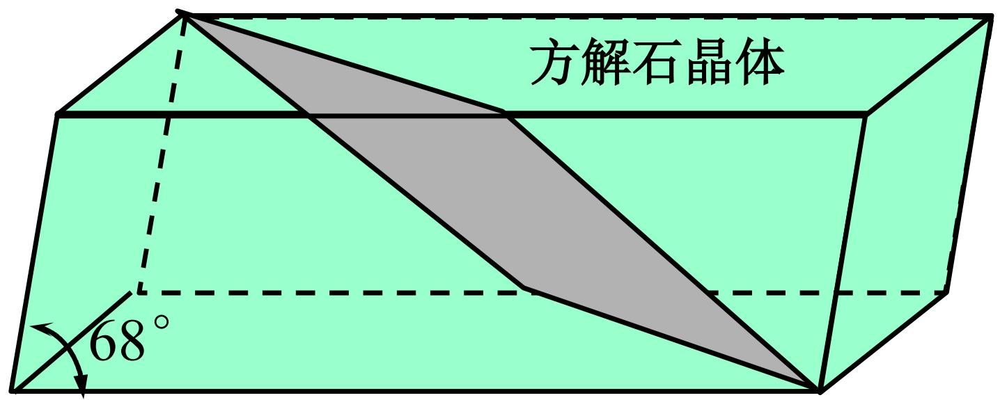
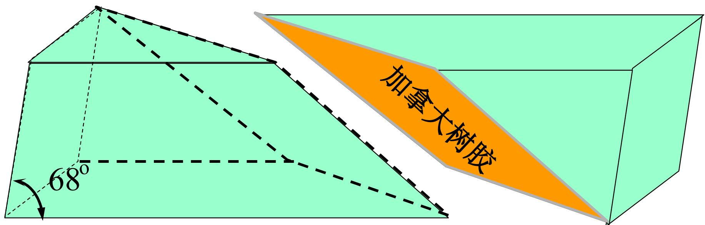
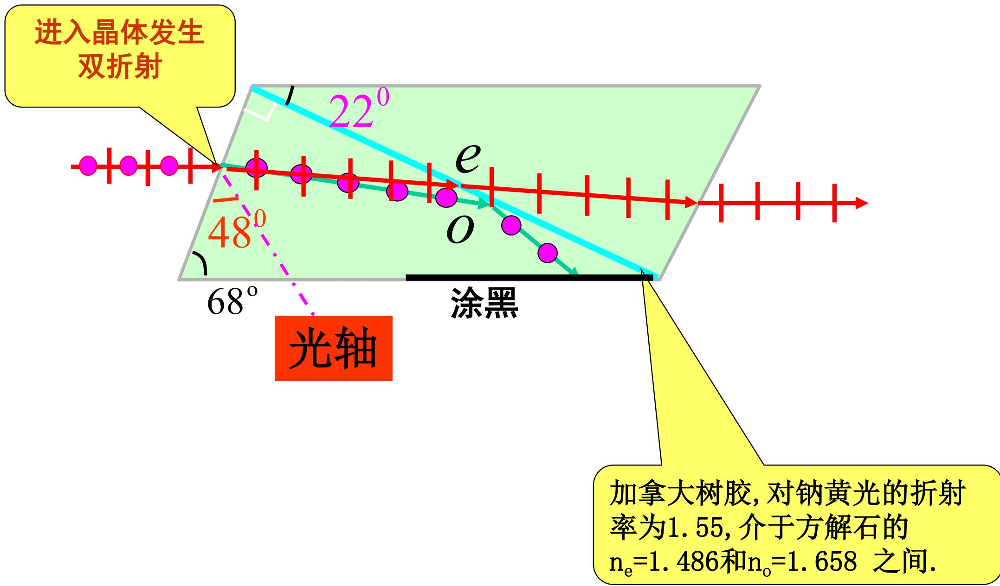
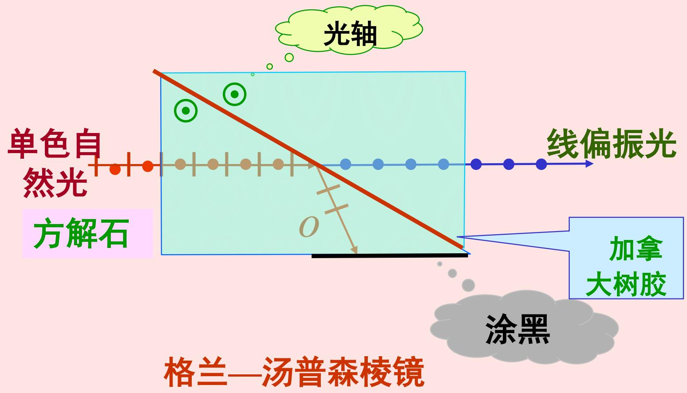
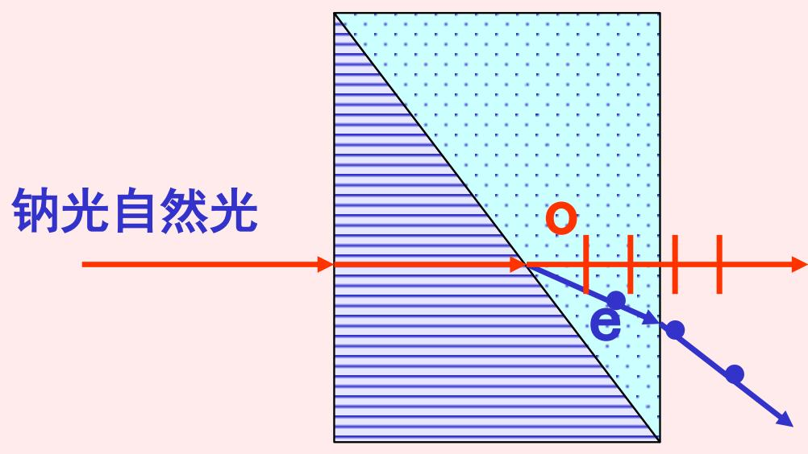
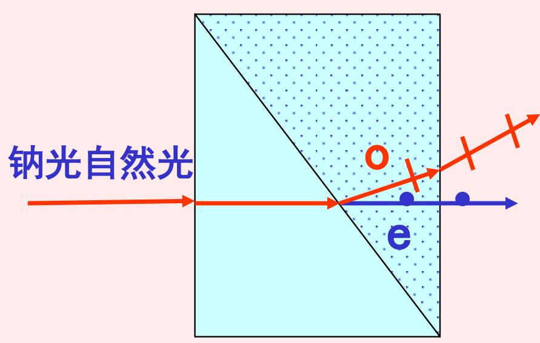

# 7.6.1 偏光棱镜与格兰-汤普森棱镜

> **脉络**：前面已经知道，双折射晶体会把入射光分成两个互相垂直的线偏振分量，即 [[7.4.2 o 光、e 光与双折射偏振特点|o 光和 e 光]]。偏光棱镜的基本思路就是利用这一点：先让自然光在方解石等晶体中发生双折射，再通过结构设计只让其中一束线偏振光沿有用方向射出，另一束被偏离、全反射或吸收。

### 一、 偏光棱镜要解决的问题

[[7.2.1 偏振片、起偏器和检偏器|偏振片]]可以把自然光变成线偏振光，但偏振片主要依靠选择吸收。对于强光、精密仪器或要求较高透过率的情况，偏振片不一定合适。

偏光棱镜使用的是另一种办法：

1. 选用具有明显双折射的晶体，例如方解石。
2. 让入射自然光进入晶体后分解成 o 光和 e 光。
3. 通过切割角度、胶合层折射率或涂黑吸收层，把其中一束去掉。
4. 剩下的一束就是线偏振光。

所以偏光棱镜本质上是一种==基于双折射的起偏器==。

它和[[3.3.2 偏振态变换与玻片组起偏|玻片组起偏]]的思路不同。玻片组依靠界面反射和折射对 $p$、$s$ 分量的反射率不同；偏光棱镜则依靠晶体内 o 光、e 光折射率和传播方向不同。

### 二、 尼科耳棱镜的结构

教材先给出尼科耳棱镜。它由一块方解石晶体切开，再用加拿大树胶胶合而成。

图中 $68^\circ$ 是方解石棱镜的一个重要切割角度。棱镜被沿斜面切开后，在切面处填入加拿大树胶。教材给出加拿大树胶对钠黄光的折射率约为：

$$
n = 1.55
$$

而方解石对钠黄光的主折射率约为：

$$
n_e = 1.486,\qquad n_o = 1.658
$$

这个数值关系很关键：

$$
n_e < n_{\text{胶}} < n_o
$$

也就是说，加拿大树胶的折射率处在方解石 e 光折射率和 o 光折射率之间。

### 三、 为什么 o 光会被去掉

自然光进入方解石后发生双折射，分成 o 光和 e 光。二者都是线偏振光，但偏振方向互相垂直。关于这一点可以回看[[7.4.2 o 光、e 光与双折射偏振特点|o 光、e 光与双折射偏振特点]]。

在尼科耳棱镜中，胶合层的作用不是普通连接，而是用折射率选择性地区分两束光：

- 对 o 光来说，方解石的折射率 $n_o = 1.658$ 大于加拿大树胶的折射率 $n_{\text{胶}} = 1.55$。
- 因此 o 光从方解石射向胶合层时，相当于从光密介质射向光疏介质。
- 如果入射角超过对应临界角，就会发生[[3.2.3 内反射与全反射临界角|全反射]]。
- 全反射后的 o 光被棱镜侧面涂黑部分吸收，不能从主出射方向出来。

对 e 光来说，方解石中的有效折射率较小，教材在这里按 $n_e = 1.486$ 理解。因为：

$$
n_e < n_{\text{胶}}
$$

e 光不满足从高折射率介质到低折射率介质的全反射条件，所以能通过胶合层，并从棱镜另一端射出。

因此尼科耳棱镜的输出光主要是 e 光，也就是一束线偏振光。

> **注意**：o 光和 e 光这两个名称只在晶体内部使用。射出棱镜之后，它们只是普通的线偏振光。这个说法和[[7.4.2 o 光、e 光与双折射偏振特点|o 光、e 光只在晶体内部有意义]]是一致的。

### 四、 格兰-汤普森棱镜

教材接着给出格兰-汤普森棱镜。

格兰-汤普森棱镜也使用方解石，也利用 o 光和 e 光的分离。它的图像可以这样理解：

1. 钠光自然光从左侧入射。
2. 在方解石中分成 o 光和 e 光。
3. 其中一束沿主方向通过，成为出射线偏振光。
4. 另一束被偏离到侧向，不作为有效输出光。

教材图中标出了光轴方向。光轴不是一条实际刻在晶体里的线，而是晶体内部的特殊方向。它决定了 o 光和 e 光的偏振方向，也决定了 e 光的有效折射率如何随传播方向变化。这个概念可以和[[7.4.1 晶体结构与双折射现象|晶体光轴]]联系起来理解。

格兰-汤普森棱镜的目的与尼科耳棱镜相同：获得一束偏振纯度较高的线偏振光。不同结构的偏光棱镜主要差别在于：

- 使用的晶体切割方向不同；
- 中间界面的胶合或空气间隔不同；
- 被舍弃的是 o 光还是 e 光，取决于具体设计；
- 有效通光角、透过率、可承受光强和使用波段不同。

### 五、 方解石和玻璃偏振器

教材后面还列出“方解石制成的罗匈棱镜”和“玻璃和方解石制成的偏振器”。

这些器件的共同点仍然是利用双折射来分离偏振分量。只要能让两个正交线偏振分量走向不同，就可以选取其中一束作为有用输出。

从学习角度看，不需要把每一种棱镜的结构都孤立背下来。更重要的是抓住共同逻辑：

> 自然光 $\rightarrow$ 双折射分成 o 光和 e 光 $\rightarrow$ 用全反射、偏折或吸收去掉一束 $\rightarrow$ 得到线偏振光。

### 六、 和前面知识的联系

偏光棱镜把第七章前面的几个概念连在一起：

- 和[[7.1.3 自然光、部分偏振光与偏振度|自然光]]有关：入射光常常是自然光，内部可看成许多随机振动方向的叠加。
- 和[[7.1.1 偏振态的定义与线偏振光|线偏振光]]有关：输出光只有一个稳定振动方向。
- 和[[7.4.2 o 光、e 光与双折射偏振特点|o 光和 e 光]]有关：双折射把自然光分解成两个正交线偏振分量。
- 和[[3.2.3 内反射与全反射临界角|全反射]]有关：尼科耳棱镜利用胶合层让其中一束光发生全反射。
- 和[[7.2.2 马吕斯定律及偏振态判别（重要）|检偏器和消光]]有关：如果用检偏器检查偏光棱镜的输出光，旋转到垂直方向时应接近消光。

### 七、 本节需要记住的结论

> **结论一**：偏光棱镜是基于晶体双折射的起偏器。它不是靠简单吸收任意方向电场，而是先把光分成两个正交线偏振分量，再舍弃其中一束。

> **结论二**：尼科耳棱镜用方解石和加拿大树胶构成。由于 $n_e < n_{\text{胶}} < n_o$，o 光可在胶合层发生全反射并被吸收，e 光透过，最后输出线偏振光。

> **结论三**：格兰-汤普森棱镜同样利用方解石的双折射分离 o 光和 e 光，通过结构设计让一束成为有用输出，另一束偏离或被舍弃。

> **结论四**：判断偏光棱镜的核心不是记图形外观，而是看它怎样利用折射率差、光轴方向和全反射条件来选择一个偏振分量。
