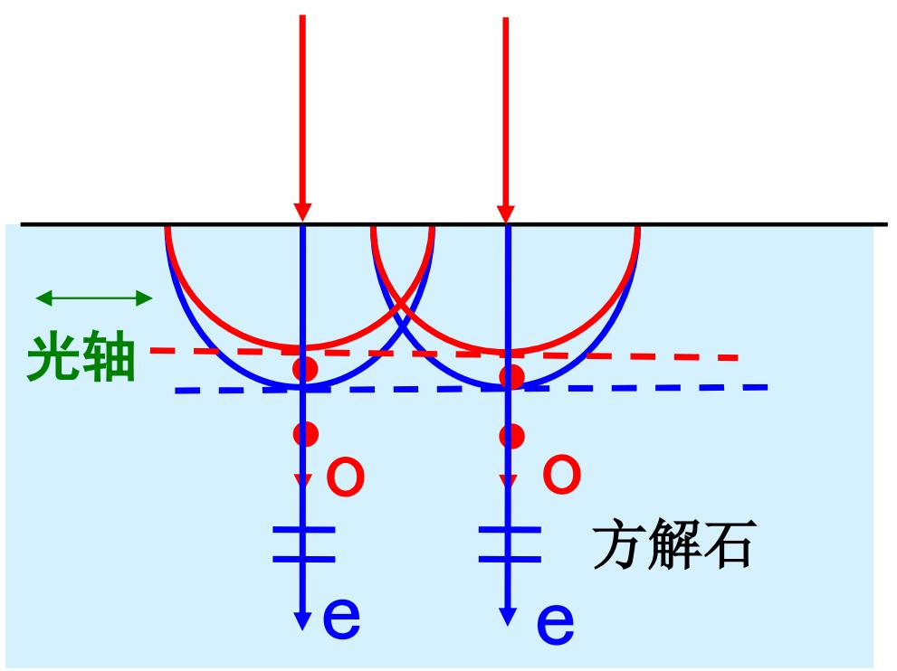
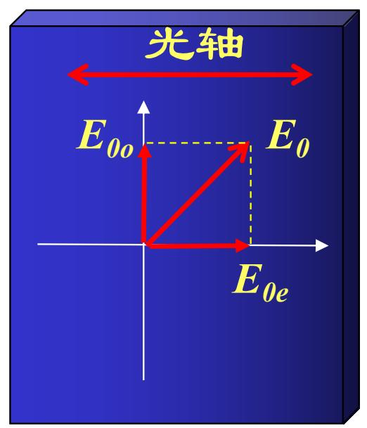
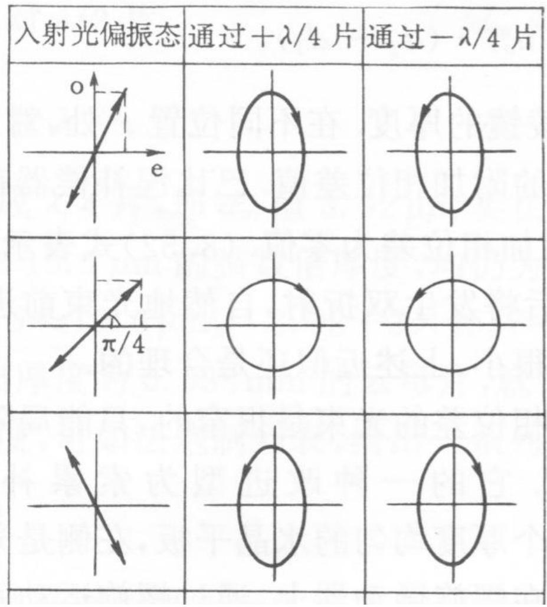
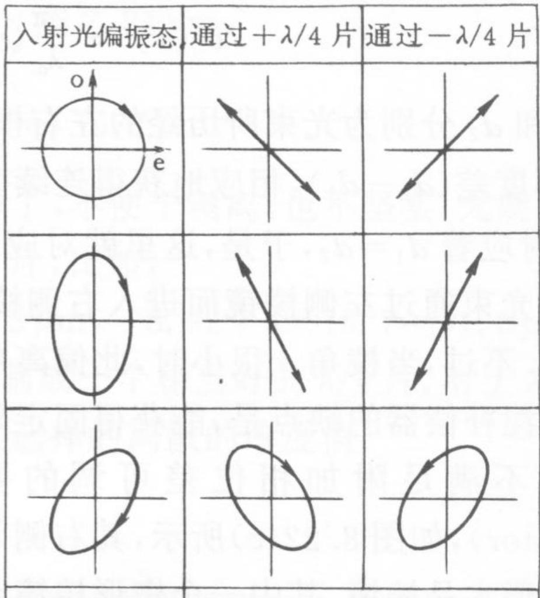

# 7.6.2 波片的相位延迟与四分之一波片

> **脉络**：[[7.6.1 偏光棱镜与格兰-汤普森棱镜|偏光棱镜]]主要用双折射把两束线偏振光分开，并舍弃其中一束。波片的目的不同：它通常不明显改变两束偏振分量的强度，而是利用 o 光、e 光传播速度不同，给两个正交分量引入固定相位差。相位差改变以后，偏振态就可能改变。

### 一、 什么是波片

把单轴晶体切成具有一定厚度的晶体片，并使晶体的==光轴平行于晶片表面==，这样的器件叫做==波片==。

当光垂直入射到波片表面时，光在晶体内部会分解为 o 光和 e 光。由于光的传播方向垂直于表面，而光轴在表面内，所以传播方向通常垂直于光轴。在这种情况下：

- o 光和 e 光具有互相垂直的振动方向；
- o 光和 e 光在晶体中的传播速度不同；
- 它们通过同一厚度 $d$ 后，到达后表面时产生附加相位差。

这和[[7.4.2 o 光、e 光与双折射偏振特点|o 光、e 光的双折射]]是同一个物理原因。不同的是，偏光棱镜主要利用传播方向的分离；波片主要利用传播速度不同造成的相位延迟。

### 二、 波片中的光程差

教材给出波片产生的光程差：

$$
\Delta = (n_o - n_e)d
$$

其中：

- $d$ 是波片厚度；
- $n_o$ 是 o 光在晶体中的折射率；
- $n_e$ 是 e 光在该传播方向上的折射率；
- $\Delta$ 是 o 光和 e 光之间的光程差。

由光程差得到相位差：

$$
\delta = \frac{2\pi}{\lambda}(n_o - n_e)d
$$

这里 $\lambda$ 是空气或真空中使用的参考波长。这个公式和[[1.2 光程的物理意义与相位差|光程差与相位差]]中的基本关系一致：

$$
\Delta\varphi = \frac{2\pi}{\lambda}\Delta
$$

波片只是把光程差的来源具体化为“同一晶体中 o 光和 e 光折射率不同”。

### 三、 相位差正负的意义

教材写道：

- 若 $\delta > 0$，表示 o 光落后；
- 若 $\delta < 0$，表示 o 光超前。

这是因为相位差的正负取决于我们怎样定义：

$$
\delta = \frac{2\pi}{\lambda}(n_o - n_e)d
$$

若 $n_o > n_e$，o 光的光程较大，等效传播“更慢”，所以 o 光相位落后。若 $n_o < n_e$，o 光的光程较小，o 光相位超前。

在实际记忆中，不要只背“o 光落后”或“e 光落后”。应该先看材料是正晶体还是负晶体，再看 $n_o$ 和 $n_e$ 哪个大。前面[[7.5.1 单轴晶体光学公式|单轴晶体光学公式]]中已经把 $n_o,n_e$ 和速度关系分开讨论过。

### 四、 波片只改变相位差，不主要改变强度

设入射光在波片的 o、e 方向上分解为：

$$
\left\{
\begin{array}{l}
E_o = E_{0o}\cos\omega t,\\
E_e = E_{0e}\cos(\omega t+\Delta\varphi).
\end{array}
\right.
$$

这里：

- $E_{0o}$ 是沿 o 方向分量的振幅；
- $E_{0e}$ 是沿 e 方向分量的振幅；
- $\Delta\varphi$ 是入射前两个分量已有的相位差。

经过波片后，教材的意思是：

$$
\left\{
\begin{array}{l}
E_o = E_{0o}\cos\omega t,\\
E_e = E_{0e}\cos(\omega t+\Delta\varphi+\delta).
\end{array}
\right.
$$

也就是说，波片给两个分量之间额外增加了相位差 $\delta$。

如果忽略吸收和反射损失，波片不主要改变 $E_{0o}$ 和 $E_{0e}$ 的大小。因此它不是普通意义上的“滤光器”，而是一个==相位延迟器==。它通过改变相位差来改变偏振态。

这和[[7.1.2 圆偏振光和椭圆偏振光|圆偏振光和椭圆偏振光]]的判据直接相连：两个正交分量的振幅和相位差共同决定偏振态。

### 五、 全波片

若波片满足：

$$
\delta = \frac{2\pi}{\lambda}(n_o - n_e)d = 2k\pi
$$

其中 $k$ 为整数，则称为==全波片==，也叫==波长片==或 $\lambda$ 片。

这时波片给两个正交分量增加的相位差是 $2\pi$ 的整数倍。由于相位差增加 $2\pi$ 后振动状态等效不变，所以出射光的偏振态与入射光相同。

教材的结论可以写成：

> 入射偏振光通过全波片后，不改变其偏振态。

这里的“不改变”指偏振态不改变，不是说光在晶体中完全没有相位变化。两个分量都在传播，只是它们之间的相对相位差回到了等效值。

### 六、 四分之一波片

若波片满足：

$$
\delta = \frac{2\pi}{\lambda}(n_o - n_e)d = 2k\pi + \frac{\pi}{2}
$$

则称为==四分之一波片==，也叫 $\lambda/4$ 片。

四分之一波片的核心作用是：给 o、e 两个正交分量增加四分之一个周期的相位差。四分之一个周期对应：

$$
\frac{\lambda}{4}\quad \Longleftrightarrow\quad \frac{\pi}{2}
$$

所以它特别适合在线偏振光和圆/椭圆偏振光之间转换。

教材给出的出射场可以理解为：

$$
\left\{
\begin{array}{l}
E_o = E_{0o}\cos\omega t,\\
E_e = E_{0e}\cos\left(\omega t+\Delta\varphi+2k\pi+\frac{\pi}{2}\right).
\end{array}
\right.
$$

因为 $2k\pi$ 不改变实际振动状态，所以关键就是附加的 $\pi/2$。

### 七、 线偏振光通过四分之一波片

如果一束线偏振光入射到四分之一波片，并且它的振动方向不平行于波片的 o 轴或 e 轴，那么入射线偏振光会分解成两个分量：

- 一个沿 o 方向；
- 一个沿 e 方向。

入射线偏振光原本两个分量相位相同或相差 $\pi$。经过四分之一波片后，两个分量多出 $\pm\pi/2$ 的相位差，于是合电场方向不再固定，而是在横截面内转动。

结果是：

- 若两个分量振幅相等，出射光为圆偏振光；
- 若两个分量振幅不相等，出射光为椭圆偏振光。

图中第一列是入射线偏振光的方向，第二列和第三列分别表示通过 $+\lambda/4$ 片和 $-\lambda/4$ 片后的结果。正负号不同，表示附加相位差方向不同，所以出射椭圆或圆偏振光的旋向不同。

特别地，当入射线偏振方向与波片 o、e 方向成 $45^\circ$ 时，两个分量振幅相等：

$$
E_{0o}=E_{0e}
$$

再经过 $\lambda/4$ 片得到 $\pi/2$ 相位差，就满足圆偏振条件：

$$
E_{0o}=E_{0e},\qquad \Delta\varphi=\pm\frac{\pi}{2}
$$

这正是[[7.1.2 圆偏振光和椭圆偏振光|圆偏振光的判据]]。

### 八、 圆偏振光或椭圆偏振光通过四分之一波片

四分之一波片的作用也可以反过来使用。

如果入射光本来是圆偏振光，或者主轴与波片光轴平行的正椭圆偏振光，那么它本来已经可以分解成两个正交分量，并且这两个分量之间有 $\pm\pi/2$ 的相位差。通过合适方向的 $\lambda/4$ 片后，波片再引入一个相反的 $\mp\pi/2$，总相位差变成 $0$ 或 $\pi$。

于是出射光变成线偏振光。

所以四分之一波片有两个常用方向：

- 线偏振光 $\rightarrow$ 椭圆偏振光或圆偏振光；
- 椭圆偏振光或圆偏振光 $\rightarrow$ 线偏振光。

### 九、 本节需要记住的结论

> **结论一**：波片是光轴平行于表面的单轴晶体薄片。光垂直通过时，会分解为 o 光和 e 光，并因为二者速度不同而产生相位延迟。

> **结论二**：波片的光程差和相位差为
> $$
> \Delta=(n_o-n_e)d,\qquad \delta=\frac{2\pi}{\lambda}(n_o-n_e)d.
> $$

> **结论三**：全波片满足 $\delta=2k\pi$，不改变入射光偏振态。

> **结论四**：四分之一波片满足 $\delta=2k\pi+\pi/2$，可以在线偏振光和圆/椭圆偏振光之间转换。入射线偏振方向与波片主轴成 $45^\circ$ 且两个分量振幅相等时，出射光为圆偏振光。
