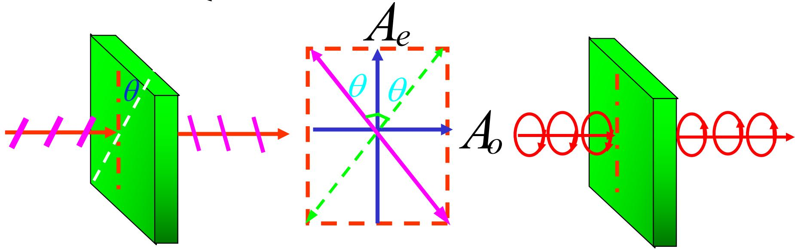
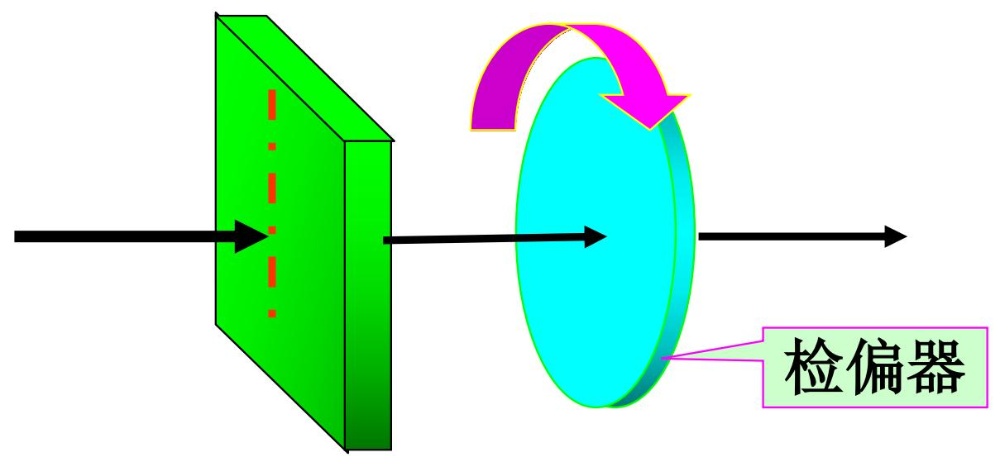
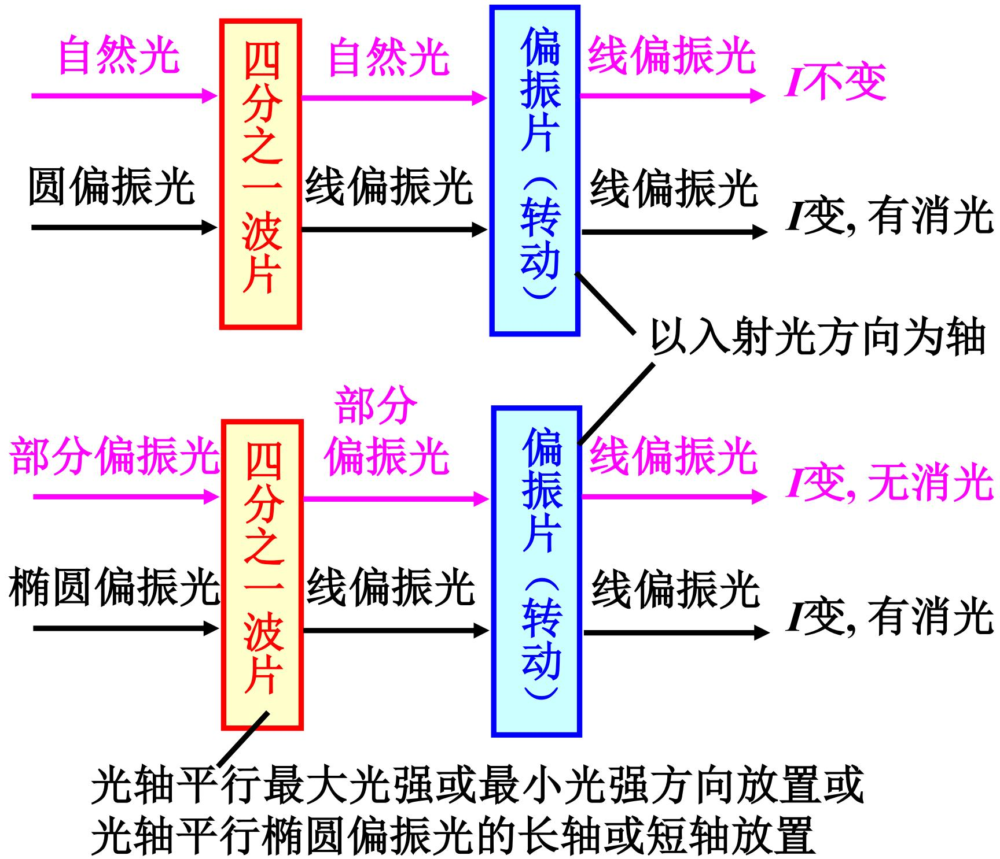
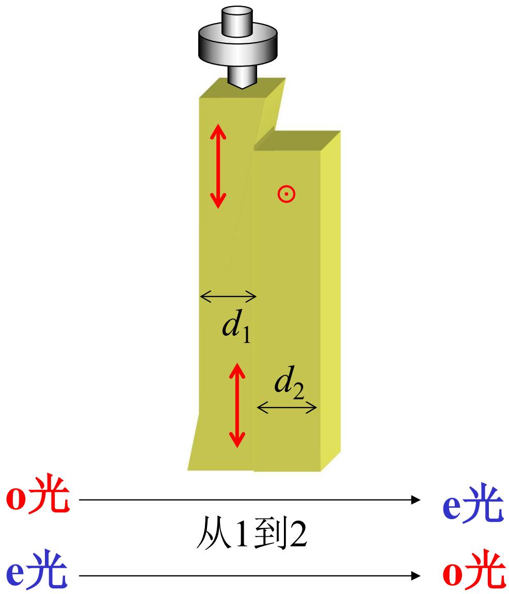

# 7.6.3 二分之一波片与偏振态检验

> **脉络**：[[7.6.2 波片的相位延迟与四分之一波片|四分之一波片]]给两个正交分量增加 $\pi/2$ 相位差，常用于线偏振光和圆/椭圆偏振光的转换。本节继续看二分之一波片。二分之一波片给两个正交分量增加 $\pi$ 相位差，所以它通常不把线偏振光变成椭圆偏振光，而是改变线偏振光的振动方向。最后用四分之一波片和偏振片组合，解决单个检偏器不能区分某些偏振态的问题。

### 一、 二分之一波片的条件

二分之一波片也叫 $\lambda/2$ 片。它满足：

$$
\delta = \frac{2\pi}{\lambda}(n_o-n_e)d=(2k+1)\pi
$$

其中：

- $\delta$ 是波片引入的 o、e 两分量附加相位差；
- $d$ 是波片厚度；
- $n_o,n_e$ 分别是 o 光和 e 光对应的折射率；
- $k$ 是整数。

二分之一波片的意思不是“光只走了半个波长”，而是两正交偏振分量之间多出半个周期的相位差：

$$
\frac{\lambda}{2}\quad \Longleftrightarrow\quad \pi
$$

所以它的关键作用是让其中一个分量相对于另一个分量反号。

### 二、 经过二分之一波片后的场

设入射光分解到波片的 o、e 方向后为：

$$
\left\{
\begin{array}{l}
E_o=E_{0o}\cos\omega t,\\
E_e=E_{0e}\cos(\omega t+\Delta\varphi).
\end{array}
\right.
$$

经过二分之一波片后：

$$
\left\{
\begin{array}{l}
E_o=E_{0o}\cos\omega t,\\
E_e=E_{0e}\cos(\omega t+\Delta\varphi+(2k+1)\pi).
\end{array}
\right.
$$

由于：

$$
\cos(x+\pi)=-\cos x
$$

所以可以把二分之一波片理解成：保持一个主轴方向上的分量不变，把另一个主轴方向上的分量变成相反号。

### 三、 二分之一波片对线偏振光的作用

如果入射光是线偏振光，并且它与波片主轴成角 $\theta$，则可以把它分解为沿 o、e 两方向的两个同相分量。

经过二分之一波片后，其中一个分量反号。合成结果仍然是线偏振光，但振动方向改变。

从图中可以看出，入射线偏振方向和出射线偏振方向相对于波片主轴是对称的。若入射偏振方向与某一主轴夹角为 $\theta$，则出射方向转到另一侧，整体转角为：

$$
2\theta
$$

这里的方向要看选用哪一条主轴作为参考。实际判断时只需记住：

> 二分之一波片把线偏振方向关于波片主轴作镜像翻转。

这和[[7.1.1 偏振态的定义与线偏振光|线偏振光]]的判据一致：相位差仍为 $0$ 或 $\pi$，所以出射光仍然是线偏振光，只是固定振动方向变了。

### 四、 为什么单个检偏器不够

在[[7.2.1 偏振片、起偏器和检偏器|偏振片作为检偏器]]中已经知道，单个旋转检偏器有两个盲区：

- 自然光和圆偏振光通过旋转检偏器时，光强都不随角度变化；
- 部分偏振光和椭圆偏振光通过旋转检偏器时，都表现为两强两弱，且一般不完全消光。

所以只用一个偏振片，不能完全区分这些偏振态。原因是偏振片只测量某一方向上的投影强度，它不能直接测出两个正交分量之间有没有稳定相位差。

四分之一波片正好可以改变相位差，所以它能把检偏问题转化为更容易判断的线偏振问题。

### 五、 用四分之一波片和偏振片区分圆偏振光与自然光

教材给出的装置是：先让待测光通过四分之一波片，再通过旋转偏振片 $P$。

#### 1. 若入射光是圆偏振光

圆偏振光可以分解成两个振幅相等、相位差为 $\pm\pi/2$ 的正交线偏振分量。若四分之一波片方向合适，它会再引入一个相反的 $\mp\pi/2$ 相位差，使总相位差变为 $0$ 或 $\pi$。

于是圆偏振光经过四分之一波片后变成线偏振光。

再用偏振片检验时，旋转偏振片会出现两亮两暗，并且可以完全消光。

#### 2. 若入射光是自然光

自然光虽然也可以分解成两个正交方向的分量，但这两个分量之间没有固定相位差。教材特别说明：

> 自然光在晶体波片内产生的 o 光和 e 光虽然同频率且振动方向相互垂直，但它们之间无固定的位相差，因此经过四分之一波片后仍然是自然光。

所以自然光经过四分之一波片后，仍然不能变成稳定的线偏振光。再通过旋转偏振片时，光强仍然不随角度变化。

这样就可以区分自然光和圆偏振光：

- 通过 $\lambda/4$ 片后再用偏振片检验，能消光的是圆偏振光；
- 光强始终不变的是自然光。

### 六、 用四分之一波片和偏振片区分椭圆偏振光与部分偏振光

椭圆偏振光可以看成两个正交线偏振分量的合成，并且这两个分量之间有稳定相位差。若把四分之一波片的光轴与椭圆的长轴或短轴平行放置，四分之一波片可以把这种稳定相位差调成 $0$ 或 $\pi$，使椭圆偏振光变成线偏振光。

然后用偏振片检验，会出现完全消光。

部分偏振光不同。它可以理解为一部分完全偏振光加上一部分自然光，或者理解为两个正交分量强度不同但相位差仍然随机变化。即使经过四分之一波片，它也不会整体变成完全线偏振光。

所以通过偏振片检验时，部分偏振光一般仍然不会完全消光。

判别思路可以记成：

- 椭圆偏振光 $\xrightarrow{\lambda/4\text{片}}$ 线偏振光 $\xrightarrow{P}$ 可消光；
- 部分偏振光 $\xrightarrow{\lambda/4\text{片}}$ 仍含自然光成分 $\xrightarrow{P}$ 无完全消光。

这补上了[[7.2.2 马吕斯定律及偏振态判别|马吕斯定律及偏振态判别]]中单个检偏器无法完成的部分。

### 七、 补偿器

教材最后给出补偿器。补偿器的作用是连续调节两束正交偏振光之间的相位差。

图中可以看成有两块晶体，厚度分别为 $d_1$ 和 $d_2$。两块晶体的光轴方向互相垂直，所以在第一块中作为 o 光的分量，到第二块中会按 e 光传播；在第一块中作为 e 光的分量，到第二块中会按 o 光传播。

教材给出的相位差为：

$$
\Delta\varphi
=\frac{2\pi}{\lambda}\left[(n_o-n_e)d_1+(n_e-n_o)d_2\right]
=\frac{2\pi}{\lambda}(n_o-n_e)(d_1-d_2)
$$

教材 OCR 中第二项写成了 $n_e-n_0$，这里按物理含义整理为 $n_e-n_o$。

这个公式说明：

- 如果 $d_1=d_2$，两块晶体引入的相位差互相抵消；
- 如果改变 $d_1-d_2$，就可以连续改变总相位差；
- 因此补偿器可以用来测量或补偿未知的相位延迟。

### 八、 本节需要记住的结论

> **结论一**：二分之一波片满足 $\delta=(2k+1)\pi$。它给两个正交分量引入半周期相位差，使其中一个分量相对反号。

> **结论二**：线偏振光通过二分之一波片后仍为线偏振光，但振动方向关于波片主轴发生镜像翻转；若入射方向与主轴夹角为 $\theta$，出射方向相当于转过 $2\theta$。

> **结论三**：四分之一波片加偏振片可以区分自然光与圆偏振光，也可以区分部分偏振光与椭圆偏振光。关键看经过 $\lambda/4$ 片后是否能转成线偏振光并出现完全消光。

> **结论四**：补偿器通过两块光轴互相垂直的晶体产生可调相位差，公式为
> $$
> \Delta\varphi=\frac{2\pi}{\lambda}(n_o-n_e)(d_1-d_2).
> $$
