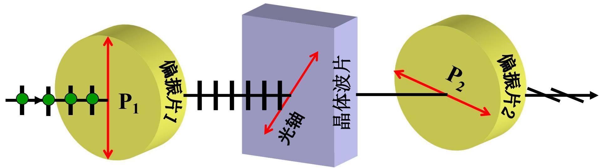
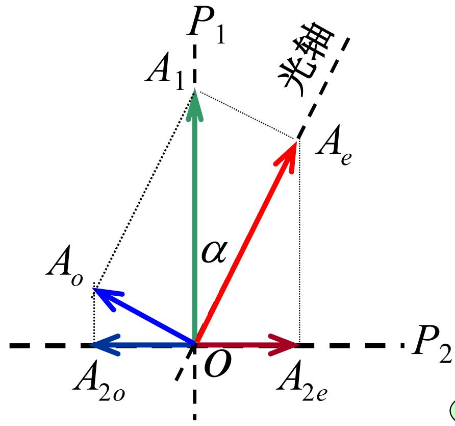
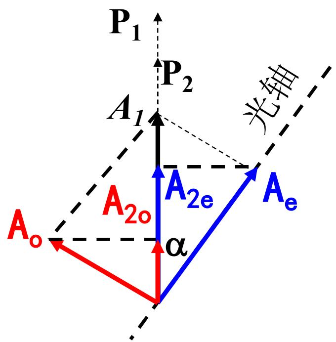
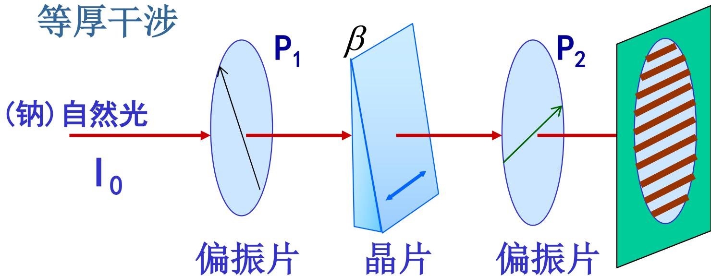

# 7.7.1 偏振光的干涉

> **脉络**：普通干涉要求两束光频率相同、振动方向不互相垂直、相位差稳定，见[[4.2.2 相干叠加的三个条件及其原因分析|相干叠加的三个条件]]。偏振光干涉的特殊处在于：晶片中的 o 光和 e 光本来振动方向互相垂直，不能直接干涉；但经过第二片偏振片投影到同一透振方向后，它们就可以相干叠加。晶片提供相位差，偏振片提供共同振动方向。

### 一、 偏振光干涉的装置

典型装置为：

$$
P_1 \rightarrow \text{晶体波片或晶片} \rightarrow P_2
$$

其中：

- $P_1$ 是起偏器，把自然光变成线偏振光；
- 中间晶片把这束线偏振光分解为 o 光和 e 光，并引入相位差；
- $P_2$ 是检偏器，把 o 光和 e 光分别投影到同一方向，使它们能够叠加。

如果没有 $P_2$，o 光和 e 光的振动方向相互垂直，干涉项中会出现矢量点乘为零的情况，不能形成通常意义上的明暗干涉条纹。这个观点和[[4.2.1 光强的定义与双光束叠加后的合成光强公式|双光束叠加光强公式]]完全一致。

### 二、 晶片先把线偏振光分解成 o 光和 e 光

设 $P_1$ 出射的线偏振光振幅为 $A_1$。晶片的光轴与 $P_1$ 透振方向夹角为 $\alpha$。进入晶片后，这束光被分解为：

$$
A_e=A_1\cos\alpha,\qquad A_o=A_1\sin\alpha
$$

两个分量在晶片内沿同一方向传播，但折射率不同，所以通过厚度 $d$ 后产生双折射相位差：

$$
\delta_0=\frac{2\pi}{\lambda}(n_o-n_e)d
$$

这里的 $\delta_0$ 只来自晶体双折射。后面如果 $P_2$ 与 $P_1$ 正交，还会因为投影方向相反多出一个 $\pi$。

这一点和[[7.6.2 波片的相位延迟与四分之一波片|波片相位延迟]]相同：晶体本身负责产生 $\frac{2\pi}{\lambda}(n_o-n_e)d$。

### 三、 $P_1\perp P_2$：正交偏振片

当 $P_1$ 与 $P_2$ 的透振方向互相垂直时，o 光和 e 光经过 $P_2$ 后投影到同一方向。教材图中记为：

投影后的振幅大小为：

$$
\left\{
\begin{array}{l}
A_{2e}=A_1\cos\alpha\sin\alpha,\\
A_{2o}=A_1\sin\alpha\cos\alpha.
\end{array}
\right.
$$

二者大小相等：

$$
A_{2e}=A_{2o}=\frac{1}{2}A_1\sin2\alpha
$$

但是由于投影方向相反，正交偏振片情况下总相位差为：

$$
\delta=\frac{2\pi}{\lambda}(n_o-n_e)d+\pi
$$

于是出射光强为：

$$
\begin{aligned}
I(P)
&=A_{2e}^2+A_{2o}^2+2A_{2e}A_{2o}\cos\delta\\
&=\frac{1}{2}A_1^2\sin^2 2\alpha\,(1+\cos\delta).
\end{aligned}
$$

由此得到：

- 当总相位差 $\delta=2k\pi$ 时，相长干涉，出现亮纹；
- 当总相位差 $\delta=(2k+1)\pi$ 时，相消干涉，出现暗纹。

换成晶体本身的相位差 $\delta_0$：

$$
\delta=\delta_0+\pi
$$

所以在正交偏振片中：

- $\delta_0=(2k+1)\pi$ 时亮；
- $\delta_0=2k\pi$ 时暗。

这和普通干涉的明暗条件相比多了一个 $\pi$，来源是第二片偏振片的投影方向关系。

### 四、 $P_1\parallel P_2$：平行偏振片

当 $P_1$ 与 $P_2$ 的透振方向平行时，投影关系变为：

投影后的振幅为：

$$
\left\{
\begin{array}{l}
A_{2e}=A_e\cos\alpha=A_1\cos^2\alpha,\\
A_{2o}=A_o\sin\alpha=A_1\sin^2\alpha.
\end{array}
\right.
$$

这时两束投影光之间没有额外的 $\pi$ 投影相位，只有晶体双折射造成的相位差：

$$
\delta=\frac{2\pi}{\lambda}(n_o-n_e)d
$$

光强为：

$$
\begin{aligned}
I(P)
&=A_{2e}^2+A_{2o}^2+2A_{2e}A_{2o}\cos\delta\\
&=A_1^2\left(1-\frac{1}{2}\sin^2 2\alpha+\frac{1}{2}\sin^2 2\alpha\cos\delta\right)\\
&=A_1^2\left[1-\frac{1}{2}\sin^2 2\alpha(1-\cos\delta)\right].
\end{aligned}
$$

因此：

- 当 $\delta=2k\pi$，即 $\frac{2\pi}{\lambda}(n_o-n_e)d=2k\pi$ 时，相长干涉，亮；
- 当 $\delta=(2k+1)\pi$，即 $\frac{2\pi}{\lambda}(n_o-n_e)d=(2k+1)\pi$ 时，相消干涉，暗。

严格说，平行偏振片下暗纹是否完全为零还取决于 $\alpha$。当 $\alpha=45^\circ$ 时，$\sin^2 2\alpha=1$，暗纹最暗，可以达到零光强；若 $\alpha$ 不是 $45^\circ$，则只是相对变暗。

### 五、 正交和平行两种情况互补

教材强调：

- 当 $P_1\parallel P_2$ 满足亮纹条件时，$P_1\perp P_2$ 为暗纹；
- 当 $P_1\parallel P_2$ 满足暗纹条件时，$P_1\perp P_2$ 为亮纹。

原因是正交偏振片比平行偏振片多了一个 $\pi$ 的投影相位。换句话说，转动第二个偏振片，使它从与 $P_1$ 正交变为与 $P_1$ 平行，观察到的明暗条纹会互补。

这和[[7.2.2 马吕斯定律及偏振态判别（重要）|多个偏振片中每片都重新投影电场]]的思想一致：偏振片不仅削弱光强，还会决定出射电场的振动方向。

### 六、 劈尖晶片的等厚干涉花样

教材例题给出劈尖晶片。

劈尖晶片厚度随位置 $x$ 变化。若楔角很小，厚度可近似写成：

$$
d\approx \beta x
$$

其中 $\beta$ 是劈尖角或厚度随 $x$ 的变化率。对 $P_1\perp P_2$，总相位差为：

$$
\delta=\frac{2\pi}{\lambda}(n_o-n_e)d+\pi
\approx \frac{2\pi}{\lambda}(n_o-n_e)\beta x+\pi
$$

因此不同位置 $x$ 有不同相位差，屏上出现条纹。厚度相同的地方相位差相同，光强相同，所以这是==等厚干涉花样==。

相邻两条同类条纹之间，相位差相差 $2\pi$：

$$
\frac{2\pi}{\lambda}(n_o-n_e)\beta\,\Delta x=2\pi
$$

所以条纹间距为：

$$
\Delta x=\frac{\lambda}{\beta(n_o-n_e)}
$$

这和第四章薄膜等厚干涉的逻辑类似：都是厚度变化引起相位差变化，再由相位差决定明暗。不同点在于，这里相位差来自 o 光和 e 光的折射率差，而不是薄膜上下表面反射光的光程差。

### 七、 本节需要记住的结论

> **结论一**：偏振光干涉需要晶片和检偏器共同作用。晶片把线偏振光分成 o 光、e 光并产生相位差；检偏器把两束互相垂直的偏振光投影到同一方向，使它们能够干涉。

> **结论二**：正交偏振片时，总相位差为
> $$
> \delta=\frac{2\pi}{\lambda}(n_o-n_e)d+\pi.
> $$
> 平行偏振片时，总相位差为
> $$
> \delta=\frac{2\pi}{\lambda}(n_o-n_e)d.
> $$

> **结论三**：平行和正交偏振片观察到的明暗互补，本质原因是正交情形多了一个投影引起的 $\pi$ 相位差。

> **结论四**：劈尖晶片厚度 $d\approx\beta x$ 时，会形成偏振光等厚干涉条纹，条纹间距为
> $$
> \Delta x=\frac{\lambda}{\beta(n_o-n_e)}.
> $$
