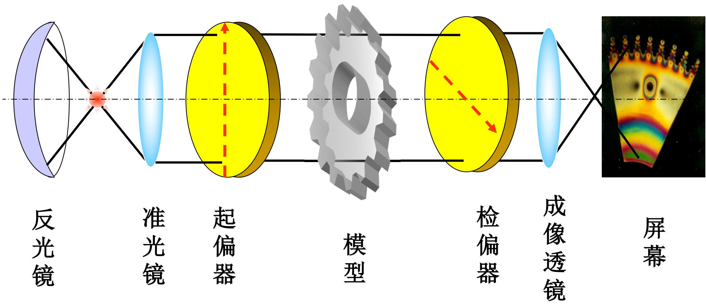
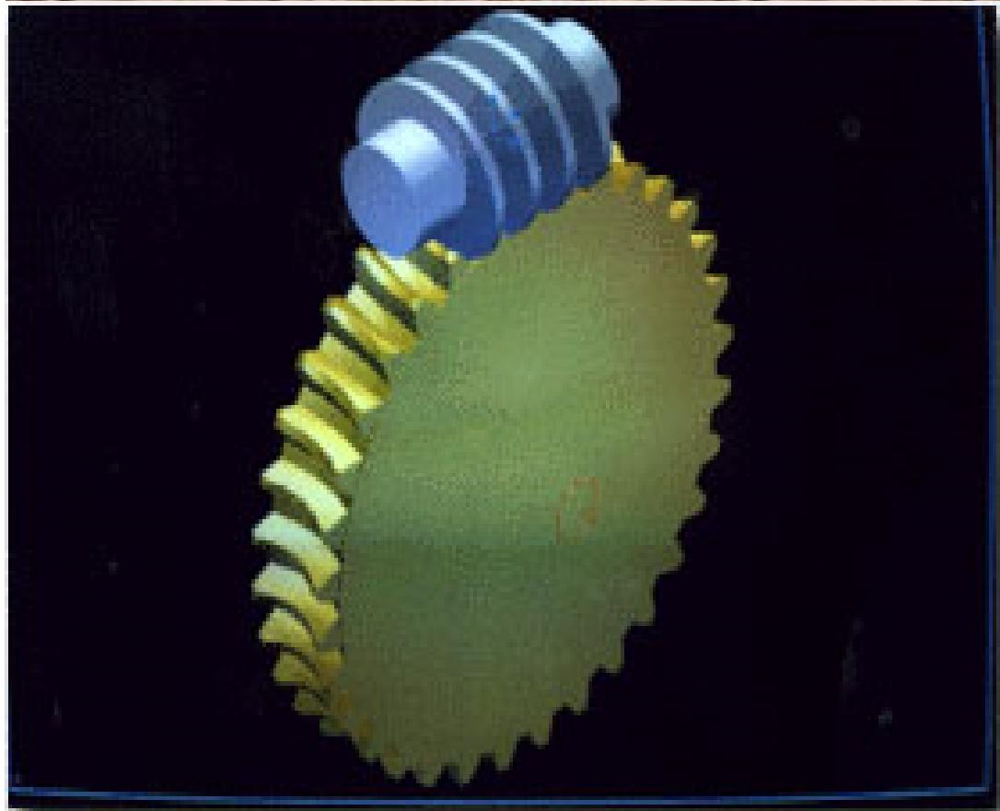
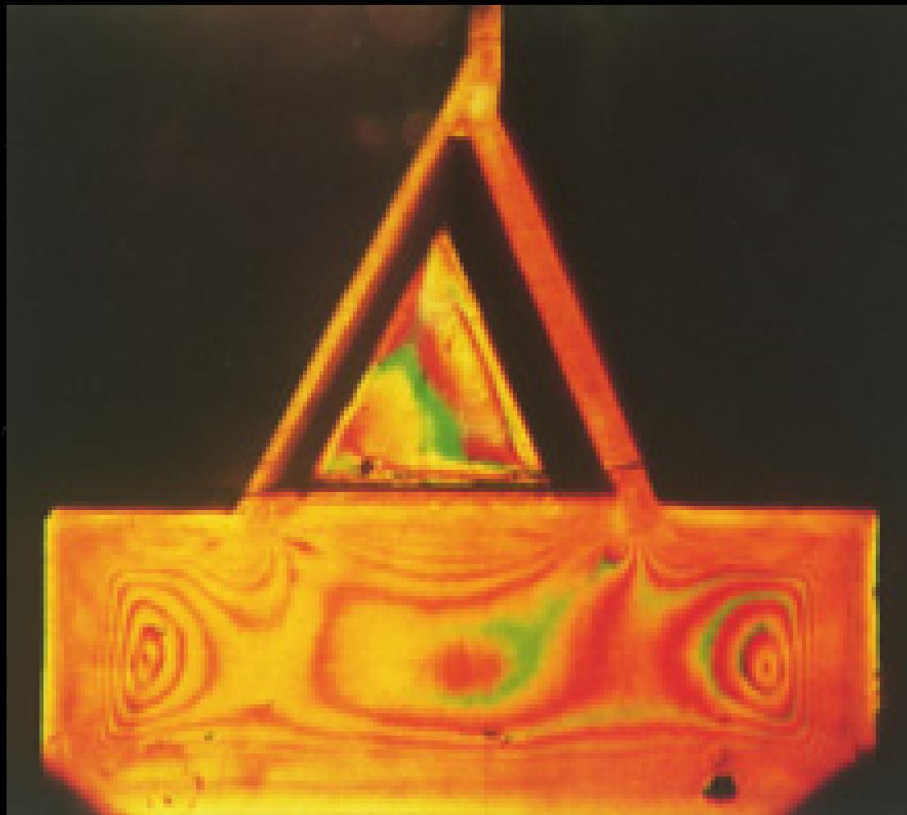
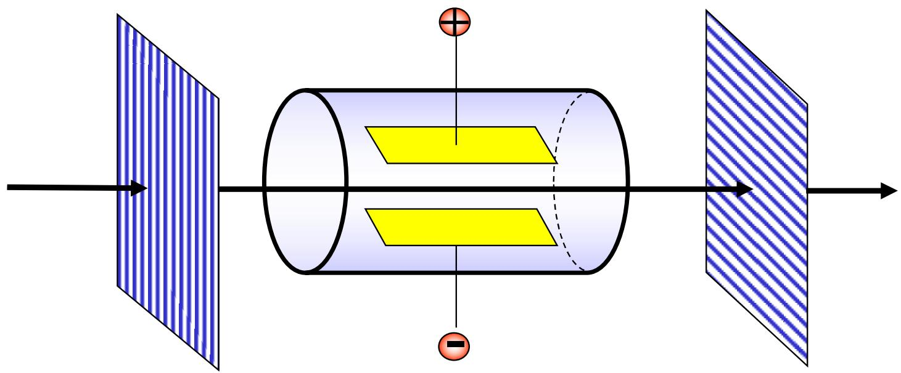
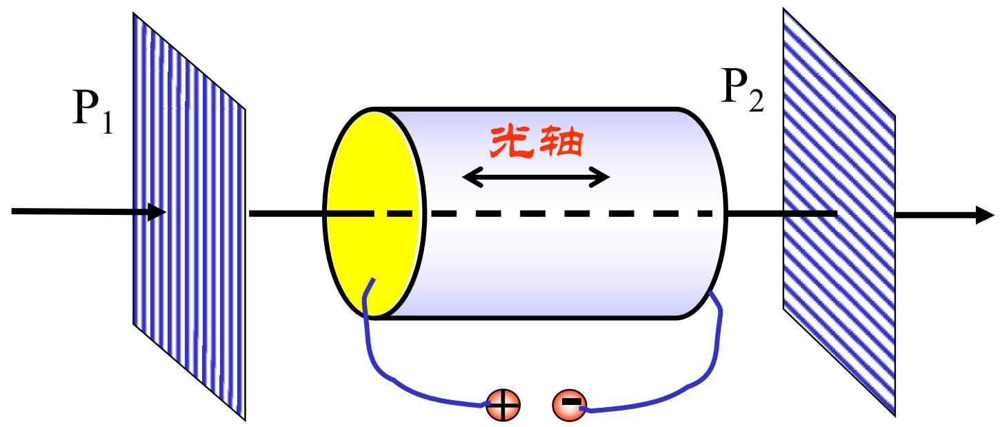

# 7.8.1 人工双折射与光弹效应

> **脉络**：前面讨论的双折射主要来自晶体本身的各向异性，见[[7.4.1 晶体结构与双折射现象|晶体结构与双折射现象]]。本节讨论==人工双折射==：原来各向同性的介质，或者原来在某个方向不显示双折射的晶体，在外力、电场等外界作用下变成光学各向异性介质，从而产生双折射。它的观测方法通常要结合[[7.7.1 偏振光的干涉|偏振光干涉]]。

### 一、 什么是人工双折射

==人工双折射==指介质在外界作用下获得各向异性，从而出现双折射现象。

外界作用可以是：

- 机械应力；
- 外加电场；
- 外加磁场；
- 温度梯度或其他改变内部结构对称性的因素。

本节教材重点讲三类：

1. 光弹效应：应力引起双折射；
2. 克尔效应：电场在某些各向同性透明介质中引起双折射；
3. 泡克耳斯效应：电场在某些晶体中引起线性电光双折射。

共同逻辑是：

$$
\text{外界作用} \rightarrow \text{折射率差 }\Delta n \rightarrow \text{相位差 }\delta \rightarrow \text{偏振干涉光强 }I
$$

### 二、 光弹测量的基本思想

教材先讲光弹测量。把实际构件做成透明模型，放到偏振光场中，在模型上施加拉力或压力。应力会改变介质内部结构，使原来各向同性的材料变成各向异性材料，于是产生双折射。

光弹测量的基本链条为：

$$
\Delta n(x,y)=n_o-n_e
\Longleftrightarrow
\delta(x,y)=\frac{2\pi}{\lambda}d\,\Delta n(x,y)
\Longleftrightarrow
I(x,y)
$$

其中：

- $(x,y)$ 表示模型上不同位置；
- $\Delta n(x,y)$ 是该处应力导致的双折射率；
- $d$ 是模型厚度；
- $\delta(x,y)$ 是 o、e 两分量之间的相位差；
- $I(x,y)$ 是经过偏振片系统后观察到的光强分布。

这和[[7.6.2 波片的相位延迟与四分之一波片|波片相位延迟公式]]形式相同，只是这里的折射率差不是晶体天然给出的，而是由应力产生的。

### 三、 应力怎样反映到条纹上

在一定应力范围内，教材指出：

$$
\Delta n \propto \text{应力}
$$

也就是说，应力越大，材料中两个主方向的折射率差越大，产生的相位差也越大。

由于相位差进入偏振光干涉公式，空间中应力分布会变成明暗或彩色条纹分布。条纹越密、变化越快，说明相位差变化越快，通常也意味着应力梯度较大。

实验中先对模型进行测量，再利用相似原理换算实际构件中的应力。这就是光弹测量的实用价值。

从学习角度看，不需要把每一张条纹图都背下来。要记住的是：

> 应力不是直接被眼睛看到的，而是先转化为折射率差，再转化为相位差，最后通过偏振光干涉转化为光强条纹。

### 四、 克尔效应

教材接着讲==克尔效应==。

某些各向同性透明介质，例如非晶体和液体，在外电场作用下会显示双折射现象，这叫克尔效应。

外加电场破坏介质原来的各向同性，使介质变成各向异性。教材指出，光轴方向平行于电场方向。

克尔效应中的双折射率满足：

$$
\Delta n=n_o-n_e\propto E^2
$$

通常写成：

$$
\Delta n=bE^2
$$

其中：

- $E$ 是外加电场强度；
- $b$ 是与介质有关的比例常数。

教材又把相位差写成：

$$
\Delta\varphi=2\pi K l E^2
$$

其中：

- $l$ 是光通过电场区的长度；
- $K$ 是克尔常数；
- $E$ 是外加电场强度。

这可以由波片相位差公式理解：

$$
\Delta\varphi=\frac{2\pi}{\lambda}l\Delta n
$$

把 $\Delta n\propto E^2$ 代入，就得到相位差与 $E^2$ 成正比。

### 五、 克尔盒的透过光强和开关作用

教材给出通过 $P_2$ 后的光强：

$$
I(P)=A_1^2\sin^2 2\alpha\left(1-\cos\Delta\varphi\right)
$$

代入克尔相位差：

$$
I(P)=A_1^2\sin^2 2\alpha
\left[1-\cos\left(2\pi K l E^2\right)\right]
$$

这里的结构与正交偏振片下的偏振光干涉相同。外电场改变 $\Delta\varphi$，于是改变透过光强。

当 $E=0$ 时：

$$
\Delta\varphi=0,\qquad I(P)=0
$$

也就是说，不加电场时，正交偏振片系统基本不透光。

当：

$$
2\pi K l E^2=\pi
$$

时，$1-\cos\Delta\varphi$ 最大，透过光强达到极大。若电极间距为 $d$，外加电压 $U=Ed$，则对应电压为：

$$
U=Ed=\frac{d}{\sqrt{2Kl}}
$$

因此克尔盒可以作为==电光开关==：

- 电压为 0 时，光路关闭；
- 电压达到特定值时，光路打开；
- 电压随信号变化时，透过光强也随之变化，所以可作光调制器。

教材提到克尔效应响应时间很短，可达 $10^{-9}\ \mathrm{s}$，因此可用于高速光闸、光调制器、高速摄影和激光通信等。

### 六、 泡克耳斯效应

教材最后讲==泡克耳斯效应==，也叫线性电光效应。

图中光传播方向与电场方向平行，$P_1\perp P_2$。晶体是单轴晶体，光轴沿光传播方向。不加电场时，光沿光轴传播，不发生双折射；加电场后，晶体变成等效双轴晶体，原光轴方向出现附加双折射。

泡克耳斯效应的特点是：

$$
\Delta n \propto E
$$

教材写为：

$$
\Delta n=\gamma n_o^3 E
$$

其中：

- $n_o$ 是 o 光在晶体中的折射率；
- $\gamma$ 是电光常数；
- $E$ 是外加电场强度。

所以泡克耳斯效应是==线性电光效应==。这与克尔效应的 $\Delta n\propto E^2$ 不同。

通过长度为 $l$ 的电场区后，相位差为：

$$
\Delta\varphi
=\frac{2\pi}{\lambda}n_o^3\gamma E l
$$

若电场方向沿光传播方向，且电压 $V=El$，则可写为：

$$
\Delta\varphi
=\frac{2\pi}{\lambda}n_o^3\gamma V
$$

当：

$$
\Delta\varphi=\pi
$$

时，$P_2$ 透光最强。对应电压称为半波电压。

教材举例：KDP 晶体对 $\lambda=546\ \mathrm{nm}$ 的绿光，$n_o=1.51$，$\gamma=10.6\times10^{-12}\ \mathrm{m/V}$，当 $\Delta\varphi=\pi$ 时，半波电压约为 $7600\ \mathrm{V}$。这个电压比克尔盒要求的电压低得多。

泡克耳斯效应响应时间也很短，一般小于 $10^{-9}\ \mathrm{s}$，可用于超高速开关、激光调 $Q$、显示技术和数据处理等。

### 七、 三种效应的比较

| 类型 | 外界作用 | 折射率差关系 | 主要用途 |
|---|---|---|---|
| 光弹效应 | 机械应力 | $\Delta n$ 与应力近似成正比 | 应力测量、结构分析 |
| 克尔效应 | 外电场 | $\Delta n\propto E^2$ | 电光开关、光调制器 |
| 泡克耳斯效应 | 外电场 | $\Delta n\propto E$ | 高速电光开关、调 $Q$ |

三者都不是新的偏振态定义，而是制造双折射的方法。它们都要通过相位差和偏振光干涉来观察效果。

### 八、 本节需要记住的结论

> **结论一**：人工双折射是外力或外场使介质产生各向异性，从而出现折射率差 $\Delta n$ 的现象。

> **结论二**：光弹效应中，应力引起 $\Delta n(x,y)$，再引起
> $$
> \delta(x,y)=\frac{2\pi}{\lambda}d\,\Delta n(x,y),
> $$
> 最后通过偏振光干涉形成光强条纹。

> **结论三**：克尔效应中 $\Delta n\propto E^2$，相位差可写为 $\Delta\varphi=2\pi K l E^2$，因此可用电压控制透过光强。

> **结论四**：泡克耳斯效应中 $\Delta n=\gamma n_o^3E$，属于线性电光效应；它的半波电压通常比克尔效应低，适合高速电光调制。
