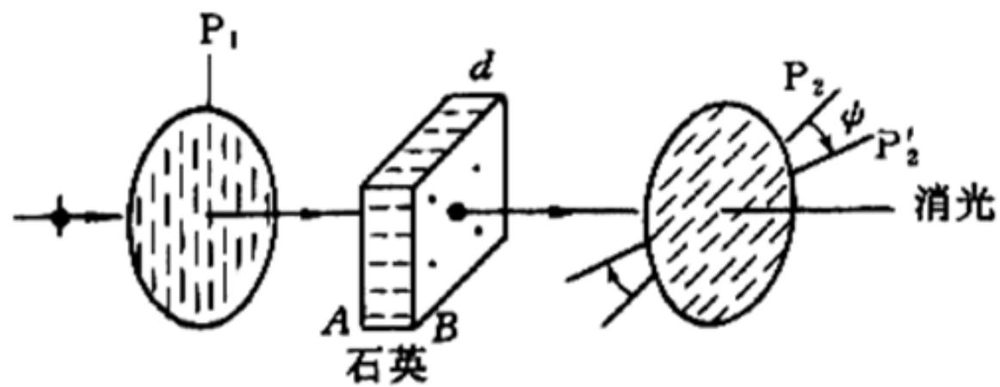
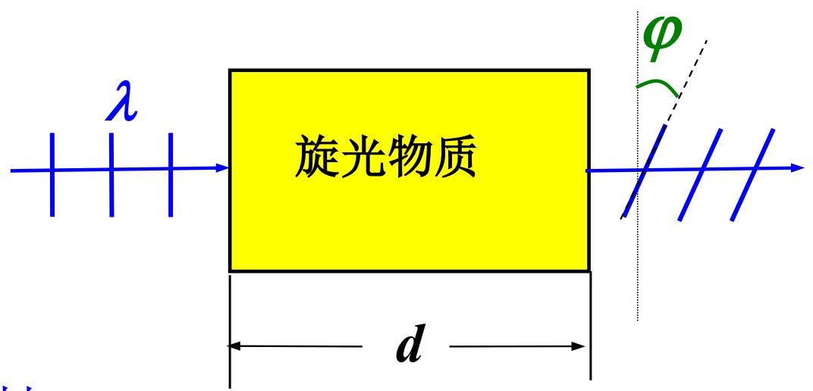
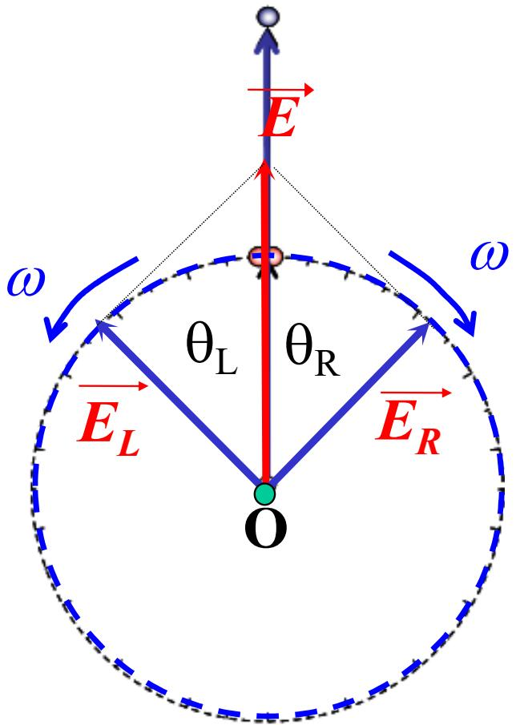
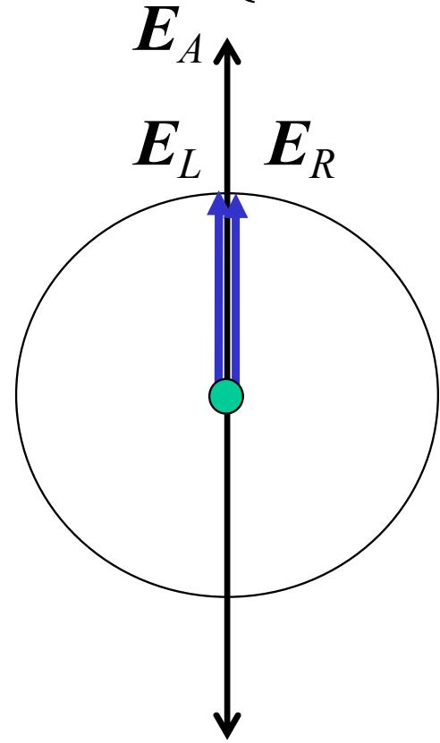
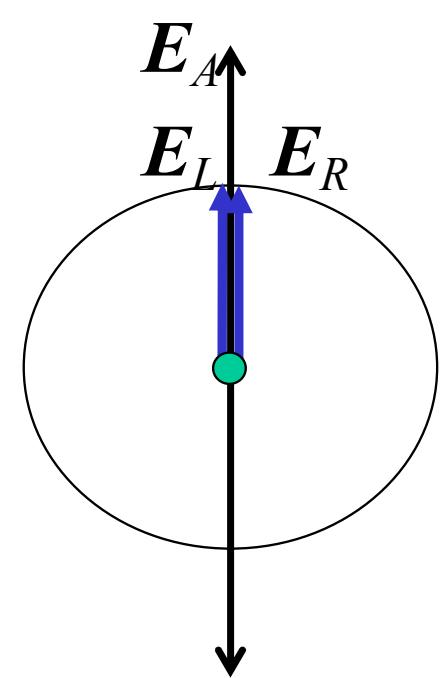
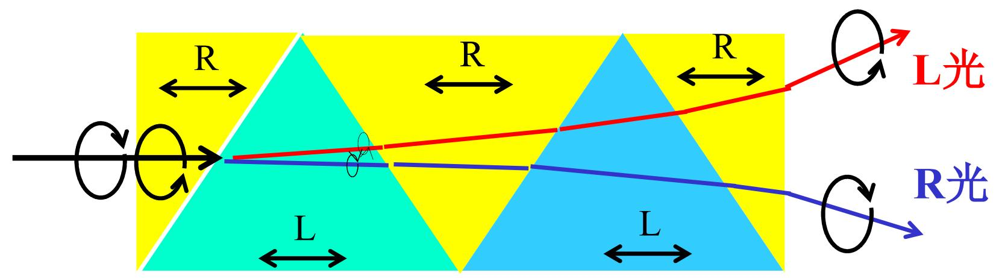

# 7.9.1 旋光现象与菲涅耳解释

> **脉络**：前面学习的波片会把线偏振光变成椭圆偏振光或改变线偏振方向，核心是两个正交线偏振分量获得相位差。旋光现象看起来也像“偏振方向转了”，但它的解释方式不同：线偏振光可以分解为左旋、右旋两个圆偏振光；旋光介质让这两个圆偏振光具有不同传播速度，重新合成后仍是线偏振光，只是偏振面旋转了。

### 一、 旋光实验现象

教材以石英晶片为例说明旋光现象。

实验装置可以理解为：

$$
P_1 \rightarrow \text{石英晶片} \rightarrow P_2
$$

如果没有旋光物质，并且 $P_1\perp P_2$，理想情况下应当消光。但是插入石英晶片后，教材给出：

$$
P_1\perp P_2,\qquad I_2\neq 0
$$

也就是说，原来正交的偏振片不再完全消光。

如果把 $P_2$ 再转过一个角度 $\psi$，又可以重新消光：

$$
I_2=0
$$

这说明从石英晶片出来的光仍然是线偏振光，只是它的偏振面相对原来旋转了一个角度。

### 二、 旋光性和旋光率

某些物质能使线偏振光的振动面发生旋转，这种性质称为==旋光性==。

教材列出的例子包括：

- 石英；
- 氯酸钠；
- 糖的水溶液；
- 酒石酸溶液；
- 松节油等。

线偏振面旋转的角度满足：

$$
\varphi=\alpha d
$$

其中：

- $\varphi$ 是偏振面旋转角；
- $d$ 是光在旋光物质中传播的厚度或长度；
- $\alpha$ 是旋光率，也叫比旋光率。

$\alpha$ 取决于入射光波长和旋光物质本身。也就是说，同一种物质对不同波长的光旋转角可能不同。

这个公式说明：在同一种旋光物质、同一波长下，传播距离越长，偏振面旋转角越大。

### 三、 线偏振光也可以分解成左右圆偏振光

在[[7.1.2 圆偏振光和椭圆偏振光|圆偏振光和椭圆偏振光]]中，已经知道圆偏振光和椭圆偏振光可以分解为两个互相垂直、相位差稳定的线偏振光。

菲涅耳解释旋光现象时使用反过来的分解：

> 任何线偏振光都可以分解成两个同频、振幅相等、旋向相反、相位关系稳定的圆偏振光。

教材写为：

$$
E(t)=E_0\cos\omega t=E_L(t)+E_R(t)
$$

并且：

$$
E_L=E_R=\frac{E_0}{2}
$$

这里 $E_L$ 表示左旋圆偏振分量，$E_R$ 表示右旋圆偏振分量。

图中两个圆偏振分量方向相反地转动。若它们角速度相同、振幅相等，横向分量会互相抵消，沿某一直线方向的分量会相加，于是合成结果就是线偏振光。

### 四、 旋光介质中左右圆偏振光速度不同

在旋光晶体中，左旋圆偏振光和右旋圆偏振光的传播速度不同：

$$
v_L\neq v_R
$$

由于折射率与速度关系为：

$$
n=\frac{c}{v}
$$

所以：

$$
n_L=\frac{c}{v_L}\neq n_R=\frac{c}{v_R}
$$

这就是旋光现象的关键。普通双折射区分的是 o 光和 e 光，即两个正交线偏振本征态；旋光介质区分的是左旋和右旋圆偏振本征态。

通过厚度 $d$ 后，两圆偏振分量经历的光程不同，产生不同的相位落后：

$$
\left\{
\begin{array}{l}
\Delta\phi_L(B)=\phi_L(A)-\dfrac{2\pi}{\lambda}n_Ld,\\
\Delta\phi_R(B)=\phi_R(A)-\dfrac{2\pi}{\lambda}n_Rd.
\end{array}
\right.
$$

这里 $A$ 表示晶体前表面，$B$ 表示晶体后表面。

### 五、 为什么重新合成后还是线偏振光

左旋和右旋圆偏振光通过晶体后，只是相位分别改变。它们仍然具有：

- 相同频率；
- 相等振幅；
- 相反旋向。

所以二者重新合成后仍然是线偏振光。变化的是：两圆偏振分量的相对角位置变了，因此合成线偏振光的方向变了。

教材图中把这个方向说成：后表面合成的线偏振光矢量，位于 $\alpha_L$ 和 $\alpha_R$ 夹角的平分线上。

所以旋光不是把线偏振光变成圆偏振光，而是让线偏振光的振动面发生旋转。

### 六、 旋光角公式

若：

$$
n_L>n_R
$$

则左旋圆偏振光折射率较大、相位落后更多。教材给出右旋角度：

$$
\varphi_R=\frac{1}{2}(\alpha_L-\alpha_R)
=\frac{\pi}{\lambda}(n_L-n_R)d
$$

这种晶体称为右旋晶体。

若：

$$
n_L<n_R
$$

则右旋圆偏振光折射率较大、相位落后更多。教材给出左旋角度：

$$
\varphi_L=\frac{1}{2}(\alpha_R-\alpha_L)
=\frac{\pi}{\lambda}(n_R-n_L)d
$$

这种晶体称为左旋晶体。

两式可以合并理解为：

$$
|\varphi|=\frac{\pi}{\lambda}|n_L-n_R|d
$$

旋转方向由 $n_L$ 和 $n_R$ 的大小关系决定。

这里的 $1/2$ 很重要。左右圆偏振分量之间的相位差改变了一个量，但合成线偏振方向只转过这个相对改变的一半。

### 七、 菲涅耳复合棱镜

教材最后提到菲涅耳复合棱镜。

它利用左右圆偏振光在旋光晶体中的折射率不同，使两种圆偏振光发生不同偏折，从而分离出来。

教材给出它的意义：

1. 证实菲涅耳关于晶体旋光性机理的解释；
2. 提供一种产生圆偏振光的典型器件。

这说明“线偏振光可分解为左、右圆偏振光”不是单纯数学形式，而是能通过不同折射率和不同偏折方向表现出来的物理分解。

### 八、 和普通双折射的比较

| 项目 | 普通晶体双折射 | 旋光现象 |
|---|---|---|
| 本征分量 | o 光和 e 光 | 左旋圆偏振光和右旋圆偏振光 |
| 折射率差 | $n_o-n_e$ | $n_L-n_R$ |
| 常见结果 | 分成两束线偏振光或产生相位延迟 | 线偏振面旋转 |
| 典型公式 | $\delta=\frac{2\pi}{\lambda}(n_o-n_e)d$ | $\varphi=\frac{\pi}{\lambda}(n_L-n_R)d$ |

普通波片常把线偏振光变成椭圆或圆偏振光；旋光介质则把线偏振光仍保持为线偏振光，只是旋转它的方向。

### 九、 本节需要记住的结论

> **结论一**：旋光性是某些物质使线偏振光振动面旋转的性质。旋转角在简单情况下满足 $\varphi=\alpha d$。

> **结论二**：菲涅耳解释认为，线偏振光可以分解为振幅相等、旋向相反的左旋和右旋圆偏振光。

> **结论三**：旋光介质中 $n_L\neq n_R$，所以左右圆偏振光通过厚度 $d$ 后产生不同相位落后，重新合成的线偏振方向发生旋转。

> **结论四**：旋光角大小可写成
> $$
> |\varphi|=\frac{\pi}{\lambda}|n_L-n_R|d,
> $$
> 旋转方向由 $n_L$ 与 $n_R$ 的大小关系决定。
