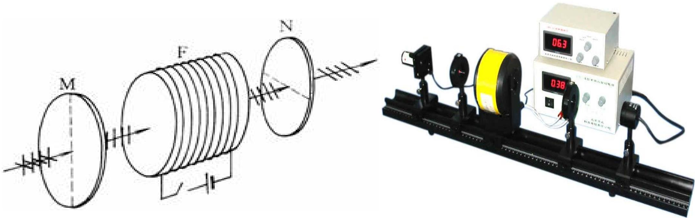
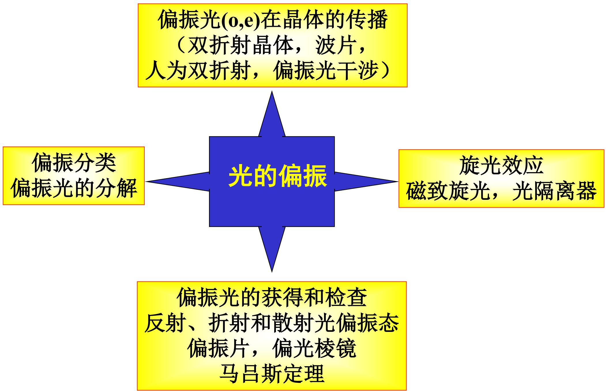

# 7.9.2 磁致旋光效应

> **脉络**：[[7.9.1 旋光现象与菲涅耳解释|天然旋光]]来自物质本身结构，线偏振光通过后偏振面旋转。本节讨论==磁致旋光效应==，也叫==法拉第效应==：原来没有旋光性的透明介质，在强磁场作用下产生旋光性，使线偏振光的偏振面旋转。它的重要特点是非互易性，往返通过时旋转角会相加。

### 一、 法拉第效应的历史意义

1845 年，法拉第研究电和磁对偏振光的影响。他用重玻璃做实验，发现原来没有旋光性的重玻璃在强磁场作用下产生旋光性，使线偏振光的偏振面发生偏转。

教材强调，这是人类第一次认识到电磁现象和光现象之间存在联系。后来麦克斯韦电磁场理论正是在法拉第场概念的基础上建立起来的。

从本章角度看，法拉第效应说明：

> 外磁场可以改变介质对不同圆偏振分量的响应，使介质表现出旋光性。

### 二、 磁致旋光实验装置

教材给出的装置可以概括为：

$$
P_1 \rightarrow \text{螺线管中的透明介质} \rightarrow P_2
$$

其中 $P_1$ 和 $P_2$ 的透振方向正交，透明介质样品放在螺线管内部。螺线管通电后，样品处于沿光传播方向的强磁场中。

实验过程为：

1. 单色平行自然光通过起偏器 $P_1$ 后变为线偏振光。
2. 若螺线管未通电，样品没有旋光性，$P_1\perp P_2$，透射光被 $P_2$ 阻挡。
3. 螺线管通电后，样品在强磁场作用下产生旋光性，出射线偏振光的振动面转过角度，于是有光从 $P_2$ 射出。
4. 若再把 $P_2$ 旋转某个角度 $\theta$，可以重新消光。

这说明磁致旋光后的出射光仍是线偏振光，只是振动面旋转了角度 $\theta$。这个现象和[[7.9.1 旋光现象与菲涅耳解释|天然旋光实验]]外观相似，但物理来源不同。

### 三、 旋转角公式

实验表明，在磁致旋光效应中，振动面旋转角 $\theta$ 满足：

$$
\theta=\nu lB
$$

其中：

- $\theta$ 是偏振面旋转角；
- $l$ 是光在介质中通过的距离；
- $B$ 是介质内的磁感应强度；
- $\nu$ 是比例系数，称为==维尔德常量==。

维尔德常量由介质性质决定，也与入射光波长有关。

这个公式和天然旋光中的：

$$
\varphi=\alpha d
$$

很像，但多了磁感应强度 $B$。天然旋光靠物质本身结构；磁致旋光靠外磁场诱导。

### 四、 天然旋光和磁致旋光的区别

教材特别强调，磁致旋光性与天然旋光性有重要差别。

#### 1. 天然旋光

天然旋光性的右旋或左旋取决于物质结构，与光的传播方向无关。

所以线偏振光往返两次通过天然旋光物质时，第二次沿相反方向传播，旋转会抵消第一次的旋转，振动面恢复到原先方位。

可以简单理解为：

$$
\theta_{\text{去}}+\theta_{\text{回}}=\theta-\theta=0
$$

#### 2. 磁致旋光

磁致旋光性的右旋和左旋与光相对于磁场的传播方向有关。

教材说：若光沿磁场方向传播时是左旋，那么逆着磁场方向传播时变为右旋。听起来像会抵消，但要注意观察方向和传播方向同时改变，实际对同一实验室参考方向来说，偏振面会继续朝同一物理方向旋转。

因此线偏振光往返两次通过磁致旋光物质时：

$$
\theta_{\text{总}}=\theta+\theta=2\theta
$$

也就是说，磁致旋光具有==非互易性==。光路反向后，旋转效果不是简单反向抵消，而是继续累加。

### 五、 为什么非互易性重要

非互易性是法拉第效应最有用的地方。

普通光学元件大多具有互易性：光正向通过和反向通过的效果相互抵消或对称。磁致旋光元件不同，反向传播时旋转角不抵消。

这可以用来制作：

- ==光隔离器==：允许光沿一个方向通过，阻止反射光沿原路返回；
- 光调制器：用磁场控制偏振面旋转，从而控制通过检偏器的光强；
- 其他利用非互易偏振旋转的器件。

教材最后也提到，利用磁致旋光的这种性质，可以制成光隔离器、光调制器等器件。

### 六、 和前面知识的联系

磁致旋光可以和前面几节这样联系：

- 和[[7.9.1 旋光现象与菲涅耳解释|天然旋光]]相同：出射光仍为线偏振光，只是偏振面旋转。
- 和[[7.8.1 人工双折射与光弹效应|人工双折射]]相同：外界作用改变介质光学性质。
- 和[[7.2.2 马吕斯定律及偏振态判别|检偏器消光]]有关：实验中通过旋转检偏器重新消光来测量旋转角。
- 和[[2.1.1 麦克斯韦电磁理论与波动方程|麦克斯韦电磁理论]]有关：法拉第效应是光现象和电磁现象存在联系的重要实验证据。

### 七、 本节需要记住的结论

> **结论一**：磁致旋光效应是透明介质在强磁场作用下产生旋光性，使线偏振光偏振面旋转的现象，也称法拉第效应。

> **结论二**：旋转角满足
> $$
> \theta=\nu lB,
> $$
> 其中 $\nu$ 为维尔德常量，取决于介质性质和光波长。

> **结论三**：天然旋光往返通过时旋转角抵消；磁致旋光往返通过时旋转角相加，得到 $2\theta$。

> **结论四**：磁致旋光的非互易性可用于光隔离器和光调制器。
