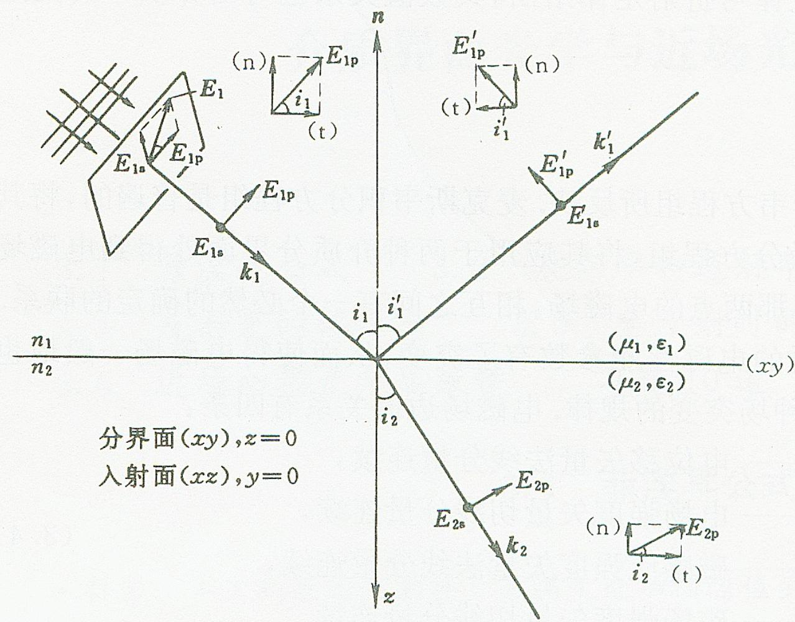

# 3.1.2 特征振动方向与局部坐标架 (p分量与s分量)

### 一、 引入特征振动方向的物理动机
由于光波是横波，其电场矢量 $\vec{E}$ 和磁场矢量 $\vec{H}$ 的振动方向必须垂直于光的传播方向（即**波矢 $\vec{k}$**）。因此，电场矢量 $\vec{E}$ 必然被限制在一个**垂直于波矢的平面**（等相面）内进行振动。

当一束任意偏振状态的光线**斜入射**到两种各向同性介质的交界面时，会产生以下复杂的几何状态：
1. **三维空间取向**：在我们建立的分析坐标系 $(x, y, z)$ 中，由于斜入射的光波传播方向（波矢，详见[[2.1.2 电磁波的横波与正交特性#^952b54]] $\vec{k}$）是倾斜的，那么垂直于它的对应平面也是倾斜的。因此，电场矢量 $\vec{E}$ 在该倾斜面上振动时，通常会同时具有 $E_x, E_y, E_z$ 三个不为零的空间坐标分量，呈现为三维空间中的任意倾斜取向。
2. **三维矢量计算的复杂性**：如果直接使用由 $x, y, z$ 三个分量组成的空间矢量来代入电磁场边界条件（例如要求在界面上的切线方向电场连续），情况会非常复杂。因为入射光、反射光和折射光的传播方向各不相同，意味着它们各自电场所在的垂直平面也各不相同。强行将这些处于不同倾斜面上的电场矢量分别向界面的切向和法向进行多重空间投影，会使得坐标分量之间发生严重的耦合，从而产生一组极其庞大且包含大量三角函数关系的多元连立方程组。

为了摆脱这种繁琐的三维空间代数运算，我们引入**入射面**的概念：由入射波矢 $\vec{k}_1$ 和介质界面的法线 $\vec{n}$ 共同决定的平面称为入射面。
**（空间关系明确）**：因为法线永远垂直于介质的分界面，所以这直接决定了**入射面永远是一个与介质“分界面”严格成 $90^{\circ}$ 垂直相交的平面**。

利用入射面，我们可以将任意方向振动的光波电场分解为两个互相正交且互相独立的特征偏振分量。这也直接规定了局部正交坐标架（$\vec{p}, \vec{s}, \vec{k}$）中三根坐标轴与“入射面”的绝对夹角关系：
1. **波矢 $\vec{k}$ 轴**：代表光的传播方向。由于入射面本身就是由 $\vec{k}$ 和法线框定出来的，所以 $\vec{k}$ 轴完全贴合在入射面内，**与入射面夹角为 $0^{\circ}$**。
2. **p 偏振分量 (Parallel)**（对应 $\vec{p}$ 轴）：其电场矢量的振动方向**平行**于入射面，即 $\vec{p}$ 轴也完全贴合在入射面的平面内部，**与入射面夹角为 $0^{\circ}$**。
3. **s 偏振分量 (Senkrecht)**（对应 $\vec{s}$ 轴）：其电场矢量的振动方向必须**垂直**于入射面，**与入射面夹角严格为 $90^{\circ}$**。（由于入射面垂直于介质分界面，这条与其偏离 $90^{\circ}$的 $\vec{s}$ 轴，刚好就完全平躺在了介质分界面上）。

根据电磁场边值关系可以证明，在各向同性介质中，这两种偏振分量在发生反射和折射时是完全独立且正交解耦的。也就是说，s偏振光的反射和折射光依然为s偏振，p偏振光的反射和折射光依然为p偏振。因此，我们可以将任意光波分别处理为独立的p分量和s分量。

### 二、 局部正交坐标架的构建
为了定量描述这两种偏振状态，我们需要为入射光、反射光和折射光分别建立一套随它们各自波矢方向（传播方向）变动的局部正交坐标架。
- **入射光坐标架 ($\vec{p}_1, \vec{s}_1, \vec{k}_1$)**：
  其中 $\vec{p}_1$ 平行于入射面，$\vec{s}_1$ 垂直于入射面，$\vec{k}_1$ 为入射波矢。这三个单位矢量构成一个右手直角坐标系，满足：
  $$ (\vec{p}_1 \times \vec{s}_1) // \vec{k}_1 $$
- **反射光坐标架 ($\vec{p}_1', \vec{s}_1', \vec{k}_1'$)**：
  这里 $\vec{k}_1'$ 为反射波矢。同样满足右手关系：
  $$ (\vec{p}_1' \times \vec{s}_1') // \vec{k}_1' $$
- **折射光坐标架 ($\vec{p}_2, \vec{s}_2, \vec{k}_2$)**：
  $\vec{k}_2$ 为折射波矢。同样满足右手关系：
  $$ (\vec{p}_2 \times \vec{s}_2) // \vec{k}_2 $$

**方向约定约定规则**：
在建立这些局部坐标架时，为使得计算一致，我们通常约定：
1. **s 矢量的正方向**：统一规定入射波、反射波和折射波的 s 矢量方向相同（例如图中全部指向纸面向外）。
2. **p 矢量的正方向**：由已定的 s 矢量方向和波矢 $\vec{k}$ 方向，依照右手螺旋定则 $(\vec{p} \times \vec{s}) // \vec{k}$ 唯一确定。

> **结论与应用（边值关系的“降维”解耦）：**
> 所谓的“降维”，是指利用这套针对光波特征建立的局部坐标架，将原本在三维空间中互相耦合的复杂**矢量代数方程**，拆解并降级为两个完全独立、极其简单的一维**标量（数值）等式**。
> 
> **具体推导与降维过程如下：**
> 
> **1. 初始状态：三维矢量形式的边界条件**
> 根据麦克斯韦方程组得出的电磁场边值关系，要求在两种无源介质的交接面上，两侧总电场 $\vec{E}$ 和总磁场 $\vec{H}$ 的**切向分量**必须连续相等。
> 假设此时有入射波(i)、反射波(r)和折射波(t)，那么在界面上必须满足以下三维矢量等式：
> $$ (\vec{E}_{i} + \vec{E}_{r})_{切向} = (\vec{E}_{t})_{切向} $$
> $$ (\vec{H}_{i} + \vec{H}_{r})_{切向} = (\vec{H}_{t})_{切向} $$
> 因为入射光、反射光、折射光传播方向各不相同，直接代入空间三维坐标 $(x,y,z)$ 分量去求切向的投影，必然是一个极其复杂的空间立体几何问题。
> 
> **2. 坐标架应用：利用空间几何关系直接消除投影的复杂度**
> 现在，我们将任意总场强 $\vec{E}$ 沿着我们新建立的局部坐标架分解为：$\vec{E} = E_p \vec{p} + E_s \vec{s}$。
> - 对于 **s 偏振分量**（垂直于入射面）：由于“入射面”本身就是垂直于“介质界面”建立的，所以垂直于入射面的 $\vec{s}$ 方向，天然就完全平躺在介质界面上。**这意味着 $E_s$ 天然就是 $100\%$ 的界面切向分量，不需要乘任何三角函数来做投影。**
> - 对于 **p 偏振分量**（平行于入射面）：电场 $\vec{E}_p$ 在入射面内振动，它与介质表面有一定倾斜夹角。根据几何关系，它的振动方向与界面的夹角，恰好等于波矢 $\vec{k}$ 的入射角/折射角 $\theta$ 的余角。因此，将 $E_p$ 投影到界面的切向方向上时，它的大小严格等于 $E_p \cos\theta$。
> 
> **3. 最终结果：降维后的标量代数方程**
> 因为各向同性介质不会改变光的偏振状态，s 分量和 p 分量的边界连续性是互不干扰的。原先庞大的三维矢量等式，直接坍缩分解成了两组简单的一元数值方程：
> 
> - **对于纯 s 偏振光（电场只有 s 分量）：**
>   电场的切向连续方程直接变为单纯的数值加法：
>   $$ E_{is} + E_{rs} = E_{ts} $$
>   （此时根据电磁波正交关系 $\vec{k} \times \vec{E}$，对应的磁场必然只在 p 方向，投影到界面的切向需乘余弦）：
>   $$ H_{is}\cos\theta_1 - H_{rs}\cos\theta_1' = H_{ts}\cos\theta_2 $$
> 
> - **对于纯 p 偏振光（电场只有 p 分量）：**
>   电场只在 p 方向，投影到界面的切向需乘余弦：
>   $$ E_{ip}\cos\theta_1 - E_{rp}\cos\theta_1' = E_{tp}\cos\theta_2 $$
>   （此时对应的磁场必然只在 s 方向，天然是切向不需要投影）：
>   $$ H_{ip} + H_{rp} = H_{tp} $$
> 
> **在这其中具体发生了什么？**
> 物理上，我们将任意光强行拆分为了两种极其特殊的“基底”（s光和p光）；几何上，s光的振动线完全与界面重合，p光的振动平面完全与界面垂直。
> 我们通过这种巧妙选取坐标系的方式，把复杂的空间三维矢量叉乘和投影运算，成功“降维”成了你在纸上用余弦函数就能直接写出来的普通代数等式。==这正是随后分别推导 p 光与 s 光独立菲涅耳公式（只用 $\cos\theta$ 与折射率运算）的数学与几何基础。==