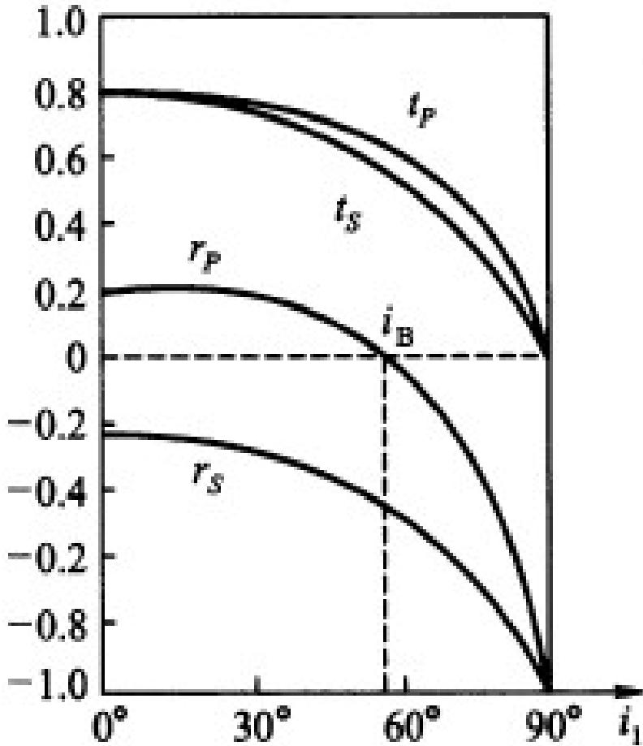

# 3.2.2 外反射与布儒斯特角 (Brewster's angle)

### 一、 外反射基本规律 ($n_1 < n_2$)
当光从光疏介质进入光密介质（例如从空气进入玻璃，折射率 $n_1 < n_2$）时发生的反射，称为**外反射**。
应用菲涅耳公式分析外反射过程可以发现，各分量的复振幅反射率随着入射角 $i_1$ 的增加并不是简单单调变化的。其中，s 偏振光和 p 偏振光的反射率呈现出不同的随角分布特征。如下方图线所示：

### 二、 布儒斯特角 (Brewster's angle) 与偏振
从图中可见，当我们增大入射角 $i_1$ 时，$p$ 偏振光的反射率 $r_p$ 会先减小后增加。在某一个特定的入射角度之下，$p$ 偏振分量的反射率恰好降为零（即 $\tilde{r}_p = 0$）。
这个使得反射光中 $p$ 分量完全消失的特定入射角，称为==布儒斯特角（或起偏振角）==，记作 $i_B$。

将其代入菲涅耳公式的 $\tilde{r}_p$ 表达式，令分子 $\tan(i_1-i_2) = 0$ 或分母趋于正无穷（即 $i_1 + i_2 = \frac{\pi}{2}$），通过折射定律化简可得计算公式：
$$ \tan i_B = \frac{n_2}{n_1} $$

**微观物理机制：光散射理论解释**
为什么在布儒斯特角入射时，$p$ 分量的反射光为零？
从电磁场的微观散射（天线辐射）理论来看，入射光进入第二介质后会激发原子中的电子发生受迫振动，这些振动的偶极辐射形成了反射光。偶极子具有一个普遍特性：它不会沿着自身振动的方向辐射电磁波。
当满足入射角为布儒斯特角 $i_B$ 时，折射角 $i_2$ 使得 $i_B + i_2 = 90^\circ$。此时由于 $p$ 偏振光的电场矢量始终平行于入射面并垂直于传播方向，第二介质中偶极子的受迫振动方向恰好完全平行于原本应该产生的反射光方向。因此，偶极子无法沿着反射光方向辐射能量，这就导致了在 $i_B$ 角度下反射光中不包含任何 $p$ 偏振成分。

> **结论与应用**：
> 1. 若以布儒斯特角 $i_B$ 入射，由于 $p$ 分量的消失，**反射光将变为纯 s 振动的完全线偏振光**。这种特性是起==偏振器==（如产生偏振光的光学玻璃堆）的理论基础。
> 2. 此时，反射光束与折射光束在空间中的传播方向必定相互垂直（即 $i_B + i_2 = 90^\circ$）。
> 3. **实际应用**：例如在摄影或驾驶时使用偏振墨镜，因为水面或马路（非金属表面）的外反射光中大部分是以 s 偏振为主的刺眼反光。如果我们利用偏振方向为纵向透光的眼镜过滤掉这部分呈横向（s 向）的反射光，就能大幅降低眩光干扰，看清水下或前方路面的细节。