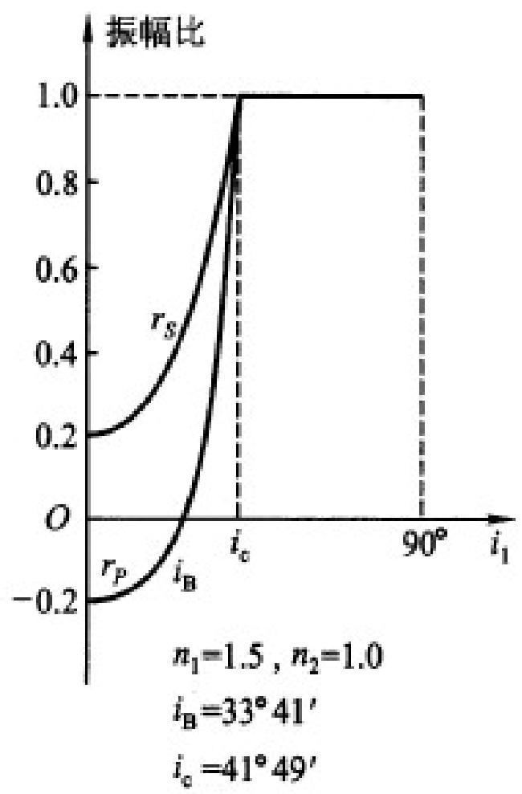

# 3.2.3 内反射与全反射临界角

### 一、 内反射规律与全反射临界角 ($n_1 > n_2$)
当光从光密介质射入光疏介质（例如从水射向空气，折射率 $n_1 > n_2$）时发生的反射，称为**内反射**。
根据折射定律 $\sin i_2 = \frac{n_1}{n_2} \sin i_1$，由于 $n_1 > n_2$，折射角 $i_2$ 始终大于入射角 $i_1$。
随着入射角 $i_1$ 的不断增大，折射角 $i_2$ 会先于 $i_1$ 达到 $90^\circ$。此时折射光线沿着两介质的交界面掠射。使得折射角 $i_2 = 90^\circ$ 的这个特定入射角，称为**全反射临界角**，记作 $i_c$。
由折射定律，令 $\sin i_2 = \sin 90^\circ = 1$，可得临界角的计算公式：
$$ i_c = \arcsin \frac{n_2}{n_1} $$

当入射角 $i_1 \ge i_c$ 时，光线无法进入第二种介质，所有的入射光能量全部返回第一介质，这种现象称为**全反射**。此时，反射光的能量等于入射光能量，说明反射光振幅的模值为 1。

> **注意**：
> 1. 在内反射情形下，依然存在使得 $p$ 分量反射率为零的布儒斯特角 $i_B$。
> 2. 由于 $\tan i_B = \frac{n_2}{n_1}$，且 $\sin i_c = \frac{n_2}{n_1}$，在三角函数数值关系上（因为 $\tan \theta > \sin \theta$ 当 $\theta \in (0, \pi/2)$），**全反射临界角恒大于布儒斯特角 ($i_c > i_B$)**。

### 二、 全反射时的相移（相位延迟）
当入射角 $i_1 > i_c$ 发生全反射时，虽然反射光能量 100% 返回（复振幅反射率的模值 $|r_p| = |r_s| = 1$），但由于光波在第二介质表层形成隐失波，导致反射光在边界处产生了一个特定的相位延迟（相移角 $\delta$）。
并且，$p$ 偏振分量和 $s$ 偏振分量产生的相移并不相等。

> [!abstract] 全反射相移公式定律
> 设相对折射率 $n = \frac{n_2}{n_1} < 1$，由菲涅耳公式推导出的全反射相移满足以下公式：
> **s 分量的额外相移 $\delta_s$：**
> $$ \tan \frac{\delta_s}{2} = \frac{\sqrt{\sin^2 i_1 - n^2}}{\cos i_1} $$
> **p 分量的额外相移 $\delta_p$：**
> $$ \tan \frac{\delta_p}{2} = \frac{\sqrt{\sin^2 i_1 - n^2}}{n^2 \cos i_1} $$
>
> *(补充说明：两公式来源于菲涅耳公式在 $i_1 > i_c$ 时代入复数运算得出的相角)*
> 
> ![[Pasted image 20260401102251.jpg]]
> ![[Pasted image 20260401102624.jpg]]

> **推论与应用（偏振态转换）**：
> 由于 $\delta_p \neq \delta_s$，当一束包含 $p$ 和 $s$ 分量的线偏振光发生全反射后，其 $p$ 分量和 $s$ 分量之间会产生一个固定的相位差 $\Delta\delta = \delta_p - \delta_s$。
> 这意味着，反射光不再是线偏振光，而是转化为**椭圆偏振光或圆偏振光**。在实际光学仪器中，正是利用这一原理设计了“菲涅耳菱体”等全反射延迟器件，用来改变光束的偏振状态。关于相移与半波损失的本质区别，详见 [[3.3.4 专题总结：半波损失与全反射相移的核心辨析]]。