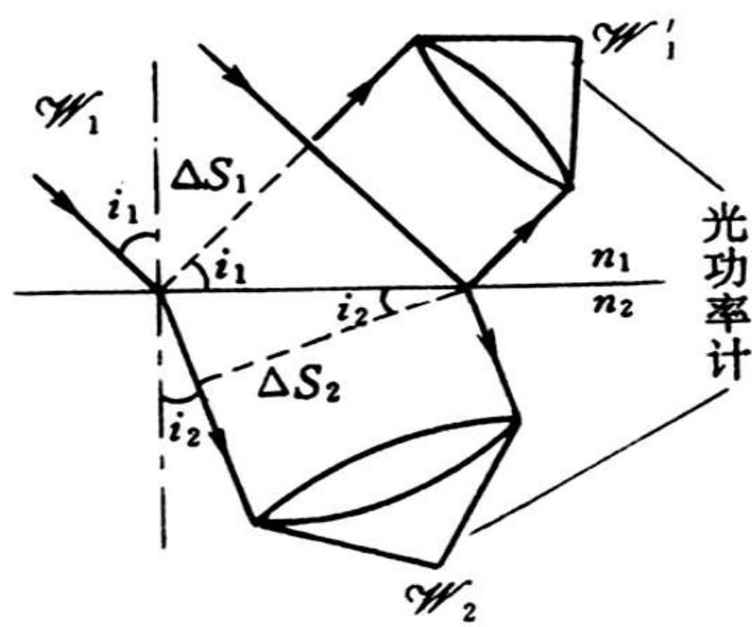

# 3.2.4 光强与光功率的反射透射率

### 一、 振幅透射率大于1的物理解释

根据前述菲涅耳公式计算透射振幅系数 $t$ 时，常会发现光从光密介质射向光疏介质时（即便垂直入射），透射系数 $t$ 的数值可能大于 1。这是否违反了能量守恒定律？

答案是不违反。光波电场振幅的增加并不等于光波总能量的增加。

我们规定光强 $I$（即平均能流密度大小，坡印廷矢量的时间平均值）与介质的折射率和电场复振幅平方存在如下正比关系：

$$ I = \frac{1}{2} \sqrt{\frac{\varepsilon}{\mu}} |\tilde{E}|^2 \propto n |\tilde{E}|^2 $$

这说明能流密度除了取决于电场的振幅大小 $|\tilde{E}|$ 外，还受到介质属性（以折射率 $n$ 为代表）的影响。当光折射进入光疏介质时，为了维持电磁场边界条件，虽然电场振幅 $|\tilde{E}|$ 被放大，但由于外侧介质的电磁阻抗变大（对应折射率降低），光强（单位面积上的能量传输率）受到抑制。
同理，我们定义单纯的光强反射率 $R$ 与光强透射率 $T$（即入射点处单位截面上的能流之比）为：（背诵）
  $$ R_{p,s} = \frac{I_{1p,s}'}{I_{1p,s}} = |\tilde{r}_{p,s}|^2 $$
  $$ T_{p,s} = \frac{I_{2p,s}}{I_{1p,s}} = \frac{n_2}{n_1} |\tilde{t}_{p,s}|^2 $$

### 二、 引入光功率反射/透射率（总截面的能量守恒）
上述光强 $I$ （能流密度）考量的只是波阵面上**单位面积**的能量传输。
物理上真正的能量守恒针对的是介质界面的总输入功率与总输出功率。
当一束截面积为 $A$ 的平行光束倾斜照射到界面上时，由于入射角 $i_1$ 和折射角 $i_2$ 不同，这束光在界面上方（入射/反射）和界面下方（折射）沿传播方向横截取的真实光束截面积是不一样的。
如图所示，假设光束打在界面上的光斑面积为 $S$，那么：
- 入射光束与反射光束的横截面积均为：$S \cos i_1$
- 折射光束的横截面积为：$S \cos i_2$

因此，必须把该面积变化因子修正进去，考察总光功率（功率 $W = I \cdot S_{\text{横截面}}$），才能得到满足守恒要求的光功率反射率 $\mathcal{R}$ 和光功率透射率 $\mathcal{J}$：（背诵）
$$ \mathcal{R} \equiv \frac{W_1'}{W_1} = \frac{I_1' \cdot S \cos i_1}{I_1 \cdot S \cos i_1} = R = |\tilde{r}|^2 $$
$$ \mathcal{J} \equiv \frac{W_2}{W_1} = \frac{I_2 \cdot S \cos i_2}{I_1 \cdot S \cos i_1} = \frac{\cos i_2}{\cos i_1} T = \frac{n_2 \cos i_2}{n_1 \cos i_1} |\tilde{t}|^2 $$

> [!abstract] 总能量守恒定律验证
> 根据代入完整的截面积修正后，光功率比必然满足反射加透射等于1的能量守恒要求。将菲涅耳公式精确代入计算，可得关系：
> $$ \mathcal{R} + \mathcal{J} = r^2 + \frac{n_2 \cos i_2}{n_1 \cos i_1} t^2 = 1 $$
> 
> ![[Pasted image 20260401105430.jpg]]
> ![[Pasted image 20260401105435.jpg]]
> 
> **结论**：
> 在计算光在界面处的能量分配时：
> - 振幅透射率 $t$ 可能会大于 1。
> - 纯光强（能流密度）透射率 $T$ 在某些条件下也可能会大于 1。
> - **但是真正的总光功率透射率 $\mathcal{J}$ 与反射率 $\mathcal{R}$ 必定服从 $\mathcal{R} + \mathcal{J} = 1$ 的限制，绝不可能大于 1。这也证实了只有考量总光功率，才符合宏观电磁能量守恒准则。**