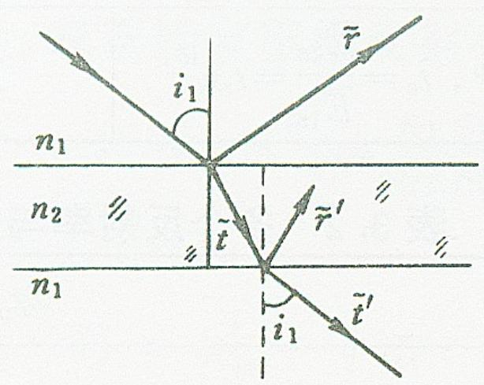
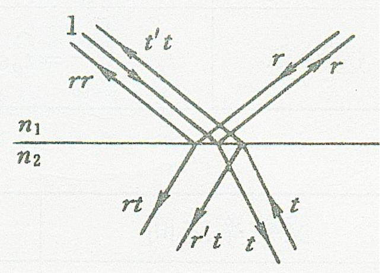

# 3.2.5 斯托克斯倒逆关系(光路可逆性)

### 一、 倒逆光路与可逆性原理
斯托克斯（Stokes）利用光学基本公理中的**光路可逆性原理**，不依赖麦克斯韦边界条件推导，直接从逻辑和能量守恒的角度，分析并找出了同一界面的正向与反向反射、透射系数之间的重要本质联系。

设定存在两个介质：入射介质 $n_1$ 和折射介质 $n_2$。
- **正向入射（$n_1 \rightarrow n_2$）**：在此方向下，设光波的振幅反射率为 $r$，振幅透射率为 $t$。
- **反向入射（$n_2 \rightarrow n_1$）**：若光直接从界面的另一侧逆向射入，设其振幅反射率为 $r'$，振幅透射率为 $t'$。

#### 1. 正向演化阶段
假设一束复振幅为 $1$ 的强光线从上方 $n_1$ 斜打向界面，它会被分解为了：
- 反射回 $n_1$ 中的光线，振幅为 $r$。
- 透射入 $n_2$ 中的光线，振幅为 $t$。

#### 2. 倒逆演化阶段（时光回退）
根据光路可逆性，如果我们现在在反射光 $r$ 和折射光 $t$ 的后方分别放置一面与其传播方向垂直的平面镜，使这两束光原路、原态返回：
- **返回的光线 $r$（在 $n_1$ 中向下传播）**：面临 $n_1 \rightarrow n_2$ 的界面。此时它又会产生反射波 $r \cdot r = r^2$（反射向斜上方），和透射波 $r \cdot t$（透射进入 $n_2$ 斜下方）。
- **返回的光线 $t$（在 $n_2$ 中向上传播）**：面临的是 $n_2 \rightarrow n_1$ 的界面（**即反向入射**）。此时它将产生反射波 $t \cdot r'$（反射回 $n_2$ 斜下方），和透射波 $t \cdot t'$（透射进入 $n_1$ 斜上方）。

### 二、 导出斯托克斯关系式 (Stokes Relations) （期末要记住，
根据光路可逆性，上述两束返回界面的波会重组并还原为唯一的一束初态主光线（即振幅等于 1，且沿着原入射光路的逆方向传播），并且周围空间不会产生其他的光线。所以：
- **在上方介质 1 侧（沿着原入射逆光路）**：由返回光线 $r^2$ 和 $t \cdot t'$ 组合而成，二者叠加必须还原回强度为 1 的光源自身。
- **在下方介质 2 侧（多余的方向）**：由向下延伸的光线 $r \cdot t$ 和 $t \cdot r'$ 构成。由于原初态在这种光路上并没有光源存在，这部分光线必须纯粹因为干涉而彻底抵消，即叠加结果为 0。

由此可列出两道代数方程：
$$
\left\{ \begin{array}{l} r t + t r' = 0 \\ r^2 + t t' = 1 \end{array} \right. \Longrightarrow \left\{ \begin{array}{l} r = - r' \\ t t' = 1 - r^2 \end{array} \right.
$$

> **重要物理推论**：
> 1. **$r = -r'$**：这一关系式证明，光疏介质到光密介质的反射系数，与从光密介质到光疏介质的反射系数大小相等，但**符号相反**。这个负号是光波在某些特定界面反射时会发生**半波损失（即反射光发生 $\pi$ 的相位突变）**的理论基础（将在 [[3.3.1 反射光的相移突变与半波损失|3.3.1]] 节详细探讨）。
> 2. **$t t' = 1 - r^2$**：该式证明从正反两面透射率乘积与单面反射率平方存在特定的恒等关系，进一步由于介于无附加电磁条件而自证了光功率的能量守恒规则（呼应 [[3.2.4 光强与光功率的反射透射率]]）。