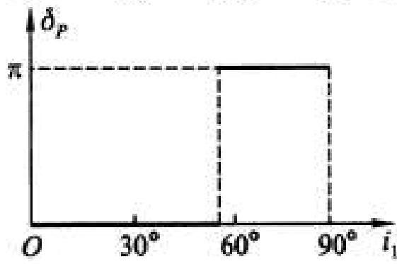
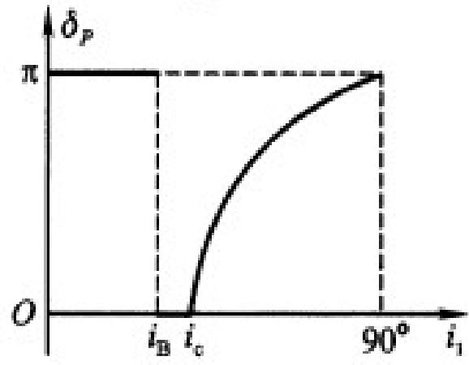

# 3.3.1 反射光的相移突变与半波损失

### 一、 反射引起的相移现象
在应用菲涅耳公式计算反射光与入射光的复振幅比值时，我们发现反射系数 $r_p$ 和 $r_s$ 在某些入射角条件下会出现负号。
在复数表示法中，负号代表着反射光的相位与入射光的相位之间存在 $\pi$ （即 $180^\circ$）的相位差。这种在反射瞬间发生的相位跳变，等效于光波在传播光程上突然增加或减少了半个波长（$\lambda/2$），因此在物理光学中被称为**半波损失 (Half-wave Loss)**。

这一现象的物理本质来源于电磁场边界条件。在光波从光疏介质射向光密介质的边界上，由于高折射率介质对电磁波传播的阻碍作用变强，为了满足交界面上切向电场连续（$E_{1t} = E_{2t}$）的要求，反射光电场的振动方向必须发生反转（与入射光反向相消）以符合边界的受迫平衡。这就在宏观上表现为 $\pi$ 的相位突变。

### 二、 半波损失发生的条件规律
> **结论**：结合菲涅耳公式中 $r_s$ 与 $r_p$ 分子的正负变化规律，我们可以总结出发生半波损失的严格条件。在后续的薄膜干涉理论计算光程差时，必须根据以下规律判断是否需要给光程差补充 $\pm \lambda / 2$ 的附加项：

1. **正入射（垂直入射）或近法向入射时**：
   - 若 $n_1 < n_2$ （光疏介质射向光密介质，即外反射），此时 $r_s$ 和 $r_p$ 均出现负号，**必定发生**半波损失。
   - 若 $n_1 > n_2$ （光密介质射向光疏介质，即内反射），其符号为正，**不发生**半波损失。
2. **掠射时（入射角 $i_1 \rightarrow 90^\circ$）**：
   - 无论是外反射还是内反射，在掠射极限条件下，反射波的相位都会发生 $\pi$ 的突变，此时**必定存在半波损失**。

*(附图：内反射发生全反射后的连续相移状况，需注意这与半波损失的 $\pi$ 突变有所区别，详见 [[3.3.4 专题总结：半波损失与全反射相移的核心辨析]])*
