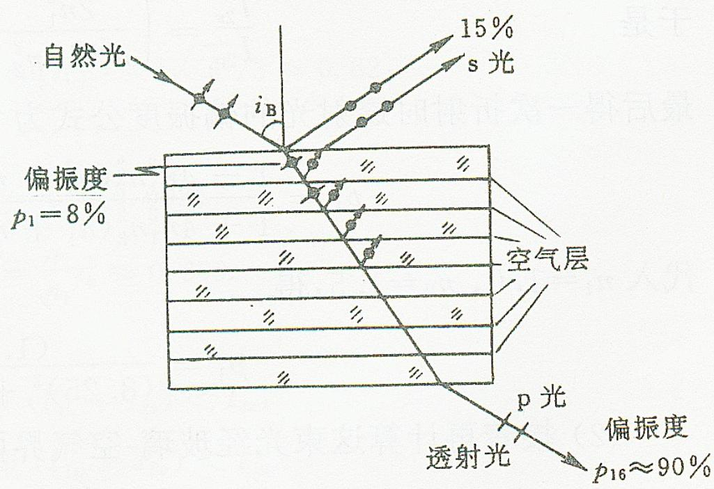

# 3.3.2 偏振态变换与玻片组起偏

### 一、 界面反射与折射对自然光偏振态的改变
当自然光（其中 $p$ 分量和 $s$ 分量的光强相等且相位无固定关联）斜入射到两种各向同性介质的交界面时，根据菲涅耳公式的计算结果可以知道：
在大多数入射角下，由于 $s$ 偏振分量的反射率 $R_s$ 始终大于 $p$ 偏振分量的反射率 $R_p$，而相对应的透射率 $T_p$ 始终大于 $T_s$。
这导致在一次反射和折射之后，能量的分配发生倾斜：
- **反射光**中富含更多的 $s$ 偏振分量。
- **折射（透射）光**中富含更多的 $p$ 偏振分量。
因此，原本的自然光经过一次界面分配后，反射光和折射光都变成了**部分偏振光**。

### 二、 透射玻片组起偏器原理
在前面 [[3.2.2 外反射与布儒斯特角]] 中提到，若让自然光以布儒斯特角 $i_B$ 入射，反射光中 $p$ 分量的反射率 $R_p = 0$，此时反射光将转变为完全的 $s$ 线偏振光。
但是，由于单块玻璃表面的反射能力有限（空气-玻璃界面的 $R_s$ 仅约 15% 左右），单次反射获取的完全线偏振光光强往往过于微弱，在实际光学工程中难以作为高强度强偏振光源使用。

为了获得足够高强度且纯净度高的线偏振光，实际应用中通常采用截取其**强透射光路**的方案，由此设计了“**玻片组起偏器**”。
**工作原理**：
将多块平行的透明玻璃平板叠放在一起组成玻片堆，令自然光同样以布儒斯特角 $i_B$ 连续穿过这些薄片。
1. 在每一次界面透射中，由于 $R_p = 0$，所以 $p$ 分量的透射率 $T_p = 100\%$，能够无损耗地穿透一层又一层界面。
2. 而对于 $s$ 分量，每一次经过界面时都会有大约 15% 的能量被反射滤除（未能透射）。

> **结论与应用**：
> 经过大量平行界面重重不断的滤除之后，只要加入玻片的层数足够多（例如十几片），透射光束中残存的 $s$ 分量将呈指数级衰减至微乎其微。
> 最终，透射出来的光束将是一束几乎只包含 $p$ 振动分量的、极其明亮且高纯度的==完全线偏振光（p 偏振光）==。这也是通过叠加透射提取高强度起偏光的经典工程手段。