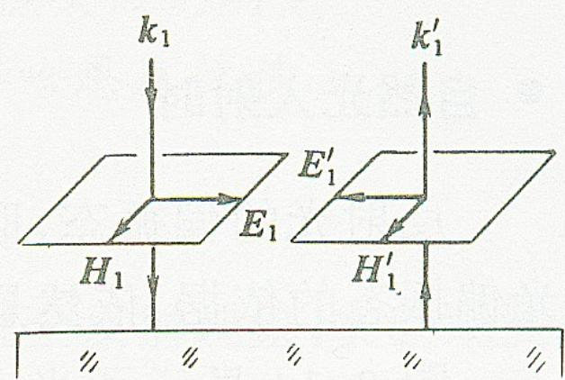
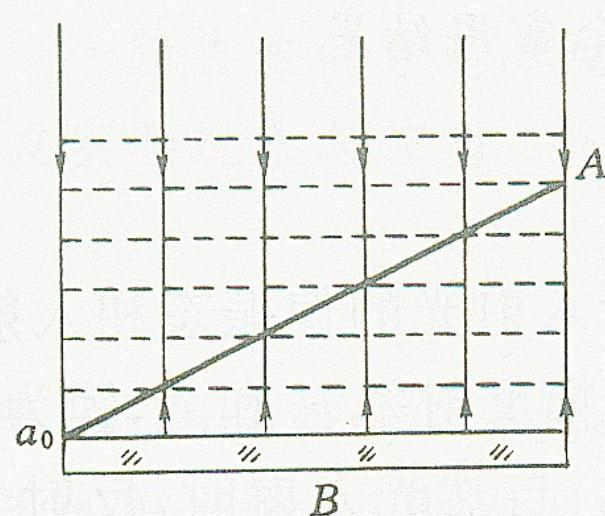
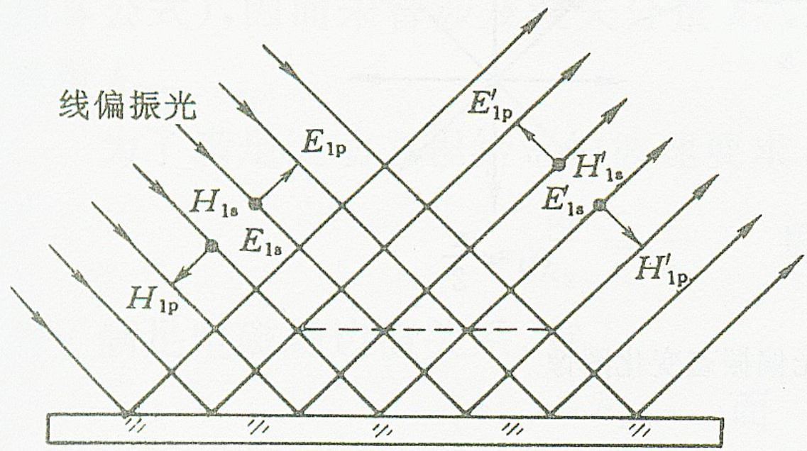

# 3.3.3 维纳实验 (光波发生物理作用的本源)

### 一、 探究电磁波中光矢量的本质
光是电磁波。麦克斯韦方程组表明，电磁波在传播时同时包含电场矢量 $\vec{E}$ 和磁场矢量 $\vec{H}$，且二者相互正交。
在光学研究的历史上，随之而产生的一个核心问题是：在引起物质化学感光反应（如照相底片的曝光）、光电效应（如激发电子）以及视觉神经冲动过程的光波-物质相互作用中，真正起主导作用的究竟是电场分量 $\vec{E}$，还是磁场分量 $\vec{H}$？

根据微观电磁学理论计算的洛伦兹磁力的作用功效可知，由于光波的传播速度等于真空中光速 $c$，在相同电磁场强度下，光频电磁场对原子内部电子施加的作用力主要由电场部分提供（$\vec{F} = q(\vec{E} + \vec{v} \times \vec{B})$ 中，第一项 $\vec{F}_E$ 的大小比第二项 $\vec{F}_B$ 的作用强约 ${10}^8$ 量级）。
为了用实验直观验证这一点，维纳 (O. Wiener) 巧妙设计了驻波干涉实验。

### 二、 维纳 (Wiener) 实验与驻波验证 (1890)
**1. 实验原理与设计思想：**
维纳利用光在反射面上具有特定相位突变规律（[[3.3.1 反射光的相移突变与半波损失]]）来使电场和磁场的干涉特征分离开。
当光垂直照射在第一表面为完全导体（高反射率的厚水银膜片）的镜面上时，入射光与反射光沿着相反而重合的路径传播，二者干涉会形成稳定的光波电磁驻波场。
根据理想导体的电磁学边界条件：
- **电场切向分量 $\vec{E}_t$** 必须为零。这意味着此时电场的反射光相比入射光有 $\pi$ 的相移，两者的合成电场在镜面上形成**波节（合成振幅为零点）**。
- **磁场切向分量 $\vec{H}_t$** 的反射光相比入射波并没有相位突变。其合成磁场在紧贴镜面处干涉相长，形成**波腹（合成振幅达到最大）**。

因此，紧靠镜面的空间分层内，电场 $\vec{E}$ 和磁场 $\vec{H}$ 的能量极大、极小位置是错开的（间隔 $\lambda/4$）。这为分离观察创造了条件。

**2. 实验过程与结果：**
维纳使用了一层厚度极其均匀细微的透明照相乳胶膜（厚度仅为波长的 $\sim 1/30$），使其斜放截过整个电磁驻波场，从而能将波腹波节的不同横截面转化为胶片长度方向上具有物理间隔的带状特征。
洗影显影后，如果起感光作用的是磁场，那么在紧贴金属镜面的区域胶片应当严重黑化（因为产生感光作用最强的波腹在此）。
但实际观察的暗纹间隔分布表明，**直接贴合金属表面处的胶片并未曝光变黑，没有任何银粒还原的痕迹**，而在距离表面 $\lambda/4$ 远处出现了第一条最亮（最黑）的感光条纹。这与处于波节的电场空间分布结果完全吻合！

**3. 进一步的维纳实验（ $45^\circ$ 斜入射的决定性验证）：**
为了彻底排除干扰，使结论绝对令人信服，维纳又设计了一个更为巧妙的对比验证实验。他让光以严格的 $45^\circ$ 角斜入射到反射镜面上，此时入射光束与反射光束的夹角恰好为 $90^\circ$（互相垂直）。他分别使用 $s$ 偏振光和 $p$ 偏振光进行照射，并记录胶片的感光结果。

这个实验基于一个核心的波的干涉原理：**只有振动方向互相平行的几何矢量才能发生干涉（产生明暗相间的驻波条纹），而振动方向互相垂直的几何矢量叠加后只会形成均匀的能量场，不会产生干涉明暗条纹。**

- **对于 $s$ 偏振光照射：**
  $s$ 光的电场 $\vec{E}_{1s}$ 始终垂直于入射面。因此，入射光电场 $\vec{E}_{1s}$ 和反射光电场 $\vec{E}'_{1s}$ 在空间中是**完全平行**的，它们能够发生完美的干涉，在空间中形成强弱相间的**驻波干涉**场。
  与其对应的磁场 $\vec{H}_{1p}$ 则躺在入射面内，由于入射光束和反射光束几何空间夹角为 $90^\circ$，这两个磁场矢量 $\vec{H}_{1p}$ 和 $\vec{H}'_{1p}$ 在空间中是**相互垂直**的，它们无法发生干涉，只在空间中贡献一片**均匀的磁场能量**。
  **【实验结果】**：胶片上清晰地**记录到了明暗相间的干涉条纹**。这证明了能够发生干涉的电场起到了决定性感光作用。

- **对于 $p$ 偏振光照射：**
  $p$ 光的电场 $\vec{E}_{1p}$ 躺在入射面内，同理，由于光束夹角 $90^\circ$，入射光电场 $\vec{E}_{1p}$ 和反射光电场 $\vec{E}'_{1p}$ **相互垂直**，它们无法干涉，只能在此处形成**均匀的电场能量分布**。
  与其对应的磁场 $\vec{H}_{1s}$ 则垂直于入射面，入射光磁场 $\vec{H}_{1s}$ 和反射光磁场 $\vec{H}'_{1s}$是**完全平行**的，它们在空间中发生了干涉，形成了**磁场的驻波条纹**。
  **【实验结果】**：胶片上只记录到了一片**均匀的黑度（即没有出现任何条纹）**。这确凿地证明了：即便磁场在空间里形成了明暗相间的干涉条纹，胶片也根本“看不见”它，乳胶的感光发黑完全是由那片均匀分布的电场所导致的。

> **核心结论**：
> 维纳实验（特别是 $45^\circ$ 斜入射对照实验）通过对感光驻波场的细微观察，以无可争辩的确凿事实验证了：
> 能够激发光化学效应和光电效应、强趋电子及产生物质相互作用的微观原动力，**仅仅只归结于电场矢量分量**，而磁场没有起任何可观测的作用。在此后的物理光学发展中，我们通常将==电场矢量 $\vec{E}$ 正式定义为光矢量==。在研究偏振和波前时，所指的也是 $\vec{E}$ 矢量的方向。