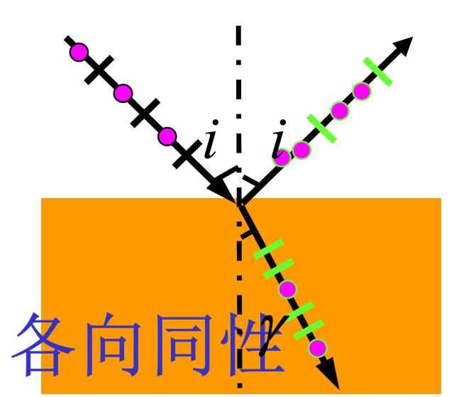
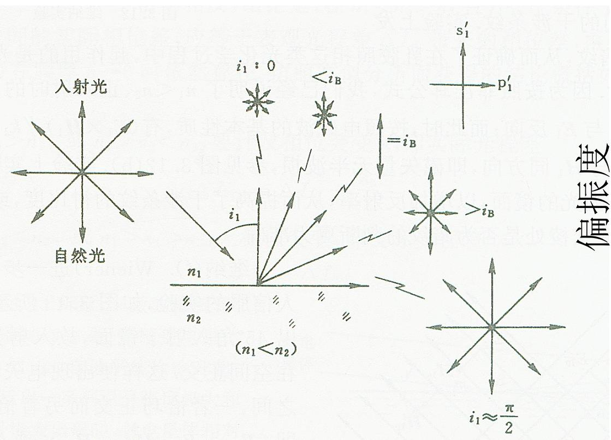
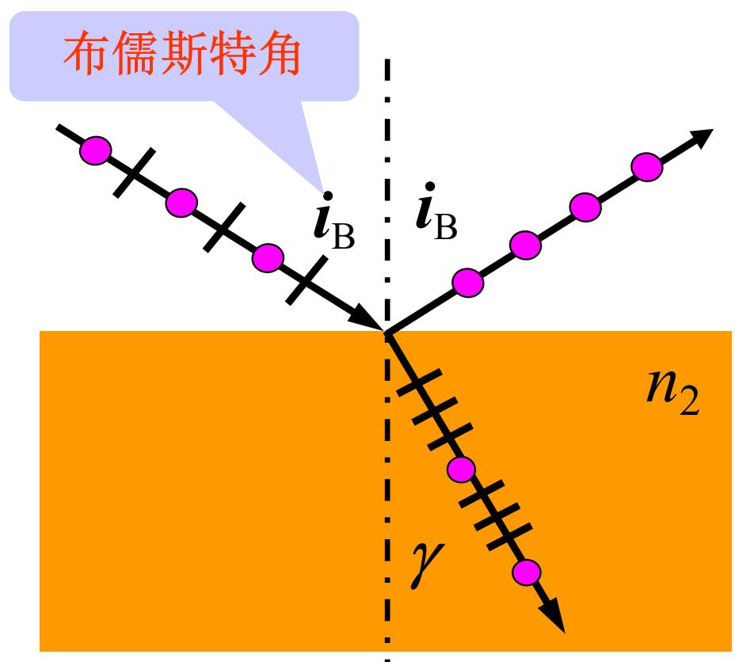
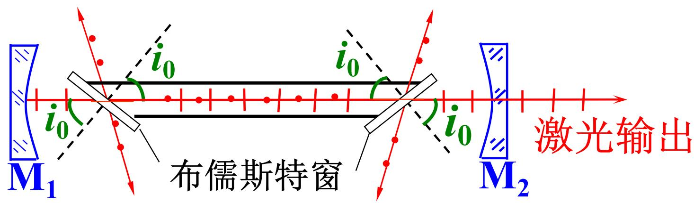

# 3.3.6 反射光的偏振态演变图解与布儒斯特窗应用

### 一、 自然光入射时的偏振态演变
当一束自然光（其电场振动的 $p$ 分量和 $s$ 分量光强均等）入射到两种各向同性介质的分界面上时，由于菲涅耳反射系数的不同（在相同入射角下，能量反射率 $R_s > R_p$），反射光和折射光均会由自然光规律性地转变为部分偏振光。

1. **反射光的分量特征**：由于垂直振动（$s$ 分量）的反射率始终大于等于平行振动（$p$ 分量），因此在反射光中，垂直振动的能量逐渐占据绝对多数。
2. **折射光的分量特征**：由于介质吸收极小，根据能量守恒律，多余的并未被反射的 $p$ 分量自然进入折射光部分。因此在透射的光束中，平行振动（$p$ 分量）必定多于垂直振动（$s$ 分量）。

从光疏介质射入光密介质时，随着入射角 $i$ 从 $0^\circ$ 逐渐增大，反射光中 $p, s$ 两分量的光强（正比于振幅平方）变化曲线如下图所示：

### 二、 布儒斯特角与反射光极化现象
如上图所示，当入射角增大到某一特定角度 $i_B$ 时，满足布儒斯特定律：
$$ \tan i_B = \frac{n_2}{n_1} $$

此时将出现以下物理现象：
1. **$p$ 分量反射彻底消失**：反射光中的 $p$ 分量光强直接降为了 $0$（即 $R_p = 0$）。
2. **反射光变为纯偏振光**：由于 $p$ 分量消失，此时的反射光仅包含唯一的 $s$ 振动分量，变成一束**振动方向完全垂直于入射面**的完美线偏振光。
3. **反射与折射光线的几何正交**：严格处于该入射角时，根据折射定律推导，反射波矢的传播方向与折射波矢的传播方向互相垂直，即满足几何关系： $i_B + \gamma = 90^\circ$。

> **注意辨析：**
> 尽管在布儒斯特角处，反射光夺走了大部分的 $s$ 分量且没有任何 $p$ 分量，但折射光中依然透过了全部的入射 $p$ 分量以及残留未被反射走的 $s$ 分量。因此，**这时的折射光偏振化程度虽然达到了全局最高点，但其依然包含了 $s$ 与 $p$ 两种成分，仅仅是部分偏振光，并非完全偏振光**。若想获取纯透射偏振，需使用玻片组叠加法（详见 3.3.5 节）。

### 三、 偏振态控制工程：布儒斯特窗在激光器中的应用
在部分光学仪器中（特别是外腔式气体激光器），如果光束在谐振腔内两块反射镜之间来回穿梭并多次通过工作放电管截面，普通垂直安装的玻璃窗（石英管口）每次都会产生一定比例的光强反射损耗，这种损耗在几百次往复谐振累积后将引发激光能量的巨大浪费，同时输出光束的偏振方向是不确定的。

为了获得高偏振度且消除透射损耗的激光束，工程上通常在激光气体放电管的两端，安装与光轴法线夹角严格等于**布儒斯特角**的光学玻璃窗，这被称为**布儒斯特窗 (Brewster Window)**。

**物理选模机制：**
1. **无损透射对于 $p$ 偏振光**：当激光在谐振腔内部平行于主光轴传播并抵达布儒斯特窗时，由于窗体倾置角刚好满足布儒斯特定律，此时 $R_p = 0$。这意味着 $p$ 偏振光在穿过玻璃窗层时，几乎处于**零反射透射**状态。在后续千百次的谐振往返中，它能极其高效地积聚能量并避开严重的镜面反射损耗。
2. **高频损耗对于 $s$ 偏振光**：相反，对于 $s$ 偏振光而言，它每次穿透该玻璃窗口，表面都会强制反射掉约 $10\% \sim 15\%$ 的能量。在谐振腔内不断往复振荡的过程中，这一高昂的反射亏损将被指数级放大放大。
3. **输出结果**：受激辐射在增益竞争的过程中，占据绝对低能量损耗优势的 $p$ 偏振光得到了充分放大，而 $s$ 偏振光分量因远高于其增益的损耗而无法起振。最终从半透反射镜射出的输出激光，便自动成为一束极其纯净的**高度平行偏振（$p$ 分量）激光**。